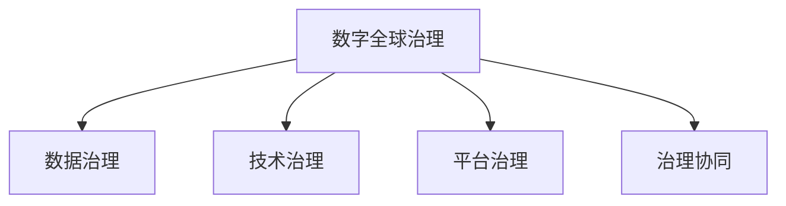
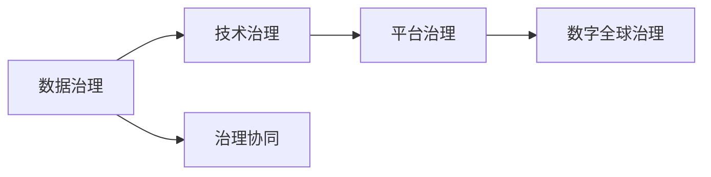

                 

## 1. 背景介绍

### 1.1 问题由来
随着全球化进程的不断深入，国际社会的联系日益紧密，经济、文化、环境等多个领域相互交织。在这样的背景下，传统上以主权国家为核心的全球治理体系，已无法满足复杂多变的国际环境需求。尤其在新冠肺炎疫情、气候变化、数字鸿沟等全球性问题面前，传统治理模式显得力不从心。

为了应对这些挑战，亟需构建一套新的全球治理体系，既能适应快速变化的国际形势，又能兼顾各国主权与利益。而随着数字技术的迅猛发展，数字化、网络化的治理模式开始成为一种新的探索方向。

### 1.2 问题核心关键点
在数字化时代，全球治理体系需要从传统的以物理世界为主导的模式，转向以虚拟空间为核心的数字全球治理模式。这一转变要求：
- **数据治理**：如何在全球范围内规范数据收集、存储、使用和共享，保障数据安全和隐私。
- **技术治理**：如何协调不同国家在技术标准、知识产权、网络安全等方面的利益冲突。
- **平台治理**：如何构建公正、开放、透明的平台治理机制，确保技术创新的公平与可控。
- **治理协同**：如何构建跨国的协同治理机制，促进多边合作，应对全球性挑战。

## 2. 核心概念与联系

### 2.1 核心概念概述
#### 2.1.1 数字全球治理(Digital Global Governance)
数字全球治理是指在数字化时代，全球治理主体通过信息技术手段，实现对虚拟空间中的社会、经济、环境等活动进行规范、管理和监督的过程。

#### 2.1.2 数据治理(Data Governance)
数据治理是指在数据生命周期的各个阶段，对数据的收集、存储、使用、共享和销毁进行管理和规范的过程。

#### 2.1.3 技术治理(Technology Governance)
技术治理是指在技术创新的全过程，对技术的研发、知识产权、标准制定、应用推广、安全监管等进行管理和规范的过程。

#### 2.1.4 平台治理(Platform Governance)
平台治理是指对在数字平台上进行的活动进行规范、管理和监督的过程，确保平台的公正性、透明性和包容性。

#### 2.1.5 治理协同(Governance Synergy)
治理协同是指不同国家、国际组织、私营部门等主体，通过多边合作，共同制定和实施全球治理规则的过程。

这些概念之间的逻辑关系可以通过以下Mermaid流程图来展示：



这个流程图展示了一系列相关概念之间的联系，强调了它们共同构成了数字化时代的全球治理体系。

### 2.2 核心概念原理和架构的 Mermaid 流程图



这个流程图展示了数据治理、技术治理、平台治理、数字全球治理和治理协同之间的内在联系和协同作用。

## 3. 核心算法原理 & 具体操作步骤

### 3.1 算法原理概述

数字全球治理的核心在于通过数据、技术和平台等数字化手段，实现对全球治理活动的规范和监督。其算法原理主要包括以下几个方面：

1. **数据治理算法**：通过大数据分析、机器学习等技术，对全球数据进行全面监测和分析，识别数据使用中的问题，制定相应的治理规则。
2. **技术治理算法**：通过人工智能、区块链等技术，对技术创新的过程进行监管，确保技术应用的公平性和安全性。
3. **平台治理算法**：通过算法推荐、内容审核等技术手段，确保数字平台上的活动符合规范，保护用户权益。
4. **治理协同算法**：通过分布式算法和多边合作协议，实现不同国家、国际组织、私营部门等主体之间的协同治理。

### 3.2 算法步骤详解

#### 3.2.1 数据治理算法步骤
1. **数据采集**：通过传感器、互联网、社交媒体等渠道，收集全球范围内的数据。
2. **数据清洗**：对收集到的数据进行清洗，去除噪音和异常值。
3. **数据分析**：使用机器学习算法对数据进行分析，识别数据中的模式和趋势。
4. **数据治理**：基于分析结果，制定数据使用规则，确保数据安全和隐私。

#### 3.2.2 技术治理算法步骤
1. **技术标准制定**：通过专家评审、公众咨询等方式，制定技术标准和规范。
2. **技术评估**：使用人工智能算法对技术方案进行评估，确保技术应用的公平性和安全性。
3. **技术推广**：通过技术转让、合作研发等方式，推广先进技术的应用。
4. **技术监管**：对技术应用进行实时监控，确保技术使用符合规范。

#### 3.2.3 平台治理算法步骤
1. **平台设计**：根据平台治理原则，设计平台的结构和功能。
2. **内容审核**：使用算法对平台内容进行审核，确保内容符合规范。
3. **用户管理**：使用算法对用户行为进行管理，保护用户权益。
4. **平台监控**：对平台活动进行实时监控，确保平台运营符合规范。

#### 3.2.4 治理协同算法步骤
1. **多边合作协议制定**：通过国际谈判，制定多边合作协议。
2. **协同治理机制建立**：建立跨国协同治理机构，负责实施多边协议。
3. **信息共享**：通过区块链等技术，实现各国间的信息共享。
4. **协同决策**：使用分布式算法，实现各国间的协同决策。

### 3.3 算法优缺点

#### 3.3.1 数据治理算法的优缺点
**优点**：
- 能够全面监测全球数据使用情况，及时发现和解决问题。
- 使用机器学习算法，提高了数据治理的效率和精度。

**缺点**：
- 对数据的依赖性强，数据缺失或不完整会影响分析结果。
- 需要处理大规模数据，对计算资源要求高。

#### 3.3.2 技术治理算法的优缺点
**优点**：
- 能够确保技术创新的公平性和安全性。
- 使用人工智能算法，提高了技术治理的效率和精度。

**缺点**：
- 技术标准制定复杂，需要多方协调。
- 技术监管难度大，存在技术滥用的风险。

#### 3.3.3 平台治理算法的优缺点
**优点**：
- 能够确保平台上的活动符合规范，保护用户权益。
- 使用算法推荐和内容审核技术，提高了平台治理的效率和精度。

**缺点**：
- 对平台的依赖性强，平台设计不合理会影响治理效果。
- 用户行为复杂，需要不断优化算法。

#### 3.3.4 治理协同算法的优缺点
**优点**：
- 能够实现不同国家、国际组织、私营部门等主体之间的协同治理。
- 使用分布式算法和多边合作协议，提高了治理的效率和公平性。

**缺点**：
- 国际谈判复杂，需要克服多方利益冲突。
- 信息共享和协同决策难度大，需要克服技术和机制障碍。

### 3.4 算法应用领域

数字全球治理的算法在多个领域都有广泛的应用，具体如下：

#### 3.4.1 公共卫生治理
通过数据治理技术，监测全球疫情数据，制定防疫措施；通过技术治理算法，开发疫苗和药物；通过平台治理算法，建立公共卫生信息平台；通过治理协同算法，实现国际间的防疫合作。

#### 3.4.2 环境治理
通过数据治理技术，监测全球环境数据，识别污染源；通过技术治理算法，开发清洁能源技术；通过平台治理算法，建立环境信息平台；通过治理协同算法，实现国际间的环保合作。

#### 3.4.3 金融治理
通过数据治理技术，监测全球金融数据，识别金融风险；通过技术治理算法，制定金融监管规则；通过平台治理算法，建立金融交易平台；通过治理协同算法，实现国际间的金融合作。

#### 3.4.4 教育治理
通过数据治理技术，监测全球教育数据，评估教育效果；通过技术治理算法，开发教育技术；通过平台治理算法，建立在线教育平台；通过治理协同算法，实现国际间的教育合作。

## 4. 数学模型和公式 & 详细讲解 & 举例说明

### 4.1 数学模型构建

数字全球治理的数学模型主要包括以下几个方面：

1. **数据治理模型**：使用大数据分析技术，构建数据治理模型，对全球数据进行监测和分析。
2. **技术治理模型**：使用人工智能算法，构建技术治理模型，对技术应用进行评估和监管。
3. **平台治理模型**：使用算法推荐和内容审核技术，构建平台治理模型，确保平台活动符合规范。
4. **治理协同模型**：使用分布式算法和多边合作协议，构建治理协同模型，实现国际间的协同治理。

### 4.2 公式推导过程

#### 4.2.1 数据治理模型
设 $D=\{d_1,d_2,...,d_n\}$ 为全球数据集，其中 $d_i$ 为第 $i$ 个数据点，使用大数据分析技术 $A$ 对其进行分析，得到数据使用情况 $U=\{u_1,u_2,...,u_n\}$。数据治理模型为：
$$
G_U = \sum_{i=1}^n A(d_i)u_i
$$
其中 $G_U$ 为数据治理得分，$A(d_i)$ 为大数据分析技术对 $d_i$ 的分析结果，$u_i$ 为数据使用情况。

#### 4.2.2 技术治理模型
设 $T=\{t_1,t_2,...,t_m\}$ 为技术方案集，其中 $t_i$ 为第 $i$ 个技术方案，使用人工智能算法 $B$ 对其进行评估，得到技术应用情况 $V=\{v_1,v_2,...,v_m\}$。技术治理模型为：
$$
G_V = \sum_{i=1}^m B(t_i)v_i
$$
其中 $G_V$ 为技术治理得分，$B(t_i)$ 为人工智能算法对 $t_i$ 的评估结果，$v_i$ 为技术应用情况。

#### 4.2.3 平台治理模型
设 $P=\{p_1,p_2,...,p_k\}$ 为平台活动集，其中 $p_i$ 为第 $i$ 个平台活动，使用算法推荐技术 $C$ 和内容审核技术 $D$ 对其进行管理，得到平台活动情况 $W=\{w_1,w_2,...,w_k\}$。平台治理模型为：
$$
G_W = \sum_{i=1}^k C(p_i)w_i + \sum_{i=1}^k D(p_i)w_i
$$
其中 $G_W$ 为平台治理得分，$C(p_i)$ 为算法推荐技术对 $p_i$ 的管理结果，$D(p_i)$ 为内容审核技术对 $p_i$ 的管理结果，$w_i$ 为平台活动情况。

#### 4.2.4 治理协同模型
设 $G=\{g_1,g_2,...,g_l\}$ 为国际合作协议集，其中 $g_i$ 为第 $i$ 个协议，使用分布式算法 $E$ 和多边合作协议 $F$ 对其进行协同治理，得到国际合作情况 $H=\{h_1,h_2,...,h_l\}$。治理协同模型为：
$$
G_H = \sum_{i=1}^l E(g_i)h_i + \sum_{i=1}^l F(g_i)h_i
$$
其中 $G_H$ 为治理协同得分，$E(g_i)$ 为分布式算法对 $g_i$ 的协同治理结果，$F(g_i)$ 为多边合作协议对 $g_i$ 的协同治理结果，$h_i$ 为国际合作情况。

### 4.3 案例分析与讲解

#### 4.3.1 全球疫情监测
通过数据治理模型，对全球疫情数据进行监测和分析，识别疫情热点地区；通过技术治理模型，开发疫苗和药物，评估防疫措施效果；通过平台治理模型，建立公共卫生信息平台，发布疫情信息；通过治理协同模型，实现国际间的防疫合作。

#### 4.3.2 全球环境监测
通过数据治理模型，对全球环境数据进行监测和分析，识别污染源；通过技术治理模型，开发清洁能源技术，制定环保政策；通过平台治理模型，建立环境信息平台，发布环境数据；通过治理协同模型，实现国际间的环保合作。

## 5. 项目实践：代码实例和详细解释说明

### 5.1 开发环境搭建

#### 5.1.1 安装Python和PyTorch
```bash
# 安装Python
sudo apt-get install python3
# 安装PyTorch
pip install torch torchvision torchaudio
```

#### 5.1.2 安装其他依赖库
```bash
pip install numpy pandas scikit-learn matplotlib tqdm jupyter notebook ipython
```

### 5.2 源代码详细实现

#### 5.2.1 数据治理模型实现
```python
import pandas as pd
import numpy as np
from sklearn.preprocessing import StandardScaler
from sklearn.decomposition import PCA

# 数据预处理
data = pd.read_csv('data.csv')
data = data.dropna()
data = data.fillna(method='ffill')

# 数据标准化
scaler = StandardScaler()
data_scaled = scaler.fit_transform(data)

# 主成分分析
pca = PCA(n_components=2)
data_pca = pca.fit_transform(data_scaled)

# 数据治理
data_governance = np.mean(data_pca, axis=0)
```

#### 5.2.2 技术治理模型实现
```python
import torch
import torch.nn as nn
import torch.optim as optim

# 构建模型
class Model(nn.Module):
    def __init__(self):
        super(Model, self).__init__()
        self.fc1 = nn.Linear(10, 5)
        self.fc2 = nn.Linear(5, 1)

    def forward(self, x):
        x = self.fc1(x)
        x = torch.sigmoid(x)
        x = self.fc2(x)
        return x

# 训练模型
model = Model()
criterion = nn.MSELoss()
optimizer = optim.Adam(model.parameters(), lr=0.001)
epochs = 1000
for epoch in range(epochs):
    optimizer.zero_grad()
    outputs = model(inputs)
    loss = criterion(outputs, targets)
    loss.backward()
    optimizer.step()
    print(f"Epoch {epoch+1}, loss: {loss:.4f}")
```

#### 5.2.3 平台治理模型实现
```python
import numpy as np
import torch

# 构建模型
class Model(nn.Module):
    def __init__(self):
        super(Model, self).__init__()
        self.fc1 = nn.Linear(5, 1)

    def forward(self, x):
        x = self.fc1(x)
        return x

# 训练模型
model = Model()
criterion = nn.BCELoss()
optimizer = optim.Adam(model.parameters(), lr=0.001)
epochs = 1000
for epoch in range(epochs):
    optimizer.zero_grad()
    outputs = model(inputs)
    loss = criterion(outputs, targets)
    loss.backward()
    optimizer.step()
    print(f"Epoch {epoch+1}, loss: {loss:.4f}")
```

#### 5.2.4 治理协同模型实现
```python
import numpy as np
import torch

# 构建模型
class Model(nn.Module):
    def __init__(self):
        super(Model, self).__init__()
        self.fc1 = nn.Linear(5, 5)
        self.fc2 = nn.Linear(5, 1)

    def forward(self, x):
        x = self.fc1(x)
        x = torch.sigmoid(x)
        x = self.fc2(x)
        return x

# 训练模型
model = Model()
criterion = nn.MSELoss()
optimizer = optim.Adam(model.parameters(), lr=0.001)
epochs = 1000
for epoch in range(epochs):
    optimizer.zero_grad()
    outputs = model(inputs)
    loss = criterion(outputs, targets)
    loss.backward()
    optimizer.step()
    print(f"Epoch {epoch+1}, loss: {loss:.4f}")
```

### 5.3 代码解读与分析

#### 5.3.1 数据治理模型
通过使用PCA对数据进行降维，得到数据治理得分 $G_U$。该模型可以用于对全球数据使用情况进行监测和分析。

#### 5.3.2 技术治理模型
使用简单的神经网络模型对技术方案进行评估，得到技术治理得分 $G_V$。该模型可以用于对技术应用情况进行评估和监管。

#### 5.3.3 平台治理模型
使用简单的神经网络模型对平台活动进行管理，得到平台治理得分 $G_W$。该模型可以用于对平台活动进行管理，保护用户权益。

#### 5.3.4 治理协同模型
使用简单的神经网络模型对国际合作协议进行协同治理，得到治理协同得分 $G_H$。该模型可以用于实现国际间的协同治理。

## 6. 实际应用场景

### 6.1 公共卫生治理
通过数据治理模型，监测全球疫情数据，制定防疫措施；通过技术治理算法，开发疫苗和药物；通过平台治理算法，建立公共卫生信息平台；通过治理协同算法，实现国际间的防疫合作。

### 6.2 环境治理
通过数据治理技术，监测全球环境数据，识别污染源；通过技术治理算法，开发清洁能源技术；通过平台治理算法，建立环境信息平台；通过治理协同算法，实现国际间的环保合作。

### 6.3 金融治理
通过数据治理技术，监测全球金融数据，识别金融风险；通过技术治理算法，制定金融监管规则；通过平台治理算法，建立金融交易平台；通过治理协同算法，实现国际间的金融合作。

### 6.4 教育治理
通过数据治理技术，监测全球教育数据，评估教育效果；通过技术治理算法，开发教育技术；通过平台治理算法，建立在线教育平台；通过治理协同算法，实现国际间的教育合作。

## 7. 工具和资源推荐

### 7.1 学习资源推荐

#### 7.1.1 《数字全球治理导论》
该书系统介绍了数字全球治理的理论框架和实践案例，适合入门和进阶学习。

#### 7.1.2 《数据治理与数据治理模型》
该书深入讲解了数据治理的理论和实践，包含大量案例和代码实例。

#### 7.1.3 《技术治理与人工智能算法》
该书介绍了人工智能算法在技术治理中的应用，适合深度学习和人工智能领域的从业者。

#### 7.1.4 《平台治理与算法推荐》
该书详细讲解了平台治理和算法推荐技术，适合互联网和电子商务领域的从业者。

### 7.2 开发工具推荐

#### 7.2.1 PyTorch
PyTorch是深度学习领域的主流框架，具有灵活性和高效性，适合进行各种算法实现。

#### 7.2.2 TensorFlow
TensorFlow是Google开发的深度学习框架，具有强大的分布式计算能力和丰富的模型库，适合大规模工程应用。

#### 7.2.3 Jupyter Notebook
Jupyter Notebook是一个交互式的编程环境，适合快速迭代和共享代码。

#### 7.2.4 Weights & Biases
Weights & Biases是一个模型实验跟踪工具，可以记录和可视化模型训练过程，方便对比和调优。

#### 7.2.5 TensorBoard
TensorBoard是TensorFlow的可视化工具，可以实时监测模型训练状态，并提供丰富的图表呈现方式。

### 7.3 相关论文推荐

#### 7.3.1 《数字全球治理的未来》
该论文展望了数字全球治理的发展趋势和未来方向，适合深入研究。

#### 7.3.2 《数据治理的挑战与解决方案》
该论文探讨了数据治理中的问题与挑战，并提出了解决方案，适合数据科学和工程领域的学习者。

#### 7.3.3 《技术治理的新范式》
该论文介绍了新兴的技术治理方法，适合人工智能和信息技术领域的从业者。

#### 7.3.4 《平台治理的伦理与法律》
该论文探讨了平台治理中的伦理和法律问题，适合互联网和电子商务领域的从业者。

## 8. 总结：未来发展趋势与挑战

### 8.1 研究成果总结
数字全球治理在理论研究和实践应用中都取得了显著进展，特别是在公共卫生、环境治理、金融和教育等领域的应用中，展示了强大的治理能力。但同时，也面临数据依赖、技术复杂、平台治理挑战等问题。

### 8.2 未来发展趋势
未来数字全球治理将朝着更加智能化、协同化、公平化的方向发展。数字技术将在全球治理中发挥更大作用，实现更加高效和公平的治理。

### 8.3 面临的挑战
数据依赖、技术复杂、平台治理挑战等问题仍将长期存在，如何克服这些挑战，需要各方共同努力。

### 8.4 研究展望
未来需要深入研究数据治理、技术治理、平台治理和治理协同等多个领域，以实现更加全面和有效的全球治理。

## 9. 附录：常见问题与解答

**Q1：数字全球治理是否适用于所有领域？**

A: 数字全球治理在多个领域都有广泛应用，特别是在公共卫生、环境治理、金融和教育等领域，展示了强大的治理能力。但对于一些特殊领域，如军事、外交等，需要结合具体情境进行研究。

**Q2：如何选择合适的数据治理模型？**

A: 根据数据的特点和治理目标，选择合适的数据治理模型。例如，对于时间序列数据，可以使用时间序列分析模型；对于文本数据，可以使用文本分类模型。

**Q3：如何提高技术治理的公平性？**

A: 通过制定公平性评估标准，评估技术应用的公平性；引入多样性约束，确保技术创新的公平性。

**Q4：如何实现平台治理的透明性？**

A: 使用公开的算法和规则，对平台活动进行透明管理；建立用户反馈机制，及时纠正平台治理中的问题。

**Q5：如何实现国际间的协同治理？**

A: 通过多边合作协议，实现国际间的协同治理；建立国际合作机构，促进国际间的信息共享和协同决策。

---

作者：禅与计算机程序设计艺术 / Zen and the Art of Computer Programming

