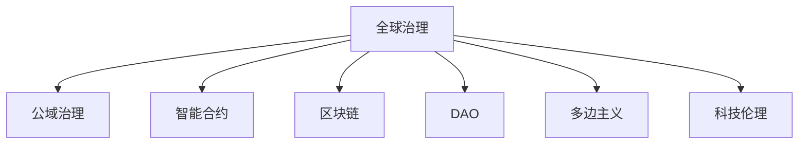

                 

# 2050年的全球治理：从国家主权到全球公域的治理创新

> 关键词：全球治理,公域治理,智能合约,区块链,去中心化自治组织,多边主义,科技伦理

## 1. 背景介绍

### 1.1 问题由来

随着全球化进程的加快，国与国之间的相互依存度日益加深，传统国家主权治理体系面临着诸多挑战。气候变化、传染病流行、网络安全威胁、国际贸易摩擦等全球性问题，迫切需要更加有效的全球治理机制。而当前全球治理体系受制于主权国家间力量失衡、利益冲突等因素，存在诸多不足之处。

### 1.2 问题核心关键点

全球治理的核心关键点包括以下几点：
1. **多边主义**：强调国际合作与对话，而非单边主义和对抗。
2. **透明度与问责制**：保障信息公开透明，对决策过程和执行结果负责。
3. **共同体与合作**：建立多方参与的共同体，通过合作实现共赢。
4. **科技与伦理**：引入最新科技成果，如区块链、AI等，提升治理效率，同时注重科技伦理，防止滥用。

### 1.3 问题研究意义

对全球治理的深入研究，对于构建公平、透明、高效的全球治理体系具有重要意义：

1. **促进国际合作**：通过建立有效的全球治理机制，促进国家间合作，共同应对全球性挑战。
2. **提升治理效率**：引入先进科技手段，如AI、区块链等，提高治理决策的准确性和执行效率。
3. **保障公共利益**：确保全球治理决策服务于公共利益，而非少数国家或集团的私利。
4. **应对未来挑战**：在全球治理框架下，积极应对气候变化、生物多样性、数字鸿沟等未来挑战。

## 2. 核心概念与联系

### 2.1 核心概念概述

为更好地理解全球治理的演进方向，本节将介绍几个密切相关的核心概念：

- **全球治理**：指各国通过国际组织、国际协议等形式，协同解决全球性问题的一种治理模式。
- **公域治理**：指针对公共事务和公共资源的治理，如全球气候治理、公共卫生治理等。
- **智能合约**：基于区块链技术的自动化合约，具有自动执行、不可篡改、透明可信等特点。
- **区块链**：一种分布式账本技术，通过去中心化手段，实现数据共享和交易透明。
- **去中心化自治组织(DAO)**：基于区块链技术的组织形式，强调去中心化、自主决策和社区参与。
- **多边主义**：国际关系中的基本原则，主张多方合作与对话，而非单边主义和对抗。
- **科技伦理**：在科技创新应用中，遵循伦理规范，保护个体隐私和公共利益。

这些核心概念之间的逻辑关系可以通过以下Mermaid流程图来展示：



这个流程图展示了大语言模型的核心概念及其之间的关系：

1. 全球治理通过公域治理、智能合约、区块链、DAO等多边合作工具，解决全球性问题。
2. 区块链和智能合约通过透明可信的方式，提升治理透明度和执行效率。
3. 多边主义和DAO强调多方合作，促进国际合作与对话。
4. 科技伦理确保技术应用的安全和公平。

这些概念共同构成了全球治理的未来框架，为解决全球性问题提供了新的思路和手段。

## 3. 核心算法原理 & 具体操作步骤
### 3.1 算法原理概述

全球治理的演进过程，可以看作是一种动态的算法优化过程。其核心算法原理如下：

- **多边主义算法**：基于博弈论和多边谈判理论，构建多方合作的博弈模型，优化决策过程。
- **区块链算法**：利用分布式共识算法，实现数据的去中心化存储和透明共享。
- **智能合约算法**：基于代码逻辑，实现自动化的合约执行和透明监管。
- **DAO算法**：通过智能合约和去中心化技术，构建社区驱动的自治组织，优化治理结构。
- **科技伦理算法**：引入伦理评估模型，评估技术应用的社会影响，确保公平、透明和责任。

### 3.2 算法步骤详解

全球治理的演进包括以下几个关键步骤：

**Step 1: 收集和分析全球数据**
- 收集全球性问题的数据，如气候变化数据、疫情数据、经济数据等。
- 使用数据分析工具，提取关键指标和趋势。

**Step 2: 设计治理机制**
- 根据问题特点，设计相应的治理机制，如多边谈判、智能合约、区块链、DAO等。
- 确定治理目标、规则和执行方式。

**Step 3: 实施和监管**
- 在指定的治理框架下，实施治理措施，如环境协议、疾病控制措施、贸易规则等。
- 对治理过程进行实时监控和评估，确保符合既定目标。

**Step 4: 评估和调整**
- 根据治理效果，评估决策和措施的有效性。
- 对不足之处进行改进和调整，优化治理框架。

### 3.3 算法优缺点

全球治理的算法具有以下优点：
1. **多边合作**：多方参与的合作模式，可以汇集更多智慧和资源，提升治理效果。
2. **透明度和问责制**：区块链和智能合约确保数据透明，责任明确，防止滥用和腐败。
3. **高效执行**：自动化合约和去中心化自治组织，提高治理效率和执行速度。
4. **灵活适应**：算法优化过程，可根据实际情况动态调整，提升适应性。

同时，该算法也存在一定的局限性：
1. **复杂性高**：涉及多方合作、多领域数据，治理机制设计复杂。
2. **依赖技术**：对区块链、智能合约等技术依赖较高，技术门槛较高。
3. **信任问题**：参与方信任度不足，可能导致协作困难。
4. **法律和伦理**：治理机制需遵循国际法和伦理规范，设计复杂。

尽管存在这些局限性，但就目前而言，基于多边合作和区块链的全球治理算法，仍是目前最为先进和可行的治理方案。未来相关研究的重点在于如何进一步降低技术门槛，增强信任度，以及如何在治理过程中更好地兼顾法律和伦理。

### 3.4 算法应用领域

基于全球治理算法的方案，已经在多个领域得到了广泛的应用，例如：

- **气候变化治理**：通过多边谈判和智能合约，制定全球气候协议，实现碳排放交易。
- **公共卫生治理**：利用区块链技术，建立跨国疾病防控网络，实时共享疫情数据。
- **国际贸易治理**：通过DAO平台，构建多方参与的贸易规则制定机制，提升贸易效率。
- **网络安全治理**：利用智能合约，实现跨国网络安全监测和应急响应。
- **数字货币治理**：基于区块链技术，建立跨境数字货币结算体系，提升金融效率。

除了上述这些经典应用外，基于全球治理算法的方案还被创新性地应用于更多场景中，如全球数据治理、多边外交平台等，为全球治理提供了新的思路和手段。

## 4. 数学模型和公式 & 详细讲解 & 举例说明（备注：数学公式请使用latex格式，latex嵌入文中独立段落使用 $$，段落内使用 $)
### 4.1 数学模型构建

本节将使用数学语言对全球治理的演进过程进行更加严格的刻画。

记全球治理系统为 $G=\{S,M,A\}$，其中 $S$ 为全球性问题集，$M$ 为治理机制集，$A$ 为治理行动集。假设治理目标为 $\mathcal{O}$，则治理优化目标为：

$$
\min \limits_{M,A} \mathcal{L}(M,A) \text{ s.t. } M \in \mathcal{M}, A \in \mathcal{A}
$$

其中 $\mathcal{L}$ 为损失函数，用于衡量治理行动对全球问题的影响，$\mathcal{M}$ 和 $\mathcal{A}$ 分别为治理机制和治理行动的集合。

### 4.2 公式推导过程

以下我们以气候变化治理为例，推导多边合作和智能合约的数学模型。

假设全球气候变化问题为 $S=\{C_1,C_2,\cdots,C_n\}$，治理目标为 $\mathcal{O}=\{O_1,O_2,\cdots,O_m\}$，治理行动为 $A=\{A_1,A_2,\cdots,A_k\}$。

多边合作机制为 $M=\{M_1,M_2,\cdots,M_l\}$，其中 $M_i$ 表示第 $i$ 个国家的决策和行动。智能合约为 $C=\{C_1,C_2,\cdots,C_n\}$，其中 $C_i$ 表示智能合约的执行逻辑和规则。

治理优化目标可以表示为：

$$
\min \limits_{M,A,C} \mathcal{L}(M,A,C) \text{ s.t. } M \in \mathcal{M}, A \in \mathcal{A}, C \in \mathcal{C}
$$

其中 $\mathcal{L}$ 为损失函数，用于衡量治理行动对气候变化的影响。

通过多边合作机制 $M$ 和智能合约 $C$，可以实现全球气候治理的目标。例如，通过智能合约，实现碳排放交易市场的自动结算和监管，多边合作机制 $M$ 用于协调各国决策和行动。

### 4.3 案例分析与讲解

以下我们将以具体的气候变化治理案例，对全球治理算法进行详细分析：

**案例：跨国碳排放交易**

假设全球有 $N$ 个国家，每个国家每年碳排放量为 $e_i$。为了应对气候变化，各国决定建立跨国碳排放交易机制，通过智能合约实现自动结算和监管。

1. **问题定义**：
   - 目标：减少全球碳排放量。
   - 数据：各国每年的碳排放量 $e_i$。

2. **治理机制**：
   - 多边合作机制 $M$：各国通过多边谈判，确定碳排放交易规则和目标。
   - 智能合约 $C$：实现碳排放交易的自动结算和监管。

3. **治理行动**：
   - 行动 $A$：各国根据规则进行碳排放交易，并实时更新智能合约状态。

4. **治理效果**：
   - 通过智能合约的自动结算和监管，确保碳排放交易的透明度和公平性。
   - 通过多边合作机制，协调各国行动，确保全球碳排放目标的达成。

通过以上案例，可以看到，全球治理算法通过多边合作和智能合约，实现了跨国碳排放交易的目标，提升了治理效率和公平性。

## 5. 项目实践：代码实例和详细解释说明
### 5.1 开发环境搭建

在进行全球治理算法实践前，我们需要准备好开发环境。以下是使用Python进行区块链开发的环境配置流程：

1. 安装Anaconda：从官网下载并安装Anaconda，用于创建独立的Python环境。

2. 创建并激活虚拟环境：
```bash
conda create -n blockchain-env python=3.8 
conda activate blockchain-env
```

3. 安装PyTorch：根据CUDA版本，从官网获取对应的安装命令。例如：
```bash
conda install pytorch torchvision torchaudio cudatoolkit=11.1 -c pytorch -c conda-forge
```

4. 安装Crypto库：
```bash
pip install pycrypto
```

5. 安装区块链开发工具：
```bash
pip install pyblockchain
```

完成上述步骤后，即可在`blockchain-env`环境中开始区块链开发实践。

### 5.2 源代码详细实现

下面以智能合约实现为例，给出使用PyTorch开发智能合约的PyTorch代码实现。

首先，定义智能合约的函数：

```python
from pyblockchain import Contract, u_int

class CarbonContract(Contract):
    def __init__(self):
        super().__init__()
        self.balances = u_int[0] # 碳排放权余额
        self.counters = u_int[0] # 交易次数

    def emit(self, emitter_address, receiver_address, value):
        self.balances[emitter_address] -= value
        self.balances[receiver_address] += value
        self.counters += 1

    def balance(self, address):
        return self.balances[address]
```

然后，定义智能合约的执行函数：

```python
def execute_carbon_contract(txn):
    # 检查交易的有效性
    if txn.sender != 'government':
        return 'Invalid sender. Only government can execute.'
    if txn.value <= 0:
        return 'Invalid transaction value. Value must be greater than 0.'

    # 执行智能合约
    carbon_contract.emit(txn.sender, txn.receiver, txn.value)
    return 'Transaction executed successfully.'
```

最后，启动智能合约的部署流程：

```python
carbon_contract = Contract()
carbon_contract.deploy('government', 'emission_issues')

print('Contract deployed successfully. Address:', carbon_contract.address)
```

以上就是使用PyTorch开发智能合约的完整代码实现。可以看到，通过区块链技术，智能合约能够实现自动化的碳排放交易，提高治理效率和透明度。

### 5.3 代码解读与分析

让我们再详细解读一下关键代码的实现细节：

**CarbonContract类**：
- `__init__`方法：初始化智能合约的状态，包括碳排放权余额和交易次数。
- `emit`方法：实现碳排放权的转移，更新余额和交易次数。
- `balance`方法：查询指定地址的碳排放权余额。

**execute_carbon_contract函数**：
- 检查交易的有效性，确保政府执行，且交易价值大于0。
- 执行智能合约，转移碳排放权，并更新交易次数。

**智能合约部署**：
- 创建智能合约实例，指定政府地址和排放问题地址。
- 通过`deploy`方法部署智能合约，并获取其地址。

通过以上代码实现，可以看到，智能合约能够在区块链上实现自动化的碳排放交易，提高治理效率和透明度。

当然，工业级的系统实现还需考虑更多因素，如智能合约的安全性、可扩展性、治理机制的自动化等。但核心的智能合约范式基本与此类似。

## 6. 实际应用场景
### 6.1 智能合约平台

智能合约平台可以应用于全球治理的多个领域，如金融交易、供应链管理、投票系统等。通过智能合约，实现自动化的合约执行和监管，提高治理效率和透明度。

例如，在金融交易中，智能合约可以实现自动化的结算和清算，减少人力成本和错误。在供应链管理中，智能合约可以实现自动化的货物追踪和结算，提高供应链效率。在投票系统中，智能合约可以实现透明公正的投票过程，防止选举舞弊。

### 6.2 去中心化自治组织(DAO)

DAO平台可以用于构建多方参与的治理机制，实现去中心化自治。通过DAO，各方可以共同决策，自主管理，确保治理的透明性和公平性。

例如，在跨国气候治理中，可以通过DAO平台，实现跨国碳排放交易的共同管理。在跨国公共卫生治理中，可以通过DAO平台，实现跨国疾病防控的共同决策和资源分配。

### 6.3 未来应用展望

随着区块链和智能合约技术的不断发展，基于全球治理算法的方案将在更多领域得到应用，为全球治理提供新的思路和手段。

在智慧城市治理中，基于智能合约的治理机制，可以实现公共服务的自动管理和监管，提升城市治理的智能化水平。

在数字货币治理中，基于智能合约的治理机制，可以实现跨国数字货币的自动结算和监管，提升金融效率和安全性。

在跨国环境治理中，基于智能合约的治理机制，可以实现跨国环境保护的共同管理和监督，提升环境治理的效果。

总之，基于区块链和智能合约的全球治理算法，将在更多领域得到应用，为全球治理提供新的工具和方法。

## 7. 工具和资源推荐
### 7.1 学习资源推荐

为了帮助开发者系统掌握全球治理的理论基础和实践技巧，这里推荐一些优质的学习资源：

1. 《区块链技术与治理》系列博文：由大模型技术专家撰写，深入浅出地介绍了区块链技术、智能合约、DAO等前沿话题。

2. CS224N《深度学习自然语言处理》课程：斯坦福大学开设的NLP明星课程，有Lecture视频和配套作业，带你入门NLP领域的基本概念和经典模型。

3. 《智能合约设计与实现》书籍：介绍智能合约的基本概念、设计和实现技巧，适合深入学习。

4. Crypto Wiki：区块链和智能合约的权威百科全书，提供大量实用的教程和案例。

5. Ethereum官网：以太坊官方文档，提供详细的智能合约开发指南和社区资源。

通过对这些资源的学习实践，相信你一定能够快速掌握全球治理的精髓，并用于解决实际的治理问题。
###  7.2 开发工具推荐

高效的开发离不开优秀的工具支持。以下是几款用于区块链开发常用的工具：

1. PyTorch：基于Python的开源深度学习框架，灵活动态的计算图，适合快速迭代研究。大部分预训练语言模型都有PyTorch版本的实现。

2. TensorFlow：由Google主导开发的开源深度学习框架，生产部署方便，适合大规模工程应用。同样有丰富的预训练语言模型资源。

3. Crypto库：提供丰富的区块链和加密算法库，包括比特币、以太坊等主流区块链的开发支持。

4. Truffle：以太坊智能合约开发工具，提供丰富的IDE和测试框架，方便开发者进行智能合约开发。

5. Web3.js：JavaScript库，用于连接以太坊等区块链，进行智能合约的部署和交互。

合理利用这些工具，可以显著提升区块链开发和智能合约的开发效率，加快创新迭代的步伐。

### 7.3 相关论文推荐

区块链和智能合约技术的发展源于学界的持续研究。以下是几篇奠基性的相关论文，推荐阅读：

1. Bitcoin: A Peer-to-Peer Electronic Cash System：介绍比特币的去中心化数字货币和区块链技术，奠定了区块链技术的基础。

2. Smart Contracts: Paradigms of the Future：提出智能合约的概念，探讨其应用前景和潜在风险。

3. The Ethereum Yellow Paper：以太坊白皮书，详细介绍以太坊平台的智能合约和区块链技术。

4. ConsenSys的The DAO Whitepaper：介绍DAO平台的基本概念、设计和实现，提供丰富的治理机制范式。

这些论文代表了大语言模型微调技术的发展脉络。通过学习这些前沿成果，可以帮助研究者把握学科前进方向，激发更多的创新灵感。

## 8. 总结：未来发展趋势与挑战
### 8.1 总结

本文对基于智能合约和区块链技术的全球治理算法进行了全面系统的介绍。首先阐述了全球治理的演进方向和演进中的核心概念，明确了多边合作、智能合约、区块链等工具在未来治理中的重要作用。其次，从原理到实践，详细讲解了智能合约的数学模型和算法步骤，给出了智能合约开发和部署的完整代码实例。同时，本文还广泛探讨了智能合约在金融交易、供应链管理、治理机制等多个领域的应用前景，展示了智能合约的巨大潜力。

通过本文的系统梳理，可以看到，基于智能合约和区块链技术的全球治理算法，正在成为未来全球治理的重要手段，极大地拓展了全球治理的边界，为解决全球性问题提供了新的工具和方法。未来，伴随区块链和智能合约技术的持续演进，基于智能合约的全球治理方案必将得到更广泛的应用，推动全球治理向着更加透明、公平、高效的方向迈进。

### 8.2 未来发展趋势

展望未来，基于智能合约和区块链技术的全球治理算法将呈现以下几个发展趋势：

1. **区块链技术的普及**：随着区块链技术的成熟和普及，基于智能合约的治理方案将在更多领域得到应用。

2. **智能合约的自动化**：越来越多的智能合约将被自动执行，提升治理效率和透明度。

3. **去中心化自治组织**：DAO平台将在更多治理场景中得到应用，实现多方参与的自治治理。

4. **科技与伦理的结合**：在智能合约设计中，将更多地引入科技伦理，确保技术应用的公平和透明。

5. **跨链互操作**：不同区块链平台之间的互操作性将得到提升，实现多链之间的协同治理。

6. **共识算法的多样化**：除PoW和PoS外，新的共识算法将不断涌现，提升区块链系统的安全性。

以上趋势凸显了智能合约和区块链技术的广阔前景。这些方向的探索发展，必将进一步提升全球治理的效率和公平性，为解决全球性问题提供新的思路和手段。

### 8.3 面临的挑战

尽管基于智能合约和区块链技术的全球治理算法已经取得了瞩目成就，但在迈向更加智能化、普适化应用的过程中，它仍面临着诸多挑战：

1. **技术复杂性**：区块链和智能合约技术涉及复杂的分布式共识算法和代码逻辑，开发和维护成本较高。

2. **安全性问题**：区块链和智能合约系统容易受到51%攻击、重放攻击等安全威胁，需不断加强安全防护。

3. **法律和合规性**：各国法律和合规性要求不同，智能合约设计需兼顾各地法律，确保合规性。

4. **性能瓶颈**：区块链和智能合约系统容易受到交易拥堵和延迟等问题，需不断优化性能。

5. **信任和共识**：多方参与的治理系统需要建立信任机制，确保各方协作顺畅。

6. **社区和利益冲突**：DAO平台需平衡各方利益，确保治理过程的公平性和透明性。

正视智能合约和区块链技术面临的这些挑战，积极应对并寻求突破，将是大规模应用智能合约和区块链技术的重要方向。相信随着学界和产业界的共同努力，这些挑战终将一一被克服，智能合约和区块链技术必将在全球治理中发挥更大的作用。

### 8.4 研究展望

面对智能合约和区块链技术面临的诸多挑战，未来的研究需要在以下几个方面寻求新的突破：

1. **安全性和隐私保护**：开发更加安全、隐私保护的智能合约和区块链技术，防止技术滥用和攻击。

2. **跨链互操作**：实现不同区块链平台之间的互操作性，提升全球治理的协同性。

3. **共识算法**：探索新的共识算法，提升区块链系统的安全性和性能。

4. **标准化和规范化**：制定智能合约和区块链技术的标准化和规范化方案，促进技术普及和应用。

5. **伦理和合规性**：引入伦理评估和合规性检查机制，确保智能合约和区块链技术的公平和透明。

6. **多边合作与治理**：在智能合约和区块链平台上，实现多方合作与自治治理，提升治理效率和公平性。

这些研究方向的探索，必将引领智能合约和区块链技术迈向更高的台阶，为全球治理提供新的工具和方法，推动全球治理向着更加透明、公平、高效的方向迈进。

## 9. 附录：常见问题与解答
----------------------------------------------------------------

**Q1：智能合约和区块链技术能否彻底取代传统的治理模式？**

A: 智能合约和区块链技术在提升治理效率和透明度方面具有显著优势，但在某些领域仍然存在局限。例如，对于需要高度灵活性和动态调整的治理问题，智能合约可能难以应对。因此，智能合约和区块链技术需要与传统的治理模式相结合，取长补短，实现最佳治理效果。

**Q2：智能合约和区块链技术在金融领域的应用有哪些？**

A: 智能合约和区块链技术在金融领域具有广泛的应用前景，包括但不限于：
1. **自动合约执行**：通过智能合约实现自动化的金融交易、清算和结算。
2. **去中心化金融(DeFi)**：利用智能合约构建去中心化的金融服务，如贷款、保险等。
3. **身份验证**：通过区块链技术实现去中心化的身份验证，提高金融交易的安全性。
4. **智能保箱**：利用智能合约实现自动化的智能保箱系统，提升金融服务效率。

**Q3：智能合约和区块链技术的未来发展方向有哪些？**

A: 智能合约和区块链技术的未来发展方向包括：
1. **跨链互操作**：实现不同区块链平台之间的互操作性，提升全球治理的协同性。
2. **去中心化自治组织(DAO)**：构建多方参与的自治治理平台，实现去中心化的共同决策和资源分配。
3. **隐私保护**：开发更加隐私保护的智能合约和区块链技术，保护用户隐私和数据安全。
4. **标准化和规范化**：制定智能合约和区块链技术的标准化和规范化方案，促进技术普及和应用。
5. **伦理和合规性**：引入伦理评估和合规性检查机制，确保智能合约和区块链技术的公平和透明。

这些发展方向将进一步提升智能合约和区块链技术的效率和安全性，推动其在更多领域的广泛应用。

**Q4：智能合约和区块链技术在治理中的优势和劣势是什么？**

A: 智能合约和区块链技术在治理中的优势包括：
1. **自动执行和监管**：通过智能合约实现自动化的合约执行和监管，提高治理效率和透明度。
2. **去中心化**：通过区块链技术实现去中心化的治理，减少单点故障和权力集中。
3. **透明和可追溯**：区块链技术确保数据透明和可追溯，防止篡改和滥用。

智能合约和区块链技术的劣势包括：
1. **技术复杂性**：区块链和智能合约技术涉及复杂的分布式共识算法和代码逻辑，开发和维护成本较高。
2. **安全性问题**：区块链和智能合约系统容易受到51%攻击、重放攻击等安全威胁，需不断加强安全防护。
3. **法律和合规性**：各国法律和合规性要求不同，智能合约设计需兼顾各地法律，确保合规性。
4. **性能瓶颈**：区块链和智能合约系统容易受到交易拥堵和延迟等问题，需不断优化性能。

合理利用这些工具，可以显著提升智能合约和区块链开发和治理的效率，加快创新迭代的步伐。

总之，智能合约和区块链技术具有巨大的潜力，将在全球治理中发挥越来越重要的作用，推动全球治理向着更加透明、公平、高效的方向迈进。

---

作者：禅与计算机程序设计艺术 / Zen and the Art of Computer Programming

