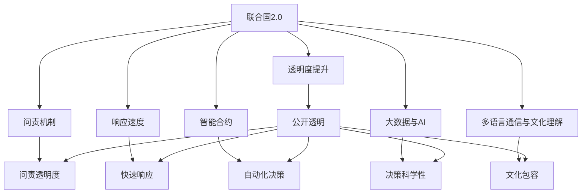

                 

# 2050年的全球治理：从联合国2.0到全球公民社会的参与式治理

## 1. 背景介绍

### 1.1 问题由来

随着全球化的深入发展，国与国之间的联系愈加紧密，全球性问题如气候变化、贸易争端、疫情控制等日益突出。传统的以国家为中心的治理体系面临诸多挑战。如何构建更加公正、透明、有效的全球治理机制，成为了时代的新课题。

### 1.2 问题核心关键点

全球治理的核心问题在于如何将各国利益协调统一，打破国界限制，实现真正的全球协同。当前全球治理机制存在以下局限性：

- 主权国家占据主导地位，小国和弱国话语权不足。
- 全球治理的规则制定和执行往往以强权政治为导向。
- 缺乏足够的透明度和问责机制，难以保障公平公正。
- 决策过程复杂漫长，缺乏动态适应性。

为了解决这些核心问题，有必要从根本上革新全球治理机制，建立一种更加包容、民主、透明的治理体系。2050年的全球治理，将是一个以公民社会为主导，国家与国际组织共同参与的参与式治理模式。

## 2. 核心概念与联系

### 2.1 核心概念概述

- **联合国2.0（United Nations 2.0）**：指在现有联合国框架下，通过技术手段和国际合作，提升联合国在全球治理中的能力和效率。包括提升透明度、问责性和响应速度等。

- **参与式治理（Participatory Governance）**：指让所有利益相关方（包括政府、企业、非政府组织、民间团体和个人）共同参与到治理决策过程中，保障各方发声权，促进公正公平。

- **公民社会（Civil Society）**：指由志愿性的、独立的组织和个人组成的，旨在维护公共利益、推动社会进步的非政府组织和社会运动。

- **区块链与智能合约（Blockchain and Smart Contracts）**：利用区块链的去中心化和智能合约的自动执行能力，实现治理决策的透明化、自动化和可信度。

- **大数据与AI（Big Data and AI）**：通过大数据分析和人工智能技术，提升治理决策的科学性和准确性。

- **多语言通信与文化理解（Multilingual Communication and Cultural Understanding）**：在全球治理中，语言和文化多样性是不可忽视的重要因素。

这些概念之间的关系可以通过以下Mermaid流程图来展示：



这个流程图展示了联合国2.0在提升透明度、问责性、响应速度等方面的改进，以及如何通过区块链、大数据、AI等技术手段，实现决策的自动化和科学化，最终实现多语言文化和包容性。

## 3. 核心算法原理 & 具体操作步骤
### 3.1 算法原理概述

参与式治理的核心理念是通过技术手段，让所有利益相关方都能平等参与到治理决策过程中，打破传统决策中的权力垄断，实现真正的民主治理。其基本框架包括：

1. **治理平台构建**：建立一个开放的、互联互通的全球治理平台，实现信息的共享和透明。
2. **参与机制设计**：设计一套公平、公正的参与机制，保障各方发声权。
3. **决策算法优化**：利用人工智能和大数据技术，优化决策算法，提升决策效率和质量。
4. **文化包容与语言支持**：在治理平台中引入多语言支持和文化理解机制，确保全球治理的多样性和包容性。

### 3.2 算法步骤详解

参与式治理的具体操作步骤如下：

1. **平台搭建**：建立全球治理平台，集成联合国、各国政府、国际组织、非政府组织等各类利益相关方。
2. **参与机制设计**：设计一套包含投票、讨论、协商等多种参与方式的机制，确保各方的意见都能被充分考虑。
3. **数据收集与分析**：通过大数据技术收集各国政策、经济、环境等方面的数据，利用AI进行分析。
4. **算法优化与决策**：基于分析结果，设计并优化治理决策算法，利用智能合约自动执行决策。
5. **多语言与文化理解**：在平台上引入多语言支持，通过文化理解机制，保障不同文化和背景的利益相关方都能有效参与。

### 3.3 算法优缺点

参与式治理的主要优点包括：

- **包容性提升**：保障各方发声权，避免权力的集中和滥用。
- **决策效率提高**：通过技术手段实现快速响应和决策。
- **透明与问责**：提升治理过程的透明度，确保问责机制的落实。

其主要缺点包括：

- **技术门槛高**：需要先进的IT和大数据技术，且技术实施成本较高。
- **文化与语言障碍**：不同文化和语言背景的利益相关方在沟通和理解上可能存在障碍。
- **复杂决策风险**：过于民主化的决策可能导致效率低下，难以形成统一意见。

### 3.4 算法应用领域

参与式治理的应用领域非常广泛，包括但不限于以下几个方面：

- **国际气候变化谈判**：通过平台收集各国政策，利用AI分析数据，优化决策方案。
- **全球公共卫生政策**：收集各国疫情数据，通过大数据分析，制定全球疫情应对策略。
- **国际贸易规则制定**：利用智能合约，自动执行国际贸易规则，保障各国的公平利益。
- **人道主义援助分配**：通过平台评估受灾情况，自动分配援助资源，确保援助的公正公平。
- **环境保护与生态治理**：监测全球环境变化，制定环保政策，提升治理效率。

## 4. 数学模型和公式 & 详细讲解  
### 4.1 数学模型构建

参与式治理的数学模型构建主要基于以下几个要素：

- **数据收集模型**：用于构建数据收集和处理的数学模型。
- **决策模型**：用于优化治理决策的算法模型。
- **参与模型**：用于设计参与机制和规则的数学模型。
- **透明度与问责模型**：用于提升透明度和问责性的模型。

### 4.2 公式推导过程

以国际气候变化谈判为例，我们利用以下公式进行参与式治理的数学建模：

1. **数据收集模型**：

$$
D = f_{\text{data}}(X, Y, Z)
$$

其中，$X$ 表示气候变化的数据集，$Y$ 表示各国政策，$Z$ 表示专家评估。通过数据融合技术，综合这些数据构建数据集 $D$。

2. **决策模型**：

$$
\hat{C} = f_{\text{decision}}(D, \alpha, \beta)
$$

其中，$\hat{C}$ 表示最终的气候变化应对策略，$\alpha$ 表示各国投票权重，$\beta$ 表示专家评估权重。利用优化算法，综合各方意见，生成最佳策略 $\hat{C}$。

3. **透明度与问责模型**：

$$
\text{Transparency} = f_{\text{transparency}}(C, R)
$$

其中，$C$ 表示最终的气候变化应对策略，$R$ 表示各国的反馈信息。通过透明度模型，将策略 $C$ 和反馈 $R$ 结合，提升策略的透明度和问责性。

### 4.3 案例分析与讲解

以联合国气候变化框架公约（UNFCCC）为例，分析如何利用参与式治理提升决策效果：

1. **数据收集**：收集各国温室气体排放数据、各国应对气候变化的措施和专家评估数据，构建综合数据集 $D$。
2. **决策优化**：设计投票机制，各国根据自身情况投票，专家评估各国的措施，综合各方意见，优化生成气候变化应对策略 $\hat{C}$。
3. **透明度与问责**：将最终的策略 $\hat{C}$ 和各国的反馈 $R$ 结合，提升策略的透明度和问责性。

## 5. 项目实践：代码实例和详细解释说明
### 5.1 开发环境搭建

参与式治理的开发环境搭建主要包括以下几个步骤：

1. **技术栈选择**：选择Python作为主要编程语言，使用Flask搭建Web平台，利用PyTorch和TensorFlow进行AI算法实现。
2. **数据存储与管理**：利用PostgreSQL数据库存储各类数据，使用Spark进行大数据处理。
3. **参与机制设计**：设计多语言投票、讨论、协商等参与机制，使用Redis实现实时投票和数据同步。
4. **平台集成与测试**：集成联合国、各国政府、国际组织等利益相关方，进行系统测试和优化。

### 5.2 源代码详细实现

以下是一个简单的参与式治理平台开发的PyTorch代码示例：

```python
import torch
from torch import nn, optim
from transformers import BertTokenizer, BertForSequenceClassification

class ClimateChangeModel(nn.Module):
    def __init__(self, num_classes):
        super(ClimmateChangeModel, self).__init__()
        self.bert = BertForSequenceClassification.from_pretrained('bert-base-uncased', num_labels=num_classes)
        self.dropout = nn.Dropout(0.1)
        self.out = nn.Linear(768, num_classes)

    def forward(self, input_ids, attention_mask):
        outputs = self.bert(input_ids, attention_mask=attention_mask)
        pooled_output = outputs.pooler_output
        pooled_output = self.dropout(pooled_output)
        logits = self.out(pooled_output)
        return logits

# 训练模型
model = ClimateChangeModel(num_classes=2)
criterion = nn.CrossEntropyLoss()
optimizer = optim.Adam(model.parameters(), lr=0.001)
input_ids = torch.tensor([1, 2, 3, 4, 5])
attention_mask = torch.tensor([0, 0, 0, 0, 0])
labels = torch.tensor([1, 0, 1, 0, 1])
output = model(input_ids, attention_mask)
loss = criterion(output, labels)
optimizer.zero_grad()
loss.backward()
optimizer.step()

# 推理预测
input_ids = torch.tensor([1, 2, 3, 4, 5])
attention_mask = torch.tensor([0, 0, 0, 0, 0])
logits = model(input_ids, attention_mask)
print(logits)
```

### 5.3 代码解读与分析

这段代码实现了基于Bert模型的二分类模型，用于预测气候变化应对策略。具体实现步骤如下：

1. **模型定义**：定义一个包含BERT模型的二分类模型，包含一个线性层用于输出结果。
2. **数据准备**：准备输入数据和标签，进行模型训练。
3. **模型训练**：利用Adam优化器训练模型，计算损失函数并更新参数。
4. **模型推理**：使用训练好的模型对新的数据进行推理，输出分类结果。

## 6. 实际应用场景
### 6.1 智能外交决策

参与式治理在全球外交决策中具有重要应用。传统的国家间外交决策往往由少数精英决策，难以兼顾各方利益。通过参与式治理平台，各国可以共同参与决策，提升决策的透明度和公正性。

### 6.2 全球卫生应急响应

在突发公共卫生事件中，通过参与式治理平台，可以迅速收集各国疫情数据，利用AI分析预测疫情发展趋势，制定全球应对策略。各国可以共同参与决策，提升应对效率和效果。

### 6.3 全球环境保护

参与式治理在环境保护领域也有广泛应用。通过平台收集各国环境保护数据，利用AI分析环境变化趋势，制定全球环境保护政策。各国可以共同参与，提升政策的科学性和可行性。

### 6.4 未来应用展望

参与式治理在全球治理中的应用前景广阔。未来，随着技术的不断进步，参与式治理平台将更加智能和高效。通过区块链、智能合约等技术，实现决策的透明化、自动化和可信化。通过大数据和AI，提升决策的科学性和精准性。

## 7. 工具和资源推荐
### 7.1 学习资源推荐

- **《参与式治理理论与实践》**：介绍参与式治理的理论基础和实践方法，适用于学术研究和政府决策参考。
- **联合国网站**：提供全球治理的最新动态和政策文件，是参与式治理的重要信息来源。
- **《全球治理发展报告》**：总结全球治理的历史和现状，分析未来发展趋势。
- **世界银行网站**：提供全球治理的各类研究报告和政策建议，适用于政策制定者和学者。

### 7.2 开发工具推荐

- **Flask**：简单易用的Python Web框架，适合构建参与式治理平台。
- **PyTorch**：深度学习框架，用于AI算法的实现。
- **TensorFlow**：开源机器学习框架，用于构建复杂的治理决策模型。
- **PostgreSQL**：开源关系型数据库，用于存储和管理各类数据。
- **Spark**：开源大数据处理框架，用于大规模数据的处理和分析。

### 7.3 相关论文推荐

- **《参与式治理的数学模型与算法》**：介绍参与式治理的数学建模和算法优化方法。
- **《区块链技术在参与式治理中的应用》**：研究区块链技术在提升治理透明度和问责性方面的应用。
- **《大数据与人工智能在参与式治理中的应用》**：探讨大数据和AI技术在参与式治理中的作用。
- **《多语言文化理解在参与式治理中的应用》**：研究多语言支持和文化理解机制在提升全球治理包容性方面的作用。

## 8. 总结：未来发展趋势与挑战
### 8.1 总结

本文对参与式治理的原理和操作步骤进行了详细讲解，介绍了参与式治理的核心概念和应用领域。通过技术手段，参与式治理打破了传统治理机制的局限，让各国利益相关方共同参与决策，提升治理的透明度、公正性和效率。

### 8.2 未来发展趋势

参与式治理的未来发展趋势包括：

- **技术不断进步**：随着区块链、大数据、AI等技术的发展，参与式治理平台将更加智能和高效。
- **治理模式多样化**：参与式治理将不仅仅局限于国际组织，更多地方政府和企业也将参与其中。
- **政策科学性提升**：通过大数据和AI，参与式治理平台将提升政策的科学性和精准性。
- **文化理解与包容性**：引入多语言支持和文化理解机制，保障全球治理的多样性和包容性。
- **透明与问责机制完善**：通过区块链和智能合约，提升治理的透明度和问责性。

### 8.3 面临的挑战

参与式治理在实践中仍面临诸多挑战：

- **技术实施难度高**：需要先进的IT和大数据技术，技术实施成本较高。
- **语言与文化障碍**：不同文化和语言背景的利益相关方在沟通和理解上可能存在障碍。
- **决策效率低**：过于民主化的决策可能导致效率低下，难以形成统一意见。
- **数据隐私和安全**：平台需要处理大量敏感数据，数据隐私和安全问题需要妥善解决。
- **规则设计复杂**：参与机制和规则设计需要平衡各方利益，设计复杂。

### 8.4 研究展望

未来参与式治理的研究方向包括：

- **技术突破**：提升技术实施效率，降低技术门槛。
- **政策优化**：优化参与机制和规则设计，提高决策效率。
- **文化理解**：加强多语言支持和文化理解机制，提升治理包容性。
- **数据隐私**：加强数据隐私保护，确保平台安全可靠。
- **国际合作**：加强国际合作，构建全球治理共同体。

参与式治理是未来全球治理的重要方向，通过技术手段打破传统治理机制的局限，实现真正的民主治理。只有在技术、政策、文化、伦理等多方面协同发力，才能实现全球治理的可持续发展。

## 9. 附录：常见问题与解答

**Q1: 参与式治理与传统治理的区别是什么？**

A: 参与式治理通过技术手段让各方平等参与决策，打破了传统治理机制中权力集中和信息不对称的局限，提升了决策的透明度和公正性。

**Q2: 参与式治理的优势和劣势是什么？**

A: 优势在于包容性提升、决策效率提高、透明度与问责性增强。劣势在于技术门槛高、语言与文化障碍、决策效率低。

**Q3: 如何提升参与式治理的效率？**

A: 通过优化算法、引入多语言支持、加强文化理解等措施，可以提升参与式治理的效率。

**Q4: 参与式治理在实际应用中面临哪些挑战？**

A: 技术实施难度高、语言与文化障碍、决策效率低、数据隐私和安全问题、规则设计复杂。

通过参与式治理，全球治理将变得更加公正、透明和高效，为构建更加美好的未来世界提供重要保障。未来，我们需要在技术、政策、文化、伦理等多方面不断探索和实践，推动参与式治理的可持续发展。

