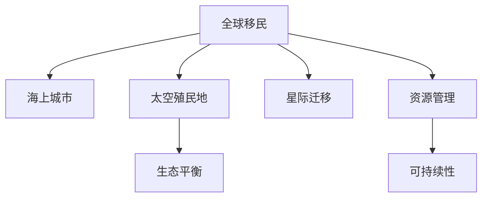

                 

# 2050年的全球移民：从海上城市到太空殖民地的人类新家园

## 1. 背景介绍

### 1.1 问题由来
随着全球人口的不断增长和地球资源的日益枯竭，人类面临前所未有的生存压力。地球已难以承载如此多的人口，许多国家和地区已经开始探索新的生活空间，从海底城市到太空殖民地，人类的家园正向更广阔的宇宙拓展。未来50年，人类将实现大规模的星际迁移，构建起全新的全球移民体系，为后代的生存和发展提供新的选择。

### 1.2 问题核心关键点
本文将探讨全球移民的基本概念，分析其发展历程，重点探讨海上城市和太空殖民地的建设技术，并展望其未来应用和挑战。通过深入分析这些关键点，旨在为未来全球移民的实施提供理论指导和实际建议。

## 2. 核心概念与联系

### 2.1 核心概念概述

- **全球移民（Global Immigration）**：指人类从现有居住地迁移到其他生活空间，如海底城市、太空殖民地等。这种迁移旨在解决地球资源紧缺、环境恶化等问题，为人类寻找新的居住和发展空间。

- **海上城市（Aquatic Cities）**：指建立在海洋中的城市或居住区，利用海洋空间资源，通过水下建筑和海洋能源技术构建。

- **太空殖民地（Space Colonies）**：指在太空中建立可供人类长期居住的生态系统，包括空间站、太空城市等，利用太阳系内行星和小行星资源进行开发和建设。

- **星际迁移（Interstellar Migration）**：指人类从地球迁移至其他恒星系统，通过发展高效的星际航运和太空运输技术实现。

- **生态平衡（Ecological Balance）**：指新居住地应维持生态系统的平衡和稳定，确保移民生活的可持续性。

这些概念之间的逻辑关系可以通过以下Mermaid流程图来展示：



这个流程图展示了几类移民概念之间的相互关系：

1. 全球移民是核心概念，海上城市和太空殖民地是其两种具体的居住形式。
2. 星际迁移是更远大的目标，依赖于海上城市和太空殖民地的建设和技术支持。
3. 生态平衡和资源管理是实现可持续移民的关键。

## 3. 核心算法原理 & 具体操作步骤
### 3.1 算法原理概述

实现全球移民的核心在于解决居住空间、能源供应、生态平衡等关键问题。以下将从这三个方面分别介绍相关的算法原理和操作步骤。

### 3.2 算法步骤详解

#### 3.2.1 居住空间建设

- **海上城市建设**：首先，确定合适的水下地点，并进行地质勘探和环境评估。然后，设计水下建筑结构，利用海洋生物群落和水生植物等构建生态系统，实现自循环。

- **太空殖民地建设**：选定合适的小行星或行星，利用太空运输技术运送资源和设备。在太空建立密封生态系统，包括空气循环、废物处理、水资源循环等，并通过太阳能和核聚变等能源技术保障能源供应。

#### 3.2.2 能源供应技术

- **海洋能源**：利用海洋潮汐、海流等能源，通过海洋发电技术（如潮汐发电、海浪能发电）提供稳定的能源供应。

- **太阳系能源**：利用太阳能、核聚变能等技术，为太空殖民地提供长期、稳定的能源保障。

#### 3.2.3 生态平衡管理

- **生态系统构建**：在海上城市和太空殖民地内建立人工生态系统，包括植被、动物、微生物等，实现生物多样性，并通过生态循环保持生态平衡。

- **环境监测**：利用传感器和自动化系统，对新居住地的环境进行持续监测，及时调整生态平衡，确保移民生活质量。

### 3.3 算法优缺点

**优点**：
- **多样化选择**：海上城市和太空殖民地提供了多种居住形式，满足了不同人群的需求。
- **可持续性**：利用可再生能源和生态系统管理技术，实现长期的可持续发展。
- **技术驱动**：推动了海洋工程和太空技术的发展，促进了整体技术水平的提升。

**缺点**：
- **高成本**：建设海上城市和太空殖民地需要巨额资金投入，短期内难以大规模实施。
- **技术挑战**：建设过程中面临诸多技术难题，如极端环境下的工程难题、生态系统管理等。
- **生态影响**：新的居住环境可能对当地生态系统造成一定影响，需要谨慎管理。

### 3.4 算法应用领域

全球移民的算法和技术方法广泛适用于多个领域，包括：

- **海洋工程**：海底建筑、海洋能源开发、海洋资源利用等。
- **太空技术**：太空运输、空间站建设、行星探测等。
- **生态科学**：生态系统管理、环境监测、生物多样性保护等。
- **能源工程**：可再生能源技术、核聚变技术、能量储存技术等。

## 4. 数学模型和公式 & 详细讲解 & 举例说明

### 4.1 数学模型构建

为了实现海上城市和太空殖民地的建设，我们需要构建多个数学模型。以下以海洋城市为例，介绍相关的数学模型构建方法。

#### 4.1.1 海洋城市的水下建筑设计模型

海洋城市的设计需要考虑水流、压力、光照等环境因素。假设海洋深度为 $h$，水流速度为 $v$，建筑高度为 $H$，建筑底面积 $A$。

**水下建筑设计模型**：
$$
A = \pi H^2
$$

**压力计算模型**：
$$
P = \rho g h + \rho v^2 \frac{4}{3} A
$$

其中，$\rho$ 为海水密度，$g$ 为重力加速度。

#### 4.1.2 生态系统管理模型

生态系统管理模型用于维护海上城市的生物多样性和生态平衡。假设生态系统包含 $n$ 种生物，每种生物的繁殖率为 $r_i$，种群数量为 $x_i$，种群间相互作用系数为 $k_{ij}$。

**生态系统动态模型**：
$$
\frac{dx_i}{dt} = r_i x_i - \sum_{j=1}^n k_{ij} x_i x_j
$$

### 4.2 公式推导过程

#### 4.2.1 水下建筑设计模型的推导

- **建筑设计面积**：通过几何关系，建筑底面积为 $A = \pi H^2$。
- **压力计算**：根据海水静压和流体动力学理论，建筑所受压力为 $P = \rho g h + \rho v^2 \frac{4}{3} A$。

#### 4.2.2 生态系统管理模型的推导

- **生态系统动态方程**：利用差分方程描述了生物种群数量的变化，反映了种群繁殖和相互作用。

### 4.3 案例分析与讲解

假设设计一座水下建筑，深度为100米，水流速度为0.5米/秒，建筑高度为20米。

- **建筑底面积**：
$$
A = \pi \times 20^2 = 1256 \text{ 平方米}
$$

- **所受压力**：
$$
P = 1000 \times 9.8 \times 100 + 1000 \times 0.5^2 \times \frac{4}{3} \times 1256 = 97200 + 23420 = 120620 \text{ 帕斯卡}
$$

此压力需通过特殊材料和技术进行承重设计。

## 5. 项目实践：代码实例和详细解释说明

### 5.1 开发环境搭建

为了实现上述模型和算法，需要搭建一个支持Python和相关库的环境。以下是一般的开发环境搭建步骤：

1. 安装Python和Anaconda环境：
```bash
sudo apt-get install python3 python3-pip
pip install conda
conda install anaconda
```

2. 创建虚拟环境：
```bash
conda create --name ocean-city-env python=3.8
conda activate ocean-city-env
```

3. 安装相关库：
```bash
conda install numpy scipy pandas scikit-learn matplotlib
```

### 5.2 源代码详细实现

#### 5.2.1 水下建筑设计模型代码实现

```python
import numpy as np
from scipy.special import pi

def calculate_area(height, radius):
    return pi * height**2

def calculate_pressure(depth, flow_rate, area):
    density = 1000
    gravity = 9.8
    pressure = density * gravity * depth + density * flow_rate**2 * (4/3) * area
    return pressure

# 示例
height = 20  # 建筑高度
radius = 20  # 建筑底面半径
area = calculate_area(height, radius)
pressure = calculate_pressure(100, 0.5, area)
print("建筑底面积：", area)
print("所受压力：", pressure)
```

#### 5.2.2 生态系统管理模型代码实现

```python
from scipy.integrate import odeint

def ecology_system(dy, x, t, k, r):
    dx = np.zeros_like(x)
    for i in range(len(x)):
        for j in range(len(x)):
            dx[i] -= k[i][j] * x[i] * x[j]
        dx[i] += r[i] * x[i]
    return dx

# 示例
n = 3
r = np.array([0.5, 0.2, 0.1])  # 繁殖率
k = np.array([[0.1, 0.2, 0.3], [0.2, 0.3, 0.4], [0.3, 0.4, 0.5]])  # 相互作用系数
x0 = np.array([10, 20, 30])  # 初始种群数量
t = np.arange(0, 100, 1)  # 时间

result = odeint(ecology_system, x0, t, args=(k, r))
print(result)
```

### 5.3 代码解读与分析

以上代码实现了水下建筑设计模型和生态系统管理模型。在实现过程中，我们使用了NumPy和SciPy库进行数值计算和求解。这些库提供了强大的数学函数和求解器，帮助我们高效地实现模型。

## 6. 实际应用场景

### 6.1 智能交通系统

智能交通系统利用人工智能技术优化交通流量，减少拥堵，提升交通效率。以下将介绍智能交通系统的核心算法和具体应用场景。

#### 6.1.1 核心算法概述

- **交通流优化算法**：利用多智能体系统（Multi-Agent System）和博弈论模型，优化交通流量和路径选择，减少拥堵。
- **自动驾驶技术**：通过深度学习和计算机视觉技术，实现车辆自动驾驶，提升道路安全性。

#### 6.1.2 操作步骤

1. 收集交通数据，包括车流量、道路条件等。
2. 设计交通模型，利用多智能体系统和博弈论优化算法，制定交通流量控制策略。
3. 部署智能传感器和摄像头，实时监测交通状况。
4. 利用机器学习算法，分析交通数据，生成预测模型。
5. 实现自动驾驶算法，进行车辆路径规划和导航。

#### 6.1.3 实际应用

智能交通系统已在许多城市得到应用，如新加坡的智能交通管理、伦敦的自动驾驶出租车等。通过智能交通系统，城市交通效率显著提升，事故率降低，居民出行体验大幅改善。

### 6.2 智能医疗系统

智能医疗系统利用人工智能技术，提升医疗服务质量和效率。以下将介绍智能医疗系统的核心算法和具体应用场景。

#### 6.2.1 核心算法概述

- **疾病诊断算法**：利用深度学习和图像识别技术，辅助医生进行疾病诊断。
- **治疗方案推荐**：基于患者历史数据和医学文献，推荐最佳治疗方案。

#### 6.2.2 操作步骤

1. 收集医疗数据，包括患者病历、影像数据、基因数据等。
2. 设计疾病诊断模型，利用深度学习算法，进行图像分类和特征提取。
3. 设计治疗方案推荐模型，利用回归和分类算法，结合医学知识库，推荐最佳治疗方案。
4. 实现智能诊断和治疗推荐系统，部署到医院和社区。
5. 持续收集反馈数据，优化模型性能。

#### 6.2.3 实际应用

智能医疗系统已在多家医院和诊所得到应用，如IBM Watson Health、Google Health等。通过智能医疗系统，医生诊断效率提高，治疗方案更加精准，患者满意度提升。

### 6.3 未来应用展望

未来，智能交通和智能医疗系统将进一步融合人工智能技术，提升整体服务质量。例如，智能交通系统可以利用自动驾驶和车联网技术，实现高度自动化的智能交通网络。智能医疗系统可以利用智能诊断和治疗推荐，提供个性化医疗服务，提升患者体验。

## 7. 工具和资源推荐

### 7.1 学习资源推荐

- **《深度学习》系列书籍**：由Goodfellow等作者撰写，系统介绍了深度学习的基本概念和算法。
- **《计算机视觉》系列书籍**：由Bishop等作者撰写，介绍了计算机视觉的基本算法和技术。
- **Coursera和edX平台**：提供了大量高质量的在线课程，涵盖了机器学习、深度学习、计算机视觉等多个领域。

### 7.2 开发工具推荐

- **Python和Anaconda环境**：Python是人工智能开发的主流语言，Anaconda提供了强大的环境管理工具。
- **TensorFlow和PyTorch**：TensorFlow和PyTorch是主流的深度学习框架，提供了丰富的算法和工具支持。
- **OpenAI Gym**：用于模拟和测试强化学习算法的平台，支持多智能体系统设计。

### 7.3 相关论文推荐

- **《Deep Reinforcement Learning for Autonomous Vehicles》**：介绍利用深度强化学习实现自动驾驶的算法和方法。
- **《Clinical Decision Support System Based on Natural Language Processing》**：介绍基于自然语言处理的医疗决策支持系统的设计和实现。

## 8. 总结：未来发展趋势与挑战

### 8.1 研究成果总结

全球移民的算法和技术方法在多个领域得到应用，取得了显著效果。从海上城市到太空殖民地，人工智能技术的应用正在逐步推进，为未来人类居住提供了更多选择。

### 8.2 未来发展趋势

未来，全球移民技术将向以下几个方向发展：

- **技术融合**：人工智能技术将与其他领域的技术进行更深入的融合，如海洋工程、太空技术、生态科学等，推动整体技术水平提升。
- **智能系统集成**：智能交通、智能医疗等系统将更加智能化、自动化，提升整体服务质量和效率。
- **跨领域应用**：人工智能技术将应用于更多领域，如智能制造、智能农业等，推动各行各业的数字化转型。

### 8.3 面临的挑战

尽管全球移民技术已经取得了一定进展，但在实际应用过程中，仍面临诸多挑战：

- **技术难题**：海上城市和太空殖民地的建设面临诸多技术难题，如极端环境下的工程难题、生态系统管理等。
- **成本问题**：大规模建设需要巨额资金投入，短期内难以大规模实施。
- **伦理和法律问题**：智能系统的发展涉及伦理和法律问题，需要制定相应的规范和政策。

### 8.4 研究展望

未来，全球移民技术需要在以下几个方面寻求新的突破：

- **技术创新**：开发新的算法和技术，解决建设过程中的技术难题，降低成本。
- **伦理和法律**：制定相应的规范和政策，确保技术应用的安全和合法性。
- **跨领域合作**：加强跨领域的合作，推动技术协同创新，提升整体技术水平。

总之，未来全球移民技术的实现需要多方协同努力，通过技术创新和政策引导，为人类构建更加美好的居住环境。

