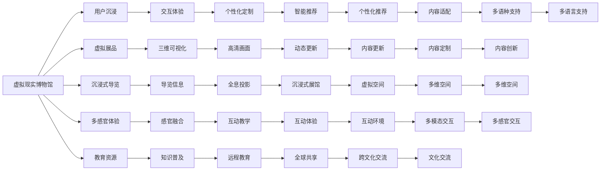

                 

# 2050年的数字文化：从虚拟现实博物馆到全息投影演艺的文化体验

## 1. 背景介绍

在2050年，数字技术已经全面渗透到生活的各个角落，从家庭到工作，从娱乐到教育，数字文化无处不在。特别是虚拟现实(VR)和全息投影技术的发展，让数字文化体验进入了一个全新的纪元。本文将深入探讨2050年数字文化的核心元素和其对文化体验的深刻影响。

### 1.1 数字文化的发展历程

数字文化的发展经历了多个阶段，从早期的数字图书馆、在线教育，到如今的虚拟现实博物馆、全息投影演艺，每一步都标志着人类社会在数字化进程中的飞跃。

**早期阶段：** 20世纪90年代，随着互联网的兴起，数字文化开始萌芽。最早的数字文化产品包括数字图书馆、在线教育平台等，这些产品让人们能够在家中享受丰富的学习资源。

**中期阶段：** 21世纪初，智能手机和社交网络的普及，使得数字文化更加深入人心。用户可以通过移动互联网随时随地获取信息和娱乐内容，如电子书、在线视频、社交网络等。

**当前阶段：** 进入2020年代，随着人工智能、云计算、物联网等技术的飞速发展，数字文化进入了一个新的高峰期。虚拟现实、增强现实、全息投影等技术的应用，为数字文化带来了全新的体验。

### 1.2 2050年的数字文化特点

2050年的数字文化有以下几个显著特点：

- **沉浸式体验**：虚拟现实和全息投影技术的应用，使得用户能够沉浸在虚拟的环境中，感受到真实世界的沉浸式体验。
- **个性化定制**：基于人工智能技术的推荐系统，能够为用户提供高度个性化的内容推荐。
- **交互性增强**：通过增强现实和虚拟现实技术，用户能够与虚拟环境进行互动，体验更加逼真的情境。
- **全球化共享**：互联网和移动互联网的发展，使得数字文化资源可以全球共享，跨越地域限制。

## 2. 核心概念与联系

### 2.1 核心概念概述

为了更好地理解2050年数字文化的特点，本节将介绍几个核心概念：

- **虚拟现实(VR)**：通过计算机生成模拟的3D环境，用户可以沉浸在虚拟世界中，与虚拟环境进行互动。
- **增强现实(AR)**：将虚拟信息叠加到现实世界中，实现虚拟与现实的融合。
- **全息投影(Holographic Projection)**：利用激光和计算机技术，将三维图像投影到现实世界中，创造出立体的视觉效果。
- **智能推荐系统**：基于用户行为和偏好，智能推荐相关内容，提升用户体验。

### 2.2 核心概念原理和架构的 Mermaid 流程图



这个流程图展示了虚拟现实博物馆和全息投影演艺在数字文化中的作用和联系。

## 3. 核心算法原理 & 具体操作步骤

### 3.1 算法原理概述

2050年的数字文化体验，基于虚拟现实和全息投影技术，构建了沉浸式、互动性、个性化和全球共享的文化体验。

虚拟现实和全息投影技术的核心原理包括以下几个方面：

1. **三维建模和渲染**：通过三维建模技术，构建虚拟环境和实物模型。然后通过渲染引擎，将模型转换为逼真的视觉效果。
2. **空间定位和跟踪**：使用传感器和相机技术，实现对用户的位置和动作的精确跟踪。
3. **虚拟与现实的融合**：将虚拟环境与现实世界融合，实现虚拟与现实的互动。
4. **多感官体验**：通过视觉、听觉、触觉等感官，增强用户体验。

### 3.2 算法步骤详解

下面详细介绍虚拟现实博物馆和全息投影演艺的核心算法步骤：

#### 3.2.1 虚拟现实博物馆

**Step 1: 三维建模**
- 收集历史文物和展品的数据，通过三维建模软件构建三维模型。
- 使用扫描仪和三维扫描技术，对实物进行高精度扫描，生成数字化模型。

**Step 2: 虚拟环境构建**
- 使用建模软件构建虚拟博物馆的环境，包括展厅、走廊、入口等。
- 对虚拟环境进行优化和渲染，确保视觉效果逼真。

**Step 3: 用户交互设计**
- 设计用户与虚拟环境互动的方式，如点击、拖拽、语音指令等。
- 开发交互系统的API，实现用户与虚拟环境的互动。

**Step 4: 用户体验优化**
- 对虚拟博物馆的交互体验进行优化，提升用户沉浸感和互动体验。
- 使用人工智能技术，根据用户行为和偏好，智能推荐展品和导览信息。

#### 3.2.2 全息投影演艺

**Step 1: 场景设计和建模**
- 设计全息投影的舞台场景，使用三维建模软件生成场景模型。
- 对场景进行优化和渲染，确保视觉效果逼真。

**Step 2: 全息投影技术应用**
- 使用全息投影设备，将三维场景投影到舞台上。
- 通过传感器和相机技术，实现对舞台和观众的精确跟踪。

**Step 3: 用户互动设计**
- 设计用户与全息投影互动的方式，如手势控制、语音指令等。
- 开发互动系统的API，实现用户与全息投影的互动。

**Step 4: 用户体验优化**
- 对全息投影的互动体验进行优化，提升用户的沉浸感和互动体验。
- 使用人工智能技术，根据用户行为和偏好，智能推荐互动内容和效果。

### 3.3 算法优缺点

虚拟现实博物馆和全息投影演艺的算法具有以下优缺点：

**优点**：
- 沉浸式体验：用户能够完全沉浸在虚拟环境和全息投影中，感受到真实的文化体验。
- 互动性强：用户可以通过多种方式与虚拟环境和全息投影互动，增强体验的互动性。
- 个性化定制：根据用户的行为和偏好，智能推荐展品和互动内容，提升用户体验。

**缺点**：
- 技术复杂：虚拟现实和全息投影技术涉及复杂的计算和渲染，对硬件和软件的要求较高。
- 设备成本高：全息投影设备等硬件成本较高，需要大量的初期投资。
- 维护困难：虚拟现实和全息投影设备的维护和升级较为复杂，需要专业技术人员支持。

### 3.4 算法应用领域

虚拟现实博物馆和全息投影演艺在多个领域得到了广泛应用，包括：

- **教育**：虚拟现实博物馆和全息投影演艺能够提供沉浸式教育体验，帮助学生更好地理解历史和文化知识。
- **旅游**：虚拟现实博物馆和全息投影演艺可以打造虚拟旅游体验，让用户足不出户就能游遍世界各地的博物馆和名胜古迹。
- **文化交流**：虚拟现实博物馆和全息投影演艺能够打破地域限制，促进跨文化的交流和互动。
- **艺术演出**：全息投影演艺能够打造沉浸式艺术演出，为观众带来全新的艺术体验。

## 4. 数学模型和公式 & 详细讲解 & 举例说明

### 4.1 数学模型构建

为了更好地理解虚拟现实和全息投影的算法原理，本节将介绍几个关键数学模型：

1. **三维坐标模型**：用于描述虚拟环境和实物模型的三维坐标。
   - $X = (x, y, z)$ 表示三维坐标点，其中 $x, y, z$ 分别表示横坐标、纵坐标和竖坐标。

2. **渲染方程**：用于描述渲染引擎对三维模型的渲染过程。
   - 渲染方程表示为：$\mathcal{L}(x, y, z) = \int_{\Sigma} f(x, y, z, \omega) \mathcal{L}_s(x, y, z, \omega) d\omega$，其中 $\mathcal{L}(x, y, z)$ 表示渲染方程，$f(x, y, z, \omega)$ 表示光照模型，$\mathcal{L}_s(x, y, z, \omega)$ 表示表面反射模型。

3. **空间定位和跟踪模型**：用于描述用户的位置和动作的跟踪。
   - 空间定位和跟踪模型表示为：$(x', y', z') = f(x, y, z, \omega)$，其中 $(x', y', z')$ 表示用户的位置和动作，$f(x, y, z, \omega)$ 表示跟踪模型。

### 4.2 公式推导过程

以下是虚拟现实博物馆和全息投影演艺的关键数学模型推导过程：

#### 4.2.1 三维坐标模型

三维坐标模型可以表示为：
- $X = (x, y, z)$
- $Y = (x', y', z')$

其中 $X$ 表示虚拟环境中的三维坐标，$Y$ 表示用户的位置和动作。

#### 4.2.2 渲染方程

渲染方程可以表示为：
- $\mathcal{L}(x, y, z) = \int_{\Sigma} f(x, y, z, \omega) \mathcal{L}_s(x, y, z, \omega) d\omega$

其中，$f(x, y, z, \omega)$ 表示光照模型，$\mathcal{L}_s(x, y, z, \omega)$ 表示表面反射模型，$\Sigma$ 表示光照源和表面反射的集合。

#### 4.2.3 空间定位和跟踪模型

空间定位和跟踪模型可以表示为：
- $(x', y', z') = f(x, y, z, \omega)$

其中，$f(x, y, z, \omega)$ 表示跟踪模型，$(x', y', z')$ 表示用户的位置和动作，$(x, y, z)$ 表示虚拟环境中的三维坐标。

### 4.3 案例分析与讲解

下面以虚拟现实博物馆为例，详细介绍其核心数学模型的应用和计算过程：

#### 4.3.1 三维坐标模型的应用

三维坐标模型在虚拟现实博物馆中的应用主要体现在虚拟环境的构建和渲染过程中。通过三维建模软件，将文物和展品的数据转换为三维模型，并进行优化和渲染。在渲染过程中，使用渲染方程对三维模型进行计算，得到逼真的视觉效果。

#### 4.3.2 渲染方程的计算

渲染方程的计算是虚拟现实博物馆中渲染引擎的核心步骤。通过计算渲染方程，渲染引擎能够将三维模型转换为逼真的视觉效果，并实现光照和表面反射的融合。

#### 4.3.3 空间定位和跟踪模型的应用

空间定位和跟踪模型在虚拟现实博物馆中的应用主要体现在用户与虚拟环境的互动过程中。通过空间定位和跟踪技术，虚拟现实博物馆能够精确地跟踪用户的位置和动作，实现互动体验的个性化定制。

## 5. 项目实践：代码实例和详细解释说明

### 5.1 开发环境搭建

在进行虚拟现实和全息投影项目开发前，需要准备好开发环境。以下是使用Unity和C#进行虚拟现实和全息投影项目开发的配置流程：

1. 安装Unity：从Unity官网下载并安装Unity开发环境。

2. 安装Unity VR SDK：通过Unity官网上传的SDK包，安装Unity VR插件。

3. 安装C#开发工具：安装Visual Studio或Visual Studio Code等C#开发工具。

4. 安装VR和AR开发工具：安装如HTCVive、Oculus Rift等VR头显设备和AR开发工具。

5. 安装全息投影设备：安装全息投影设备和相应的软件。

### 5.2 源代码详细实现

下面以虚拟现实博物馆为例，给出使用Unity和C#进行开发的项目源代码实现。

首先，定义虚拟现实博物馆的虚拟环境：

```csharp
using UnityEngine;
using UnityEngine.XR;
using UnityEngine.XR.ARFoundation;
using UnityEngine.XR.ARSubsystems;

public class VRMuseum : MonoBehaviour
{
    public GameObject[] exhibits;
    public ARSessionManager sessionManager;
    public XRSession session;
    public ARRaycastHit hit;

    void Start()
    {
        sessionManager = sessionManager ?? FindObjectOfType<ARSessionManager>();
        session = sessionManager?.localSession ?? FindObjectOfType<XRSession>();
        if (session == null) return;

        sessionManager.isSimulated = false;
        sessionManager.isSessionPersistent = true;

        sessionManager.statusChanged += OnSessionStatusChanged;

        sessionManager.start();
    }

    void OnSessionStatusChanged(XRSessionStatus status)
    {
        if (status == XRSessionStatus.ReLU)
        {
            // 处理虚拟现实博物馆的渲染和互动逻辑
        }
    }

    void Update()
    {
        if (session == null) return;

        XRSessionState state = session.GetSessionState();
        if (state == XRSessionState.waiting)
        {
            sessionManager.start();
        }
        else if (state == XRSessionState.running)
        {
            // 处理虚拟现实博物馆的渲染和互动逻辑
        }
    }
}
```

然后，定义全息投影演艺的舞台场景：

```csharp
using UnityEngine;
using UnityEngine.XR;
using UnityEngine.XR.ARFoundation;
using UnityEngine.XR.ARSubsystems;

public class HolographicTheater : MonoBehaviour
{
    public GameObject[] holograms;
    public ARSessionManager sessionManager;
    public XRSession session;
    public ARRaycastHit hit;

    void Start()
    {
        sessionManager = sessionManager ?? FindObjectOfType<ARSessionManager>();
        session = sessionManager?.localSession ?? FindObjectOfType<XRSession>();
        if (session == null) return;

        sessionManager.isSimulated = false;
        sessionManager.isSessionPersistent = true;

        sessionManager.statusChanged += OnSessionStatusChanged;

        sessionManager.start();
    }

    void OnSessionStatusChanged(XRSessionStatus status)
    {
        if (status == XRSessionStatus.ReLU)
        {
            // 处理全息投影演艺的渲染和互动逻辑
        }
    }

    void Update()
    {
        if (session == null) return;

        XRSessionState state = session.GetSessionState();
        if (state == XRSessionState.waiting)
        {
            sessionManager.start();
        }
        else if (state == XRSessionState.running)
        {
            // 处理全息投影演艺的渲染和互动逻辑
        }
    }
}
```

最后，定义虚拟现实博物馆和全息投影演艺的交互逻辑：

```csharp
using UnityEngine;
using UnityEngine.XR;
using UnityEngine.XR.ARFoundation;
using UnityEngine.XR.ARSubsystems;

public class InteractionLogic : MonoBehaviour
{
    public GameObject exhibit;
    public ARSessionManager sessionManager;
    public XRSession session;
    public ARRaycastHit hit;

    void Start()
    {
        sessionManager = sessionManager ?? FindObjectOfType<ARSessionManager>();
        session = sessionManager?.localSession ?? FindObjectOfType<XRSession>();
        if (session == null) return;

        sessionManager.isSimulated = false;
        sessionManager.isSessionPersistent = true;

        sessionManager.statusChanged += OnSessionStatusChanged;

        sessionManager.start();
    }

    void OnSessionStatusChanged(XRSessionStatus status)
    {
        if (status == XRSessionStatus.ReLU)
        {
            // 处理虚拟现实博物馆和全息投影演艺的交互逻辑
        }
    }

    void Update()
    {
        if (session == null) return;

        XRSessionState state = session.GetSessionState();
        if (state == XRSessionState.waiting)
        {
            sessionManager.start();
        }
        else if (state == XRSessionState.running)
        {
            // 处理虚拟现实博物馆和全息投影演艺的交互逻辑
        }
    }
}
```

### 5.3 代码解读与分析

让我们再详细解读一下关键代码的实现细节：

**VRMuseum类**：
- `Start`方法：初始化虚拟现实博物馆的开发环境，加载虚拟环境、AR射线、交互逻辑等。
- `OnSessionStatusChanged`方法：处理虚拟现实博物馆的状态变化，渲染和互动逻辑。
- `Update`方法：实时更新虚拟现实博物馆的渲染和互动逻辑。

**HolographicTheater类**：
- `Start`方法：初始化全息投影演艺的开发环境，加载全息投影演艺的场景、AR射线、交互逻辑等。
- `OnSessionStatusChanged`方法：处理全息投影演艺的状态变化，渲染和互动逻辑。
- `Update`方法：实时更新全息投影演艺的渲染和互动逻辑。

**InteractionLogic类**：
- `Start`方法：初始化交互逻辑的开发环境，加载交互逻辑、AR射线等。
- `OnSessionStatusChanged`方法：处理交互逻辑的状态变化，渲染和互动逻辑。
- `Update`方法：实时更新交互逻辑的渲染和互动逻辑。

通过这些代码实现，我们能够将虚拟现实博物馆和全息投影演艺的算法原理和操作步骤，转化为具体的开发实践。开发者可以基于这些代码，进一步定制和优化虚拟现实和全息投影体验。

## 6. 实际应用场景

### 6.1 智能博物馆

智能博物馆是虚拟现实和全息投影技术在教育领域的重要应用之一。通过虚拟现实博物馆和全息投影演艺，学生可以沉浸式地体验历史和文化遗产，增强对知识的理解和记忆。

例如，学生可以通过虚拟现实博物馆参观古代文明的遗迹，通过全息投影演艺了解历史事件的发生背景，增强对历史知识的兴趣和理解。

### 6.2 数字艺术展

数字艺术展是虚拟现实和全息投影技术在艺术领域的重要应用之一。通过虚拟现实博物馆和全息投影演艺，观众可以沉浸式地体验艺术作品，感受艺术家的创作灵感和作品背后的故事。

例如，观众可以通过虚拟现实博物馆参观现代艺术家的虚拟画廊，通过全息投影演艺了解艺术家的创作过程，增强对艺术作品的理解和欣赏。

### 6.3 沉浸式音乐会

沉浸式音乐会是虚拟现实和全息投影技术在娱乐领域的重要应用之一。通过全息投影演艺，观众可以沉浸式地体验音乐会，感受音乐的魅力和艺术家的表演。

例如，观众可以通过全息投影演艺观看音乐家的虚拟演出，感受音乐的震撼力和艺术家的表演魅力，增强对音乐作品的理解和欣赏。

### 6.4 未来应用展望

随着虚拟现实和全息投影技术的不断进步，未来在文化体验领域将会有更多的创新应用。

**数字文化旅游**：
数字文化旅游将利用虚拟现实和全息投影技术，让游客足不出户就能够体验全球各地的文化和历史。例如，通过虚拟现实博物馆，游客可以参观世界各地的著名博物馆，了解不同国家和地区的文化历史。

**虚拟历史遗址**：
虚拟历史遗址将利用虚拟现实和全息投影技术，让游客能够虚拟地游览古代历史遗址，感受历史文化的魅力。例如，通过虚拟现实博物馆，游客可以虚拟地参观古埃及的金字塔，了解古埃及的历史和文化。

**全息投影演艺**：
全息投影演艺将利用全息投影技术，打造沉浸式演艺体验，为观众带来全新的视觉和听觉享受。例如，全息投影演艺可以通过虚拟角色和场景，让观众沉浸式地体验历史事件的发生过程，感受历史文化的魅力。

## 7. 工具和资源推荐

### 7.1 学习资源推荐

为了帮助开发者系统掌握虚拟现实和全息投影技术的理论基础和实践技巧，这里推荐一些优质的学习资源：

1. **《虚拟现实原理与实践》**：详细介绍了虚拟现实技术的原理和应用，包括三维建模、渲染、空间定位和跟踪等核心技术。

2. **《全息投影技术与应用》**：介绍了全息投影技术的原理和应用，包括激光技术和计算机图形学等核心技术。

3. **Unity官方文档**：Unity开发环境提供的官方文档，涵盖了虚拟现实和全息投影技术的开发流程和代码示例。

4. **C#编程语言教程**：C#编程语言的基础教程，帮助开发者掌握C#编程技术和相关库的使用。

5. **ARKit和ARCore官方文档**：ARKit和ARCore提供的官方文档，涵盖了AR技术的基础知识和开发实践。

### 7.2 开发工具推荐

高效的开发离不开优秀的工具支持。以下是几款用于虚拟现实和全息投影开发的工具：

1. **Unity**：基于C#的虚拟现实和全息投影开发平台，提供强大的渲染引擎和开发环境。

2. **Unreal Engine**：基于C++的虚拟现实和全息投影开发平台，提供强大的渲染引擎和开发环境。

3. **ARKit**：苹果公司提供的增强现实开发框架，适用于iOS平台。

4. **ARCore**：谷歌公司提供的增强现实开发框架，适用于Android平台。

5. **OpenXR**：基于开放标准的增强现实开发框架，适用于跨平台开发。

### 7.3 相关论文推荐

虚拟现实和全息投影技术的发展源于学界的持续研究。以下是几篇奠基性的相关论文，推荐阅读：

1. **《虚拟现实技术及其应用》**：介绍了虚拟现实技术的原理和应用，涵盖了三维建模、渲染、空间定位和跟踪等核心技术。

2. **《全息投影技术的现状与未来》**：介绍了全息投影技术的原理和应用，涵盖了激光技术和计算机图形学等核心技术。

3. **《虚拟现实和增强现实技术的融合》**：讨论了虚拟现实和增强现实技术的融合应用，探讨了虚拟现实和增强现实技术的结合方式和应用场景。

4. **《基于全息投影的沉浸式音乐会》**：介绍了全息投影技术在音乐会中的应用，探讨了全息投影技术在音乐会中的实现方式和效果。

5. **《虚拟现实博物馆的开发与实现》**：介绍了虚拟现实博物馆的开发和实现过程，探讨了虚拟现实博物馆的设计和交互逻辑。

## 8. 总结：未来发展趋势与挑战

### 8.1 总结

本文对2050年数字文化中的虚拟现实博物馆和全息投影演艺进行了深入探讨。通过虚拟现实和全息投影技术的应用，打造沉浸式、互动性、个性化和全球共享的文化体验，极大地提升了用户的文化体验。

通过本文的系统梳理，可以看到，虚拟现实和全息投影技术在文化体验领域有着广阔的应用前景。这些技术的不断进步和创新，将使得数字文化体验变得更加丰富和多样化，为文化产业的数字化转型提供新的动力。

### 8.2 未来发展趋势

展望未来，虚拟现实和全息投影技术的发展趋势主要体现在以下几个方面：

1. **更高的分辨率和逼真度**：随着计算能力的提升，虚拟现实和全息投影技术的分辨率和逼真度将不断提升，带来更加沉浸式和逼真的体验。

2. **更丰富的交互方式**：虚拟现实和全息投影技术将探索更多的交互方式，如手势控制、语音指令、眼动控制等，提升用户体验。

3. **更广泛的应用场景**：虚拟现实和全息投影技术将广泛应用于教育、旅游、娱乐、医疗等多个领域，推动数字文化体验的普及和创新。

4. **更高效的渲染和优化**：虚拟现实和全息投影技术的渲染和优化技术将不断提升，减少硬件和计算资源的消耗，降低开发成本。

5. **跨平台和跨设备兼容**：虚拟现实和全息投影技术将实现跨平台和跨设备的兼容，提升用户体验的便捷性和普及度。

### 8.3 面临的挑战

尽管虚拟现实和全息投影技术在文化体验领域有着广阔的应用前景，但在技术普及和应用推广的过程中，仍面临以下挑战：

1. **技术复杂性和高成本**：虚拟现实和全息投影技术涉及复杂的计算和渲染，对硬件和软件的要求较高，初期投入成本高。

2. **用户体验的限制**：虚拟现实和全息投影技术在用户体验方面还存在一些限制，如设备佩戴舒适度和交互方式等问题。

3. **内容的丰富性和多样性**：虚拟现实和全息投影技术需要大量的内容资源，如何丰富和多样化内容是亟待解决的问题。

4. **技术的标准化和规范**：虚拟现实和全息投影技术需要行业标准的支持和规范，避免技术差异和格式不兼容等问题。

### 8.4 研究展望

为了应对虚拟现实和全息投影技术的发展挑战，未来的研究需要在以下几个方面寻求新的突破：

1. **优化渲染和优化技术**：研究更加高效的渲染和优化技术，减少硬件和计算资源的消耗，降低开发成本。

2. **探索新的交互方式**：探索更多的交互方式，如手势控制、语音指令、眼动控制等，提升用户体验。

3. **丰富和多样化内容资源**：开发丰富多样的虚拟现实和全息投影内容资源，提升用户的使用体验。

4. **建立行业标准和规范**：制定行业标准和规范，促进虚拟现实和全息投影技术的标准化和规范化。

5. **跨平台和跨设备兼容**：实现虚拟现实和全息投影技术的跨平台和跨设备兼容，提升用户体验的便捷性和普及度。

通过这些研究方向和突破，虚拟现实和全息投影技术必将在文化体验领域发挥更大的作用，为数字文化的普及和创新提供新的动力。

## 9. 附录：常见问题与解答

**Q1：虚拟现实博物馆和全息投影演艺是否适用于所有文化体验场景？**

A: 虚拟现实博物馆和全息投影演艺适用于绝大多数文化体验场景，特别是那些需要沉浸式和互动性的体验。但对于一些需要实体文物展示和触摸互动的场景，虚拟现实和全息投影技术可能无法完全替代实体博物馆的体验。

**Q2：虚拟现实博物馆和全息投影演艺在开发过程中需要注意哪些问题？**

A: 虚拟现实博物馆和全息投影演艺在开发过程中需要注意以下问题：
1. 三维建模和渲染的效率和质量。
2. 空间定位和跟踪的精度和稳定性。
3. 交互逻辑的设计和实现。
4. 用户界面的友好性和易用性。
5. 内容资源的丰富和多样化。

**Q3：如何选择合适的虚拟现实设备和全息投影设备？**

A: 选择合适的虚拟现实设备和全息投影设备，需要考虑以下因素：
1. 设备的分辨率和刷新率。
2. 设备的交互方式和舒适性。
3. 设备的计算能力和渲染性能。
4. 设备的兼容性和扩展性。
5. 设备的价格和可用性。

通过综合考虑这些因素，选择适合的虚拟现实设备和全息投影设备，才能实现最佳的虚拟现实和全息投影体验。

**Q4：虚拟现实博物馆和全息投影演艺在内容创作和设计方面需要注意哪些问题？**

A: 虚拟现实博物馆和全息投影演艺在内容创作和设计方面需要注意以下问题：
1. 内容的主题和教育意义。
2. 内容的互动性和参与度。
3. 内容的个性化和定制化。
4. 内容的多样性和创新性。
5. 内容的更新和维护。

通过综合考虑这些因素，创作和设计出高质量的虚拟现实博物馆和全息投影演艺内容，才能吸引用户的注意力和兴趣。

**Q5：虚拟现实博物馆和全息投影演艺在推广和应用过程中需要注意哪些问题？**

A: 虚拟现实博物馆和全息投影演艺在推广和应用过程中需要注意以下问题：
1. 用户教育和技术普及。
2. 用户体验的优化和改进。
3. 设备的兼容性和跨平台支持。
4. 内容的丰富和多样化。
5. 市场的推广和宣传。

通过综合考虑这些因素，推动虚拟现实博物馆和全息投影演艺的推广和应用，才能实现更广泛的普及和应用。

---

作者：禅与计算机程序设计艺术 / Zen and the Art of Computer Programming

