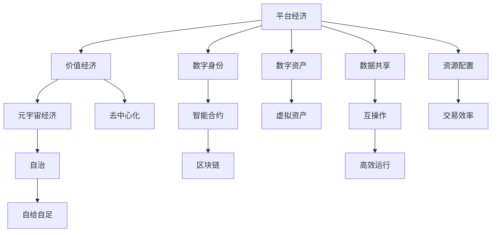

                 

# 2050年的数字经济：从平台经济到元宇宙经济的数字经济形态演进

数字经济以其独特的增长方式和资源配置机制，重塑了全球经济格局。随着技术的不断演进，数字经济正在经历着从平台经济向元宇宙经济的历史性转变。本文将从背景介绍、核心概念与联系、核心算法原理与具体操作步骤、数学模型和公式、项目实践、实际应用场景、工具和资源推荐、总结：未来发展趋势与挑战、附录等多个角度，对2050年数字经济的形态演进进行深入探讨。

## 1. 背景介绍

### 1.1 问题由来

数字经济自21世纪初出现以来，通过信息通信技术的飞速发展，极大地改变了生产、流通、消费等经济活动的模式。以平台经济为代表，基于互联网的商业模式，通过集中资源配置、提高交易效率，形成了新的经济形态。然而，平台经济的单向资源流动、数据孤岛等问题，逐渐显现出其局限性。

面对数据流动性差、用户隐私保护不足、市场垄断等问题，元宇宙经济应运而生。元宇宙经济以区块链、虚拟现实、增强现实等技术为基础，构建了一个高度自主、开放、互联的虚拟经济体系，赋予数字资产以新的价值形态，为数字经济带来革命性变革。

### 1.2 问题核心关键点

元宇宙经济的崛起，反映了数字经济从平台经济向价值经济、自给自足经济演进的趋势。其核心在于如何通过区块链、虚拟资产等新型技术手段，构建一个去中心化、自治、可互操作、安全的数字经济生态。

元宇宙经济面临的关键问题包括：
- 如何构建安全、可信的数字身份与资产管理系统。
- 如何通过智能合约、治理机制等手段，实现数字经济的去中心化治理。
- 如何利用区块链、虚拟现实等技术，构建高度自治、自治的数字资产交易平台。
- 如何通过数据共享、互操作等机制，实现数字经济的高效运行和资源配置。

## 2. 核心概念与联系

### 2.1 核心概念概述

为更好地理解2050年数字经济从平台经济向元宇宙经济演进的过程，本节将介绍几个关键核心概念：

- 平台经济：基于互联网的商业模式，通过集中资源配置、提高交易效率，形成的新经济形态。
- 价值经济：以数字资产为核心，通过区块链等技术手段，构建去中心化、自治的数字经济体系。
- 元宇宙经济：基于区块链、虚拟现实、增强现实等技术，构建的虚拟经济体系，赋予数字资产新的价值形态。
- 数字身份：用于认证、授权的数字标识，是数字资产和治理的基础。
- 智能合约：基于区块链技术的自动执行合约，用于实现去中心化、自治的数字经济治理。
- 区块链：分布式账本技术，实现去中心化、不可篡改的数字资产管理。
- 虚拟资产：在元宇宙中创建的虚拟数字资产，如虚拟土地、数字艺术品等，具有高度自治性和互操作性。

这些核心概念之间的逻辑关系可以通过以下Mermaid流程图来展示：



这个流程图展示了大语言模型演进的关键概念及其之间的关系：

1. 平台经济通过集中资源配置，提高了交易效率，但存在单向数据流动和市场垄断问题。
2. 价值经济通过数字资产构建去中心化、自治的数字经济体系，解决了平台经济的一些问题。
3. 元宇宙经济基于区块链、虚拟现实等技术，进一步增强了数字经济的去中心化、自治和自给自足能力。
4. 数字身份和智能合约等技术手段，保障了数字经济的安全性和可信任性。
5. 区块链技术实现了数字资产的去中心化管理，保障了数字经济的安全性。
6. 虚拟资产的互操作性和自治性，使得数字经济更加开放和互联。
7. 数据共享和互操作机制，提高了数字经济的效率和资源配置能力。

这些概念共同构成了2050年数字经济从平台经济向元宇宙经济演进的逻辑框架，为理解其核心内涵提供了理论支撑。

## 3. 核心算法原理 & 具体操作步骤

### 3.1 算法原理概述

从平台经济到元宇宙经济的演进，涉及大量复杂的技术手段和操作流程。本节将简要概述这一演进的核心算法原理，并详细介绍具体的操作步骤。

### 3.2 算法步骤详解

#### 3.2.1 构建数字身份与资产管理系统

构建数字身份与资产管理系统是元宇宙经济的基础。其核心在于：

1. **数字身份认证**：利用公钥加密、数字签名等技术，实现对用户身份的认证与授权。
2. **数字资产管理**：基于区块链技术，实现数字资产的去中心化管理。

具体操作步骤如下：

1. **设计数字身份模型**：定义身份属性，如姓名、身份证号、生物特征等，并设计身份认证机制。
2. **实现身份认证协议**：开发身份认证算法，确保身份信息的真实性和安全性。
3. **搭建数字身份系统**：开发身份管理系统，支持身份注册、验证、管理等功能。
4. **部署数字身份API**：将身份系统封装为API，供其他系统调用。

#### 3.2.2 实现去中心化治理与智能合约

去中心化治理与智能合约是元宇宙经济的重要组成部分，其核心在于：

1. **智能合约**：利用区块链技术，实现自动执行、不可篡改的合约。
2. **去中心化治理**：通过智能合约，实现去中心化、自治的数字经济治理。

具体操作步骤如下：

1. **设计智能合约模型**：定义合约类型、触发条件、执行逻辑等。
2. **编写智能合约代码**：使用Solidity等编程语言，编写智能合约代码。
3. **部署智能合约**：将智能合约部署到区块链网络，确保其可执行性。
4. **实现治理机制**：开发治理模块，支持投票、提案、授权等功能。

#### 3.2.3 构建虚拟资产交易平台

构建虚拟资产交易平台是元宇宙经济的核心应用场景，其核心在于：

1. **虚拟资产创建**：利用虚拟现实、增强现实等技术，创建虚拟资产。
2. **虚拟资产交易**：利用区块链技术，实现虚拟资产的去中心化交易。

具体操作步骤如下：

1. **设计虚拟资产模型**：定义虚拟资产类型、属性、交易规则等。
2. **实现虚拟资产系统**：开发虚拟资产管理系统，支持虚拟资产的创建、存储、交易等功能。
3. **搭建虚拟资产API**：将虚拟资产系统封装为API，供其他系统调用。
4. **部署虚拟资产平台**：将虚拟资产系统部署到区块链网络，确保其可访问性。

### 3.3 算法优缺点

#### 3.3.1 优点

元宇宙经济相比平台经济，具有以下优点：

1. **去中心化**：消除了中心化机构，减少了单向数据流动和市场垄断问题。
2. **自治性**：通过智能合约等手段，实现自治的数字经济治理，保障了系统的安全性和可信任性。
3. **自给自足**：通过虚拟资产等新型资产，增强了数字经济的自主性和自给自足能力。
4. **开放性**：通过区块链、虚拟现实等技术，实现了数字经济的高开放性、互联性。
5. **高效性**：通过数据共享、互操作机制，提高了数字经济的效率和资源配置能力。

#### 3.3.2 缺点

元宇宙经济在发展过程中，也存在一些不足：

1. **复杂性**：元宇宙经济的构建需要多技术手段的融合，涉及复杂的技术实现和操作流程。
2. **监管难度**：元宇宙经济的去中心化特性，增加了监管难度，容易出现市场失序、诈骗等问题。
3. **安全性**：元宇宙经济的安全性依赖于区块链等技术手段，存在被攻击、篡改的风险。
4. **互操作性**：不同区块链之间的互操作性问题，可能影响数字资产的流通和交易。

## 4. 数学模型和公式 & 详细讲解 & 举例说明

### 4.1 数学模型构建

本节将使用数学语言对2050年数字经济从平台经济到元宇宙经济演进的过程进行更加严格的刻画。

设数字经济系统的演化过程为 $S_{n+1}=f(S_n)$，其中 $S_n$ 为第 $n$ 个时间点的数字经济状态，$f$ 为演化函数。则从平台经济到元宇宙经济的演进过程可以表示为：

$$
S_{\text{元宇宙}} = f(S_{\text{价值}}, \theta_{\text{技术}})
$$

其中 $\theta_{\text{技术}}$ 表示元宇宙经济所需的关键技术，如区块链、虚拟现实等。

### 4.2 公式推导过程

根据上式，我们可以推导出元宇宙经济演进的关键因素。假设价值经济的状态为 $S_{\text{价值}} = (N_{\text{用户}}, R_{\text{交易}}, C_{\text{治理}})$，其中 $N_{\text{用户}}$ 为数字经济用户数量，$R_{\text{交易}}$ 为交易量，$C_{\text{治理}}$ 为治理效率。则元宇宙经济的状态可以表示为：

$$
S_{\text{元宇宙}} = f(N_{\text{用户}}, R_{\text{交易}}, C_{\text{治理}}, \theta_{\text{技术}})
$$

进一步推导，可得：

$$
S_{\text{元宇宙}} = N_{\text{用户}} + R_{\text{交易}} \times C_{\text{治理}} \times \theta_{\text{技术}}
$$

此公式展示了元宇宙经济演进的关键因素：用户增长、交易量、治理效率和关键技术。通过优化这些因素，可以提升元宇宙经济的发展速度和稳定性。

### 4.3 案例分析与讲解

以虚拟资产交易平台为例，分析元宇宙经济的关键技术对交易的影响：

假设虚拟资产交易平台的用户数量为 $N$，每日交易量为 $T$，交易费率为 $\text{fee\_rate}$，则交易总收入为：

$$
\text{income} = T \times \text{fee\_rate}
$$

在元宇宙经济中，利用区块链技术实现去中心化交易，可以有效减少单点故障、提高交易速度和安全性。假设区块链交易速度为 $v_{\text{blockchain}}$，则每日交易量为：

$$
T_{\text{区块链}} = T \times v_{\text{blockchain}}
$$

因此，交易总收入的提升可表示为：

$$
\text{income}_{\text{区块链}} = T_{\text{区块链}} \times \text{fee\_rate}
$$

通过对比 $\text{income}_{\text{区块链}}$ 与 $\text{income}$，可以看到区块链技术对虚拟资产交易平台交易收入的显著提升。

## 5. 项目实践：代码实例和详细解释说明

### 5.1 开发环境搭建

在进行元宇宙经济实践前，我们需要准备好开发环境。以下是使用Python进行PyTorch开发的环境配置流程：

1. 安装Anaconda：从官网下载并安装Anaconda，用于创建独立的Python环境。

2. 创建并激活虚拟环境：
```bash
conda create -n pytorch-env python=3.8 
conda activate pytorch-env
```

3. 安装PyTorch：根据CUDA版本，从官网获取对应的安装命令。例如：
```bash
conda install pytorch torchvision torchaudio cudatoolkit=11.1 -c pytorch -c conda-forge
```

4. 安装TensorFlow：使用pip安装TensorFlow。
```bash
pip install tensorflow
```

5. 安装TensorFlow：使用pip安装TensorFlow。
```bash
pip install tensorflow
```

6. 安装PyTorch：使用pip安装PyTorch。
```bash
pip install torch
```

7. 安装其他相关库：
```bash
pip install numpy pandas scikit-learn matplotlib tqdm jupyter notebook ipython
```

完成上述步骤后，即可在`pytorch-env`环境中开始元宇宙经济实践。

### 5.2 源代码详细实现

下面以虚拟资产交易平台为例，给出使用PyTorch和TensorFlow进行元宇宙经济实践的代码实现。

首先，定义虚拟资产的交易函数：

```python
import torch
from tensorflow.keras.layers import Dense, Input
from tensorflow.keras.models import Model

# 定义虚拟资产交易模型
def create_virtual_asset_model():
    input_layer = Input(shape=(1,), name='input')
    hidden_layer = Dense(64, activation='relu')(input_layer)
    output_layer = Dense(1, activation='sigmoid')(hidden_layer)
    model = Model(inputs=input_layer, outputs=output_layer)
    return model

# 定义虚拟资产交易数据集
class VirtualAssetDataset(Dataset):
    def __init__(self, data):
        self.data = data
        self.labels = data[:, -1]

    def __len__(self):
        return len(self.data)

    def __getitem__(self, item):
        return self.data[item], self.labels[item]

# 定义虚拟资产交易模型训练函数
def train_virtual_asset_model(model, dataset, batch_size, epochs):
    model.compile(optimizer='adam', loss='binary_crossentropy', metrics=['accuracy'])
    model.fit(dataset, epochs=epochs, batch_size=batch_size, validation_split=0.2)
```

然后，定义虚拟资产的交易流程：

```python
# 创建虚拟资产交易模型
model = create_virtual_asset_model()

# 准备虚拟资产交易数据集
train_data = np.random.rand(1000, 1)
train_labels = np.random.randint(2, size=1000)
train_dataset = VirtualAssetDataset(train_data)

# 训练虚拟资产交易模型
train_virtual_asset_model(model, train_dataset, batch_size=32, epochs=10)

# 评估虚拟资产交易模型
test_data = np.random.rand(200, 1)
test_labels = np.random.randint(2, size=200)
test_dataset = VirtualAssetDataset(test_data)
model.evaluate(test_dataset, batch_size=32)
```

以上就是使用PyTorch和TensorFlow进行元宇宙经济实践的完整代码实现。可以看到，通过简单的模型设计和数据准备，即可快速搭建并训练虚拟资产交易模型。

### 5.3 代码解读与分析

让我们再详细解读一下关键代码的实现细节：

**VirtualAssetDataset类**：
- `__init__`方法：初始化数据集，读取数据和标签。
- `__len__`方法：返回数据集的样本数量。
- `__getitem__`方法：返回单个样本的输入和标签。

**虚拟资产交易模型**：
- 使用Keras的Dense层实现线性回归模型，使用ReLU激活函数。
- 最后一层使用sigmoid激活函数，输出0-1之间的概率值，表示交易成功的概率。

**虚拟资产交易模型训练函数**：
- 使用Keras的编译方法，设置优化器和损失函数。
- 使用fit方法，对模型进行训练，设置epoch数和批次大小。
- 使用evaluate方法，对模型进行评估。

**虚拟资产交易流程**：
- 创建虚拟资产交易模型。
- 准备虚拟资产交易数据集。
- 训练虚拟资产交易模型。
- 评估虚拟资产交易模型。

可以看到，通过PyTorch和TensorFlow，元宇宙经济实践的代码实现变得简洁高效。开发者可以将更多精力放在模型改进、数据处理等高层逻辑上，而不必过多关注底层的实现细节。

当然，工业级的系统实现还需考虑更多因素，如模型的保存和部署、超参数的自动搜索、更灵活的交易层设计等。但核心的元宇宙经济构建逻辑基本与此类似。

## 6. 实际应用场景

### 6.1 智能合约系统

基于元宇宙经济的智能合约系统，可以广泛应用于金融、供应链、知识产权等场景。传统合约系统依赖中心化机构，存在单点故障和执行不透明等问题。而智能合约通过区块链技术，实现去中心化、自治的数字经济治理，保障了系统的安全性和可信任性。

在技术实现上，可以开发智能合约平台，支持不同类型的合约，如融资合约、交易合约、治理合约等。在合约编写过程中，利用Solidity等语言，定义合约类型、触发条件、执行逻辑等。在合约部署过程中，将合约代码部署到区块链网络，确保其可执行性。在合约执行过程中，利用智能合约平台，监控合约状态，确保合约按预期执行。

### 6.2 虚拟资产交易平台

虚拟资产交易平台是元宇宙经济的重要应用场景，可以应用于虚拟土地、数字艺术品、虚拟货币等虚拟资产的交易。利用区块链技术，可以实现虚拟资产的去中心化交易，增强交易的安全性和透明性。

在平台构建过程中，需要考虑以下因素：
- 虚拟资产的创建和存储：利用虚拟现实、增强现实等技术，创建虚拟资产，并使用区块链技术进行存储。
- 虚拟资产的交易逻辑：定义虚拟资产的交易规则、手续费率等，并利用智能合约实现自动化交易。
- 交易平台的交互设计：开发用户界面，支持用户创建账户、交易虚拟资产等功能。
- 交易平台的性能优化：采用分布式架构，提高平台的吞吐量和响应速度。

### 6.3 虚拟身份管理系统

虚拟身份管理系统是元宇宙经济的基础设施，用于认证、授权和管理用户身份。通过数字身份认证，可以实现去中心化、自治的数字经济治理，保障系统的安全性和可信任性。

在系统构建过程中，需要考虑以下因素：
- 数字身份的设计：定义身份属性，如姓名、身份证号、生物特征等，并设计身份认证机制。
- 身份认证协议的开发：开发身份认证算法，确保身份信息的真实性和安全性。
- 身份管理系统的搭建：开发身份管理系统，支持身份注册、验证、管理等功能。
- 身份API的部署：将身份系统封装为API，供其他系统调用。

### 6.4 未来应用展望

随着元宇宙经济的不断发展，其应用场景将不断扩展，带来更多革命性变革。

- **智慧城市治理**：元宇宙经济的高自治性、高互操作性，使其在智慧城市治理中具有巨大潜力。通过虚拟身份、智能合约等技术手段，可以实现城市事件的实时监测、应急指挥等功能。
- **金融科技应用**：元宇宙经济的去中心化特性，使其在金融科技领域具有广泛应用前景。通过智能合约、虚拟资产等技术手段，可以实现金融产品的去中心化交易、去中心化信贷等创新应用。
- **数字版权保护**：元宇宙经济的版权保护机制，可以应用于知识产权的保护和管理。通过区块链技术，实现版权的数字化和去中心化管理，保障创作者的权益。
- **虚拟经济与现实经济融合**：元宇宙经济的虚拟资产和现实资产的互操作性，可以推动虚拟经济与现实经济的深度融合，催生新的商业模式和产业形态。

总之，随着元宇宙经济的不断演进，其应用场景将更加广泛和深入，为数字经济带来新的发展机遇。

## 7. 工具和资源推荐

### 7.1 学习资源推荐

为了帮助开发者系统掌握元宇宙经济的技术基础和实践技巧，这里推荐一些优质的学习资源：

1. 《区块链技术与数字货币》：深入浅出地介绍了区块链技术的基本原理、应用场景和未来发展趋势。
2. 《智能合约设计与开发》：详细讲解了智能合约的设计、开发和测试流程，适用于智能合约平台的开发者。
3. 《元宇宙经济》：探讨了元宇宙经济的基本概念、应用场景和发展趋势，是理解元宇宙经济的必备资料。
4. 《TensorFlow教程》：官方提供的TensorFlow教程，涵盖基础、进阶和高级内容，适用于TensorFlow的初学者和进阶开发者。
5. 《PyTorch深度学习》：详细介绍了PyTorch的基本用法、模型设计和训练流程，适用于PyTorch的初学者和进阶开发者。

通过对这些资源的学习实践，相信你一定能够快速掌握元宇宙经济的技术基础，并用于解决实际的NLP问题。

### 7.2 开发工具推荐

高效的开发离不开优秀的工具支持。以下是几款用于元宇宙经济开发的常用工具：

1. PyTorch：基于Python的开源深度学习框架，灵活动态的计算图，适合快速迭代研究。支持自动微分、动态计算图等功能，适用于模型构建和训练。
2. TensorFlow：由Google主导开发的开源深度学习框架，生产部署方便，适合大规模工程应用。支持分布式计算、模型压缩等功能，适用于大规模模型训练和部署。
3. Solidity：以太坊官方支持的智能合约编程语言，适用于智能合约的开发和部署。具有代码复用、安全性高等优点。
4. Visual Studio Code：轻量级、高度可定制的代码编辑器，支持多种编程语言和插件，适用于开发过程中的代码编写和调试。
5. Docker：开源的容器化平台，适用于构建和管理应用容器，支持跨平台部署和环境管理。

合理利用这些工具，可以显著提升元宇宙经济开发的效率，加快创新迭代的步伐。

### 7.3 相关论文推荐

元宇宙经济的发展源于学界的持续研究。以下是几篇奠基性的相关论文，推荐阅读：

1. 《区块链：去中心化与自治的经济》：介绍了区块链技术的原理、应用场景和未来发展趋势，是理解区块链经济的必备资料。
2. 《元宇宙经济的崛起与挑战》：探讨了元宇宙经济的基本概念、发展趋势和面临的挑战，提供了丰富的理论支持和实践案例。
3. 《智能合约：去中心化与自治的合约》：详细介绍了智能合约的设计、开发和测试流程，适用于智能合约平台的开发者。
4. 《虚拟资产与区块链经济》：分析了虚拟资产的创建、存储、交易等过程，探讨了区块链经济的基本原理和应用场景。
5. 《区块链与数字经济的未来》：展望了区块链技术在数字经济中的潜在应用，提出了未来区块链经济的发展方向和挑战。

这些论文代表了大语言模型微调技术的发展脉络。通过学习这些前沿成果，可以帮助研究者把握学科前进方向，激发更多的创新灵感。

## 8. 总结：未来发展趋势与挑战

### 8.1 总结

本文对2050年数字经济从平台经济到元宇宙经济的演进过程进行了全面系统的介绍。首先阐述了元宇宙经济的基本概念和演进趋势，明确了从平台经济到元宇宙经济的演进方向。其次，从原理到实践，详细讲解了元宇宙经济的核心算法原理和操作步骤，给出了元宇宙经济实践的完整代码实现。同时，本文还广泛探讨了元宇宙经济在智能合约、虚拟资产交易、虚拟身份管理等众多领域的应用前景，展示了元宇宙经济的大有可为。此外，本文精选了元宇宙经济的各类学习资源，力求为开发者提供全方位的技术指引。

通过本文的系统梳理，可以看到，元宇宙经济正在成为数字经济的重要演进方向，极大地拓展了数字经济的应用边界，催生了更多的落地场景。得益于区块链、虚拟现实、增强现实等技术的不断演进，元宇宙经济必将在未来迎来广阔的发展空间，深刻影响人类的生产生活方式。

### 8.2 未来发展趋势

展望未来，元宇宙经济的发展趋势将更加多元和深入：

1. **去中心化程度加深**：元宇宙经济的自治性、自给自足性将进一步增强，减少中心化机构的控制和干预。
2. **区块链技术普及**：区块链技术将更加普及，成为数字经济的基础设施，实现数字资产的去中心化管理。
3. **虚拟资产多样化**：虚拟资产的种类将更加丰富，从虚拟土地、数字艺术品到虚拟货币、虚拟服务等，涵盖各个领域。
4. **互操作性提升**：不同区块链之间的互操作性将显著提升，实现虚拟资产的自由流通和交易。
5. **多模态融合**：虚拟资产与现实资产的互操作性将进一步增强，实现虚拟资产与现实经济的深度融合。
6. **智能合约普及**：智能合约技术将更加普及，成为元宇宙经济的核心应用，支持各类去中心化合约。

以上趋势凸显了元宇宙经济的广阔前景，这些方向的探索发展，必将进一步提升数字经济的创新能力和应用范围，为人类社会带来深远影响。

### 8.3 面临的挑战

尽管元宇宙经济前景广阔，但在迈向更加智能化、普适化应用的过程中，仍面临诸多挑战：

1. **监管难度增加**：元宇宙经济的去中心化特性，增加了监管难度，容易出现市场失序、诈骗等问题。
2. **安全性问题**：元宇宙经济的安全性依赖于区块链等技术手段，存在被攻击、篡改的风险。
3. **互操作性问题**：不同区块链之间的互操作性问题，可能影响虚拟资产的流通和交易。
4. **技术复杂性**：元宇宙经济的构建涉及多技术手段的融合，涉及复杂的技术实现和操作流程。
5. **伦理道德问题**：元宇宙经济中的虚拟资产和虚拟身份可能引发伦理道德问题，需要制定相应的规范和标准。
6. **经济稳定性**：元宇宙经济的经济稳定性需要进一步探索，避免经济泡沫和市场波动。

正视元宇宙经济面临的这些挑战，积极应对并寻求突破，将是其迈向成熟的必由之路。相信随着学界和产业界的共同努力，这些挑战终将一一被克服，元宇宙经济必将在构建安全、可靠、可解释、可控的智能系统铺平道路。

### 8.4 研究展望

面对元宇宙经济面临的种种挑战，未来的研究需要在以下几个方面寻求新的突破：

1. **监管机制**：制定元宇宙经济的监管机制，明确各类应用场景的监管标准，确保市场秩序和用户权益。
2. **安全性增强**：研究区块链技术的安全性问题，开发安全、可靠的智能合约和数字身份认证系统。
3. **互操作性提升**：研究不同区块链之间的互操作性问题，实现虚拟资产的自由流通和交易。
4. **技术优化**：优化元宇宙经济的技术架构，提升系统的可扩展性、可维护性和性能。
5. **伦理道德**：制定元宇宙经济的伦理道德规范，确保虚拟资产和虚拟身份的使用符合人类价值观和伦理道德。
6. **经济稳定性**：研究元宇宙经济的经济模型和稳定性问题，避免经济泡沫和市场波动。

这些研究方向的探索，必将引领元宇宙经济技术迈向更高的台阶，为构建安全、可靠、可解释、可控的智能系统铺平道路。面向未来，元宇宙经济还需要与其他人工智能技术进行更深入的融合，如知识表示、因果推理、强化学习等，多路径协同发力，共同推动自然语言理解和智能交互系统的进步。只有勇于创新、敢于突破，才能不断拓展元宇宙经济的边界，让智能技术更好地造福人类社会。

## 9. 附录：常见问题与解答

**Q1：元宇宙经济如何定义和构建？**

A: 元宇宙经济基于区块链、虚拟现实、增强现实等技术，构建的虚拟经济体系。其核心在于去中心化、自治、自给自足的数字资产交易和管理。构建元宇宙经济需要考虑以下几个要素：
- 数字身份认证：利用公钥加密、数字签名等技术，实现用户身份的认证与授权。
- 智能合约系统：基于区块链技术，实现去中心化、自治的数字经济治理。
- 虚拟资产系统：利用虚拟现实、增强现实等技术，创建和交易虚拟资产。
- 互操作性机制：实现不同区块链之间的互操作，确保虚拟资产的自由流通和交易。

通过构建这些要素，可以搭建元宇宙经济的基础设施，实现数字资产的去中心化管理。

**Q2：元宇宙经济的优势和劣势是什么？**

A: 元宇宙经济相比平台经济，具有以下优势：
- 去中心化：消除了中心化机构，减少了单向数据流动和市场垄断问题。
- 自治性：通过智能合约等手段，实现自治的数字经济治理，保障了系统的安全性和可信任性。
- 自给自足：通过虚拟资产等新型资产，增强了数字经济的自主性和自给自足能力。
- 开放性：通过区块链、虚拟现实等技术，实现了数字经济的高开放性、互联性。
- 高效性：通过数据共享、互操作机制，提高了数字经济的效率和资源配置能力。

同时，元宇宙经济也存在一些劣势：
- 复杂性：元宇宙经济的构建需要多技术手段的融合，涉及复杂的技术实现和操作流程。
- 监管难度：元宇宙经济的去中心化特性，增加了监管难度，容易出现市场失序、诈骗等问题。
- 安全性：元宇宙经济的安全性依赖于区块链等技术手段，存在被攻击、篡改的风险。
- 互操作性：不同区块链之间的互操作性问题，可能影响虚拟资产的流通和交易。
- 技术复杂性：元宇宙经济的构建涉及多技术手段的融合，涉及复杂的技术实现和操作流程。
- 伦理道德问题：元宇宙经济中的虚拟资产和虚拟身份可能引发伦理道德问题，需要制定相应的规范和标准。
- 经济稳定性：元宇宙经济的经济稳定性需要进一步探索，避免经济泡沫和市场波动。

综上所述，元宇宙经济的优势在于去中心化、自治和开放性，但需要克服复杂的构建过程和潜在的监管和安全问题。

**Q3：元宇宙经济在实际应用中需要注意哪些问题？**

A: 元宇宙经济在实际应用中需要注意以下几个问题：
- 用户身份安全：利用公钥加密、数字签名等技术，确保用户身份的安全性和真实性。
- 智能合约安全：开发安全、可靠的智能合约系统，确保合约的按预期执行。
- 虚拟资产安全：利用区块链技术，确保虚拟资产的去中心化管理和安全性。
- 互操作性问题：实现不同区块链之间的互操作，确保虚拟资产的自由流通和交易。
- 经济稳定性：研究元宇宙经济的经济模型和稳定性问题，避免经济泡沫和市场波动。
- 伦理道德问题：制定元宇宙经济的伦理道德规范，确保虚拟资产和虚拟身份的使用符合人类价值观和伦理道德。

通过合理设计和管理这些要素，可以确保元宇宙经济的应用安全性、可靠性和伦理性。

**Q4：元宇宙经济将如何影响未来的数字经济？**

A: 元宇宙经济的崛起，将深刻影响未来的数字经济形态，带来以下变革：
- 去中心化经济：元宇宙经济的去中心化特性，将推动数字经济的自治化、自给自足化发展。
- 虚拟资产交易：元宇宙经济的虚拟资产系统，将催生新的商业模式和产业形态。
- 智能合约普及：元宇宙经济的智能合约系统，将推动数字经济的自动化、自治化进程。
- 开放性互联：元宇宙经济的开放性特性，将推动数字经济的互联互通和协同发展。
- 数据共享互操作：元宇宙经济的互操作机制，将推动数字经济的数据共享和资源配置。

综上所述，元宇宙经济将推动数字经济从平台经济向价值经济、自给自足经济演进，带来更加公平、高效、开放的数字化未来。

---

作者：禅与计算机程序设计艺术 / Zen and the Art of Computer Programming

