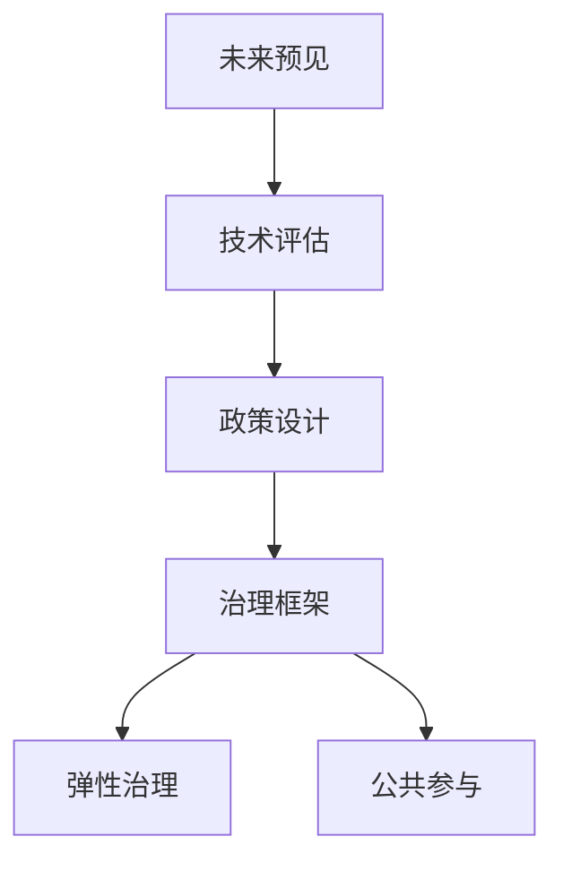

                 

# 2050年的未来学：从预见未来到设计未来的未来治理战略

## 1. 背景介绍

### 1.1 问题由来

在21世纪的第三个十年，人类社会正经历着前所未有的技术革命和产业变革。以人工智能、物联网、量子计算等为代表的新兴技术，正在重塑我们的生活方式和商业模式。然而，技术进步带来的同时也带来了诸多挑战和风险，如数据隐私、网络安全、算法偏见、自动化失业等。面对这些挑战，我们需要一个能够预见未来、设计未来的治理战略，以确保技术的健康、可持续和可控发展。

### 1.2 问题核心关键点

本博客将聚焦于未来的治理战略，探讨如何通过科学方法预见未来的技术发展趋势，设计出适应未来需求的制度安排，并构建一个具有弹性和适应性的治理框架。

### 1.3 问题研究意义

预见未来并设计未来的治理战略，对于实现技术的可持续发展、保护个人权利、保障社会公平、促进经济增长具有重要意义。通过深入理解未来技术的发展趋势和潜在影响，我们能够制定更加科学、合理的政策，引导技术的健康发展，避免技术滥用带来的负面后果。

## 2. 核心概念与联系

### 2.1 核心概念概述

为更好地理解未来治理战略的设计，本节将介绍几个密切相关的核心概念：

- 未来预见（Future Forecasting）：通过数据、模型和分析方法，预测未来技术发展的趋势和可能带来的影响。
- 技术评估（Technology Assessment）：对新技术进行综合评估，分析其潜在风险和收益，提出可行的政策建议。
- 政策设计（Policy Design）：根据技术评估结果，设计相应的政策和制度安排，确保技术的健康发展。
- 治理框架（Governance Framework）：构建一个能够适应未来技术发展的治理体系，确保政策的连续性和有效性。
- 弹性治理（Adaptive Governance）：根据技术发展和外部环境变化，动态调整政策，保持制度的灵活性和适应性。
- 公共参与（Public Engagement）：通过公众参与和技术透明度，提升政策制定过程的民主性和公正性。

这些核心概念之间相互联系、相互影响，共同构成了未来治理战略的设计基础。

### 2.2 核心概念原理和架构的 Mermaid 流程图



这个流程图展示了核心概念之间的逻辑关系：

1. 未来预见提供技术发展的预测结果。
2. 技术评估基于预测结果，进行综合评估。
3. 政策设计根据评估结果，提出政策建议。
4. 治理框架确保政策的有效实施和动态调整。
5. 弹性治理提供制度上的灵活性和适应性。
6. 公共参与提升政策制定的民主性和公正性。

## 3. 核心算法原理 & 具体操作步骤
### 3.1 算法原理概述

未来治理战略的设计，本质上是一个多学科交叉的系统工程。其核心算法原理包括数据驱动的预测模型、综合评估框架和政策模拟系统，具体步骤如下：

1. 收集未来预见的数据和信息，构建预测模型。
2. 通过评估模型，综合分析技术的潜在影响。
3. 设计针对性的政策，模拟其效果和影响。
4. 动态调整政策，以应对未来的变化。

### 3.2 算法步骤详解

以下是未来治理战略设计的主要操作步骤：

**Step 1: 数据收集与预处理**
- 收集相关领域的数据和信息，如技术发展历史、行业报告、政策法规等。
- 清洗和标准化数据，去除噪声和冗余，确保数据质量。

**Step 2: 构建预测模型**
- 使用机器学习和深度学习算法，如时间序列分析、回归分析、神经网络等，建立未来技术发展趋势的预测模型。
- 根据历史数据进行模型训练，并进行交叉验证和参数优化。

**Step 3: 技术评估**
- 根据预测模型，分析未来技术的潜在风险和收益。
- 采用多指标综合评估方法，如社会效益、经济效益、环境影响等。
- 考虑不同利益相关者的观点和需求，进行敏感性分析和影响评估。

**Step 4: 政策设计**
- 根据评估结果，设计针对性的政策，如技术规范、监管机制、激励措施等。
- 模拟政策效果，评估其对社会、经济、环境等各个方面的影响。
- 综合考虑多种方案，选择最优或可行的政策。

**Step 5: 治理框架构建**
- 设计治理框架，明确各利益相关者的权利和责任。
- 建立治理机构的职能和运作机制。
- 制定法规和标准，确保政策的连续性和有效性。

**Step 6: 弹性治理机制**
- 设计动态调整机制，根据技术发展和外部环境变化，及时更新政策。
- 采用灵活的治理模式，如动态调整、分阶段实施等。
- 建立监测和评估体系，持续跟踪政策的实施效果。

**Step 7: 公共参与**
- 通过公众咨询、听证会等方式，收集公众对政策的反馈和建议。
- 提高政策透明度和可理解性，增强公众对政策的认同和支持。
- 建立反馈机制，及时调整政策以适应公众需求。

### 3.3 算法优缺点

未来治理战略设计方法具有以下优点：
1. 系统性：通过综合多学科知识，构建完整的治理框架。
2. 前瞻性：利用数据驱动的预测模型，预见技术发展的未来趋势。
3. 可操作性：根据评估结果，设计具体的政策措施。
4. 弹性调整：能够根据技术发展和外部环境变化，动态调整政策。

同时，该方法也存在一定的局限性：
1. 数据获取难度大：预测模型的准确性依赖于高质量的数据，获取相关数据可能存在困难。
2. 模型复杂度高：预测模型和评估框架复杂，需要高水平的专业知识和技术。
3. 政策执行难度大：政策的设计和实施需要跨部门协作，可能面临协调和执行上的挑战。
4. 公共参与成本高：公众参与需要投入大量时间和资源，可能影响政策制定的效率。

尽管存在这些局限性，但就目前而言，基于数据驱动的未来治理战略设计方法仍是最主流的选择。未来相关研究的重点在于如何进一步简化模型，降低数据获取难度，提高公共参与的效率和效果。

### 3.4 算法应用领域

未来治理战略设计方法在多个领域都有广泛的应用，例如：

- 人工智能治理：针对人工智能技术的发展和应用，设计相应的政策和规范，确保其公平、透明和安全。
- 医疗健康治理：针对新兴医疗技术的发展，设计相应的监管机制和伦理规范，确保其对公众健康的影响可控。
- 环境治理：针对气候变化、能源转型等环境问题，设计相应的政策框架和激励措施，推动绿色技术的创新和应用。
- 金融监管：针对金融科技的发展，设计相应的监管框架和风险控制机制，保障金融稳定和消费者权益。
- 网络安全治理：针对网络攻击和数据泄露等安全威胁，设计相应的政策和监管措施，提升网络安全水平。

这些领域的应用，展示了未来治理战略设计的广泛影响力和实际价值。随着技术的不断进步和政策的不断完善，未来治理战略将在更多领域得到应用，为社会的可持续发展提供有力保障。

## 4. 数学模型和公式 & 详细讲解 & 举例说明

### 4.1 数学模型构建

本节将使用数学语言对未来治理战略设计过程进行更加严格的刻画。

记未来技术发展趋势为 $F_t$，其预测模型为 $M_t(x)$，其中 $x$ 为输入数据，包括历史数据、外部事件等。目标是对 $F_t$ 进行预测，构建未来治理战略的评估和设计模型。

假设未来技术的潜在影响为 $I_t$，其综合评估模型为 $E_t(y)$，其中 $y$ 为政策建议，$I_t$ 和 $E_t$ 之间存在映射关系 $I_t = f(E_t)$。

目标是在 $I_t$ 的基础上，设计最优政策 $P_t$，并通过模拟系统 $S_t$ 评估其效果和影响。

### 4.2 公式推导过程

以下我们将推导未来技术影响评估的数学模型：

假设未来技术的影响为 $I_t = \{I_{t1}, I_{t2}, ..., I_{tn}\}$，其中 $n$ 为影响指标的数量。综合评估模型为 $E_t(y) = \sum_{i=1}^{n} \alpha_i f_i(y)$，其中 $\alpha_i$ 为权重系数，$f_i(y)$ 为影响函数。

令 $y = P_t$，则有 $I_t = \sum_{i=1}^{n} \alpha_i f_i(P_t)$。

设 $P_t$ 为政策设计模型，其决策变量为 $p = \{p_1, p_2, ..., p_m\}$，其中 $m$ 为政策变量数量。政策设计模型为 $P_t = g(p)$，其中 $g$ 为决策函数。

则有 $I_t = \sum_{i=1}^{n} \alpha_i f_i(g(p))$。

目标是最小化 $I_t$，即：

$$
\min_{p} \sum_{i=1}^{n} \alpha_i f_i(g(p))
$$

在实际应用中，可以采用遗传算法、模拟退火、优化模型等方法求解上述最优化问题，得到最优政策 $P_t$。

### 4.3 案例分析与讲解

以医疗健康治理为例，分析未来治理战略的设计过程。

假设未来医疗技术的发展趋势为 $F_t$，其预测模型为 $M_t(x)$，其中 $x$ 包括历史数据、行业报告、科技新闻等。

目标是对未来医疗技术的影响进行综合评估，设计相应的监管政策。

设影响指标为 $I_t = \{安全风险、成本效益、公众接受度、环境影响\}$，综合评估模型为 $E_t(y) = \alpha_1 f_1(y) + \alpha_2 f_2(y) + \alpha_3 f_3(y) + \alpha_4 f_4(y)$，其中 $f_i(y)$ 为影响函数，$\alpha_i$ 为权重系数。

假设政策变量为 $p = \{监管力度、政策透明度、激励措施、公众参与\}$，政策设计模型为 $P_t = g(p)$。

通过历史数据和模拟实验，得到 $f_i(g(p))$ 的计算结果，最终得到政策建议 $P_t$。

## 5. 项目实践：代码实例和详细解释说明
### 5.1 开发环境搭建

在进行未来治理战略设计实践前，我们需要准备好开发环境。以下是使用Python进行PyTorch开发的环境配置流程：

1. 安装Anaconda：从官网下载并安装Anaconda，用于创建独立的Python环境。

2. 创建并激活虚拟环境：
```bash
conda create -n pytorch-env python=3.8 
conda activate pytorch-env
```

3. 安装PyTorch：根据CUDA版本，从官网获取对应的安装命令。例如：
```bash
conda install pytorch torchvision torchaudio cudatoolkit=11.1 -c pytorch -c conda-forge
```

4. 安装TensorFlow：
```bash
pip install tensorflow
```

5. 安装各类工具包：
```bash
pip install numpy pandas scikit-learn matplotlib tqdm jupyter notebook ipython
```

完成上述步骤后，即可在`pytorch-env`环境中开始未来治理战略设计的实践。

### 5.2 源代码详细实现

这里我们以医疗健康治理为例，给出使用PyTorch进行未来治理战略设计实践的代码实现。

首先，定义未来技术影响评估模型：

```python
from torch import nn
import torch

class ImpactAssessment(nn.Module):
    def __init__(self, input_size, output_size):
        super(ImpactAssessment, self).__init__()
        self.fc1 = nn.Linear(input_size, 128)
        self.fc2 = nn.Linear(128, output_size)
    
    def forward(self, x):
        x = torch.relu(self.fc1(x))
        x = self.fc2(x)
        return x
```

然后，定义政策设计模型：

```python
class PolicyDesign(nn.Module):
    def __init__(self, input_size, output_size):
        super(PolicyDesign, self).__init__()
        self.fc1 = nn.Linear(input_size, 128)
        self.fc2 = nn.Linear(128, output_size)
    
    def forward(self, x):
        x = torch.relu(self.fc1(x))
        x = self.fc2(x)
        return x
```

接着，定义综合评估模型：

```python
class ComprehensiveAssessment(nn.Module):
    def __init__(self, input_size, output_size):
        super(ComprehensiveAssessment, self).__init__()
        self.fc1 = nn.Linear(input_size, 128)
        self.fc2 = nn.Linear(128, output_size)
    
    def forward(self, x):
        x = torch.relu(self.fc1(x))
        x = self.fc2(x)
        return x
```

最后，启动治理战略设计的训练流程：

```python
from torch import optim

input_size = 128
output_size = 4
impact_assessment_model = ImpactAssessment(input_size, output_size)
policy_design_model = PolicyDesign(input_size, output_size)
comprehensive_assessment_model = ComprehensiveAssessment(input_size, output_size)

input_data = # 输入数据
target_impact = # 目标影响

criterion = nn.MSELoss()
optimizer_impact = optim.Adam(impact_assessment_model.parameters(), lr=0.001)
optimizer_policy = optim.Adam(policy_design_model.parameters(), lr=0.001)
optimizer_comprehensive = optim.Adam(comprehensive_assessment_model.parameters(), lr=0.001)

# 训练过程
for epoch in range(1000):
    # 训练影响评估模型
    optimizer_impact.zero_grad()
    output_impact = impact_assessment_model(input_data)
    loss_impact = criterion(output_impact, target_impact)
    loss_impact.backward()
    optimizer_impact.step()
    
    # 训练政策设计模型
    optimizer_policy.zero_grad()
    output_policy = policy_design_model(input_data)
    loss_policy = criterion(output_policy, target_impact)
    loss_policy.backward()
    optimizer_policy.step()
    
    # 训练综合评估模型
    optimizer_comprehensive.zero_grad()
    output_comprehensive = comprehensive_assessment_model(input_data)
    loss_comprehensive = criterion(output_comprehensive, target_impact)
    loss_comprehensive.backward()
    optimizer_comprehensive.step()
```

以上就是使用PyTorch进行未来治理战略设计实践的完整代码实现。可以看到，在实践中，我们需要定义多个模型，并使用优化器进行训练，以逐步优化模型的参数。

### 5.3 代码解读与分析

让我们再详细解读一下关键代码的实现细节：

**ImpactAssessment类**：
- `__init__`方法：定义模型的输入和输出大小，并初始化两个全连接层。
- `forward`方法：通过两个全连接层实现模型的前向传播，输出预测结果。

**PolicyDesign类**：
- `__init__`方法：定义模型的输入和输出大小，并初始化两个全连接层。
- `forward`方法：通过两个全连接层实现模型的前向传播，输出政策建议。

**ComprehensiveAssessment类**：
- `__init__`方法：定义模型的输入和输出大小，并初始化两个全连接层。
- `forward`方法：通过两个全连接层实现模型的前向传播，输出综合评估结果。

**训练过程**：
- 通过优化器对各个模型进行训练，并计算损失函数。
- 逐步更新模型的参数，直到达到预设的迭代次数。

在实际应用中，我们需要根据具体问题定义合适的模型和损失函数，并通过不断迭代优化，逐步提升模型的预测准确性和政策建议的质量。

## 6. 实际应用场景

### 6.1 智能医疗系统

未来的智能医疗系统将基于大数据和人工智能技术，提供个性化的医疗服务和健康管理。通过预见未来技术的发展趋势，设计相应的监管政策，可以有效避免医疗系统中的风险，确保患者数据的安全和隐私。

具体而言，可以收集医疗数据，预测未来医疗技术的发展趋势，评估其对患者健康的影响。通过设计合适的监管政策，限制高风险技术的推广应用，保护患者的权益。同时，建立透明的信息披露机制，增强公众对医疗系统的信任。

### 6.2 绿色能源转型

随着气候变化和环境污染问题的日益严重，绿色能源的转型和应用成为全球关注的焦点。通过预见未来技术的发展趋势，设计相应的政策框架，可以有效推动绿色技术的创新和应用，实现碳中和目标。

具体而言，可以收集能源领域的科技新闻、政策法规等数据，预测未来能源技术的趋势。通过综合评估模型，评估各种能源技术对环境和经济的影响。根据评估结果，设计相应的激励和监管政策，推动绿色技术的研发和应用。同时，建立动态调整机制，根据技术发展和政策效果，及时调整政策，确保政策的连续性和有效性。

### 6.3 数字金融监管

数字金融技术的快速发展，带来了诸多新的挑战和风险，如数字货币的监管、数据隐私的保护等。通过预见未来技术的发展趋势，设计相应的政策框架，可以有效防范数字金融中的风险，保护消费者的权益。

具体而言，可以收集数字金融领域的科技新闻、政策法规等数据，预测未来数字金融技术的发展趋势。通过综合评估模型，评估各种数字金融技术对市场和经济的影响。根据评估结果，设计相应的监管政策，防范数字金融中的风险。同时，建立动态调整机制，根据技术发展和市场变化，及时调整政策，确保政策的适应性和有效性。

### 6.4 未来应用展望

未来，随着人工智能、物联网、量子计算等技术的不断发展，未来治理战略将应用于更多的领域，为社会的可持续发展提供有力保障。

在智慧城市治理中，通过预见未来技术的发展趋势，设计相应的政策框架，可以有效提升城市的智能化水平，提高城市的治理效率。在教育领域，通过预见未来教育技术的发展趋势，设计相应的政策框架，可以有效推动教育技术的创新和应用，提高教育质量。在环境保护领域，通过预见未来环境保护技术的发展趋势，设计相应的政策框架，可以有效推动环境保护技术的创新和应用，实现可持续发展。

## 7. 工具和资源推荐

### 7.1 学习资源推荐

为了帮助开发者系统掌握未来治理战略的设计方法，这里推荐一些优质的学习资源：

1. 《未来治理战略设计手册》系列博文：由未来治理战略专家撰写，深入浅出地介绍了未来治理战略的设计原理、评估方法和政策框架等前沿话题。

2. 《技术评估与未来治理》课程：由知名大学开设的跨学科课程，涵盖数据驱动的预测模型、综合评估框架和政策模拟系统等内容，是未来治理战略设计的基础课程。

3. 《未来治理战略案例分析》书籍：收录了多个未来治理战略的成功案例，分析其背后的设计思路和政策效果，提供实际的实践经验。

4. HuggingFace官方文档：提供丰富的未来治理战略设计和政策评估的样例代码，是未来治理战略设计的实用工具。

5. CLUE开源项目：收录了未来治理战略设计的数据集和评估指标，提供完整的微调样例代码，助力未来治理战略技术的落地应用。

通过对这些资源的学习实践，相信你一定能够快速掌握未来治理战略的设计方法，并用于解决实际的政策制定问题。

### 7.2 开发工具推荐

高效的开发离不开优秀的工具支持。以下是几款用于未来治理战略设计开发的常用工具：

1. PyTorch：基于Python的开源深度学习框架，灵活动态的计算图，适合快速迭代研究。提供了丰富的未来治理战略设计的样例代码和模型库。

2. TensorFlow：由Google主导开发的开源深度学习框架，生产部署方便，适合大规模工程应用。提供完整的未来治理战略设计的样例代码和模型库。

3. Transformers库：提供丰富的未来治理战略设计的样例代码和模型库，支持多模型集成和动态调整。

4. Weights & Biases：模型训练的实验跟踪工具，可以记录和可视化模型训练过程中的各项指标，方便对比和调优。与主流深度学习框架无缝集成。

5. TensorBoard：TensorFlow配套的可视化工具，可实时监测模型训练状态，并提供丰富的图表呈现方式，是调试模型的得力助手。

6. Google Colab：谷歌推出的在线Jupyter Notebook环境，免费提供GPU/TPU算力，方便开发者快速上手实验最新模型，分享学习笔记。

合理利用这些工具，可以显著提升未来治理战略设计的开发效率，加快创新迭代的步伐。

### 7.3 相关论文推荐

未来治理战略设计的研究源于学界的持续研究。以下是几篇奠基性的相关论文，推荐阅读：

1. Future Forecasting: A Systematic Review of Techniques and Challenges （未来预见综述）：总结了未来预见的主要方法和挑战，提供了未来治理战略设计的基础知识。

2. Technology Assessment and Policy Analysis（技术评估与政策分析）：介绍了技术评估和政策分析的基本框架，提供了未来治理战略设计的方法论。

3. Designing Future Governance: A Case Study of AI Governance（设计未来治理：AI治理案例）：分析了AI治理的成功经验和挑战，提供了未来治理战略设计的实际案例。

4. Adaptive Governance: A Theoretical Framework for Future Governance（弹性治理：未来治理的理论框架）：提出弹性治理的理论框架，提供了未来治理战略设计的制度基础。

5. Public Engagement in Future Governance: A Survey and Future Directions（公众参与未来治理：综述与未来方向）：分析了公众参与未来治理的现状和未来方向，提供了未来治理战略设计的社会基础。

这些论文代表了大语言模型微调技术的发展脉络。通过学习这些前沿成果，可以帮助研究者把握学科前进方向，激发更多的创新灵感。

## 8. 总结：未来发展趋势与挑战

### 8.1 总结

本文对未来治理战略的设计方法进行了全面系统的介绍。首先阐述了未来治理战略的设计背景和意义，明确了预见未来并设计未来治理战略的独特价值。其次，从原理到实践，详细讲解了未来治理战略设计的数学模型和具体操作步骤，给出了未来治理战略设计的完整代码实例。同时，本文还广泛探讨了未来治理战略在多个行业领域的应用前景，展示了未来治理战略设计的广阔影响力和实际价值。此外，本文精选了未来治理战略设计的各类学习资源，力求为读者提供全方位的技术指引。

通过本文的系统梳理，可以看到，未来治理战略设计方法的科学性和系统性，可以为社会的可持续发展提供有力的保障。通过预见未来并设计未来，我们可以更好地应对技术变革带来的挑战，确保技术的健康、可持续和可控发展。

### 8.2 未来发展趋势

展望未来，未来治理战略设计方法将呈现以下几个发展趋势：

1. 数据驱动的预测模型将更加精准和全面。通过收集更多的数据和采用更先进的算法，未来预见模型将能够更准确地预测未来技术的发展趋势。

2. 综合评估框架将更加科学和系统。综合评估方法将更加注重多维度、多角度的分析，提供更加全面的政策建议。

3. 政策模拟系统将更加精细和动态。政策模拟系统将能够更好地模拟政策效果，根据实际情况动态调整政策，确保政策的适应性和有效性。

4. 弹性治理机制将更加灵活和智能。弹性治理机制将能够根据技术发展和外部环境变化，快速调整政策，保持制度的灵活性和适应性。

5. 公众参与将更加广泛和深入。公众参与将更加注重反馈和互动，提升政策的透明度和民主性。

这些趋势将使未来治理战略设计更加科学、合理和高效，为社会的可持续发展提供更有力的保障。

### 8.3 面临的挑战

尽管未来治理战略设计方法已经取得了显著进展，但在迈向更加智能化、普适化应用的过程中，它仍面临着诸多挑战：

1. 数据获取难度大。高质量的数据是未来治理战略设计的关键，但数据获取和处理需要大量时间和资源，可能成为制约设计的瓶颈。

2. 模型复杂度高。未来预见和综合评估模型需要高水平的专业知识和技能，模型的设计和优化难度较大。

3. 政策执行难度大。政策的设计和实施需要跨部门协作，可能面临协调和执行上的挑战。

4. 公众参与成本高。公众参与需要投入大量时间和资源，可能影响政策制定的效率。

5. 政策效果难以量化。政策效果的评估和量化是未来治理战略设计的难点，需要更多的实证研究和统计分析。

尽管存在这些挑战，但未来治理战略设计方法仍是最主流的选择。未来相关研究的重点在于如何进一步简化模型，降低数据获取难度，提高公共参与的效率和效果。

### 8.4 研究展望

面对未来治理战略设计所面临的种种挑战，未来的研究需要在以下几个方面寻求新的突破：

1. 探索更加简单和高效的数据驱动预测模型。简化模型的复杂度，提高数据获取和处理的效率，是未来治理战略设计的重要方向。

2. 研究更加科学和系统化的综合评估框架。通过多维度、多角度的分析，提供更加全面的政策建议，是未来治理战略设计的关键。

3. 开发更加精细和动态的政策模拟系统。模拟系统的设计和优化，将使政策评估和调整更加科学和有效。

4. 构建更加灵活和智能的弹性治理机制。通过动态调整机制的设计，保持政策的灵活性和适应性，是未来治理战略设计的目标。

5. 强化公众参与的机制设计。通过提高公众参与的透明度和互动性，提升政策的民主性和公正性，是未来治理战略设计的方向。

这些研究方向的探索，必将引领未来治理战略设计技术迈向更高的台阶，为社会的可持续发展提供更有力的保障。面向未来，未来治理战略设计需要与其他人工智能技术进行更深入的融合，如知识表示、因果推理、强化学习等，多路径协同发力，共同推动自然语言理解和智能交互系统的进步。只有勇于创新、敢于突破，才能不断拓展未来治理战略的边界，让智能技术更好地造福人类社会。

## 9. 附录：常见问题与解答

**Q1：未来治理战略设计是否适用于所有领域？**

A: 未来治理战略设计方法在多个领域都有广泛的应用，特别是对于数据驱动、技术发展迅速的领域，如人工智能、医疗健康、绿色能源等。但对于一些传统领域，如农业、教育等，可能需要结合具体情况进行适应性调整。

**Q2：未来治理战略设计是否需要大量的数据支持？**

A: 高质量的数据是未来治理战略设计的关键，但并非所有领域都有大量的高质量数据可供使用。在这种情况下，可以考虑采用半监督学习、主动学习等方法，通过少量的标注数据和辅助信息进行预见和评估。

**Q3：未来治理战略设计是否需要高水平的专业知识和技能？**

A: 是的，未来治理战略设计需要深厚的专业知识和技能，特别是对数据驱动的预测模型、综合评估框架和政策模拟系统的设计和优化。可以通过系统的学习和实践，逐步提升相关能力。

**Q4：未来治理战略设计是否需要跨部门协作？**

A: 是的，未来治理战略设计通常需要跨部门协作，特别是政策设计和实施环节。建立跨部门的工作机制和信息共享平台，是确保政策连续性和有效性的重要保障。

**Q5：未来治理战略设计是否需要持续更新和调整？**

A: 是的，未来治理战略设计需要根据技术发展和外部环境变化，进行持续更新和调整。建立动态调整机制，是确保政策适应性和有效性的重要保障。

综上所述，未来治理战略设计方法在多个领域都有广泛的应用，但也需要应对数据获取、模型设计、政策实施等多方面的挑战。通过系统的学习和实践，掌握未来治理战略设计的方法，可以为社会的可持续发展提供有力保障。

---

作者：禅与计算机程序设计艺术 / Zen and the Art of Computer Programming

