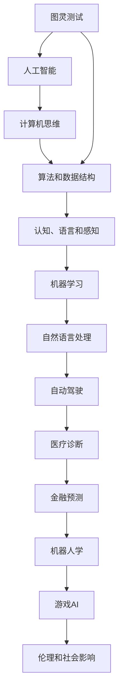

                 

# 1956年达特茅斯会议的影响

> 关键词：人工智能,达特茅斯会议,计算机科学,图灵测试,阿兰·图灵,约翰·麦卡锡,计算机思维

## 1. 背景介绍

1956年的达特茅斯会议（Dartmouth Conference）被认为是人工智能（Artificial Intelligence, AI）的开端。这场由阿兰·图灵（Alan Turing）的追随者约翰·麦卡锡（John McCarthy）召集的会议，汇集了当时美国和欧洲的顶尖计算机科学家和数学家，共同探讨如何使机器能够思考，模拟人类的智能行为。会议的成功不仅奠定了现代人工智能学科的基础，还为后来的计算机科学发展埋下了伏笔。

### 1.1 会议背景

在20世纪50年代，计算机科学作为一门独立的学科刚刚起步。尽管早期计算机已经展现出了在逻辑、计算和控制方面的能力，但人们对计算机能否具有智能化的思考和理解仍然持怀疑态度。阿兰·图灵的理论工作，尤其是他提出的“图灵测试”，激发了人们对于机器智能化的广泛兴趣。在这种背景下，约翰·麦卡锡等人意识到有必要召开一次专门的学术会议，以探讨人工智能的潜在可能性，并为未来的研究定下方向。

### 1.2 会议成果

达特茅斯会议最终发布了一份会议报告，正式提出“人工智能”这一术语，并将计算机科学的研究方向锁定在了“制造智能机器”的目标上。会议不仅确立了人工智能作为计算机科学的一个重要分支，还引发了随后数十年间无数的研究者和工程师的关注和投入。

## 2. 核心概念与联系

### 2.1 核心概念概述

达特茅斯会议的核心概念包括：

- **人工智能**：通过机器模拟人类智能行为，实现问题的自动化解决。
- **图灵测试**：判断机器是否具备智能的一种测试方法，即如果机器在对话中无法被识别为人或计算机，则通过测试。
- **计算机思维**：计算机能否具备类似于人类的认知和解决问题的能力。

这些概念之间存在紧密联系，共同构成了人工智能的基石。

### 2.2 核心概念原理和架构的 Mermaid 流程图



此流程图展示了从图灵测试到具体应用的人工智能发展脉络，其中认知、语言、感知等底层功能与算法和数据结构紧密相关，而机器学习和自然语言处理则是实现这些功能的主要手段。

## 3. 核心算法原理 & 具体操作步骤

### 3.1 算法原理概述

人工智能的核心算法原理包括：

- **符号主义**：通过符号逻辑和规则模拟人类思维过程，如Prolog、Logic Programming等。
- **连接主义**：基于神经网络模拟人类神经元之间的连接方式，如深度学习、神经网络等。
- **行为主义**：通过学习机器在特定环境下的行为，逐步优化其决策策略，如强化学习、试错学习等。

这些算法原理共同构成了人工智能方法学的基础。

### 3.2 算法步骤详解

1. **需求分析**：确定问题的具体需求和目标，如分类、识别、推理等。
2. **算法选择**：根据问题的性质和数据的特征，选择合适的算法。
3. **数据准备**：清洗、整理数据，以符合算法的输入要求。
4. **模型训练**：利用数据对算法进行训练，调整模型参数以优化性能。
5. **模型评估**：使用测试数据集评估模型的性能，确定是否达到预期效果。
6. **部署应用**：将训练好的模型部署到实际应用场景中，进行问题解决。

### 3.3 算法优缺点

- **优点**：
  - 多样化的算法选择，适用于各种不同类型的问题。
  - 能够利用大量的数据进行训练，提升模型性能。
  - 模型在实际应用中可以进行优化和调整，灵活性高。

- **缺点**：
  - 算法原理复杂，学习成本较高。
  - 模型训练和评估过程耗时较长，对硬件要求高。
  - 部分算法需要大量标注数据，标注成本较高。

### 3.4 算法应用领域

人工智能算法已经广泛应用于多个领域，包括但不限于：

- **计算机视觉**：通过图像处理和模式识别技术，实现自动驾驶、人脸识别等功能。
- **自然语言处理**：包括机器翻译、情感分析、语音识别等，提升人机交互的便捷性和自然度。
- **医疗健康**：利用数据分析和机器学习，进行疾病诊断、药物研发等。
- **金融分析**：通过数据挖掘和预测模型，优化投资策略、风险控制等。
- **智能制造**：在工业生产中实现质量控制、故障预测等自动化决策。

## 4. 数学模型和公式 & 详细讲解 & 举例说明

### 4.1 数学模型构建

人工智能算法中的数学模型通常包括以下组成部分：

- **输入层**：接收原始数据。
- **隐藏层**：进行特征提取和计算。
- **输出层**：产生最终结果。

以神经网络为例，其数学模型可以表示为：

$$
\mathbf{y} = f(\mathbf{Wx} + b)
$$

其中，$f$ 表示非线性激活函数，$\mathbf{W}$ 和 $b$ 分别为权重矩阵和偏置向量。

### 4.2 公式推导过程

以深度学习中的反向传播算法为例，其核心步骤包括前向传播和反向传播：

1. **前向传播**：将输入数据通过神经网络，计算出每个隐藏层的输出。
2. **计算损失**：将输出结果与真实标签进行对比，计算损失函数。
3. **反向传播**：利用链式法则，计算每个参数对损失函数的梯度，并更新参数。

### 4.3 案例分析与讲解

以机器学习中的线性回归为例，其目标是找到一个线性函数 $y = wx + b$，以最小化预测值与真实值之间的误差。具体公式推导过程如下：

设样本集为 $(\mathbf{x}_i, y_i)$，其中 $\mathbf{x}_i$ 为特征向量，$y_i$ 为标签。目标函数为：

$$
\min_{w,b} \frac{1}{2N}\sum_{i=1}^N (y_i - wx_i - b)^2
$$

对其进行求解，可得：

$$
w = (\mathbf{X}^T\mathbf{X})^{-1}\mathbf{X}^T\mathbf{y}
$$

其中，$\mathbf{X}$ 为特征矩阵，$\mathbf{y}$ 为标签向量。

## 5. 项目实践：代码实例和详细解释说明

### 5.1 开发环境搭建

为进行人工智能算法开发，需要搭建相应的开发环境。以Python为例，需要安装相关的科学计算库，如NumPy、Pandas、Scikit-Learn等，并安装深度学习框架，如TensorFlow、PyTorch等。

### 5.2 源代码详细实现

以下是一个简单的线性回归模型实现，使用Scikit-Learn库：

```python
from sklearn.linear_model import LinearRegression
from sklearn.datasets import load_boston
from sklearn.model_selection import train_test_split

# 加载数据集
boston = load_boston()
X = boston.data
y = boston.target

# 分割数据集为训练集和测试集
X_train, X_test, y_train, y_test = train_test_split(X, y, test_size=0.2, random_state=42)

# 实例化线性回归模型
model = LinearRegression()

# 训练模型
model.fit(X_train, y_train)

# 预测并评估模型性能
y_pred = model.predict(X_test)
print("R^2:", model.score(X_test, y_test))
```

### 5.3 代码解读与分析

该代码实现了一个简单的线性回归模型，使用Scikit-Learn库进行数据加载、分割、训练和评估。其中，`LinearRegression` 类是线性回归模型的实现，`fit` 方法用于训练模型，`score` 方法用于评估模型性能。

## 6. 实际应用场景

### 6.1 智能家居

智能家居系统可以通过人工智能算法实现自动照明、温控、安全监控等功能，提升用户的生活质量。例如，通过分析用户的作息习惯，智能家居系统可以自动调节照明亮度和温度，提高节能效果和舒适度。

### 6.2 智能交通

在智能交通领域，人工智能算法可以用于交通流量预测、自动驾驶、智能信号灯控制等，减少交通拥堵，提升交通安全。例如，通过分析历史交通数据，智能交通系统可以预测未来的流量变化，优化信号灯配时，缓解交通压力。

### 6.3 智能医疗

在医疗领域，人工智能算法可以用于疾病诊断、治疗方案推荐、患者监控等，提高诊疗效率和准确性。例如，通过分析患者的影像数据和病历记录，智能诊断系统可以提供辅助诊断意见，减轻医生的工作负担。

### 6.4 未来应用展望

未来，人工智能技术将进一步普及，覆盖更多的领域和应用场景。例如，在金融、教育、环保等领域，人工智能算法将发挥更大的作用，优化资源配置，提升服务质量。此外，随着计算能力的提升和数据量的增长，人工智能系统的智能水平和应用效果也将不断提高。

## 7. 工具和资源推荐

### 7.1 学习资源推荐

- **《人工智能：一种现代方法》**：由斯图尔特·罗素（Stuart Russell）和彼得·诺维格（Peter Norvig）共同编写，是人工智能领域的经典教材。
- **Coursera AI课程**：提供多门人工智能相关的在线课程，由斯坦福大学、MIT等顶尖大学授课。
- **ArXiv预印本**：包含大量人工智能研究论文，是了解最新进展的好去处。

### 7.2 开发工具推荐

- **TensorFlow**：由Google开发的深度学习框架，支持分布式训练和推理。
- **PyTorch**：由Facebook开发的深度学习框架，支持动态图和静态图，易于使用。
- **Jupyter Notebook**：用于数据科学和机器学习的交互式编程环境。

### 7.3 相关论文推荐

- **《Deep Learning》**：由Ian Goodfellow、Yoshua Bengio和Aaron Courville共同编写，是深度学习领域的经典教材。
- **《Human Compatible》**：由Eliezer Yudkowsky所著，探讨人工智能的伦理和社会影响。
- **《The Road to Superintelligence》**：由Nick Bostrom所著，讨论人工智能未来的发展路径和潜在风险。

## 8. 总结：未来发展趋势与挑战

### 8.1 研究成果总结

达特茅斯会议奠定了人工智能的基础，推动了计算机科学和工程的发展。人工智能技术在各个领域的广泛应用，提升了效率，改善了生活质量。

### 8.2 未来发展趋势

未来人工智能的发展趋势包括：

- **多模态融合**：结合视觉、听觉、触觉等多种感知方式，提升系统的智能水平。
- **自主学习**：通过自我适应和进化，提升系统的灵活性和鲁棒性。
- **伦理和法律框架**：随着人工智能技术的普及，其伦理和法律问题也日益重要，需要建立相应的规范和标准。
- **人机协同**：人工智能技术的发展，将更好地服务于人类，形成人机协同的智能系统。

### 8.3 面临的挑战

人工智能的发展面临以下挑战：

- **数据隐私和安全**：大规模数据收集和处理过程中，如何保护用户隐私和数据安全。
- **算法偏见和歧视**：人工智能算法可能存在偏见和歧视，导致不公平的结果。
- **透明性和可解释性**：人工智能系统的决策过程缺乏透明性和可解释性，难以理解和调试。
- **技术伦理和社会影响**：人工智能技术的应用可能带来伦理和社会问题，如就业替代、隐私侵犯等。

### 8.4 研究展望

未来，人工智能研究需要在以下几个方面进行深入探索：

- **自主学习**：开发能够自我适应和进化的智能系统，提升系统的自主性。
- **透明性和可解释性**：建立透明和可解释的算法体系，增强人工智能系统的可信度。
- **伦理和法律框架**：建立人工智能技术的伦理和法律规范，确保其健康发展。
- **人机协同**：探索人机协同的智能系统，提升系统的智能水平和人类工作质量。

## 9. 附录：常见问题与解答

**Q1: 什么是人工智能？**

A: 人工智能是计算机科学的一个分支，旨在通过机器模拟人类智能行为，实现问题的自动化解决。

**Q2: 人工智能的核心算法有哪些？**

A: 人工智能的核心算法包括符号主义、连接主义和行为主义等。

**Q3: 人工智能在实际应用中有哪些成功案例？**

A: 人工智能在智能家居、智能交通、智能医疗等领域有广泛应用，如智能家居的自动照明、智能交通的自动驾驶、智能医疗的辅助诊断等。

**Q4: 人工智能的发展面临哪些挑战？**

A: 人工智能的发展面临数据隐私和安全、算法偏见和歧视、透明性和可解释性、技术伦理和社会影响等挑战。

**Q5: 如何提高人工智能系统的透明性和可解释性？**

A: 通过建立透明和可解释的算法体系，使用可视化工具展示决策过程，以及与用户进行交互等手段，可以提高人工智能系统的透明性和可解释性。

---

作者：禅与计算机程序设计艺术 / Zen and the Art of Computer Programming

