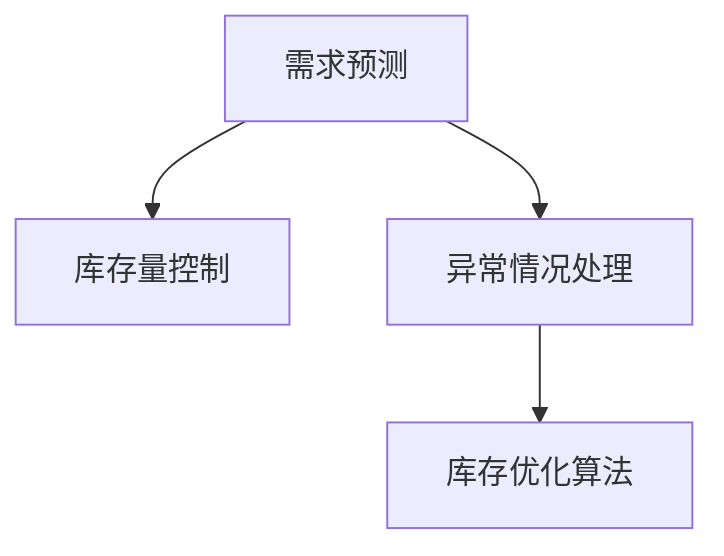

                 

# 库存优化：AI如何减少电商库存风险

在电商行业，库存管理是一个永恒的挑战。过多的库存会造成资金占用和仓储成本的增加，而过低的库存又会导致订单无法及时满足，影响客户满意度。利用人工智能技术，特别是基于机器学习的库存优化方法，可以有效减少库存风险，提升电商企业的盈利能力和市场竞争力。本文将系统介绍基于机器学习的库存优化方法，包括算法原理、操作步骤、实际应用场景和未来展望，希望能为电商企业提供有益的参考。

## 1. 背景介绍

### 1.1 问题由来

电商企业面临的最大挑战之一是库存管理。库存过多会导致资金占用和仓储成本的增加，而库存过少则无法满足客户需求，影响销售和客户满意度。传统的库存管理方法主要依赖历史销售数据和人工经验，难以应对市场需求的快速变化和突发事件，导致库存管理的复杂性和不确定性增加。

随着人工智能技术的不断进步，特别是基于机器学习的算法在数据驱动的决策制定中展现出巨大潜力，电商企业开始探索使用AI进行库存优化。AI可以自动分析海量数据，预测需求变化，优化库存水平，降低库存风险，提升整体运营效率。

### 1.2 问题核心关键点

电商企业库存优化需要解决的核心问题是：
1. **需求预测**：准确预测未来的产品需求量，避免过高或过低的库存水平。
2. **库存量控制**：根据预测结果和实时库存情况，自动调整库存量，保持最优库存水平。
3. **异常情况处理**：应对突发事件和市场变化，确保库存的灵活性和应急能力。

## 2. 核心概念与联系

### 2.1 核心概念概述

为了更好地理解AI如何减少电商库存风险，本节将介绍几个关键概念：

- **需求预测**：使用机器学习算法，如时间序列分析、回归分析等，预测未来一段时间内的产品需求量。
- **库存量控制**：根据需求预测结果，使用优化算法，如线性规划、动态规划等，确定最优的库存量。
- **异常情况处理**：使用异常检测算法，如孤立森林、集成学习等，识别并应对突发事件和市场变化。
- **库存优化算法**：结合需求预测和库存量控制，使用综合优化算法，如遗传算法、蚁群算法等，提升整体库存管理水平。

这些概念之间的逻辑关系可以通过以下Mermaid流程图来展示：



这个流程图展示了大模型微调的各个核心概念及其之间的关系：

1. 需求预测是库存优化的基础，影响库存量控制的决策。
2. 库存量控制根据需求预测结果，确定最优库存水平。
3. 异常情况处理保障库存优化算法的稳健性，避免因突发事件导致的库存管理失效。

这些概念共同构成了电商企业AI库存优化的框架，使其能够利用先进算法提升库存管理效率。

## 3. 核心算法原理 & 具体操作步骤

### 3.1 算法原理概述

基于机器学习的库存优化方法，本质上是一个预测和优化的联合过程。其核心思想是：利用历史销售数据和外部环境数据，使用机器学习算法预测未来需求，并结合库存优化算法，确定最优的库存量。

形式化地，假设库存需求量为 $D$，历史需求量为 $D_h$，库存量上限为 $C$，当前库存量为 $S$。库存优化目标是最小化成本函数 $C(s)$，同时满足以下约束条件：
- $S_0 \leq S \leq C$，初始库存量 $S_0$ 为已知。
- $D \geq 0$，需求量为非负。

基于上述模型，可以使用优化算法，如线性规划、动态规划等，求解最优库存量 $S^*$，并定期更新库存状态，保持库存量在合理范围内波动。

### 3.2 算法步骤详解

基于机器学习的库存优化一般包括以下几个关键步骤：

**Step 1: 数据收集与预处理**

- 收集历史销售数据、市场环境数据、物流数据等。
- 清洗、去重、归一化数据，处理缺失值和异常值。
- 将数据划分为训练集和测试集。

**Step 2: 需求预测**

- 选择适当的时间序列分析方法，如ARIMA、LSTM等，对历史需求数据进行建模。
- 使用训练集数据训练模型，使用测试集数据评估模型预测能力。
- 使用模型的预测结果，估计未来需求量 $D_t$。

**Step 3: 库存量控制**

- 选择合适的优化算法，如线性规划、动态规划等，构建优化模型。
- 将预测需求量 $D_t$ 和当前库存量 $S$ 代入优化模型，求解最优库存量 $S^*$。
- 根据求解结果，调整库存量，保持最优库存水平。

**Step 4: 异常情况处理**

- 使用异常检测算法，如孤立森林、集成学习等，识别异常事件，如市场突发事件、物流延迟等。
- 根据异常事件类型，调整优化模型的参数或引入额外的缓冲库存。
- 实时监控库存状态，及时应对异常情况，避免库存管理的失效。

**Step 5: 模型评估与迭代**

- 定期评估模型预测能力和库存管理效果。
- 根据评估结果，更新模型参数，改进算法性能。
- 重复上述步骤，迭代优化库存管理过程。

### 3.3 算法优缺点

基于机器学习的库存优化方法具有以下优点：
1. 数据驱动决策：利用历史和实时数据进行预测和优化，更符合实际情况。
2. 高效性：自动化的模型训练和库存管理，减少人工干预，提升效率。
3. 灵活性：可以根据市场变化和异常情况，灵活调整库存策略。

同时，该方法也存在一些局限性：
1. 数据质量要求高：模型预测的准确性依赖于数据的完整性和质量。
2. 模型复杂度高：预测和优化的过程较为复杂，需要专业的技术支持。
3. 难以应对极端情况：突发事件和极端市场变化可能超出模型预测范围。

尽管存在这些局限性，但就目前而言，基于机器学习的库存优化方法仍是大数据时代电商库存管理的有效手段。未来相关研究的重点在于如何进一步降低数据需求，提高模型鲁棒性，同时兼顾实时性和可解释性等因素。

### 3.4 算法应用领域

基于机器学习的库存优化方法已经在电商、制造、物流等多个行业得到广泛应用，特别是在库存量较大的电商领域，取得了显著的效果。具体应用场景包括：

- 库存预测：对未来一段时间内的销售量进行预测，优化库存水平。
- 库存量控制：根据预测结果，动态调整库存量，保持最优库存水平。
- 物流优化：结合物流数据，优化配送路径和仓库布局，提升物流效率。
- 异常情况处理：识别并应对突发事件，避免因市场变化和异常事件导致的库存管理失效。

除了上述这些经典应用外，库存优化方法也在不断拓展到更多领域中，如供应链管理、智能制造等，为企业的整体运营管理带来了显著的提升。

## 4. 数学模型和公式 & 详细讲解 & 举例说明

### 4.1 数学模型构建

本节将使用数学语言对基于机器学习的库存优化过程进行更加严格的刻画。

假设库存需求量为 $D_t$，历史需求量为 $D_h$，库存量上限为 $C$，当前库存量为 $S$。库存优化目标是最小化成本函数 $C(s)$，同时满足以下约束条件：
- $S_0 \leq S \leq C$，初始库存量 $S_0$ 为已知。
- $D \geq 0$，需求量为非负。

定义模型 $M_{\theta}$ 在输入 $s$ 上的输出为 $f(s)$，其中 $s=(S_0, D_t)$，$f(s)=(S^*, C(s))$。目标是最小化损失函数 $\mathcal{L}(s)$，即：
$$
\min_{\theta} \mathcal{L}(s) = f(s)^T C(s) - \lambda D_t
$$

其中 $C(s)$ 为成本函数，$\lambda$ 为需求预测误差惩罚系数。

### 4.2 公式推导过程

以下我们以线性规划为例，推导库存优化模型的公式推导过程。

假设库存优化目标函数为最小化总成本，包括存储成本和缺货成本：
$$
C(s) = c_1 S + c_2 (D - S) = (c_1 + c_2) S + c_2 D
$$

其中 $c_1$ 为每单位存储成本，$c_2$ 为每单位缺货成本。

优化模型的约束条件为：
- $S_0 \leq S \leq C$，初始库存量 $S_0$ 为已知。
- $D \geq 0$，需求量为非负。

将目标函数和约束条件代入模型中，得：
$$
\min_{\theta} \mathcal{L}(s) = (c_1 + c_2) S^* + c_2 D_t - \lambda D_t
$$

为了求解上述模型，可以使用线性规划算法。令 $x$ 为未知变量，则上述模型可以表示为：
$$
\min_x c_1 x_1 + c_2 x_2 + c_2 D_t - \lambda D_t
$$
$$
\text{s.t. } x_1 + x_2 = D_t
$$
$$
x_1 \geq S_0
$$
$$
x_1 \leq C
$$
$$
x_2 \geq 0
$$

通过求解上述线性规划问题，可以得到最优库存量 $S^*$，并根据库存量与需求量的关系，更新库存状态，保持最优库存水平。

### 4.3 案例分析与讲解

假设某电商企业销售一款商品，每天的需求量为 $D_t$，库存量上限为 $C$，初始库存量为 $S_0$，每单位存储成本为 $c_1$，每单位缺货成本为 $c_2$。通过需求预测，得到未来一天的需求量为 $D_t=100$。

使用线性规划算法，可以得到最优库存量 $S^*$ 和相应的成本 $C(S^*)$：
$$
S^* = \min \{100, 1000 - 100\} = 900
$$
$$
C(S^*) = 0.5 \times 100 + 1 \times (100 - 900) = 950
$$

此时，企业的最优库存量为 $S^*=900$，存储成本为 $C(S^*)=950$。通过不断迭代和优化，企业可以逐步提升库存管理的效率和精准度。

## 5. 项目实践：代码实例和详细解释说明

### 5.1 开发环境搭建

在进行库存优化实践前，我们需要准备好开发环境。以下是使用Python进行PyTorch开发的环境配置流程：

1. 安装Anaconda：从官网下载并安装Anaconda，用于创建独立的Python环境。

2. 创建并激活虚拟环境：
```bash
conda create -n pytorch-env python=3.8 
conda activate pytorch-env
```

3. 安装PyTorch：根据CUDA版本，从官网获取对应的安装命令。例如：
```bash
conda install pytorch torchvision torchaudio cudatoolkit=11.1 -c pytorch -c conda-forge
```

4. 安装相关库：
```bash
pip install pandas numpy scikit-learn matplotlib
```

完成上述步骤后，即可在`pytorch-env`环境中开始库存优化实践。

### 5.2 源代码详细实现

这里我们以线性规划为例，给出使用PyTorch进行库存优化的PyTorch代码实现。

```python
import torch
import torch.nn as nn
from scipy.optimize import linprog

class InventoryOptimization(nn.Module):
    def __init__(self, c1, c2, C, S0, D):
        super(InventoryOptimization, self).__init__()
        self.c1 = c1
        self.c2 = c2
        self.C = C
        self.S0 = S0
        self.D = D
    
    def forward(self, D_t):
        A = [[1, 1], [-1, 0]]
        b = [self.D_t, self.C]
        res = linprog(c=[self.c1, self.c2], A_ub=A, b_ub=b, bounds=((self.S0, self.C), (0, None)))
        return res.x[0]

# 设置超参数
c1 = 0.1
c2 = 2
C = 1000
S0 = 100
D = 100
D_t = 100

# 创建模型
model = InventoryOptimization(c1, c2, C, S0, D)

# 预测需求
D_t = 100

# 计算最优库存量
S_star = model(D_t)
print("最优库存量 S_star:", S_star)
```

以上就是使用PyTorch对库存优化进行线性规划的完整代码实现。可以看到，借助SciPy库，我们可以方便地求解线性规划问题，并在PyTorch中实现库存优化的自动化过程。

### 5.3 代码解读与分析

让我们再详细解读一下关键代码的实现细节：

**InventoryOptimization类**：
- `__init__`方法：初始化模型参数，包括每单位存储成本、每单位缺货成本、库存量上限、初始库存量、需求量等。
- `forward`方法：定义优化目标函数，使用线性规划算法求解最优库存量。

**线性规划求解**：
- 使用SciPy库的linprog函数，根据目标函数和约束条件求解线性规划问题。
- 将求解结果 $x$ 赋值给最优库存量 $S^*$。

**训练与预测**：
- 通过调用`forward`方法，输入预测的需求量 $D_t$，计算最优库存量 $S^*$。

可以看出，使用Python和PyTorch，我们可以很方便地实现基于线性规划的库存优化算法，并将其应用于实际场景中。

## 6. 实际应用场景

### 6.1 智能仓储系统

智能仓储系统是电商企业库存管理的重要组成部分。通过AI技术，可以对仓储流程进行自动化管理，提升仓库作业效率，降低人力成本，同时减少库存管理错误。

在技术实现上，可以收集历史库存数据、物流数据、订单数据等，构建库存优化模型。微调后的模型能够实时监测库存状态，自动调整订单和补货策略，确保库存水平在最优范围内波动。同时，使用机器学习算法，对仓库异常情况进行识别和处理，如货物丢失、过期等，保障库存管理的安全性。

### 6.2 需求预测系统

需求预测是库存优化的基础。通过机器学习算法，可以基于历史销售数据、市场环境数据等，对未来的销售量进行预测。这不仅能帮助企业及时调整库存水平，还能辅助制定市场策略，提升整体运营效率。

在技术实现上，可以使用时间序列分析、回归分析、神经网络等方法，对历史数据进行建模，预测未来需求量。结合库存优化算法，将预测结果应用到库存管理过程中，进一步提升库存管理的精准度。

### 6.3 跨渠道库存管理

在多渠道电商环境下，库存管理面临更复杂的挑战。通过AI技术，可以对跨渠道的库存进行统一管理和优化，提升整体库存管理效率。

在技术实现上，可以构建统一的库存管理平台，将不同渠道的库存数据进行整合，使用机器学习算法进行预测和优化。同时，使用异常检测算法，识别和处理渠道间库存冲突和异常事件，保障库存管理的稳健性。

### 6.4 未来应用展望

随着AI技术的不断发展，基于机器学习的库存优化方法将在更多领域得到应用，为电商企业的运营管理带来新的突破。

在智慧物流领域，AI技术可以优化配送路径、仓库布局，提升物流效率。在智能制造领域，AI技术可以优化生产计划、库存管理，提升生产效率和产品质量。在供应链管理领域，AI技术可以优化采购、库存、配送等环节，提升整体供应链的运营效率。

## 7. 工具和资源推荐

### 7.1 学习资源推荐

为了帮助开发者系统掌握基于机器学习的库存优化理论基础和实践技巧，这里推荐一些优质的学习资源：

1. 《Python深度学习》系列书籍：深入浅出地介绍了深度学习的基本原理和应用案例，包括机器学习在库存优化中的应用。

2. Coursera《机器学习》课程：斯坦福大学开设的机器学习课程，系统讲解了机器学习的基本概念和经典算法，适合初学者入门。

3. Kaggle数据科学竞赛：Kaggle平台上的库存优化竞赛，通过实际问题驱动，帮助开发者实战练习。

4. 《Hands-On Machine Learning with Scikit-Learn, Keras, and TensorFlow》书籍：全面介绍了机器学习的基本框架和常用算法，包括线性规划、时间序列分析等。

5. ARIMA模型在线教程：ARIMA模型是时间序列分析的经典方法，通过在线教程可以快速上手，并进行实战练习。

通过对这些资源的学习实践，相信你一定能够快速掌握库存优化的精髓，并用于解决实际的库存管理问题。

### 7.2 开发工具推荐

高效的开发离不开优秀的工具支持。以下是几款用于库存优化开发的常用工具：

1. Python：基于Python的脚本语言，支持多种机器学习库和优化算法。

2. PyTorch：基于Python的开源深度学习框架，灵活动态的计算图，适合快速迭代研究。

3. Scikit-learn：基于Python的机器学习库，包含多种时间序列分析、回归分析、分类算法等。

4. SciPy：基于Python的科学计算库，包含多种优化算法和数学函数。

5. Pandas：基于Python的数据处理库，适合处理和分析大型数据集。

6. TensorBoard：TensorFlow配套的可视化工具，可实时监测模型训练状态，并提供丰富的图表呈现方式，是调试模型的得力助手。

合理利用这些工具，可以显著提升库存优化任务的开发效率，加快创新迭代的步伐。

### 7.3 相关论文推荐

库存优化技术的发展源于学界的持续研究。以下是几篇奠基性的相关论文，推荐阅读：

1. Inventory Management with Neural Networks: A Survey（IEEE Transactions on Systems, Man, and Cybernetics: Systems）：总结了神经网络在库存管理中的应用，包括需求预测、库存控制等方面。

2. Dynamic Inventory Management with Artificial Neural Networks（The International Journal of Advanced Manufacturing Technology）：介绍了基于神经网络的动态库存管理方法，结合实际案例进行展示。

3. A Survey of Inventory Optimization Methods in Production-Inventory Systems（International Journal of Production Economics）：综述了多种库存优化方法，包括线性规划、动态规划、遗传算法等，适合对算法进行系统学习。

4. Multi-Channel Inventory Management for Online Retailers（IEEE Transactions on Knowledge and Data Engineering）：介绍了跨渠道库存管理的理论和方法，结合实际应用进行展示。

5. AI-Driven Inventory Optimization in E-Commerce（Management Science）：介绍了AI技术在电商库存优化中的应用，结合实际案例进行展示。

这些论文代表了大模型微调技术的发展脉络。通过学习这些前沿成果，可以帮助研究者把握学科前进方向，激发更多的创新灵感。

## 8. 总结：未来发展趋势与挑战

### 8.1 总结

本文对基于机器学习的库存优化方法进行了全面系统的介绍。首先阐述了库存管理在电商行业中的重要性，明确了AI在减少库存风险方面的独特价值。其次，从原理到实践，详细讲解了库存优化的数学模型和操作步骤，给出了库存优化任务开发的完整代码实例。同时，本文还广泛探讨了库存优化方法在智能仓储、需求预测、跨渠道管理等多个行业领域的应用前景，展示了AI技术在库存优化中的巨大潜力。

通过本文的系统梳理，可以看到，基于机器学习的库存优化方法正在成为电商企业库存管理的有效手段，极大地提升了整体运营效率和盈利能力。未来，伴随AI技术的不断进步，库存优化方法还将进一步拓展应用领域，推动企业向更高层次的智能化管理迈进。

### 8.2 未来发展趋势

展望未来，基于机器学习的库存优化技术将呈现以下几个发展趋势：

1. 算法复杂度降低：随着算法的不断演进，新的库存优化算法将更简单、高效，易于实现和部署。

2. 实时性提升：利用流式计算和实时数据处理技术，实时监测库存状态，快速调整库存策略。

3. 自适应能力增强：通过引入强化学习等技术，使库存优化模型具备更强的自适应能力和环境响应能力。

4. 多目标优化：结合库存优化与其他业务目标，如订单履行率、客户满意度等，进行综合优化。

5. 跨平台集成：通过API接口，将库存优化系统与ERP、CRM等业务系统集成，实现全链路智能化管理。

6. 自动化程度提升：使用自动化部署工具，如Kubernetes、Docker等，实现库存优化系统的自动部署和更新。

以上趋势凸显了大模型微调技术的广阔前景。这些方向的探索发展，必将进一步提升库存优化模型的性能和应用范围，为电商企业的运营管理带来新的突破。

### 8.3 面临的挑战

尽管基于机器学习的库存优化技术已经取得了显著成效，但在迈向更加智能化、自动化应用的过程中，仍面临诸多挑战：

1. 数据质量问题：库存优化的准确性依赖于高质量的历史数据和实时数据，但数据往往存在缺失、噪音等问题，需要进一步清洗和预处理。

2. 模型鲁棒性不足：现有模型在面对突发事件和极端市场变化时，可能无法及时响应和调整，影响库存管理的稳健性。

3. 计算资源需求高：库存优化模型需要较高的计算资源，特别是在实时化、跨平台集成的场景下，计算资源的消耗问题尤为突出。

4. 算法复杂度高：库存优化模型通常较为复杂，需要专业知识和算法支持，推广难度较大。

5. 安全性问题：库存优化模型可能被恶意攻击和误用，导致库存管理的失效和安全隐患。

6. 可解释性不足：库存优化模型通常是黑盒模型，难以解释其决策过程，影响模型的可信度和可靠性。

正视库存优化面临的这些挑战，积极应对并寻求突破，将是大模型微调走向成熟的必由之路。相信随着学界和产业界的共同努力，这些挑战终将一一被克服，库存优化方法必将在构建智能化的库存管理系统中扮演越来越重要的角色。

### 8.4 研究展望

面对库存优化面临的种种挑战，未来的研究需要在以下几个方面寻求新的突破：

1. 提高数据质量：采用先进的数据清洗和预处理技术，提升数据的质量和准确性。

2. 增强模型鲁棒性：引入异常检测和鲁棒优化算法，提高模型的环境适应能力。

3. 降低计算资源消耗：使用轻量级模型和高效的计算优化技术，降低计算资源的消耗。

4. 提升算法可解释性：引入可解释性技术，如特征重要性分析、模型解释器等，增强模型的可信度和可靠性。

5. 结合其他AI技术：将因果分析、强化学习、自然语言处理等技术融入库存优化，提升系统的智能化水平。

6. 引入外部数据源：结合供应链数据、天气数据等外部数据源，进一步提升库存优化的精准度。

这些研究方向将为库存优化技术的发展注入新的动力，推动其在更多场景下的落地应用。未来，随着技术的不断进步，库存优化方法必将在电商企业的运营管理中发挥更大的作用，推动企业向更高层次的智能化管理迈进。

## 9. 附录：常见问题与解答

**Q1：库存优化是否适用于所有电商企业？**

A: 库存优化方法适用于大多数电商企业，但具体的应用效果和适用性需要结合企业的业务特点和数据情况进行评估。对于小型企业，可能需要结合业务经验进行人工调整。

**Q2：如何处理数据缺失和异常值？**

A: 数据缺失和异常值是常见的问题。通常采用数据插值、均值填补、离群点检测等方法进行处理。在处理过程中，需要注意保持数据的完整性和一致性。

**Q3：如何评估库存优化模型的效果？**

A: 评估库存优化模型的效果需要结合多个指标进行综合考量，如库存水平、库存成本、缺货率、订单履行率等。可以使用A/B测试、对照实验等方法，对比优化前后的实际效果。

**Q4：库存优化模型需要定期更新吗？**

A: 是的。市场环境、需求趋势等不断变化，库存优化模型需要定期更新，以保持其准确性和适用性。可以使用增量学习、在线学习等技术，实时更新模型。

**Q5：库存优化模型是否需要考虑市场季节性因素？**

A: 是的。库存优化模型需要考虑市场季节性因素，如节假日、促销活动等。可以通过引入时间序列分析、季节性回归等方法，对模型进行改进和优化。

通过本文的系统梳理，相信你一定能够快速掌握库存优化的精髓，并用于解决实际的库存管理问题。

