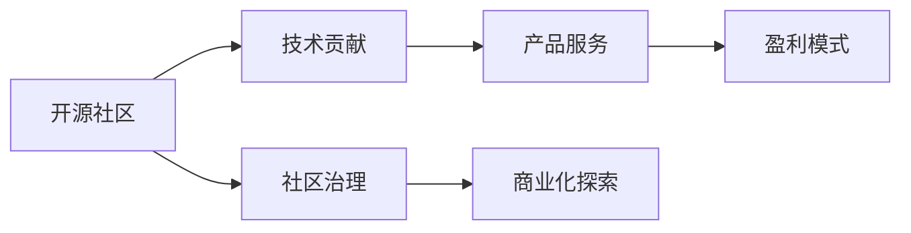

                 

# 开源创业：协作创新的新模式

> 关键词：开源社区,协作创新,技术贡献,开发者生态,创新商业模式

## 1. 背景介绍

### 1.1 问题由来
在科技飞速发展的今天，开源社区已成为全球技术创新的重要推动力。许多技术公司和创业团队通过参与开源项目，借助众包的力量，快速迭代产品，不断提升竞争力。同时，开源模式也为技术创业提供了新的可能性，越来越多创业者开始尝试在开源社区中孵化新项目，利用社区资源和人才，开创新的商业价值。

然而，开源创业也面临诸多挑战，如如何有效组织和管理社区资源，如何激励社区成员的积极贡献，如何利用开源优势进行商业化等。本文旨在全面介绍开源创业的核心理念和实践方法，为开源创业者和技术创业者提供指导。

### 1.2 问题核心关键点
开源创业的核心理念在于，通过协作与共享，整合社区资源，加速技术创新。其核心关键点包括：

- **协作创新**：鼓励技术贡献，集思广益，实现技术与产品的迭代优化。
- **共享资源**：分享代码、文档、工具等，降低重复研发成本。
- **开放治理**：社区成员共同决策，形成健康的治理结构。
- **商业化探索**：探索开源模式下的创新商业模式，形成良性循环。

## 2. 核心概念与联系

### 2.1 核心概念概述

开源创业涉及多个核心概念，本节将详细解释这些概念及其联系：

- **开源社区**：由志愿者组成，基于开放协议发布代码、文档、工具等资源，共同维护和发展特定项目或领域。
- **技术贡献**：开发者通过编写代码、修复bug、改进功能等，为开源项目提供技术支持。
- **社区治理**：通过选举、讨论等机制，形成社区规则和决策流程，确保社区健康、有序地运行。
- **商业化探索**：将开源项目的商业价值最大化，如通过社区支持的产品、服务、捐赠等形式实现盈利。

这些概念之间的联系可以通过以下Mermaid流程图来展示：



该图展示了开源社区的技术贡献、社区治理和商业化探索之间的关系，以及如何通过产品和服务实现盈利。

## 3. 核心算法原理 & 具体操作步骤
### 3.1 算法原理概述

开源创业的算法原理是基于协作与共享的创新机制，通过社区成员的共同努力，实现技术与产品的迭代优化，最大化项目商业价值。其核心思想如下：

1. **激励贡献**：通过积分、贡献证书、荣誉等方式，激励社区成员积极参与开源项目。
2. **迭代优化**：利用社区成员的多样化技能，对开源项目进行持续迭代，提升项目质量和功能。
3. **共享资源**：通过开放协议，共享代码、文档、工具等资源，降低开发成本，加速创新。
4. **开放治理**：通过社区成员共同决策，确保项目发展方向和资源分配的合理性。

### 3.2 算法步骤详解

开源创业的具体操作步骤包括以下几个关键步骤：

**Step 1: 创建开源项目**
- 确定项目目标和范围，选择合适的开源协议（如Apache、MIT等）。
- 创建项目仓库，搭建社区平台，设立代码审查流程。
- 发布项目介绍和入门指南，吸引社区成员参与。

**Step 2: 社区招募和管理**
- 设立社区治理规则，包括贡献流程、代码审查、项目讨论等。
- 通过邮件、公告、社交媒体等渠道，吸引技术贡献者。
- 对新成员进行培训和引导，促进其快速融入社区。

**Step 3: 技术贡献和迭代优化**
- 设立贡献机制，如贡献积分、荣誉徽章等，激励社区成员积极参与。
- 利用代码审查工具，如GitHub的Pull Request，确保代码质量和一致性。
- 持续迭代项目功能，根据社区反馈进行改进和优化。

**Step 4: 商业化探索和盈利模式设计**
- 结合项目特点，探索适合的商业化路径，如开放源码、提供服务、商业合作等。
- 设计盈利模式，如订阅服务、开源社区付费会员、商业支持计划等。
- 通过社区支持和商业化探索，实现开源项目的可持续发展。

### 3.3 算法优缺点

开源创业的优点在于：
- **成本低**：利用开源社区资源，降低开发成本。
- **速度快**：社区成员协同工作，加速技术迭代。
- **质量高**：社区成员共同维护，确保代码质量和稳定性。
- **资源丰富**：社区内丰富的资源和人才，支持项目发展。

但开源创业也存在以下缺点：
- **治理复杂**：需要处理社区成员之间的利益冲突和意见分歧。
- **依赖性强**：高度依赖社区活跃度和贡献者，项目发展受限。
- **商业化挑战**：如何平衡开源理念和商业需求，是开源创业的核心难题。

### 3.4 算法应用领域

开源创业主要应用于以下几个领域：

- **开源软件项目**：如Linux、Apache、TensorFlow等，通过社区协作和商业支持，实现项目的全球覆盖和商业价值最大化。
- **技术公司**：如Red Hat、Canonical等，利用开源项目和社区资源，提供云服务、软件解决方案等。
- **技术创业**：如开源社区孵化项目，通过开源模式探索新的商业机会，如Slack、Kubernetes等。

## 4. 数学模型和公式 & 详细讲解 & 举例说明

### 4.1 数学模型构建

为了更好地理解开源创业的算法原理，本节将使用数学语言对关键步骤进行建模和推导。

假设开源项目有 $N$ 名社区成员，每个成员的贡献率为 $p_i$（$i=1,2,\dots,N$），项目的总贡献量为 $C$。贡献率和贡献量的关系可以建模为：

$$
C = \sum_{i=1}^N p_i
$$

在社区治理中，每个成员的决策影响力 $w_i$（$i=1,2,\dots,N$）与其贡献率相关。假设贡献率越高，影响力越大，则可以建模为：

$$
w_i = k \cdot p_i
$$

其中 $k$ 为常数，调整贡献率与影响力的关系。

### 4.2 公式推导过程

根据上述模型，可以推导出社区成员的平均决策影响力：

$$
\bar{w} = \frac{1}{N} \sum_{i=1}^N w_i = k \cdot \frac{1}{N} \sum_{i=1}^N p_i = k \cdot \bar{p}
$$

其中 $\bar{p}$ 为社区成员的平均贡献率。这意味着，贡献率越高，决策影响力越大，符合公平和效率的平衡原则。

### 4.3 案例分析与讲解

以TensorFlow社区为例，分析开源创业的实际应用：

1. **创建项目**：TensorFlow由Google发起，基于Apache协议开放源码。初期主要集中在机器学习领域的研究和开发。
2. **社区招募**：通过邮件列表、GitHub等渠道，吸引全球开发者参与贡献。Google和社区成员共同维护项目代码和文档。
3. **技术贡献和迭代优化**：社区成员共同参与代码审查，持续迭代项目功能。Google通过商业支持，提供硬件、软件、培训等资源。
4. **商业化探索**：TensorFlow提供开源版本和商业版本，支持企业使用商业云服务和定制解决方案。

通过开源社区的协作创新，TensorFlow成为全球最流行的机器学习框架之一，广泛应用于学术研究、工业应用、云计算等领域。

## 5. 项目实践：代码实例和详细解释说明

### 5.1 开发环境搭建

进行开源创业实践，需要先搭建开发环境。以下是基于Python和GitHub平台的开发环境配置流程：

1. 创建GitHub账号，开通开源项目权限。
2. 安装Git版本控制系统，进行版本管理。
3. 安装Python及其相关包管理器，如pip、conda等。
4. 选择合适的代码编辑器，如Visual Studio Code、Sublime Text等。
5. 搭建GitHub Pages，用于发布项目文档和代码。

### 5.2 源代码详细实现

以下以一个开源软件项目为例，介绍开源创业的代码实现过程。

假设我们创建一个开源工具项目，用于数据分析和可视化。以下是代码实现的步骤：

1. **创建项目仓库**：
```bash
git clone https://github.com/yourusername/yourproject.git
cd yourproject
```

2. **安装依赖**：
```bash
pip install numpy pandas matplotlib seaborn
```

3. **开发代码**：
```python
import pandas as pd
import matplotlib.pyplot as plt

def load_data(file_path):
    # 读取数据文件
    data = pd.read_csv(file_path)
    return data

def analyze_data(data):
    # 数据预处理和分析
    # ...
    return result

def visualize_result(result):
    # 数据可视化
    # ...
    plt.show()
```

4. **提交代码**：
```bash
git add .
git commit -m "Add data analysis functions"
git push origin master
```

5. **代码审查**：
利用GitHub的Pull Request功能，邀请社区成员进行代码审查：
```bash
git pull-request -m "Add data analysis functions"
```

6. **社区反馈和改进**：
根据社区成员的反馈，不断改进和优化代码：
```bash
# 修改代码
git add .
git commit -m "Fix data analysis bugs"
git push origin master
```

### 5.3 代码解读与分析

**代码实现步骤解读**：

1. **克隆项目仓库**：使用Gitclone命令将项目代码克隆到本地。
2. **安装依赖**：使用pip安装项目所需的Python包。
3. **开发代码**：编写数据分析和可视化的Python函数，实现数据预处理、分析和可视化功能。
4. **提交代码**：使用git add和git commit命令提交代码，并推送到GitHub仓库。
5. **代码审查**：使用GitHub的Pull Request功能邀请社区成员进行代码审查，提出修改建议。
6. **改进代码**：根据社区反馈修改代码，不断优化数据分析和可视化功能。

**代码审查和改进流程分析**：

1. **代码审查**：社区成员通过Pull Request功能进行代码审查，提出代码风格、逻辑、性能等方面的改进建议。
2. **代码改进**：开发人员根据审查反馈，修改和优化代码，确保代码质量。
3. **迭代优化**：通过持续的代码审查和改进，不断提升项目的稳定性和性能。

## 6. 实际应用场景

### 6.1 开源软件项目

开源软件项目如Linux、Apache、TensorFlow等，是开源创业的典型应用场景。这些项目通过社区协作，实现代码的持续优化和完善，广泛应用于操作系统、云计算、人工智能等领域，形成庞大的生态系统。

### 6.2 技术公司

技术公司如Red Hat、Canonical等，利用开源社区资源，提供开源软件、商业云服务、技术支持等，实现快速发展和市场竞争。通过开源社区的支持和反馈，不断优化产品功能和用户体验。

### 6.3 技术创业

技术创业如Slack、Kubernetes等，通过开源模式，探索新的商业机会。Slack提供开源版本和商业版本，通过社区支持，实现快速市场扩展。Kubernetes通过社区贡献和商业支持，成为全球领先的容器编排工具。

## 7. 工具和资源推荐

### 7.1 学习资源推荐

为了帮助开源创业者和技术创业者掌握相关技能，以下是一些优质的学习资源：

1. **开源社区指南**：详细介绍了开源社区的运作机制和最佳实践，如Apache基金会、Linux社区等。
2. **开源项目案例**：展示成功的开源项目和社区运营经验，如TensorFlow、Kubernetes等。
3. **开源创业课程**：涵盖开源创业的全流程，从项目创建到商业化探索，如Udacity的Open Source Software Design & Development。
4. **开源项目管理系统**：如JIRA、GitLab等，帮助管理开源项目和社区贡献。
5. **开源创业博客**：分享开源创业的心得和经验，如Open Source Guides、Open Source Community.

### 7.2 开发工具推荐

以下是一些开源创业常用的开发工具和平台：

1. **Git**：版本控制系统，帮助管理代码变更和协作。
2. **GitHub**：代码托管平台，支持代码审查、Pull Request等功能。
3. **GitLab**：代码托管和项目管理工具，支持CI/CD、社区协作等。
4. **JIRA**：项目管理工具，支持任务分配、跟踪、报告等功能。
5. **Slack**：社区沟通工具，支持实时聊天、文件共享等功能。

### 7.3 相关论文推荐

开源创业涉及多个学科，以下是几篇代表性的相关论文：

1. **Open Source Software: A Public Good?**：分析开源软件的公共商品属性，探讨社区驱动的开源发展。
2. **The Future of Open Source**：预测开源社区的未来发展趋势和挑战，强调社区协作的重要性。
3. **Open Source Software Evolution**：研究开源项目的演化过程，发现社区成员、贡献、治理等因素的影响。
4. **Open Source in Enterprise**：探讨开源技术在企业中的应用，分析其优势和挑战。
5. **Open Source Innovations**：研究开源社区的创新模式，发现社区协作和商业支持对创新的影响。

这些论文代表了大规模开放协作在技术创新中的应用和发展趋势。

## 8. 总结：未来发展趋势与挑战

### 8.1 总结

本文对开源创业的核心理念和实践方法进行了全面介绍，详细解释了开源社区、技术贡献、社区治理和商业化探索之间的联系和相互作用。通过案例分析和数学建模，深入探讨了开源创业的优势和挑战。

开源创业作为一种协作创新的新模式，为技术创业者提供了全新的平台和机会。通过充分利用开源社区的资源和人才，加速技术创新和商业化进程，开源创业必将在未来的技术发展中发挥重要作用。

### 8.2 未来发展趋势

展望未来，开源创业将呈现以下发展趋势：

1. **社区自治**：开源社区将更加自治，成员共同参与决策和治理，形成健康、有序的社区环境。
2. **商业化加速**：开源社区和商业企业将更加紧密合作，加速开源项目的商业化应用，形成良性循环。
3. **全球化扩展**：开源项目将实现全球化扩展，形成全球化的开发者生态，推动技术标准和规范的统一。
4. **创新涌现**：开源社区将催生更多的技术创新和创业项目，形成更加活跃的技术市场。
5. **伦理道德重视**：开源创业将更加注重伦理和道德问题，确保技术创新的公平和可持续性。

这些趋势将推动开源创业的发展，使其成为全球技术创新和商业化的重要推动力。

### 8.3 面临的挑战

尽管开源创业具有诸多优势，但也面临以下挑战：

1. **社区管理复杂**：开源社区的成员多样性，可能导致管理和协调困难。
2. **利益冲突**：社区成员之间的利益冲突，可能影响项目的稳定性和发展方向。
3. **商业化挑战**：如何将开源理念和商业化需求有效结合，实现项目的可持续发展。
4. **资源共享困难**：开源社区的资源共享需要良好的协作机制，否则容易产生重复劳动和资源浪费。
5. **市场竞争激烈**：开源创业面临的市场竞争日益激烈，如何脱颖而出，保持持续创新和竞争力。

这些挑战需要开源创业者和技术创业者共同应对，通过灵活的治理结构和商业化策略，克服开源创业的困境，实现项目的长期发展和市场竞争。

### 8.4 研究展望

未来开源创业的研究方向包括：

1. **社区自治机制**：研究如何设计高效、透明的社区自治机制，确保成员的共同决策和参与。
2. **利益冲突解决**：探索解决社区成员之间利益冲突的策略，确保项目的公平和稳定。
3. **商业化路径探索**：研究开源社区和商业企业如何协同发展，探索创新的商业化路径。
4. **伦理和道德研究**：关注开源创业中的伦理和道德问题，确保技术创新的公平和可持续性。
5. **全球化扩展**：研究开源社区的全球化扩展策略，形成全球化的开发者生态。

通过这些研究方向，开源创业必将在未来的技术发展和商业化进程中发挥更大的作用，推动全球技术创新和商业化的进程。

## 9. 附录：常见问题与解答

**Q1：开源创业如何平衡社区自治和商业化？**

A: 开源创业需要平衡社区自治和商业化，可以采取以下策略：

1. **共同决策**：通过社区成员共同决策，确保商业化策略符合社区利益和价值观。
2. **透明治理**：保持治理流程的透明和公开，确保决策的公正性和可控性。
3. **利益分享**：将商业化收益反哺开源社区，激励社区成员的积极贡献。
4. **市场引导**：通过市场调研和用户反馈，指导商业化方向，避免过度商业化。

通过这些策略，开源创业可以实现社区自治和商业化的平衡，形成良性的生态循环。

**Q2：开源创业如何吸引和保持社区成员？**

A: 开源创业需要吸引和保持社区成员，可以采取以下策略：

1. **提供价值**：确保项目有实际应用价值，能够解决社区成员的实际问题。
2. **激励贡献**：设立贡献积分、荣誉徽章等激励机制，鼓励成员积极参与。
3. **社区文化**：营造开放、包容的社区文化，形成积极向上的社区氛围。
4. **持续改进**：根据社区反馈持续改进项目功能，保持项目的活跃度和创新性。

通过这些策略，开源创业可以吸引和保持社区成员，促进项目的持续发展和繁荣。

**Q3：开源创业如何处理社区成员之间的利益冲突？**

A: 开源创业需要处理社区成员之间的利益冲突，可以采取以下策略：

1. **设立规则**：制定社区治理规则，明确成员之间的权利和义务。
2. **独立评审**：设立独立的评审委员会，负责解决成员之间的冲突和争议。
3. **沟通协调**：建立有效的沟通渠道，促进成员之间的理解和协作。
4. **调解机制**：引入调解机制，及时解决冲突和纠纷，确保项目的稳定和健康。

通过这些策略，开源创业可以有效地处理社区成员之间的利益冲突，维护项目的公平和稳定。

**Q4：开源创业如何保证项目的质量和稳定性？**

A: 开源创业需要保证项目的质量和稳定性，可以采取以下策略：

1. **代码审查**：通过代码审查工具，确保代码质量和一致性。
2. **社区贡献**：利用社区成员的多样化技能，进行持续的迭代和优化。
3. **持续改进**：根据社区反馈持续改进项目功能，保持项目的稳定性和性能。
4. **开源协议**：选择合适的开源协议，确保代码和资源的共享和维护。

通过这些策略，开源创业可以保证项目的质量和稳定性，实现项目的可持续发展。

**Q5：开源创业如何实现商业化？**

A: 开源创业需要实现商业化，可以采取以下策略：

1. **商业版本**：提供开源版本和商业版本，满足不同用户的需求。
2. **商业支持**：提供商业支持和服务，如技术咨询、培训、定制开发等。
3. **合作伙伴**：与商业企业建立合作伙伴关系，共同开发和推广开源项目。
4. **社区支持**：利用开源社区的支持和反馈，提升项目的商业价值。

通过这些策略，开源创业可以实现商业化，实现开源社区和商业企业的双赢。

---

作者：禅与计算机程序设计艺术 / Zen and the Art of Computer Programming

