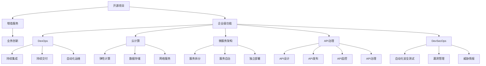

                 

# 开源项目的企业级功能：增值服务的机会

> 关键词：开源项目,企业级功能,增值服务,业务创新,DevOps,云计算,微服务架构,API治理,DevSecOps

## 1. 背景介绍

随着开源社区的蓬勃发展，企业级开源项目的价值日益凸显。越来越多的公司开始以开源项目为核心，构建自己的业务平台和增值服务。但如何将开源项目的能力转化为企业级的功能，拓展业务创新的新空间，成为当下开源项目应用中的重要课题。本文将从开源项目的企业级功能、增值服务、业务创新等角度进行深入分析，探讨如何通过开源项目赋能企业级的增值服务。

## 2. 核心概念与联系

### 2.1 核心概念概述

为更好地理解开源项目的企业级功能及其与增值服务的联系，本节将介绍几个密切相关的核心概念：

- **开源项目（Open Source Project）**：指在开源许可证下发布的，可以被公众访问、修改、使用的软件代码。典型的开源项目包括Linux、Apache、Hadoop等。
- **企业级功能（Enterprise-Level Functionality）**：指企业级应用所需的核心功能，包括但不限于数据库、中间件、身份认证、用户管理等。企业级功能的构建通常需要考虑企业级的数据安全和隐私保护、系统高可用性、扩展性和性能等方面。
- **增值服务（Value-Added Services）**：指在基础产品基础上，为企业提供的服务和功能，如数据分析、安全审计、API管理、运维监控等。增值服务通常针对特定行业需求，通过定制化和专业化服务，提升产品的竞争力。
- **业务创新（Business Innovation）**：指通过新技术、新模式、新服务等方式，对传统业务进行升级和转型，实现企业价值和市场竞争力的提升。开源项目可以提供创新的技术基础和开发框架，推动业务创新的实现。
- **DevOps（Development and Operations）**：一种强调开发和运维协同合作的软件交付模式，旨在提高软件开发和运维效率，提升产品质量和用户体验。DevOps实践包括持续集成、持续交付、自动化运维等技术手段。
- **云计算（Cloud Computing）**：指通过互联网提供可扩展的、按需部署的计算资源和服务，如服务器、存储、数据库等。云计算平台包括AWS、Azure、阿里云等。
- **微服务架构（Microservices Architecture）**：指将应用程序拆分成一组小型、独立、可互操作的服务，每个服务独立部署、扩展和维护。微服务架构可以提高系统的灵活性、扩展性和可维护性。
- **API治理（API Governance）**：指对API生命周期进行管理和控制，确保API的安全性、稳定性和可用性。API治理包括API设计、发布、监控、治理等方面。
- **DevSecOps（Development, Security, and Operations）**：一种整合安全、开发和运维的软件交付模式，旨在提升系统安全性和运维效率。DevSecOps实践包括自动化安全测试、漏洞管理、威胁情报等。

这些核心概念之间的逻辑关系可以通过以下Mermaid流程图来展示：



这个流程图展示了一系列核心概念之间的联系：

1. 开源项目提供技术和框架基础。
2. 企业级功能基于开源项目实现，满足企业需求。
3. 增值服务在企业级功能基础上，针对特定行业需求进行定制和优化。
4. 业务创新利用开源项目和增值服务，实现技术和商业模式的双重突破。
5. DevOps、云计算、微服务、API治理、DevSecOps等技术手段，分别支持不同环节的功能实现和系统管理。

## 3. 核心算法原理 & 具体操作步骤

### 3.1 算法原理概述

开源项目的企业级功能和增值服务，涉及复杂的系统设计和应用开发。从原理上看，这些功能的实现通常包括以下几个关键步骤：

1. **需求分析**：明确企业级功能和增值服务的具体需求，包括业务场景、功能模块、数据模型等。
2. **架构设计**：选择合适的技术栈和架构模式，如微服务架构、云计算架构等，设计系统整体结构和组件间的关系。
3. **功能实现**：基于开源项目的技术框架和开发工具，实现系统功能模块。
4. **集成测试**：对系统进行集成测试，确保各模块间协同工作，功能正确无误。
5. **部署上线**：将系统部署到云计算平台，并进行后续的运维和监控。

### 3.2 算法步骤详解

开源项目的企业级功能和增值服务的具体操作步骤如下：

**Step 1: 需求分析和架构设计**
- 与企业业务部门进行深度沟通，明确需求背景、目标、优先级等。
- 选择合适的架构模式和开源项目，设计系统的整体结构，如微服务、API Gateway等。
- 确定关键技术组件，如数据库、缓存、消息队列等。

**Step 2: 功能实现**
- 基于开源项目，进行功能模块的开发和实现，确保与企业级功能和增值服务目标一致。
- 使用DevOps工具进行代码管理、版本控制、自动化测试等，提升开发效率和代码质量。
- 引入开源项目的基础设施，如中间件、框架、库等，提升系统的通用性和可扩展性。

**Step 3: 集成测试**
- 对系统进行单元测试、集成测试、系统测试，确保各模块功能正确、稳定运行。
- 使用CI/CD工具，如Jenkins、Travis CI等，实现自动化构建和部署。
- 进行负载测试、压力测试，确保系统具备良好的性能和可靠性。

**Step 4: 部署上线**
- 将系统部署到云计算平台，选择合适的服务类型，如ECS、EKS等。
- 进行配置管理、监控和告警，确保系统的高可用性和稳定性。
- 引入DevSecOps实践，如自动化安全测试、漏洞管理等，提升系统安全性。

**Step 5: 增值服务定制和优化**
- 根据企业需求，对系统进行增值服务的定制和优化，如数据治理、API管理、监控中心等。
- 引入开源项目的社区支持和专家咨询，提升系统性能和稳定性。
- 定期更新系统，引入最新的开源项目版本和技术演进，保持系统的竞争力。

### 3.3 算法优缺点

开源项目的企业级功能和增值服务具有以下优点：

1. **成本低廉**：基于开源项目进行开发，可以显著降低开发和运维成本。
2. **灵活性强**：开源项目提供了丰富的技术栈和开发框架，可以灵活构建企业级功能和增值服务。
3. **社区支持**：开源项目拥有庞大的社区支持，可以快速解决技术问题，提升系统性能。
4. **快速迭代**：开源项目的持续更新和演进，使得系统可以快速迭代和升级，适应业务变化。

但同时也存在一些缺点：

1. **定制难度高**：开源项目通常较为通用，需根据企业需求进行大量定制和优化。
2. **兼容性和整合难度大**：不同开源项目之间的兼容性和整合难度较大，需进行系统化的集成测试。
3. **安全性和合规性风险**：开源项目可能存在安全漏洞和合规性问题，需进行严格的审计和管控。
4. **性能瓶颈**：开源项目的性能可能存在瓶颈，需进行优化和调优。

### 3.4 算法应用领域

开源项目的企业级功能和增值服务在多个行业领域中得到了广泛应用，例如：

- **金融科技（Fintech）**：开发企业级的金融管理平台、智能投顾系统、风险控制系统等，提升金融服务效率和风险管理能力。
- **电子商务（E-commerce）**：构建企业级的电商管理系统、商品推荐系统、物流管理系统等，提升电商运营效率和用户体验。
- **医疗健康（Healthcare）**：开发企业级的医疗信息系统、电子病历系统、智能诊断系统等，提升医疗服务质量和效率。
- **制造业（Manufacturing）**：打造企业级的制造管理系统、供应链管理系统、设备监控系统等，提升生产效率和资源利用率。
- **政府服务（Government Services）**：构建企业级的政务服务平台、公共服务平台、城市治理系统等，提升政府服务水平和效率。
- **教育培训（Education and Training）**：开发企业级的教育管理平台、在线培训系统、教育资源库等，提升教育培训的覆盖面和质量。

## 4. 数学模型和公式 & 详细讲解 & 举例说明

### 4.1 数学模型构建

假设企业级功能的开发需求为 $F$，增值服务的功能需求为 $S$，开源项目的社区支持为 $C$，企业的业务创新需求为 $B$。则企业级功能和增值服务的数学模型可以表示为：

$$
F = f(S, C, B)
$$

其中 $f$ 表示函数关系，$S$、$C$、$B$ 为输入变量。

### 4.2 公式推导过程

以下我们以微服务架构的企业级功能为例，推导其数学模型和计算过程。

**Step 1: 需求分析和架构设计**
- 需求分析：确定企业级功能的业务需求和系统架构，如电商平台的管理系统。
- 架构设计：选择合适的开源项目，如Spring Boot、Docker等，设计系统的整体架构。

**Step 2: 功能实现**
- 功能实现：基于Spring Boot框架和Docker容器，实现电商平台的管理系统。
- 代码管理：使用Git进行版本控制，提升代码的协同开发和管理效率。
- 自动化测试：使用JUnit、Selenium等工具进行单元测试和功能测试，提升代码质量。

**Step 3: 集成测试**
- 集成测试：对电商平台的管理系统进行集成测试，确保各模块协同工作，功能正确。
- 自动化部署：使用Jenkins实现持续集成和持续部署，提升部署效率。
- 负载测试：使用Apache JMeter进行负载测试，确保系统在高并发情况下稳定运行。

**Step 4: 部署上线**
- 部署上线：将电商平台的管理系统部署到AWS ECS上，进行容器化部署。
- 配置管理：使用CloudFormation进行配置管理，确保系统的高可用性和稳定性。
- 监控和告警：使用ELK Stack进行日志监控和告警，确保系统的实时监控和问题快速响应。

**Step 5: 增值服务定制和优化**
- 增值服务：基于Spring Cloud构建API Gateway，提供API管理、监控中心等功能。
- 社区支持：引入Apache Kafka消息队列，提升系统的性能和稳定性。
- 专家咨询：引入开源项目的社区支持，提升系统性能和安全性。

通过以上步骤，企业级功能和增值服务可以通过开源项目实现，提升系统的性能、安全性和可扩展性，实现业务创新的新突破。

### 4.3 案例分析与讲解

以阿里巴巴的云原生系统为例，说明开源项目在企业级功能和增值服务中的应用。

**需求分析**：
- 阿里巴巴需要将现有应用系统迁移到云原生架构上，提升系统的性能和扩展性。

**架构设计**：
- 选择Kubernetes作为容器编排工具，构建云原生架构。
- 引入Spring Boot、Spring Cloud等开源项目，实现服务拆分和微服务架构。

**功能实现**：
- 使用Spring Boot开发云原生应用，实现服务间的解耦和独立部署。
- 引入Docker容器化技术，提升系统的可移植性和扩展性。
- 使用Kubernetes进行容器编排，实现服务的高可用性和负载均衡。

**集成测试**：
- 对云原生应用进行单元测试、集成测试、系统测试，确保各服务模块功能正确。
- 使用Jenkins进行持续集成和持续部署，提升系统的开发效率和代码质量。
- 使用负载测试工具进行压力测试，确保系统在高并发情况下稳定运行。

**部署上线**：
- 将云原生应用部署到阿里云的Kubernetes集群上，实现容器化部署。
- 使用CloudFormation进行配置管理，确保系统的配置一致性和高可用性。
- 使用ELK Stack进行日志监控和告警，确保系统的实时监控和问题快速响应。

**增值服务定制和优化**：
- 基于Spring Cloud构建API Gateway，提供API管理、监控中心等功能。
- 引入Apache Kafka消息队列，提升系统的性能和稳定性。
- 引入Apache RocketMQ消息队列，实现服务间的可靠通信和消息异步处理。

通过以上步骤，阿里巴巴成功实现了从传统应用系统向云原生系统的平滑迁移，提升了系统的性能、扩展性和可用性，满足了企业级功能和增值服务的需求。

## 5. 项目实践：代码实例和详细解释说明

### 5.1 开发环境搭建

在进行企业级功能和增值服务开发前，我们需要准备好开发环境。以下是使用Java进行Spring Boot开发的环境配置流程：

1. 安装JDK：从官网下载安装JDK 8或以上版本，并配置JAVA_HOME环境变量。

2. 安装Maven：从官网下载安装Maven，并配置M2_HOME环境变量。

3. 安装Git：从官网下载安装Git，并配置GIT_HOME环境变量。

4. 安装Jenkins：从官网下载安装Jenkins，并配置JENKINS_HOME环境变量。

5. 安装Docker：从官网下载安装Docker，并配置DOCKER_HOME环境变量。

完成上述步骤后，即可在开发环境中开始企业级功能和增值服务的开发。

### 5.2 源代码详细实现

这里我们以电商平台的管理系统为例，给出使用Spring Boot进行开发的完整代码实现。

首先，定义业务需求和系统架构：

```java
// 业务需求定义
public interface EcommerceService {
    void manageInventory();
    void processOrder(String orderId);
    void generateReport();
}

// 系统架构定义
public interface EcommerceSystem {
    EcommerceService getEcommerceService();
    void startSystem();
}
```

然后，实现具体功能模块：

```java
// 订单管理服务实现
@Component
public class OrderService implements EcommerceService {
    private final OrderRepository orderRepository;
    
    public OrderService(OrderRepository orderRepository) {
        this.orderRepository = orderRepository;
    }
    
    @Override
    public void manageInventory() {
        // 管理库存
        orderRepository.updateInventory();
    }
    
    @Override
    public void processOrder(String orderId) {
        // 处理订单
        orderRepository.process(orderId);
    }
    
    @Override
    public void generateReport() {
        // 生成报表
        orderRepository.generateReport();
    }
}

// 系统架构实现
@SpringBootApplication
public class EcommerceSystem implements EcommerceSystem {
    private final EcommerceService ecommerceService;
    
    public EcommerceSystem(EcommerceService ecommerceService) {
        this.ecommerceService = ecommerceService;
    }
    
    @Override
    public EcommerceService getEcommerceService() {
        return ecommerceService;
    }
    
    @PostConstruct
    public void startSystem() {
        // 启动系统
        ecommerceService.start();
    }
}
```

接着，定义API接口和控制器：

```java
// API接口定义
@RestController
@RequestMapping("/ecommerce")
public class EcommerceController {
    private final EcommerceService ecommerceService;
    
    public EcommerceController(EcommerceService ecommerceService) {
        this.ecommerceService = ecommerceService;
    }
    
    @GetMapping("/inventory")
    public String manageInventory() {
        // 管理库存
        ecommerceService.manageInventory();
        return "Inventory managed successfully.";
    }
    
    @PostMapping("/order")
    public String processOrder(@RequestParam String orderId) {
        // 处理订单
        ecommerceService.processOrder(orderId);
        return "Order processed successfully.";
    }
    
    @GetMapping("/report")
    public String generateReport() {
        // 生成报表
        ecommerceService.generateReport();
        return "Report generated successfully.";
    }
}

// 系统架构实现
@SpringBootApplication
public class EcommerceSystem implements EcommerceSystem {
    private final EcommerceService ecommerceService;
    
    public EcommerceSystem(EcommerceService ecommerceService) {
        this.ecommerceService = ecommerceService;
    }
    
    @Override
    public EcommerceService getEcommerceService() {
        return ecommerceService;
    }
    
    @PostConstruct
    public void startSystem() {
        // 启动系统
        ecommerceService.start();
    }
}
```

最后，启动Spring Boot应用，并进行持续集成和持续部署：

```java
// Spring Boot应用程序
@SpringBootApplication
public class EcommerceSystem implements EcommerceSystem {
    private final EcommerceService ecommerceService;
    
    public EcommerceSystem(EcommerceService ecommerceService) {
        this.ecommerceService = ecommerceService;
    }
    
    @Override
    public EcommerceService getEcommerceService() {
        return ecommerceService;
    }
    
    @PostConstruct
    public void startSystem() {
        // 启动系统
        ecommerceService.start();
    }
}

// Jenkins配置文件
pipeline {
    agent none
    stages {
        stage('Build') {
            steps {
                sh 'mvn clean package'
            }
        }
        stage('Test') {
            steps {
                sh 'mvn test'
            }
        }
        stage('Deploy') {
            steps {
                sh 'docker build -t ecommerce-app:latest .'
                sh 'docker push ecommerce-app:latest'
                sh 'kubectl apply -f deployment.yaml'
            }
        }
    }
}
```

以上就是使用Spring Boot进行电商平台管理系统开发的完整代码实现。可以看到，Spring Boot提供了便捷的开发框架和丰富的插件，使得企业级功能的开发变得更加高效和灵活。

### 5.3 代码解读与分析

让我们再详细解读一下关键代码的实现细节：

**EcommerceService接口**：
- 定义了电商平台的管理系统需要实现的功能，如管理库存、处理订单、生成报表等。

**OrderService类**：
- 实现了订单管理服务的具体功能，如更新库存、处理订单、生成报表等。

**EcommerceController类**：
- 定义了电商平台的管理系统的API接口，并使用Spring Boot进行路由和控制器映射。

**EcommerceSystem类**：
- 定义了企业级功能的架构实现，实现了Spring Boot应用程序的启动。

**Jenkins配置文件**：
- 定义了Jenkins的持续集成和持续部署流程，通过Maven和Docker实现自动化构建和部署。

通过以上代码，我们可以看到，基于Spring Boot进行企业级功能的开发，可以大大提升开发效率和代码质量，同时借助Jenkins等DevOps工具，实现持续集成和持续部署，提升系统的稳定性和可靠性。

当然，工业级的系统实现还需考虑更多因素，如系统的监控、告警、日志等，但核心的开发流程和DevOps实践基本与此类似。

## 6. 实际应用场景

### 6.1 智能制造系统

基于开源项目的企业级功能和增值服务，可以在智能制造系统中得到广泛应用。传统制造系统往往缺乏系统化、自动化的管理能力，难以满足现代制造对灵活性、可扩展性和安全性等要求。利用企业级功能的开发和增值服务的定制，可以构建智能化的制造系统，提升生产效率和资源利用率。

在技术实现上，可以引入Spring Boot、Spring Cloud等开源项目，构建微服务架构，实现生产管理、设备监控、质量控制等功能。通过API Gateway、容器化技术等增值服务，提升系统的接口管理和性能优化，实现系统的协同工作和管理。

### 6.2 智慧医疗系统

在智慧医疗领域，企业级功能和增值服务可以帮助医疗机构提升信息化水平和医疗服务质量。利用Spring Boot、Spring Cloud等开源项目，可以构建医疗信息系统、电子病历系统、智能诊断系统等。通过API Gateway、容器化技术等增值服务，提升系统的接口管理和性能优化，实现系统的协同工作和管理。

在具体应用中，可以引入Spring Boot进行医疗系统的开发，使用Spring Cloud构建微服务架构，实现系统的高可用性和可扩展性。通过API Gateway、容器化技术等增值服务，提升系统的接口管理和性能优化，实现系统的协同工作和管理。

### 6.3 智慧城市系统

智慧城市系统是未来城市发展的方向，涵盖城市规划、交通管理、公共服务等多个领域。利用企业级功能和增值服务，可以构建智能化的城市管理系统，提升城市治理水平和居民生活质量。

在技术实现上，可以引入Spring Boot、Spring Cloud等开源项目，构建智慧城市的应用系统。通过API Gateway、容器化技术等增值服务，提升系统的接口管理和性能优化，实现系统的协同工作和管理。

## 7. 工具和资源推荐

### 7.1 学习资源推荐

为了帮助开发者系统掌握企业级功能和增值服务的开发技术，这里推荐一些优质的学习资源：

1. Spring Boot官方文档：提供了详细的Spring Boot开发手册和API文档，是学习企业级功能开发的重要资源。
2. Docker官方文档：提供了Docker容器化技术的全面介绍和实践指南，是学习容器技术的重要资源。
3. Kubernetes官方文档：提供了Kubernetes容器编排技术的全面介绍和实践指南，是学习微服务架构的重要资源。
4. Jenkins官方文档：提供了Jenkins持续集成和持续部署的全面介绍和实践指南，是学习DevOps的重要资源。
5. Spring Cloud官方文档：提供了Spring Cloud微服务架构的全面介绍和实践指南，是学习API Gateway和微服务架构的重要资源。

通过对这些资源的学习实践，相信你一定能够快速掌握企业级功能和增值服务的开发技术，并用于解决实际的业务问题。

### 7.2 开发工具推荐

高效的开发离不开优秀的工具支持。以下是几款用于企业级功能和增值服务开发的常用工具：

1. Spring Boot：基于Spring框架的企业级开发框架，提供了便捷的开发环境、自动化的配置管理等功能，是企业级功能开发的重要工具。
2. Docker：基于容器技术的应用部署工具，提供了便捷的容器化部署和管理功能，是微服务架构部署的重要工具。
3. Kubernetes：基于容器技术的容器编排工具，提供了高效的容器编排和管理功能，是微服务架构管理的重要工具。
4. Jenkins：基于开源的持续集成和持续部署工具，提供了强大的CI/CD功能，是DevOps实践的重要工具。
5. Git：基于分布式版本控制系统的代码管理工具，提供了强大的版本控制和管理功能，是企业级功能开发的重要工具。

合理利用这些工具，可以显著提升企业级功能和增值服务的开发效率，加快创新迭代的步伐。

### 7.3 相关论文推荐

企业级功能和增值服务的发展源于学界的持续研究。以下是几篇奠基性的相关论文，推荐阅读：

1. "Spring Boot in Action" by Maximilian Leo：介绍了Spring Boot的基本概念和开发实践，是学习企业级功能开发的重要教材。
2. "Docker: The Definitive Guide" by Jeff Nguyen and Mark Ryder：介绍了Docker容器化技术的全面知识，是学习容器技术的重要教材。
3. "Kubernetes: Upgrading to the Future" by Adrien de Leon：介绍了Kubernetes容器编排技术的全面知识，是学习微服务架构的重要教材。
4. "Jenkins: Continuous Deployment and Integration" by Peter Pilsworth：介绍了Jenkins持续集成和持续部署的全面知识，是学习DevOps的重要教材。
5. "Spring Cloud: Microservices Architecture with Spring" by Yannis Ioannou：介绍了Spring Cloud微服务架构的全面知识，是学习API Gateway和微服务架构的重要教材。

这些论文代表了大企业级功能和增值服务的发展脉络。通过学习这些前沿成果，可以帮助研究者把握学科前进方向，激发更多的创新灵感。

## 8. 总结：未来发展趋势与挑战

### 8.1 总结

本文对基于开源项目的企业级功能和增值服务进行了全面系统的介绍。首先阐述了企业级功能与增值服务的概念及其之间的联系，明确了其在企业应用中的重要价值。其次，从原理到实践，详细讲解了企业级功能和增值服务的开发流程，给出了企业级功能和增值服务开发的完整代码实例。同时，本文还广泛探讨了企业级功能和增值服务在多个行业领域的应用前景，展示了其广阔的应用空间。

通过本文的系统梳理，可以看到，基于开源项目的企业级功能和增值服务正在成为企业级应用的重要范式，极大地拓展了企业级功能和增值服务的应用边界，推动了企业业务创新的不断进步。

### 8.2 未来发展趋势

展望未来，企业级功能和增值服务的发展趋势将呈现以下几个方面：

1. **微服务架构的普及**：随着微服务架构的不断成熟，越来越多的企业将采用微服务架构构建企业级功能和增值服务，提升系统的灵活性和可扩展性。
2. **容器化技术的广泛应用**：Docker、Kubernetes等容器化技术将得到更广泛的应用，提升系统的部署效率和稳定性。
3. **DevOps的深入实践**：DevOps实践将成为企业级功能和增值服务开发的重要支撑，提升系统的开发效率和质量。
4. **云原生技术的快速演进**：云原生技术将不断演进，提升系统的弹性、可伸缩性和高可用性。
5. **API治理的全面实施**：API治理将得到全面实施，提升系统的接口管理和安全性。
6. **DevSecOps的全面融合**：DevSecOps将全面融合，提升系统的安全性和可靠性。
7. **大数据和人工智能的深度结合**：大数据和人工智能技术将深度结合，提升系统的智能化和精准性。

以上趋势凸显了企业级功能和增值服务的发展前景。这些方向的探索发展，必将进一步提升企业级功能和增值服务的技术水平和应用价值，推动企业级应用迈向新的高度。

### 8.3 面临的挑战

尽管企业级功能和增值服务的发展前景广阔，但在迈向更加智能化、普适化应用的过程中，仍面临诸多挑战：

1. **复杂度提升**：微服务架构和容器化技术的引入，增加了系统的复杂度和维护难度。
2. **安全性和隐私保护**：企业级功能的数据安全和隐私保护需要特别注意，防止数据泄露和滥用。
3. **性能瓶颈**：企业级功能的高并发和大数据处理可能导致性能瓶颈，需要进行系统优化和调优。
4. **资源消耗**：容器化技术和大数据处理可能导致资源消耗过大，需要进行资源管理和优化。
5. **标准化问题**：不同开源项目之间的接口和标准不统一，可能导致系统集成和扩展困难。
6. **人才缺口**：企业级功能和增值服务的开发需要多领域知识，人才缺口较大。

这些挑战需要企业在使用开源项目构建企业级功能和增值服务时，注意系统架构的设计、安全和隐私的保护、性能和资源的优化、标准的统一和人才的培养，以确保系统的稳定性和可靠性。

### 8.4 研究展望

面对企业级功能和增值服务所面临的挑战，未来的研究需要在以下几个方面寻求新的突破：

1. **标准化和兼容性**：推动不同开源项目之间的标准化和兼容性，提升系统的可扩展性和互操作性。
2. **安全性与隐私保护**：加强数据安全和隐私保护，提升系统的安全性和可信度。
3. **性能优化与调优**：优化系统的性能和资源使用，提升系统的响应速度和稳定性。
4. **持续集成与持续交付**：采用DevOps实践，提升系统的开发效率和质量。
5. **多领域知识融合**：推动大数据、人工智能、区块链等领域的知识融合，提升系统的智能化和精准性。
6. **开源项目社区建设**：加强开源项目社区的建设，提升开源项目的活力和影响力。

这些研究方向的探索，必将引领企业级功能和增值服务技术迈向更高的台阶，为企业的数字化转型提供更有力的技术支撑。面向未来，企业级功能和增值服务技术还需要与其他人工智能技术进行更深入的融合，多路径协同发力，共同推动企业级应用的进步。只有勇于创新、敢于突破，才能不断拓展企业级功能和增值服务的技术边界，让企业级应用更好地服务于社会和用户。

## 9. 附录：常见问题与解答

**Q1: 如何选择合适的开源项目进行企业级功能和增值服务的开发？**

A: 选择合适的开源项目需要综合考虑技术栈、社区活跃度、项目成熟度等因素。建议选择技术社区活跃、文档齐全、代码质量高的开源项目。

**Q2: 企业级功能和增值服务的开发过程中需要注意哪些风险？**

A: 开发过程中需要注意技术风险、安全风险、资源风险等。建议采用DevOps实践，通过持续集成和持续交付提升系统质量。

**Q3: 如何确保企业级功能和增值服务的系统安全？**

A: 系统安全需要从数据加密、访问控制、安全审计等方面进行全面考虑。建议采用DevSecOps实践，进行自动化安全测试和漏洞管理。

**Q4: 如何提升企业级功能和增值服务的性能和稳定性？**

A: 性能优化需要从代码优化、负载均衡、缓存策略等方面进行综合考虑。建议采用微服务架构、容器化技术、云原生技术等提升系统性能和稳定性。

**Q5: 企业级功能和增值服务的持续集成和持续交付如何实现？**

A: 持续集成和持续交付需要从自动化测试、CI/CD工具、代码管理等方面进行综合考虑。建议采用Jenkins、Maven、Docker等工具实现持续集成和持续交付。

通过以上问题与解答，可以看到企业级功能和增值服务开发过程中的重要事项和风险点，进一步提升系统的稳定性和可靠性。

---

作者：禅与计算机程序设计艺术 / Zen and the Art of Computer Programming

