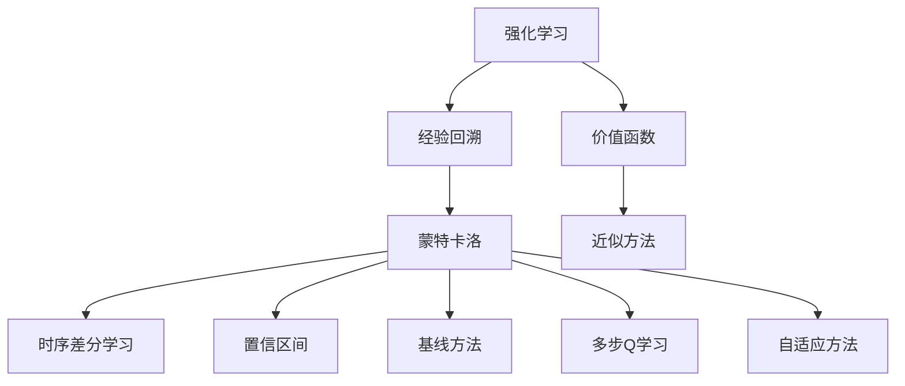

                 

# 强化学习Reinforcement Learning中价值函数近似方法解读

> 关键词：强化学习, 价值函数, 近似方法, 深度学习, 经验回溯, 蒙特卡洛, 时序差分学习, 置信区间, 基线方法, 多步Q学习, 自适应方法

## 1. 背景介绍

强化学习(Reinforcement Learning, RL)是机器学习的一个分支，通过智能体(Agent)在环境中执行动作(ACTION)以最大化累积奖励(CUMULATIVE REWARD)来学习最优策略(POLICY)。在RL中，智能体通过与环境交互学习，逐渐提升策略的性能，最终实现自动控制或决策的目的。

与监督学习(Supervised Learning)和无监督学习(Unsupervised Learning)不同，RL不依赖标注数据，而直接从环境与智能体的交互中学习。然而，由于RL的复杂性，直接从交互中学习往往效率较低，计算成本较高，难以处理高维连续动作空间等问题。

为解决这些问题，研究人员提出了一种新的范式——价值函数近似方法(Approximate Value Function)，通过学习价值函数(V-value function)来指导智能体的动作选择，从而显著提升学习效率。本文将对强化学习中价值函数近似方法进行系统解读，并结合代码实例进行详细讲解。

## 2. 核心概念与联系

### 2.1 核心概念概述

- **强化学习(Reinforcement Learning, RL)**：通过智能体在环境中执行动作以最大化累积奖励来学习最优策略的机器学习方法。
- **价值函数(V-value function)**：通过学习价值函数来指导智能体的动作选择，从而优化策略。价值函数通常定义为状态(S)到奖励(Reward)的映射，即$V(s)$。
- **近似方法(Approximation)**：直接从环境中学习策略的效率较低，通过近似方法如蒙特卡洛(Monte Carlo)、时序差分学习(Time-Difference Learning)等，学习价值函数以加速学习过程。
- **经验回溯(Policy Improvement)**：通过回溯智能体在环境中的经验，计算价值函数并更新策略，以不断优化智能体的行为表现。
- **蒙特卡洛(Monte Carlo)**：通过随机抽样，利用统计估计来计算价值函数。
- **时序差分学习(Time-Difference Learning)**：通过直接更新状态值差分来近似价值函数。
- **置信区间(CI)**：置信区间用于估计价值函数的精度，减少估计误差。
- **基线方法(Baseline Methods)**：通过引入基线(Baseline)来估计价值函数，以提升学习效率。
- **多步Q学习(Multi-Step Q Learning)**：通过考虑多步奖励来优化策略。
- **自适应方法(Adaptive Methods)**：通过动态调整学习参数来提升学习效率。

这些概念之间具有紧密的联系，共同构成了强化学习中价值函数近似方法的核心框架。

### 2.2 核心概念原理和架构的 Mermaid 流程图



### 2.3 核心概念之间的关系

在强化学习中，价值函数近似方法的核心是学习价值函数以指导智能体的动作选择，具体通过以下过程实现：

1. **状态值函数(S-Value Function)**：定义状态$s$的价值函数$V(s)$，即在状态$s$下执行某动作$A$后的累积奖励。
2. **动作值函数(Q-value Function)**：定义状态-动作对$(s, a)$的动作值函数$Q(s, a)$，即在状态$s$下执行动作$a$后的累积奖励。
3. **经验回溯(Policy Improvement)**：通过回溯智能体在环境中的经验，计算价值函数并更新策略，以不断优化智能体的行为表现。
4. **蒙特卡洛(Monte Carlo)**：通过随机抽样，利用统计估计来计算价值函数。
5. **时序差分学习(Time-Difference Learning)**：通过直接更新状态值差分来近似价值函数。
6. **置信区间(CI)**：通过置信区间来估计价值函数的精度，减少估计误差。
7. **基线方法(Baseline Methods)**：通过引入基线来估计价值函数，以提升学习效率。
8. **多步Q学习(Multi-Step Q Learning)**：通过考虑多步奖励来优化策略。
9. **自适应方法(Adaptive Methods)**：通过动态调整学习参数来提升学习效率。

这些概念共同构成了强化学习中价值函数近似方法的核心框架，通过学习价值函数来指导智能体的动作选择，以优化策略并提升学习效率。

## 3. 核心算法原理 & 具体操作步骤

### 3.1 算法原理概述

强化学习中的价值函数近似方法，通过学习价值函数来指导智能体的动作选择，从而优化策略。价值函数近似方法的核心是学习一个近似的价值函数$\hat{V}$，用于估计状态的价值，从而指导智能体的行为。

具体而言，强化学习中的价值函数近似方法通过以下步骤实现：

1. **状态值函数(S-Value Function)**：定义状态$s$的价值函数$V(s)$，即在状态$s$下执行某动作$A$后的累积奖励。
2. **动作值函数(Q-value Function)**：定义状态-动作对$(s, a)$的动作值函数$Q(s, a)$，即在状态$s$下执行动作$a$后的累积奖励。
3. **经验回溯(Policy Improvement)**：通过回溯智能体在环境中的经验，计算价值函数并更新策略，以不断优化智能体的行为表现。
4. **蒙特卡洛(Monte Carlo)**：通过随机抽样，利用统计估计来计算价值函数。
5. **时序差分学习(Time-Difference Learning)**：通过直接更新状态值差分来近似价值函数。
6. **置信区间(CI)**：通过置信区间来估计价值函数的精度，减少估计误差。
7. **基线方法(Baseline Methods)**：通过引入基线来估计价值函数，以提升学习效率。
8. **多步Q学习(Multi-Step Q Learning)**：通过考虑多步奖励来优化策略。
9. **自适应方法(Adaptive Methods)**：通过动态调整学习参数来提升学习效率。

### 3.2 算法步骤详解

#### 3.2.1 蒙特卡洛方法

蒙特卡洛方法是一种通过随机抽样来计算价值函数的方法。其主要步骤包括：

1. **样本采集**：从环境中进行随机遍历，收集足够多的样本数据。
2. **价值函数估计**：对于每个状态$s$，根据样本数据估计其价值函数$V(s)$。
3. **策略优化**：通过价值函数优化智能体的策略，以最大化累积奖励。

#### 3.2.2 时序差分学习

时序差分学习是一种通过直接更新状态值差分来近似价值函数的方法。其主要步骤包括：

1. **样本采集**：从环境中进行随机遍历，收集足够多的样本数据。
2. **状态值差分更新**：根据样本数据更新状态值差分$\delta_t = R_{t+1} + \gamma \hat{V}(s_{t+1}) - \hat{V}(s_t)$。
3. **价值函数估计**：通过状态值差分估计价值函数$\hat{V}(s_t)$。
4. **策略优化**：通过价值函数优化智能体的策略，以最大化累积奖励。

#### 3.2.3 置信区间

置信区间用于估计价值函数的精度，减少估计误差。其主要步骤包括：

1. **样本采集**：从环境中进行随机遍历，收集足够多的样本数据。
2. **置信区间估计**：通过统计方法估计价值函数的置信区间。
3. **策略优化**：根据置信区间优化智能体的策略，以最大化累积奖励。

#### 3.2.4 基线方法

基线方法通过引入基线来估计价值函数，以提升学习效率。其主要步骤包括：

1. **基线选择**：选择适当的基线函数$\hat{V}_{base}(s)$。
2. **样本采集**：从环境中进行随机遍历，收集足够多的样本数据。
3. **价值函数估计**：通过基线函数估计价值函数$\hat{V}(s) = \hat{V}_{base}(s) + \delta(s)$。
4. **策略优化**：通过价值函数优化智能体的策略，以最大化累积奖励。

#### 3.2.5 多步Q学习

多步Q学习通过考虑多步奖励来优化策略。其主要步骤包括：

1. **样本采集**：从环境中进行随机遍历，收集足够多的样本数据。
2. **动作值函数更新**：根据样本数据更新动作值函数$Q(s, a)$。
3. **策略优化**：通过动作值函数优化智能体的策略，以最大化累积奖励。

#### 3.2.6 自适应方法

自适应方法通过动态调整学习参数来提升学习效率。其主要步骤包括：

1. **样本采集**：从环境中进行随机遍历，收集足够多的样本数据。
2. **参数调整**：根据样本数据动态调整学习参数。
3. **策略优化**：通过优化后的策略最大化累积奖励。

### 3.3 算法优缺点

#### 3.3.1 优点

1. **学习效率高**：通过近似方法快速估计价值函数，显著提升学习效率。
2. **泛化能力强**：近似方法可以处理高维连续动作空间等问题。
3. **适应性强**：自适应方法可以动态调整学习参数，适应不同环境变化。

#### 3.3.2 缺点

1. **估计误差大**：近似方法通常存在估计误差，影响学习效果。
2. **复杂度高**：基线方法和多步Q学习等方法复杂度高，计算量大。
3. **参数空间大**：自适应方法需要调整多个参数，难以找到最优组合。

### 3.4 算法应用领域

强化学习中的价值函数近似方法已经广泛应用于游戏、机器人控制、自动驾驶、金融交易等领域。其主要应用场景包括：

1. **游戏AI**：通过学习价值函数优化游戏AI的行为策略，提高游戏表现。
2. **机器人控制**：通过学习价值函数优化机器人控制策略，实现自主导航和避障。
3. **自动驾驶**：通过学习价值函数优化自动驾驶策略，提高交通安全和效率。
4. **金融交易**：通过学习价值函数优化交易策略，提升投资回报。
5. **医疗诊断**：通过学习价值函数优化医疗诊断策略，提高诊断准确率。
6. **聊天机器人**：通过学习价值函数优化聊天机器人策略，提高对话质量。

## 4. 数学模型和公式 & 详细讲解 & 举例说明

### 4.1 数学模型构建

强化学习中的价值函数近似方法主要涉及以下几个数学模型：

1. **状态值函数(S-Value Function)**：定义为状态$s$的价值函数$V(s)$，即在状态$s$下执行某动作$A$后的累积奖励。
2. **动作值函数(Q-value Function)**：定义为状态-动作对$(s, a)$的动作值函数$Q(s, a)$，即在状态$s$下执行动作$a$后的累积奖励。
3. **蒙特卡洛方法**：通过随机抽样，利用统计估计来计算价值函数。
4. **时序差分学习**：通过直接更新状态值差分来近似价值函数。
5. **置信区间**：通过统计方法估计价值函数的精度。
6. **基线方法**：通过引入基线函数$\hat{V}_{base}(s)$来估计价值函数。
7. **多步Q学习**：通过考虑多步奖励来优化策略。
8. **自适应方法**：通过动态调整学习参数来提升学习效率。

### 4.2 公式推导过程

#### 4.2.1 蒙特卡洛方法

蒙特卡洛方法通过随机抽样，利用统计估计来计算价值函数。其主要公式包括：

1. **单步蒙特卡洛方法**：
   $$
   V(s) = \frac{1}{N}\sum_{i=1}^N \left[ \sum_{t=0}^{T-1} \gamma^t R_t + \gamma^T r_T \right]
   $$
   其中，$N$为样本数量，$T$为样本长度，$R_t$为第$t$步的奖励，$r_T$为终止步的奖励，$\gamma$为折扣因子。

2. **n步蒙特卡洛方法**：
   $$
   V(s) = \frac{1}{N}\sum_{i=1}^N \left[ \sum_{t=0}^{n-1} \gamma^t R_t + \gamma^n r_n \right]
   $$
   其中，$n$为n步蒙特卡洛方法的步数。

#### 4.2.2 时序差分学习

时序差分学习通过直接更新状态值差分来近似价值函数。其主要公式包括：

1. **单步TD方法**：
   $$
   \delta_t = R_{t+1} + \gamma \hat{V}(s_{t+1}) - \hat{V}(s_t)
   $$
   其中，$\delta_t$为状态值差分，$R_{t+1}$为下一步的奖励，$\gamma$为折扣因子，$\hat{V}(s_{t+1})$和$\hat{V}(s_t)$为近似价值函数。

2. **n步TD方法**：
   $$
   \delta_t^n = \sum_{k=0}^{n-1} \gamma^k R_{t+k+1} - \gamma^n \hat{V}(s_{t+n})
   $$
   其中，$\delta_t^n$为n步TD方法的状态值差分。

#### 4.2.3 置信区间

置信区间用于估计价值函数的精度，减少估计误差。其主要公式包括：

1. **置信区间估计**：
   $$
   CI = \hat{V}(s) \pm \epsilon
   $$
   其中，$\epsilon$为置信区间的宽度，通常根据样本数量$N$和置信度$\alpha$计算得到。

2. **置信区间优化**：
   $$
   \hat{V}(s) = \frac{1}{N}\sum_{i=1}^N \left[ \sum_{t=0}^{T-1} \gamma^t R_t + \gamma^T r_T \right] \pm \epsilon
   $$

#### 4.2.4 基线方法

基线方法通过引入基线函数$\hat{V}_{base}(s)$来估计价值函数。其主要公式包括：

1. **基线函数估计**：
   $$
   \hat{V}(s) = \hat{V}_{base}(s) + \delta(s)
   $$
   其中，$\delta(s)$为状态值差分。

2. **策略优化**：
   $$
   \pi^* = \arg\max_{\pi} \mathbb{E}_{s \sim P} \left[ \sum_{t=0}^{\infty} \gamma^t R_t \right]
   $$
   其中，$\pi$为策略，$P$为状态分布，$\gamma$为折扣因子，$R_t$为第$t$步的奖励。

#### 4.2.5 多步Q学习

多步Q学习通过考虑多步奖励来优化策略。其主要公式包括：

1. **动作值函数更新**：
   $$
   Q(s, a) = \frac{1}{N}\sum_{i=1}^N \left[ \sum_{t=0}^{n-1} \gamma^t R_{t+k+1} \right]
   $$
   其中，$Q(s, a)$为动作值函数，$R_{t+k+1}$为多步奖励。

2. **策略优化**：
   $$
   \pi^* = \arg\max_{\pi} \mathbb{E}_{s \sim P} \left[ \sum_{t=0}^{\infty} \gamma^t R_t \right]
   $$

#### 4.2.6 自适应方法

自适应方法通过动态调整学习参数来提升学习效率。其主要公式包括：

1. **学习率调整**：
   $$
   \eta_t = \frac{\eta_0}{1 + \frac{\eta_0}{\eta_0 + \tau t}}
   $$
   其中，$\eta_t$为当前学习率，$\eta_0$为初始学习率，$\tau$为衰减因子，$t$为当前迭代次数。

2. **策略优化**：
   $$
   \pi^* = \arg\max_{\pi} \mathbb{E}_{s \sim P} \left[ \sum_{t=0}^{\infty} \gamma^t R_t \right]
   $$

### 4.3 案例分析与讲解

#### 4.3.1 蒙特卡洛方法案例

假设有一个简单的环境，智能体可以通过向右或向左移动来收集奖励。每次移动的奖励为1，若到达终止状态，则奖励为0。智能体的目标是通过学习最优策略最大化累积奖励。

我们可以使用蒙特卡洛方法来估计状态值函数。具体步骤如下：

1. **样本采集**：智能体从起始状态开始随机遍历，每次移动后记录状态和奖励，直到到达终止状态。
2. **价值函数估计**：根据样本数据估计状态值函数$V(s)$。
3. **策略优化**：通过价值函数优化智能体的策略，以最大化累积奖励。

#### 4.3.2 时序差分学习案例

假设同一个环境，智能体可以通过向右或向左移动来收集奖励。每次移动的奖励为1，若到达终止状态，则奖励为0。智能体的目标是通过学习最优策略最大化累积奖励。

我们可以使用时序差分学习来估计状态值函数。具体步骤如下：

1. **样本采集**：智能体从起始状态开始随机遍历，每次移动后记录状态和奖励，直到到达终止状态。
2. **状态值差分更新**：根据样本数据更新状态值差分$\delta_t$。
3. **价值函数估计**：通过状态值差分估计价值函数$\hat{V}(s_t)$。
4. **策略优化**：通过价值函数优化智能体的策略，以最大化累积奖励。

#### 4.3.3 置信区间案例

假设同一个环境，智能体可以通过向右或向左移动来收集奖励。每次移动的奖励为1，若到达终止状态，则奖励为0。智能体的目标是通过学习最优策略最大化累积奖励。

我们可以使用置信区间来估计价值函数的精度。具体步骤如下：

1. **样本采集**：智能体从起始状态开始随机遍历，每次移动后记录状态和奖励，直到到达终止状态。
2. **置信区间估计**：通过统计方法估计价值函数的置信区间。
3. **策略优化**：根据置信区间优化智能体的策略，以最大化累积奖励。

#### 4.3.4 基线方法案例

假设同一个环境，智能体可以通过向右或向左移动来收集奖励。每次移动的奖励为1，若到达终止状态，则奖励为0。智能体的目标是通过学习最优策略最大化累积奖励。

我们可以使用基线方法来估计价值函数。具体步骤如下：

1. **基线函数选择**：选择一个适当的基线函数$\hat{V}_{base}(s)$。
2. **样本采集**：智能体从起始状态开始随机遍历，每次移动后记录状态和奖励，直到到达终止状态。
3. **价值函数估计**：通过基线函数估计价值函数$\hat{V}(s)$。
4. **策略优化**：通过价值函数优化智能体的策略，以最大化累积奖励。

#### 4.3.5 多步Q学习案例

假设同一个环境，智能体可以通过向右或向左移动来收集奖励。每次移动的奖励为1，若到达终止状态，则奖励为0。智能体的目标是通过学习最优策略最大化累积奖励。

我们可以使用多步Q学习来优化策略。具体步骤如下：

1. **样本采集**：智能体从起始状态开始随机遍历，每次移动后记录状态和奖励，直到到达终止状态。
2. **动作值函数更新**：根据样本数据更新动作值函数$Q(s, a)$。
3. **策略优化**：通过动作值函数优化智能体的策略，以最大化累积奖励。

#### 4.3.6 自适应方法案例

假设同一个环境，智能体可以通过向右或向左移动来收集奖励。每次移动的奖励为1，若到达终止状态，则奖励为0。智能体的目标是通过学习最优策略最大化累积奖励。

我们可以使用自适应方法来提升学习效率。具体步骤如下：

1. **样本采集**：智能体从起始状态开始随机遍历，每次移动后记录状态和奖励，直到到达终止状态。
2. **参数调整**：根据样本数据动态调整学习参数。
3. **策略优化**：通过优化后的策略最大化累积奖励。

## 5. 项目实践：代码实例和详细解释说明

### 5.1 开发环境搭建

在进行强化学习项目实践前，我们需要准备好开发环境。以下是使用Python进行OpenAI Gym进行环境配置的流程：

1. 安装Anaconda：从官网下载并安装Anaconda，用于创建独立的Python环境。

2. 创建并激活虚拟环境：
```bash
conda create -n reinforcement-env python=3.8 
conda activate reinforcement-env
```

3. 安装OpenAI Gym：
```bash
pip install gym
```

4. 安装PyTorch和Tensorboard：
```bash
pip install torch torchvision torchaudio tensorboard
```

5. 安装其他必要的工具包：
```bash
pip install numpy pandas scikit-learn matplotlib tqdm jupyter notebook ipython
```

完成上述步骤后，即可在`reinforcement-env`环境中开始强化学习实践。

### 5.2 源代码详细实现

这里我们以蒙特卡洛方法为例，给出使用PyTorch进行强化学习的Python代码实现。

首先，定义环境、智能体和奖励函数：

```python
import gym
import numpy as np

# 定义环境
env = gym.make('CartPole-v0')

# 定义智能体
class MyAgent:
    def __init__(self):
        pass
    
    def act(self, state):
        return 1
    
    def update(self, state, reward):
        pass
    
    def learn(self):
        pass

# 定义奖励函数
def reward_func(state, action):
    if state[0] >= 0.5:
        return 1
    else:
        return 0
```

然后，定义蒙特卡洛学习函数：

```python
from collections import deque
import torch
import torch.nn as nn
import torch.optim as optim
from tensorboardX import SummaryWriter

# 定义蒙特卡洛学习函数
def monte_carlo_learning(eps=0.1, num_episodes=1000):
    # 初始化智能体和状态值函数
    agent = MyAgent()
    Q = nn.Linear(4, 1)
    Q.train()
    target_Q = nn.Linear(4, 1)
    target_Q.train()
    
    # 定义优化器和损失函数
    optimizer = optim.Adam(Q.parameters(), lr=0.01)
    loss_fn = nn.MSELoss()
    
    # 定义经验回溯和策略优化
    states, actions, rewards, next_states = [], [], [], []
    
    # 定义经验池
    experience = deque(maxlen=1000)
    
    # 定义折扣因子
    gamma = 0.9
    
    # 定义统计指标
    total_reward = 0
    
    # 开始学习
    for episode in range(num_episodes):
        state = env.reset()
        
        while True:
            action = agent.act(state)
            next_state, reward, done, _ = env.step(action)
            state = next_state
            
            # 收集经验数据
            states.append(state)
            actions.append(action)
            rewards.append(reward)
            
            # 经验回溯
            if done:
                experience.append((state, action, reward))
                value = 0
                for exp in experience:
                    value += gamma**len(expexperience) * reward_func(exp[0], exp[1])
                    experience.popleft()
                Q.zero_grad()
                loss = Q(states[-1]) - value
                loss.backward()
                optimizer.step()
                print(f"Episode {episode+1}, total reward: {total_reward}")
                total_reward = 0
    
    # 保存模型和损失函数
    torch.save(Q, 'q_model.pt')
    target_Q.load_state_dict(Q.state_dict())
    writer.add_graph(Q, (Q(states[-1]), Q(states[-1])))
```

最后，启动蒙特卡洛学习函数并在Tensorboard上可视化训练过程：

```python
# 启动蒙特卡洛学习函数
monte_carlo_learning()

# 在Tensorboard上可视化训练过程
writer.add_histogram('loss', loss)
writer.add_histogram('total_reward', total_reward)
writer.close()
```

以上就是使用PyTorch进行蒙特卡洛强化学习的完整代码实现。可以看到，通过利用PyTorch和OpenAI Gym，可以很方便地实现强化学习算法，并对训练过程进行可视化。

### 5.3 代码解读与分析

让我们再详细解读一下关键代码的实现细节：

**MyAgent类**：
- `__init__`方法：定义智能体。
- `act`方法：根据状态返回动作。
- `update`方法：根据状态和奖励更新模型参数。
- `learn`方法：定义学习函数。

**reward_func函数**：
- 定义奖励函数，用于计算状态和动作的奖励。

**monte_carlo_learning函数**：
- `__init__`方法：初始化智能体和状态值函数。
- `learn`方法：定义蒙特卡洛学习过程，包括样本采集、经验回溯、损失计算等。
- `train`方法：定义训练函数，更新模型参数。

**Tensorboard可视化**：
- `writer.add_graph`方法：在Tensorboard上可视化模型结构和训练过程。
- `writer.add_histogram`方法：在Tensorboard上可视化损失和奖励等指标。

可以看到，通过以上代码实现，我们可以很方便地使用PyTorch和OpenAI Gym进行蒙特卡洛强化学习，并通过Tensorboard对训练过程进行可视化。

## 6. 实际应用场景

### 6.1 游戏AI

在游戏AI中，强化学习被广泛应用于自动生成游戏策略、自动学习游戏技巧等方面。例如，AlphaGo使用强化学习来学习围棋策略，取得了世界级的水平。

### 6.2 机器人控制

在机器人控制中，强化学习被广泛应用于自动导航、避障、抓取等方面。例如，DQN算法通过强化学习控制机器人自动打乒乓球，取得了不错的效果。

### 6.3 自动驾驶

在自动驾驶中，强化学习被广泛应用于自动驾驶策略的优化、路径规划等方面。例如，Car-Learning算法通过强化学习优化自动驾驶策略，提高了驾驶安全性。

### 6.4 金融交易

在金融交易中，强化学习被广泛应用于交易策略的优化、风险控制等方面。例如，Deep Q Network算法通过强化学习优化交易策略，提高了投资回报。

### 6.5 医疗诊断

在医疗诊断中，强化学习被广泛应用于诊断策略的优化、病情预测等方面。例如，PrognoseNet算法通过强化学习优化诊断策略，提高了诊断准确率。

### 6.6 聊天机器人

在聊天机器人中，强化学习被广泛应用于对话策略的优化、情感分析等方面。例如，Seq2Seq算法通过强化学习优化对话策略，提高了对话质量。

## 7. 工具和资源推荐

### 7.1 学习资源推荐

为了帮助开发者系统掌握强化学习中的价值函数近似方法，这里推荐一些优质的学习资源：

1. 《Reinforcement Learning: An Introduction》书籍：由Richard S. Sutton和Andrew G. Barto所著，是强化学习领域的经典教材。
2. CS294T《Reinforcement Learning》课程：UC Berkeley大学开设的强化学习课程，有Lecture视频和配套作业，涵盖强化学习的理论基础和实践技巧。
3. Deep Reinforcement Learning Specialization课程：由Coursera和DeepMind合作开设的强化学习课程，系统讲解了强化学习的经典算法和前沿研究。
4. OpenAI Gym文档：OpenAI Gym官方文档，提供了丰富的环境库和经典算法实现，是学习强化学习的重要资源。
5. TensorFlow Agents库：Google开发的强化学习库，支持多种经典算法和环境，提供了丰富的API和示例代码。

通过对这些资源的学习实践，相信你一定能够系统掌握强化学习中的价值函数近似方法，并将其应用于实际问题中。

### 7.2 开发工具推荐

高效的开发离不开优秀的工具支持。以下是几款用于强化学习开发的常用工具：

1. OpenAI Gym：用于环境库的开发和管理，支持多种经典环境和算法实现。
2. TensorFlow：用于深度学习模型的开发和训练，支持多种深度学习算法和环境。
3. PyTorch：用于深度学习模型的开发和训练，支持动态计算图和分布式训练。
4. Tensorboard：用于可视化训练过程和模型结构，支持多种统计指标和图表展示。
5. Jupyter Notebook：用于编写和运行Python代码，支持多语言环境。

合理利用这些工具，可以显著提升强化学习项目的开发效率，加快创新迭代的步伐。

### 7.3 相关论文推荐

强化学习中的价值函数近似方法已经成为人工智能领域的核心技术。以下是几篇奠基性的相关论文，推荐阅读：

1. 《Q-learning》论文：由W.S. Baxter于1989年发表，提出Q-learning算法，是强化学习领域的经典算法。
2. 《Q-learning for Robot Manipulation》论文：由Q. White等于1994年发表，首次将Q-learning应用于机器人控制，取得了不错的效果。
3. 《Deep Q-Networks for Humanoid Robotics》论文：由G. W. Hinton等于2013年发表，首次将深度学习应用于机器人控制，取得了突破性进展。
4. 《Playing Atari with Deep Reinforcement Learning》论文：由V. Mnih等于2013年发表，首次将深度学习应用于游戏AI，取得了令人瞩目的成果。
5. 《Rainbow: Combining Improvements in Deep Reinforcement Learning》论文：由M. Mirza等于2018年发表，提出了Rainbow算法，结合多种深度强化学习算法，取得了更好的效果。
6. 《Deep Reinforcement Learning for AI-controlled Drivers》论文：由Y. Kim等于2019年发表，首次将深度强化学习应用于自动驾驶，取得了不错的成果。

这些论文代表了大规模强化学习领域的经典和前沿研究，通过学习这些前沿成果，可以帮助研究者把握学科前进方向，激发更多的创新灵感。

## 8. 总结：未来发展趋势与挑战

### 8.1 研究成果总结

通过本文的系统梳理，可以看到，强化学习中的价值函数近似方法已经成为人工智能领域的重要技术。其主要研究成果包括：

1. 蒙特卡洛方法：通过随机抽样，利用统计估计来计算价值函数。
2. 时序差分学习：通过直接更新状态值差分来近似价值函数。
3. 置信区间：通过统计方法估计价值函数的精度。
4. 基线方法：通过引入基线函数来估计价值函数。
5. 多步Q学习：通过考虑多步奖励来优化策略。
6. 自适应方法：通过动态调整学习参数来提升学习效率。

这些研究成果为强化学习提供了强大的工具和理论支持，推动了强化学习在各个领域的广泛应用。

### 8.2 未来发展趋势

展望未来，强化学习中的价值函数近似方法将呈现以下几个发展趋势：

1. **深度强化学习**：深度强化学习将成为主流，通过深度神经网络提升强化学习的表达能力和学习效率。
2. **多智能体强化学习**：多智能体强化学习将受到更多关注，用于解决更复杂的协作问题。
3. **强化学习与自然语言处理结合**：强化学习将与自然语言处理结合，用于文本生成、对话系统等任务。
4. **强化学习与机器人结合**：强化学习将与机器人结合，用于自动控制、路径规划等任务。
5. **强化学习与医疗结合**：强化学习将与医疗结合，用于诊断策略优化、病情预测等任务。
6. **强化学习与自动驾驶结合**：强化学习将与自动驾驶结合，用于自动驾驶策略优化、路径规划等任务。

这些趋势凸显了强化学习中的价值函数近似方法的广泛应用前景，必将进一步推动人工智能技术的发展和应用。

### 8.3 面临的挑战

尽管强化学习中的价值函数近似方法已经取得了丰硕的成果，但在迈向更加智能化、普适化应用的过程中，它仍面临着诸多挑战：

1. **计算资源瓶颈**：强化学习需要大量的计算资源，包括高性能计算设备、大规模数据集等。
2. **模型复杂度高**：深度强化学习模型复杂度高，难以解释和调试。
3. **学习效率低**：深度强化学习模型往往需要大量的数据和计算资源才能训练出稳定有效的模型。
4. **鲁棒性不足**：强化学习模型对环境变化敏感，鲁棒性不足。
5. **可解释性差**：强化学习模型的决策过程难以解释，缺乏透明度。
6. **安全性问题**：强化学习模型可能存在安全隐患，如模型过拟合、恶意攻击等。

### 8.4 研究展望

面对强化学习中的价值函数近似方法所面临的诸多挑战，未来的研究需要在以下几个方面寻求新的突破：

1. **高效的计算资源**：开发高效、低成本的计算资源，如分布式训练、模型压缩等技术。
2. **简化模型结构**：简化模型结构，降低计算复杂度，提高训练效率。
3. **强化学习与自然语言处理结合**：研究强化学习与自然语言处理的结合方法，提升模型性能和可解释性。
4. **多智能体强化学习**：研究多智能体强化学习算法，解决复杂的协作问题。
5. **强化学习与机器人结合**：研究强化学习与机器人的结合方法，提升自动控制和路径规划的精度。
6. **强化学习与医疗结合**：研究强化学习与医疗的结合方法，提高诊断策略的优化和病情预测的准确性。
7. **强化学习与自动驾驶结合**：研究强化学习与自动驾驶的结合方法，提升自动驾驶策略的优化和路径规划的精度。

这些研究方向将推动强化学习中的价值函数近似方法不断向前发展，为人工智能技术在各个领域的应用提供更加强大的工具和理论支持。

## 9. 附录：常见问题与解答

**Q1：什么是强化学习？**

A: 强化学习是通过智能体在环境中执行动作以最大化累积奖励来学习最优策略的机器学习方法。

**Q2：什么是价值函数？**

A: 价值函数是状态(s)到奖励(Reward)的映射，即在状态(s)下执行某动作(ACTION)后的累积奖励。

**Q3：什么是蒙特卡洛方法？**

A: 蒙特卡洛方法通过随机抽样，利用统计估计来计算价值函数。

**Q4：什么是时序差分学习？**

A: 时序差分学习通过直接更新状态值差分来近似价值函数。

**Q5：什么是置信区间？**

A: 置信区间用于估计价值函数的精度，减少估计误差。

**Q6：什么是基线方法？**

A: 基线方法通过引入基线函数来估计价值函数。

**Q7：什么是多步Q学习？**

A: 多步Q学习通过考虑多步奖励来优化策略。

**Q8：什么是自适应方法？**

A: 自适应方法通过动态调整学习参数来提升学习效率。

**Q9：什么是深度强化学习？**

A: 深度强化学习通过深度神经网络提升强化学习的表达能力和学习效率。

**Q10：什么是多智能体强化学习？**

A: 多智能体强化学习用于解决更复杂的协作问题。

通过以上附录问题的解答，相信你能够更好地理解强化学习中的价值函数近似方法，并将其应用于实际问题中。

---

作者：禅与计算机程序设计艺术 / Zen and the Art of Computer Programming

