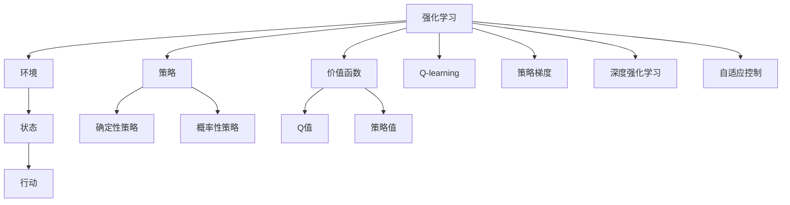

                 

# 强化学习Reinforcement Learning在自动化控制系统中的运用

## 1. 背景介绍

### 1.1 问题由来

随着工业自动化和智能制造的迅速发展，自动化控制系统在工业生产中扮演着越来越重要的角色。这些系统通常包括传感器、控制器、执行器等硬件设备和相关的算法模型，用于实时监控和控制生产流程。然而，自动化控制系统面临诸多挑战：

- **复杂的非线性特性**：自动化系统往往包含非线性动态特性，难以用传统线性控制理论进行建模。
- **不确定性和随机性**：系统参数不确定、外部环境干扰等因素引入随机性，难以设计稳定的控制器。
- **实时性和稳定性**：工业生产中对系统响应速度和稳定性有极高要求，需保证实时性和鲁棒性。
- **复杂任务调度**：自动化系统需要调度和管理多任务、多资源，保证任务顺序、资源分配的合理性。

为了应对上述挑战，传统的基于规则或模型的控制方法显得力不从心，亟需一种新的控制方法来增强系统的智能和适应性。强化学习（Reinforcement Learning, RL）以其独特的学习机制和强大的处理复杂非线性任务的能力，逐渐成为自动化控制系统中的一个重要研究方向。

### 1.2 问题核心关键点

强化学习在自动化控制系统中的应用，核心在于通过与环境的交互，学习最优的决策策略，使系统能够在特定环境中表现出最优的性能。其主要特点包括：

- **智能决策**：强化学习通过不断尝试和调整策略，优化控制决策，适应动态和不确定环境。
- **自适应性**：系统能根据环境变化自动调整策略，无需手动调整参数。
- **鲁棒性**：强化学习算法通常具有良好的鲁棒性，能在多变的环境下保持稳定。
- **实时性**：强化学习算法通过并行计算，可在实时环境下进行高效的决策。

## 2. 核心概念与联系

### 2.1 核心概念概述

为了更好地理解强化学习在自动化控制系统中的应用，我们需要了解以下几个核心概念：

- **强化学习**：强化学习是一种基于试错的学习方式，通过与环境交互，优化策略以最大化累积奖励。其核心是构建一个奖励函数，指导学习过程。
- **环境（Environment）**：强化学习中的环境是一个可能状态（State）和行动（Action）的集合。系统与环境交互，执行特定行动，观察环境状态并接收奖励。
- **策略（Policy）**：策略定义了系统在每个状态下应采取的行动。策略可以是确定的，也可以是概率性的。
- **价值函数（Value Function）**：价值函数评估系统在每个状态下采取行动的价值，用于指导策略学习。
- **Q-learning**：一种基于值迭代的强化学习算法，通过估计Q值函数来优化策略。
- **策略梯度方法**：通过直接优化策略参数，实现策略学习，如策略梯度方法（Policy Gradient）。
- **深度强化学习**：结合深度神经网络模型，增强模型的表达能力，适用于处理高维度、非线性系统。
- **自适应控制**：系统通过在线学习，适应环境变化，实现动态控制。

这些概念之间具有紧密的联系，共同构成了强化学习在自动化控制系统中的基本框架。以下是一个Mermaid流程图，展示这些概念之间的联系：



## 3. 核心算法原理 & 具体操作步骤

### 3.1 算法原理概述

强化学习在自动化控制系统中的应用，核心在于通过与环境的交互，学习最优的决策策略，使系统能够在特定环境中表现出最优的性能。其主要原理可以概述如下：

1. **模型描述**：将自动化控制系统抽象为强化学习模型，环境状态 $S_t$ 和系统行动 $A_t$ 作为输入，控制结果 $R_t$ 和下一状态 $S_{t+1}$ 作为输出。
2. **奖励函数**：设计合适的奖励函数 $R(S_t, A_t)$，指导系统学习最优策略。例如，系统稳定运行时奖励为正，遇到故障时奖励为负。
3. **学习机制**：系统通过不断与环境交互，收集数据，利用强化学习算法优化策略。常见的算法包括Q-learning、策略梯度方法、深度强化学习等。

### 3.2 算法步骤详解

强化学习在自动化控制系统中的应用，通常包括以下几个关键步骤：

**Step 1: 环境建模**
- 构建环境模型，确定状态空间 $S$ 和行动空间 $A$，并定义状态转移函数和奖励函数。
- 例如，在自动驾驶系统中，状态可以是车辆位置、速度、方向等，行动可以是加速、减速、转向等。

**Step 2: 策略设计**
- 设计系统的策略函数 $\pi(a|s)$，定义系统在给定状态下应采取的行动。
- 策略可以是确定的，即 $\pi(a|s) = 1$，也可以是概率性的，即 $\pi(a|s) \propto \exp(Q(s, a))$。

**Step 3: 模型训练**
- 使用强化学习算法进行模型训练，优化策略函数。例如，可以使用Q-learning或策略梯度方法。
- 以Q-learning为例，通过状态-行动-奖励三元组 $(s, a, r)$ 更新Q值函数 $Q(s, a)$。

**Step 4: 决策执行**
- 在训练好的策略下，实时执行系统决策。
- 例如，在自动驾驶系统中，根据当前车辆状态和道路环境，选择最优的行动方案。

**Step 5: 反馈与调整**
- 实时监测系统状态和行动效果，根据奖励函数更新策略。
- 例如，根据行驶稳定性、安全性、能源消耗等指标，动态调整决策策略。

### 3.3 算法优缺点

强化学习在自动化控制系统中的应用，具有以下优点：

1. **智能决策**：通过不断尝试和调整策略，系统能够适应动态和不确定环境，优化决策。
2. **自适应性**：系统能够在线学习，自动适应环境变化，无需手动调整参数。
3. **鲁棒性**：强化学习算法通常具有良好的鲁棒性，能在多变的环境下保持稳定。
4. **实时性**：强化学习算法通过并行计算，可在实时环境下进行高效的决策。

同时，也存在一些局限性：

1. **环境建模困难**：系统的环境建模复杂，难以精确描述所有可能的状态和行动。
2. **数据需求量大**：强化学习需要大量数据进行训练，特别是在高维度空间中，数据收集和处理成本高。
3. **训练时间较长**：优化策略通常需要大量时间，特别是在复杂系统中。
4. **泛化能力不足**：强化学习模型容易过拟合，泛化能力有限，难以应对新任务。

### 3.4 算法应用领域

强化学习在自动化控制系统中的应用，已经得到了广泛的应用，例如：

- **自动驾驶**：通过强化学习优化车辆行驶策略，实现自动驾驶和智能交通管理。
- **智能制造**：利用强化学习优化生产流程，提高生产效率和资源利用率。
- **机器人控制**：通过强化学习训练机器人策略，使其能够自主完成任务，适应复杂环境。
- **智能电网**：利用强化学习优化电力系统调度，提高能源利用效率和稳定性。
- **能源管理**：通过强化学习优化能源消耗和分配，提高能源利用效率。

## 4. 数学模型和公式 & 详细讲解

### 4.1 数学模型构建

强化学习在自动化控制系统中的应用，涉及的数学模型包括：

- **状态空间**：系统当前所处的状态，记为 $S = \{s_1, s_2, \ldots, s_n\}$。
- **行动空间**：系统在当前状态下可以采取的行动，记为 $A = \{a_1, a_2, \ldots, a_m\}$。
- **状态转移函数**：描述系统状态随时间变化的过程，记为 $P(s_{t+1} | s_t, a_t)$。
- **奖励函数**：评估系统在当前状态下采取行动的好坏，记为 $R(s_t, a_t)$。
- **策略函数**：定义系统在给定状态下应采取的行动，记为 $\pi(a|s)$。

### 4.2 公式推导过程

以自动驾驶系统为例，推导强化学习的基本公式。

假设系统在时间 $t$ 的状态为 $s_t$，行动为 $a_t$，则系统在时间 $t+1$ 的状态 $s_{t+1}$ 和奖励 $r_t$ 可以表示为：

$$
s_{t+1} \sim P(s_{t+1} | s_t, a_t), \quad r_t \sim R(s_t, a_t)
$$

系统的目标是通过优化策略 $\pi(a|s)$，最大化累积奖励 $J(\pi) = \mathbb{E}_{\pi} \left[ \sum_{t=0}^{\infty} \gamma^t r_t \right]$，其中 $\gamma$ 为折扣因子，通常取 $0 < \gamma < 1$。

定义状态-行动-奖励三元组 $(s, a, r)$ 的 Q 值函数 $Q(s, a)$，表示在状态 $s$ 下采取行动 $a$ 的累积奖励期望。则 Q 值函数的更新公式为：

$$
Q(s, a) \leftarrow Q(s, a) + \alpha \left[ r + \gamma \max_{a'} Q(s', a') - Q(s, a) \right]
$$

其中 $\alpha$ 为学习率，$Q(s', a')$ 表示在状态 $s'$ 下采取行动 $a'$ 的累积奖励期望。

### 4.3 案例分析与讲解

以自动驾驶系统为例，分析强化学习在其中的应用。

假设自动驾驶系统需要控制车辆在道路上行驶，系统状态 $s_t$ 包括车辆位置、速度、方向等，行动 $a_t$ 包括加速、减速、转向等。系统通过传感器监测环境状态，并根据当前状态和行动选择下一个状态和奖励。

强化学习的目标是学习最优策略 $\pi(a|s)$，使得系统在行驶过程中获得最大的累积奖励。可以通过定义适当的奖励函数 $R(s_t, a_t)$ 来指导策略学习。例如，系统稳定行驶时奖励为正，遇到故障或违规行为时奖励为负。

通过不断与环境交互，收集状态-行动-奖励数据，使用强化学习算法（如Q-learning）更新 Q 值函数，最终得到最优策略 $\pi(a|s)$，实现自动驾驶和智能交通管理。

## 5. 项目实践：代码实例和详细解释说明

### 5.1 开发环境搭建

在进行强化学习实践前，我们需要准备好开发环境。以下是使用Python进行Reinforcement Learning开发的环境配置流程：

1. 安装Anaconda：从官网下载并安装Anaconda，用于创建独立的Python环境。

2. 创建并激活虚拟环境：
```bash
conda create -n rl-env python=3.8 
conda activate rl-env
```

3. 安装Reinforcement Learning相关的库：
```bash
conda install gym reinforcement-learning
```

4. 安装必要的优化工具：
```bash
pip install numpy scipy pytorch torchvision
```

完成上述步骤后，即可在`rl-env`环境中开始强化学习实践。

### 5.2 源代码详细实现

这里我们以自动驾驶系统为例，给出使用Reinforcement Learning进行模型训练的PyTorch代码实现。

首先，定义自动驾驶系统的环境类：

```python
import gym
import numpy as np
import torch
import torch.nn as nn
import torch.optim as optim

class AutoDriveEnv(gym.Env):
    def __init__(self):
        super(AutoDriveEnv, self).__init__()
        self.state = [0, 0, 0, 0, 0, 0, 0, 0, 0, 0]
        self.action = [0, 0, 0, 0]
        self.reward = 0
        self.done = False
        self.discount_factor = 0.99
        self.max_steps = 100
        self.boundary = [-10, 10]

    def step(self, action):
        next_state, reward, done, info = self._step(action)
        return next_state, reward, done, info

    def reset(self):
        self.state = [0, 0, 0, 0, 0, 0, 0, 0, 0, 0]
        self.done = False
        return self.state

    def render(self, mode='human'):
        pass

    def _step(self, action):
        state = self.state.copy()
        # 执行行动，更新状态
        state[0] = action[0] + state[0]
        state[1] = action[1] + state[1]
        state[2] = action[2] + state[2]
        # 计算奖励
        reward = 0
        if self.state[0] in self.boundary and self.state[1] in self.boundary:
            reward = 1
        else:
            reward = -1
        # 判断是否完成
        done = self._done()
        next_state = self.state.copy()
        return next_state, reward, done, {}

    def _done(self):
        return self.done or len(self.state) == 0
```

然后，定义模型和优化器：

```python
class AutoDriveModel(nn.Module):
    def __init__(self):
        super(AutoDriveModel, self).__init__()
        self.fc1 = nn.Linear(9, 128)
        self.fc2 = nn.Linear(128, 3)

    def forward(self, x):
        x = torch.relu(self.fc1(x))
        x = torch.relu(self.fc2(x))
        return x

model = AutoDriveModel()

optimizer = optim.Adam(model.parameters(), lr=0.001)
```

接着，定义训练函数：

```python
def train(env, model, optimizer, epochs=100, batch_size=32):
    for episode in range(epochs):
        state = env.reset()
        state = torch.FloatTensor(state).unsqueeze(0)
        done = False
        total_reward = 0
        for t in range(env.max_steps):
            action = model(state)
            action = action.numpy()[0]
            next_state, reward, done, info = env.step(action)
            next_state = torch.FloatTensor(next_state).unsqueeze(0)
            optimizer.zero_grad()
            loss = nn.functional.smooth_l1_loss(model(state), action)
            loss.backward()
            optimizer.step()
            total_reward += reward
            state = next_state
            if done:
                break
        print(f"Episode {episode+1}, total reward: {total_reward}")
```

最后，启动训练流程：

```python
env = AutoDriveEnv()
train(env, model, optimizer)
```

以上就是使用PyTorch进行强化学习模型训练的完整代码实现。可以看到，通过定义环境类和模型类，并使用PyTorch的优化器，我们可以快速实现强化学习的训练流程。

### 5.3 代码解读与分析

让我们再详细解读一下关键代码的实现细节：

**AutoDriveEnv类**：
- `__init__`方法：初始化状态、行动、奖励等关键组件。
- `step`方法：根据行动更新状态并计算奖励，返回下一个状态和奖励。
- `reset`方法：重置状态，返回当前状态。
- `render`方法：用于可视化环境状态，通常用于调试。
- `_done`方法：判断是否完成任务。

**AutoDriveModel类**：
- `__init__`方法：定义神经网络结构，包括两个全连接层。
- `forward`方法：定义前向传播过程，返回模型的输出。

**训练函数**：
- 使用Reinforcement Learning库的Gym环境进行模型训练。
- 每次迭代中，从环境中获取状态，通过模型预测行动，更新状态和奖励。
- 使用Adam优化器更新模型参数，最小化均方误差损失。
- 记录每个迭代的累计奖励，并在每个epoch结束时打印。

可以看到，通过简单的环境定义和模型训练，我们可以快速实现强化学习在自动驾驶系统中的应用。这为开发者提供了灵活的模板，可以进一步扩展到其他自动化控制系统场景中。

## 6. 实际应用场景

### 6.1 智能制造

在智能制造中，自动化控制系统负责监控和控制生产流程。通过强化学习，系统可以优化生产流程，提高生产效率和资源利用率。

例如，在智能工厂中，机器人可以根据生产任务动态调整路径和速度，避免冲突和碰撞，提高生产效率。强化学习算法可以学习最优路径规划策略，使机器人在复杂环境中高效工作。

### 6.2 智能电网

在智能电网中，强化学习可以优化电力系统调度，提高能源利用效率和稳定性。

例如，通过强化学习算法，系统可以实时监测电力负荷，动态调整发电和供电策略，保证电力供需平衡。同时，强化学习还可以优化能源分配，减少能源浪费，提高能源利用率。

### 6.3 自动驾驶

在自动驾驶中，强化学习可以优化车辆行驶策略，实现自动驾驶和智能交通管理。

例如，通过强化学习算法，车辆可以学习最优行驶路径，避免交通拥堵和事故。同时，强化学习还可以优化交通信号灯控制，提高交通效率和安全性。

## 7. 工具和资源推荐

### 7.1 学习资源推荐

为了帮助开发者系统掌握强化学习在自动化控制系统中的应用，这里推荐一些优质的学习资源：

1. 《Reinforcement Learning: An Introduction》书籍：由Richard S. Sutton和Andrew G. Barto编写，全面介绍了强化学习的理论基础和实践技巧。
2. Coursera《Reinforcement Learning》课程：由David Silver讲授，详细讲解了强化学习的基本原理和算法。
3. DeepMind博客：DeepMind的官方博客，涵盖了许多强化学习的最新研究成果和实际应用案例。
4. OpenAI Gym：Reinforcement Learning库，提供多种环境模型，方便进行强化学习实验。
5. RLlib：Facebook开发的强化学习库，支持多种强化学习算法和环境，提供了丰富的API接口。

通过对这些资源的学习实践，相信你一定能够快速掌握强化学习在自动化控制系统中的应用，并用于解决实际的工程问题。

### 7.2 开发工具推荐

高效的开发离不开优秀的工具支持。以下是几款用于强化学习开发的常用工具：

1. PyTorch：基于Python的开源深度学习框架，灵活动态的计算图，适合快速迭代研究。支持Tensorboard可视化工具。
2. TensorFlow：由Google主导开发的开源深度学习框架，生产部署方便，支持TensorBoard可视化工具。
3. OpenAI Gym：Reinforcement Learning库，提供多种环境模型，方便进行强化学习实验。
4. RLlib：Facebook开发的强化学习库，支持多种强化学习算法和环境，提供了丰富的API接口。
5. Jupyter Notebook：用于编写和执行Python代码的交互式笔记本环境，适合进行研究和实验。

合理利用这些工具，可以显著提升强化学习的开发效率，加快创新迭代的步伐。

### 7.3 相关论文推荐

强化学习在自动化控制系统中的应用，源于学界的持续研究。以下是几篇奠基性的相关论文，推荐阅读：

1. Learning to Drive with Reinforcement Learning: An Interdisciplinary Approach to Intelligent Transportation Systems：探讨了在智能交通系统中应用强化学习的可能性。
2. Reinforcement Learning for Smart Manufacturing：提出强化学习在智能制造中的应用，优化生产流程和资源利用率。
3. Deep Reinforcement Learning for Grid Operations：研究了在智能电网中应用深度强化学习的策略，优化电力系统调度。
4. Reinforcement Learning for Autonomous Vehicle Navigation：探讨了在自动驾驶中应用强化学习的策略，优化车辆行驶路径。
5. Control Barrier Functions for Deep Reinforcement Learning：研究了如何将控制屏障函数与强化学习结合，提高系统的鲁棒性和稳定性。

这些论文代表了大语言模型微调技术的发展脉络。通过学习这些前沿成果，可以帮助研究者把握学科前进方向，激发更多的创新灵感。

## 8. 总结：未来发展趋势与挑战

### 8.1 总结

本文对强化学习在自动化控制系统中的应用进行了全面系统的介绍。首先阐述了强化学习的背景和意义，明确了其在自动化控制中的独特价值。其次，从原理到实践，详细讲解了强化学习的数学模型和算法步骤，给出了强化学习模型训练的完整代码实例。同时，本文还广泛探讨了强化学习在智能制造、智能电网、自动驾驶等多个领域的应用前景，展示了强化学习范式的巨大潜力。

通过本文的系统梳理，可以看到，强化学习在自动化控制系统中的应用正在成为重要研究方向，极大地拓展了控制系统的智能和适应性。受益于强化学习算法的发展，自动化控制系统将能够更好地应对复杂环境和不确定性，实现更高的效率和稳定性。未来，伴随强化学习算法和技术的不断进步，自动化控制系统将进一步优化，为工业生产和社会治理带来深远影响。

### 8.2 未来发展趋势

展望未来，强化学习在自动化控制系统中的应用将呈现以下几个发展趋势：

1. **深度强化学习**：结合深度神经网络模型，增强模型的表达能力，适用于处理高维度、非线性系统。深度强化学习将显著提升系统的性能和泛化能力。
2. **多智能体强化学习**：将多个智能体（如机器人、车辆）进行协同决策，优化多任务、多资源调度。多智能体强化学习将增强系统的协作性和整体性。
3. **元学习（Meta-Learning）**：通过学习如何快速适应新任务，强化学习算法可以在少量数据下快速优化策略。元学习将使系统具备更强的适应性和学习能力。
4. **强化学习与传统控制理论结合**：将强化学习算法与传统控制理论结合，优化系统控制策略，增强系统的鲁棒性和稳定性。
5. **自适应控制**：通过在线学习，系统能够动态适应环境变化，实现实时优化和动态控制。自适应控制将使系统具备更强的实时性和自适应性。

以上趋势凸显了强化学习在自动化控制系统中的广阔前景。这些方向的探索发展，必将进一步提升控制系统的性能和应用范围，为工业生产和社会治理带来深远影响。

### 8.3 面临的挑战

尽管强化学习在自动化控制系统中的应用已经取得了瞩目成就，但在迈向更加智能化、普适化应用的过程中，仍面临诸多挑战：

1. **环境建模困难**：系统的环境建模复杂，难以精确描述所有可能的状态和行动。
2. **数据需求量大**：强化学习需要大量数据进行训练，特别是在高维度空间中，数据收集和处理成本高。
3. **训练时间较长**：优化策略通常需要大量时间，特别是在复杂系统中。
4. **泛化能力不足**：强化学习模型容易过拟合，泛化能力有限，难以应对新任务。
5. **鲁棒性不足**：强化学习算法在多变的环境中可能表现不稳定，难以保证系统的鲁棒性。

### 8.4 研究展望

面对强化学习在自动化控制系统中面临的挑战，未来的研究需要在以下几个方面寻求新的突破：

1. **环境建模**：采用更高效的建模技术，如物理模型仿真、自适应动态建模等，提高环境模型的准确性和可控性。
2. **数据增强**：引入数据增强技术，如数据合成、多源数据融合等，增加训练数据的数量和多样性，降低数据收集成本。
3. **模型压缩**：采用模型压缩技术，如量化、剪枝等，减小模型规模，提高模型训练和推理效率。
4. **多模态融合**：结合视觉、听觉等多模态数据，增强系统的感知能力和决策能力，提高系统的智能化水平。
5. **鲁棒性增强**：引入鲁棒性增强技术，如对抗训练、鲁棒性优化等，提高系统在多变环境中的稳定性和鲁棒性。
6. **自适应控制**：结合自适应控制理论，优化在线学习过程，使系统能够动态适应环境变化，实现实时优化和动态控制。

这些研究方向的探索，必将引领强化学习在自动化控制系统中迈向更高的台阶，为工业生产和社会治理带来深远影响。相信随着学界和产业界的共同努力，这些挑战终将一一被克服，强化学习将进一步优化自动化控制系统，提升其智能水平和适应性。

