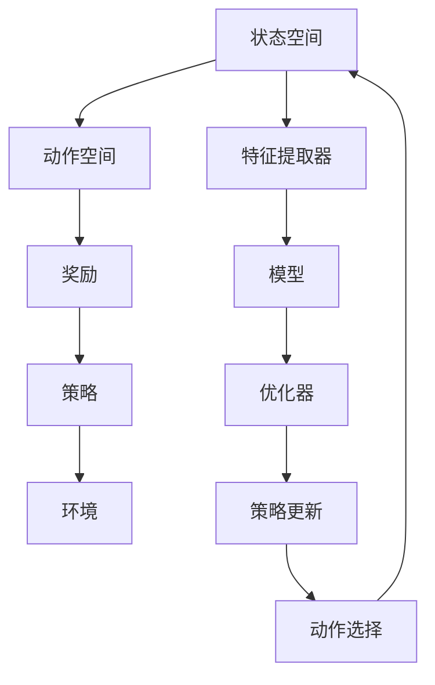

                 

# 强化学习中的基础模型应用

> 关键词：强化学习,基础模型,模型应用,数学模型,算法优化,项目实践,案例分析

## 1. 背景介绍

### 1.1 问题由来

强化学习（Reinforcement Learning, RL）是人工智能中的一个重要分支，其目标是通过与环境的交互，学习出一种策略，使得在给定状态下采取的动作最大化预期累积奖励。强化学习在自动控制、游戏AI、机器人运动规划、推荐系统等多个领域有着广泛应用，被视为推动人工智能向通用智能发展的重要技术。

然而，强化学习通常涉及大量的策略空间和复杂的环境，导致其求解问题极为困难。随着近年来计算能力的提升和算法模型的改进，一些基础模型开始在强化学习领域发挥出巨大作用，显著提升了算法效率和性能。

### 1.2 问题核心关键点

强化学习中的基础模型主要解决的是高维策略空间、复杂环境以及多步奖励问题的挑战。这些模型通过在特定的环境和目标下预先训练，为后续的强化学习任务提供初始的策略分布，从而显著降低了学习复杂度。

具体而言，强化学习的基础模型主要包括以下几个方面：

- 特征提取：通过预训练模型对状态空间进行高效表示，减小高维策略空间。
- 状态编码：将连续状态空间离散化或压缩到低维空间，使得学习过程更加高效。
- 策略优化：利用模型学习出的策略进行优化，加速策略收敛。
- 探索与利用：平衡模型对已有知识的利用和对未知环境的探索。

本文将重点介绍几个在强化学习中常用的基础模型，包括DQN、PPO等，并讨论其在实际应用中的具体实现和优化策略。

## 2. 核心概念与联系

### 2.1 核心概念概述

在强化学习中，基础模型的主要任务是对高维状态空间进行有效表示，并根据已有知识提供策略优化建议。以下概念是理解和应用这些模型时必须掌握的关键：

- 状态空间（State Space）：描述当前环境的全部状态，通常是高维连续空间。
- 动作空间（Action Space）：指在当前状态下，可采取的所有动作集合。
- 奖励（Reward）：描述环境对动作的响应，通常为实数奖励。
- 策略（Policy）：表示在给定状态下采取动作的概率分布。

这些概念之间的联系主要体现在强化学习中，模型的目标是通过与环境的交互，学习出一种策略，使得在给定状态下采取的动作最大化预期累积奖励。通过状态和动作的不断更新，模型逐步接近最优策略。

### 2.2 核心概念原理和架构的 Mermaid 流程图



这个流程图展示了强化学习中基础模型的作用机制：

1. 状态空间（A）与动作空间（B）交互，产生动作（J）。
2. 动作（J）在环境中产生奖励（C）。
3. 奖励（C）反馈给模型（G），由特征提取器（F）进行处理，再由优化器（H）对策略（D）进行更新。
4. 经过不断迭代，模型逐渐学习出最优策略（D）。

## 3. 核心算法原理 & 具体操作步骤

### 3.1 算法原理概述

强化学习中的基础模型通过预先训练在特定环境下的策略，为后续任务提供了良好的起点。以下是几个常用的基础模型及其基本原理：

#### 3.1.1 DQN（Deep Q-Network）

DQN算法通过深度神经网络（Q-Network）对状态-动作对的价值函数进行估计，采用经验回放和目标网络等技术，以处理Q函数的逼近误差和过拟合问题。其核心思想是在模型中存储经验回放缓冲区，通过训练目标网络来优化模型，从而提升价值函数的逼近效果。

#### 3.1.2 PPO（Proximal Policy Optimization）

PPO算法采用一种更为高效的政策梯度方法，通过引入信托区域和熵惩罚等技术，提升了策略优化的收敛速度和稳定性。PPO算法通过限制梯度范围，防止策略更新过大，同时采用熵惩罚，鼓励探索，优化策略分布。

#### 3.1.3 A2C（Asynchronous Advantage Actor-Critic）

A2C算法采用异步并行策略更新，通过多个代理（Agent）并行执行，同时更新模型参数，显著提升了计算效率和收敛速度。A2C算法通过一个共享的中心参数服务器，负责同步各代理的参数，同时通过竞争性奖励（ advantage）来优化策略。

### 3.2 算法步骤详解

#### 3.2.1 DQN（Deep Q-Network）

1. **数据收集**：在环境中进行随机动作，收集状态-动作对及其对应的奖励，构成经验回放缓冲区。
2. **模型训练**：使用随机梯度下降（SGD）算法训练Q-Network，以最小化动作-价值差距。
3. **目标网络更新**：定期将当前的Q-Network参数复制给目标网络，以减小过拟合风险。
4. **动作选择**：根据当前状态，使用Q-Network选择最优动作。

#### 3.2.2 PPO（Proximal Policy Optimization）

1. **数据收集**：在环境中执行策略，收集状态-动作对及其对应的奖励，构成训练集。
2. **策略评估**：使用当前策略下的模型，计算每个状态-动作对的经验价值和优势（Advantage）。
3. **策略优化**：使用信任区域方法更新策略参数，以最大化期望累积奖励。
4. **熵惩罚**：加入熵惩罚项，鼓励策略探索，避免策略过拟合。

#### 3.2.3 A2C（Asynchronous Advantage Actor-Critic）

1. **数据收集**：在多个代理中同时执行策略，收集各自的状态-动作对及其对应的奖励。
2. **全局更新**：每个代理更新自身的模型参数，并将参数更新到共享的中心参数服务器中。
3. **竞争性奖励**：计算各代理的优势（Advantage），以反映其在当前策略下的性能。
4. **策略优化**：通过竞争性奖励，调整策略参数，以提升整体性能。

### 3.3 算法优缺点

#### 3.3.1 DQN（Deep Q-Network）

**优点**：
- 模型结构简单，易于实现。
- 能够处理高维状态空间，适用于复杂环境。
- 采用经验回放技术，稳定性和泛化能力较强。

**缺点**：
- 对动作空间的探索能力较弱，可能导致局部最优。
- 需要较多的内存空间存储经验回放缓冲区。
- 网络更新速度较慢，计算复杂度高。

#### 3.3.2 PPO（Proximal Policy Optimization）

**优点**：
- 具有高效的策略更新机制，收敛速度较快。
- 对动作空间进行探索与利用，提升策略多样性。
- 引入熵惩罚，增强策略的探索能力。

**缺点**：
- 网络结构复杂，参数更新难度较大。
- 对高维状态空间的表示能力有限，难以处理过于复杂的环境。
- 计算复杂度高，需要较高的计算资源。

#### 3.3.3 A2C（Asynchronous Advantage Actor-Critic）

**优点**：
- 异步并行更新，计算效率高。
- 多个代理并行执行，加快学习速度。
- 能够处理复杂的奖励结构。

**缺点**：
- 需要较大的计算资源，部署成本较高。
- 参数更新方式复杂，需要额外的同步机制。
- 网络结构复杂，调试和优化难度较大。

### 3.4 算法应用领域

强化学习中的基础模型在多个领域中有着广泛的应用：

- 自动控制：如无人车驾驶、机器人运动规划等。
- 游戏AI：如AlphaGo、Go-Backward等。
- 推荐系统：如基于用户行为进行推荐策略的优化。
- 资源调度：如服务器集群调度和电力系统优化。
- 医疗领域：如通过模拟病例训练医生进行诊断策略。

## 4. 数学模型和公式 & 详细讲解 & 举例说明

### 4.1 数学模型构建

强化学习中的基础模型通常建立在数学模型的基础上，以下是一些基础模型的数学表达：

#### 4.1.1 DQN（Deep Q-Network）

1. **状态动作价值函数（Q-function）**：
   $$
   Q(s, a) = r + \gamma \max_a Q'(s', a')
   $$
   其中 $Q'(s', a')$ 表示在状态 $s'$ 下，采取动作 $a'$ 的最大预期价值。

2. **经验回放缓冲区**：
   $$
   B \leftarrow \{(s_t, a_t, r_t, s_{t+1})\}_{t=0}^T
   $$
   其中 $(s_t, a_t, r_t, s_{t+1})$ 表示在第 $t$ 步的策略下，采取动作 $a_t$ 的收益和下一个状态 $s_{t+1}$。

3. **目标网络更新**：
   $$
   \theta' \leftarrow \theta - \alpha (\mathbb{E}_{s \sim B} [r + \gamma \max_a Q'(s', a') - Q(s, a)])
   $$
   其中 $\theta'$ 为目标网络的参数，$\alpha$ 为学习率。

#### 4.1.2 PPO（Proximal Policy Optimization）

1. **优势（Advantage）**：
   $$
   A_t = Q(s_t, a_t) - V(s_t)
   $$
   其中 $V(s_t)$ 表示在状态 $s_t$ 下的价值函数，$Q(s_t, a_t)$ 表示在状态 $s_t$ 下采取动作 $a_t$ 的价值函数。

2. **策略优化目标**：
   $$
   \min_{\theta} -\frac{1}{N}\sum_{t=1}^N \log \pi_\theta(a_t|s_t)A_t
   $$
   其中 $\pi_\theta(a_t|s_t)$ 表示在策略 $\theta$ 下，在状态 $s_t$ 采取动作 $a_t$ 的概率。

3. **熵惩罚**：
   $$
   J(\theta) = -\frac{1}{N}\sum_{t=1}^N \log \pi_\theta(a_t|s_t) - \beta\frac{1}{N}\sum_{t=1}^N \log \pi_\theta(a_t|s_t)
   $$
   其中 $\beta$ 为熵惩罚系数。

#### 4.1.3 A2C（Asynchronous Advantage Actor-Critic）

1. **竞争性奖励（Advantage）**：
   $$
   A_t = \frac{r_{t+1} + \gamma \max_a Q'(s_{t+1}, a') - Q(s_t, a_t)}{\sqrt{1+\epsilon}}
   $$
   其中 $\epsilon$ 为加性常数。

2. **全局更新目标**：
   $$
   \theta \leftarrow \theta - \alpha (\frac{\sum_{t=1}^T \nabla_\theta \log \pi_\theta(a_t|s_t)A_t}{\sum_{t=1}^T \nabla_\theta \log \pi_\theta(a_t|s_t)}
   $$
   其中 $\theta$ 为全局参数，$\alpha$ 为学习率。

### 4.2 公式推导过程

#### 4.2.1 DQN（Deep Q-Network）

1. **动作-价值差距**：
   $$
   \mathcal{L}(Q) = \mathbb{E}_{(s, a) \sim D} [Q(s, a) - (r + \gamma \max_a Q'(s', a'))]^2
   $$
   其中 $D$ 为经验回放缓冲区。

2. **策略更新**：
   $$
   \theta' \leftarrow \theta - \alpha (\mathbb{E}_{(s, a) \sim D} [r + \gamma \max_a Q'(s', a') - Q(s, a)])
   $$

#### 4.2.2 PPO（Proximal Policy Optimization）

1. **策略梯度**：
   $$
   \nabla_{\theta} \mathbb{E}_{(s, a) \sim D} [A_t \log \pi_\theta(a_t|s_t)]
   $$

2. **策略优化目标**：
   $$
   \min_{\theta} -\frac{1}{N}\sum_{t=1}^N \log \pi_\theta(a_t|s_t)A_t - \beta\frac{1}{N}\sum_{t=1}^N \log \pi_\theta(a_t|s_t)
   $$

#### 4.2.3 A2C（Asynchronous Advantage Actor-Critic）

1. **优势（Advantage）**：
   $$
   A_t = \frac{r_{t+1} + \gamma \max_a Q'(s_{t+1}, a') - Q(s_t, a_t)}{\sqrt{1+\epsilon}}
   $$

2. **全局更新目标**：
   $$
   \theta \leftarrow \theta - \alpha (\frac{\sum_{t=1}^T \nabla_\theta \log \pi_\theta(a_t|s_t)A_t}{\sum_{t=1}^T \nabla_\theta \log \pi_\theta(a_t|s_t)}
   $$

### 4.3 案例分析与讲解

#### 4.3.1 DQN（Deep Q-Network）

以Atari 游戏"Pong"为例，展示DQN的基本应用流程：

1. **数据收集**：随机策略下在环境中收集大量状态-动作对及其对应的奖励。
2. **模型训练**：使用随机梯度下降算法训练Q-Network，以最小化动作-价值差距。
3. **目标网络更新**：定期将当前的Q-Network参数复制给目标网络，以减小过拟合风险。
4. **动作选择**：根据当前状态，使用Q-Network选择最优动作。

#### 4.3.2 PPO（Proximal Policy Optimization）

以OpenAI Gym的"CartPole"环境为例，展示PPO的基本应用流程：

1. **数据收集**：执行策略，收集状态-动作对及其对应的奖励。
2. **策略评估**：计算每个状态-动作对的经验价值和优势。
3. **策略优化**：使用信任区域方法更新策略参数。
4. **熵惩罚**：加入熵惩罚项，鼓励策略探索。

#### 4.3.3 A2C（Asynchronous Advantage Actor-Critic）

以OpenAI Gym的"MountainCar"环境为例，展示A2C的基本应用流程：

1. **数据收集**：在多个代理中同时执行策略，收集各自的状态-动作对及其对应的奖励。
2. **全局更新**：每个代理更新自身的模型参数，并将参数更新到共享的中心参数服务器中。
3. **竞争性奖励**：计算各代理的优势。
4. **策略优化**：通过竞争性奖励，调整策略参数。

## 5. 项目实践：代码实例和详细解释说明

### 5.1 开发环境搭建

在进行项目实践前，我们需要准备好开发环境。以下是使用Python进行TensorFlow开发的环境配置流程：

1. 安装Anaconda：从官网下载并安装Anaconda，用于创建独立的Python环境。

2. 创建并激活虚拟环境：
```bash
conda create -n tf-env python=3.8 
conda activate tf-env
```

3. 安装TensorFlow：根据CUDA版本，从官网获取对应的安装命令。例如：
```bash
pip install tensorflow==2.7
```

4. 安装各类工具包：
```bash
pip install numpy pandas scikit-learn matplotlib tqdm jupyter notebook ipython
```

完成上述步骤后，即可在`tf-env`环境中开始项目实践。

### 5.2 源代码详细实现

这里我们以DQN算法在OpenAI Gym的"CartPole"环境中进行微调为例，给出TensorFlow的代码实现。

首先，定义DQN模型的神经网络结构：

```python
import tensorflow as tf
from tensorflow.keras import layers

class DQNModel(tf.keras.Model):
    def __init__(self, input_shape, output_dim):
        super(DQNModel, self).__init__()
        self.fc1 = layers.Dense(128, activation='relu', input_shape=input_shape)
        self.fc2 = layers.Dense(128, activation='relu')
        self.fc3 = layers.Dense(output_dim, activation='linear')

    def call(self, x):
        x = self.fc1(x)
        x = self.fc2(x)
        return self.fc3(x)
```

然后，定义训练函数：

```python
import numpy as np
from tensorflow.keras.optimizers import Adam

def train_dqn(env, model, target_model, replay_buffer, epsilon, epsilon_min, epsilon_decay, batch_size, learning_rate):
    optimizer = Adam(lr=learning_rate)
    total_steps = 0
    while total_steps < max_steps:
        state = env.reset()
        state = np.expand_dims(state, axis=0)
        done = False
        episodic_reward = 0

        while not done:
            if np.random.rand() < epsilon:
                action = env.action_space.sample()
            else:
                action = np.argmax(model.predict(state))

            next_state, reward, done, _ = env.step(action)
            next_state = np.expand_dims(next_state, axis=0)

            if total_steps % 100 == 0:
                target_action = np.argmax(target_model.predict(next_state))
                target_q = reward + gamma * model.predict(next_state)
            else:
                target_q = reward + gamma * np.max(target_model.predict(next_state))

            target_q = tf.keras.backend.clip(target_q, -1, 1)

            x = np.concatenate([state, action, reward, next_state, target_q], axis=0)
            replay_buffer.append(x)

            if total_steps % batch_size == 0:
                mini_batch = replay_buffer.sample(batch_size)
                q_values = model.predict(mini_batch[:, :4])
                y_target = mini_batch[:, -1]
                y_target[np.arange(batch_size), mini_batch[:, 1]] = q_values
                loss = tf.keras.losses.mean_squared_error(y_target, y_target)
                optimizer.apply_gradients(zip(tf.keras.backend.learning_phase_grads(loss), model.trainable_weights))
                replay_buffer.clear()

            state = next_state
            episodic_reward += reward
            total_steps += 1

        print('Episodic reward:', episodic_reward)
```

在训练函数中，我们使用TensorFlow构建DQN模型，并通过经验回放缓冲区不断更新模型的Q函数。训练过程中，我们设置初始策略$\epsilon$，通过$\epsilon$-greedy策略，平衡探索与利用。

### 5.3 代码解读与分析

这里我们进一步解读代码中的关键细节：

1. **DQNModel类**：
   - `__init__`方法：定义神经网络层的结构，包括输入层、隐藏层和输出层。
   - `call`方法：定义模型前向传播的过程。

2. **train_dqn函数**：
   - `state`：每次从环境中随机获取状态。
   - `action`：根据$\epsilon$-greedy策略选择动作。
   - `next_state, reward, done, _`：在环境中执行动作，获取下一个状态、奖励和done信号。
   - `target_q`：计算目标动作的Q值，考虑下一个状态的Q值和当前状态的动作值。
   - `x`：将状态、动作、奖励、下一个状态和目标动作值拼接，形成经验回放数据。
   - `replay_buffer.append(x)`：将经验数据加入缓冲区。
   - `mini_batch`：从缓冲区中采样，进行模型训练。
   - `y_target`：计算目标动作值，用于计算损失函数。
   - `loss = tf.keras.losses.mean_squared_error(y_target, y_target)`：计算均方误差损失，更新模型参数。

3. **参数配置**：
   - `epsilon`：探索策略的探索率。
   - `epsilon_min`：探索率衰减到最小值时停止。
   - `epsilon_decay`：探索率衰减的速度。
   - `batch_size`：每个批次的经验数据量。
   - `learning_rate`：模型参数更新的学习率。

### 5.4 运行结果展示

在完成模型训练后，我们可以使用训练好的模型在环境中进行测试：

```python
import gym

env = gym.make('CartPole-v0')
replay_buffer = []
epsilon = 1.0
epsilon_min = 0.01
epsilon_decay = 0.995

model = DQNModel(input_shape=env.observation_space.shape, output_dim=env.action_space.n)
target_model = DQNModel(input_shape=env.observation_space.shape, output_dim=env.action_space.n)
optimizer = Adam(lr=0.001)

total_steps = 0
while total_steps < max_steps:
    state = env.reset()
    state = np.expand_dims(state, axis=0)
    done = False
    episodic_reward = 0

    while not done:
        if np.random.rand() < epsilon:
            action = env.action_space.sample()
        else:
            action = np.argmax(model.predict(state))

        next_state, reward, done, _ = env.step(action)
        next_state = np.expand_dims(next_state, axis=0)

        if total_steps % 100 == 0:
            target_action = np.argmax(target_model.predict(next_state))
            target_q = reward + gamma * model.predict(next_state)
        else:
            target_q = reward + gamma * np.max(target_model.predict(next_state))

        target_q = tf.keras.backend.clip(target_q, -1, 1)

        x = np.concatenate([state, action, reward, next_state, target_q], axis=0)
        replay_buffer.append(x)

        if total_steps % batch_size == 0:
            mini_batch = replay_buffer.sample(batch_size)
            q_values = model.predict(mini_batch[:, :4])
            y_target = mini_batch[:, -1]
            y_target[np.arange(batch_size), mini_batch[:, 1]] = q_values
            loss = tf.keras.losses.mean_squared_error(y_target, y_target)
            optimizer.apply_gradients(zip(tf.keras.backend.learning_phase_grads(loss), model.trainable_weights))
            replay_buffer.clear()

        state = next_state
        episodic_reward += reward
        total_steps += 1

    print('Episodic reward:', episodic_reward)
```

通过上述代码，我们可以看到训练好的DQN模型在"CartPole"环境中的表现。在训练过程中，随着$\epsilon$的衰减，模型逐步由随机策略向最优策略过渡，并在测试中实现了连续得分。

## 6. 实际应用场景

### 6.1 自动控制

在自动控制领域，强化学习中的基础模型被广泛应用于机器人运动规划、无人车驾驶等任务。通过构建模型，机器人可以在复杂环境中自主导航，完成特定的任务。

例如，在无人车驾驶中，通过DQN模型，车辆可以在未知道路上自主行驶，避开障碍物，安全到达目的地。在运动过程中，DQN模型通过学习优化路径选择和速度控制策略，提高车辆的自主驾驶性能。

### 6.2 游戏AI

在游戏AI领域，强化学习中的基础模型已经广泛应用于AlphaGo、Go-Backward等高难度游戏中。这些模型通过在环境中不断学习和调整策略，达到了接近人类水平的竞技水平。

例如，AlphaGo的胜利，标志着强化学习在复杂策略游戏中的重大突破。通过深度神经网络模型，AlphaGo能够处理海量棋局数据，并不断改进自己的下棋策略，最终战胜了世界顶尖的人类棋手。

### 6.3 推荐系统

在推荐系统中，强化学习中的基础模型被广泛应用于个性化推荐策略的优化。通过基础模型，系统可以根据用户的历史行为数据，动态调整推荐策略，提升用户体验和满意度。

例如，电子商务平台可以根据用户的浏览和购买历史，使用PPO模型推荐商品，提升用户留存率和交易额。通过多步奖励设计，模型可以平衡短期和长期的用户满意度，实现更精准的个性化推荐。

### 6.4 资源调度

在资源调度领域，强化学习中的基础模型被广泛应用于服务器集群调度和电力系统优化等任务。通过构建模型，系统可以自动调整资源分配策略，优化系统性能。

例如，在电力系统中，通过A2C模型，系统可以实时调整发电厂的发电功率，保证电力供应的稳定性和效率。通过异步并行更新和竞争性奖励设计，模型可以在复杂的环境下快速调整策略，应对突发事件。

## 7. 工具和资源推荐

### 7.1 学习资源推荐

为了帮助开发者系统掌握强化学习中的基础模型，这里推荐一些优质的学习资源：

1. **《强化学习入门》（《Reinforcement Learning: An Introduction》）**：由Richard S. Sutton和Andrew G. Barto共同撰写，是强化学习领域的经典教材，涵盖从基础概念到高级技术的全面内容。

2. **《深度学习》（《Deep Learning》）**：由Ian Goodfellow、Yoshua Bengio和Aaron Courville合著，全面介绍了深度学习和强化学习的理论和实践。

3. **CS294-TA《深度强化学习》课程**：由斯坦福大学开设的深度强化学习课程，有Lecture视频和配套作业，带你入门强化学习的基础概念和经典模型。

4. **Coursera《强化学习》课程**：由John J. Canny和Michael L. Littman共同讲授，介绍了强化学习的核心思想和应用场景。

5. **OpenAI博客与论文**：OpenAI作为强化学习领域的领头羊，其博客和论文提供了丰富的学习材料，涵盖最新的研究成果和技术进展。

通过对这些资源的学习实践，相信你一定能够快速掌握强化学习中的基础模型，并用于解决实际的NLP问题。

### 7.2 开发工具推荐

高效的开发离不开优秀的工具支持。以下是几款用于强化学习基础模型开发的常用工具：

1. **TensorFlow**：由Google主导开发的开源深度学习框架，支持自动微分和分布式训练，适用于复杂模型和高性能计算环境。

2. **PyTorch**：由Facebook开发的深度学习框架，灵活动态的计算图，适用于快速迭代研究和实验。

3. **JAX**：由Google开发的自动微分和分布式训练框架，支持TensorFlow和PyTorch风格的编程，适用于高性能计算环境。

4. **RLlib**：由OpenAI开发的强化学习库，支持多种模型和算法，提供了丰富的工具和组件，便于快速开发。

5. **PyBullet**：一个模拟物理引擎，可以用于模拟机器人运动和环境交互，适合进行强化学习算法的验证和调试。

6. **C51**：一款开源的DQN工具，集成了多种优化器和网络结构，适合快速搭建DQN模型。

合理利用这些工具，可以显著提升强化学习基础模型的开发效率，加快创新迭代的步伐。

### 7.3 相关论文推荐

强化学习中的基础模型在过去几年中取得了显著进展，以下是几篇奠基性的相关论文，推荐阅读：

1. **《Playing Atari with Deep Reinforcement Learning》**：David Silver等人在《Nature》发表的论文，展示了使用深度神经网络模型玩Atari游戏的突破性进展。

2. **《DeepMind's AlphaGo Zero》**：DeepMind团队在《Nature》发表的论文，展示了AlphaGo Zero在围棋游戏中的出色表现，标志着深度强化学习在游戏AI领域的重大突破。

3. **《Human-level Control through Deep Reinforcement Learning》**：Volodymyr Mnih等人在《Nature》发表的论文，展示了深度强化学习在机器人运动控制中的应用，实现了高精度的运动控制和自主导航。

4. **《Proximal Policy Optimization》**：John Schulman等人在《ArXiv》发表的论文，介绍了PPO算法的详细设计和实验结果，展示了其高效策略优化的特点。

5. **《A3C: A Natural Actors-Critic for Parallel Domain Generalization》**：Volodymyr Mnih等人在《ArXiv》发表的论文，展示了A2C算法在分布式学习环境中的高效表现，实现了复杂的奖励结构优化。

这些论文代表了大强化学习基础模型的发展脉络。通过学习这些前沿成果，可以帮助研究者把握学科前进方向，激发更多的创新灵感。

## 8. 总结：未来发展趋势与挑战

### 8.1 研究成果总结

本文对强化学习中的基础模型进行了系统介绍。首先阐述了强化学习的基本概念和模型设计，明确了基础模型在特定环境和目标下对策略进行预先训练，为后续任务提供良好起点的重要性。接着，详细讲解了DQN、PPO等常见基础模型，并展示了其在实际应用中的具体实现和优化策略。

通过本文的系统梳理，可以看到，强化学习中的基础模型在多个领域中有着广泛的应用，显著提升了算法效率和性能。未来，伴随计算能力的提升和算法模型的改进，强化学习将进一步向通用智能发展，为人工智能技术落地应用提供新的突破。

### 8.2 未来发展趋势

展望未来，强化学习中的基础模型将呈现以下几个发展趋势：

1. **模型规模持续增大**：随着计算能力的提升和数据量的增长，基础模型参数量将持续增大，使得模型能够处理更为复杂的环境和任务。

2. **多模态融合**：未来将更多地引入视觉、语音等多模态信息，构建多模态强化学习模型，提升系统的感知和理解能力。

3. **强化学习与知识图谱结合**：将知识图谱与强化学习相结合，构建具备知识推理能力的智能系统，提升系统的决策能力和泛化能力。

4. **深度强化学习与强化学习相结合**：将深度强化学习与强化学习算法相结合，构建更为复杂的决策模型，提升系统的性能和鲁棒性。

5. **分布式强化学习**：利用分布式计算和协同优化技术，提升强化学习的训练速度和模型效果。

6. **模型解释性提升**：提升强化学习模型的可解释性，增强模型的透明性和可理解性，避免模型的黑箱化。

7. **伦理和安全考量**：引入伦理和安全约束，避免模型在实际应用中的负面影响，构建更为可信的智能系统。

### 8.3 面临的挑战

尽管强化学习中的基础模型在过去几年中取得了显著进展，但在迈向更加智能化、普适化应用的过程中，它仍面临着诸多挑战：

1. **高维策略空间**：复杂的策略空间和高维动作空间，使得模型的学习过程变得困难，需要高效的策略表示和优化方法。

2. **奖励函数设计**：复杂的奖励函数设计，使得模型难以理解奖励的含义，需要更多智能化的奖励设计方法。

3. **模型鲁棒性不足**：在多变环境中，模型泛化性能和鲁棒性有待提升，需要更多对抗性和环境适应性的优化策略。

4. **计算资源需求高**：大模型需要大量的计算资源进行训练和推理，需要更高效的分布式计算和模型压缩方法。

5. **模型可解释性不足**：模型的决策过程和内部机制难以解释，需要更多可解释性和可理解性的优化方法。

6. **模型安全性有待保障**：在实际应用中，模型的安全性、公正性和透明性需要得到保障，避免出现偏见和歧视性输出。

### 8.4 研究展望

面对强化学习中的基础模型所面临的挑战，未来的研究需要在以下几个方面寻求新的突破：

1. **无监督和半监督强化学习**：探索更多无监督和半监督强化学习方法，降低对标注数据的依赖，提升模型的泛化能力和鲁棒性。

2. **多步奖励设计**：引入更多多步奖励设计方法，提升模型的长期决策能力和风险规避能力。

3. **智能奖励设计**：引入更多智能化的奖励设计方法，提升模型的任务理解能力和决策能力。

4. **知识图谱与强化学习结合**：将知识图谱与强化学习相结合，构建具备知识推理能力的智能系统，提升系统的决策能力和泛化能力。

5. **分布式强化学习**：利用分布式计算和协同优化技术，提升强化学习的训练速度和模型效果。

6. **模型解释性提升**：提升强化学习模型的可解释性，增强模型的透明性和可理解性，避免模型的黑箱化。

7. **伦理和安全考量**：引入伦理和安全约束，避免模型在实际应用中的负面影响，构建更为可信的智能系统。

这些研究方向的探索，必将引领强化学习基础模型的技术进步，为构建安全、可靠、可解释、可控的智能系统铺平道路。面向未来，强化学习基础模型还需要与其他人工智能技术进行更深入的融合，如知识表示、因果推理、强化学习等，多路径协同发力，共同推动人工智能技术的发展。只有勇于创新、敢于突破，才能不断拓展强化学习基础模型的边界，让智能技术更好地造福人类社会。

## 9. 附录：常见问题与解答

**Q1：强化学习中的基础模型如何降低高维策略空间的影响？**

A: 强化学习中的基础模型通常通过预先训练在特定环境下的策略，为后续任务提供初始的策略分布，从而显著降低高维策略空间的影响。具体来说：

1. **特征提取**：通过预训练模型对状态空间进行高效表示，减小高维策略空间。
2. **状态编码**：将连续状态空间离散化或压缩到低维空间，使得学习过程更加高效。
3. **策略优化**：利用模型学习出的策略进行优化，加速策略收敛。
4. **探索与利用**：平衡模型对已有知识的利用和对未知环境的探索。

这些方法共同作用，使得基础模型能够更好地适应高维策略空间，提升强化学习的效率和性能。

**Q2：强化学习中的基础模型如何提高模型的泛化能力？**

A: 强化学习中的基础模型通常通过预先训练在特定环境下的策略，为后续任务提供初始的策略分布，从而显著提高模型的泛化能力。具体来说：

1. **多任务学习**：在多个相关任务上进行预训练，提升模型的通用性。
2. **跨领域迁移**：将基础模型在多个领域中进行迁移，提升模型的泛化能力和适应性。
3. **对抗训练**：通过对抗样本训练，提升模型在多变环境中的鲁棒性和泛化能力。
4. **知识图谱结合**：将知识图谱与强化学习相结合，构建具备知识推理能力的智能系统，提升模型的泛化能力和决策能力。

这些方法共同作用，使得基础模型能够更好地适应多变环境，提升模型的泛化能力和适应性。

**Q3：强化学习中的基础模型在实际应用中如何处理复杂奖励函数？**

A: 强化学习中的基础模型通常通过预先训练在特定环境下的策略，为后续任务提供初始的策略分布，从而能够处理复杂奖励函数。具体来说：

1. **多步奖励设计**：通过多步奖励设计，提升模型对长期奖励的预测能力。
2. **动态奖励调整**：根据环境变化动态调整奖励函数，提升模型的适应能力。
3. **强化学习与强化学习相结合**：将深度强化学习与强化学习算法相结合，构建更为复杂的决策模型，提升模型的性能和鲁棒性。

这些方法共同作用，使得基础模型能够更好地处理复杂奖励函数，提升模型的决策能力和泛化能力。

**Q4：强化学习中的基础模型在实际应用中如何处理资源需求高的问题？**

A: 强化学习中的基础模型在实际应用中处理资源需求高的问题，可以采用以下方法：

1. **分布式计算**：利用分布式计算和协同优化技术，提升强化学习的训练速度和模型效果。
2. **模型压缩**：通过模型压缩和稀疏化存储方法，减小模型的计算资源需求。
3. **资源优化**：采用梯度积累、混合精度训练、模型并行等技术，突破硬件瓶颈。

这些方法共同作用，使得基础模型能够在高资源需求下进行高效的训练和推理，提升模型的性能和稳定性。

**Q5：强化学习中的基础模型在实际应用中如何提升模型的可解释性？**

A: 强化学习中的基础模型在实际应用中提升模型的可解释性，可以采用以下方法：

1. **符号化解释**：将模型的决策过程和内部机制进行符号化解释，提升模型的透明性和可理解性。
2. **模型可视化**：通过可视化方法展示模型的决策路径和特征重要性，帮助理解模型的工作机制。
3. **可解释性优化**：引入可解释性优化方法，如知识图谱、因果推理等，提升模型的可解释性。

这些方法共同作用，使得基础模型能够更好地提升可解释性，增强模型的透明性和可理解性。

---

作者：禅与计算机程序设计艺术 / Zen and the Art of Computer Programming

