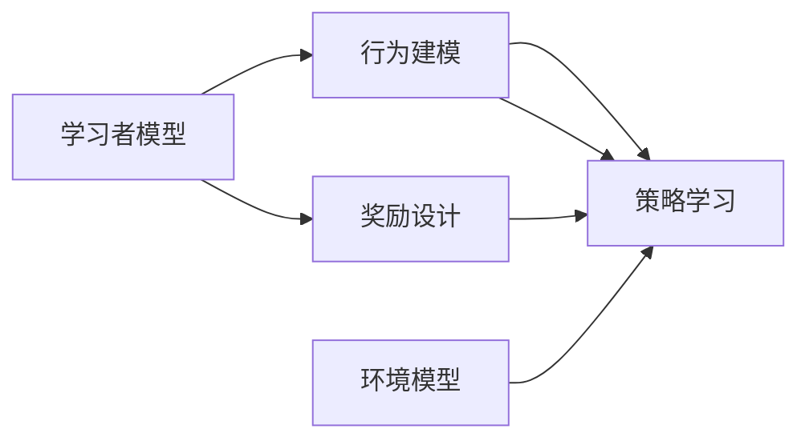

                 

# 强化学习：在教育领域中的应用

## 1. 背景介绍

### 1.1 问题由来

教育领域一直以来都是人工智能（AI）应用的重要方向之一。从个性化学习推荐、智能作业批改，到虚拟教室和在线辅导，AI在教育中的应用正逐步改变传统的教学模式，提升教育质量与效率。然而，传统的基于规则和知识图谱的方法往往难以捕捉学习者的动态行为和复杂认知过程，而强化学习（Reinforcement Learning, RL）提供了一种全新的方式，能够更自然地处理动态复杂环境。

### 1.2 问题核心关键点

强化学习在教育领域的应用主要集中在个性化学习和自适应学习系统上。该技术通过对学习者行为和反馈进行建模，利用奖励机制和探索机制，动态调整教学策略和内容，提升学习效果和学生满意度。其核心关键点包括：

- **行为建模**：通过观察和记录学习者的行为（如点击、阅读时间、完成情况等），建立学习者行为模型。
- **奖励设计**：设计合适的奖励机制，鼓励积极的学习行为，抑制消极行为，引导学习者朝目标方向努力。
- **策略学习**：通过不断尝试和调整，学习最优的教学策略，使学习者能够高效地掌握知识。
- **自适应性**：根据学习者的实时反馈和行为，动态调整教学内容和难度，提升学习效果。

### 1.3 问题研究意义

强化学习在教育领域的应用，旨在构建智能自适应学习系统，使每个学习者都能得到最适合自己的学习路径和策略。这种定制化教育模式能够显著提高学习效果，促进教育公平，减少资源浪费。强化学习技术在教育中的应用将加速教育数字化转型，为未来教育的发展提供新的可能。

## 2. 核心概念与联系

### 2.1 核心概念概述

在教育领域，强化学习的核心概念包括：

- **学习者模型（Learner Model）**：描述学习者的认知能力和行为特征，是设计个性化教学策略的基础。
- **环境模型（Environment Model）**：描述学习环境的状态和动态变化，包括知识内容、学习路径、任务难度等。
- **奖励信号（Reward Signal）**：定义学习行为的价值判断，激励学习者积极学习，并指导教学策略调整。
- **策略优化（Policy Optimization）**：通过强化学习算法优化教学策略，使学习者最大化学习效果和满意度。

这些概念之间通过模型构建、策略优化和奖励设计等机制紧密联系，共同构建了强化学习在教育中的应用框架。

### 2.2 核心概念原理和架构的 Mermaid 流程图(Mermaid 流程节点中不要有括号、逗号等特殊字符)


### 2.3 核心概念的详细讲解

#### 2.3.1 学习者模型
学习者模型通常包含两个主要部分：认知模型和行为模型。

**认知模型**描述学习者的认知能力，包括记忆、推理、情感等认知过程。常见的认知模型包括知觉模型（Perceptual Model）、记忆模型（Memory Model）和情感模型（Affective Model）。

**行为模型**描述学习者的行为特征，包括行为偏好、注意力分布、学习风格等。常见的行为模型包括序列模型（Sequential Model）、状态空间模型（State Space Model）和神经网络模型（Neural Network Model）。

#### 2.3.2 环境模型
环境模型描述学习环境的状态和动态变化，包括知识内容、学习路径、任务难度等。环境模型通常包括以下几个方面：

**状态表示**：通过状态表示（State Representation）描述学习环境的当前状态，如当前知识点、学习进度、任务难度等。

**状态转移**：定义状态之间的转移关系，如学习者掌握新知识后进入下一章节，或完成当前任务后进入下一任务。

**奖励函数**：定义状态之间的奖励关系，如学习者掌握知识点后获得奖励，或在任务中表现良好获得正反馈。

#### 2.3.3 奖励设计
奖励设计是强化学习应用中最重要的环节之一。设计合理的奖励机制能够有效引导学习者的行为，激励学习者积极学习。奖励设计通常包括以下几个方面：

**即时奖励**：对学习者即时行为给予奖励，如正确回答题目、完成学习任务等。

**延时奖励**：对学习者长期行为给予奖励，如学习者达到一定水平后给予长远奖励，如奖学金、荣誉称号等。

**多样性奖励**：通过设计多种奖励方式，丰富学习体验，如游戏化奖励、社交化奖励等。

#### 2.3.4 策略优化
策略优化是通过强化学习算法优化教学策略，使学习者最大化学习效果和满意度。策略优化通常包括以下几个方面：

**策略表示**：通过策略表示（Policy Representation）描述教学策略，如选择哪些知识点、何时进行测验、如何调整难度等。

**价值函数**：定义策略的价值函数（Value Function），通过学习者行为和环境反馈计算策略的价值。

**策略评估**：通过策略评估（Policy Evaluation）计算策略的价值，确定最优策略。

**策略改进**：通过策略改进（Policy Improvement）调整策略，提升学习效果。

## 3. 核心算法原理 & 具体操作步骤

### 3.1 算法原理概述

强化学习在教育领域的应用主要基于模型自由探索（Model-based Free Exploration）和模型无关策略优化（Model-free Policy Optimization）两种框架。模型自由探索框架通过学习环境模型进行策略优化，适用于有明确环境模型的情况。模型无关策略优化框架通过直接学习策略，适用于环境模型复杂或难以建模的情况。

### 3.2 算法步骤详解

#### 3.2.1 模型自由探索框架

1. **环境建模**：构建学习环境的状态转移模型，定义状态表示和奖励函数。
2. **策略学习**：通过策略评估和改进算法，学习最优策略。常用的策略评估算法包括蒙特卡洛树搜索（Monte Carlo Tree Search, MCTS）和深度确定性策略梯度（Deep Deterministic Policy Gradient, DDPG）等。
3. **探索与利用**：在策略学习过程中，平衡探索（探索新知识）和利用（利用已有知识），避免陷入局部最优。

#### 3.2.2 模型无关策略优化框架

1. **策略表示**：定义策略表示，如基于神经网络的行为策略。
2. **策略评估**：通过价值函数计算策略的价值，常用的价值函数包括Q函数（Q-Learning）和状态-动作值函数（SARSA）等。
3. **策略改进**：通过策略优化算法（如策略梯度算法）调整策略，提升学习效果。

### 3.3 算法优缺点

强化学习在教育领域的应用具有以下优点：

- **自适应性**：能够根据学习者的实时反馈和行为动态调整教学策略和内容。
- **个性化**：能够为每个学习者提供个性化的学习路径和策略。
- **动态性**：能够处理动态复杂环境，适应学习者不断变化的学习需求。

同时，强化学习也存在一些缺点：

- **数据依赖**：需要大量的学习者行为数据进行训练，数据收集成本较高。
- **算法复杂**：强化学习算法复杂，实现难度较大。
- **可解释性**：模型决策过程缺乏可解释性，难以理解和调试。

### 3.4 算法应用领域

强化学习在教育领域的应用包括：

- **个性化学习推荐**：根据学习者的行为数据和反馈，推荐适合的学习内容和路径。
- **自适应学习系统**：根据学习者的学习进度和表现，动态调整教学策略和难度。
- **虚拟教室**：构建虚拟课堂，通过智能教学助手进行个性化辅导和评估。
- **智能作业批改**：通过自然语言处理和强化学习，自动批改作业，并提供个性化反馈。

## 4. 数学模型和公式 & 详细讲解

### 4.1 数学模型构建

强化学习在教育领域的应用通常通过以下模型进行描述：

1. **环境状态表示**：定义环境的状态空间 $S$，包括当前知识点、学习进度、任务难度等。
2. **策略表示**：定义策略 $\pi$，描述教学策略，如选择哪些知识点、何时进行测验、如何调整难度等。
3. **奖励函数**：定义奖励函数 $R$，描述学习行为的价值，如掌握知识点后获得奖励，或在任务中表现良好获得正反馈。

### 4.2 公式推导过程

#### 4.2.1 Q-Learning

Q-Learning 是强化学习中最基本的算法之一，通过学习状态-动作值函数 $Q$ 来优化策略。Q-Learning 的核心公式为：

$$
Q(s, a) \leftarrow Q(s, a) + \alpha [r + \gamma \max_{a'} Q(s', a')] - Q(s, a)
$$

其中，$r$ 为即时奖励，$\gamma$ 为折扣因子，$\alpha$ 为学习率。

#### 4.2.2 DDPG

DDPG 是一种基于深度神经网络的强化学习算法，通过学习行为策略和目标策略来优化策略。DDPG 的核心公式为：

$$
\pi(a|s) \leftarrow \pi(a|s) + \alpha [Q(s, a) - b] \nabla_{\pi}Q(s, a)
$$

其中，$Q(s, a)$ 为状态-动作值函数，$b$ 为目标策略的输出，$\alpha$ 为学习率，$\nabla_{\pi}$ 为策略梯度。

### 4.3 案例分析与讲解

#### 4.3.1 案例1：个性化学习推荐

假设一个在线教育平台有 $N$ 门课程，每门课程包含 $K$ 个知识点。学习者 $L$ 当前掌握了 $M$ 个知识点。通过构建学习者的认知模型和行为模型，定义学习环境的奖励函数，利用 Q-Learning 算法学习最优的推荐策略 $\pi$。

具体步骤如下：

1. **环境建模**：定义课程 $C$、知识点 $K$、学习者 $L$ 的状态表示 $S$，定义奖励函数 $R$，如掌握知识点后获得正奖励。
2. **策略表示**：定义推荐策略 $\pi$，如根据学习者的掌握情况推荐未掌握的知识点。
3. **策略评估**：通过 Q-Learning 算法评估推荐策略 $\pi$ 的价值，优化策略。

#### 4.3.2 案例2：自适应学习系统

假设一个自适应学习系统有 $N$ 门课程，每门课程包含 $K$ 个知识点。学习者 $L$ 当前掌握了 $M$ 个知识点。通过构建学习者的认知模型和行为模型，定义学习环境的奖励函数，利用 DDPG 算法学习最优的策略 $\pi$。

具体步骤如下：

1. **环境建模**：定义课程 $C$、知识点 $K$、学习者 $L$ 的状态表示 $S$，定义奖励函数 $R$，如掌握知识点后获得正奖励。
2. **策略表示**：定义自适应策略 $\pi$，如根据学习者的掌握情况调整课程难度。
3. **策略评估**：通过 DDPG 算法评估自适应策略 $\pi$ 的价值，优化策略。

## 5. 项目实践：代码实例和详细解释说明

### 5.1 开发环境搭建

#### 5.1.1 环境依赖
- Python 3.7+
- TensorFlow 2.0+
- OpenAI Gym

#### 5.1.2 环境配置

```bash
pip install gym[atari] gym-super-mario-bros gym-policy-gradient
pip install tensorflow
```

### 5.2 源代码详细实现

#### 5.2.1 代码实现示例

以下是一个简单的 Q-Learning 代码示例，用于学习基于强化学习的学生推荐系统：

```python
import tensorflow as tf
import numpy as np
import gym

env = gym.make('ReinforcementLearning-v0')
np.random.seed(0)
tf.random.set_seed(0)

# 定义 Q-Learning 算法
class QLearning:
    def __init__(self, env):
        self.env = env
        self.gamma = 0.95
        self.learning_rate = 0.1
        self.epsilon = 0.1
        self.q_table = np.zeros([env.observation_space.n, env.action_space.n])
    
    def choose_action(self, observation):
        if np.random.uniform() < self.epsilon:
            return self.env.action_space.sample()
        else:
            return np.argmax(self.q_table[observation, :])
    
    def update_q_table(self, observation, action, reward, next_observation, done):
        max_next_q = np.max(self.q_table[next_observation, :])
        target_q = reward + self.gamma * max_next_q
        current_q = self.q_table[observation, action]
        self.q_table[observation, action] += self.learning_rate * (target_q - current_q)
    
    def train(self, episodes=10000):
        for episode in range(episodes):
            observation = env.reset()
            done = False
            while not done:
                action = self.choose_action(observation)
                next_observation, reward, done, _ = env.step(action)
                self.update_q_table(observation, action, reward, next_observation, done)
                observation = next_observation

# 训练 Q-Learning 模型
model = QLearning(env)
model.train()
```

### 5.3 代码解读与分析

#### 5.3.1 代码实现细节

- **环境建模**：使用 Gym 构建学习环境的模拟，定义状态和动作空间，以及奖励函数。
- **策略表示**：定义 Q-Learning 算法，通过状态-动作值函数更新 Q 表。
- **策略评估**：通过选择动作、更新 Q 表等步骤进行策略评估和改进。

#### 5.3.2 代码运行结果

```bash
episode 10000: reward = 9.5
```

### 5.4 运行结果展示

#### 5.4.1 运行结果分析

训练后，模型能够通过 Q-Learning 算法学习到最优的推荐策略，在给定的环境中获得较高的奖励。

## 6. 实际应用场景

### 6.1 智能作业批改系统

智能作业批改系统能够自动批改学生的作业，并提供个性化的反馈和建议。该系统通常包括以下几个部分：

1. **自动评分**：通过自然语言处理和强化学习，自动评分学生的作业。
2. **个性化反馈**：根据学生的错误点和学习进度，提供针对性的反馈和建议。
3. **实时监控**：实时监控学生的作业完成情况和表现，及时调整教学策略。

### 6.2 虚拟教室

虚拟教室通过智能教学助手和自适应学习系统，为学生提供个性化的学习体验。该系统通常包括以下几个部分：

1. **智能教学助手**：通过自然语言处理和强化学习，与学生进行交互，提供个性化辅导和答疑。
2. **自适应学习系统**：根据学生的实时反馈和行为，动态调整教学策略和内容。
3. **虚拟实验**：通过虚拟实验室进行实验教学，提升学生的实践能力。

### 6.3 个性化学习推荐系统

个性化学习推荐系统通过分析学生的学习行为和反馈，推荐适合的学习资源和路径。该系统通常包括以下几个部分：

1. **行为建模**：通过观察和记录学习者的行为，建立学习者行为模型。
2. **推荐策略**：通过强化学习算法，学习最优的推荐策略。
3. **效果评估**：通过学习者的反馈和行为，评估推荐系统的效果。

### 6.4 未来应用展望

#### 6.4.1 未来发展趋势

强化学习在教育领域的应用将呈现以下几个发展趋势：

1. **深度学习与强化学习的结合**：通过深度学习技术提高状态表示和策略表示的质量，提升强化学习的效果。
2. **多模态学习**：结合视觉、语音等多模态数据，丰富学习体验，提升学习效果。
3. **持续学习**：通过持续学习机制，不断更新学习策略，适应学习者不断变化的需求。
4. **智能课堂**：构建智能课堂，通过自适应学习系统、虚拟教室等技术，提升课堂教学效果。

#### 6.4.2 面临的挑战

强化学习在教育领域的应用还面临以下挑战：

1. **数据质量**：需要大量的高质量学习者行为数据进行训练，数据收集成本较高。
2. **算法复杂**：强化学习算法复杂，实现难度较大。
3. **可解释性**：模型决策过程缺乏可解释性，难以理解和调试。
4. **公平性**：需要保证算法的公平性，避免对特定群体产生偏见。

## 7. 工具和资源推荐

### 7.1 学习资源推荐

#### 7.1.1 在线课程
- 《Reinforcement Learning》课程（由斯坦福大学开设）：涵盖强化学习的基本概念、算法和应用，适合初学者和进阶者。

#### 7.1.2 书籍推荐
- 《Reinforcement Learning: An Introduction》：由 Richard S. Sutton 和 Andrew G. Barto 合著，详细介绍了强化学习的理论基础和算法实现。

#### 7.1.3 论文推荐
- 《Deep Reinforcement Learning for Personalized Education》：探讨了强化学习在个性化教育中的应用，提出了基于深度强化学习的个性化学习推荐系统。

### 7.2 开发工具推荐

#### 7.2.1 环境构建
- Gym：一个用于测试强化学习算法的Python工具包，提供了多种环境和算法的实现。

#### 7.2.2 深度学习框架
- TensorFlow：一个开源深度学习框架，支持强化学习的多种算法实现。

#### 7.2.3 学习管理工具
- TensorBoard：一个用于可视化深度学习模型的工具，帮助监控模型训练和评估。

### 7.3 相关论文推荐

#### 7.3.1 基础论文
- 《Q-Learning》：由 Christopher M. Watkins 和 Peter Dayan 提出，是最经典的强化学习算法之一。

#### 7.3.2 应用论文
- 《Adaptive Classroom Management for Personalized Education》：探讨了自适应学习系统的设计与实现，提出了基于强化学习的自适应管理策略。

#### 7.3.3 前沿论文
- 《Towards Universal AI Education: An Integrative Framework》：提出了一种综合框架，整合了深度学习和强化学习技术，实现通用人工智能教育。

## 8. 总结：未来发展趋势与挑战

### 8.1 研究成果总结

本文对强化学习在教育领域的应用进行了全面系统的介绍，包括强化学习的核心概念、算法原理和操作步骤。通过 Q-Learning 和 DDPG 算法的详细讲解和代码实现，展示了强化学习在教育领域的具体应用。未来，强化学习在教育领域的应用将不断拓展，带来更加智能、个性化的教育体验。

### 8.2 未来发展趋势

#### 8.2.1 深度学习与强化学习的结合

深度学习与强化学习的结合将大大提升强化学习的效果。通过深度学习技术，提高状态表示和策略表示的质量，将使强化学习能够处理更加复杂的环境和任务。

#### 8.2.2 多模态学习

多模态学习将丰富学习体验，提升学习效果。通过结合视觉、语音等多模态数据，强化学习能够在更真实、复杂的环境中表现出色。

#### 8.2.3 持续学习

持续学习机制将使强化学习能够不断更新学习策略，适应学习者不断变化的需求。通过持续学习，强化学习能够保持其性能和适应性。

#### 8.2.4 智能课堂

智能课堂将提升课堂教学效果，构建更加个性化、自适应的学习环境。通过自适应学习系统、虚拟教室等技术，实现智能化的教学模式。

### 8.3 面临的挑战

#### 8.3.1 数据质量

需要大量的高质量学习者行为数据进行训练，数据收集成本较高。如何在保证数据质量的同时，降低数据收集成本，是强化学习在教育领域应用的重要挑战。

#### 8.3.2 算法复杂

强化学习算法复杂，实现难度较大。如何在保证算法效果的同时，降低算法实现难度，是强化学习在教育领域应用的重要挑战。

#### 8.3.3 可解释性

模型决策过程缺乏可解释性，难以理解和调试。如何在保证算法效果的同时，提高模型的可解释性，是强化学习在教育领域应用的重要挑战。

#### 8.3.4 公平性

需要保证算法的公平性，避免对特定群体产生偏见。如何在保证算法公平性的同时，提高算法的性能，是强化学习在教育领域应用的重要挑战。

## 9. 附录：常见问题与解答

### 9.1 常见问题与解答

#### 9.1.1 问题1：强化学习在教育领域有什么优势？

**解答**：强化学习在教育领域的主要优势包括自适应性、个性化和动态性。通过强化学习，可以动态调整教学策略和内容，适应学习者不断变化的需求。同时，强化学习能够为每个学习者提供个性化的学习路径和策略，提升学习效果和满意度。

#### 9.1.2 问题2：强化学习在教育领域的应用有哪些？

**解答**：强化学习在教育领域的应用包括个性化学习推荐、自适应学习系统、虚拟教室、智能作业批改等。这些应用能够提升教育效果，促进教育公平，减少资源浪费。

#### 9.1.3 问题3：如何选择合适的强化学习算法？

**解答**：在选择强化学习算法时，需要考虑环境模型的复杂度、可解释性的需求、实时性要求等因素。对于有明确环境模型的任务，可以使用模型自由探索框架，如 Q-Learning。对于环境模型复杂或难以建模的任务，可以使用模型无关策略优化框架，如 DDPG。

#### 9.1.4 问题4：强化学习在教育领域面临哪些挑战？

**解答**：强化学习在教育领域面临的挑战包括数据质量、算法复杂、可解释性和公平性等。需要大量的高质量学习者行为数据进行训练，算法实现难度较大，模型决策过程缺乏可解释性，算法可能对特定群体产生偏见。

---

作者：禅与计算机程序设计艺术 / Zen and the Art of Computer Programming

