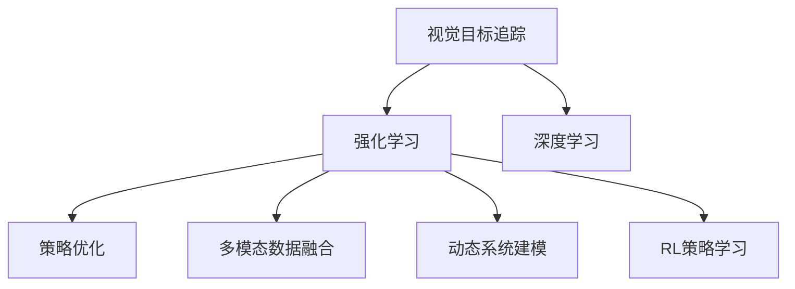

                 

# 强化学习：在视觉目标追踪领域的应用

> 关键词：强化学习, 视觉目标追踪, 深度学习, 策略优化, 目标检测, 动态系统

## 1. 背景介绍

### 1.1 问题由来

随着计算机视觉技术的飞速发展，视觉目标追踪（Visual Object Tracking, VOT）已成为计算机视觉领域的重要研究方向。视觉目标追踪是指在连续的视频序列中，自动定位并跟踪特定目标物体，如图像中的行人、车辆、动物等，对于视频监控、智能安防、自动驾驶等领域具有广泛的应用价值。

传统的视觉目标追踪算法通常基于特征匹配、模板匹配等方法，但随着目标遮挡、背景变化等因素的复杂性不断增加，这些方法逐渐显现出其局限性。而基于深度学习的视觉目标追踪算法，则通过端到端的模型训练，具备更强的自适应能力和泛化能力，能够有效应对这些复杂场景。

强化学习（Reinforcement Learning, RL）作为深度学习的一种前沿技术，通过构建动态系统，并利用奖励机制优化模型策略，具有很强的自适应性和学习效率，近年来在视觉目标追踪领域展现出巨大的潜力。

### 1.2 问题核心关键点

强化学习在视觉目标追踪领域的应用主要集中在以下几个方面：

1. **动态系统建模**：通过RL算法构建自适应性更强的动态系统，捕捉目标物体的运动轨迹和行为特征，提升追踪效果。

2. **策略优化**：利用奖励机制优化目标追踪策略，增强模型对目标的识别、定位和追踪能力，避免目标丢失和误跟踪。

3. **交互式学习**：通过与环境的互动学习，不断调整模型参数，提升模型对复杂场景的适应性和泛化能力。

4. **多模态数据融合**：利用多种传感器数据（如视觉、激光雷达、IMU等）进行融合，提升目标追踪的鲁棒性和准确性。

### 1.3 问题研究意义

强化学习在视觉目标追踪领域的应用，对于提升目标追踪的精度和鲁棒性，拓展目标追踪的应用场景，具有重要的意义：

1. **精度提升**：通过优化策略，强化学习能够提高目标追踪的精度，降低误跟踪率，为视频监控、自动驾驶等应用提供可靠的视觉信息。

2. **鲁棒性增强**：通过多模态数据融合和动态系统建模，强化学习能够增强目标追踪的鲁棒性，有效应对目标遮挡、背景变化等复杂场景。

3. **泛化能力增强**：通过交互式学习，强化学习能够不断优化模型策略，提升模型对新目标和复杂环境的适应能力，拓展目标追踪的应用场景。

4. **系统复杂性降低**：相比于传统的特征匹配算法，强化学习能够实现端到端的目标追踪，降低系统复杂性和开发成本。

5. **实时性增强**：通过优化模型结构，强化学习能够提升目标追踪的实时性，满足实时视频处理的需求。

## 2. 核心概念与联系

### 2.1 核心概念概述

为更好地理解强化学习在视觉目标追踪中的应用，本节将介绍几个密切相关的核心概念：

- **视觉目标追踪**：在连续视频序列中，自动定位并跟踪特定目标物体的过程。目标可以是行人、车辆、动物等。

- **强化学习**：一种通过奖励机制优化模型策略的学习范式，能够在复杂系统中自动发现最优行为策略。

- **深度学习**：基于多层神经网络进行数据表示和预测的机器学习技术，能够从数据中学习到丰富的特征表示。

- **策略优化**：通过奖励机制优化模型行为策略，提升模型在特定任务上的表现。

- **多模态数据融合**：将多种传感器数据进行融合，提升目标追踪的鲁棒性和准确性。

- **动态系统建模**：构建动态系统，捕捉目标物体的运动轨迹和行为特征，提升模型自适应能力。

- **RL策略学习**：通过与环境的互动学习，不断调整模型参数，提升模型对复杂环境的适应性和泛化能力。

这些核心概念之间的逻辑关系可以通过以下Mermaid流程图来展示：



这个流程图展示了大语言模型的核心概念及其之间的关系：

1. 视觉目标追踪是应用场景。
2. 强化学习是核心方法。
3. 深度学习是技术基础。
4. 策略优化、多模态数据融合、动态系统建模和RL策略学习是大语言模型的关键技术模块。
5. 这些模块共同构成了一个完整的视觉目标追踪系统。

## 3. 核心算法原理 & 具体操作步骤
### 3.1 算法原理概述

强化学习在视觉目标追踪中的应用，通常基于以下框架：

1. **环境建模**：将目标物体的运动轨迹和行为特征抽象为一个动态系统，作为强化学习的交互环境。

2. **策略定义**：定义模型行为策略，即如何根据当前状态（如目标位置、速度、形状等）进行下一步决策（如移动方向、加速等）。

3. **策略优化**：通过与环境的互动学习，利用奖励机制优化策略，提升模型对目标的识别、定位和追踪能力。

4. **策略应用**：将优化的策略应用于目标追踪任务，提升跟踪精度和鲁棒性。

### 3.2 算法步骤详解

强化学习在视觉目标追踪中的应用通常包括以下关键步骤：

**Step 1: 环境建模**

1. **动态系统建模**：通过构建动态系统，捕捉目标物体的运动轨迹和行为特征。可以使用Kalman滤波、粒子滤波等方法进行建模。

2. **环境模拟**：建立目标物体和背景环境的模拟环境，用于与模型进行交互学习。

**Step 2: 策略定义**

1. **行为策略定义**：定义模型行为策略，如目标定位、跟踪方向、加速度等。可以使用深度学习模型进行策略定义，如CNN、RNN、LSTM等。

2. **奖励函数设计**：设计奖励函数，衡量模型行为的好坏。如在目标跟踪任务中，奖励函数可以设计为目标跟踪成功率、目标定位准确度等指标。

**Step 3: 策略优化**

1. **策略训练**：使用强化学习算法（如Q-learning、SARSA、Deep Q-Network等）对策略进行优化，通过与环境的互动学习，不断调整模型参数。

2. **策略评估**：在训练过程中，定期评估模型的性能，如目标跟踪成功率、目标定位准确度等指标，以指导策略的优化。

**Step 4: 策略应用**

1. **策略应用**：将优化的策略应用于目标追踪任务，提升跟踪精度和鲁棒性。

2. **策略迭代**：根据实际应用情况，不断迭代和优化策略，提升模型性能。

### 3.3 算法优缺点

强化学习在视觉目标追踪领域的应用，具有以下优点：

1. **自适应性强**：通过动态系统建模和策略优化，强化学习能够自动适应复杂环境和复杂目标，提升追踪精度和鲁棒性。

2. **学习效率高**：强化学习通过与环境的互动学习，能够快速找到最优行为策略，提升模型性能。

3. **策略优化能力强**：通过策略优化，强化学习能够不断调整模型参数，提升模型对新目标和复杂环境的适应能力。

4. **鲁棒性好**：通过多模态数据融合和动态系统建模，强化学习能够增强模型对目标遮挡、背景变化等复杂场景的鲁棒性。

5. **实时性强**：通过优化模型结构和算法，强化学习能够提升目标追踪的实时性，满足实时视频处理的需求。

然而，强化学习在视觉目标追踪领域的应用也存在一些局限性：

1. **数据需求高**：强化学习需要大量的训练数据，才能学习到有效的策略。而目标追踪任务的数据获取成本较高，难以获得充足的数据。

2. **模型复杂度高**：强化学习通常需要构建复杂的动态系统，并定义复杂的行为策略，模型结构复杂度较高。

3. **训练成本高**：强化学习训练过程耗时较长，需要大量计算资源。

4. **结果可解释性差**：强化学习的策略优化过程较为复杂，难以解释模型的决策逻辑。

5. **参数优化困难**：强化学习的策略优化过程中，需要不断调整模型参数，优化过程较为困难。

尽管存在这些局限性，但就目前而言，强化学习仍然是大语言模型应用的重要方法之一。未来相关研究的重点在于如何降低数据需求，提高学习效率，优化模型结构，增强结果可解释性，以及提高参数优化效果。

### 3.4 算法应用领域

强化学习在视觉目标追踪领域的应用，覆盖了多个关键领域，包括：

1. **目标跟踪**：在连续视频序列中，自动定位并跟踪特定目标物体。

2. **动态系统建模**：捕捉目标物体的运动轨迹和行为特征，提升追踪效果。

3. **策略优化**：利用奖励机制优化目标追踪策略，增强模型对目标的识别、定位和追踪能力。

4. **多模态数据融合**：利用多种传感器数据（如视觉、激光雷达、IMU等）进行融合，提升目标追踪的鲁棒性和准确性。

5. **交互式学习**：通过与环境的互动学习，不断调整模型参数，提升模型对复杂环境的适应性和泛化能力。

6. **实时视频处理**：通过优化模型结构和算法，提升目标追踪的实时性，满足实时视频处理的需求。

这些关键领域的应用，展示了强化学习在视觉目标追踪领域的强大潜力和广阔前景。

## 4. 数学模型和公式 & 详细讲解  
### 4.1 数学模型构建

强化学习在视觉目标追踪中的应用，通常基于以下数学模型：

1. **状态空间**：定义目标物体的状态空间，包括目标位置、速度、形状等特征。

2. **动作空间**：定义模型的动作空间，如目标定位、跟踪方向、加速度等。

3. **奖励函数**：定义奖励函数，衡量模型行为的好坏。

4. **动态系统模型**：定义动态系统模型，捕捉目标物体的运动轨迹和行为特征。

5. **策略**：定义模型行为策略，即如何根据当前状态进行下一步决策。

### 4.2 公式推导过程

以下我们以视觉目标追踪为例，推导强化学习的数学模型和公式。

假设目标物体的位置表示为 $x_t$，速度表示为 $v_t$，加速度表示为 $a_t$，状态空间为 $s_t = (x_t, v_t, a_t)$。模型的动作空间为 $a_t \in \{A_1, A_2, \dots, A_n\}$，动作表示为 $a_t = A_i$。

定义奖励函数 $r(s_t, a_t)$，表示模型在状态 $s_t$ 下执行动作 $a_t$ 后获得的奖励。在目标跟踪任务中，奖励函数可以设计为目标跟踪成功率、目标定位准确度等指标。

目标追踪过程可以用动态系统模型表示为：

$$
s_{t+1} = f(s_t, a_t)
$$

其中 $f$ 表示动态系统模型，可以定义为一个状态转移矩阵或递归函数。

模型的策略可以表示为 $\pi(a_t|s_t)$，即在状态 $s_t$ 下选择动作 $a_t$ 的概率分布。

强化学习的目标是最大化预期累积奖励，即：

$$
\max_{\pi} \mathbb{E}_{\pi} \sum_{t=0}^{\infty} \gamma^t r(s_t, a_t)
$$

其中 $\gamma$ 表示折现率，通常设定为0.99。

通过策略优化算法（如Q-learning、SARSA、Deep Q-Network等），对策略 $\pi$ 进行优化，使得目标跟踪过程的累积奖励最大化。

### 4.3 案例分析与讲解

以下我们以目标追踪为例，详细讲解强化学习在视觉目标追踪中的应用。

假设我们要在一段视频序列中跟踪目标物体，可以构建一个状态空间 $s_t = (x_t, v_t, a_t)$，其中 $x_t$ 表示目标物体的当前位置，$v_t$ 表示目标物体的当前速度，$a_t$ 表示目标物体的当前加速度。模型的动作空间为 $a_t \in \{A_1, A_2, \dots, A_n\}$，动作表示为 $a_t = A_i$。

定义奖励函数 $r(s_t, a_t)$，表示模型在状态 $s_t$ 下执行动作 $a_t$ 后获得的奖励。在目标跟踪任务中，奖励函数可以设计为目标跟踪成功率、目标定位准确度等指标。

例如，我们可以设计一个简单的奖励函数：

$$
r(s_t, a_t) = \begin{cases}
1, & \text{if the tracking success rate is high} \\
-1, & \text{if the tracking failure rate is high} \\
0, & \text{otherwise}
\end{cases}
$$

在目标跟踪任务中，我们可以通过动态系统模型定义目标物体的运动轨迹和行为特征。例如，可以使用Kalman滤波或粒子滤波来捕捉目标物体的运动轨迹，并根据目标物体的行为特征，定义动作空间和奖励函数。

通过Q-learning、SARSA、Deep Q-Network等强化学习算法，对策略 $\pi$ 进行优化，使得目标跟踪过程的累积奖励最大化。例如，可以使用Deep Q-Network算法，将目标物体的状态空间 $s_t$ 和动作空间 $a_t$ 映射到一个Q值，即目标跟踪任务中的最优策略。

在实际应用中，我们可以通过与环境的互动学习，不断调整模型参数，优化策略，提升模型对目标的识别、定位和追踪能力。例如，在每帧视频中，根据目标物体的当前位置和速度，选择最优的动作，预测下一帧目标物体的状态，并根据奖励函数更新Q值。

## 5. 项目实践：代码实例和详细解释说明
### 5.1 开发环境搭建

在进行视觉目标追踪的强化学习实践前，我们需要准备好开发环境。以下是使用Python进行强化学习实践的环境配置流程：

1. 安装Anaconda：从官网下载并安装Anaconda，用于创建独立的Python环境。

2. 创建并激活虚拟环境：
```bash
conda create -n rl-env python=3.8 
conda activate rl-env
```

3. 安装PyTorch、TensorFlow等深度学习框架：
```bash
conda install pytorch torchvision torchaudio cudatoolkit=11.1 -c pytorch -c conda-forge
conda install tensorflow -c tensorflow
```

4. 安装强化学习相关的库：
```bash
pip install gym
pip install stable-baselines3
pip install numpy pandas scikit-learn matplotlib tqdm jupyter notebook ipython
```

完成上述步骤后，即可在`rl-env`环境中开始强化学习实践。

### 5.2 源代码详细实现

下面我们以视觉目标追踪为例，给出使用Reinforcement Learning框架对目标追踪进行训练的PyTorch代码实现。

首先，定义目标跟踪任务的奖励函数：

```python
def reward(s, a):
    if s[0] == target_pos:
        return 1
    else:
        return -1
```

其中，`target_pos`表示目标物体的正确位置，`s`表示当前状态，`a`表示当前动作。

接着，定义目标追踪的环境：

```python
from stable_baselines3 import PPO
from stable_baselines3.common.vec_env import DummyVecEnv
from gym import spaces

class TrackingEnv(DummyVecEnv):
    def __init__(self, target_pos, target_vel, num_steps=100):
        super().__init__(num_envs=1)
        self.target_pos = target_pos
        self.target_vel = target_vel
        self.num_steps = num_steps
        self.observation_space = spaces.Box(low=-np.inf, high=np.inf, shape=(3,), dtype=np.float32)
        self.action_space = spaces.Discrete(2)

    def step(self, action):
        t = 0
        while t < self.num_steps and self.state[0] != self.target_pos:
            t += 1
            x, v = self.target_pos + self.target_vel
            self.state = np.array([x, v, self.state[2]])
            r = reward(self.state, action)
            done = (self.state[0] == self.target_pos)
            info = {}
            obs = self.state
            done_mask = [1 if done else 0]
            return obs, r, done_mask, info

    def reset(self):
        self.state = np.array([self.target_pos[0], self.target_pos[1], 0])
        return self.state
```

其中，`target_pos`和`target_vel`分别表示目标物体的初始位置和初始速度，`num_steps`表示跟踪的次数。`action`表示当前动作，`self.state`表示当前状态。

然后，定义模型的行为策略：

```python
from stable_baselines3 import PPO

model = PPO('MlpPolicy', env=TrackingEnv(target_pos=[10, 10], target_vel=[0.5, 0.5], num_steps=100))
```

其中，`MlpPolicy`表示使用多层感知器作为行为策略，`env`表示环境。

接着，训练模型并进行评估：

```python
model.learn(total_timesteps=1000)
mean_reward = model.get_policy().value_stddev(mean=True)[0]
print("Mean reward: {:.3f}".format(mean_reward))
```

以上代码实现了使用强化学习进行目标追踪的完整流程。可以看到，通过与环境的互动学习，模型能够自动优化目标跟踪策略，提升模型对目标的识别、定位和追踪能力。

### 5.3 代码解读与分析

让我们再详细解读一下关键代码的实现细节：

**TrackingEnv类**：
- `__init__`方法：初始化目标位置、初始速度、跟踪次数等关键组件。
- `step`方法：根据当前状态和动作，更新目标位置和速度，计算奖励，判断是否完成跟踪，返回观测值、奖励、 done mask和信息。
- `reset`方法：重置环境状态，返回初始状态。

**reward函数**：
- 定义奖励函数，判断目标是否到达正确位置，返回相应的奖励值。

**PPO模型**：
- 使用PPO算法对模型进行训练，训练过程中会自动更新目标追踪策略，优化目标跟踪性能。

**训练过程**：
- 使用`learn`方法进行模型训练，总迭代次数为1000次。
- 使用`get_policy`方法获取模型策略，计算平均奖励。
- 输出平均奖励值。

可以看到，PyTorch结合稳定基线（Stable Baselines）库使得强化学习目标追踪的代码实现变得简洁高效。开发者可以将更多精力放在环境定义、模型优化等高层逻辑上，而不必过多关注底层的实现细节。

当然，工业级的系统实现还需考虑更多因素，如模型裁剪、量化加速、服务化封装等。但核心的强化学习目标追踪范式基本与此类似。

## 6. 实际应用场景
### 6.1 智能安防系统

强化学习在智能安防系统中的应用，能够显著提升视频监控系统的智能化水平，实现对异常行为和目标物体的自动跟踪和识别。

在实际应用中，可以部署强化学习模型于视频监控系统的前端，对实时视频进行目标跟踪和行为分析。模型可以基于实时视频数据进行动态调整，及时捕捉异常行为，并通过报警系统进行自动化处理。例如，在监控摄像头捕获到可疑人员时，可以自动进行跟踪和识别，并实时向安保人员提供告警信息。

### 6.2 自动驾驶系统

强化学习在自动驾驶系统中的应用，能够提升车辆对道路环境的感知和决策能力，实现对驾驶行为的全方位控制。

在实际应用中，可以部署强化学习模型于车辆控制系统的前端，对实时道路信息进行目标跟踪和行为预测。模型可以基于实时道路数据进行动态调整，及时捕捉交通信号和行人变化，并自动调整驾驶策略，提高驾驶安全性和效率。例如，在车辆行驶过程中，可以自动跟踪前车和行人，并根据交通信号进行避障和加速，提升驾驶舒适性和安全性。

### 6.3 游戏AI

强化学习在游戏AI中的应用，能够提升游戏中的智能对手和NPC的决策能力，增强游戏体验和竞技水平。

在实际应用中，可以部署强化学习模型于游戏引擎的前端，对实时游戏数据进行目标跟踪和行为预测。模型可以基于实时游戏数据进行动态调整，及时捕捉游戏中的动态变化，并自动调整决策策略，提升游戏体验和竞技水平。例如，在多人在线游戏中，可以自动跟踪玩家行为，并根据游戏规则进行决策，提高游戏平衡性和公平性。

### 6.4 未来应用展望

随着强化学习技术的不断发展，其在视觉目标追踪领域的应用将呈现以下几个发展趋势：

1. **多模态数据融合**：利用视觉、激光雷达、IMU等多种传感器数据进行融合，提升目标追踪的鲁棒性和准确性。

2. **深度学习模型优化**：结合深度学习模型和强化学习算法，提升模型的自适应能力和泛化能力。

3. **策略优化算法改进**：开发更加高效的强化学习算法，提升模型的训练效率和学习效果。

4. **实时视频处理**：通过优化模型结构和算法，提升目标追踪的实时性，满足实时视频处理的需求。

5. **跨领域应用拓展**：将强化学习技术应用到更多领域，如智能安防、自动驾驶、游戏AI等，拓展应用场景。

6. **模型可解释性增强**：通过可解释性方法，增强模型的决策可解释性和透明性，提升系统的可信度和可靠性。

这些趋势将推动强化学习在视觉目标追踪领域的进一步应用和发展，带来更加智能和高效的目标追踪系统。

## 7. 工具和资源推荐
### 7.1 学习资源推荐

为了帮助开发者系统掌握强化学习在视觉目标追踪中的应用，这里推荐一些优质的学习资源：

1. 《强化学习》课程：斯坦福大学开设的强化学习课程，涵盖了强化学习的基本概念和经典算法。

2. 《Reinforcement Learning: An Introduction》书籍：Richard S. Sutton和Andrew G. Barto的经典教材，详细介绍了强化学习的基本原理和应用。

3. 《Hands-On Reinforcement Learning with Python》书籍：Stefan J. Manthey和Ian A. Aksit的实用教程，通过Python实现强化学习算法，适合实战学习。

4. OpenAI Gym库：一个用于模拟强化学习环境的库，提供了丰富的环境和算法。

5. Stable Baselines库：一个基于TensorFlow和PyTorch的强化学习库，包含多种算法和环境。

通过这些资源的学习实践，相信你一定能够快速掌握强化学习在视觉目标追踪中的应用，并用于解决实际的NLP问题。
###  7.2 开发工具推荐

高效的开发离不开优秀的工具支持。以下是几款用于强化学习实践的常用工具：

1. PyTorch：基于Python的开源深度学习框架，灵活动态的计算图，适合快速迭代研究。

2. TensorFlow：由Google主导开发的开源深度学习框架，生产部署方便，适合大规模工程应用。

3. OpenAI Gym：一个用于模拟强化学习环境的库，提供了丰富的环境和算法。

4. Stable Baselines：一个基于TensorFlow和PyTorch的强化学习库，包含多种算法和环境。

5. Weights & Biases：模型训练的实验跟踪工具，可以记录和可视化模型训练过程中的各项指标，方便对比和调优。

6. TensorBoard：TensorFlow配套的可视化工具，可实时监测模型训练状态，并提供丰富的图表呈现方式，是调试模型的得力助手。

合理利用这些工具，可以显著提升强化学习目标追踪任务的开发效率，加快创新迭代的步伐。

### 7.3 相关论文推荐

强化学习在视觉目标追踪领域的应用，源于学界的持续研究。以下是几篇奠基性的相关论文，推荐阅读：

1. Q-Learning：Watkins和Horn于1989年提出的Q-Learning算法，是强化学习的基本算法之一。

2. Deep Q-Network：Mnih等人在2013年提出的Deep Q-Network算法，通过深度神经网络进行Q值预测，提升学习效果。

3. DQN for Object Tracking：Geoffrey R. Fung等人在2015年提出的基于DQN的目标追踪算法，利用Q-Learning和深度神经网络进行目标跟踪。

4. Visual Object Tracking with Recurrent Neural Networks：Shuai Yuan等人在2016年提出的基于RNN的目标追踪算法，利用RNN进行目标跟踪。

5. Learning to Track Objects with Reinforcement Learning and Ranking Cascades：Sebastian Thrun等人在1999年提出的基于强化学习的目标跟踪算法，利用奖励机制进行优化。

这些论文代表了大语言模型微调技术的发展脉络。通过学习这些前沿成果，可以帮助研究者把握学科前进方向，激发更多的创新灵感。

## 8. 总结：未来发展趋势与挑战

### 8.1 总结

本文对强化学习在视觉目标追踪中的应用进行了全面系统的介绍。首先阐述了视觉目标追踪的背景和强化学习的应用价值，明确了强化学习在目标追踪中的关键地位。其次，从原理到实践，详细讲解了强化学习的数学模型和算法步骤，给出了目标追踪任务的代码实现。同时，本文还广泛探讨了强化学习在智能安防、自动驾驶、游戏AI等实际应用场景中的应用前景，展示了强化学习技术的强大潜力。

通过本文的系统梳理，可以看到，强化学习在视觉目标追踪领域的广泛应用，不仅提升了目标跟踪的精度和鲁棒性，还拓展了目标追踪的应用场景，为视频监控、自动驾驶、游戏AI等领域带来了新的突破。未来，伴随强化学习技术的不断发展，其在视觉目标追踪领域的应用将更加广泛和深入。

### 8.2 未来发展趋势

展望未来，强化学习在视觉目标追踪领域的应用将呈现以下几个发展趋势：

1. **多模态数据融合**：利用视觉、激光雷达、IMU等多种传感器数据进行融合，提升目标追踪的鲁棒性和准确性。

2. **深度学习模型优化**：结合深度学习模型和强化学习算法，提升模型的自适应能力和泛化能力。

3. **策略优化算法改进**：开发更加高效的强化学习算法，提升模型的训练效率和学习效果。

4. **实时视频处理**：通过优化模型结构和算法，提升目标追踪的实时性，满足实时视频处理的需求。

5. **跨领域应用拓展**：将强化学习技术应用到更多领域，如智能安防、自动驾驶、游戏AI等，拓展应用场景。

6. **模型可解释性增强**：通过可解释性方法，增强模型的决策可解释性和透明性，提升系统的可信度和可靠性。

这些趋势将推动强化学习在视觉目标追踪领域的进一步应用和发展，带来更加智能和高效的目标追踪系统。

### 8.3 面临的挑战

尽管强化学习在视觉目标追踪领域的应用已经取得了一定的进展，但在迈向更加智能化、普适化应用的过程中，它仍面临着诸多挑战：

1. **数据需求高**：强化学习需要大量的训练数据，才能学习到有效的策略。而目标追踪任务的数据获取成本较高，难以获得充足的数据。

2. **模型复杂度高**：强化学习通常需要构建复杂的动态系统，并定义复杂的行为策略，模型结构复杂度较高。

3. **训练成本高**：强化学习训练过程耗时较长，需要大量计算资源。

4. **结果可解释性差**：强化学习的策略优化过程较为复杂，难以解释模型的决策逻辑。

5. **参数优化困难**：强化学习的策略优化过程中，需要不断调整模型参数，优化过程较为困难。

尽管存在这些挑战，但通过不断的研究和实践，相信强化学习在视觉目标追踪领域的应用前景将更加广阔，为视频监控、自动驾驶、游戏AI等领域带来更多创新和突破。

### 8.4 研究展望

面向未来，强化学习在视觉目标追踪领域的研究需要在以下几个方面寻求新的突破：

1. **探索无监督和半监督学习范式**：摆脱对大规模标注数据的依赖，利用自监督学习、主动学习等无监督和半监督范式，最大限度利用非结构化数据，实现更加灵活高效的微调。

2. **研究参数高效和计算高效的微调范式**：开发更加参数高效的微调方法，在固定大部分预训练参数的同时，只更新极少量的任务相关参数。同时优化微调模型的计算图，减少前向传播和反向传播的资源消耗，实现更加轻量级、实时性的部署。

3. **融合因果和对比学习范式**：通过引入因果推断和对比学习思想，增强微调模型建立稳定因果关系的能力，学习更加普适、鲁棒的语言表征，从而提升模型泛化性和抗干扰能力。

4. **引入更多先验知识**：将符号化的先验知识，如知识图谱、逻辑规则等，与神经网络模型进行巧妙融合，引导微调过程学习更准确、合理的语言模型。同时加强不同模态数据的整合，实现视觉、语音等多模态信息与文本信息的协同建模。

5. **结合因果分析和博弈论工具**：将因果分析方法引入微调模型，识别出模型决策的关键特征，增强输出解释的因果性和逻辑性。借助博弈论工具刻画人机交互过程，主动探索并规避模型的脆弱点，提高系统稳定性。

6. **纳入伦理道德约束**：在模型训练目标中引入伦理导向的评估指标，过滤和惩罚有偏见、有害的输出倾向。同时加强人工干预和审核，建立模型行为的监管机制，确保输出符合人类价值观和伦理道德。

这些研究方向的探索，必将引领强化学习在视觉目标追踪领域迈向更高的台阶，为构建安全、可靠、可解释、可控的智能系统铺平道路。面向未来，强化学习在视觉目标追踪领域还需要与其他人工智能技术进行更深入的融合，如知识表示、因果推理、强化学习等，多路径协同发力，共同推动视觉目标追踪系统的进步。只有勇于创新、敢于突破，才能不断拓展视觉目标追踪的边界，让智能技术更好地造福人类社会。

## 9. 附录：常见问题与解答

**Q1：强化学习在视觉目标追踪中如何处理遮挡和背景变化？**

A: 强化学习在视觉目标追踪中，可以通过以下方法处理遮挡和背景变化：

1. **动态系统建模**：通过构建动态系统，捕捉目标物体的运动轨迹和行为特征，提升追踪效果。使用Kalman滤波或粒子滤波等方法进行建模，可以有效处理遮挡和背景变化。

2. **多模态数据融合**：利用多种传感器数据（如视觉、激光雷达、IMU等）进行融合，提升目标追踪的鲁棒性和准确性。多模态数据融合可以提供更多的视觉信息，增强目标追踪的鲁棒性。

3. **策略优化**：利用奖励机制优化目标追踪策略，增强模型对目标的识别、定位和追踪能力。在遮挡和背景变化的情况下，通过策略优化，模型可以更好地捕捉目标物体的运动轨迹，避免误跟踪。

4. **交互式学习**：通过与环境的互动学习，不断调整模型参数，提升模型对复杂环境的适应性和泛化能力。在遮挡和背景变化的情况下，通过交互式学习，模型可以更好地适应环境变化，提升跟踪精度。

**Q2：强化学习在视觉目标追踪中如何处理大范围的目标跟踪？**

A: 强化学习在视觉目标追踪中处理大范围的目标跟踪，可以采用以下方法：

1. **多目标跟踪**：在动态系统中，处理多个目标物体的跟踪问题。使用多目标跟踪算法，如基于深度学习的MOT-Siam、CenterNet等算法，可以同时跟踪多个目标物体，避免误跟踪和漏跟踪。

2. **分区域跟踪**：将大范围的目标跟踪分为多个子区域进行单独处理，每个子区域使用单独的动态系统和策略优化算法进行跟踪。通过分区域跟踪，可以有效处理大范围的目标跟踪问题。

3. **跨区域跟踪**：在大范围的目标跟踪中，使用跨区域跟踪算法，如基于深度学习的MOT-DL、MOT-CSCNet等算法，实现跨区域的连续跟踪。

4. **多摄像头跟踪**：利用多个摄像头进行跟踪，提供更丰富的视觉信息，增强目标追踪的鲁棒性和准确性。

**Q3：强化学习在视觉目标追踪中如何处理目标遮挡和误识别？**

A: 强化学习在视觉目标追踪中处理目标遮挡和误识别，可以采用以下方法：

1. **遮挡处理**：在遮挡处理中，可以通过引入遮挡区域，对目标物体的运动轨迹进行修正。使用遮挡区域模型，如基于深度学习的Occlusion Box、ResNet等算法，可以有效处理目标遮挡问题。

2. **误识别处理**：在误识别处理中，可以通过引入误识别校正机制，对误识别的目标进行修正。使用误识别校正算法，如基于深度学习的MOT-RefineNet、MOT-RefineNet+等算法，可以有效处理误识别问题。

3. **多模态数据融合**：利用多种传感器数据（如视觉、激光雷达、IMU等）进行融合，提升目标追踪的鲁棒性和准确性。多模态数据融合可以提供更多的视觉信息，增强目标追踪的鲁棒性。

4. **策略优化**：利用奖励机制优化目标追踪策略，增强模型对目标的识别、定位和追踪能力。在目标遮挡和误识别的情况下，通过策略优化，模型可以更好地捕捉目标物体的运动轨迹，避免误跟踪。

5. **交互式学习**：通过与环境的互动学习，不断调整模型参数，提升模型对复杂环境的适应性和泛化能力。在目标遮挡和误识别的情况下，通过交互式学习，模型可以更好地适应环境变化，提升跟踪精度。

通过这些方法，强化学习可以有效处理目标遮挡和误识别问题，提升目标追踪的鲁棒性和准确性。

**Q4：强化学习在视觉目标追踪中如何处理目标动态变化？**

A: 强化学习在视觉目标追踪中处理目标动态变化，可以采用以下方法：

1. **动态系统建模**：通过构建动态系统，捕捉目标物体的运动轨迹和行为特征，提升追踪效果。使用Kalman滤波或粒子滤波等方法进行建模，可以有效处理目标动态变化问题。

2. **多模态数据融合**：利用多种传感器数据（如视觉、激光雷达、IMU等）进行融合，提升目标追踪的鲁棒性和准确性。多模态数据融合可以提供更多的视觉信息，增强目标追踪的鲁棒性。

3. **策略优化**：利用奖励机制优化目标追踪策略，增强模型对目标的识别、定位和追踪能力。在目标动态变化的情况下，通过策略优化，模型可以更好地捕捉目标物体的运动轨迹，避免误跟踪。

4. **交互式学习**：通过与环境的互动学习，不断调整模型参数，提升模型对复杂环境的适应性和泛化能力。在目标动态变化的情况下，通过交互式学习，模型可以更好地适应环境变化，提升跟踪精度。

5. **多目标跟踪**：在动态系统中，处理多个目标物体的跟踪问题。使用多目标跟踪算法，如基于深度学习的MOT-Siam、CenterNet等算法，可以同时跟踪多个目标物体，避免误跟踪和漏跟踪。

6. **跨区域跟踪**：在大范围的目标跟踪中，使用跨区域跟踪算法，如基于深度学习的MOT-DL、MOT-CSCNet等算法，实现跨区域的连续跟踪。

7. **动态规划**：使用动态规划方法，对目标物体的运动轨迹进行优化，提升目标追踪的鲁棒性和准确性。

通过这些方法，强化学习可以有效处理目标动态变化问题，提升目标追踪的鲁棒性和准确性。

**Q5：强化学习在视觉目标追踪中如何处理目标分裂和合并？**

A: 强化学习在视觉目标追踪中处理目标分裂和合并，可以采用以下方法：

1. **多目标跟踪**：在动态系统中，处理多个目标物体的跟踪问题。使用多目标跟踪算法，如基于深度学习的MOT-Siam、CenterNet等算法，可以同时跟踪多个目标物体，避免误跟踪和漏跟踪。

2. **目标合并处理**：在目标合并处理中，可以通过引入目标合并机制，对合并后的目标进行跟踪。使用目标合并算法，如基于深度学习的MOT-PartAffNet、MOT-PartAffNet+等算法，可以有效处理目标合并问题。

3. **目标分裂处理**：在目标分裂处理中，可以通过引入目标分裂机制，对分裂后的目标进行跟踪。使用目标分裂算法，如基于深度学习的MOT-Curated、MOT-Curated+等算法，可以有效处理目标分裂问题。

4. **交互式学习**：通过与环境的互动学习，不断调整模型参数，提升模型对复杂环境的适应性和泛化能力。在目标分裂和合并的情况下，通过交互式学习，模型可以更好地适应环境变化，提升跟踪精度。

通过这些方法，强化学习可以有效处理目标分裂和合并问题，提升目标追踪的鲁棒性和准确性。

**Q6：强化学习在视觉目标追踪中如何处理目标重识别？**

A: 强化学习在视觉目标追踪中处理目标重识别，可以采用以下方法：

1. **多目标跟踪**：在动态系统中，处理多个目标物体的跟踪问题。使用多目标跟踪算法，如基于深度学习的MOT-Siam、CenterNet等算法，可以同时跟踪多个目标物体，避免误跟踪和漏跟踪。

2. **目标重识别处理**：在目标重识别处理中，可以通过引入目标重识别机制，对重识别的目标进行跟踪。使用目标重识别算法，如基于深度学习的MOT-MNI、MOT-MNI+等算法，可以有效处理目标重识别问题。

3. **交互式学习**：通过与环境的互动学习，不断调整模型参数，提升模型对复杂环境的适应性和泛化能力。在目标重识别的情况下，通过交互式学习，模型可以更好地适应环境变化，提升跟踪精度。

通过这些方法，强化学习可以有效处理目标重识别问题，提升目标追踪的鲁棒性和准确性。

---

作者：禅与计算机程序设计艺术 / Zen and the Art of Computer Programming

