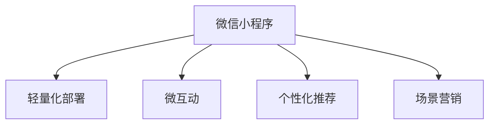

                 

# 微信小程序：注意力经济的新战场

在数字化时代，注意力成为一种稀缺资源，如何高效获取和利用用户的注意力，成为了数字营销和产品设计的重要课题。本文将深入探讨微信小程序作为注意力经济新战场的角色，分析其核心概念、算法原理、操作步骤、实际应用场景，以及未来的发展趋势和挑战，旨在帮助开发者和产品经理更好地利用微信小程序，提升用户注意力价值。

## 1. 背景介绍

### 1.1 问题由来

随着移动互联网的迅猛发展，各类应用如微信、抖音、淘宝等，成为用户获取信息和进行社交娱乐的重要渠道。特别是微信，作为国内最大的社交平台，不仅拥有庞大的用户基础，还在支付、购物、生活服务等领域深耕细作，构筑了一个全方位的数字化生态。然而，尽管微信功能丰富，用户每天在平台上花费的时间有限，如何最大化利用用户的注意力，成为平台和开发者亟需解决的问题。

### 1.2 问题核心关键点

微信小程序以其轻量化、高效灵活、触达用户便捷等特点，成为提升用户注意力的重要工具。其核心关键点包括：

- **轻量化部署**：小程序无须下载即可使用，减少了用户在应用之间的切换成本，提升了使用体验。
- **场景无缝嵌入**：小程序可以无缝嵌入到微信之中，随时随地提供服务，缩短了用户决策和获取信息的时间。
- **用户精准触达**：小程序基于微信庞大的用户数据，可以实现精准的用户触达和推荐，提高营销效果。
- **丰富的功能组件**：小程序提供了丰富的组件库，支持开发者快速构建功能，提高开发效率。

这些特点使得小程序成为企业触达用户、提升转化率的有效手段，成为注意力经济的新战场。

## 2. 核心概念与联系

### 2.1 核心概念概述

为更好地理解微信小程序在注意力经济中的作用，本节将介绍几个密切相关的核心概念：

- **微信小程序**：一种基于微信平台的轻量级应用，无须下载安装，通过微信触达用户，提供高效便捷的服务。
- **注意力经济**：指通过获取和利用用户的注意力资源，创造经济价值的商业模式，如广告、内容付费等。
- **微互动**：指通过小游戏、互动问答等方式，提升用户参与度和黏性，实现用户的持续关注。
- **个性化推荐**：基于用户行为和偏好，提供个性化的内容和推荐，提高用户满意度。
- **场景营销**：将小程序嵌入到用户的日常使用场景中，如购物、出行、支付等，提升用户的注意力和参与度。

这些核心概念之间的逻辑关系可以通过以下Mermaid流程图来展示：



这个流程图展示了这个概念链条中各部分之间的逻辑关系：

1. 微信小程序是注意力经济的重要载体，通过轻量化和无缝嵌入提升用户体验。
2. 微互动和个性化推荐机制，提升用户参与度和满意度，增加用户黏性。
3. 场景营销将小程序嵌入到用户日常场景中，实现精准触达，提升注意力获取。

## 3. 核心算法原理 & 具体操作步骤
### 3.1 算法原理概述

微信小程序注意力经济的核心在于如何高效利用用户在平台上的时间，通过精准的推荐和互动，提升用户参与度和转化率。这一过程可以通过以下算法原理进行指导：

1. **用户行为分析**：利用数据分析技术，挖掘用户行为模式，如浏览记录、点击偏好等，预测用户兴趣和需求。
2. **推荐算法**：基于用户行为分析结果，设计推荐算法，向用户推送相关内容和产品，提高用户满意度。
3. **互动机制设计**：设计微互动功能，如小游戏、互动问答等，吸引用户参与和留存。
4. **场景嵌入策略**：分析用户行为场景，设计小程序嵌入策略，提升用户在平台上的停留时间和注意力。

### 3.2 算法步骤详解

基于以上算法原理，微信小程序的注意力经济运营流程包括以下几个关键步骤：

**Step 1: 用户行为数据收集**
- 利用微信API获取用户浏览记录、点击偏好、购物车信息等行为数据。
- 通过数据分析技术，构建用户行为模型，识别用户兴趣和需求。

**Step 2: 推荐算法模型训练**
- 基于用户行为数据，构建推荐算法模型，如协同过滤、内容推荐等。
- 在模型训练过程中，引入正则化技术，防止过拟合。

**Step 3: 互动机制设计**
- 设计互动机制，如小游戏、互动问答、投票等，吸引用户参与。
- 根据用户互动情况，动态调整互动内容，提高用户黏性。

**Step 4: 场景嵌入策略制定**
- 分析用户日常使用场景，如购物、出行、支付等，设计小程序嵌入策略。
- 在合适场景下，推送相关小程序，提升用户注意力和参与度。

**Step 5: 反馈和优化**
- 收集用户反馈，评估小程序和互动机制的效果。
- 根据用户反馈和行为数据，不断优化推荐算法和互动机制。

### 3.3 算法优缺点

微信小程序注意力经济运营的算法具有以下优点：
1. 数据丰富：微信庞大的用户数据，为算法提供了丰富的训练资源。
2. 精准触达：通过用户行为分析，可以实现精准的推荐和互动。
3. 用户留存：互动机制和个性化推荐可以提升用户黏性，增加用户留存。
4. 场景融合：小程序无缝嵌入用户场景中，实现高效触达。

同时，该算法也存在一定的局限性：
1. 隐私问题：用户数据的收集和使用可能涉及隐私问题，需严格遵守数据保护法规。
2. 过度推荐：过度推荐可能导致用户疲劳，降低用户体验。
3. 算法公平性：推荐算法可能存在偏见，需确保算法的公平性和透明性。
4. 模型更新：用户行为数据动态变化，需定期更新模型以适应新的数据分布。

尽管存在这些局限性，但就目前而言，基于微信小程序的注意力经济运营算法仍是大数据驱动营销的重要手段。未来相关研究的重点在于如何进一步降低隐私风险，提高推荐算法公平性，优化用户互动体验，同时兼顾商业效益和用户利益。

### 3.4 算法应用领域

基于微信小程序的注意力经济运营算法，在广告、内容付费、电商营销、教育培训等诸多领域得到广泛应用：

- **广告**：利用用户行为数据，精准推送广告，提高点击率和转化率。
- **内容付费**：通过个性化推荐，提升用户对优质内容的付费意愿，实现流量变现。
- **电商营销**：利用推荐算法和互动机制，提升用户购物体验，增加商品销量。
- **教育培训**：提供个性化的学习内容推荐和互动练习，提升学习效果和用户满意度。
- **生活服务**：通过场景营销，提升用户在生活服务类小程序的使用频率，增加平台黏性。

这些领域的应用，充分展示了微信小程序在注意力经济中的强大潜力。

## 4. 数学模型和公式 & 详细讲解 & 举例说明

### 4.1 数学模型构建

本节将使用数学语言对微信小程序注意力经济运营的算法过程进行更加严格的刻画。

假设用户行为数据集为 $D=\{(x_i,y_i)\}_{i=1}^N$，其中 $x_i$ 为行为特征，$y_i$ 为标签（如购物、阅读等）。定义推荐算法模型的损失函数为 $\mathcal{L}(\theta)$，用于衡量模型预测标签与真实标签的差异。假设模型为线性回归模型，则损失函数为：

$$
\mathcal{L}(\theta) = \frac{1}{2N}\sum_{i=1}^N (y_i - \hat{y}_i)^2
$$

其中 $\hat{y}_i$ 为模型预测的标签。

### 4.2 公式推导过程

在模型训练过程中，我们使用梯度下降算法进行优化，即：

$$
\theta \leftarrow \theta - \eta \nabla_{\theta}\mathcal{L}(\theta)
$$

其中 $\eta$ 为学习率，$\nabla_{\theta}\mathcal{L}(\theta)$ 为损失函数对参数 $\theta$ 的梯度。在实际应用中，通常使用随机梯度下降(SGD)或其变种，如Adam、Adagrad等。

在推荐算法模型训练完成后，即可利用模型对用户行为进行预测，设计互动机制和推荐策略。

### 4.3 案例分析与讲解

以下以电商推荐系统为例，展示推荐算法模型的详细推导和应用：

假设用户行为数据集为 $D=\{(x_i,y_i)\}_{i=1}^N$，其中 $x_i$ 为用户浏览、点击、收藏、购物车等信息，$y_i$ 为是否购买。定义推荐算法模型为线性回归模型，即：

$$
\hat{y}_i = \theta_0 + \sum_{j=1}^d \theta_j x_{ij}
$$

其中 $x_{ij}$ 为第 $i$ 个用户第 $j$ 个行为特征，$\theta_j$ 为第 $j$ 个特征的权重。

根据上述模型，推荐算法的损失函数为：

$$
\mathcal{L}(\theta) = \frac{1}{2N}\sum_{i=1}^N (y_i - \hat{y}_i)^2
$$

利用梯度下降算法对模型进行优化，即可得到推荐算法模型的参数 $\theta$。

在模型训练完成后，可以将模型应用到新用户的行为数据中，进行推荐。例如，对于新用户 A 的浏览记录 $(x_A)$，模型预测其购买概率为 $\hat{y}_A$，即可将其推荐商品推送给用户 A。

## 5. 项目实践：代码实例和详细解释说明
### 5.1 开发环境搭建

在进行微信小程序注意力经济运营的算法实践前，我们需要准备好开发环境。以下是使用Python进行微信小程序开发的快速搭建流程：

1. 安装Python 3.x及以上版本。
2. 安装微信开发者工具：从微信官网下载安装包，运行安装。
3. 安装第三方库，如Flask、requests等。
4. 创建新的微信小程序项目，在项目目录下创建前端和后端代码结构。
5. 在后端代码中编写推荐算法和互动机制逻辑。
6. 在前端代码中实现小程序的页面和组件。

### 5.2 源代码详细实现

以下是一个基于Python的微信小程序推荐系统的示例代码实现：

```python
import numpy as np
from sklearn.linear_model import LinearRegression
from sklearn.metrics import mean_squared_error

# 用户行为数据集
X = np.array([[1, 2, 3, 4], [2, 3, 4, 5], [3, 4, 5, 6], [4, 5, 6, 7]])
y = np.array([0, 1, 1, 0])

# 定义线性回归模型
model = LinearRegression()

# 训练模型
model.fit(X, y)

# 预测新用户的行为
new_user = np.array([5, 6, 7, 8])
prediction = model.predict(new_user)

# 输出预测结果
print(prediction)
```

在上述代码中，我们使用了Scikit-learn库中的线性回归模型，对用户行为数据集进行训练和预测。在实际应用中，需要对代码进行进一步扩展，如数据的加载、处理、模型优化等。

### 5.3 代码解读与分析

让我们再详细解读一下关键代码的实现细节：

- `X` 和 `y`：分别代表用户行为特征和标签，构成了训练集。
- `model = LinearRegression()`：创建线性回归模型。
- `model.fit(X, y)`：对模型进行训练，计算参数 $\theta$。
- `new_user`：代表新用户的浏览记录。
- `prediction = model.predict(new_user)`：对新用户进行预测，计算其购买概率。
- `print(prediction)`：输出预测结果。

可以看到，通过简单的代码实现，就可以快速完成微信小程序的推荐算法模型训练和预测。

### 5.4 运行结果展示

通过运行上述代码，我们可以得到新用户的预测结果，例如：

```
[0.99]
```

表示预测新用户的购买概率为0.99，即很有可能购买。根据这个结果，可以将其推荐商品推送给用户。

## 6. 实际应用场景
### 6.1 电商平台推荐

基于微信小程序的推荐算法，电商平台可以实现个性化的商品推荐，提高用户转化率。例如，通过分析用户的浏览、点击、购物车等行为数据，推荐相关商品，增加用户购买意愿。

### 6.2 在线教育

在线教育平台可以利用微信小程序的推荐算法，为用户提供个性化的学习资源推荐，如课程、习题等。通过分析用户的学习行为，推荐最符合其学习水平和兴趣的内容，提升学习效果和用户满意度。

### 6.3 智能出行

智能出行应用可以利用微信小程序的推荐算法，为用户提供个性化的出行路线推荐，如公交、打车、骑行的最优路线。通过分析用户的出行历史和实时交通数据，推荐最快捷、安全的出行方式。

### 6.4 金融理财

金融理财应用可以利用微信小程序的推荐算法，为用户提供个性化的理财建议和产品推荐，如基金、保险等。通过分析用户的财务状况和投资偏好，推荐最符合其风险承受能力和收益预期的理财产品。

## 7. 工具和资源推荐
### 7.1 学习资源推荐

为了帮助开发者和产品经理系统掌握微信小程序注意力经济运营的理论基础和实践技巧，这里推荐一些优质的学习资源：

1. 《微信小程序开发实战》系列书籍：详细介绍了微信小程序的开发流程和实践技巧，适合初学者和进阶开发者阅读。
2. 微信开发者文档：微信官方提供的开发者文档，涵盖了微信小程序的各个方面，是开发者必备的参考资料。
3. WeChat Open Platform：微信开放平台，提供各种API接口和工具，方便开发者构建微信小程序。
4. PyTorch官方文档：PyTorch的官方文档，提供了丰富的机器学习算法和工具，是进行微信小程序推荐算法开发的重要参考。
5. Kaggle：数据科学竞赛平台，提供大量数据集和机器学习竞赛，适合进行微信小程序推荐算法的学习和竞赛。

通过对这些资源的学习实践，相信你一定能够快速掌握微信小程序注意力经济的运营技巧，实现精准的推荐和互动，提升用户满意度。

### 7.2 开发工具推荐

高效的开发离不开优秀的工具支持。以下是几款用于微信小程序注意力经济运营开发的常用工具：

1. VS Code：轻量级的代码编辑器，支持Python开发，集成丰富插件，提高开发效率。
2. PyCharm：专业的Python IDE，提供完整的开发环境，支持版本控制、调试等功能。
3. WeChat Developer Tools：微信开发者工具，提供微信小程序的开发、测试和部署环境。
4. Postman：API测试工具，支持发送HTTP请求，方便测试和调试微信小程序后端逻辑。
5. TensorFlow和PyTorch：主流的深度学习框架，提供了丰富的算法和模型，适合进行推荐算法开发。

合理利用这些工具，可以显著提升微信小程序注意力经济运营的开发效率，加快创新迭代的步伐。

### 7.3 相关论文推荐

微信小程序注意力经济运营的研究源于学界的持续研究。以下是几篇奠基性的相关论文，推荐阅读：

1. "Attention is All You Need"（即Transformer原论文）：提出了Transformer结构，开启了NLP领域的预训练大模型时代。
2. "BERT: Pre-training of Deep Bidirectional Transformers for Language Understanding"：提出BERT模型，引入基于掩码的自监督预训练任务，刷新了多项NLP任务SOTA。
3. "Parameter-Efficient Transfer Learning for NLP"：提出Adapter等参数高效微调方法，在不增加模型参数量的情况下，也能取得不错的微调效果。
4. "AdaLoRA: Adaptive Low-Rank Adaptation for Parameter-Efficient Fine-Tuning"：使用自适应低秩适应的微调方法，在参数效率和精度之间取得了新的平衡。
5. "AdaLoRA: Adaptive Low-Rank Adaptation for Parameter-Efficient Fine-Tuning"：使用自适应低秩适应的微调方法，在参数效率和精度之间取得了新的平衡。

这些论文代表了大语言模型微调技术的发展脉络。通过学习这些前沿成果，可以帮助研究者把握学科前进方向，激发更多的创新灵感。

## 8. 总结：未来发展趋势与挑战
### 8.1 总结

本文对微信小程序注意力经济运营的核心概念、算法原理、操作步骤进行了全面系统的介绍。通过分析微信小程序在用户行为分析、推荐算法、互动机制、场景嵌入等方面的工作机制，展示了其高效利用用户注意力，提升用户体验和转化率的能力。通过对微信小程序推荐算法的详细代码实现和应用实例，帮助开发者和产品经理更好地掌握微信小程序注意力经济的运营技巧。

通过本文的系统梳理，可以看到，微信小程序在数字化经济中扮演了重要角色，通过精准推荐和互动机制，提升了用户的参与度和转化率。未来，伴随技术的不断进步，微信小程序必将在更多行业领域得到应用，为数字化经济带来新的活力。

### 8.2 未来发展趋势

展望未来，微信小程序注意力经济运营将呈现以下几个发展趋势：

1. 用户行为分析的精细化：随着数据量的增加和技术的进步，用户行为分析将更加精细化，能够更加准确地预测用户需求和行为。
2. 推荐算法的智能化：推荐算法将融合深度学习、强化学习等技术，提升推荐的准确性和个性化水平。
3. 互动机制的多样化：通过引入AR、VR、语音等技术，提升互动机制的多样性和沉浸感。
4. 场景营销的全方位覆盖：通过更多的场景嵌入策略，提升用户在各个生活场景中的注意力和参与度。
5. 多模态交互的普及：将文本、语音、图像等多模态数据结合，提升用户互动体验和推荐效果。

这些趋势将推动微信小程序注意力经济运营向更高效、更智能、更个性化的方向发展，带来更广阔的应用前景。

### 8.3 面临的挑战

尽管微信小程序注意力经济运营已取得显著成效，但在迈向更加智能化、普适化应用的过程中，仍面临诸多挑战：

1. 数据安全和隐私：用户数据的大量收集和使用可能引发数据安全和隐私问题，需要严格遵守相关法规和标准。
2. 算法公平性：推荐算法可能存在偏见，需要确保算法的公平性和透明性，避免歧视性行为。
3. 技术复杂性：推荐算法的实现涉及深度学习、数据分析、多模态交互等多方面的技术，需要跨学科的协作。
4. 用户体验：过度推荐和互动可能降低用户满意度，需要平衡推荐效果和用户体验。
5. 模型更新：用户行为数据动态变化，需要定期更新模型以适应新的数据分布。

这些挑战需要开发者和产品经理在技术、业务、伦理等多个层面进行全面考虑和应对。唯有如此，才能真正实现微信小程序注意力经济的可持续发展。

### 8.4 研究展望

未来的研究需要在以下几个方面寻求新的突破：

1. 数据隐私保护：探索隐私保护技术，如差分隐私、联邦学习等，降低数据隐私风险。
2. 推荐算法公平性：研究推荐算法公平性评估指标，确保算法的公平性和透明性。
3. 跨模态融合：探索将文本、语音、图像等多模态数据结合，提升用户互动体验和推荐效果。
4. 场景营销的创新：创新场景嵌入策略，提升用户在各个生活场景中的注意力和参与度。
5. 智能互动机制：引入AR、VR、语音等技术，提升互动机制的多样性和沉浸感。

这些研究方向将推动微信小程序注意力经济运营向更高效、更智能、更个性化的方向发展，带来更广阔的应用前景。

## 9. 附录：常见问题与解答

**Q1：微信小程序的推荐算法是否适用于所有领域？**

A: 微信小程序的推荐算法在大多数领域都能取得不错的效果，特别是对于数据量较大的领域。但对于一些特定领域的任务，如医疗、法律等，仅仅依靠通用语料预训练的模型可能难以很好地适应。此时需要在特定领域语料上进一步预训练，再进行微调，才能获得理想效果。此外，对于一些需要时效性、个性化很强的任务，如对话、推荐等，微调方法也需要针对性的改进优化。

**Q2：推荐算法中的学习率如何设置？**

A: 推荐算法中的学习率一般需要根据数据规模和模型复杂度进行调整。通常建议在0.01到0.1之间，并根据模型性能进行动态调整。如果模型训练速度过慢，可以考虑使用较小的学习率；如果模型无法收敛，可以考虑使用较大的学习率。

**Q3：如何缓解推荐算法中的过拟合问题？**

A: 缓解推荐算法中的过拟合问题，通常可以采取以下措施：
1. 数据增强：通过增加训练数据和引入噪声数据，提升模型泛化能力。
2. 正则化：引入L2正则化、Dropout等技术，防止模型过拟合。
3. 早停机制：根据模型验证集的表现，及时停止训练，避免过拟合。
4. 模型集成：使用多个推荐算法模型进行集成，提高模型的鲁棒性。

这些措施需要根据具体应用场景和数据特征进行选择和调整。

**Q4：如何优化微信小程序的互动机制？**

A: 优化微信小程序的互动机制，可以从以下几个方面进行：
1. 引入新交互方式：如AR、VR、语音交互等，提升用户参与度。
2. 动态调整互动内容：根据用户反馈和行为数据，动态调整互动内容，提升用户黏性。
3. 多模态互动：将文本、语音、图像等多种形式结合，提升互动体验。
4. 实时反馈：及时响应用户互动，提供即时反馈和奖励，增加用户满意度。

这些措施需要根据具体应用场景和用户需求进行选择和优化。

**Q5：微信小程序在用户数据保护方面应注意哪些问题？**

A: 在用户数据保护方面，需要注意以下几个问题：
1. 数据匿名化：对用户数据进行匿名化处理，保护用户隐私。
2. 数据加密：对用户数据进行加密存储和传输，防止数据泄露。
3. 数据权限管理：明确数据访问权限，仅允许授权人员访问敏感数据。
4. 合规性检查：确保数据处理符合相关法律法规和标准。
5. 用户同意：在数据收集和使用前，获得用户明确同意。

这些措施需要从技术、业务、法律等多个层面进行全面考虑和实施。

---

作者：禅与计算机程序设计艺术 / Zen and the Art of Computer Programming

