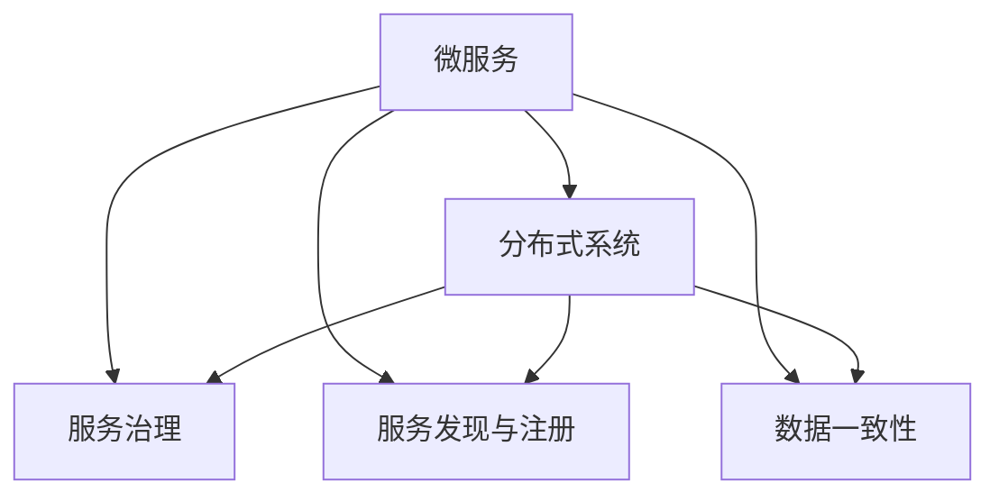

                 

# 微服务架构在系统设计中的实例

## 1. 背景介绍

### 1.1 问题由来

随着企业的业务发展和规模扩大，传统的单体架构（Monolithic Architecture）面临着诸多挑战。单体架构中，所有功能模块都紧密耦合在单一的应用程序中，导致系统难以扩展、维护和部署。此外，在微服务架构出现之前，企业为了保持高可用性和性能，往往需要付出巨大的成本进行系统重构。

微服务架构（Microservices Architecture）是一种新兴的软件架构风格，通过将系统拆分成一系列小型、独立且自治的服务模块，每个服务可以独立部署、扩展和维护。这种架构风格提高了系统的灵活性、可扩展性和可用性，被广泛应用于大型企业的核心业务系统。

微服务架构在实际应用中面临的主要问题包括服务间的通信协议、数据一致性、服务治理等。因此，本文将重点探讨如何通过微服务架构设计，解决这些系统设计问题，并给出具体的应用实例。

### 1.2 问题核心关键点

微服务架构的关键点包括：

- 服务拆分：将系统功能模块划分为多个独立的小服务，每个服务负责一个特定功能。
- 分布式通信：服务之间通过轻量级协议进行通信，如HTTP/REST、gRPC等。
- 自治性：每个服务独立运行，相互独立更新，提升系统可用性和可扩展性。
- 服务发现与注册：通过服务注册中心管理服务的实例，方便服务发现。
- 数据一致性：通过事务管理和状态同步，保证跨服务调用时数据一致性。
- 服务治理：通过API网关、负载均衡、监控告警等手段，实现服务治理。

这些关键点共同构成了微服务架构的核心技术体系，使得微服务架构能够应对复杂的业务场景和海量用户访问。

## 2. 核心概念与联系

### 2.1 核心概念概述

为更好地理解微服务架构在系统设计中的应用，本节将介绍几个密切相关的核心概念：

- 微服务（Microservice）：系统中的独立运行、自治的服务模块，每个服务负责一个特定功能，具有独立部署和扩展的能力。
- 分布式系统（Distributed System）：由多个相互通信的自治进程构成的系统，通常应用于大规模应用中。
- 服务治理（Service Governance）：通过API网关、负载均衡、服务注册、监控告警等手段，实现服务的自动化管理。
- 服务发现与注册（Service Discovery & Registration）：通过服务注册中心管理服务的实例，方便服务发现。
- 数据一致性（Data Consistency）：在跨服务调用时，保证数据的正确性和一致性。

这些核心概念之间的逻辑关系可以通过以下Mermaid流程图来展示：



这个流程图展示出微服务架构的核心概念及其之间的关系：

1. 微服务是分布式系统的核心模块。
2. 服务治理是微服务管理的基石。
3. 服务发现与注册使得服务可以动态发现和管理。
4. 数据一致性是微服务间协同工作的保障。

## 3. 核心算法原理 & 具体操作步骤

### 3.1 算法原理概述

微服务架构的核心原理是通过分布式系统将系统拆分成独立、自治的服务模块，每个服务模块独立运行、扩展和部署。微服务的核心优势在于通过分布式计算、负载均衡、容错机制等技术，实现高可用性、高性能的系统。

微服务架构的设计过程主要包括以下几个关键步骤：

1. 服务拆分：将系统功能模块拆分为多个独立的小服务，每个服务负责一个特定功能。
2. 分布式通信：服务之间通过轻量级协议进行通信，如HTTP/REST、gRPC等。
3. 自治性：每个服务独立运行，相互独立更新，提升系统可用性和可扩展性。
4. 服务发现与注册：通过服务注册中心管理服务的实例，方便服务发现。
5. 数据一致性：通过事务管理和状态同步，保证跨服务调用时数据一致性。
6. 服务治理：通过API网关、负载均衡、监控告警等手段，实现服务治理。

### 3.2 算法步骤详解

微服务架构的实现主要包括以下几个关键步骤：

**Step 1: 准备微服务架构**
- 设计系统的业务逻辑，将功能模块拆分为独立的服务模块。
- 选择合适的通信协议和服务治理方案。

**Step 2: 设计服务通信协议**
- 选择合适的通信协议，如REST、gRPC、消息队列等。
- 定义服务接口和数据格式，规范服务调用和响应方式。

**Step 3: 实现服务自治性**
- 独立部署和扩展每个服务模块。
- 使用容器化技术（如Docker、Kubernetes等）管理服务实例。

**Step 4: 实现服务发现与注册**
- 通过服务注册中心（如Consul、Eureka、Zookeeper等）管理服务的实例。
- 设计服务发现机制，自动发现并连接服务实例。

**Step 5: 实现数据一致性**
- 定义跨服务的数据访问协议和事务管理策略。
- 实现数据同步和事务一致性，保证数据正确性和一致性。

**Step 6: 实现服务治理**
- 通过API网关、负载均衡、监控告警等手段，实现服务的自动化管理。
- 设计日志记录、错误处理和异常监控机制，保障服务的高可用性和稳定性。

以上是微服务架构的设计过程，其中每个步骤都需要在实际项目中进行详细设计和实现。下面以一个电商系统为例，展示微服务架构的实现。

### 3.3 算法优缺点

微服务架构具有以下优点：

1. 高可扩展性：服务模块可以独立扩展，提升系统的可扩展性。
2. 高可用性：服务模块可以独立部署和扩展，提升系统的可用性。
3. 独立维护：服务模块独立运行，便于独立维护和升级。
4. 快速迭代：服务模块可以独立开发和部署，加速产品迭代速度。

同时，微服务架构也存在一些缺点：

1. 复杂度增加：服务模块的增加和部署管理更加复杂。
2. 通信开销增大：服务间通信的增加可能带来更大的通信开销。
3. 数据一致性难以保证：跨服务的数据一致性需要额外设计和管理。
4. 系统集成难度高：服务模块的独立设计和管理需要更高的系统集成能力。

尽管存在这些缺点，微服务架构仍因其高可用性、高可扩展性和独立维护等优势，成为现代大型系统设计的重要趋势。

### 3.4 算法应用领域

微服务架构已经被广泛应用于电商、金融、物流、政府等行业，成为大型企业系统设计的主流方向。以下是微服务架构在多个领域的实际应用案例：

- **电商系统**：通过将电商系统的订单、库存、支付等模块拆分出来，实现独立部署和扩展。
- **金融系统**：将金融系统的交易、结算、风控等模块拆分出来，提升系统的可扩展性和可用性。
- **物流系统**：将物流系统的订单处理、配送、仓储等模块拆分出来，实现快速迭代和独立维护。
- **政府系统**：将政府系统的政务服务、公共信息、数据共享等模块拆分出来，实现服务的自动化管理和高效协同。

## 4. 数学模型和公式 & 详细讲解 & 举例说明

### 4.1 数学模型构建

微服务架构的设计主要涉及到分布式系统、服务治理、服务发现与注册、数据一致性等概念。为了更好地理解这些概念，下面分别给出数学模型和公式的推导。

假设系统中有 $N$ 个服务模块 $S_i$（$i=1,2,\cdots,N$），每个服务模块的计算能力为 $c_i$，服务模块之间的通信带宽为 $b_{ij}$（$i \neq j$）。系统的总计算能力和总通信带宽分别定义为 $C$ 和 $B$，则有：

$$
C = \sum_{i=1}^N c_i
$$

$$
B = \sum_{i=1}^N \sum_{j=1}^N b_{ij}
$$

在服务治理方面，假设系统中有 $M$ 个服务治理模块 $G_k$（$k=1,2,\cdots,M$），每个服务治理模块的服务管理能力为 $m_k$，服务治理模块之间的通信带宽为 $b_{kl}$（$k \neq l$）。系统的总服务治理能力和总通信带宽分别定义为 $G$ 和 $B_G$，则有：

$$
G = \sum_{k=1}^M m_k
$$

$$
B_G = \sum_{k=1}^M \sum_{l=1}^M b_{kl}
$$

在服务发现与注册方面，假设系统中有 $P$ 个服务发现与注册模块 $P_j$（$j=1,2,\cdots,P$），每个服务发现与注册模块的服务管理能力为 $p_j$，服务发现与注册模块之间的通信带宽为 $b_{pq}$（$p \neq q$）。系统的总服务发现与注册能力和总通信带宽分别定义为 $P$ 和 $B_P$，则有：

$$
P = \sum_{j=1}^P p_j
$$

$$
B_P = \sum_{j=1}^P \sum_{q=1}^P b_{pq}
$$

### 4.2 公式推导过程

通过上述模型定义，我们可以进一步推导出微服务架构的优化目标。假设每个服务模块的计算能力和通信带宽均相同，即 $c_i = c$，$b_{ij} = b$（$i \neq j$），每个服务治理模块的服务管理能力和通信带宽均相同，即 $m_k = m$，$b_{kl} = b_G$（$k \neq l$），每个服务发现与注册模块的服务管理能力和通信带宽均相同，即 $p_j = p$，$b_{pq} = b_P$（$p \neq q$），则有：

$$
C = Nc
$$

$$
B = N^2b
$$

$$
G = Mm
$$

$$
B_G = M^2b_G
$$

$$
P = Pp
$$

$$
B_P = P^2b_P
$$

### 4.3 案例分析与讲解

假设某电商系统的订单服务模块（S_1）、库存服务模块（S_2）和支付服务模块（S_3），服务治理模块（G_1）和 API 网关模块（G_2），服务发现与注册模块（P_1）和 ZK 服务注册中心模块（P_2），且假设每个模块的计算能力和通信带宽均相同，每个模块的服务管理能力和通信带宽均相同，则系统的总计算能力和总通信带宽分别为：

$$
C = 3c
$$

$$
B = 3^2b
$$

$$
G = 2m
$$

$$
B_G = 2^2b_G
$$

$$
P = 2p
$$

$$
B_P = 2^2b_P
$$

## 5. 项目实践：代码实例和详细解释说明

### 5.1 开发环境搭建

在进行微服务架构的实践前，我们需要准备好开发环境。以下是使用Spring Boot和Docker进行微服务架构开发的环境配置流程：

1. 安装JDK：从官网下载并安装最新版本的JDK。

2. 安装Maven：从官网下载并安装Maven。

3. 创建Docker环境：安装Docker，创建Dockerfile文件，将应用程序打包为Docker镜像。

4. 启动Docker容器：使用Docker run命令启动Docker容器，运行微服务模块。

5. 使用Spring Cloud进行服务治理：安装Spring Cloud，配置Eureka、Ribbon、Zuul等组件，实现服务注册、负载均衡、API网关等。

完成上述步骤后，即可在Docker环境中开始微服务架构的实践。

### 5.2 源代码详细实现

下面以一个电商系统为例，给出使用Spring Boot和Docker实现微服务架构的代码实现。

首先，定义电商系统的订单服务模块的Dockerfile文件：

```dockerfile
FROM openjdk:11-jdk-alpine
ADD target/*.jar /app.jar
EXPOSE 8080
CMD ["java", "-jar", "/app.jar"]
```

然后，编写订单服务模块的Spring Boot应用程序：

```java
@SpringBootApplication
public class OrderServiceApplication {
    public static void main(String[] args) {
        SpringApplication.run(OrderServiceApplication.class, args);
    }
}
```

接着，定义订单服务的REST接口：

```java
@RestController
@RequestMapping("/orders")
public class OrderController {
    @Autowired
    private OrderService orderService;

    @GetMapping("/{id}")
    public Order getOrder(@PathVariable String id) {
        return orderService.getOrder(id);
    }

    @PostMapping
    public Order placeOrder(@RequestBody Order order) {
        return orderService.placeOrder(order);
    }
}
```

最后，启动订单服务的Docker容器：

```bash
docker run -p 8080:8080 myorderapp
```

### 5.3 代码解读与分析

这里我们解释一下关键代码的实现细节：

**Dockerfile文件**：
- FROM openjdk:11-jdk-alpine：从Alpine Linux系统中，安装Java 11 JDK环境。
- ADD target/*.jar /app.jar：将编译好的JAR包添加到Docker镜像中。
- EXPOSE 8080：指定容器端口映射为8080。
- CMD ["java", "-jar", "/app.jar"]：启动容器，执行JAR包。

**Spring Boot应用程序**：
- @SpringBootApplication：注解，表示该类是Spring Boot应用程序。
- public static void main(String[] args)：应用程序的入口方法。
- SpringApplication.run(OrderServiceApplication.class, args)：启动Spring Boot应用程序。

**订单服务的REST接口**：
- @RestController：注解，表示该类是REST接口控制器。
- @RequestMapping("/orders")：注解，指定REST接口的路径。
- @GetMapping("/{id}")：注解，指定GET请求方法对应的路径。
- @PathVariable：注解，表示路径参数。
- @PostMapping：注解，指定POST请求方法对应的路径。
- @RequestBody：注解，表示请求体中的JSON数据。
- OrderService：注入OrderService服务类。
- getOrder()和placeOrder()：订单服务的接口方法。

启动订单服务的Docker容器后，可以通过浏览器访问http://localhost:8080/orders，测试订单服务的REST接口。

## 6. 实际应用场景

### 6.1 智能客服系统

智能客服系统通过微服务架构，实现了系统的高可用性、可扩展性和独立维护。该系统将客服服务模块、用户管理模块、知识库模块等独立拆分为多个服务模块，每个服务模块独立部署和扩展。

在实际应用中，智能客服系统可以通过服务注册中心和API网关，实现服务的自动化管理和负载均衡。系统中的知识库模块可以独立更新，提升系统的新知识学习能力。同时，服务模块可以实时扩展，应对高峰期的客户咨询请求。

### 6.2 电商平台

电商平台通过微服务架构，实现了系统的灵活性和可扩展性。该系统将订单服务模块、库存服务模块、支付服务模块等独立拆分为多个服务模块，每个服务模块独立部署和扩展。

在实际应用中，电商平台可以通过服务注册中心和API网关，实现服务的自动化管理和负载均衡。系统中的订单服务模块可以独立扩展，提升系统的并发处理能力。同时，服务模块可以实时更新，适应市场变化和用户需求。

### 6.3 物流系统

物流系统通过微服务架构，实现了系统的灵活性和可扩展性。该系统将订单处理服务模块、配送服务模块、仓储服务模块等独立拆分为多个服务模块，每个服务模块独立部署和扩展。

在实际应用中，物流系统可以通过服务注册中心和API网关，实现服务的自动化管理和负载均衡。系统中的配送服务模块可以独立扩展，提升系统的物流处理能力。同时，服务模块可以实时更新，应对复杂的物流场景和用户需求。

## 7. 工具和资源推荐

### 7.1 学习资源推荐

为了帮助开发者系统掌握微服务架构的理论基础和实践技巧，这里推荐一些优质的学习资源：

1. 《Spring Cloud微服务架构实践》系列博文：由Spring Cloud专家撰写，深入浅出地介绍了微服务架构的原理、设计、实践等内容。

2. 《微服务架构设计》课程：由知名软件架构师讲授的微服务架构设计课程，涵盖微服务拆分、分布式通信、服务治理等内容。

3. 《微服务架构实战》书籍：结合实际案例，系统讲解微服务架构的设计和实现，涵盖服务拆分、分布式通信、服务治理等内容。

4. Microservices.io：微服务架构的权威资源网站，提供大量微服务架构的实践案例和技术资料。

5. Kubernetes官方文档：Kubernetes作为微服务架构的重要支撑，官方文档提供了详细的安装和配置指南。

通过对这些资源的学习实践，相信你一定能够快速掌握微服务架构的核心技术，并用于解决实际的业务问题。

### 7.2 开发工具推荐

高效的开发离不开优秀的工具支持。以下是几款用于微服务架构开发的常用工具：

1. Spring Boot：基于Spring框架的快速开发框架，提供丰富的组件和示例，方便微服务架构的开发和部署。

2. Docker：开源容器化平台，方便应用程序的打包、部署和运行。

3. Kubernetes：开源容器编排平台，提供自动化部署、扩展和管理功能。

4. Spring Cloud：Spring Boot的扩展，提供微服务架构中的服务注册、负载均衡、API网关等功能。

5. API Gateway：如Zuul、Kong等，提供API网关和负载均衡功能，方便服务的自动化管理和访问控制。

6. Prometheus和Grafana：监控告警系统，提供实时监控和报警功能，保障服务的稳定性和可用性。

合理利用这些工具，可以显著提升微服务架构的开发效率，加快创新迭代的步伐。

### 7.3 相关论文推荐

微服务架构的发展源于学界的持续研究。以下是几篇奠基性的相关论文，推荐阅读：

1. "Microservices: A Service Decomposition Approach to Scalable Software Systems"：论文定义了微服务架构，并详细描述了微服务架构的设计和实现。

2. "Designing Microservices"：论文讨论了微服务架构的拆分、通信、数据一致性等核心问题，并提出了相关解决方案。

3. "Docker: The Future of Computing"：论文介绍了Docker容器化平台的发展和应用，为微服务架构提供了重要支持。

4. "Kubernetes: Orchestration of Containerized Applications in Production"：论文介绍了Kubernetes容器编排平台的设计和实现，为微服务架构提供了重要的自动化管理工具。

5. "Spring Cloud: Microservices Made Easy"：论文介绍了Spring Cloud作为微服务架构的重要支撑，提供了丰富的组件和示例。

这些论文代表了大微服务架构的发展脉络。通过学习这些前沿成果，可以帮助研究者把握学科前进方向，激发更多的创新灵感。

## 8. 总结：未来发展趋势与挑战

### 8.1 总结

本文对微服务架构在系统设计中的应用进行了全面系统的介绍。首先阐述了微服务架构的研究背景和意义，明确了微服务架构在提升系统可用性、可扩展性和独立维护方面的独特价值。其次，从原理到实践，详细讲解了微服务架构的设计和实现方法，给出了微服务架构实现的具体案例。同时，本文还探讨了微服务架构在智能客服、电商平台、物流系统等多个行业领域的应用前景，展示了微服务架构的广阔应用空间。

通过本文的系统梳理，可以看到，微服务架构正在成为现代大型系统设计的重要趋势，极大地拓展了系统的灵活性、可扩展性和独立维护能力。未来，伴随微服务架构的持续演进，微服务系统必将在更多领域大放异彩，深刻影响人类的生产生活方式。

### 8.2 未来发展趋势

展望未来，微服务架构将呈现以下几个发展趋势：

1. 架构复杂度降低：微服务架构的设计和部署将变得更加简单和自动化，降低架构复杂度。

2. 服务自治性提升：微服务模块将具备更强的自治性和独立性，提升系统的稳定性和可靠性。

3. 服务治理自动化：微服务架构中的服务治理将变得更加自动化和智能化，提升系统的管理效率。

4. 服务发现与注册优化：微服务架构中的服务发现与注册将变得更加高效和灵活，提升系统的扩展性和可维护性。

5. 数据一致性保障：微服务架构中的数据一致性将变得更加可靠和高效，提升系统的准确性和一致性。

6. 平台统一化：微服务架构将与其他云计算平台、微服务框架进行更深入的整合，实现平台统一化。

以上趋势凸显了微服务架构的未来发展方向，这些方向的探索发展，必将进一步提升微服务架构的性能和应用范围，为构建更稳定、高效、安全的智能系统铺平道路。

### 8.3 面临的挑战

尽管微服务架构已经取得了瞩目成就，但在迈向更加智能化、普适化应用的过程中，它仍面临着诸多挑战：

1. 复杂度管理：微服务架构的设计和部署复杂度较高，需要专业的架构设计和开发人员。

2. 通信开销增大：服务间通信的增加可能带来更大的通信开销，需要优化通信协议和数据格式。

3. 数据一致性难以保证：跨服务的数据一致性需要额外设计和管理，需要考虑分布式事务和状态同步。

4. 系统集成难度高：微服务模块的独立设计和管理需要更高的系统集成能力，需要考虑服务的自动化管理。

5. 运维成本增加：微服务架构的运维和管理成本较高，需要专业的运维团队进行管理。

尽管存在这些挑战，微服务架构仍因其高可用性、高可扩展性和独立维护等优势，成为现代大型系统设计的重要趋势。

### 8.4 研究展望

面对微服务架构所面临的种种挑战，未来的研究需要在以下几个方面寻求新的突破：

1. 探索更高效的通信协议：引入更轻量级的通信协议，如gRPC、Thrift等，提升服务间的通信效率。

2. 引入更智能的服务治理：引入AI技术，实现服务的自动化管理和异常检测，提升系统的管理效率。

3. 设计更优化的数据一致性方案：引入更高效的数据同步和事务管理机制，提升系统的准确性和一致性。

4. 融合更多技术体系：引入更多的云计算平台、大数据平台和人工智能技术，提升系统的整体性能和应用范围。

5. 提升系统的自动化运维能力：引入更高效的自动化运维工具，提升系统的稳定性和可靠性。

这些研究方向的研究突破，必将引领微服务架构的不断演进，为构建更智能、高效、安全的智能系统提供更多的技术支持。

## 9. 附录：常见问题与解答

**Q1: 什么是微服务架构？**

A: 微服务架构是一种软件架构风格，通过将系统拆分成多个独立、自治的服务模块，每个服务模块独立运行、扩展和部署。这种架构风格提高了系统的灵活性、可扩展性和可用性，被广泛应用于大型企业核心业务系统。

**Q2: 微服务架构的优势是什么？**

A: 微服务架构的主要优势在于高可用性、高可扩展性和独立维护。每个服务模块独立运行，相互独立更新，提升系统的可用性和可扩展性。服务模块独立部署和扩展，便于独立维护和升级。

**Q3: 微服务架构的缺点是什么？**

A: 微服务架构的主要缺点在于复杂度增加、通信开销增大和数据一致性难以保证。服务模块的增加和部署管理更加复杂。服务间通信的增加可能带来更大的通信开销。跨服务的数据一致性需要额外设计和管理。

**Q4: 微服务架构的应用场景是什么？**

A: 微服务架构已经被广泛应用于电商、金融、物流、政府等行业，成为大型企业系统设计的主流方向。电商系统、智能客服系统、物流系统等都是微服务架构的应用场景。

**Q5: 如何实现微服务架构的自动化管理？**

A: 微服务架构的自动化管理可以通过服务注册中心、API网关、负载均衡、监控告警等手段实现。服务注册中心管理服务的实例，方便服务发现。API网关实现服务的自动化管理和负载均衡。负载均衡提供高效的服务调用和负载均衡。监控告警系统实时监测服务状态，保障系统的稳定性和可靠性。

---

作者：禅与计算机程序设计艺术 / Zen and the Art of Computer Programming

