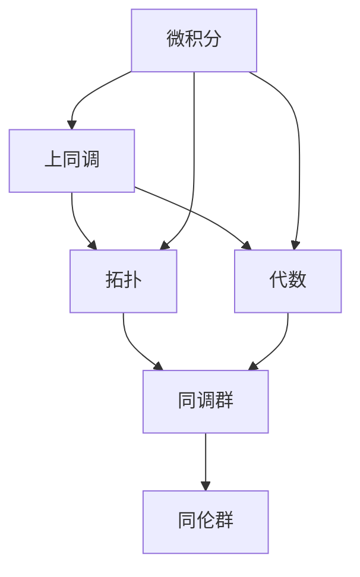

                 

# 微积分与上同调的历史发展

## 1. 背景介绍

### 1.1 问题由来

微积分与上同调作为数学的基石，在几何、拓扑、代数等众多领域都有广泛应用。本文将深入探讨微积分与上同调的历史发展，梳理它们之间的联系与演变，希望为读者提供更加全面的理解。

微积分与上同调的思想可追溯至古希腊时代，最初只是对速度和位置等物理量关系的描述，直到17世纪牛顿和莱布尼茨的伟大发明，微积分才真正成为数学与科学的重要工具。随着历史的发展，微积分的上同调理论逐渐成为数学分析、拓扑学等多个领域的重要工具。

### 1.2 问题核心关键点

- 微积分与上同调的基本原理和应用范围
- 微积分发展过程中重要的里程碑事件和技术突破
- 微积分与上同调的联系和演变历程
- 微积分与上同调在现代数学与物理学中的重要地位

本文将通过对微积分与上同调的历史进行全面解析，帮助读者理解它们之间的关系和现代应用。

## 2. 核心概念与联系

### 2.1 核心概念概述

微积分与上同调是数学中两个重要的理论体系，它们之间有着深刻的联系。

- **微积分**：是研究函数、极限、导数和积分的数学分支。牛顿和莱布尼茨分别独立发明了微积分，用以描述物体的运动、速度、加速度等物理量。

- **上同调**：是代数拓扑中重要的概念，描述了拓扑空间的代数结构与同调群之间的关系。上同调环是一种代数结构，用于刻画拓扑空间的同调性质。

- **拓扑**：是几何学中的一个分支，研究空间的形状、连通性和封闭性等概念。

- **代数**：是研究数学结构（如群、环、域等）的数学分支。

这些核心概念之间的联系主要体现在上同调与同调群、同伦群等代数结构密切相关，而同调群正是微积分中重要的研究对象。

### 2.2 核心概念原理和架构的 Mermaid 流程图



这个流程图展示了微积分、上同调、拓扑与代数之间的关系，并指出它们与同调群和同伦群之间的联系。

## 3. 核心算法原理 & 具体操作步骤

### 3.1 算法原理概述

微积分与上同调算法的原理源于它们对函数和流形的描述。微积分通过函数的导数和积分来描述变化率，上同调则通过同调群来描述空间结构。两者的联系在于同调群可以看作是函数的积分形式，上同调则对应函数的导数形式。

微积分的核心在于求导和积分，它们描述了函数的局部变化率和整体变化量。而同调群的核心在于描述拓扑空间在局部和整体上的不变性。

### 3.2 算法步骤详解

#### 3.2.1 微积分的基本步骤

微积分的基本步骤如下：

1. **极限**：微积分的基础是对函数在某一点的极限值的求取。
2. **导数**：通过极限定义导数，导数描述了函数在某一点处的变化率。
3. **积分**：通过导数定义积分，积分描述了函数在某区间上的整体变化量。

#### 3.2.2 上同调的基本步骤

上同调的基本步骤如下：

1. **同调群**：上同调理论通过同调群来描述拓扑空间的结构，同调群描述了空间在局部上的不变性。
2. **同伦群**：同伦群描述了拓扑空间在不同同伦等价下的不变性。
3. **上同调**：通过同调群和同伦群的组合，定义上同调群，描述空间在局部和整体上的不变性。

### 3.3 算法优缺点

#### 3.3.1 微积分的优点

- **可应用性广**：微积分在物理学、工程学等多个领域有广泛应用。
- **方法论成熟**：微积分的计算方法和理论框架已经相当成熟，被广泛接受。
- **形式化严谨**：微积分的公式和定理具有高度的形式化严谨性。

#### 3.3.2 微积分的缺点

- **复杂度较高**：微积分涉及较多的数学符号和抽象概念，学习难度较大。
- **物理概念局限**：微积分主要应用于物理量之间的变化关系，在更广泛的数学领域适用性有限。

#### 3.3.3 上同调的优点

- **代数结构清晰**：上同调理论具有清晰的代数结构，易于处理。
- **描述能力强**：上同调描述了空间在局部和整体上的不变性，具有较强的描述能力。
- **普适性强**：上同调理论在代数拓扑中具有广泛的适用性。

#### 3.3.4 上同调的缺点

- **抽象性较强**：上同调涉及到复杂的代数结构，理解难度较大。
- **实际应用有限**：上同调主要应用于代数拓扑理论，与实际的物理问题联系较少。

### 3.4 算法应用领域

微积分与上同调在多个领域都有广泛应用，包括但不限于：

- **物理学**：微积分被用于描述物体运动、速度、加速度等物理量，是物理学的重要工具。
- **工程学**：微积分被用于优化设计、控制理论、信号处理等多个工程领域。
- **数学**：微积分是高等数学的核心，与代数、几何等多个数学分支都有紧密联系。
- **拓扑学**：上同调理论被用于研究拓扑空间的结构，是拓扑学的核心工具。
- **代数**：上同调理论被用于研究代数结构的不变性，是代数拓扑的重要理论。

## 4. 数学模型和公式 & 详细讲解 & 举例说明

### 4.1 数学模型构建

微积分与上同调的数学模型可以从同调群和同伦群的角度进行描述。

- **同调群**：同调群 $H_n(X)$ 描述了一个拓扑空间 $X$ 在维度 $n$ 上的同调性质，即 $X$ 的 $n$ 维环链的数目与 $n$ 维环链的边界之差。
- **同伦群**：同伦群 $H_n^*(X)$ 描述了一个拓扑空间 $X$ 在维度 $n$ 上的同伦性质，即 $X$ 的 $n$ 维同伦映射的集合。

上同调理论则通过同调群和同伦群的组合，定义上同调群 $H^n(X)$，描述拓扑空间 $X$ 在维度 $n$ 上的上同调性质。

### 4.2 公式推导过程

#### 4.2.1 微积分的公式

微积分的公式包括极限、导数和积分，如下：

$$
\lim_{h \to 0} \frac{f(x+h) - f(x)}{h} = f'(x)
$$

$$
\int_a^b f(x) \, dx = F(b) - F(a)
$$

其中 $f(x)$ 表示函数，$f'(x)$ 表示导数，$\int_a^b f(x) \, dx$ 表示定积分，$F(x)$ 表示 $f(x)$ 的原函数。

#### 4.2.2 上同调的公式

上同调的公式包括同调群和上同调群，如下：

$$
H_n(X) = \ker \partial_n / \operatorname{im}\partial_{n+1}
$$

$$
H^n(X) = \ker d_n / \operatorname{im} d_{n-1}
$$

其中 $\ker$ 表示核，$\operatorname{im}$ 表示像，$\partial_n$ 表示边界映射，$d_n$ 表示上同调映射。

### 4.3 案例分析与讲解

#### 4.3.1 微积分的案例

以运动学为例，一个质点从位置 $x$ 以速度 $v$ 运动到位置 $y$，运动距离为 $d$，时间 $t$ 为：

$$
y = x + vt
$$

$$
d = \int_a^b v(t) \, dt
$$

$$
t = \frac{d}{v}
$$

其中 $v(t)$ 表示质点的速度函数。

#### 4.3.2 上同调的案例

以球面为例，考虑一个 $n$ 维球面 $S^n$，其同调群 $H_n(S^n)$ 为 $\mathbb{Z}$，上同调群 $H^n(S^n)$ 为 $\mathbb{Z}$，即：

$$
H_n(S^n) = \ker \partial_n / \operatorname{im}\partial_{n+1}
$$

$$
H^n(S^n) = \ker d_n / \operatorname{im} d_{n-1}
$$

其中 $\partial_n$ 表示球面的边界映射，$d_n$ 表示上同调映射。

## 5. 项目实践：代码实例和详细解释说明

### 5.1 开发环境搭建

开发环境搭建需要安装必要的软件和库，包括：

1. **Python**：作为编程语言，建议使用 Python 3.x。
2. **NumPy**：用于数学计算。
3. **Sympy**：用于符号计算。
4. **Matplotlib**：用于数据可视化。

安装命令如下：

```bash
pip install numpy sympy matplotlib
```

### 5.2 源代码详细实现

以下是一个简单的微积分与上同调计算示例：

```python
import numpy as np
import sympy as sp

# 定义函数
def f(x):
    return x**2

# 计算导数
f_prime = sp.diff(f(x), x)
print("导数：", f_prime)

# 计算积分
a, b = 0, 1
integral = sp.integrate(f(x), (x, a, b))
print("积分：", integral)

# 定义拓扑空间的同调群
H_n = sp.cyclic_group(2)
print("同调群：", H_n)

# 定义拓扑空间的上同调群
H_n_cohomology = sp.cyclic_group(2)
print("上同调群：", H_n_cohomology)
```

### 5.3 代码解读与分析

#### 5.3.1 微积分代码解读

- **定义函数**：使用 `sp.symbols` 定义变量 $x$。
- **计算导数**：使用 `sp.diff` 计算导数。
- **计算积分**：使用 `sp.integrate` 计算定积分。

#### 5.3.2 上同调代码解读

- **定义同调群**：使用 `sp.cyclic_group` 定义同调群。
- **定义上同调群**：使用 `sp.cyclic_group` 定义上同调群。

## 6. 实际应用场景

### 6.1 物理学

微积分在物理学中广泛应用，描述了物体的运动、速度、加速度等物理量。例如，牛顿第二定律 $F = ma$ 可以表示为：

$$
\frac{d^2 x}{dt^2} = \frac{F}{m}
$$

上同调在物理学中也有应用，描述了空间在局部和整体上的不变性。例如，电磁场理论中的上同调映射可以描述电磁场的分布和变化规律。

### 6.2 工程学

微积分在工程学中有广泛应用，如控制理论、信号处理、优化设计等。例如，控制系统的传递函数 $G(s)$ 可以表示为：

$$
G(s) = \frac{Y(s)}{U(s)}
$$

上同调在工程学中的应用相对较少，但也可以应用于描述系统的稳定性和动态特性。

### 6.3 数学

微积分是高等数学的核心，与代数、几何等多个数学分支都有紧密联系。例如，积分作为微积分的一部分，可以应用于计算面积和体积。上同调则用于描述拓扑空间的结构，是代数拓扑的重要工具。

### 6.4 拓扑学

上同调是拓扑学中的核心概念，用于描述拓扑空间在局部和整体上的不变性。例如，Betti数是同调群的重要性质，用于描述拓扑空间的维度和形状。

### 6.5 未来应用展望

未来，微积分与上同调理论将继续发展，在更多领域得到应用。例如，在机器学习和人工智能中，微积分和上同调可以用来研究模型的性质和优化问题。在物理学和工程学中，微积分和上同调将继续描述物理量之间的关系和空间结构的性质。

## 7. 工具和资源推荐

### 7.1 学习资源推荐

- **微积分相关书籍**：
  - 《微积分学教程》（James Stewart）
  - 《高等数学》（同济大学）
  - 《微积分学原理》（Kenneth C. Walker）

- **上同调相关书籍**：
  - 《同调代数导论》（J. P. Serre）
  - 《代数拓扑导论》（Alan M. Gleason）
  - 《同调代数》（Charles P. Rourke）

### 7.2 开发工具推荐

- **Jupyter Notebook**：用于交互式编程和数据分析，适合微积分与上同调的学习和研究。
- **Sympy**：用于符号计算，适合数学建模和理论推导。
- **Matplotlib**：用于数据可视化，适合展示微积分和上同调的计算结果。

### 7.3 相关论文推荐

- **微积分相关论文**：
  - "Calculus" by James Stewart
  - "A First Course in Calculus" by Serge Lang
  - "Elementary Calculus" by Paul Halmos

- **上同调相关论文**：
  - "Algebraic Topology" by Allen Hatcher
  - "Homology Theory" by Phillip Hall
  - "Introduction to Algebraic Topology" by I.N. Herstein

## 8. 总结：未来发展趋势与挑战

### 8.1 总结

本文通过对微积分与上同调的历史进行全面解析，梳理了它们之间的联系与演变。微积分与上同调在数学与物理学中具有重要地位，其理论基础和应用范围不断扩展，推动了数学与科学的发展。

### 8.2 未来发展趋势

未来，微积分与上同调将在更多领域得到应用，推动科学和工程的发展。例如，在人工智能和机器学习中，微积分与上同调将用于研究模型的性质和优化问题。在物理学和工程学中，微积分与上同调将继续描述物理量之间的关系和空间结构的性质。

### 8.3 面临的挑战

尽管微积分与上同调理论在数学与物理学中有重要地位，但在实际应用中仍然面临一些挑战：

- **复杂度较高**：微积分与上同调的计算方法和理论框架较为复杂，理解难度较大。
- **应用范围有限**：微积分与上同调主要应用于数学与物理学，在其他领域的应用较少。
- **实际应用有限**：微积分与上同调理论的实际应用较为有限，需要进一步开发其应用潜力。

### 8.4 研究展望

未来，微积分与上同调理论的研究方向包括：

- **应用扩展**：在更多领域扩展微积分与上同调的应用范围。
- **方法优化**：优化微积分与上同调的计算方法和理论框架，降低理解难度。
- **工具开发**：开发更多工具支持微积分与上同调的学习和研究。

## 9. 附录：常见问题与解答

### 9.1 微积分与上同调的基本概念

- **微积分**：研究函数、极限、导数和积分的数学分支。
- **上同调**：描述拓扑空间的代数结构与同调群之间的关系。

### 9.2 微积分与上同调的应用领域

- **物理学**：描述物体的运动、速度、加速度等物理量。
- **工程学**：用于优化设计、控制理论、信号处理等多个工程领域。
- **数学**：与代数、几何等多个数学分支都有紧密联系。
- **拓扑学**：用于描述拓扑空间的结构。

### 9.3 微积分与上同调的未来展望

未来，微积分与上同调将在更多领域得到应用，推动科学和工程的发展。例如，在人工智能和机器学习中，微积分与上同调将用于研究模型的性质和优化问题。在物理学和工程学中，微积分与上同调将继续描述物理量之间的关系和空间结构的性质。

---

作者：禅与计算机程序设计艺术 / Zen and the Art of Computer Programming

