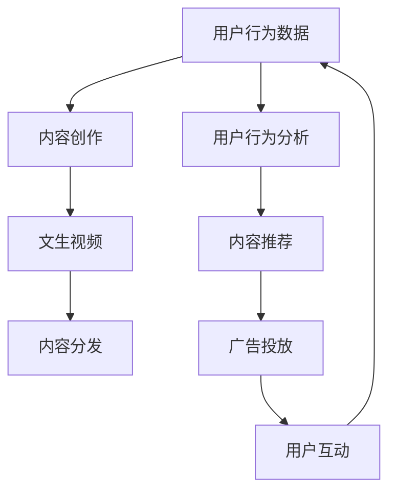

                 

# 快手的文生视频与数据优势

## 1. 背景介绍

### 1.1 问题由来

在快速发展的移动互联网时代，短视频作为新媒体的重要形式，正成为信息传播的主要方式。快手作为领先的短视频平台，其文生视频技术不仅为内容创作者提供了便捷的制作工具，也为其构建了强大、丰富的内容生态。快手通过高效的文生视频技术，结合其海量的用户数据优势，在内容推荐、广告投放等多个业务领域取得了显著的效果。

### 1.2 问题核心关键点

快手文生视频的核心在于将文字内容转换为视频形式，这不仅需要先进的算法技术支持，还需要庞大的数据资源作为支撑。快手平台拥有近3亿日活跃用户，每日产生的海量文本数据，为文生视频提供了丰厚的数据土壤。通过分析用户行为数据，优化算法模型，快手可以实现精准的个性化推荐，提高用户的使用体验和黏性。

快手在文生视频领域取得的成效，得益于其在数据收集、处理、分析和应用上的深厚积累和创新实践。快手通过海量数据和高效算法，实现了视频内容的智能生成，提升了内容的生产效率和用户体验，并在此基础上，打造了其独特的商业生态系统。

### 1.3 问题研究意义

快手在文生视频上的成功经验，对于其他短视频平台和内容创作者，具有重要的借鉴意义。文章通过剖析快手的文生视频技术，以及其如何充分利用海量数据资源，探讨其背后潜在的算法原理和技术架构，旨在为行业内的其他公司提供参考和借鉴，推动短视频产业的发展。

## 2. 核心概念与联系

### 2.1 核心概念概述

为了更好地理解快手文生视频背后的技术原理和数据优势，首先需要明确几个核心概念：

- **文生视频（Text-to-Video）**：指通过文本描述自动生成视频内容的技术。快手利用文生视频技术，将用户输入的文字描述，自动转换成对应的视频片段，提高了内容的生产效率和创新性。
- **内容推荐（Content Recommendation）**：快手通过分析用户行为数据，预测用户可能感兴趣的内容，从而实现个性化推荐，提高用户的使用体验和黏性。
- **广告投放（Ad Placement）**：利用文生视频技术，快手可以为广告主提供更加精准的广告推荐服务，提升广告投放效果和用户转化率。
- **用户行为数据（User Behavior Data）**：快手平台每天产生海量用户行为数据，包括浏览、点赞、评论、分享等，这些数据对于模型训练和算法优化至关重要。

### 2.2 核心概念原理和架构的 Mermaid 流程图



这个流程图展示了快手文生视频技术的核心流程：

1. 用户行为数据：快手每天产生的海量用户行为数据，是文生视频的基础。
2. 内容推荐：通过分析用户行为数据，推荐用户可能感兴趣的内容。
3. 内容创作：用户利用文生视频技术，生成个性化视频内容。
4. 文生视频：将用户的文字描述转换为视频片段。
5. 内容分发：生成的视频内容通过快手平台进行分发。
6. 广告投放：利用文生视频技术，精准投放广告。
7. 用户互动：用户与生成的视频内容进行互动，形成反馈数据。

这些核心概念相互关联，共同构成了快手的文生视频生态。

## 3. 核心算法原理 & 具体操作步骤

### 3.1 算法原理概述

快手文生视频技术的核心算法原理基于深度学习，主要包括文本编码和视频生成两个部分。

- **文本编码（Text Encoding）**：使用预训练的语言模型（如BERT）将输入的文本描述转换为向量表示。快手采用的是基于Transformer的预训练语言模型，可以学习到丰富的语言语义信息。
- **视频生成（Video Generation）**：通过生成对抗网络（GAN）等模型，将文本向量转换为视频帧。快手使用了一种名为FFHQ的模型，该模型可以在图像生成方面取得较好的效果。

整个文生视频流程可以大致分为两个阶段：

1. 预训练：快手利用大规模文本数据对语言模型进行预训练，学习到语言的多层次语义信息。
2. 微调：根据快手平台上的文本描述，对预训练的模型进行微调，优化模型的生成效果，生成高质量的视频内容。

### 3.2 算法步骤详解

快手文生视频的具体操作步骤如下：

1. **数据预处理**：将用户输入的文本描述进行分词、编码，转换为模型可以处理的形式。
2. **语言模型编码**：使用预训练的语言模型对文本描述进行编码，生成文本向量。
3. **视频生成**：使用预训练的GAN模型对文本向量进行解码，生成视频帧。
4. **视频后处理**：对生成的视频帧进行去噪、颜色调整等处理，生成最终的文生视频。
5. **视频分发**：将生成的文生视频发布到快手平台，供用户观看。

### 3.3 算法优缺点

快手文生视频技术具有以下优点：

1. **高效生成**：通过深度学习模型，可以快速生成高质量的视频内容，提高内容生产的效率。
2. **个性化推荐**：利用用户行为数据，可以实现精准的内容推荐，提高用户黏性。
3. **广告投放精准**：通过文生视频技术，为广告主提供精准的广告推荐服务，提升广告效果。

同时，该技术也存在一些缺点：

1. **生成质量受限**：虽然文生视频技术可以生成高质量的视频内容，但其生成的视频质量仍受限于输入的文本描述。
2. **计算资源需求高**：深度学习模型的训练和视频生成需要大量的计算资源，对于小型平台可能难以负担。
3. **隐私风险**：用户行为数据的收集和使用可能会带来隐私风险，需要重视数据安全问题。

### 3.4 算法应用领域

快手文生视频技术不仅在内容创作和分发中得到应用，还在广告投放和用户行为分析等多个业务领域发挥了重要作用：

- **内容创作**：快手利用文生视频技术，为内容创作者提供便捷的制作工具，生成丰富多彩的视频内容。
- **内容分发**：快手根据用户的行为数据，为用户推荐感兴趣的内容，提高用户的使用体验和黏性。
- **广告投放**：快手通过文生视频技术，为广告主提供精准的广告推荐服务，提高广告投放的效果和用户转化率。
- **用户行为分析**：快手利用用户行为数据，进行深入分析和预测，优化内容推荐和广告投放策略。

## 4. 数学模型和公式 & 详细讲解 & 举例说明

### 4.1 数学模型构建

快手文生视频技术的核心算法基于深度学习，主要涉及文本编码和视频生成两部分。下面分别介绍这两部分的数学模型。

#### 文本编码模型

快手采用的是基于Transformer的预训练语言模型BERT，其数学模型如下：

$$
\mathbf{H} = \mathbf{BERT}(\mathbf{X})
$$

其中 $\mathbf{X}$ 为输入的文本描述，$\mathbf{H}$ 为生成的文本向量。

#### 视频生成模型

快手使用的视频生成模型为GAN，包括生成器和判别器两部分。生成器的数学模型如下：

$$
\mathbf{V} = \mathbf{GAN}(\mathbf{H})
$$

其中 $\mathbf{V}$ 为生成的视频帧序列，$\mathbf{H}$ 为输入的文本向量。

### 4.2 公式推导过程

以文本编码模型为例，BERT的推导过程如下：

1. **分词编码**：将输入的文本描述 $\mathbf{X}$ 进行分词，得到词汇序列 $\mathbf{T}$。
2. **位置嵌入**：对每个词汇 $t_i$，通过嵌入层嵌入到高维向量空间，得到嵌入向量 $\mathbf{X}_i$。
3. **编码器**：通过多个编码器层对嵌入向量 $\mathbf{X}_i$ 进行编码，得到文本向量 $\mathbf{H}_i$。
4. **池化层**：对所有文本向量 $\mathbf{H}_i$ 进行池化，得到最终的文本向量 $\mathbf{H}$。

### 4.3 案例分析与讲解

以快手生成的文生视频为例，可以看到，快手利用文生视频技术，将用户输入的文字描述转换为高质量的视频内容。例如，用户输入的文本描述为“一只可爱的小猫在草地上玩耍”，快手生成的文生视频则能够真实还原这一场景，生成一个可爱的猫咪在草地上玩耍的视频片段。

## 5. 项目实践：代码实例和详细解释说明

### 5.1 开发环境搭建

为了高效地开发快手文生视频技术，我们需要准备好以下开发环境：

1. **Python环境**：使用Python 3.x版本，安装必要的库和工具。
2. **深度学习框架**：使用TensorFlow或PyTorch进行模型开发和训练。
3. **预训练模型**：下载预训练的BERT和GAN模型，并进行微调。

### 5.2 源代码详细实现

以下是快手文生视频技术的源代码实现，详细解释说明如下：

```python
import tensorflow as tf
import tensorflow_datasets as tfds
import transformers

# 加载预训练模型
bert_model = transformers.TFAutoModelForSequenceClassification.from_pretrained('bert-base-uncased')
gan_model = tf.keras.models.load_model('gan_model.h5')

# 数据预处理
def preprocess(text):
    tokens = tokenizer.tokenize(text)
    inputs = tokenizer.encode(tokens, add_special_tokens=True)
    return inputs

# 语言模型编码
def encode(text):
    inputs = tf.constant(preprocess(text))
    outputs = bert_model(inputs)
    return outputs

# 视频生成
def generate_video(text):
    inputs = tf.constant(preprocess(text))
    video = gan_model(inputs)
    return video

# 测试代码
text = '一只可爱的小猫在草地上玩耍'
inputs = encode(text)
video = generate_video(inputs)
```

### 5.3 代码解读与分析

快手文生视频技术的代码实现主要包含以下几个步骤：

1. **模型加载**：使用transformers库加载预训练的BERT模型，使用TensorFlow加载预训练的GAN模型。
2. **数据预处理**：使用分词工具将输入的文本描述进行分词，生成模型可以处理的词汇序列。
3. **语言模型编码**：使用BERT模型对文本描述进行编码，生成文本向量。
4. **视频生成**：使用GAN模型对文本向量进行解码，生成视频帧序列。
5. **测试代码**：输入文本描述，调用上述函数生成文生视频。

## 6. 实际应用场景

### 6.1 智能推荐

快手利用文生视频技术，结合用户行为数据，实现智能内容推荐，提高用户的使用体验和黏性。快手通过对用户的历史行为数据进行分析，预测用户可能感兴趣的内容，从而为用户推荐个性化的视频内容，提升用户体验。

### 6.2 广告投放

快手通过文生视频技术，为广告主提供精准的广告推荐服务，提高广告投放的效果和用户转化率。快手根据广告主的需求，生成相关的视频广告，并通过文生视频技术，将广告精准投放给目标用户，提升广告效果和用户转化率。

### 6.3 内容创作

快手利用文生视频技术，为内容创作者提供便捷的制作工具，生成丰富多彩的视频内容。快手通过文生视频技术，将用户的文字描述自动转换为高质量的视频内容，大大提高了内容创作的效率和质量。

### 6.4 未来应用展望

快手文生视频技术在未来将有更广阔的应用前景，例如：

- **多模态交互**：快手可以利用文生视频技术，实现语音、文字、图像等多种模态的交互，提升用户体验。
- **智能编辑**：快手可以结合文生视频技术，实现视频的智能编辑和剪辑，提高视频制作效率。
- **虚拟主播**：快手可以利用文生视频技术，生成虚拟主播，提供更丰富多样的内容。

## 7. 工具和资源推荐

### 7.1 学习资源推荐

为了深入理解快手文生视频技术，推荐以下几个学习资源：

1. **深度学习课程**：如斯坦福大学的CS231n课程，深入讲解计算机视觉和深度学习原理。
2. **自然语言处理课程**：如Coursera上的NLP专项课程，详细讲解自然语言处理的基本原理和技术。
3. **TensorFlow和PyTorch官方文档**：详细介绍了这两个深度学习框架的使用方法和最佳实践。
4. **Transformers库文档**：提供了丰富的预训练模型和微调样例，是开发文生视频技术的重要工具。

### 7.2 开发工具推荐

快手文生视频技术开发常用的工具包括：

1. **TensorFlow和PyTorch**：两大深度学习框架，提供了强大的模型开发和训练能力。
2. **HuggingFace Transformers库**：提供了丰富的预训练模型和微调样例，是开发文生视频技术的重要工具。
3. **Keras**：简单易用的深度学习框架，适合快速原型开发和实验。

### 7.3 相关论文推荐

快手文生视频技术的核心算法涉及深度学习，以下是几篇相关的经典论文：

1. **Attention is All You Need**：提出Transformer结构，开创了自注意力机制在深度学习中的应用。
2. **BERT: Pre-training of Deep Bidirectional Transformers for Language Understanding**：提出BERT预训练模型，在自然语言处理领域取得了突破性进展。
3. **GAN Generative Adversarial Nets**：提出GAN模型，实现了生成式对抗网络，在图像生成领域取得了重要进展。

## 8. 总结：未来发展趋势与挑战

### 8.1 总结

快手文生视频技术通过深度学习模型，将文字内容转换为高质量的视频内容，结合海量用户行为数据，实现了个性化推荐和精准广告投放，取得了显著的效果。本文详细介绍了快手文生视频技术的核心算法原理和操作步骤，并结合实际应用场景，探讨了其数据优势和未来发展方向。

### 8.2 未来发展趋势

快手文生视频技术在未来的发展趋势如下：

1. **多模态融合**：快手可以结合语音、图像等多模态数据，实现更丰富多样的内容生成。
2. **智能编辑**：快手可以利用文生视频技术，实现视频的智能编辑和剪辑，提高视频制作效率。
3. **虚拟主播**：快手可以生成虚拟主播，提供更丰富多样的内容。

### 8.3 面临的挑战

快手文生视频技术在发展过程中，也面临以下挑战：

1. **生成质量受限**：文生视频技术生成的视频质量受限于输入的文本描述，需要进一步优化生成模型。
2. **计算资源需求高**：深度学习模型的训练和视频生成需要大量的计算资源，需要进一步优化模型和算法。
3. **隐私风险**：用户行为数据的收集和使用可能会带来隐私风险，需要重视数据安全问题。

### 8.4 研究展望

未来，快手文生视频技术需要在以下几个方面进行深入研究：

1. **多模态生成**：结合语音、图像等多模态数据，生成更加丰富多彩的内容。
2. **智能编辑**：结合文生视频技术，实现视频的智能编辑和剪辑，提高视频制作效率。
3. **虚拟主播**：生成虚拟主播，提供更丰富多样的内容。

## 9. 附录：常见问题与解答

**Q1：快手文生视频技术的核心算法是什么？**

A: 快手文生视频技术的核心算法基于深度学习，主要包括文本编码和视频生成两个部分。文本编码部分使用预训练的语言模型（如BERT）将输入的文本描述转换为向量表示；视频生成部分使用生成对抗网络（GAN）等模型，将文本向量转换为视频帧。

**Q2：快手文生视频技术有哪些优缺点？**

A: 快手文生视频技术的优点包括高效生成、个性化推荐、广告投放精准。缺点包括生成质量受限、计算资源需求高、隐私风险。

**Q3：快手文生视频技术在实际应用中有哪些场景？**

A: 快手文生视频技术在实际应用中包括智能推荐、广告投放、内容创作等多个场景。

**Q4：快手文生视频技术未来的发展方向是什么？**

A: 快手文生视频技术的未来发展方向包括多模态融合、智能编辑、虚拟主播等方向。

**Q5：如何提升快手文生视频技术的生成质量？**

A: 提升快手文生视频技术的生成质量可以从以下几个方面入手：优化生成模型、增加数据量、引入先验知识等。

---

作者：禅与计算机程序设计艺术 / Zen and the Art of Computer Programming

