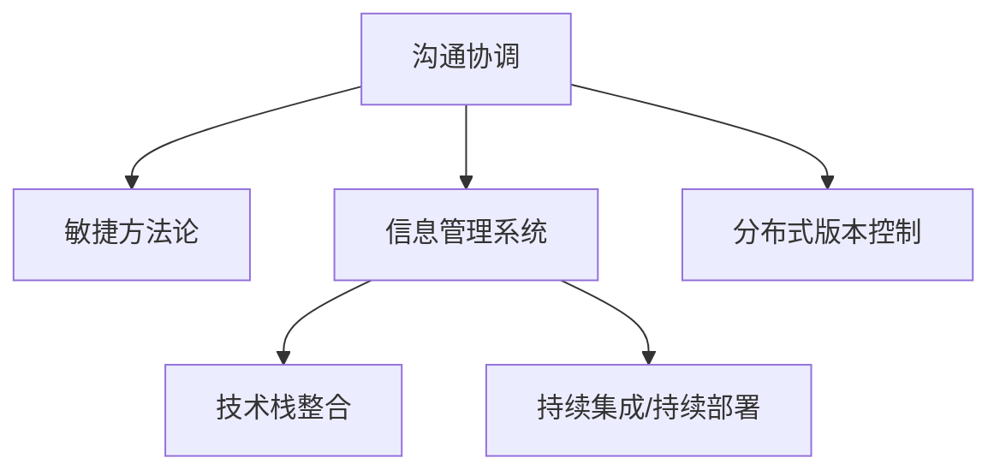

                 

# 怎样培养跨部门沟通协调能力

在快速发展的技术环境中，跨部门沟通协调能力已成为团队成功的关键。无论是在软件开发、项目管理还是产品管理中，高效沟通和紧密协作都是驱动项目成功和创新的重要因素。本文将深入探讨如何培养跨部门沟通协调能力，并通过具体的技术和实践案例，展示如何运用技术工具和策略实现这一目标。

## 1. 背景介绍

### 1.1 问题由来

在当今的信息时代，技术的进步使得各个部门之间的工作越来越多地交织在一起。跨部门沟通协调能力不仅涉及人际交往技巧，还涉及技术工具和流程的有效运用。技术团队，如开发、运维和质量保障，需要与业务团队，如市场、销售和客户支持，紧密合作，共同推动产品开发和市场推广。

然而，跨部门合作往往面临以下挑战：

- **信息不对称**：不同部门之间对项目的理解和技术背景可能存在差异，导致信息传递不畅。
- **目标不一致**：不同部门可能基于不同的目标和优先级，难以达成一致意见。
- **沟通障碍**：语言、术语和流程的不一致可能导致误解和效率低下。

### 1.2 问题核心关键点

提升跨部门沟通协调能力的关键在于构建透明的信息共享机制、明确的目标对齐和有效的协作流程。这不仅依赖于人际交往技巧，还需要借助技术工具和方法论来实现。

## 2. 核心概念与联系

### 2.1 核心概念概述

为更好地理解跨部门沟通协调的机制，本节将介绍几个密切相关的核心概念：

- **沟通协调**：涉及不同部门间的信息传递、意见交换和决策协同。
- **敏捷方法论**：如Scrum、Kanban等，通过迭代和跨部门协作，快速响应变化。
- **信息管理系统**：如Confluence、JIRA等，提供统一的信息共享和任务跟踪平台。
- **技术栈整合**：通过API、中间件等技术手段，实现不同系统之间的数据和功能整合。
- **持续集成/持续部署(CI/CD)**：自动化软件开发和部署流程，提高协作效率。
- **分布式版本控制**：如Git，支持团队成员协作编写代码和管理版本。

这些概念之间的逻辑关系可以通过以下Mermaid流程图来展示：

这个流程图展示了跨部门沟通协调涉及的关键概念及其相互关系：

1. **沟通协调**：是敏捷方法论、信息管理系统、技术栈整合、持续集成/持续部署和分布式版本控制的基础。
2. **敏捷方法论**：通过迭代和协作，提升沟通协调的效率和灵活性。
3. **信息管理系统**：提供协作和信息共享的平台。
4. **技术栈整合**：通过技术手段实现系统间的协同。
5. **持续集成/持续部署**：自动化流程，提高协作效率。
6. **分布式版本控制**：支持多人协作，管理版本冲突。

## 3. 核心算法原理 & 具体操作步骤

### 3.1 算法原理概述

跨部门沟通协调的核心在于构建一个高效的沟通和协作框架，使不同部门能够在一个统一的平台上进行信息交换和决策。这一框架通常包括以下几个关键组成部分：

1. **明确目标**：确保所有部门对项目的共同目标有清晰的理解。
2. **透明沟通**：建立一个开放的信息共享机制，使所有团队成员都能获取所需信息。
3. **协同工作**：通过工具和方法论，促进团队成员的紧密协作。
4. **持续反馈**：定期收集反馈，不断改进沟通协调的流程和工具。

### 3.2 算法步骤详解

基于上述原理，跨部门沟通协调的步骤可以概括为：

1. **定义项目目标和角色**：明确项目目标，定义各部门的职责和贡献。
2. **选择沟通工具和平台**：根据需求选择适合的信息管理系统和协作工具。
3. **建立沟通流程**：设计跨部门的沟通和协作流程，包括会议、文档和任务跟踪。
4. **培训和文档编写**：为团队成员提供必要的培训和编写清晰的文档。
5. **启动和迭代**：开始项目实施，并在实施过程中不断优化沟通协调的流程。

### 3.3 算法优缺点

跨部门沟通协调的方法具有以下优点：

1. **提高效率**：通过透明的信息共享和协同工作，减少重复工作和沟通成本。
2. **增强协作**：促进不同部门之间的合作，提升整体团队的凝聚力。
3. **适应变化**：通过敏捷方法论和持续集成，快速响应项目变化和需求变更。
4. **提升质量**：通过定期的反馈和改进，持续提升项目质量。

同时，该方法也存在一定的局限性：

1. **文化差异**：不同部门之间可能存在文化差异，导致沟通障碍。
2. **协调成本**：跨部门的协调可能需要额外的资源和时间投入。
3. **信息过载**：信息共享过多可能导致信息过载，影响工作效率。
4. **工具依赖**：过度依赖特定工具可能带来一定的风险和灵活性问题。

尽管存在这些局限性，但就目前而言，跨部门沟通协调方法已成为提高团队效率和创新能力的有效手段。未来相关研究的重点在于如何进一步降低协调成本，提高文化适应性，减少信息过载，增强工具的灵活性。

### 3.4 算法应用领域

跨部门沟通协调方法不仅适用于软件开发团队，也广泛应用于项目管理和产品管理中。以下是一些典型的应用场景：

- **软件开发**：通过敏捷开发方法，提高团队协作和响应变化的能力。
- **项目管理**：使用甘特图和看板等工具，规划和管理项目进度和任务。
- **产品管理**：通过产品路线图和用户反馈，指导产品开发和市场推广。
- **客户支持**：通过知识库和协作平台，提升客户支持和问题解决效率。

除了上述这些经典场景外，跨部门沟通协调方法还在人力资源管理、市场运营、财务审计等众多领域得到了应用，为组织协作带来了新的思路和效率提升。

## 4. 数学模型和公式 & 详细讲解 & 举例说明

### 4.1 数学模型构建

为了更好地理解跨部门沟通协调的过程，我们可以从信息传递的角度构建数学模型。假设部门A和部门B需要协同完成一个任务，信息的传递可以通过以下模型来描述：

- **信息传递速率**：表示部门之间信息传递的速度和效率。
- **信息准确性**：表示信息在传递过程中保持准确性的程度。
- **信息完整性**：表示信息在传递过程中未被遗漏的程度。
- **信息延迟**：表示信息从发出到接收所需的时间。

我们可以定义信息传递效率的函数：

$$
E = f(I_r, I_a, I_c, D)
$$

其中，$I_r$ 为信息传递速率，$I_a$ 为信息准确性，$I_c$ 为信息完整性，$D$ 为信息延迟。

### 4.2 公式推导过程

为了简化问题，我们假设信息传递速率和准确性成正比，完整性和延迟成反比，则信息传递效率的函数可以简化为：

$$
E = k(I_r + \frac{1}{I_c}) - \frac{D}{I_a}
$$

其中，$k$ 为比例系数，表示信息传递速率和准确性的影响程度。

通过推导，我们可以看到，信息传递速率和准确性越高，信息完整性越好，信息延迟越小，信息传递效率越高。因此，提高跨部门沟通协调的效率，需要从这些方面入手。

### 4.3 案例分析与讲解

考虑一个软件开发项目的例子，部门A负责需求分析，部门B负责开发，部门C负责测试。在需求传递过程中，信息传递速率和准确性直接影响开发和测试的质量和效率。信息完整性决定了需求描述的详细程度，而信息延迟则反映了沟通的效率。

假设部门A的需求描述信息完整性为0.9，传递速率和准确性分别为0.8和0.95，信息延迟为1天。根据公式，我们可以计算出信息传递效率：

$$
E = k(0.8 + \frac{1}{0.9}) - \frac{1}{0.95}
$$

通过调节信息传递速率、准确性和完整性，可以进一步优化信息传递效率，提高项目的整体协同效率。

## 5. 项目实践：代码实例和详细解释说明

### 5.1 开发环境搭建

在进行跨部门沟通协调的实践前，我们需要准备好开发环境。以下是使用JIRA和Git进行项目管理和代码协作的环境配置流程：

1. 安装JIRA：从官网下载并安装JIRA，用于任务管理和协作。
2. 安装Git：从官网下载并安装Git，用于分布式版本控制和代码协作。
3. 配置环境变量：设置JIRA和Git的用户名和密码，以便进行身份验证。

### 5.2 源代码详细实现

我们使用JIRA和Git进行项目管理和代码协作，以下是具体的实现步骤：

1. 创建JIRA项目：在JIRA上创建一个新的项目，定义项目的任务类型和流程。
2. 配置Git仓库：在GitHub上创建新的仓库，并配置项目的版本控制和协作功能。
3. 设置代码Review流程：在JIRA中定义代码Review的规则和步骤，确保代码质量。
4. 进行代码编写和Review：团队成员在Git上进行代码编写，提交代码后进行Review，确保代码质量。
5. 进行任务跟踪和反馈：在JIRA中跟踪任务进度，收集反馈，不断优化沟通和协作流程。

### 5.3 代码解读与分析

让我们再详细解读一下关键代码的实现细节：

**JIRA项目创建**：
- 在JIRA上创建新的项目，设置项目名称、描述、负责人和分配组。
- 定义任务类型和流程，如Bug、Feature、Task等，以及任务状态和优先级。

**Git仓库配置**：
- 在GitHub上创建新的仓库，并添加README.md文件，描述项目背景和贡献指南。
- 配置项目的版本控制和协作功能，如分支策略、Pull Request、Code Review等。

**代码Review流程**：
- 在JIRA中定义代码Review的规则和步骤，如代码提交、Review请求、Review反馈等。
- 团队成员在Git上进行代码编写，并在JIRA中提交Review请求。
- 负责Review的成员在JIRA中接收Review请求，对代码进行Review，并反馈修改意见。

**任务跟踪和反馈**：
- 在JIRA中跟踪任务进度，记录任务的状态和优先级。
- 定期收集反馈，分析任务执行效率和沟通协调效果，不断优化流程。

### 5.4 运行结果展示

运行上述流程后，我们将在JIRA中看到任务跟踪和进度展示，在Git中看到代码的版本变化和Review记录。通过JIRA和Git的协同工作，我们可以实现高效的跨部门沟通协调。

## 6. 实际应用场景

### 6.1 软件开发

跨部门沟通协调方法在软件开发中得到广泛应用，特别是在敏捷开发和DevOps实践中。敏捷开发通过Scrum和Kanban方法，提高了团队协作和响应变化的能力。DevOps通过持续集成和持续部署(CI/CD)，实现了自动化开发和部署流程。

### 6.2 项目管理

项目管理中，跨部门沟通协调方法通过甘特图和看板等工具，规划和管理项目进度和任务。使用JIRA等协作平台，可以实现任务分配、进度跟踪和团队协作。

### 6.3 产品管理

产品管理中，跨部门沟通协调方法通过产品路线图和用户反馈，指导产品开发和市场推广。使用Confluence等协作工具，可以记录和共享产品文档和需求分析。

### 6.4 未来应用展望

随着技术的发展，跨部门沟通协调方法将进一步扩展和优化。未来可能的应用趋势包括：

- **AI辅助协作**：使用AI技术辅助跨部门沟通，如自动生成文档、智能任务分配等。
- **跨部门数据共享**：通过数据湖和API技术，实现跨部门的数据共享和协同工作。
- **多渠道协作**：通过微信、钉钉等即时通讯工具，实现跨部门的即时沟通和协作。
- **协同工具集成**：通过API集成，将不同的协作工具和系统进行整合，形成一个统一的工作平台。

## 7. 工具和资源推荐

### 7.1 学习资源推荐

为了帮助开发者掌握跨部门沟通协调的理论基础和实践技巧，这里推荐一些优质的学习资源：

1. **敏捷开发指南**：由敏捷专家撰写，介绍敏捷开发方法和最佳实践，帮助团队提升协作效率。
2. **项目管理最佳实践**：涵盖项目管理中的各种工具和技术，如甘特图、看板、Kanban等，帮助团队有效管理项目。
3. **Scrum敏捷指南**：详细介绍了Scrum敏捷开发框架，包括Scrum Master、Product Owner等角色和职责。
4. **Git官方文档**：Git官方提供的详细文档，涵盖Git的基础知识和高级用法。
5. **JIRA官方文档**：JIRA官方提供的详细文档，涵盖JIRA的功能和使用指南。

通过对这些资源的学习实践，相信你一定能够掌握跨部门沟通协调的理论基础和实践技巧，并用于解决实际的沟通和协作问题。

### 7.2 开发工具推荐

高效的开发离不开优秀的工具支持。以下是几款用于跨部门沟通协调开发的常用工具：

1. **JIRA**：用于任务管理和协作的敏捷工具，支持Scrum和Kanban等敏捷方法论。
2. **Confluence**：用于文档协作和知识共享的平台，支持创建、编辑和共享Wiki页面。
3. **Slack**：用于即时沟通和协作的工具，支持团队成员的实时交流和文件共享。
4. **Trello**：用于任务管理和看板协作的工具，适合敏捷开发和项目管理。
5. **Git**：用于分布式版本控制和代码协作的工具，支持多人协作编写代码和管理版本。

合理利用这些工具，可以显著提升跨部门沟通协调的开发效率，加快创新迭代的步伐。

### 7.3 相关论文推荐

跨部门沟通协调技术的发展源于学界的持续研究。以下是几篇奠基性的相关论文，推荐阅读：

1. **敏捷开发宣言**：Agile Manifesto，介绍了敏捷开发的核心理念和原则，为敏捷实践提供了指导。
2. **DevOps实践指南**：The DevOps Handbook，详细介绍了DevOps的最佳实践和工具，帮助团队实现持续集成和持续部署。
3. **敏捷项目管理**：Agile Project Management with Scrum，介绍Scrum敏捷项目管理的理论和方法，帮助团队提升项目管理能力。
4. **Git基础教程**：Pro Git，Git官方提供的详细教程，帮助开发者掌握Git的基础知识和高级用法。
5. **JIRA指南**：JIRA Fundamentals，JIRA官方提供的详细指南，帮助用户高效使用JIRA进行任务管理和协作。

这些论文代表了大跨部门沟通协调技术的发展脉络。通过学习这些前沿成果，可以帮助研究者把握学科前进方向，激发更多的创新灵感。

## 8. 总结：未来发展趋势与挑战

### 8.1 总结

本文对跨部门沟通协调的方法进行了全面系统的介绍。首先阐述了跨部门沟通协调的重要性，明确了沟通协调在敏捷开发、项目管理、产品管理等领域的应用价值。其次，从原理到实践，详细讲解了跨部门沟通协调的数学模型和操作步骤，给出了跨部门协作的完整代码实例。同时，本文还广泛探讨了跨部门沟通协调在软件开发、项目管理、产品管理等多个行业领域的应用前景，展示了跨部门协作的巨大潜力。此外，本文精选了跨部门沟通协调的各种学习资源和开发工具，力求为读者提供全方位的技术指引。

通过本文的系统梳理，可以看到，跨部门沟通协调方法已经成为提高团队效率和创新能力的重要手段。受益于敏捷开发、持续集成和持续部署等技术手段，跨部门协作将更加高效和灵活。未来，伴随技术的不断进步和优化，跨部门协作将进一步提升团队的凝聚力和创新力，驱动更多的业务突破和产品创新。

### 8.2 未来发展趋势

展望未来，跨部门沟通协调技术将呈现以下几个发展趋势：

1. **技术自动化**：通过AI和自动化技术，减少人工干预，提高协作效率。
2. **多渠道协作**：通过即时通讯工具和协作平台，实现多渠道的实时沟通和协作。
3. **跨部门数据整合**：通过数据湖和API技术，实现跨部门的数据共享和协同工作。
4. **持续学习**：通过知识图谱和智能推荐，帮助团队成员不断学习和改进。
5. **用户体验优化**：通过用户反馈和数据分析，优化沟通协作的流程和工具，提升用户体验。

这些趋势凸显了跨部门沟通协调技术的广阔前景。这些方向的探索发展，必将进一步提升跨部门协作的效率和效果，为组织的创新和业务发展提供新的动力。

### 8.3 面临的挑战

尽管跨部门沟通协调技术已经取得了显著成就，但在迈向更加智能化、普适化应用的过程中，它仍面临着诸多挑战：

1. **文化差异**：不同部门之间可能存在文化差异，导致沟通障碍。
2. **工具依赖**：过度依赖特定工具可能带来一定的风险和灵活性问题。
3. **信息过载**：信息共享过多可能导致信息过载，影响工作效率。
4. **协同成本**：跨部门的协调可能需要额外的资源和时间投入。

尽管存在这些挑战，但通过不断探索和优化，跨部门沟通协调技术将继续发展和完善，为组织协作带来新的思路和解决方案。

### 8.4 研究展望

面对跨部门沟通协调技术所面临的挑战，未来的研究需要在以下几个方面寻求新的突破：

1. **自动化协作**：开发自动化协作工具，减少人工干预，提高协作效率。
2. **智能推荐系统**：引入推荐算法，帮助团队成员发现和共享有用的信息。
3. **多渠道集成**：通过API集成，将不同的协作工具和系统进行整合，形成一个统一的工作平台。
4. **文化融合**：通过团队建设和文化引导，增强不同部门之间的理解和协作。
5. **持续改进**：通过数据分析和反馈机制，不断改进沟通协作的流程和工具，提升团队的协作能力。

这些研究方向的探索，必将引领跨部门沟通协调技术迈向更高的台阶，为构建安全、可靠、可解释、可控的智能系统铺平道路。面向未来，跨部门沟通协调技术还需要与其他人工智能技术进行更深入的融合，如知识表示、因果推理、强化学习等，多路径协同发力，共同推动跨部门协作的进步。只有勇于创新、敢于突破，才能不断拓展跨部门协作的边界，让团队协作更加高效和灵活。

## 9. 附录：常见问题与解答

**Q1：跨部门沟通协调是否适用于所有项目？**

A: 跨部门沟通协调方法适用于绝大多数项目，特别是需要多部门协作的复杂项目。但对于一些特定类型的项目，如个体开发项目，沟通协调的需求较低，可能不需要使用跨部门协作工具。

**Q2：如何选择适合的沟通工具？**

A: 选择适合的沟通工具需要考虑项目的具体需求和团队的工作习惯。一般来说，大型项目可以使用JIRA进行任务管理和协作，小型项目可以使用Trello进行看板管理。即时通讯工具如Slack适合日常沟通，文档协作工具如Confluence适合知识共享。

**Q3：如何进行有效的跨部门沟通？**

A: 进行有效的跨部门沟通需要明确沟通目标、制定清晰的沟通计划，并定期进行会议和反馈。使用协作平台如JIRA、Confluence等，可以有效地管理和跟踪跨部门的沟通和协作。

**Q4：如何处理跨部门沟通中的信息不对称问题？**

A: 处理信息不对称问题需要建立透明的信息共享机制，如使用Confluence进行文档共享，使用JIRA进行任务跟踪。定期进行跨部门会议，确保所有团队成员都能获取所需信息。

**Q5：跨部门沟通协调是否适用于远程团队？**

A: 跨部门沟通协调方法同样适用于远程团队。通过使用协作工具如Slack、Zoom等，可以确保远程团队的沟通和协作效率。

总之，跨部门沟通协调技术已经成为提高团队效率和创新能力的有效手段。通过不断优化和创新，跨部门协作将更加高效和灵活，驱动更多的业务突破和产品创新。相信随着技术的不断进步和优化，跨部门协作将进一步提升团队的凝聚力和创新力，为组织的创新和业务发展提供新的动力。

---

作者：禅与计算机程序设计艺术 / Zen and the Art of Computer Programming

