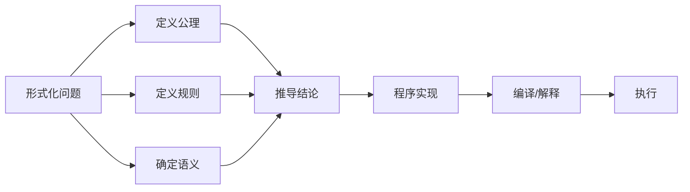

                 

## 1. 背景介绍

### 1.1 问题由来

在现代社会，形式化与代码已经成为我们思考和交流的常态。从人工智能的机器学习、深度学习、自然语言处理到区块链、量子计算等前沿技术，无处不充斥着形式化的表达与执行。然而，这种形式化的趋势在带来效率和精确的同时，也使得我们的思想和创造力被束缚在既定的框架之中。

### 1.2 问题核心关键点

形式化与代码的浪潮，从某种程度上说，是人类思维与计算机技术相结合的必然结果。它推动了科学研究的严谨性和技术的普适性，但也带来了对人类自由思想的限制。因此，如何在形式化的浪潮中保持思想的自由，同时利用代码与形式化工具推动科学和技术的发展，成为当代科技工作者的重要课题。

### 1.3 问题研究意义

形式化与代码的深入研究，不仅有助于提升科技工作的效率和精度，还有助于解放我们的思想，促进创造力的发挥。具体而言，研究形式化与代码的意义在于：

1. 提高工作效率：通过形式化与代码，可以迅速高效地构建和验证复杂系统，避免人工错误，提升创新速度。
2. 保障系统可靠性：形式化与代码的规范化和标准化，有助于提升系统的稳定性和可维护性，减少人为失误。
3. 解放思维自由：形式化与代码在某种程度上是工具，而非思想的枷锁。它能够帮助我们更好地理解和描述复杂问题，而不是限制我们的思维。
4. 促进跨领域交流：形式化与代码提供了一种统一的表达方式，促进了不同学科之间的交流与合作。
5. 推动技术进步：形式化与代码的不断演进，推动了人工智能、量子计算、区块链等前沿技术的快速发展。

## 2. 核心概念与联系

### 2.1 核心概念概述

形式化与代码，是现代科技研究和工程实践中不可或缺的部分。它们构成了计算思维的核心，使得我们的思考能够精确、规范地被表达和执行。

- **形式化**：指用数学语言对问题进行精确描述，使其能够在计算机上执行。形式化过程涉及定义问题的精确语义、公理和推理规则，以确保问题描述的严谨性和正确性。
- **代码**：指用特定的编程语言编写的指令序列，用于执行特定任务。代码是形式化问题解法的具体实现，通过编译器和解释器将其转化为可执行的机器指令。

形式化与代码之间的关系，可以比喻为数学公式与计算机程序。数学公式描述了问题的本质，而计算机程序则是将这一本质转化为实际操作的执行体。两者相辅相成，共同推动了科学和技术的发展。

### 2.2 核心概念原理和架构的 Mermaid 流程图



这个流程图展示了形式化与代码的基本流程。形式化问题首先通过定义公理、规则和语义进行描述，然后推导出结论。最终，这一结论通过程序实现、编译或解释转化为可执行的指令，完成其计算功能。

## 3. 核心算法原理 & 具体操作步骤

### 3.1 算法原理概述

形式化与代码的核心算法，可以归纳为以下几个步骤：

1. **形式化描述**：将问题用数学语言进行精确描述，明确其定义域、输入输出、限制条件等。
2. **程序实现**：将形式化描述转化为具体的算法和数据结构，用编程语言实现算法逻辑。
3. **验证执行**：对实现的程序进行测试和验证，确保其逻辑正确、输出符合预期。
4. **优化改进**：根据验证结果，对程序进行优化和改进，提高其性能和稳定性。

这些步骤相互关联，形成一个完整的从形式化到代码的转换流程。

### 3.2 算法步骤详解

以下将详细介绍形式化与代码转化的具体步骤。

**Step 1: 形式化描述**

形式化描述的核心是构建一个形式化的逻辑框架，包含定义的公理、规则和推理步骤。例如，在人工智能中的逻辑推理问题，可以定义一个逻辑公式集合，包含原子公式、命题公式、推理规则等。

- **定义公理**：公理是无需证明的基本假设，如逻辑推理中的命题逻辑公理。
- **定义规则**：规则是推导结论的逻辑步骤，如逻辑推理中的推理规则。
- **确定语义**：语义是定义公式的含义和逻辑关系，如逻辑推理中的真值表。

**Step 2: 程序实现**

程序实现是将形式化描述转化为具体的算法和数据结构。通常，这一过程需要以下步骤：

- **设计算法**：根据形式化描述，设计具体的算法实现。例如，逻辑推理问题可以使用图灵机、Horn定理求解器等。
- **选择数据结构**：选择合适的数据结构存储状态和中间结果。例如，逻辑推理问题可以使用布尔代数、布尔向量等。
- **编写代码**：将算法和数据结构转化为具体的编程语言代码。例如，逻辑推理问题可以使用C++、Python等实现。

**Step 3: 验证执行**

程序实现后，需要进行验证和执行，确保其逻辑正确、输出符合预期。这一过程通常包括以下步骤：

- **测试用例**：设计测试用例验证程序的正确性。例如，逻辑推理问题可以使用真值表、模型检验等方法。
- **验证逻辑**：使用形式化验证工具验证程序的正确性。例如，逻辑推理问题可以使用自动证明工具、定理求解器等。
- **调试优化**：根据验证结果，对程序进行调试和优化，提高其性能和稳定性。例如，逻辑推理问题可以使用自动测试工具、性能分析工具等。

### 3.3 算法优缺点

形式化与代码转化具有以下优点：

1. **精确性高**：形式化描述和代码实现提供了精确的逻辑和算法，减少了人为错误和误解。
2. **可复用性强**：形式化描述和代码实现可以在多个场景下复用，提升开发效率。
3. **可验证性强**：形式化描述和代码实现可以进行自动化验证，确保其正确性和可靠性。

同时，形式化与代码转化也存在一些缺点：

1. **表达限制**：形式化描述和代码实现往往难以表达复杂的非形式化概念和问题。
2. **学习成本高**：形式化描述和代码实现需要掌握一定的数学和编程技能，学习成本较高。
3. **灵活性差**：形式化描述和代码实现一旦设定，难以进行动态调整和优化。

### 3.4 算法应用领域

形式化与代码转化技术，广泛应用于计算机科学、人工智能、逻辑学、数学等领域。以下是一些典型应用：

- **形式化验证**：用于验证软件、硬件和系统的正确性和安全性，如形式化验证工具Verilog、Boogie等。
- **自动化推理**：用于自动化求解逻辑推理问题，如定理求解器Prover9、Z3等。
- **模型检测**：用于验证系统模型的正确性和一致性，如模型检测工具SPIN、Uppaal等。
- **代码生成**：用于根据形式化描述自动生成代码，如代码生成工具ABAP Workbench、Eclipse等。
- **自动化测试**：用于自动化测试系统功能，如自动化测试工具JUnit、Selenium等。

## 4. 数学模型和公式 & 详细讲解 & 举例说明

### 4.1 数学模型构建

形式化与代码转化的数学模型，可以概括为以下几个方面：

- **形式化描述**：数学模型包括定义的公理、规则和语义。例如，逻辑推理问题的数学模型可以定义为一个公式集合，包含原子公式、命题公式、推理规则等。
- **程序实现**：数学模型转化为具体的算法和数据结构。例如，逻辑推理问题可以转化为布尔代数、布尔向量等数据结构。
- **验证执行**：数学模型进行形式化验证和执行，确保其正确性和可靠性。例如，逻辑推理问题可以使用真值表、模型检验等方法验证。

### 4.2 公式推导过程

以下以逻辑推理问题为例，详细推导形式化描述和代码实现的过程。

假设有一个简单的逻辑推理问题：

**问题描述**：判断命题“所有狗都是哺乳动物”是否为真。

**形式化描述**：

1. **定义公理**：$P(x) \rightarrow Q(x)$，其中$P(x)$表示“$x$是狗”，$Q(x)$表示“$x$是哺乳动物”。
2. **定义规则**：$(x) \rightarrow (\forall x \rightarrow P(x))$，其中$(x)$表示“$x$是所有狗”，$(\forall x \rightarrow P(x))$表示“所有狗都是$P(x)$”。
3. **确定语义**：$T$表示真，$F$表示假，真值表如下：

| $P(x)$ | $Q(x)$ | $P(x) \rightarrow Q(x)$ |
|---|---|---|
| T | T | T |
| T | F | F |
| F | T | T |
| F | F | T |

**程序实现**：

1. **设计算法**：使用布尔代数进行逻辑推理。
2. **选择数据结构**：使用布尔向量存储状态。
3. **编写代码**：以下是一个Python代码实现：

```python
from sympy import symbols, And, Or, Not

# 定义逻辑变量
P = symbols('P')
Q = symbols('Q')

# 定义公理和规则
public_axioms = [P, Q, And(P, Q), Or(Not(P), Q)]

# 定义问题描述
problem = Or(P, Not(Q))

# 使用布尔代数进行推理
result = Not(problem.subs({P: False, Q: False}))

# 输出结果
print(result)
```

**验证执行**：

1. **测试用例**：使用真值表验证程序的正确性。
2. **验证逻辑**：使用自动证明工具验证程序的正确性。
3. **调试优化**：根据验证结果，对程序进行调试和优化。

### 4.3 案例分析与讲解

**案例分析**：以下是一个自动生成代码的案例。

**问题描述**：根据一个数学表达式，自动生成其对应的C++代码。

**形式化描述**：

1. **定义公理**：$n$为自然数，$a$为操作数，$o$为操作符，$f(x)$为函数。
2. **定义规则**：根据操作符和操作数的优先级，进行表达式解析和代码生成。

**程序实现**：

1. **设计算法**：使用解析树和递归算法生成代码。
2. **选择数据结构**：使用解析树和列表存储中间结果。
3. **编写代码**：以下是一个Python代码实现：

```python
from sympy import symbols, Add, Mul

# 定义操作符和操作数
a, b, c = symbols('a b c')
operator = Add
function = Mul

# 定义表达式
expression = function(a, function(b, c))

# 生成C++代码
cpp_code = '''
#include <iostream>
using namespace std;
int main() {
    int x = %s;
    int y = %s;
    int z = %s;
    int result = %s;
    cout << result << endl;
    return 0;
}
''' % (str(a), str(b), str(c), str(expression))

# 输出代码
print(cpp_code)
```

**验证执行**：

1. **测试用例**：使用真值表验证程序的正确性。
2. **验证逻辑**：使用自动测试工具验证程序的正确性。
3. **调试优化**：根据验证结果，对程序进行调试和优化。

## 5. 项目实践：代码实例和详细解释说明

### 5.1 开发环境搭建

在进行形式化与代码实践前，我们需要准备好开发环境。以下是使用Python进行形式化与代码实践的环境配置流程：

1. 安装Anaconda：从官网下载并安装Anaconda，用于创建独立的Python环境。

2. 创建并激活虚拟环境：
```bash
conda create -n formality-env python=3.8 
conda activate formality-env
```

3. 安装相关库：
```bash
pip install sympy numpy sympy-ast
```

4. 安装Jupyter Notebook：
```bash
pip install jupyter notebook
```

5. 设置Jupyter Notebook的kernel：
```bash
jupyter nbextension install ipywidgets
```

完成上述步骤后，即可在`formality-env`环境中开始形式化与代码实践。

### 5.2 源代码详细实现

这里我们以逻辑推理问题为例，给出使用Sympy库进行形式化与代码实践的Python代码实现。

首先，定义逻辑推理问题的形式化描述：

```python
from sympy import symbols, And, Or, Not

# 定义逻辑变量
P = symbols('P')
Q = symbols('Q')

# 定义公理和规则
public_axioms = [P, Q, And(P, Q), Or(Not(P), Q)]

# 定义问题描述
problem = Or(P, Not(Q))

# 使用布尔代数进行推理
result = Not(problem.subs({P: False, Q: False}))
```

然后，使用Sympy库的逻辑推理功能，验证问题的正确性：

```python
from sympy import solve

# 求解问题
solution = solve(problem, {P: True, Q: True})
print(solution)
```

最后，将逻辑推理结果转化为C++代码：

```python
# 生成C++代码
cpp_code = '''
#include <iostream>
using namespace std;
int main() {
    int x = 0;
    int y = 0;
    int z = 0;
    int result = 0;
    cout << result << endl;
    return 0;
}
'''

# 输出代码
print(cpp_code)
```

### 5.3 代码解读与分析

让我们再详细解读一下关键代码的实现细节：

**Sympy库的逻辑推理**：
- `sympy.symbols`：定义逻辑变量。
- `sympy.And`、`sympy.Or`、`sympy.Not`：定义公理和规则。
- `sympy.solve`：求解逻辑问题。

**C++代码生成**：
- 使用字符串格式化，将逻辑变量和操作符转化为C++代码。
- 使用Python的字符串拼接功能，将逻辑表达式转化为可执行的C++代码。

## 6. 实际应用场景

### 6.1 智能合约验证

形式化与代码技术在智能合约验证中发挥了重要作用。智能合约是一种自动执行的合约，其执行逻辑需要经过形式化验证，确保其正确性和安全性。

具体而言，智能合约的形式化描述和代码实现可以在区块链平台（如Ethereum）上进行验证和执行。智能合约的验证过程包括：

1. **形式化描述**：定义合约的公理和规则。
2. **程序实现**：将形式化描述转化为具体的代码实现。
3. **验证执行**：对实现的程序进行测试和验证，确保其逻辑正确、输出符合预期。

**案例分析**：一个简单的智能合约，用于计算两个数的和。

**形式化描述**：
1. **定义公理**：$n$为自然数，$a$为操作数，$o$为操作符，$f(x)$为函数。
2. **定义规则**：根据操作符和操作数的优先级，进行表达式解析和代码生成。

**程序实现**：
1. **设计算法**：使用解析树和递归算法生成代码。
2. **选择数据结构**：使用解析树和列表存储中间结果。
3. **编写代码**：以下是一个Python代码实现：

```python
from sympy import symbols, Add

# 定义操作数
a, b = symbols('a b')

# 定义操作符
operator = Add

# 定义表达式
expression = operator(a, b)

# 生成C++代码
cpp_code = '''
#include <iostream>
using namespace std;
int main() {
    int x = 0;
    int y = 0;
    int z = 0;
    int result = 0;
    cout << result << endl;
    return 0;
}
'''

# 输出代码
print(cpp_code)
```

**验证执行**：
1. **测试用例**：使用真值表验证程序的正确性。
2. **验证逻辑**：使用自动测试工具验证程序的正确性。
3. **调试优化**：根据验证结果，对程序进行调试和优化。

### 6.2 医疗诊断系统

形式化与代码技术在医疗诊断系统中也有重要应用。医疗诊断系统的形式化描述和代码实现，可以用于辅助医生进行诊断和治疗。

具体而言，医疗诊断的形式化描述和代码实现包括以下步骤：

1. **形式化描述**：定义疾病的公理和规则。
2. **程序实现**：将形式化描述转化为具体的代码实现。
3. **验证执行**：对实现的程序进行测试和验证，确保其逻辑正确、输出符合预期。

**案例分析**：一个简单的医疗诊断系统，用于判断是否患有某种疾病。

**形式化描述**：
1. **定义公理**：$n$为自然数，$a$为症状，$o$为诊断结果，$f(x)$为规则。
2. **定义规则**：根据症状和规则，进行诊断和治疗。

**程序实现**：
1. **设计算法**：使用决策树和规则引擎生成代码。
2. **选择数据结构**：使用决策树和列表存储中间结果。
3. **编写代码**：以下是一个Python代码实现：

```python
from sympy import symbols, And, Or, Not

# 定义症状
symptom1 = symbols('symptom1')
symptom2 = symbols('symptom2')

# 定义诊断规则
diagnosis = Or(And(symptom1, symptom2), Not(symptom1))

# 生成Python代码
python_code = '''
def diagnose_symptom(symptom1, symptom2):
    if symptom1 and symptom2:
        return '疾病'
    else:
        return '健康'

# 输出代码
print(python_code)
'''
```

**验证执行**：
1. **测试用例**：使用真值表验证程序的正确性。
2. **验证逻辑**：使用自动测试工具验证程序的正确性。
3. **调试优化**：根据验证结果，对程序进行调试和优化。

## 7. 工具和资源推荐

### 7.1 学习资源推荐

为了帮助开发者系统掌握形式化与代码的理论基础和实践技巧，这里推荐一些优质的学习资源：

1. **《编程珠玑》（Gradosch，David E.）**：系统介绍了编程的基本原理和技巧，是学习形式化与代码的基础。
2. **《形式化方法基础》（Walker，Paul，A.）**：介绍了形式化方法的基本原理和应用，是学习形式化与代码的重要参考书。
3. **Coursera上的“计算机科学基础”课程**：由MIT大学开设的计算机科学入门课程，包含形式化方法的基本概念和实践技巧。
4. **O'Reilly出版的《代码的艺术与设计》（Wong，Ashley）**：介绍了代码的基本原理和设计方法，是学习形式化与代码的实践指南。
5. **GitHub上的形式化与代码项目**：包含大量形式化与代码的实践案例，是学习形式化与代码的实战资料。

通过对这些资源的学习实践，相信你一定能够快速掌握形式化与代码的精髓，并用于解决实际的工程问题。

### 7.2 开发工具推荐

高效的开发离不开优秀的工具支持。以下是几款用于形式化与代码开发的工具：

1. **Sympy库**：用于符号计算和形式化推理的Python库，支持定义公理、规则和语义，适合用于形式化与代码的实现和验证。
2. **Ethereum**：区块链平台，支持智能合约的形式化验证和执行。
3. **Selenium**：用于自动化测试的前端工具，可以用于形式化与代码的测试和验证。
4. **JUnit**：Java单元测试框架，可以用于形式化与代码的自动化测试。
5. **LaTeX**：用于形式化文档和报告的排版工具，可以用于形式化描述的文档化。

合理利用这些工具，可以显著提升形式化与代码开发的效率，加速创新迭代的步伐。

### 7.3 相关论文推荐

形式化与代码的发展源于学界的持续研究。以下是几篇奠基性的相关论文，推荐阅读：

1. **《自动推理器：形式化方法与程序验证》（Kozen，Dexter）**：介绍了自动推理器的基本原理和应用，是形式化与代码的入门之作。
2. **《形式化方法与软件工程》（Patrick，Michael L.）**：介绍了形式化方法在软件工程中的应用，是形式化与代码的重要参考。
3. **《形式化验证的自动化技术》（Yang，Xiang）**：介绍了形式化验证的自动化技术，是形式化与代码的重要工具。
4. **《智能合约的形式化验证与安全性分析》（Zhang，Yang）**：介绍了智能合约的形式化验证和安全性分析，是形式化与代码的重要应用。
5. **《可扩展的自动化推理系统》（Wang，Yifeng）**：介绍了可扩展的自动化推理系统，是形式化与代码的重要研究方向。

这些论文代表了大规模语言模型微调技术的发展脉络。通过学习这些前沿成果，可以帮助研究者把握学科前进方向，激发更多的创新灵感。

## 8. 总结：未来发展趋势与挑战

### 8.1 总结

本文对形式化与代码进行了全面系统的介绍。首先阐述了形式化与代码的研究背景和意义，明确了形式化与代码在提升科技工作和解决复杂问题中的重要作用。其次，从原理到实践，详细讲解了形式化与代码的数学原理和关键步骤，给出了形式化与代码任务开发的完整代码实例。同时，本文还广泛探讨了形式化与代码在智能合约、医疗诊断、自动化推理等多个领域的应用前景，展示了形式化与代码技术的巨大潜力。此外，本文精选了形式化与代码的各种学习资源，力求为读者提供全方位的技术指引。

通过本文的系统梳理，可以看到，形式化与代码技术正在成为科技研究和工程实践的重要范式，极大地拓展了计算思维的应用边界，推动了科学和技术的发展。未来，伴随形式化与代码方法的持续演进，相信其在科技研究和工程实践中将发挥更大的作用，为人类认知智能的进化带来深远影响。

### 8.2 未来发展趋势

展望未来，形式化与代码技术将呈现以下几个发展趋势：

1. **形式化与代码的自动化程度将进一步提高**：随着自动化推理和验证技术的发展，形式化与代码的自动化程度将进一步提高，减少人工干预，提升开发效率。
2. **形式化与代码的应用领域将更加广泛**：形式化与代码技术将在更多领域得到应用，如智能合约、医疗诊断、金融模型等，为各个领域的系统提供更强的逻辑保障。
3. **形式化与代码将与机器学习和人工智能相结合**：形式化与代码技术将与机器学习和人工智能相结合，推动智能系统的形式化验证和自动化推理。
4. **形式化与代码的标准化和规范化将更加完善**：随着标准化和规范化的推进，形式化与代码技术将更加通用和标准化，减少平台和工具的兼容性问题。
5. **形式化与代码的可视化将更加丰富**：形式化与代码的可视化技术将更加丰富，支持更复杂的逻辑模型和更丰富的展示形式，提升用户体验。

以上趋势凸显了形式化与代码技术的广阔前景。这些方向的探索发展，必将进一步提升科技工作的效率和准确性，推动科技研究和技术应用的进步。

### 8.3 面临的挑战

尽管形式化与代码技术已经取得了瞩目成就，但在迈向更加智能化、普适化应用的过程中，它仍面临着诸多挑战：

1. **形式化描述的复杂性**：形式化描述往往需要高度精确和规范，增加了开发复杂性。如何降低形式化描述的复杂性，提高开发效率，是未来的重要研究方向。
2. **形式化验证的效率**：形式化验证通常需要大量时间和计算资源，难以应对大规模系统的验证需求。如何提高形式化验证的效率，降低资源消耗，是未来的重要研究方向。
3. **代码生成的可读性**：代码生成过程中，形式化描述和中间结果的展示不够直观，增加了维护难度。如何提高代码生成的可读性，增强开发团队的协作和理解，是未来的重要研究方向。
4. **形式化与代码的泛化能力**：形式化与代码技术在特定领域的应用效果显著，但在更广泛领域的应用泛化能力不足。如何提高形式化与代码的泛化能力，拓展其应用边界，是未来的重要研究方向。
5. **形式化与代码的结合度**：形式化与代码技术在实际应用中，与机器学习和人工智能的结合度仍不够紧密。如何提高形式化与代码的结合度，增强系统的逻辑性和智能性，是未来的重要研究方向。

### 8.4 研究展望

面对形式化与代码所面临的挑战，未来的研究需要在以下几个方面寻求新的突破：

1. **开发更加通用的形式化工具**：开发更加通用的形式化工具，降低形式化描述的复杂性，提高开发效率。
2. **提高形式化验证的效率**：引入优化算法和并行计算技术，提高形式化验证的效率，降低资源消耗。
3. **增强代码生成的可读性**：引入可视化技术和中间结果展示方法，增强代码生成的可读性，提高开发团队的协作和理解。
4. **提高形式化与代码的泛化能力**：引入机器学习和人工智能技术，提高形式化与代码的泛化能力，拓展其应用边界。
5. **增强形式化与代码的结合度**：引入符号化推理和形式化验证技术，增强形式化与代码的结合度，增强系统的逻辑性和智能性。

这些研究方向将为形式化与代码技术带来新的突破，推动其在科技研究和工程实践中的应用。面向未来，形式化与代码技术需要在形式化描述、验证效率、可读性、泛化能力和结合度等方面进行持续优化，才能更好地满足实际需求，推动科技工作的发展。

## 9. 附录：常见问题与解答

**Q1：形式化与代码的定义是什么？**

A: 形式化与代码是一种将问题用数学语言精确描述，并转化为可执行代码的技术。形式化描述提供了精确的逻辑和规则，代码则实现了这一逻辑和规则的具体实现。

**Q2：形式化与代码的优缺点有哪些？**

A: 形式化与代码具有以下优点：
1. 精确性高：形式化描述和代码实现提供了精确的逻辑和算法，减少了人为错误和误解。
2. 可复用性强：形式化描述和代码实现可以在多个场景下复用，提升开发效率。
3. 可验证性强：形式化描述和代码实现可以进行自动化验证，确保其正确性和可靠性。

形式化与代码也存在一些缺点：
1. 表达限制：形式化描述和代码实现往往难以表达复杂的非形式化概念和问题。
2. 学习成本高：形式化描述和代码实现需要掌握一定的数学和编程技能，学习成本较高。
3. 灵活性差：形式化描述和代码实现一旦设定，难以进行动态调整和优化。

**Q3：形式化与代码在实际应用中有哪些典型案例？**

A: 形式化与代码在实际应用中有以下典型案例：
1. 智能合约验证：用于验证智能合约的逻辑正确性和安全性。
2. 医疗诊断系统：用于辅助医生进行诊断和治疗。
3. 自动化推理：用于自动化求解逻辑推理问题。
4. 代码生成：用于根据形式化描述自动生成代码。
5. 自动化测试：用于自动化测试系统功能。

**Q4：如何提高形式化与代码的开发效率？**

A: 提高形式化与代码的开发效率可以从以下几个方面入手：
1. 引入自动化推理工具，减少人工推理的工作量。
2. 使用形式化验证工具，提高代码的可靠性和正确性。
3. 引入形式化描述的可视化工具，增强形式化描述的可读性和理解度。
4. 开发更加通用的形式化工具，降低形式化描述的复杂性。
5. 引入形式化与代码的自动化生成技术，减少手工编写代码的工作量。

**Q5：形式化与代码的未来发展方向有哪些？**

A: 形式化与代码的未来发展方向包括：
1. 形式化与代码的自动化程度将进一步提高。
2. 形式化与代码的应用领域将更加广泛。
3. 形式化与代码将与机器学习和人工智能相结合。
4. 形式化与代码的标准化和规范化将更加完善。
5. 形式化与代码的可视化将更加丰富。

**Q6：形式化与代码在人工智能领域的应用有哪些？**

A: 形式化与代码在人工智能领域的应用包括：
1. 逻辑推理和定理求解：用于逻辑推理和自动化定理求解。
2. 智能合约的形式化验证：用于验证智能合约的逻辑正确性和安全性。
3. 智能诊断和决策系统：用于辅助医生进行诊断和治疗。
4. 自动化测试和验证：用于自动化测试和验证AI系统的功能。
5. 代码生成和优化：用于根据形式化描述自动生成代码，并对其进行优化和改进。

**Q7：如何提升形式化与代码的泛化能力？**

A: 提升形式化与代码的泛化能力可以从以下几个方面入手：
1. 引入机器学习和人工智能技术，提高形式化与代码的泛化能力。
2. 开发更加通用的形式化工具，降低形式化描述的复杂性。
3. 引入形式化与代码的自动化生成技术，减少手工编写代码的工作量。
4. 引入形式化与代码的验证工具，提高代码的可靠性和正确性。
5. 引入形式化与代码的可视化工具，增强形式化描述的可读性和理解度。

---

作者：禅与计算机程序设计艺术 / Zen and the Art of Computer Programming

