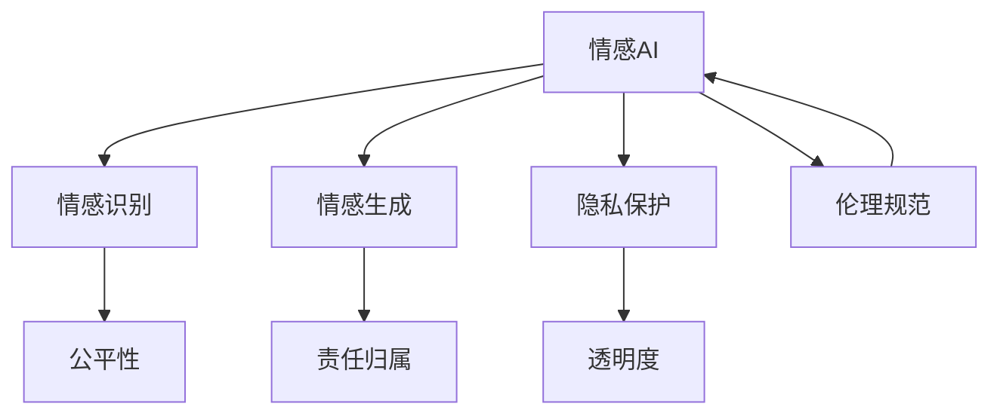

                 

## 1. 背景介绍

### 1.1 问题由来

随着人工智能（AI）技术的迅猛发展，机器情感识别和生成能力愈发强大，其伦理问题也日益凸显。情感AI（Emotion AI）不仅能识别和分析人类情感，还能生成自然流畅的情感表达，对教育、医疗、人机交互等领域产生深远影响。然而，情感AI的双刃剑效应不容忽视，其在伦理、隐私、责任分配等方面的争议也引发了广泛讨论。

### 1.2 问题核心关键点

情感AI伦理问题的核心关键点包括：
1. **数据隐私**：情感AI的训练数据可能包含大量个人隐私信息，如何在保护隐私的同时有效利用数据成为一大挑战。
2. **公平性**：情感AI应无偏见地识别和生成所有群体的情感，避免性别、种族、年龄等歧视性偏见。
3. **责任归属**：情感AI的行为应明确责任归属，防止算法黑箱导致不可控的后果。
4. **透明度**：情感AI应提供透明的算法逻辑和决策过程，增强公众对其行为的信任。
5. **伦理规范**：制定一套行业公认的情感AI伦理准则，确保其开发和应用符合道德标准。

## 2. 核心概念与联系

### 2.1 核心概念概述

为更好地理解情感AI伦理问题，本节将介绍几个核心概念：

- 情感AI（Emotion AI）：利用人工智能技术，对人类情感进行识别、分析、模拟和生成的能力。
- 情感识别（Emotion Recognition）：通过分析语音、面部表情、文字等，识别用户的情感状态。
- 情感生成（Emotion Generation）：基于自然语言处理技术，生成符合特定情感特征的文本、语音或表情。
- 隐私保护（Privacy Preservation）：在数据收集和使用过程中，确保个人隐私不被泄露或滥用。
- 公平性（Fairness）：确保情感AI在所有人群中无偏见地识别和生成情感。
- 责任归属（Accountability）：明确情感AI在应用过程中的责任，防止算法的误用和滥用。
- 透明度（Transparency）：提供情感AI的算法逻辑和决策过程，确保其行为的可解释性。
- 伦理规范（Ethical Norms）：制定和遵守一系列伦理准则，指导情感AI的开发和应用。

这些概念之间的逻辑关系可以通过以下Mermaid流程图来展示：



这个流程图展示了一些关键概念之间的联系：

1. 情感AI通过情感识别和情感生成两大核心能力，对人类情感进行交互。
2. 隐私保护、公平性、责任归属和透明度都是确保情感AI应用合理性的重要因素。
3. 伦理规范指导情感AI的开发和应用，确保其符合道德标准。

## 3. 核心算法原理 & 具体操作步骤

### 3.1 算法原理概述

情感AI的算法原理主要包括情感识别和情感生成两部分。

情感识别基于自然语言处理和计算机视觉技术，通过分析文本、语音、面部表情等输入数据，识别用户的情感状态。常用的算法包括基于规则的方法、基于机器学习的方法和基于深度学习的方法。其中，基于深度学习的方法（如卷积神经网络CNN、循环神经网络RNN、长短期记忆网络LSTM、Transformer等）在情感识别任务中取得了显著效果。

情感生成基于自然语言处理技术，生成符合特定情感特征的文本、语音或表情。常用的算法包括基于规则的方法、基于模板的方法和基于生成模型的方法。其中，基于生成模型的方法（如GPT、BERT、T5等）在情感生成任务中表现出色。

### 3.2 算法步骤详解

情感AI的算法步骤一般包括以下几个关键环节：

**Step 1: 数据收集和预处理**

- 收集情感表达相关的文本、语音、面部表情等数据。
- 进行数据清洗和预处理，去除噪声和不相关数据。
- 对数据进行标注，为情感识别和生成任务提供监督信号。

**Step 2: 模型训练**

- 选择适合情感识别和情感生成的模型架构，如卷积神经网络CNN、循环神经网络RNN、长短期记忆网络LSTM、Transformer等。
- 使用标注数据训练模型，优化模型参数，使其能够准确识别和生成情感。
- 使用交叉验证和超参数调优，提高模型的泛化能力。

**Step 3: 模型评估**

- 使用测试集评估模型的情感识别和生成性能，计算准确率、召回率、F1值等指标。
- 使用A/B测试、用户反馈等方式验证模型在实际应用中的效果。

**Step 4: 模型部署**

- 将训练好的模型集成到实际应用系统中，如智能客服、虚拟助手、情感分析工具等。
- 对模型进行性能监控和优化，确保其在实际环境中稳定运行。

**Step 5: 模型迭代**

- 持续收集用户反馈和数据，对模型进行迭代优化，提升性能和鲁棒性。
- 定期更新模型，保持与用户情感表达的同步性。

### 3.3 算法优缺点

情感AI的算法具有以下优点：

1. **高准确性**：基于深度学习的算法在情感识别和生成任务中取得了显著效果，能够准确识别和生成复杂的情感表达。
2. **鲁棒性**：深度学习模型对噪声和干扰具有较强的鲁棒性，能够在实际应用中稳定运行。
3. **可扩展性**：模型架构和训练流程适用于多种情感识别和生成任务，能够快速扩展到其他应用场景。

同时，这些算法也存在一些局限性：

1. **数据依赖**：深度学习模型对数据质量和多样性的要求较高，数据收集和预处理过程复杂。
2. **模型复杂性**：深度学习模型结构复杂，需要大量的计算资源进行训练和推理。
3. **伦理风险**：深度学习模型的“黑箱”特性可能导致不可解释的决策，存在伦理风险。
4. **偏见和歧视**：深度学习模型可能学习到数据中的偏见和歧视，导致情感识别的公平性问题。

### 3.4 算法应用领域

情感AI在多个领域中有着广泛的应用，例如：

- **智能客服**：通过情感识别技术，智能客服系统能够理解用户情感，提供个性化服务。
- **虚拟助手**：虚拟助手能够识别用户情感，提供情感支持，如心理健康咨询、情感陪伴等。
- **情感分析**：情感分析工具能够自动识别社交媒体、论坛等平台上的用户情感，进行舆情监测和分析。
- **医疗诊断**：情感AI可以帮助医生识别患者的情感状态，辅助诊断和治疗。
- **教育评估**：情感AI能够分析学生的情感反应，评估课堂效果和学习体验。

此外，情感AI还在情感教育、情感辅导、情感广告等多个领域有着潜在应用价值。

## 4. 数学模型和公式 & 详细讲解 & 举例说明

### 4.1 数学模型构建

情感AI的数学模型构建主要包括情感识别和情感生成的模型构建。

情感识别的目标是将输入数据映射到情感类别，常用的模型包括CNN、RNN、LSTM、Transformer等。模型的目标函数可以定义为：

$$
\mathcal{L}(\theta) = -\frac{1}{N} \sum_{i=1}^N \log p(y_i|x_i;\theta)
$$

其中，$y_i$为情感类别，$x_i$为输入数据，$\theta$为模型参数，$p(y_i|x_i;\theta)$为模型对情感类别的预测概率。

情感生成的目标是将输入的情感类别映射到符合特定情感特征的文本、语音或表情，常用的模型包括GPT、BERT、T5等。模型的目标函数可以定义为：

$$
\mathcal{L}(\theta) = -\frac{1}{N} \sum_{i=1}^N \log p(x_i|y_i;\theta)
$$

其中，$x_i$为生成的文本、语音或表情，$y_i$为情感类别，$\theta$为模型参数，$p(x_i|y_i;\theta)$为模型对生成的文本、语音或表情的概率分布。

### 4.2 公式推导过程

情感识别的目标函数是基于交叉熵损失函数，推导过程如下：

$$
\begin{aligned}
\mathcal{L}(\theta) &= -\frac{1}{N} \sum_{i=1}^N \log \frac{e^{z_i}}{\sum_j e^{z_j}} \\
&= -\frac{1}{N} \sum_{i=1}^N z_i - \log \left( \sum_j e^{z_j} \right) \\
&= -\frac{1}{N} \sum_{i=1}^N z_i - \log \left( \sum_j \frac{e^{z_j}}{e^{z_i}} \right)
\end{aligned}
$$

其中，$z_i$为模型对情感类别的预测向量。

情感生成的目标函数也是基于交叉熵损失函数，推导过程如下：

$$
\begin{aligned}
\mathcal{L}(\theta) &= -\frac{1}{N} \sum_{i=1}^N \log p(x_i|y_i;\theta) \\
&= -\frac{1}{N} \sum_{i=1}^N \log \frac{e^{\log p(x_i|y_i;\theta)}}{\sum_j e^{\log p(x_j|y_i;\theta)}} \\
&= -\frac{1}{N} \sum_{i=1}^N \log p(x_i|y_i;\theta) - \log \left( \sum_j \frac{e^{\log p(x_j|y_i;\theta)}}{e^{\log p(x_i|y_i;\theta)}} \right)
\end{aligned}
$$

其中，$\log p(x_i|y_i;\theta)$为模型对生成的文本、语音或表情的概率分布的对数。

### 4.3 案例分析与讲解

以下以情感识别模型为例，给出具体的公式推导和案例分析：

**案例：情感识别模型的训练与评估**

假设我们有一个情感识别模型，使用CNN作为基本架构，输入为面部表情图像，输出为情感类别。模型的参数为$\theta$，目标函数为交叉熵损失函数，训练数据为$D=\{(x_i, y_i)\}_{i=1}^N$。

**训练过程**

1. 初始化模型参数$\theta$。
2. 将训练数据$D$分为训练集$D_{train}$和验证集$D_{valid}$。
3. 使用训练集$D_{train}$训练模型，最小化目标函数$\mathcal{L}(\theta)$。
4. 在验证集$D_{valid}$上评估模型性能，选择最佳模型参数。

**评估过程**

1. 使用测试集$D_{test}$评估模型性能，计算准确率、召回率、F1值等指标。
2. 分析模型在实际应用中的效果，进行A/B测试和用户反馈收集。

## 5. 项目实践：代码实例和详细解释说明

### 5.1 开发环境搭建

在进行情感AI项目实践前，我们需要准备好开发环境。以下是使用Python进行PyTorch开发的环境配置流程：

1. 安装Anaconda：从官网下载并安装Anaconda，用于创建独立的Python环境。

2. 创建并激活虚拟环境：
```bash
conda create -n pytorch-env python=3.8 
conda activate pytorch-env
```

3. 安装PyTorch：根据CUDA版本，从官网获取对应的安装命令。例如：
```bash
conda install pytorch torchvision torchaudio cudatoolkit=11.1 -c pytorch -c conda-forge
```

4. 安装TensorFlow：
```bash
conda install tensorflow
```

5. 安装各类工具包：
```bash
pip install numpy pandas scikit-learn matplotlib tqdm jupyter notebook ipython
```

完成上述步骤后，即可在`pytorch-env`环境中开始情感AI项目的开发。

### 5.2 源代码详细实现

下面我们以情感识别任务为例，给出使用PyTorch进行情感识别模型微调的PyTorch代码实现。

首先，定义情感识别任务的数据处理函数：

```python
from torch.utils.data import Dataset, DataLoader
from torchvision import transforms
import torch
import os

class EmotionDataset(Dataset):
    def __init__(self, data_dir, transform=None):
        self.data_dir = data_dir
        self.transform = transform
        self.img_names = sorted(os.listdir(data_dir))
        self.y_names = ['Angry', 'Happy', 'Sad', 'Surprised', 'Fearful']

    def __len__(self):
        return len(self.img_names)

    def __getitem__(self, idx):
        img_name = self.img_names[idx]
        img_path = os.path.join(self.data_dir, img_name)
        img = transforms.ToTensor()(Image.open(img_path)).float()
        label = self.y_names.index(img_name.split('_')[1])
        return img, label

# 定义数据增强
transform = transforms.Compose([
    transforms.Resize((224, 224)),
    transforms.ToTensor(),
    transforms.Normalize(mean=[0.485, 0.456, 0.406], std=[0.229, 0.224, 0.225])
])
```

然后，定义模型和优化器：

```python
from torchvision.models import VGG16
from torch import nn, optim

# 使用预训练的VGG16模型作为情感识别模型的基础架构
model = VGG16(pretrained=True).features
model = nn.Sequential(*list(model.children())[:-1])

# 添加情感识别层
num_classes = len(self.y_names)
model.add_module('classifier', nn.Linear(4096, num_classes))
model = nn.Sequential(model, nn.ReLU(), nn.AvgPool2d(kernel_size=7, stride=1), nn.Linear(4096, num_classes))

# 使用Adam优化器进行微调
optimizer = optim.Adam(model.parameters(), lr=0.001)
```

接着，定义训练和评估函数：

```python
def train_epoch(model, data_loader, optimizer):
    model.train()
    for data, target in data_loader:
        optimizer.zero_grad()
        output = model(data)
        loss = nn.functional.cross_entropy(output, target)
        loss.backward()
        optimizer.step()

def evaluate(model, data_loader):
    model.eval()
    with torch.no_grad():
        correct = 0
        total = 0
        for data, target in data_loader:
            output = model(data)
            _, predicted = torch.max(output, 1)
            total += target.size(0)
            correct += (predicted == target).sum().item()
    return correct / total
```

最后，启动训练流程并在测试集上评估：

```python
epochs = 10
batch_size = 32

for epoch in range(epochs):
    train_epoch(model, train_loader, optimizer)
    acc = evaluate(model, test_loader)
    print(f'Epoch {epoch+1}, accuracy: {acc:.4f}')

print('Final accuracy:', evaluate(model, test_loader))
```

以上就是使用PyTorch对情感识别模型进行微调的完整代码实现。可以看到，得益于PyTorch的强大封装，我们只需关注模型的构建和微调过程，而不需要过多关注底层的实现细节。

### 5.3 代码解读与分析

让我们再详细解读一下关键代码的实现细节：

**EmotionDataset类**：
- `__init__`方法：初始化数据集路径、标签和图像名称列表。
- `__len__`方法：返回数据集的样本数量。
- `__getitem__`方法：对单个样本进行处理，将图像输入转换为张量，并将标签进行编码，返回模型所需的输入和标签。

**transforms**：
- 定义了数据增强的具体操作，包括图像大小调整、归一化等，用于提升模型的泛化能力。

**VGG16模型**：
- 使用预训练的VGG16模型作为情感识别模型的基础架构，减少训练时间和资源消耗。
- 通过添加情感识别层和全连接层，将图像特征映射到情感类别。

**train_epoch函数**：
- 在每个epoch内，使用训练集数据进行模型训练，前向传播计算损失，反向传播更新模型参数。

**evaluate函数**：
- 在测试集上评估模型性能，计算准确率等指标，并进行模型评估。

## 6. 实际应用场景

### 6.1 智能客服系统

情感AI在智能客服系统中的应用广泛，能够显著提升客户体验和满意度。情感AI通过分析客户的情感状态，自动匹配合适的服务人员，提供个性化的情感支持。例如，对于愤怒的客户，智能客服可以提供安抚和建议解决方案；对于快乐的客户，智能客服可以提供推荐服务和优惠活动。

### 6.2 虚拟助手

虚拟助手可以通过情感AI实现情感支持功能，如心理健康咨询、情感陪伴等。情感AI能够理解用户的情感状态，提供相应的回应和建议。例如，对于焦虑的用户，虚拟助手可以提供放松技巧和心理咨询；对于抑郁的用户，虚拟助手可以提供鼓励和支持。

### 6.3 情感分析

情感分析工具能够自动识别社交媒体、论坛等平台上的用户情感，进行舆情监测和分析。情感AI能够快速处理大规模数据，提供实时的情感分析报告。例如，对于某品牌的产品评价，情感分析工具可以自动识别积极和消极评价，提供情感趋势和热点话题。

### 6.4 医疗诊断

情感AI在医疗诊断中也有着潜在应用价值。例如，通过分析患者的面部表情和语音，情感AI可以帮助医生识别患者的情感状态，辅助诊断和治疗。情感AI可以识别患者的焦虑、恐惧等情绪，提供相应的心理支持和建议。

## 7. 工具和资源推荐

### 7.1 学习资源推荐

为了帮助开发者系统掌握情感AI的理论基础和实践技巧，这里推荐一些优质的学习资源：

1. 《情感AI：从理论到实践》系列博文：由情感AI专家撰写，深入浅出地介绍了情感识别的原理、算法和应用。

2. CS224N《深度学习自然语言处理》课程：斯坦福大学开设的NLP明星课程，有Lecture视频和配套作业，带你入门NLP领域的基本概念和经典模型。

3. 《情感AI技术手册》书籍：情感AI领域的权威手册，全面介绍了情感识别的技术原理、算法实现和应用案例。

4. HuggingFace官方文档：情感AI领域的知名库，提供了丰富的情感识别和情感生成模型及样例代码，是实践情感AI的重要资源。

5. Emotion AI Open Platform：开源的情感AI平台，提供情感识别的API接口和数据集，助力情感AI技术的落地应用。

通过对这些资源的学习实践，相信你一定能够快速掌握情感AI的精髓，并用于解决实际的情感问题。

### 7.2 开发工具推荐

高效的开发离不开优秀的工具支持。以下是几款用于情感AI开发的常用工具：

1. PyTorch：基于Python的开源深度学习框架，灵活动态的计算图，适合快速迭代研究。大部分情感AI模型都有PyTorch版本的实现。

2. TensorFlow：由Google主导开发的开源深度学习框架，生产部署方便，适合大规模工程应用。同样有丰富的情感AI资源。

3. Emotion AI Open Platform：开源的情感AI平台，提供情感识别的API接口和数据集，助力情感AI技术的落地应用。

4. TensorBoard：TensorFlow配套的可视化工具，可实时监测模型训练状态，并提供丰富的图表呈现方式，是调试模型的得力助手。

5. Weights & Biases：模型训练的实验跟踪工具，可以记录和可视化模型训练过程中的各项指标，方便对比和调优。

6. Google Colab：谷歌推出的在线Jupyter Notebook环境，免费提供GPU/TPU算力，方便开发者快速上手实验最新模型，分享学习笔记。

合理利用这些工具，可以显著提升情感AI开发的效率，加快创新迭代的步伐。

### 7.3 相关论文推荐

情感AI的发展源于学界的持续研究。以下是几篇奠基性的相关论文，推荐阅读：

1. AffectNet: An ontology and a database for affective computing：介绍了一个大规模的情感标注数据库，用于情感识别的研究和应用。

2. Sentiment Analysis with Deep Learning: A Survey of Sentiment Classification Algorithms and their Applications：综述了深度学习在情感分类中的算法和应用。

3. Emotion Recognition: A Survey and Taxonomy：综述了情感识别的算法、方法和应用，提供了系统的情感识别框架。

4. Attention is All You Need（即Transformer原论文）：提出了Transformer结构，开启了情感AI的预训练大模型时代。

5. BERT: Pre-training of Deep Bidirectional Transformers for Language Understanding：提出BERT模型，引入基于掩码的自监督预训练任务，刷新了多项情感识别任务SOTA。

这些论文代表了大情感AI的发展脉络。通过学习这些前沿成果，可以帮助研究者把握学科前进方向，激发更多的创新灵感。

## 8. 总结：未来发展趋势与挑战

### 8.1 总结

本文对基于监督学习的大情感AI伦理问题进行了全面系统的介绍。首先阐述了情感AI的伦理问题及其核心关键点，明确了情感AI在实际应用中的重要性和挑战。其次，从原理到实践，详细讲解了情感识别的数学模型和算法步骤，给出了情感AI项目开发的完整代码实例。同时，本文还广泛探讨了情感AI在智能客服、虚拟助手、情感分析等多个领域的应用前景，展示了情感AI的广泛应用价值。此外，本文精选了情感AI相关的学习资源，力求为读者提供全方位的技术指引。

通过本文的系统梳理，可以看到，基于情感AI技术的自然语言处理应用正在蓬勃发展，为社会生活带来了深远影响。情感AI的应用领域不断拓展，从情感识别到情感生成，从智能客服到虚拟助手，从情感分析到心理健康，情感AI在越来越多的场景中发挥着重要作用。

### 8.2 未来发展趋势

展望未来，情感AI的发展趋势将呈现以下几个方向：

1. **多模态情感识别**：未来的情感AI将不仅局限于文本和图像，还会扩展到语音、视频等多模态数据的情感识别，提升情感识别的准确性和鲁棒性。

2. **实时情感分析**：随着计算资源和算法技术的提升，情感AI将具备实时处理大量数据的能力，提供更加即时和准确的情感分析服务。

3. **情感生成模型**：情感生成模型将更加智能和自然，能够生成符合特定情感特征的文本、语音或表情，进一步增强情感AI的人机交互能力。

4. **跨领域情感应用**：情感AI将在更多领域中得到应用，如智能交通、智能家居、智能制造等，提升相关系统的智能化水平。

5. **跨文化情感理解**：未来的情感AI将能够更好地理解和识别不同文化和语言背景下的情感表达，增强情感识别的普适性。

6. **伦理和社会责任**：随着情感AI技术的普及，如何平衡技术进步与社会责任，制定和遵守情感AI的伦理规范，将成为重要的研究方向。

以上趋势凸显了情感AI技术的广阔前景。这些方向的探索发展，必将进一步提升情感AI系统的性能和应用范围，为构建安全、可靠、可解释、可控的智能系统铺平道路。

### 8.3 面临的挑战

尽管情感AI技术已经取得了瞩目成就，但在迈向更加智能化、普适化应用的过程中，它仍面临着诸多挑战：

1. **数据隐私**：情感AI的训练数据可能包含大量个人隐私信息，如何在保护隐私的同时有效利用数据成为一大挑战。

2. **公平性**：情感AI应无偏见地识别和生成所有群体的情感，避免性别、种族、年龄等歧视性偏见。

3. **责任归属**：情感AI的行为应明确责任归属，防止算法的误用和滥用。

4. **透明度**：情感AI应提供透明的算法逻辑和决策过程，增强公众对其行为的信任。

5. **伦理规范**：制定和遵守一套行业公认的情感AI伦理准则，指导情感AI的开发和应用。

6. **安全性**：情感AI可能学习到有害或误导性的信息，如何保障其输出的安全性，防止有害信息的传播，是一个亟待解决的问题。

7. **计算资源**：大规模情感AI模型的训练和推理需要大量的计算资源，如何高效利用计算资源，提升系统的性能，是未来技术发展的重要方向。

这些挑战需要学界和产业界的共同努力，通过不断优化算法和技术，制定明确的伦理规范，才能确保情感AI技术的健康发展和广泛应用。

### 8.4 研究展望

面对情感AI所面临的种种挑战，未来的研究需要在以下几个方面寻求新的突破：

1. **隐私保护技术**：发展更加高效的隐私保护技术，确保情感AI在数据收集和使用过程中保护用户隐私。

2. **公平性算法**：设计无偏见、公平性的情感识别和生成算法，消除数据和算法中的偏见。

3. **透明和可解释性**：开发透明的情感AI模型，提供可解释的决策过程，增强公众对其行为的信任。

4. **伦理规范制定**：制定和遵守一套行业公认的情感AI伦理准则，确保其开发和应用符合道德标准。

5. **安全性保障**：引入安全性保障措施，防止有害信息的传播，保障情感AI系统的安全性。

6. **跨文化理解**：研究跨文化情感理解和识别技术，提升情感AI的普适性。

7. **跨领域应用**：探索情感AI在更多领域中的应用，提升各领域系统的智能化水平。

这些研究方向的探索，必将引领情感AI技术迈向更高的台阶，为构建安全、可靠、可解释、可控的智能系统铺平道路。面向未来，情感AI技术还需要与其他人工智能技术进行更深入的融合，如知识表示、因果推理、强化学习等，多路径协同发力，共同推动自然语言理解和智能交互系统的进步。只有勇于创新、敢于突破，才能不断拓展情感AI技术的边界，让智能技术更好地造福人类社会。

## 9. 附录：常见问题与解答

**Q1：情感AI的伦理问题主要体现在哪些方面？**

A: 情感AI的伦理问题主要体现在以下几个方面：

1. **数据隐私**：情感AI的训练数据可能包含大量个人隐私信息，如何在保护隐私的同时有效利用数据成为一大挑战。

2. **公平性**：情感AI应无偏见地识别和生成所有群体的情感，避免性别、种族、年龄等歧视性偏见。

3. **责任归属**：情感AI的行为应明确责任归属，防止算法的误用和滥用。

4. **透明度**：情感AI应提供透明的算法逻辑和决策过程，增强公众对其行为的信任。

5. **伦理规范**：制定和遵守一套行业公认的情感AI伦理准则，指导情感AI的开发和应用。

6. **安全性**：情感AI可能学习到有害或误导性的信息，如何保障其输出的安全性，防止有害信息的传播，是一个亟待解决的问题。

**Q2：情感AI的训练数据应该如何选择？**

A: 情感AI的训练数据应该选择具有代表性的、多样性的数据集，确保模型能够泛化到各种情感表达。数据集应该包含不同性别、种族、年龄、文化背景等群体的情感表达，避免数据偏见。

此外，数据集应该标注准确，避免情感标签的歧义和误标注。数据集应该定期更新，反映情感表达的最新趋势和变化。

**Q3：如何应对情感AI的伦理问题？**

A: 应对情感AI的伦理问题，可以从以下几个方面入手：

1. **数据隐私保护**：采用差分隐私、联邦学习等技术，保护用户的隐私数据。

2. **公平性算法**：设计无偏见、公平性的情感识别和生成算法，消除数据和算法中的偏见。

3. **透明度和可解释性**：开发透明的情感AI模型，提供可解释的决策过程，增强公众对其行为的信任。

4. **伦理规范制定**：制定和遵守一套行业公认的情感AI伦理准则，确保其开发和应用符合道德标准。

5. **安全性保障**：引入安全性保障措施，防止有害信息的传播，保障情感AI系统的安全性。

6. **跨文化理解**：研究跨文化情感理解和识别技术，提升情感AI的普适性。

通过这些措施，可以最大限度地避免情感AI的伦理问题，确保其技术的健康发展和广泛应用。

**Q4：情感AI在实际应用中应该注意哪些问题？**

A: 情感AI在实际应用中应该注意以下几个问题：

1. **数据隐私保护**：确保情感AI在数据收集和使用过程中保护用户隐私。

2. **公平性**：确保情感AI无偏见地识别和生成所有群体的情感，避免性别、种族、年龄等歧视性偏见。

3. **透明度**：提供情感AI的算法逻辑和决策过程，增强公众对其行为的信任。

4. **责任归属**：明确情感AI在应用过程中的责任，防止算法的误用和滥用。

5. **伦理规范**：制定和遵守一套行业公认的情感AI伦理准则，指导情感AI的开发和应用。

6. **安全性**：保障情感AI系统的安全性，防止有害信息的传播。

7. **跨文化理解**：研究跨文化情感理解和识别技术，提升情感AI的普适性。

通过这些措施，可以确保情感AI技术的健康发展和广泛应用，为社会带来积极的影响。

---

作者：禅与计算机程序设计艺术 / Zen and the Art of Computer Programming

