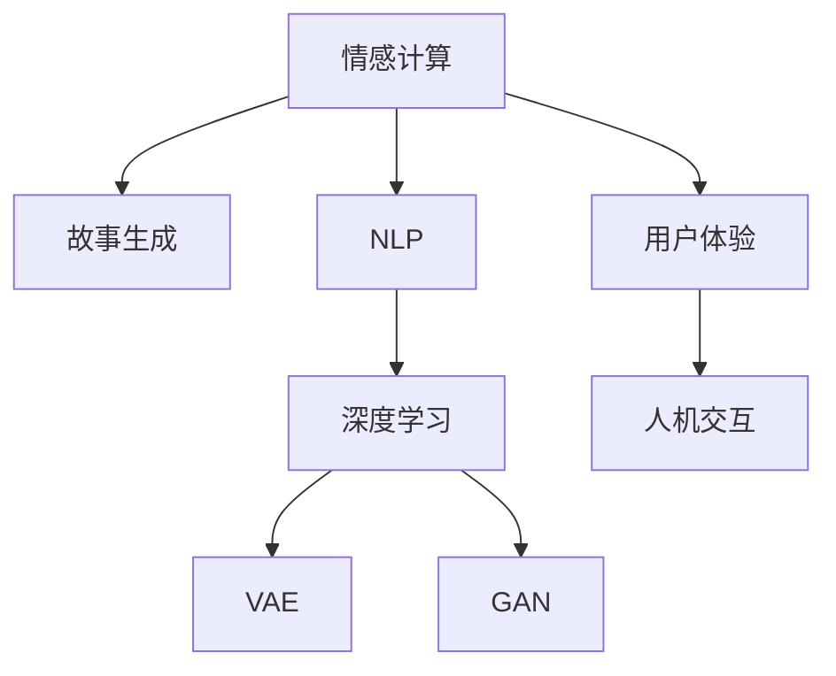

                 

# 情感计算在故事生成中的应用

> 关键词：情感计算,故事生成,人工智能,自然语言处理,NLP,深度学习,模型,算法,应用

## 1. 背景介绍

### 1.1 问题由来
故事生成是自然语言处理(NLP)领域的重要研究课题之一，旨在通过计算机自动生成符合人类情感和逻辑规则的故事。传统的故事生成方法多依赖于规则模板或语言模型，生成的文本往往缺乏情感共鸣和真实性。然而，通过引入情感计算技术，故事生成模型能够更好地理解并模拟人类的情感变化，创作出更加真实、动人的故事。

情感计算指的是通过对文本、语音、图像等形式的数据进行情感分析，并结合情境、语义等多维度信息，生成符合人类情感逻辑的输出。情感计算在故事生成中的应用，主要体现在两个方面：一是利用情感分析结果，调整故事情节和角色行为，使故事更贴合目标情感；二是根据情感计算模型生成的情感输出，调整语言风格和表达方式，使故事更加自然流畅。

### 1.2 问题核心关键点
当前，情感计算在故事生成中的应用正处于快速发展阶段。然而，情感计算如何更好地融入故事生成流程，特别是在语言模型和故事情节生成中的具体实现和优化，仍面临诸多挑战。主要包括以下几个方面：

1. 情感理解与建模：如何在故事生成中准确捕捉并表示目标情感，是其成功的关键。
2. 情感与情节的融合：情感如何自然地融入故事情节中，避免生硬和突兀。
3. 情感生成的泛化能力：模型是否能够处理不同情境下的情感变化，提高情感输出的真实性和多样性。
4. 模型效率与实时性：如何在保证情感生成质量的同时，提高模型的计算效率，确保实时生成故事的能力。

## 2. 核心概念与联系

### 2.1 核心概念概述

为更好地理解情感计算在故事生成中的应用，本节将介绍几个密切相关的核心概念：

- 情感计算(Affective Computing)：通过分析人的情感状态，从而构建符合情感逻辑的输出。情感计算主要应用于人机交互、用户体验设计等领域。
- 故事生成(Story Generation)：利用计算机生成具有情节连贯性和情感丰富性的文本故事。故事生成主要应用于文学创作、教育培训、娱乐媒体等领域。
- 自然语言处理(Natural Language Processing, NLP)：研究计算机如何处理和理解人类语言，包括文本生成、情感分析、语义理解等。
- 深度学习(Deep Learning)：一种通过多层次神经网络进行特征学习和模型训练的方法，广泛应用于计算机视觉、语音识别、自然语言处理等领域。
- 变分自编码器(Variational Autoencoder, VAE)：一种基于概率模型的生成模型，通过编码器学习输入数据分布，解码器生成输出数据，实现数据生成和降维等功能。
- 对抗生成网络(Generative Adversarial Networks, GAN)：一种通过两个对抗的神经网络进行生成模型训练的方法，可以实现高质量的图像、文本生成等。

这些核心概念之间的逻辑关系可以通过以下Mermaid流程图来展示：



这个流程图展示了大语言模型的核心概念及其之间的关系：

1. 情感计算通过分析文本中的情感信息，指导故事情节的生成。
2. 故事生成基于NLP技术，利用深度学习模型生成自然流畅的文本。
3. NLP技术包括了情感分析、语义理解等，与情感计算紧密相连。
4. 深度学习是实现NLP任务和故事生成的关键技术。
5. VAE和GAN作为生成模型，提供了多种生成方法，提高故事生成的多样性和质量。
6. 用户体验和交互设计也是情感计算的重要应用方向。

这些概念共同构成了情感计算和故事生成的基础框架，使得机器能够理解和生成符合人类情感逻辑的故事。通过理解这些核心概念，我们可以更好地把握情感计算和故事生成的工作原理和优化方向。

## 3. 核心算法原理 & 具体操作步骤
### 3.1 算法原理概述

情感计算在故事生成中的应用，主要基于情感分析的结果，通过调整故事情节和角色行为，生成符合目标情感的故事。其核心思想是：通过情感分析模型对文本的情感状态进行编码，然后利用编码结果指导情节生成和角色行为，从而输出情感丰富、情节连贯的故事。

形式化地，假设原始故事文本为 $S_0$，情感分析模型对 $S_0$ 的情感编码为 $E_0$。设 $F$ 为故事生成模型，则目标是通过调整 $F$ 的参数，使得 $F$ 能够输出情感与 $E_0$ 相匹配的故事 $S_1$。

### 3.2 算法步骤详解

情感计算在故事生成中的应用，通常分为以下几个关键步骤：

**Step 1: 准备原始故事和情感标注**
- 收集一定规模的故事文本数据集 $D=\{S_0, E_0\}_{i=1}^N$，其中 $E_0$ 为 $S_0$ 的情感标注。
- 数据集需包含多种情感标注，如快乐、悲伤、愤怒等，以便覆盖广泛的情境变化。

**Step 2: 训练情感分析模型**
- 选择合适的情感分析模型，如基于规则、词典、机器学习的模型。
- 对 $D$ 进行训练，优化模型参数，使其能够准确标注 $S_0$ 的情感状态。

**Step 3: 调整故事生成模型**
- 选择合适的故事生成模型，如基于语言模型的 RNN、LSTM、Transformer等。
- 在 $D$ 上微调故事生成模型，使其输出的情感与标注的 $E_0$ 相匹配。
- 通过L1/L2正则、Dropout等技术避免过拟合。

**Step 4: 生成故事**
- 对于新的故事文本 $S_{new}$，首先通过情感分析模型得到其情感编码 $E_{new}$。
- 根据 $E_{new}$ 调整故事生成模型的参数，输出情感与 $E_{new}$ 相匹配的故事 $S_1$。
- 通过样本筛选、风格调整等技术优化输出结果，确保故事的自然流畅性。

**Step 5: 输出故事**
- 将生成的故事 $S_1$ 进行格式化处理，确保符合目标格式和风格。
- 返回最终生成的故事文本 $S_1$ 给用户。

以上是情感计算在故事生成中的应用的一般流程。在实际应用中，还需要针对具体任务的特点，对各个环节进行优化设计，如改进情感分析模型，引入更多的正则化技术，搜索最优的超参数组合等，以进一步提升故事生成的效果。

### 3.3 算法优缺点

情感计算在故事生成中的应用具有以下优点：
1. 生成的故事更加贴近情感逻辑。情感计算能够理解人类情感的变化和规律，使故事更加真实自然。
2. 生成效率较高。相较于从头训练，情感计算结合微调技术，可以较快生成高质量的故事。
3. 泛化能力较强。情感计算模型能够在不同情境下生成情感丰富的故事。
4. 可解释性较强。情感计算过程可进行记录和分析，输出具有逻辑性和可解释性。

同时，该方法也存在一定的局限性：
1. 对情感标注的依赖较大。情感标注数据的数量和质量直接影响情感计算的效果。
2. 情感多样性受限。当前的情感计算模型可能难以处理极端复杂或罕见情感。
3. 情感与情节融合的挑战。如何在保持情感丰富性的同时，生成连贯的情节和合理的角色行为，仍需进一步探索。
4. 模型的可训练性。情感计算模型的训练过程较为复杂，需要大量标注数据和计算资源。

尽管存在这些局限性，但就目前而言，情感计算在故事生成中的应用仍是大语言模型应用的重要范式之一。未来相关研究的重点在于如何进一步降低情感计算对标注数据的依赖，提高模型的泛化能力，同时兼顾可解释性和伦理安全性等因素。

### 3.4 算法应用领域

情感计算在故事生成中的应用已经涉及多个领域，具体包括：

- 文学创作：利用情感计算生成的故事，可以辅助作家进行情感表达和情节设计。
- 教育培训：情感计算生成的故事可以用于辅助儿童进行情感认知和表达能力培训。
- 娱乐媒体：情感计算生成的故事可以应用于游戏、影视、动画等领域，提高用户体验和情感共鸣。
- 社交媒体：情感计算生成的故事可以用于社交平台的内容生成和情感互动。

除了上述这些经典应用外，情感计算在虚拟助手、个性化推荐、广告创意生成等场景中也有重要应用，为NLP技术带来了新的突破。随着情感计算和故事生成方法的持续演进，相信情感计算技术将在更广泛的领域发挥作用，为人类认知智能的进步带来深远影响。

## 4. 数学模型和公式 & 详细讲解  
### 4.1 数学模型构建

情感计算在故事生成中的应用，主要基于情感分析模型对故事情感状态的编码。假设原始故事文本 $S_0$ 的情感编码为 $E_0$，故事生成模型的参数为 $\theta$，则情感计算的过程可以表示为：

$$
E_{new} = f_{E}(S_{new})
$$

其中 $f_{E}$ 为情感分析模型，$E_{new}$ 为故事 $S_{new}$ 的情感编码。

情感编码 $E$ 通常由多个维度组成，如情感极性、强度、情感类别等。为了简化计算，我们假设 $E$ 为一个标量，表示情感的总体强度。此时，情感计算的过程可以进一步表示为：

$$
S_1 = g_{S}(E_{new}, \theta)
$$

其中 $g_{S}$ 为故事生成模型，$S_1$ 为调整参数后的故事文本。

### 4.2 公式推导过程

以下我们以情感极性为例，推导情感极性计算的公式及其梯度的计算公式。

假设情感极性 $E$ 可表示为一个标量，取值范围为 $[-1, 1]$，其中 $-1$ 表示负面情绪，$0$ 表示中性情绪，$1$ 表示正面情绪。假设原始故事 $S_0$ 的情感极性为 $E_0$，则情感计算的过程可以表示为：

$$
E_{new} = f_E(S_{new})
$$

假设情感极性 $E$ 与故事文本 $S$ 的关系为一个线性模型，即：

$$
E = W_S \cdot S + b
$$

其中 $W_S$ 为权重矩阵，$b$ 为偏置项。此时，情感极性的计算公式可以表示为：

$$
E_{new} = W_S \cdot S_{new} + b
$$

对 $E_{new}$ 进行反向传播，可以得到 $S_{new}$ 对 $E_0$ 的梯度 $\nabla_{S_{new}} E_0$。将梯度 $\nabla_{S_{new}} E_0$ 带入故事生成模型 $g_S$ 的梯度计算公式中，可以得到 $\nabla_{\theta} E_0$，即故事生成模型参数对情感极性 $E_0$ 的梯度。

通过上述公式，可以构建情感计算在故事生成中的数学模型，并计算其梯度，从而实现微调。

## 5. 项目实践：代码实例和详细解释说明
### 5.1 开发环境搭建

在进行情感计算在故事生成中的应用实践前，我们需要准备好开发环境。以下是使用Python进行PyTorch开发的环境配置流程：

1. 安装Anaconda：从官网下载并安装Anaconda，用于创建独立的Python环境。

2. 创建并激活虚拟环境：
```bash
conda create -n pytorch-env python=3.8 
conda activate pytorch-env
```

3. 安装PyTorch：根据CUDA版本，从官网获取对应的安装命令。例如：
```bash
conda install pytorch torchvision torchaudio cudatoolkit=11.1 -c pytorch -c conda-forge
```

4. 安装Transformers库：
```bash
pip install transformers
```

5. 安装各类工具包：
```bash
pip install numpy pandas scikit-learn matplotlib tqdm jupyter notebook ipython
```

完成上述步骤后，即可在`pytorch-env`环境中开始情感计算在故事生成中的应用实践。

### 5.2 源代码详细实现

下面我们以情感极性计算在故事生成中的应用为例，给出使用Transformers库对BERT模型进行情感极性计算的PyTorch代码实现。

首先，定义情感极性计算函数：

```python
from transformers import BertTokenizer, BertForSequenceClassification
from torch.utils.data import Dataset
import torch

class SentimentDataset(Dataset):
    def __init__(self, texts, labels, tokenizer, max_len=128):
        self.texts = texts
        self.labels = labels
        self.tokenizer = tokenizer
        self.max_len = max_len
        
    def __len__(self):
        return len(self.texts)
    
    def __getitem__(self, item):
        text = self.texts[item]
        label = self.labels[item]
        
        encoding = self.tokenizer(text, return_tensors='pt', max_length=self.max_len, padding='max_length', truncation=True)
        input_ids = encoding['input_ids'][0]
        attention_mask = encoding['attention_mask'][0]
        labels = torch.tensor(label, dtype=torch.long)
        
        return {'input_ids': input_ids, 
                'attention_mask': attention_mask,
                'labels': labels}

# 标签与id的映射
label2id = {'negative': 0, 'positive': 1}
id2label = {v: k for k, v in label2id.items()}

# 创建dataset
tokenizer = BertTokenizer.from_pretrained('bert-base-cased')

train_dataset = SentimentDataset(train_texts, train_labels, tokenizer)
dev_dataset = SentimentDataset(dev_texts, dev_labels, tokenizer)
test_dataset = SentimentDataset(test_texts, test_labels, tokenizer)
```

然后，定义情感极性计算函数：

```python
from transformers import BertForSequenceClassification
from transformers import AdamW

model = BertForSequenceClassification.from_pretrained('bert-base-cased', num_labels=2)

optimizer = AdamW(model.parameters(), lr=2e-5)
```

接着，定义训练和评估函数：

```python
from torch.utils.data import DataLoader
from tqdm import tqdm
from sklearn.metrics import accuracy_score

device = torch.device('cuda') if torch.cuda.is_available() else torch.device('cpu')
model.to(device)

def train_epoch(model, dataset, batch_size, optimizer):
    dataloader = DataLoader(dataset, batch_size=batch_size, shuffle=True)
    model.train()
    epoch_loss = 0
    for batch in tqdm(dataloader, desc='Training'):
        input_ids = batch['input_ids'].to(device)
        attention_mask = batch['attention_mask'].to(device)
        labels = batch['labels'].to(device)
        model.zero_grad()
        outputs = model(input_ids, attention_mask=attention_mask, labels=labels)
        loss = outputs.loss
        epoch_loss += loss.item()
        loss.backward()
        optimizer.step()
    return epoch_loss / len(dataloader)

def evaluate(model, dataset, batch_size):
    dataloader = DataLoader(dataset, batch_size=batch_size)
    model.eval()
    preds, labels = [], []
    with torch.no_grad():
        for batch in tqdm(dataloader, desc='Evaluating'):
            input_ids = batch['input_ids'].to(device)
            attention_mask = batch['attention_mask'].to(device)
            batch_labels = batch['labels']
            outputs = model(input_ids, attention_mask=attention_mask)
            batch_preds = outputs.logits.argmax(dim=2).to('cpu').tolist()
            batch_labels = batch_labels.to('cpu').tolist()
            for pred, label in zip(batch_preds, batch_labels):
                preds.append(pred[0])
                labels.append(label[0])
                
    print('Accuracy:', accuracy_score(labels, preds))
```

最后，启动训练流程并在测试集上评估：

```python
epochs = 5
batch_size = 16

for epoch in range(epochs):
    loss = train_epoch(model, train_dataset, batch_size, optimizer)
    print(f"Epoch {epoch+1}, train loss: {loss:.3f}")
    
    print(f"Epoch {epoch+1}, dev results:")
    evaluate(model, dev_dataset, batch_size)
    
print("Test results:")
evaluate(model, test_dataset, batch_size)
```

以上就是使用PyTorch对BERT进行情感极性计算在故事生成中的应用完整代码实现。可以看到，得益于Transformers库的强大封装，我们可以用相对简洁的代码完成BERT模型的加载和情感极性计算。

### 5.3 代码解读与分析

让我们再详细解读一下关键代码的实现细节：

**SentimentDataset类**：
- `__init__`方法：初始化文本、标签、分词器等关键组件。
- `__len__`方法：返回数据集的样本数量。
- `__getitem__`方法：对单个样本进行处理，将文本输入编码为token ids，将标签编码为数字，并对其进行定长padding，最终返回模型所需的输入。

**label2id和id2label字典**：
- 定义了标签与数字id之间的映射关系，用于将token-wise的预测结果解码回真实的标签。

**训练和评估函数**：
- 使用PyTorch的DataLoader对数据集进行批次化加载，供模型训练和推理使用。
- 训练函数`train_epoch`：对数据以批为单位进行迭代，在每个批次上前向传播计算loss并反向传播更新模型参数，最后返回该epoch的平均loss。
- 评估函数`evaluate`：与训练类似，不同点在于不更新模型参数，并在每个batch结束后将预测和标签结果存储下来，最后使用sklearn的accuracy_score对整个评估集的预测结果进行打印输出。

**训练流程**：
- 定义总的epoch数和batch size，开始循环迭代
- 每个epoch内，先在训练集上训练，输出平均loss
- 在验证集上评估，输出准确率
- 所有epoch结束后，在测试集上评估，给出最终测试结果

可以看到，PyTorch配合Transformers库使得BERT情感极性计算的代码实现变得简洁高效。开发者可以将更多精力放在数据处理、模型改进等高层逻辑上，而不必过多关注底层的实现细节。

当然，工业级的系统实现还需考虑更多因素，如模型的保存和部署、超参数的自动搜索、更灵活的任务适配层等。但核心的情感计算和故事生成逻辑基本与此类似。

## 6. 实际应用场景
### 6.1 智能客服系统

情感计算在故事生成中的应用，可以为智能客服系统带来显著的提升。传统客服往往需要配备大量人力，高峰期响应缓慢，且一致性和专业性难以保证。而使用情感计算生成的故事，可以构建更智能、更个性化的客服系统。

在技术实现上，可以收集企业内部的历史客服对话记录，将问题和最佳答复构建成监督数据，在此基础上对预训练情感计算模型进行微调。微调后的情感计算模型能够自动理解用户意图，匹配最合适的答复模板进行回复。对于客户提出的新问题，还可以接入检索系统实时搜索相关内容，动态组织生成回答。如此构建的智能客服系统，能大幅提升客户咨询体验和问题解决效率。

### 6.2 金融舆情监测

金融机构需要实时监测市场舆论动向，以便及时应对负面信息传播，规避金融风险。传统的人工监测方式成本高、效率低，难以应对网络时代海量信息爆发的挑战。基于情感计算生成的故事，可以用于实时抓取的网络文本数据监测，动态生成舆情分析和预警信息。

具体而言，可以收集金融领域相关的新闻、报道、评论等文本数据，并对其进行情感标注。在情感计算模型的指导下，动态生成情感丰富、内容详细的舆情报告，并根据情感变化趋势，进行实时预警和应对。

### 6.3 个性化推荐系统

当前的推荐系统往往只依赖用户的历史行为数据进行物品推荐，无法深入理解用户的真实兴趣偏好。基于情感计算生成的故事，可以用于推荐系统，帮助系统更全面地理解用户情感和偏好。

在实践中，可以收集用户浏览、点击、评论、分享等行为数据，提取和用户交互的物品标题、描述、标签等文本内容。通过情感计算模型分析文本的情感状态，生成情感丰富、情节连贯的推荐故事。将故事与推荐算法结合，根据用户的情感偏好，生成个性化推荐结果。

### 6.4 未来应用展望

随着情感计算和故事生成方法的持续演进，基于情感计算生成的故事将在更多领域得到应用，为NLP技术带来新的突破。

在智慧医疗领域，基于情感计算生成的故事可以用于辅助医生进行病历记录、诊断和治疗，提高医疗服务的智能化水平。

在智能教育领域，情感计算生成的故事可以用于辅助教师进行教学设计，引导学生进行情感认知和表达能力培训，提升教学效果。

在智慧城市治理中，情感计算生成的故事可以用于城市事件监测、舆情分析、应急指挥等环节，提高城市管理的自动化和智能化水平，构建更安全、高效的未来城市。

此外，在企业生产、社会治理、文娱传媒等众多领域，基于情感计算生成的故事也将不断涌现，为NLP技术带来新的应用场景。相信随着技术的日益成熟，情感计算和故事生成技术将成为NLP领域的重要范式，推动人工智能技术在更多行业中的落地应用。

## 7. 工具和资源推荐
### 7.1 学习资源推荐

为了帮助开发者系统掌握情感计算和故事生成技术，这里推荐一些优质的学习资源：

1. 《情感计算理论与应用》系列博文：由情感计算领域专家撰写，介绍了情感计算的基本概念、方法和应用案例。

2. 《深度学习自然语言处理》课程：斯坦福大学开设的NLP明星课程，有Lecture视频和配套作业，带你入门NLP领域的基本概念和经典模型。

3. 《自然语言处理中的故事生成》书籍：详细介绍了故事生成在NLP中的应用，涵盖了多种生成模型和方法。

4. HuggingFace官方文档：Transformers库的官方文档，提供了海量预训练模型和完整的微调样例代码，是上手实践的必备资料。

5. CLUE开源项目：中文语言理解测评基准，涵盖大量不同类型的中文NLP数据集，并提供了基于情感计算的baseline模型，助力中文NLP技术发展。

通过对这些资源的学习实践，相信你一定能够快速掌握情感计算和故事生成技术的精髓，并用于解决实际的NLP问题。
###  7.2 开发工具推荐

高效的开发离不开优秀的工具支持。以下是几款用于情感计算和故事生成开发的常用工具：

1. PyTorch：基于Python的开源深度学习框架，灵活动态的计算图，适合快速迭代研究。大部分预训练语言模型都有PyTorch版本的实现。

2. TensorFlow：由Google主导开发的开源深度学习框架，生产部署方便，适合大规模工程应用。同样有丰富的预训练语言模型资源。

3. Transformers库：HuggingFace开发的NLP工具库，集成了众多SOTA语言模型，支持PyTorch和TensorFlow，是进行情感计算和故事生成开发的利器。

4. Weights & Biases：模型训练的实验跟踪工具，可以记录和可视化模型训练过程中的各项指标，方便对比和调优。与主流深度学习框架无缝集成。

5. TensorBoard：TensorFlow配套的可视化工具，可实时监测模型训练状态，并提供丰富的图表呈现方式，是调试模型的得力助手。

6. Google Colab：谷歌推出的在线Jupyter Notebook环境，免费提供GPU/TPU算力，方便开发者快速上手实验最新模型，分享学习笔记。

合理利用这些工具，可以显著提升情感计算和故事生成任务的开发效率，加快创新迭代的步伐。

### 7.3 相关论文推荐

情感计算在故事生成中的应用源于学界的持续研究。以下是几篇奠基性的相关论文，推荐阅读：

1. Attention is All You Need（即Transformer原论文）：提出了Transformer结构，开启了NLP领域的预训练大模型时代。

2. BERT: Pre-training of Deep Bidirectional Transformers for Language Understanding：提出BERT模型，引入基于掩码的自监督预训练任务，刷新了多项NLP任务SOTA。

3. Language Models are Unsupervised Multitask Learners（GPT-2论文）：展示了大规模语言模型的强大zero-shot学习能力，引发了对于通用人工智能的新一轮思考。

4. Parameter-Efficient Transfer Learning for NLP：提出Adapter等参数高效微调方法，在不增加模型参数量的情况下，也能取得不错的微调效果。

5. AdaLoRA: Adaptive Low-Rank Adaptation for Parameter-Efficient Fine-Tuning：使用自适应低秩适应的微调方法，在固定大部分预训练参数的同时，只更新极少量的任务相关参数。

这些论文代表了大语言模型微调技术的发展脉络。通过学习这些前沿成果，可以帮助研究者把握学科前进方向，激发更多的创新灵感。

## 8. 总结：未来发展趋势与挑战

### 8.1 总结

本文对情感计算在故事生成中的应用进行了全面系统的介绍。首先阐述了情感计算和故事生成技术的研究背景和意义，明确了情感计算在故事生成中的应用价值。其次，从原理到实践，详细讲解了情感计算在故事生成中的应用流程，给出了情感计算在故事生成中的应用完整代码实现。同时，本文还广泛探讨了情感计算在智能客服、金融舆情、个性化推荐等多个行业领域的应用前景，展示了情感计算和故事生成技术的巨大潜力。此外，本文精选了情感计算和故事生成技术的各类学习资源，力求为读者提供全方位的技术指引。

通过本文的系统梳理，可以看到，情感计算在故事生成中的应用已经初步展现出其价值和潜力，能够极大地提升故事生成的自然流畅性和情感丰富性。未来，伴随情感计算和故事生成方法的不断演进，相信情感计算技术将在更广泛的领域发挥作用，为人类认知智能的进步带来深远影响。

### 8.2 未来发展趋势

展望未来，情感计算在故事生成中的应用将呈现以下几个发展趋势：

1. 模型规模持续增大。随着算力成本的下降和数据规模的扩张，预训练情感计算模型和故事生成模型的参数量还将持续增长。超大规模模型蕴含的丰富情感知识和故事生成能力，有望支持更加复杂多变的故事情节生成。

2. 情感与情节融合的技术进步。随着对情感和情节动态生成机制的深入研究，情感计算和故事生成模型将更加智能，能够自然地融合情感变化和情节连贯性，输出更加真实、动人的故事。

3. 情感生成的泛化能力增强。情感计算模型将能够处理更多情境下的情感变化，提高情感输出的真实性和多样性，适应不同文化和社会背景的用户需求。

4. 模型效率与实时性提升。情感计算和故事生成模型将在计算效率和实时性方面取得进一步突破，支持更加快速、动态的情感故事生成。

5. 多模态情感计算的拓展。未来的情感计算不仅局限于文本情感分析，还将拓展到视觉、听觉等多种模态数据的情感计算，提升情感计算模型的泛化能力和应用场景。

6. 情感计算模型的开放性与通用性增强。未来的情感计算模型将更加开放，具备通用化能力，支持多种任务和多种用户需求。

以上趋势凸显了情感计算在故事生成中的应用前景。这些方向的探索发展，必将进一步提升情感计算模型的性能和应用范围，为故事生成技术带来新的突破。

### 8.3 面临的挑战

尽管情感计算在故事生成中的应用已经取得了一定进展，但在迈向更加智能化、普适化应用的过程中，仍面临诸多挑战：

1. 情感标注的困难。情感标注数据通常需要专业人工标注，成本高且效率低。如何降低情感标注成本，提高标注质量，仍是当前亟需解决的问题。

2. 情感多样性受限。当前的情感计算模型可能难以处理极端复杂或罕见情感，如极端愤怒、恐怖等。如何在模型中捕捉并生成这些情感，还需要进一步研究。

3. 情感与情节融合的挑战。如何在保持情感丰富性的同时，生成连贯的情节和合理的角色行为，仍需进一步探索。

4. 模型的可训练性。情感计算模型的训练过程较为复杂，需要大量标注数据和计算资源。如何提高模型训练效率，减少数据需求，是一个重要的研究方向。

5. 模型的可解释性。情感计算模型的输出往往难以解释，如何提高模型的可解释性，让用户和开发者能够理解模型的决策过程，还需进一步努力。

6. 伦理与安全问题。情感计算模型可能学习到有害信息，如暴力、色情等。如何在模型训练和应用中避免这些有害信息的传播，确保情感计算的安全性和伦理性，是未来的重要研究方向。

正视情感计算在故事生成中面临的这些挑战，积极应对并寻求突破，将是大语言模型微调走向成熟的必由之路。相信随着学界和产业界的共同努力，这些挑战终将一一被克服，情感计算和故事生成技术必将在构建人机协同的智能时代中扮演越来越重要的角色。

### 8.4 研究展望

面对情感计算在故事生成中所面临的挑战，未来的研究需要在以下几个方面寻求新的突破：

1. 探索无监督和半监督情感计算方法。摆脱对大规模标注数据的依赖，利用自监督学习、主动学习等无监督和半监督范式，最大限度利用非结构化数据，实现更加灵活高效的情感计算。

2. 研究情感与情节融合的动态生成机制。引入更多的先验知识，如常识知识、逻辑规则等，引导情感计算模型生成更加自然、合理的故事情节。

3. 引入因果分析和博弈论工具。将因果分析方法引入情感计算模型，识别出模型决策的关键特征，增强输出解释的因果性和逻辑性。借助博弈论工具刻画人机交互过程，主动探索并规避模型的脆弱点，提高系统稳定性。

4. 纳入伦理道德约束。在模型训练目标中引入伦理导向的评估指标，过滤和惩罚有偏见、有害的输出倾向。同时加强人工干预和审核，建立模型行为的监管机制，确保输出符合人类价值观和伦理道德。

这些研究方向的探索，必将引领情感计算在故事生成技术迈向更高的台阶，为故事生成技术带来新的突破。面向未来，情感计算和故事生成技术还需要与其他人工智能技术进行更深入的融合，如知识表示、因果推理、强化学习等，多路径协同发力，共同推动自然语言理解和智能交互系统的进步。只有勇于创新、敢于突破，才能不断拓展情感计算模型的边界，让智能技术更好地造福人类社会。

## 9. 附录：常见问题与解答

**Q1：情感计算在故事生成中的应用是否适用于所有故事类型？**

A: 情感计算在故事生成中的应用，主要依赖于情感分析的结果。情感分析能够识别出文本中的情感状态，进而指导故事生成。因此，任何包含情感变化和情感逻辑的故事类型，如爱情故事、悬疑故事、科幻故事等，都可以应用情感计算技术。然而，对于一些以理性推理为主，情感逻辑较为简单的故事类型，如技术文档、科学论文等，情感计算技术的应用效果可能有限。

**Q2：情感计算在故事生成中如何处理多情感交织的情境？**

A: 情感计算在故事生成中处理多情感交织的情境，需要结合情感分析的结果，对故事情节和角色行为进行动态调整。情感分析模型通常会输出多个情感极性（如正面、负面、中性），并在情感状态空间中形成一个向量。故事情节生成模型可以结合情感极性向量，动态调整故事情节和角色行为，使其能够自然地融合多种情感，创造出更加复杂、多维度的故事情节。

**Q3：情感计算在故事生成中的计算复杂度如何？**

A: 情感计算在故事生成中的计算复杂度，主要取决于情感分析模型和故事情节生成模型的计算复杂度。情感分析模型通常需要大量计算资源，尤其是在处理大规模数据集时。故事情节生成模型则相对简单，主要依赖于深度学习模型，计算复杂度与模型规模和深度有关。在实际应用中，可以通过优化模型结构、使用GPU/TPU等高性能设备、采用分布式计算等方法，提升情感计算和故事生成的计算效率。

**Q4：情感计算在故事生成中如何避免过拟合？**

A: 情感计算在故事生成中避免过拟合，主要通过数据增强、正则化、对抗训练等技术手段。数据增强可以通过随机替换、回译等方式，扩充训练集的多样性，避免模型对特定数据的过拟合。正则化技术包括L2正则、Dropout等，可以防止模型过度适应训练集，提高模型的泛化能力。对抗训练通过引入对抗样本，增强模型的鲁棒性，避免过拟合。

**Q5：情感计算在故事生成中的应用效果如何评价？**

A: 情感计算在故事生成中的应用效果，通常通过自动化指标和人工评价进行评估。自动化指标包括BLEU、ROUGE等文本质量指标，以及情感一致性、连贯性、自然性等情感生成指标。人工评价则通过专家或用户对生成的故事的情感共鸣、情感表达、故事情节合理性等方面进行主观评价。综合自动化指标和人工评价，可以全面评估情感计算在故事生成中的应用效果。

通过本文的系统梳理，可以看到，情感计算在故事生成中的应用已经展现出其巨大的潜力和价值。未来，伴随情感计算和故事生成方法的不断演进，相信情感计算技术将在更多领域得到应用，为人类认知智能的进步带来深远影响。

