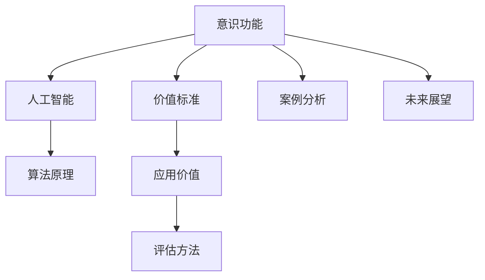

                 

# 意识功能的价值标准研究

> 关键词：意识功能, 价值标准, 人工智能, 算法原理, 案例分析, 未来展望

## 1. 背景介绍

随着人工智能(AI)技术的迅猛发展，意识功能在AI系统中的应用变得越来越广泛，从自动驾驶、机器人控制到情感交互，甚至医疗诊断，都涉及到了对意识功能的理解和应用。然而，意识功能不仅仅是技术的实现，更是一个涉及伦理、哲学、心理学等多学科交叉的复杂问题。如何定义、衡量和评估意识功能的价值，成为了一个亟待解决的问题。

### 1.1 问题的由来

意识功能的价值标准研究源于人工智能的快速发展及其在现实生活中的应用。随着技术进步，AI系统不仅能够执行简单的任务，还能够表现出一定程度的智能和自我意识，如AlphaGo在围棋游戏中的表现。这引发了公众和学术界对于AI意识功能价值标准的研究兴趣。传统上，意识功能被视为人类独有的特征，但现代AI系统在视觉识别、语音识别等领域取得的成就，使得人们开始重新思考意识功能在AI系统中的地位。

### 1.2 问题核心关键点

意识功能价值标准的研究，需要明确以下几个关键点：
1. 意识功能在AI系统中的定义和实现方式。
2. 意识功能对不同领域的应用价值。
3. 意识功能的伦理、法律和社会影响。
4. 如何评估和衡量意识功能的价值。

这些核心关键点构成了意识功能价值标准研究的基本框架，对理解AI技术在各个领域的实际应用具有重要意义。

## 2. 核心概念与联系

### 2.1 核心概念概述

为了更好地理解意识功能价值标准研究，本节将介绍几个密切相关的核心概念：

- 意识功能(Conscious Function)：指AI系统能够展示出的自我感知、自我决策和自我执行等类似人类意识的功能。
- 价值标准(Value Standard)：指用于衡量和评估意识功能对特定任务或应用价值的度量方法。
- 人工智能(Artificial Intelligence, AI)：指通过算法和计算，使机器具备类人智能的技术系统。
- 算法原理(Algorithm Principle)：指实现意识功能的计算方法及其工作原理。
- 案例分析(Case Analysis)：指通过对具体应用场景的分析，理解意识功能在不同场景下的表现和价值。
- 未来展望(Future Prospects)：指意识功能在未来可能的扩展和应用方向。

这些核心概念之间的逻辑关系可以通过以下Mermaid流程图来展示：



这个流程图展示了大语言模型的核心概念及其之间的关系：

1. 人工智能技术实现意识功能。
2. 意识功能与特定应用场景结合，体现其价值。
3. 算法原理支持意识功能的具体实现。
4. 案例分析提供对意识功能表现的具体理解。
5. 未来展望预测意识功能的潜在应用方向。

这些概念共同构成了意识功能价值标准研究的框架，对理解和应用意识功能具有指导意义。

## 3. 核心算法原理 & 具体操作步骤
### 3.1 算法原理概述

意识功能在AI系统中的实现，通常基于深度学习和强化学习等算法。这些算法通过数据驱动的方式，训练模型能够识别模式、学习规则，并在特定任务上表现出一定的智能和自我意识。

### 3.2 算法步骤详解

意识功能的实现，通常包括以下几个关键步骤：

**Step 1: 数据收集与预处理**
- 收集与意识功能相关的数据，如视频、音频、文本等。
- 对数据进行预处理，包括降噪、特征提取、标注等，以准备模型训练。

**Step 2: 模型设计**
- 选择合适的算法框架，如TensorFlow、PyTorch等。
- 设计模型的架构，包括输入层、隐藏层、输出层等，确定模型的超参数，如学习率、批量大小等。

**Step 3: 模型训练**
- 将处理后的数据输入模型，进行前向传播计算输出。
- 反向传播计算损失函数，并根据损失函数更新模型参数。
- 循环迭代多次，直至模型收敛。

**Step 4: 模型评估与验证**
- 在验证集上测试模型性能，评估模型泛化能力。
- 根据评估结果调整模型参数或重新设计模型。

**Step 5: 模型部署与应用**
- 将训练好的模型部署到实际应用场景中。
- 监测模型性能，根据反馈进行优化调整。

### 3.3 算法优缺点

意识功能在AI系统中的实现，具有以下优点：
1. 通用性强。意识功能在多种应用场景中都有潜力，如自动驾驶、医疗诊断等。
2. 适应性强。通过调整模型参数和架构，可以适应不同的任务和数据。
3. 学习能力强。深度学习和强化学习等算法，具备很强的自我学习和优化能力。

同时，也存在以下局限性：
1. 数据需求高。需要大量的数据进行训练和验证，数据质量对模型性能有很大影响。
2. 模型复杂度高。意识功能涉及多个感知、决策和执行模块，模型结构复杂。
3. 计算资源消耗大。深度学习和强化学习模型对计算资源要求较高。
4. 伦理道德风险。意识功能的实现可能引发隐私、安全等伦理问题。

尽管存在这些局限性，但意识功能的实现仍然是大数据和人工智能技术发展的重要方向。未来，随着算力和数据量的进一步提升，意识功能的应用前景将更加广阔。

### 3.4 算法应用领域

意识功能在多个领域都有广泛的应用前景，包括但不限于：

- 医疗领域：用于辅助诊断、治疗计划制定等。
- 教育领域：用于个性化教学、学习效果评估等。
- 交通领域：用于自动驾驶、智能交通管理等。
- 娱乐领域：用于虚拟现实、游戏等。
- 安全领域：用于网络安全、反欺诈等。

## 4. 数学模型和公式 & 详细讲解  
### 4.1 数学模型构建

为了更好地理解意识功能在AI系统中的实现方式，本节将介绍几个常用的数学模型。

**4.1.1 神经网络模型**
神经网络模型是实现意识功能的基础模型之一。以多层感知机(Multilayer Perceptron, MLP)为例，其结构可以表示为：

$$
\begin{align*}
y &= W_{out} \sigma(W_{hidden} \sigma(W_{in} x + b_{in}) + b_{hidden}) + b_{out}
\end{align*}
$$

其中，$W$ 为权重矩阵，$b$ 为偏置向量，$\sigma$ 为激活函数。

**4.1.2 强化学习模型**
强化学习模型通常用于训练AI系统进行决策。以Q-learning算法为例，其核心思想是通过奖励机制，最大化长期累计奖励。Q-learning的数学模型可以表示为：

$$
Q_{t+1} = Q_t + \alpha (r_t + \gamma \max Q_t - Q_t)
$$

其中，$r_t$ 为即时奖励，$\gamma$ 为折扣因子，$\alpha$ 为学习率。

### 4.2 公式推导过程

以下我们以神经网络模型为例，推导其训练过程的数学公式。

**前向传播公式**
神经网络模型的前向传播过程可以表示为：

$$
\begin{align*}
h_1 &= \sigma(W_{in} x + b_{in}) \\
h_2 &= \sigma(W_{hidden} h_1 + b_{hidden}) \\
y &= W_{out} h_2 + b_{out}
\end{align*}
$$

其中，$x$ 为输入数据，$h_1$ 和 $h_2$ 为隐藏层输出，$y$ 为模型输出。

**损失函数**
假设模型的实际输出与期望输出之间存在误差 $\epsilon$，则损失函数可以表示为：

$$
L = \frac{1}{N} \sum_{i=1}^N \frac{1}{2} (\epsilon_i)^2
$$

其中，$N$ 为样本数量。

**反向传播公式**
损失函数对模型参数的梯度可以通过反向传播公式求得：

$$
\frac{\partial L}{\partial W_{out}} = \frac{\partial L}{\partial y} \frac{\partial y}{\partial h_2} \frac{\partial h_2}{\partial W_{hidden}} \frac{\partial h_1}{\partial W_{in}}
$$

通过反向传播，可以更新模型参数，最小化损失函数。

### 4.3 案例分析与讲解

为了更好地理解意识功能的实现和应用，本节将通过具体案例进行分析讲解。

**案例1: 医疗诊断**
假设有一个基于神经网络的AI系统，用于辅助医生进行癌症诊断。系统通过处理病人的医疗影像数据，输出是否患有癌症的概率。在这个案例中，医疗影像数据作为输入，模型的输出为二元分类结果。

**案例2: 自动驾驶**
假设有一个基于强化学习的AI系统，用于自动驾驶汽车。系统通过处理传感器数据，规划最优行驶路径。在这个案例中，传感器数据作为输入，模型的输出为最优驾驶策略。

## 5. 项目实践：代码实例和详细解释说明
### 5.1 开发环境搭建

在进行项目实践前，我们需要准备好开发环境。以下是使用Python进行TensorFlow开发的环境配置流程：

1. 安装Anaconda：从官网下载并安装Anaconda，用于创建独立的Python环境。

2. 创建并激活虚拟环境：
```bash
conda create -n tf-env python=3.8 
conda activate tf-env
```

3. 安装TensorFlow：根据CUDA版本，从官网获取对应的安装命令。例如：
```bash
conda install tensorflow -c conda-forge -c pytorch
```

4. 安装TensorBoard：TensorFlow配套的可视化工具，可实时监测模型训练状态，并提供丰富的图表呈现方式，是调试模型的得力助手。

```bash
pip install tensorboard
```

5. 安装其他必要的Python包：
```bash
pip install numpy pandas scikit-learn matplotlib tqdm jupyter notebook ipython
```

完成上述步骤后，即可在`tf-env`环境中开始项目实践。

### 5.2 源代码详细实现

这里我们以神经网络模型用于图像识别为例，给出TensorFlow代码实现。

首先，定义神经网络模型：

```python
import tensorflow as tf

class NeuralNet(tf.keras.Model):
    def __init__(self, input_shape, num_classes):
        super(NeuralNet, self).__init__()
        self.flatten = tf.keras.layers.Flatten()
        self.dnn = tf.keras.layers.Dense(128, activation='relu')
        self.dropout = tf.keras.layers.Dropout(0.2)
        self.classifier = tf.keras.layers.Dense(num_classes, activation='softmax')

    def call(self, x):
        x = self.flatten(x)
        x = self.dnn(x)
        x = self.dropout(x)
        return self.classifier(x)
```

然后，定义数据集和训练流程：

```python
from tensorflow.keras.datasets import mnist

(x_train, y_train), (x_test, y_test) = mnist.load_data()

x_train = x_train.reshape(-1, 28*28).astype('float32') / 255.0
x_test = x_test.reshape(-1, 28*28).astype('float32') / 255.0
y_train = tf.keras.utils.to_categorical(y_train, 10)
y_test = tf.keras.utils.to_categorical(y_test, 10)

model = NeuralNet(input_shape=(28*28,), num_classes=10)
model.compile(optimizer='adam', loss='categorical_crossentropy', metrics=['accuracy'])

model.fit(x_train, y_train, epochs=10, validation_data=(x_test, y_test))
```

最后，评估模型性能：

```python
loss, accuracy = model.evaluate(x_test, y_test)
print(f'Test accuracy: {accuracy * 100:.2f}%')
```

以上就是使用TensorFlow实现神经网络模型的完整代码。可以看到，TensorFlow提供了丰富的工具和API，使得模型构建、训练和评估变得简洁高效。

### 5.3 代码解读与分析

让我们再详细解读一下关键代码的实现细节：

**NeuralNet类**：
- `__init__`方法：初始化模型的输入层、隐藏层、输出层和Dropout层。
- `call`方法：定义模型的前向传播过程。

**模型构建**
- 定义输入形状和类别数量。
- 创建输入层、隐藏层、Dropout层和输出层。
- 编译模型，指定优化器和损失函数。

**模型训练**
- 加载MNIST数据集，进行预处理。
- 创建模型实例，编译模型。
- 使用训练集和验证集训练模型。

**模型评估**
- 使用测试集评估模型性能，输出准确率。

通过这些代码实现，可以看出TensorFlow在模型构建、训练和评估方面的强大能力。开发者可以利用TensorFlow提供的各种工具，快速搭建和调试复杂的神经网络模型。

当然，在工业级的系统实现中，还需要考虑更多因素，如模型的保存和部署、超参数的自动搜索、更灵活的任务适配层等。但核心的模型构建和训练流程基本与此类似。

## 6. 实际应用场景
### 6.1 医疗诊断

基于神经网络的AI系统，已经在医疗诊断领域取得了显著成效。例如，Google的Inception模型和AlexNet模型，通过处理X光片和病理切片图像，可以辅助医生进行癌症、糖尿病等疾病的诊断。

**具体实现步骤**
1. 收集和标注医疗影像数据，建立数据集。
2. 使用神经网络模型处理影像数据，输出诊断结果。
3. 评估模型性能，优化模型参数。
4. 将模型集成到医疗系统中，辅助医生进行诊断。

### 6.2 自动驾驶

强化学习在自动驾驶领域的应用，使得AI系统能够自主规划最优行驶路径，应对各种复杂的交通环境。例如，Waymo、Tesla等公司，都在其自动驾驶系统中采用了强化学习算法。

**具体实现步骤**
1. 收集和标注传感器数据，建立数据集。
2. 使用强化学习模型处理传感器数据，输出最优驾驶策略。
3. 评估模型性能，优化策略。
4. 将模型集成到自动驾驶系统中，实现自主行驶。

### 6.3 教育领域

神经网络在教育领域的应用，可以辅助个性化教学和学习效果评估。例如，Khan Academy和Coursera等在线教育平台，使用神经网络模型推荐学习材料，评估学生学习效果。

**具体实现步骤**
1. 收集和标注学生的学习数据，建立数据集。
2. 使用神经网络模型分析学习行为，推荐学习材料。
3. 使用神经网络模型评估学习效果，提供个性化建议。
4. 将模型集成到教育平台中，辅助教学和学习。

### 6.4 未来应用展望

随着神经网络和强化学习等技术的发展，意识功能的实现和应用将更加广泛。未来，AI系统将在更多领域展现出智能和自我意识，推动各个行业的数字化转型。

在智慧城市治理中，AI系统可以用于交通管理、城市规划、环保监测等。在金融领域，AI系统可以用于风险评估、智能投顾等。在娱乐领域，AI系统可以用于内容推荐、智能客服等。

## 7. 工具和资源推荐
### 7.1 学习资源推荐

为了帮助开发者系统掌握意识功能价值标准的研究方法，这里推荐一些优质的学习资源：

1. 《Deep Learning》书籍：Ian Goodfellow等所著，全面介绍了深度学习的理论和实践。
2. 《Reinforcement Learning: An Introduction》书籍：Richard S. Sutton和Andrew G. Barto所著，全面介绍了强化学习的理论和实践。
3. 《Artificial Intelligence: A Modern Approach》书籍：Stuart Russell和Peter Norvig所著，全面介绍了AI的多个领域，包括意识功能等。
4. TensorFlow官方文档：TensorFlow的官方文档，提供了丰富的学习资源和样例代码。
5. Kaggle竞赛平台：提供大量开源数据集和竞赛任务，助力数据科学和AI研究。

通过对这些资源的学习实践，相信你一定能够掌握意识功能价值标准的研究方法，并用于解决实际的AI问题。
### 7.2 开发工具推荐

高效的开发离不开优秀的工具支持。以下是几款用于神经网络和强化学习开发的常用工具：

1. TensorFlow：由Google主导开发的开源深度学习框架，生产部署方便，适合大规模工程应用。
2. PyTorch：基于Python的开源深度学习框架，灵活高效，适合快速迭代研究。
3. Keras：高级神经网络API，易于上手，可以快速搭建和调试模型。
4. Jupyter Notebook：交互式的笔记本环境，便于数据可视化和模型调试。
5. Visual Studio Code：多功能的代码编辑器，支持Python和TensorFlow开发。

合理利用这些工具，可以显著提升神经网络和强化学习模型的开发效率，加快创新迭代的步伐。

### 7.3 相关论文推荐

意识功能价值标准的研究源于学界的持续研究。以下是几篇奠基性的相关论文，推荐阅读：

1. "Deep Learning"论文：Goodfellow等所著，提出神经网络模型和反向传播算法。
2. "Reinforcement Learning: An Introduction"论文：Sutton和Barto所著，提出Q-learning和蒙特卡罗方法。
3. "Neural Networks and Deep Learning"书籍：Michael Nielsen所著，深入浅出地介绍了神经网络的基本概念和算法。
4. "Artificial Intelligence: A Modern Approach"书籍：Russell和Norvig所著，全面介绍了AI的多个领域，包括意识功能等。
5. "Deep Reinforcement Learning"论文：Schmidhuber所著，提出深度强化学习的概念和方法。

这些论文代表了大语言模型微调技术的发展脉络。通过学习这些前沿成果，可以帮助研究者把握学科前进方向，激发更多的创新灵感。

## 8. 总结：未来发展趋势与挑战
### 8.1 总结

本文对意识功能的价值标准研究进行了全面系统的介绍。首先阐述了意识功能在AI系统中的定义和实现方式，明确了意识功能对不同领域的应用价值。其次，从原理到实践，详细讲解了神经网络和强化学习的核心算法及其具体实现。同时，本文还探讨了意识功能在医疗、自动驾驶、教育等多个领域的应用前景，展示了意识功能的巨大潜力。此外，本文精选了意识功能价值标准研究的各类学习资源，力求为读者提供全方位的技术指引。

通过本文的系统梳理，可以看到，意识功能在AI系统中的实现和应用具有广阔的前景，但同时也面临着诸多挑战。如何在实际应用中平衡技术性能和伦理道德，是一个亟待解决的问题。

### 8.2 未来发展趋势

展望未来，意识功能在AI系统中的应用将更加广泛和深入。具体发展趋势如下：

1. 神经网络模型将更加复杂和高效。随着硬件算力的提升和深度学习框架的进步，神经网络模型的精度和效率将得到显著提升。

2. 强化学习算法将更加智能和自适应。未来将涌现更多智能化的强化学习算法，增强AI系统的自我学习和优化能力。

3. 意识功能的应用将更加普适和普及。随着AI技术的成熟和应用场景的扩展，意识功能将渗透到更多的领域，提升各行各业的智能化水平。

4. 伦理道德将得到更多关注。在意识功能的实现和应用过程中，如何平衡技术发展与伦理道德，将是未来需要重点考虑的问题。

5. 多模态信息融合将更加广泛。未来的AI系统将能够同时处理视觉、语音、文本等多种模态信息，实现更为全面和准确的智能交互。

以上趋势凸显了意识功能价值标准研究的广阔前景。这些方向的探索发展，必将进一步提升AI系统的性能和应用范围，为构建安全、可靠、可解释、可控的智能系统铺平道路。

### 8.3 面临的挑战

尽管意识功能价值标准研究已经取得了一定的进展，但在迈向更加智能化、普适化应用的过程中，它仍面临着诸多挑战：

1. 数据需求高。神经网络和强化学习模型需要大量标注数据进行训练，数据质量和数量对模型性能有很大影响。
2. 计算资源消耗大。神经网络和强化学习模型对计算资源要求较高，实际应用中需要优化资源配置。
3. 伦理道德风险。意识功能的实现可能引发隐私、安全等伦理问题，需要在技术实现中加以考虑。
4. 技术复杂度高。神经网络和强化学习模型的设计和实现具有较高的技术门槛，需要跨学科的知识背景。
5. 多模态信息融合难度大。不同模态信息融合难度较大，需要解决信息表示和匹配等问题。

尽管存在这些挑战，但随着技术的不断进步和研究者的努力，意识功能价值标准研究必将不断突破，推动AI技术在各个领域的广泛应用。

### 8.4 研究展望

未来，意识功能价值标准研究需要从多个方面进行深入探索，以解决现有挑战并推动技术发展：

1. 数据集构建与标注。构建大规模、高质量的神经网络和强化学习数据集，提高模型泛化能力。
2. 模型优化与加速。研究更加高效和轻量化的神经网络和强化学习模型，优化计算资源配置。
3. 伦理道德考量。建立意识功能的伦理道德评估标准，确保技术应用的公平和公正。
4. 多模态信息融合。研究不同模态信息表示和匹配的方法，实现更全面和准确的智能交互。
5. 人机协同设计。探索人类与AI系统的协同工作机制，实现高效、智能的人机交互。

这些研究方向的探索，将推动意识功能价值标准研究的不断深入，为构建智能、可靠、可解释的AI系统提供技术支持。

## 9. 附录：常见问题与解答

**Q1: 意识功能在AI系统中的定义是什么？**

A: 意识功能是指AI系统能够展示出的自我感知、自我决策和自我执行等类似人类意识的功能。具体来说，意识功能可以表现为自主学习、自我监督、情感交互等。

**Q2: 神经网络和强化学习在意识功能中的应用分别是什么？**

A: 神经网络主要用于处理和理解输入数据，提取特征和规律。例如，在医疗诊断中，神经网络可以处理医学影像，提取特征并辅助诊断。

强化学习主要用于训练AI系统进行决策和规划。例如，在自动驾驶中，强化学习可以训练AI系统进行最优驾驶策略的规划和执行。

**Q3: 意识功能的未来应用前景是什么？**

A: 意识功能在未来的应用前景非常广阔。随着技术的不断进步，AI系统将能够在更多领域展现出智能和自我意识，推动各行各业的数字化转型。

例如，在智慧城市治理中，AI系统可以用于交通管理、城市规划、环保监测等。在金融领域，AI系统可以用于风险评估、智能投顾等。在娱乐领域，AI系统可以用于内容推荐、智能客服等。

**Q4: 意识功能实现过程中需要注意哪些问题？**

A: 意识功能的实现过程中，需要注意以下几个问题：

1. 数据需求高。需要大量高质量的标注数据进行训练和验证，数据质量和数量对模型性能有很大影响。
2. 计算资源消耗大。神经网络和强化学习模型对计算资源要求较高，实际应用中需要优化资源配置。
3. 伦理道德风险。意识功能的实现可能引发隐私、安全等伦理问题，需要在技术实现中加以考虑。
4. 技术复杂度高。神经网络和强化学习模型的设计和实现具有较高的技术门槛，需要跨学科的知识背景。

通过合理应对这些挑战，才能在实际应用中更好地实现意识功能，提升AI系统的智能化水平。

---

作者：禅与计算机程序设计艺术 / Zen and the Art of Computer Programming

