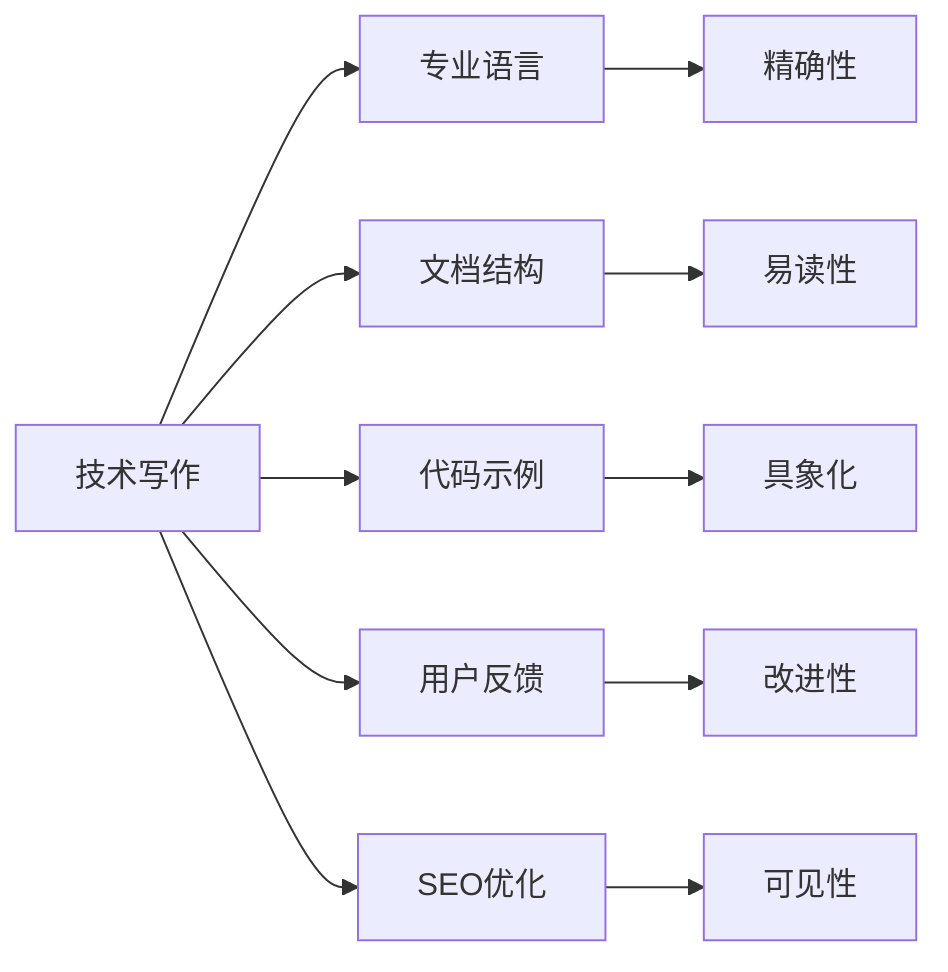

                 

# 技术写作：程序员的副业选择

## 1. 背景介绍

在快速发展的数字化时代，技术写作逐渐成为程序员不可忽视的一项重要技能。不仅在企业内部文档管理、技术交流、产品需求澄清等方面发挥着重要作用，还为程序员开辟了广阔的副业空间。本文将详细介绍技术写作的原理、方法和实践，助力程序员在职业生涯中实现技术和写作的双重发展。

## 2. 核心概念与联系

### 2.1 核心概念概述

为更好地理解技术写作的本质，本文将介绍几个关键概念及其相互联系：

- **技术写作**：使用专业语言表达技术内容，使其易于理解、传播和复用的写作形式。涵盖文档撰写、API文档、技术博客、技术报告等。
- **专业语言**：在特定领域内使用的专业术语、表达方式和技术细节，以确保精确性和权威性。
- **文档结构**：技术文档应包含清晰的章节、子章节和目录，使读者能快速定位所需信息。
- **代码示例**：通过实际的代码示例，帮助读者理解抽象概念和复杂流程。
- **用户反馈**：技术写作应考虑用户反馈，持续优化文档内容，提升用户体验。
- **SEO优化**：提高技术文档在搜索引擎中的可见性，有助于增加用户访问量和阅读量。

这些概念通过以下Mermaid流程图展示它们之间的联系：



这一流程图清晰展示了技术写作中各个环节的作用和相互关系。通过专业语言、清晰的文档结构、具象的代码示例、用户反馈和SEO优化，技术写作能够更好地满足用户需求，提升文档质量。

## 3. 核心算法原理 & 具体操作步骤

### 3.1 算法原理概述

技术写作的核心在于准确传达技术信息，以用户易懂的语言和结构化的形式，清晰地表达复杂的技术概念和流程。其原理可以归纳为以下几点：

- **准确性**：技术写作必须基于真实的技术信息，确保所有陈述和解释的准确无误。
- **易读性**：使用简单、直白的语言，避免使用过于专业的术语，增加读者的理解和参与度。
- **结构化**：合理组织文档结构，如章节、子章节和目录，帮助读者快速找到所需信息。
- **示例化**：通过实际的代码示例，直观展示技术实现细节，提高读者的理解和应用能力。
- **互动性**：通过用户反馈机制，持续收集读者的意见和建议，不断改进和优化文档内容。
- **优化性**：使用SEO技术优化文档的可见性和易达性，提升文档的曝光率和用户访问量。

### 3.2 算法步骤详解

基于上述原理，技术写作的完整步骤包括：

**Step 1: 内容策划**
- 确定文档目标：明确文档的受众、目的和内容范围。
- 收集资料：搜集相关技术信息、案例研究、用户反馈等。
- 制定大纲：根据目标和资料，制定文档的章节和子章节结构。

**Step 2: 撰写初稿**
- 使用专业语言：准确、简明地表达技术内容，避免歧义和错误。
- 结构化文档：按照大纲，逻辑清晰地组织内容，确保信息有序展现。
- 添加代码示例：通过实际的代码片段，解释复杂的技术实现和概念。
- 互动式反馈：设计互动环节，如问卷、评论区等，收集读者反馈，及时调整内容。

**Step 3: 修订优化**
- 审核校对：检查语法错误、逻辑漏洞和技术细节，确保文档准确无误。
- SEO优化：优化文档的关键词、元数据和链接结构，提高搜索引擎的可见性。
- 格式排版：美化文档的视觉设计，增加可读性和易达性。

**Step 4: 发布分享**
- 选择合适的发布平台：如个人博客、技术论坛、企业内网等。
- 持续更新：根据新信息和技术进展，定期更新和维护文档内容。
- 维护反馈机制：建立持续反馈机制，及时解决读者疑问和问题。

### 3.3 算法优缺点

技术写作的优势在于其专业性和实用性，能够有效传播和普及技术知识。但同时也存在以下不足：

**优点：**
- 精确传递技术信息：确保文档内容的准确性和权威性。
- 结构化表达：通过清晰的文档结构，提高读者的阅读效率和理解度。
- 示例化展示：通过代码示例，直观展示技术实现，增强读者的应用能力。
- 持续优化：通过用户反馈，不断改进和优化文档内容，提高用户满意度。

**缺点：**
- 撰写和维护成本高：高质量技术文档的编写和持续更新需要耗费大量时间和精力。
- 对技术水平要求高：需要熟悉特定技术领域，掌握专业术语和表达方式。
- 语言和文化差异：不同地区和文化的读者可能对技术内容的理解存在差异，需特别关注。

### 3.4 算法应用领域

技术写作广泛应用于多个领域，以下是几个主要应用场景：

- **软件开发**：撰写API文档、代码注释、技术报告等，帮助开发者理解和应用新功能。
- **技术博客和社区**：撰写技术文章、教程和案例研究，分享知识和经验，建立个人品牌。
- **企业内训和培训**：编写培训手册、操作指南和演示文稿，提升团队技能和知识水平。
- **产品文档和用户手册**：撰写产品说明书、用户手册和技术支持文档，帮助用户正确使用产品。
- **学术研究和技术报告**：撰写研究论文、技术报告和专利申请文档，传达研究成果和技术创新。

这些应用场景体现了技术写作在技术传播、知识共享、团队建设和产品支持方面的重要作用。

## 4. 数学模型和公式 & 详细讲解 & 举例说明

### 4.1 数学模型构建

技术写作的数学模型主要关注文档内容的组织、结构和信息传递的有效性。以一篇技术文档为例，其数学模型可以表示为：

$$
\text{文档内容} = \text{目标} \times \text{资料收集} \times \text{结构化处理} \times \text{示例化表达} \times \text{反馈优化}
$$

其中，目标明确文档的目的和受众；资料收集提供所需的技术信息；结构化处理确保内容逻辑清晰；示例化表达通过代码片段具象化复杂概念；反馈优化通过用户反馈持续改进。

### 4.2 公式推导过程

以API文档为例，假设有n个API接口，每个接口的参数和返回值如下：

$$
\begin{aligned}
&\text{接口1}：\text{参数} = (\text{param1}, \text{param2}), \text{返回值} = (\text{result1}, \text{result2}) \\
&\text{接口2}：\text{参数} = (\text{param3}, \text{param4}), \text{返回值} = (\text{result3}, \text{result4}) \\
&... \\
&\text{接口n}：\text{参数} = (\text{paramn-1}, \text{paramn}), \text{返回值} = (\text{resultn-1}, \text{resultn})
\end{aligned}
$$

API文档的撰写可以归纳为以下步骤：

1. 确定文档目标和受众。
2. 收集每个API接口的参数和返回值信息。
3. 设计文档结构，如接口列表、参数说明、返回值解释等。
4. 为每个接口编写详细的文档内容，包括参数名称、类型、默认值、返回值名称和类型等。
5. 通过代码示例，展示每个API接口的调用方式和结果格式。
6. 添加互动反馈机制，收集用户意见和建议，持续改进文档内容。

### 4.3 案例分析与讲解

以下是一个简单的API文档案例，展示如何通过技术写作准确、清晰地传达API信息：

```markdown
# API Documentation

## 1. Introduction

This document provides a detailed description of the API interfaces provided by our system.

## 2. API Interface List

### 2.1 Interface 1
- **Parameters**: 
  - `param1` (string): Required. Description of parameter 1.
  - `param2` (int): Optional. Description of parameter 2.
- **Returns**:
  - `result1` (string): Description of return value 1.
  - `result2` (int): Description of return value 2.

### 2.2 Interface 2
- **Parameters**: 
  - `param3` (float): Required. Description of parameter 3.
  - `param4` (list): Optional. Description of parameter 4.
- **Returns**:
  - `result3` (bool): Description of return value 3.
  - `result4` (dict): Description of return value 4.

## 3. API Usage Examples

### 3.1 Interface 1 Example
```python
import ourapi

# Call Interface 1
result = ourapi.interface1(param1="example", param2=123)
print(result)
```

### 3.2 Interface 2 Example
```python
import ourapi

# Call Interface 2
result = ourapi.interface2(param3=3.14, param4=["value1", "value2"])
print(result)
```

## 4. User Feedback

We welcome your feedback on the API documentation. Please fill out the following feedback form:
[Feedback Form](https://example.com/feedback)
```

## 5. 项目实践：代码实例和详细解释说明

### 5.1 开发环境搭建

技术写作的开发环境主要依赖于文本编辑器和版本控制系统，以下是基本配置：

1. **文本编辑器**：如VS Code、Sublime Text等，支持代码高亮和语法检查。
2. **版本控制系统**：如Git，用于文档的版本控制和协作开发。
3. **代码示例工具**：如CodePen、JSFiddle等，用于展示代码运行结果。

完成上述配置后，即可开始技术写作的实践。

### 5.2 源代码详细实现

以下是使用Markdown语言编写技术文档的示例代码：

```markdown
# My API Documentation

## 1. Introduction

This document provides a detailed description of the API interfaces provided by my system.

## 2. API Interface List

### 2.1 Interface 1
- **Parameters**: 
  - `param1` (string): Required. Description of parameter 1.
  - `param2` (int): Optional. Description of parameter 2.
- **Returns**:
  - `result1` (string): Description of return value 1.
  - `result2` (int): Description of return value 2.

### 2.2 Interface 2
- **Parameters**: 
  - `param3` (float): Required. Description of parameter 3.
  - `param4` (list): Optional. Description of parameter 4.
- **Returns**:
  - `result3` (bool): Description of return value 3.
  - `result4` (dict): Description of return value 4.

## 3. API Usage Examples

### 3.1 Interface 1 Example
```python
import myapi

# Call Interface 1
result = myapi.interface1(param1="example", param2=123)
print(result)
```

### 3.2 Interface 2 Example
```python
import myapi

# Call Interface 2
result = myapi.interface2(param3=3.14, param4=["value1", "value2"])
print(result)
```

## 4. User Feedback

We welcome your feedback on the API documentation. Please fill out the following feedback form:
[Feedback Form](https://example.com/feedback)
```

### 5.3 代码解读与分析

以上代码示例展示了如何使用Markdown语言编写API文档，关键步骤如下：

1. **标题和简介**：使用`#`号定义文档标题和简介，简明介绍文档内容和目标。
2. **接口列表**：使用`###`定义子标题，详细列出每个API接口的参数和返回值。
3. **代码示例**：使用````python`代码块展示API接口的调用方式和示例代码。
4. **反馈机制**：添加用户反馈链接，鼓励用户提供意见和建议。

通过代码示例，读者可以直观理解API接口的调用方式和参数设置，提高文档的可读性和实用性。

### 5.4 运行结果展示

运行上述代码示例，将会生成一个简单的API文档，展示在Markdown支持的编辑器中。读者可以通过点击链接，提交反馈，进一步优化文档内容。

## 6. 实际应用场景

### 6.1 企业内部文档管理

在企业内部，技术写作广泛应用于项目文档、技术规范、培训手册等场景。通过技术写作，可以系统整理和传播技术知识，提高团队协作效率和知识共享水平。

### 6.2 技术博客和社区

技术写作在技术博客和社区中尤为常见，通过撰写技术文章和教程，分享知识经验和解决方案，建立个人或团队的影响力。例如，某程序员可以撰写一篇关于Python异常处理的文章，分享自己的实践经验和最佳实践，提升其在技术社区的知名度。

### 6.3 产品文档和用户手册

产品文档和用户手册是技术写作的重要应用之一。通过清晰、详细的产品文档和用户手册，帮助用户正确理解和应用产品功能，提升用户体验和满意度。例如，某软件公司可以编写详细的用户手册，详细介绍产品的安装、配置和使用方法，帮助用户快速上手。

### 6.4 学术研究和技术报告

技术写作在学术研究和技术报告中也扮演重要角色。通过撰写研究论文和技术报告，传达研究成果和技术创新，促进学术交流和行业发展。例如，某研究人员可以撰写一篇关于机器学习算法的技术报告，详细介绍其方法和实验结果，为同行提供参考和指导。

## 7. 工具和资源推荐

### 7.1 学习资源推荐

为帮助程序员系统掌握技术写作的技能，推荐以下学习资源：

1. **《技术写作指南》**：一本详细介绍技术写作方法和技巧的书籍，涵盖文档结构、代码示例、SEO优化等方面。
2. **Coursera《技术写作与文档设计》**：由知名大学教授授课，涵盖技术写作的基本原则和实践案例。
3. **GitHub技术写作社区**：提供丰富的技术写作教程和文档示例，涵盖编程语言、框架、工具等各个方面。
4. **Medium技术博客**：汇集大量高质量技术文章，涵盖编程、设计、开发等多个领域，是学习技术写作的好地方。

### 7.2 开发工具推荐

以下是几款用于技术写作的常用工具：

1. **VS Code**：轻量级、功能强大的文本编辑器，支持语法高亮、代码提示和版本控制。
2. **Git**：强大的版本控制系统，支持代码托管、协作开发和版本控制。
3. **CodePen**：在线代码编辑器，支持HTML、CSS、JavaScript等语言，方便展示代码运行结果。
4. **Markdown编辑器**：如Typora、StackEdit等，支持Markdown语法，方便编写和预览技术文档。

### 7.3 相关论文推荐

技术写作的理论与实践不断发展，以下是几篇奠基性的相关论文，推荐阅读：

1. **《技术写作的心理学：读者中心的设计与实践》**：探讨技术写作中的心理学原理，提高文档的可读性和用户参与度。
2. **《面向开源社区的技术写作：最佳实践与挑战》**：介绍开源社区中的技术写作实践，分享成功经验和挑战。
3. **《编程范式与文档结构：面向开发者的技术写作指南》**：从编程范式的角度，探讨技术文档的结构化和示例化表达。
4. **《技术文档的SEO优化：提升可见性和易达性》**：详细介绍了技术文档的SEO优化方法，提高文档在搜索引擎中的排名。

## 8. 总结：未来发展趋势与挑战

### 8.1 研究成果总结

技术写作在传递技术信息和知识共享方面具有重要作用。通过系统化、结构化的写作方式，技术文档能够清晰、准确地传达复杂的技术概念，提升读者的理解和应用能力。

### 8.2 未来发展趋势

技术写作的未来趋势主要体现在以下几个方面：

1. **智能化**：引入自然语言处理和生成技术，自动化生成文档内容，提高写作效率和准确性。
2. **个性化**：根据用户行为和偏好，自动调整文档内容和格式，提供个性化阅读体验。
3. **互动化**：通过互动式反馈机制，收集用户意见和建议，持续改进和优化文档内容。
4. **跨平台化**：支持多平台和多设备访问，提高文档的可读性和易达性。
5. **国际化**：根据不同语言和文化背景，自动调整文档内容和格式，提高全球化应用能力。

### 8.3 面临的挑战

尽管技术写作在技术传播和知识共享方面具有重要价值，但仍面临一些挑战：

1. **质量保证**：技术写作的质量很大程度上依赖于作者的技术水平和经验，难以自动化保证。
2. **适应性**：技术文档需要不断更新和维护，以适应技术发展的变化，保持文档的准确性和实用性。
3. **语言和文化差异**：不同语言和文化背景的读者可能对技术内容的理解存在差异，需要特别关注。
4. **技术细节**：技术文档涉及大量技术细节，需要在撰写过程中准确表达，避免歧义和错误。

### 8.4 研究展望

未来的技术写作研究应注重以下几个方向：

1. **智能化技术**：引入人工智能和自然语言处理技术，提高文档生成和编辑的自动化水平。
2. **交互式设计**：设计互动式反馈机制，收集用户意见和建议，持续优化文档内容。
3. **跨平台协作**：支持多平台和多设备协作，提高文档的共享和协同编辑能力。
4. **全球化应用**：根据不同语言和文化背景，自动调整文档内容和格式，提高全球化应用能力。
5. **知识图谱整合**：将技术文档与知识图谱、专家库等外部知识资源结合，提升文档的深度和广度。

通过这些研究方向和技术创新，技术写作将更好地服务于技术传播和知识共享，为程序员的副业发展提供新的机遇和空间。

## 9. 附录：常见问题与解答

**Q1：技术写作是否适用于所有技术文档？**

A: 技术写作适用于大部分技术文档，但某些高度专业或保密的技术文档可能不适合。技术写作的主要目的是通过系统化、结构化的方式，清晰、准确地传达技术信息，提升文档的可读性和实用性。

**Q2：如何提高技术文档的可读性？**

A: 提高技术文档的可读性主要从以下几个方面入手：
1. **简洁明了**：使用简单、直白的语言，避免使用过于专业的术语。
2. **结构清晰**：按照清晰的章节、子章节和目录组织内容，使读者能快速找到所需信息。
3. **示例丰富**：通过代码示例、图片和图表，直观展示技术实现和复杂概念。
4. **用户反馈**：通过互动式反馈机制，收集用户意见和建议，不断改进文档内容。

**Q3：技术写作是否需要团队协作？**

A: 技术写作往往需要团队协作，特别是在企业内部或大规模项目中。团队协作可以分工明确、任务清晰，提高文档的编写和维护效率。同时，通过集体智慧和多样化视角，可以更全面地覆盖技术细节，提升文档的质量和实用性。

**Q4：技术写作是否有通用的标准和规范？**

A: 技术写作虽然没有统一的标准和规范，但有许多通用的最佳实践和指南，如《技术写作指南》、Coursera课程等，可以帮助开发者掌握技术写作的基本原则和方法。同时，各行业和领域也有自己的特定标准和规范，需要根据实际情况进行参考和调整。

**Q5：技术写作如何适应技术演进？**

A: 技术写作需要根据技术演进不断更新和维护，保持文档的准确性和实用性。可以通过以下方法实现：
1. **定期更新**：根据新技术和新知识，定期更新和修订文档内容。
2. **文档版本控制**：使用版本控制系统，记录文档的更新历史，方便回溯和查阅。
3. **用户反馈机制**：建立用户反馈机制，及时收集用户意见和建议，优化文档内容。

通过以上方法，技术写作能够更好地适应技术演进，保持文档的权威性和实用性。

---

作者：禅与计算机程序设计艺术 / Zen and the Art of Computer Programming

