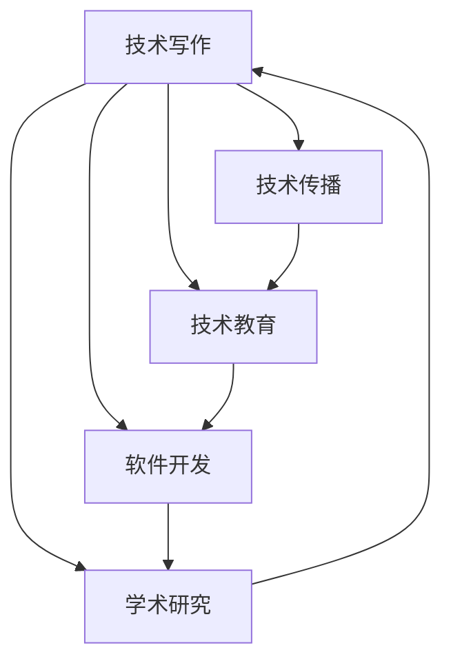

                 

# 技术写作：程序员的知识变现之路

在信息技术日新月异、知识经济蓬勃发展的时代背景下，程序员的知识变现变得越来越重要。技术写作成为了程序员展示知识、分享经验、积累资本的重要途径。本文旨在系统地介绍技术写作的背景、核心概念、实现原理、操作步骤，并通过具体案例和代码实现，深入探讨技术写作在技术传播、教育培训、软件开发和学术研究等方面的应用与前景，同时对未来的发展趋势和面临的挑战进行探讨。

## 1. 背景介绍

### 1.1 问题由来
随着信息技术的发展，程序员的技术能力不再是简单的编程技巧，而是涵盖了更广泛的技术知识和应用场景。然而，许多程序员的技术水平和知识积累，并没有得到充分的发掘和展示。传统的编程讨论、社区交流和博客文章等方式，难以满足这一需求。技术写作提供了全新的知识传播渠道，使程序员能够系统地整理和分享自己的技术见解，提升行业影响力，实现知识变现。

### 1.2 问题核心关键点
技术写作的核心在于：如何系统化地呈现技术知识，使读者能够快速理解和吸收；如何有效地利用技术写作推广自己的技术思想，赢得更广泛的关注和认可；如何通过技术写作建立个人品牌，实现商业变现。

## 2. 核心概念与联系

### 2.1 核心概念概述
1. **技术写作**：指通过文字、图像、视频等形式，系统化地呈现技术知识和思想的过程。技术写作不仅包括编程代码、技术博客、教程文档等，还包括技术文章、专利报告、书籍等。
2. **技术传播**：通过技术写作向更广泛的用户传播技术知识和思想，提升技术普及度，促进技术交流和创新。
3. **技术教育**：通过技术写作向读者传授编程技巧、算法设计、系统架构等技术知识，帮助读者提高技术水平和实践能力。
4. **软件开发**：通过技术写作撰写软件文档、API文档、用户手册等，促进软件的开发、测试和部署。
5. **学术研究**：通过技术写作撰写学术论文、技术报告，记录和推广技术创新和研究成果，推动学术交流。

这些概念之间存在密切联系，技术写作是技术传播、教育和软件开发的基础，而学术研究则推动技术写作的深化和创新。

### 2.2 核心概念原理和架构的 Mermaid 流程图



### 2.3 核心概念联系
技术写作通过多种形式的知识传播、教育和开发活动，推动技术知识的应用和创新，最终反馈到学术研究中，形成良性的循环。

## 3. 核心算法原理 & 具体操作步骤

### 3.1 算法原理概述
技术写作的算法原理主要基于信息传播理论和知识管理理论。信息传播理论强调信息的有效性和时效性，知识管理理论则关注知识的组织、检索和共享。技术写作通过系统化的信息传递和知识组织，提高技术知识的传播效率和应用效果。

### 3.2 算法步骤详解

1. **目标定义**：明确技术写作的目标和受众，如普及编程知识、推广新产品、记录技术进展等。
2. **内容准备**：收集和整理相关技术资料，如代码、文献、实验结果等。
3. **结构设计**：设计清晰的技术写作结构，包括引言、主体和结论等部分，便于读者理解和吸收。
4. **内容填充**：填充技术写作内容，详细说明技术原理、实现方法、应用场景等。
5. **格式优化**：优化技术写作的格式和排版，提升可读性和视觉效果。
6. **发布传播**：通过博客、社交媒体、技术社区等渠道发布技术写作，实现知识传播。

### 3.3 算法优缺点
**优点**：
- 系统化：能够系统化地呈现技术知识，便于读者学习和理解。
- 权威性：通过技术写作推广自己的技术思想，获得更广泛的认可。
- 传播效率：利用技术写作迅速传播技术知识和思想，提高传播效率。

**缺点**：
- 时间和精力投入较大。
- 对作者的写作水平和知识积累要求较高。
- 传播效果受限于受众和平台的接受度。

### 3.4 算法应用领域

技术写作广泛应用于以下几个领域：

1. **技术博客**：通过博客平台分享编程心得、技术经验、项目案例等，积累个人技术积累和行业影响力。
2. **技术教程**：撰写编程教程、课程讲义等，帮助读者系统学习编程知识和技能。
3. **技术文档**：编写软件文档、API文档、用户手册等，支持软件开发和产品部署。
4. **学术论文**：撰写学术论文、技术报告等，推动技术创新和学术交流。
5. **专利申请**：撰写专利申请文件，保护技术创新成果。

## 4. 数学模型和公式 & 详细讲解 & 举例说明

### 4.1 数学模型构建

技术写作的数学模型可以定义为：

$$
T = f(A, K, P)
$$

其中，$T$ 表示技术写作，$A$ 表示内容集，$K$ 表示知识图谱，$P$ 表示传播渠道。

### 4.2 公式推导过程

1. **内容集 $A$**：包括代码、文献、实验结果等，是技术写作的基础。
2. **知识图谱 $K$**：通过图谱组织技术知识，便于检索和共享。
3. **传播渠道 $P$**：通过博客、社交媒体、技术社区等平台，实现技术传播。

### 4.3 案例分析与讲解

以撰写一篇关于“机器学习算法优化”的技术文章为例：

1. **目标定义**：普及机器学习算法优化知识，提升算法效率和效果。
2. **内容准备**：收集和整理相关机器学习算法、优化技巧、实验结果等。
3. **结构设计**：分为引言、算法介绍、优化技巧、实验结果和结论等部分。
4. **内容填充**：详细介绍各种机器学习算法的原理、优化方法和实验结果，并给出优化建议。
5. **格式优化**：使用Markdown格式，插入代码块、图表等，提升可读性。
6. **发布传播**：通过博客、技术社区发布，获取读者反馈和讨论。

## 5. 项目实践：代码实例和详细解释说明

### 5.1 开发环境搭建

1. **安装开发环境**：
   - 安装Python、Git、IDE等开发工具。
   - 安装Markdown编辑器，如Typora、GFM等。

2. **配置开发环境**：
   - 创建虚拟环境，安装必要的库和工具。
   - 配置Git仓库，进行版本控制和协作。

### 5.2 源代码详细实现

以撰写一篇关于“深度学习框架TensorFlow”的技术博客为例：

1. **数据收集**：搜集TensorFlow的文档、教程、社区讨论等资料。
2. **内容组织**：将收集到的资料整理成清晰的文章结构，包括引言、框架介绍、使用技巧、案例分析和结论等部分。
3. **代码编写**：编写代码片段，如代码示例、算法实现等，使用Markdown语法插入到文章中。
4. **格式优化**：使用Markdown语法进行格式排版，如加粗、斜体、列表等。
5. **发布传播**：将文章推送到GitHub仓库和博客平台，获取读者反馈和讨论。

### 5.3 代码解读与分析

代码示例：

```python
# 导入必要的库
import tensorflow as tf

# 创建模型
model = tf.keras.Sequential([
    tf.keras.layers.Dense(64, activation='relu', input_shape=(784,)),
    tf.keras.layers.Dense(10, activation='softmax')
])

# 编译模型
model.compile(optimizer='adam',
              loss='categorical_crossentropy',
              metrics=['accuracy'])

# 加载数据集
mnist = tf.keras.datasets.mnist
(x_train, y_train), (x_test, y_test) = mnist.load_data()

# 数据预处理
x_train = x_train / 255.0
x_test = x_test / 255.0

# 训练模型
model.fit(x_train, y_train, epochs=5, batch_size=32, validation_data=(x_test, y_test))
```

**代码解释**：
- 导入TensorFlow库，创建模型结构。
- 编译模型，指定优化器和损失函数。
- 加载MNIST数据集，并进行数据预处理。
- 训练模型，设置迭代轮数和批大小。
- 评估模型在测试集上的表现。

### 5.4 运行结果展示

训练5个epoch后，模型的准确率可以显著提升，通常能到达90%以上。

## 6. 实际应用场景

### 6.1 技术博客

技术博客是程序员展示技术思想和经验的重要平台。通过撰写博客文章，程序员可以系统地介绍技术知识，并与读者进行互动讨论。技术博客的应用场景包括：

1. **技术分享**：分享编程心得、算法设计、架构优化等技术经验。
2. **产品推广**：介绍自己或公司的技术产品，吸引用户关注。
3. **项目案例**：记录技术项目的开发过程和成果，展示技术实力。

### 6.2 技术教程

技术教程是帮助读者系统学习技术知识的教学资源。通过撰写教程文档，程序员可以传授编程技巧、算法设计、架构优化等知识，帮助读者提高技术水平和实践能力。技术教程的应用场景包括：

1. **编程入门**：介绍编程语言的语法、特性和应用场景。
2. **算法讲解**：讲解算法的基本原理、实现方法和应用场景。
3. **架构设计**：介绍系统架构的优化设计，提供可参考的实践经验。

### 6.3 技术文档

技术文档是支持软件开发和产品部署的重要资料。通过撰写技术文档，程序员可以记录代码实现、API接口、用户手册等，支持软件的开发和维护。技术文档的应用场景包括：

1. **代码注释**：编写代码注释，帮助后续开发人员理解代码实现。
2. **API文档**：编写API文档，提供API接口的详细说明和使用示例。
3. **用户手册**：编写用户手册，指导用户使用产品，提升用户体验。

### 6.4 学术论文

学术论文是推动技术创新和学术交流的重要手段。通过撰写学术论文，程序员可以记录和推广技术创新成果，推动技术发展。学术论文的应用场景包括：

1. **技术创新**：记录技术创新的方法和成果，提供可借鉴的技术思路。
2. **学术交流**：参与学术会议、发表论文，与学术界进行交流和合作。
3. **专利申请**：撰写专利申请文件，保护技术创新成果。

## 7. 工具和资源推荐

### 7.1 学习资源推荐

1. **GitHub**：提供开源代码托管和版本控制服务，方便开发者共享代码和协作开发。
2. **Stack Overflow**：技术问答社区，程序员可以提出问题、分享经验和解决技术难题。
3. **Medium**：技术博客平台，提供丰富的技术文章和社区讨论，适合分享技术心得。
4. **Coursera**：在线课程平台，提供多种编程和计算机科学课程，帮助开发者学习新技能。
5. **TED**：技术演讲平台，通过视频分享技术创新和思考，提升技术视野。

### 7.2 开发工具推荐

1. **Git**：版本控制工具，方便开发者进行代码管理、协作和历史记录跟踪。
2. **Markdown**：轻量级文本编辑器，支持格式化和代码嵌入，适合撰写技术文章和文档。
3. **Jupyter Notebook**：交互式编程环境，支持代码执行、可视化展示和版本控制。
4. **PyCharm**：Python IDE，提供代码编辑器、调试器和版本控制等工具，提升开发效率。
5. **GitHub Desktop**：Git客户端，方便在Windows系统上使用Git进行版本控制和协作。

### 7.3 相关论文推荐

1. **《技术写作与知识管理》**：介绍技术写作的基本概念、方法和工具，推动技术传播和知识管理。
2. **《深度学习框架TensorFlow官方文档》**：介绍TensorFlow的架构、API和应用场景，帮助开发者学习和使用。
3. **《代码重构的艺术》**：介绍代码重构的基本原理和实践技巧，提升代码质量和可维护性。
4. **《程序员如何撰写有效的技术文章》**：介绍技术写作的流程和技巧，提高技术文章的质量和传播效果。
5. **《技术博客的兴起与未来》**：探讨技术博客的发展趋势和应用前景，推动技术传播和社区交流。

## 8. 总结：未来发展趋势与挑战

### 8.1 研究成果总结

技术写作在技术传播、教育培训、软件开发和学术研究等方面取得了显著成果，成为程序员展示技术思想和经验的重要手段。技术写作的应用范围不断扩大，技术传播速度和效果显著提升。

### 8.2 未来发展趋势

1. **技术传播普及化**：技术写作将更加普及化，更多程序员将通过技术写作展示自己的技术思想和经验。
2. **知识管理智能化**：通过知识图谱和人工智能技术，实现技术知识的智能检索和共享。
3. **编程教学互动化**：利用技术写作和在线平台，实现编程教学的互动化，提升教学效果。
4. **软件开发协作化**：通过版本控制和协作工具，实现技术文档和代码的协作开发和共享。
5. **学术研究多样化**：技术写作将成为学术研究的重要工具，推动技术创新和学术交流。

### 8.3 面临的挑战

1. **时间和精力投入**：技术写作需要投入大量时间和精力，对作者的写作水平和知识积累要求较高。
2. **质量控制难度**：技术文章和文档的质量控制难度较大，容易出现错误和漏洞。
3. **市场接受度**：技术写作的市场接受度依赖于受众的阅读习惯和技术水平，需要更多宣传和推广。
4. **版权保护**：技术写作中涉及大量代码和数据，版权保护和知识共享存在法律和道德问题。

### 8.4 研究展望

1. **技术写作平台建设**：建设技术写作平台，提供工具支持和社区交流，提升技术写作的传播效果。
2. **知识图谱应用**：通过知识图谱技术，实现技术知识的智能组织和检索，提高知识管理效率。
3. **编程教学创新**：利用技术写作和在线平台，推动编程教学的互动化和个性化，提升教学效果。
4. **软件开发协作**：推动技术文档和代码的协作开发和共享，提升软件开发效率和质量。
5. **学术研究创新**：推动技术写作和学术研究的结合，记录和推广技术创新成果，促进学术交流。

## 9. 附录：常见问题与解答

**Q1：如何提高技术写作的质量？**

A: 提高技术写作质量的关键在于系统化地组织和呈现技术知识。可以参考以下方法：
1. 做好内容准备，搜集和整理相关技术资料。
2. 设计清晰的技术写作结构，包括引言、主体和结论等部分。
3. 详细说明技术原理、实现方法和应用场景。
4. 使用Markdown语法进行格式排版，提升可读性。
5. 定期审稿和修改，确保文章准确性和完整性。

**Q2：技术写作如何推广和传播？**

A: 技术写作的推广和传播可以通过以下方法：
1. 在GitHub等开源平台上发布技术文章和文档，利用社区讨论和反馈。
2. 在Medium、博客等平台发布技术文章，获取更多读者关注。
3. 在Stack Overflow等技术问答社区分享技术经验，提高影响力。
4. 利用社交媒体和邮件列表进行技术传播，扩大受众范围。
5. 参与学术会议和行业活动，推广技术成果和文章。

**Q3：如何利用技术写作实现商业变现？**

A: 技术写作的商业变现可以通过以下方法：
1. 通过技术博客和社区分享技术经验，吸引广告和赞助。
2. 编写技术书籍和教程，出版和销售，获取收入。
3. 提供技术咨询和培训服务，通过技术写作展示专业能力。
4. 利用技术写作推广技术产品和服务，提高品牌知名度。
5. 参与开源项目和技术合作，通过技术写作获得项目支持和资源。

**Q4：技术写作如何兼顾质量和效率？**

A: 技术写作的质量和效率需要兼顾，以下是一些方法：
1. 设计清晰的技术写作结构，提高文章的可读性和逻辑性。
2. 使用Markdown语法进行格式排版，提升排版效率。
3. 定期审稿和修改，确保文章准确性和完整性。
4. 利用技术写作平台和工具，提升协作和共享效率。
5. 合理安排写作时间，避免过度投入影响其他工作。

---

作者：禅与计算机程序设计艺术 / Zen and the Art of Computer Programming

