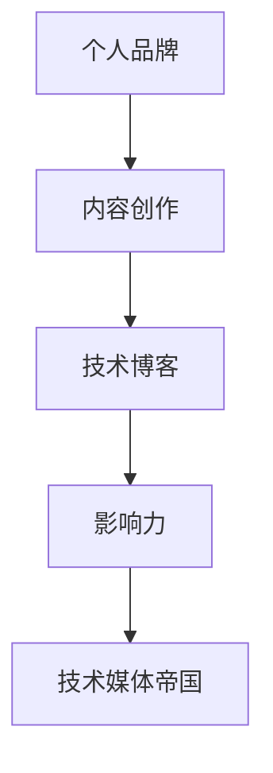

                 

# 技术博客：从个人品牌到技术媒体帝国的构建

## 1. 背景介绍

### 1.1 问题由来
在互联网时代，技术的迅速发展和更新迭代带来了前所未有的机遇与挑战。技术博客作为连接技术开发者与广大用户的重要桥梁，成为了传播知识、分享经验的重要平台。如何提升个人品牌影响力，构建一个有影响力的技术媒体帝国，成为众多技术博客作者关注的焦点。

本文将系统阐述如何通过高质量的内容创作，构建个人品牌，并以此为基础，逐步打造一个有影响力的技术媒体帝国。通过深入剖析核心概念，并结合具体实践案例，希望能为技术博客作者提供一些有价值的建议和指导。

### 1.2 问题核心关键点
构建技术媒体帝国，关键在于个人品牌的打造与持续的内容输出。在具体实践中，需要注意以下几个核心关键点：

- 定位明确：明确个人品牌和媒体平台的定位，细分市场，吸引特定群体。
- 内容质量：坚持高质量的内容创作，提供有价值、有深度的技术文章。
- 持续更新：定期更新内容，保持与技术发展的同步，吸引和留住读者。
- 多样化表达：采用多种形式的内容呈现，如图文、视频、播客等，提升用户体验。
- 互动交流：积极与读者互动，建立社区，提升用户粘性和忠诚度。
- 跨界合作：与其他技术媒体、品牌合作，拓宽内容覆盖和影响力。

## 2. 核心概念与联系

### 2.1 核心概念概述

要构建技术媒体帝国，首先需要理解一些关键概念，并将其联系起来：

- **个人品牌**：指个人在技术领域内的知名度和影响力，通过持续的技术文章、博客等形式，树立专业形象。
- **技术博客**：个人或机构在网络上发布的技术相关文章、视频、播客等内容。
- **内容创作**：以技术为核心，结合实际项目或案例，产出有深度、有价值的内容。
- **影响力**：通过高质量内容和技术分享，吸引和聚集技术爱好者和行业从业者。
- **技术媒体帝国**：一个由多个技术博客和平台构成的媒体网络，形成庞大的读者群体和内容生态。

这些概念之间相互联系，共同构成了从个人品牌到技术媒体帝国的构建路径。通过不断积累个人品牌影响力，输出高质量内容，并逐步扩展内容覆盖范围和影响力，最终形成一个有影响力的技术媒体帝国。

### 2.2 核心概念原理和架构的 Mermaid 流程图



## 3. 核心算法原理 & 具体操作步骤

### 3.1 算法原理概述

构建技术媒体帝国，本质上是通过高质量的内容输出，逐步建立个人品牌和媒体平台的影响力。在这一过程中，需要遵循一定的算法原理，保证内容的质量和持续性。

核心算法原理包括：

- **内容推荐算法**：通过算法推荐，将高质量内容推送给目标读者，提升内容的曝光度和阅读量。
- **互动优化算法**：通过分析读者互动行为，优化内容发布策略，提升用户粘性和忠诚度。
- **内容多样化算法**：采用多样化内容表达形式，如文字、视频、播客等，满足不同读者的需求。

### 3.2 算法步骤详解

构建技术媒体帝国的具体步骤包括：

1. **个人品牌定位**：明确个人或媒体平台的核心定位，细分市场，吸引特定群体。
2. **内容质量提升**：坚持高质量的内容创作，提供有价值、有深度的技术文章。
3. **多样化内容输出**：采用多种形式的内容呈现，如图文、视频、播客等，提升用户体验。
4. **持续更新与互动**：定期更新内容，保持与技术发展的同步，积极与读者互动，建立社区。
5. **跨界合作与推广**：与其他技术媒体、品牌合作，拓宽内容覆盖和影响力。

### 3.3 算法优缺点

高质量的内容创作是构建技术媒体帝国的基础，但也存在一定的局限性：

- **优点**：
  - 高质量内容能够吸引和聚集大量技术爱好者和从业者，形成稳定的读者群体。
  - 多样化表达形式满足不同用户的需求，提升用户体验。
  - 持续更新与互动增强用户粘性和忠诚度。

- **缺点**：
  - 内容创作需要大量的时间和精力投入，对于个人或团队来说，可能面临资源瓶颈。
  - 跨界合作需要多方资源协调，可能存在协调难度和资源限制。
  - 多样化表达形式可能导致内容质量参差不齐，需要加强质量控制。

### 3.4 算法应用领域

构建技术媒体帝国的方法可以应用于多个技术领域，如软件开发、人工智能、区块链、大数据等。以下以软件开发为例，介绍具体的应用场景：

- **个人开发者博客**：通过分享技术栈选择、项目实战经验、工具推荐等，建立专业形象。
- **技术社区平台**：吸引开发者分享技术文章、开源项目、招聘信息等，形成技术交流和协作生态。
- **企业技术博客**：宣传企业技术栈、技术积累、项目成果等，提升企业技术影响力。

## 4. 数学模型和公式 & 详细讲解

### 4.1 数学模型构建

技术媒体帝国的构建涉及多个维度的内容推荐和优化，可以通过数学模型进行建模和求解。以下以技术文章推荐为例，构建数学模型：

设推荐系统有 $N$ 篇技术文章，每篇文章 $i$ 的评分 $r_i$ 和读者对文章的阅读率 $v_i$ 已知。读者对每篇文章的评分 $p_i$ 未知，需要通过推荐系统预测。构建模型如下：

$$
p_i = \alpha r_i + \beta v_i + \gamma
$$

其中 $\alpha$、$\beta$、$\gamma$ 为模型参数，需要通过训练数据拟合。

### 4.2 公式推导过程

- **数据准备**：收集读者对每篇文章的阅读率和评分，形成训练集 $\{(r_i, v_i)\}_{i=1}^N$。
- **模型训练**：采用梯度下降等优化算法，拟合模型参数 $\alpha$、$\beta$、$\gamma$。
- **预测评估**：用测试集 $\{(r'_i, v'_i)\}_{i=1}^{N'}$ 验证模型效果，计算预测评分 $p'_i$ 与真实评分 $r'_i$ 的误差。

### 4.3 案例分析与讲解

以某开源项目的技术博客为例，介绍如何使用数学模型进行内容推荐：

- **数据收集**：收集读者对每篇文章的阅读时间和评分，形成训练集。
- **模型训练**：通过线性回归模型拟合 $\alpha$、$\beta$、$\gamma$。
- **推荐测试**：将拟合后的模型应用于新文章，预测用户阅读率和评分，推荐给目标读者。

## 5. 项目实践：代码实例和详细解释说明

### 5.1 开发环境搭建

构建技术媒体帝国需要搭建一个功能齐全的开发环境。以下是搭建开发环境的步骤：

1. **选择开发平台**：选择GitHub、GitLab等Git版本控制平台，搭建技术博客。
2. **选择内容管理系统**：选择WordPress、Jekyll等，方便管理和发布文章。
3. **选择合适的技术栈**：选择Python、Node.js等技术栈，用于技术文章编写和数据分析。
4. **配置开发环境**：安装Python、Node.js、Git等工具，配置开发环境。

### 5.2 源代码详细实现

以下是一个简单的技术文章推荐系统的Python代码实现，包含数据准备、模型训练和推荐测试的完整流程：

```python
import pandas as pd
from sklearn.linear_model import LinearRegression

# 数据准备
data = pd.read_csv('article_reads.csv')
X = data[['read_time', 'vote_score']]
y = data['read_rate']

# 模型训练
model = LinearRegression()
model.fit(X, y)

# 预测测试
test_data = pd.read_csv('article_test.csv')
X_test = test_data[['read_time', 'vote_score']]
y_pred = model.predict(X_test)
```

### 5.3 代码解读与分析

以上代码展示了如何使用线性回归模型进行技术文章推荐。具体解读如下：

- **数据准备**：使用Pandas库读取训练集和测试集，提取特征和标签。
- **模型训练**：通过LinearRegression模型拟合参数。
- **预测测试**：使用模型预测测试集阅读率，并输出预测结果。

## 6. 实际应用场景

### 6.1 技术开发者社区

技术开发者社区是构建技术媒体帝国的重要平台。通过提供高质量的技术文章、开源项目、代码示例等内容，吸引和聚集技术爱好者和从业者，形成庞大的读者群体和内容生态。

具体应用场景包括：

- **技术文章分享**：技术开发者撰写技术文章，分享实战经验和技术栈选择。
- **开源项目协作**：开发者分享开源项目，吸引社区成员参与代码贡献和问题讨论。
- **技术交流与合作**：组织技术研讨会、在线讨论等，增强社区互动和粘性。

### 6.2 企业技术博客

企业技术博客是展示企业技术实力和品牌形象的重要窗口。通过宣传企业技术栈、项目成果等，提升企业技术影响力，吸引开发者关注和合作。

具体应用场景包括：

- **技术白皮书发布**：企业发布技术白皮书，展示企业技术能力和行业地位。
- **技术讲座和培训**：企业组织技术讲座和培训，增强企业技术品牌影响力。
- **项目合作推广**：企业宣传技术合作和项目成果，吸引开发者关注和合作。

### 6.3 技术媒体平台

技术媒体平台是技术博客作者展示个人品牌和技术影响力的重要渠道。通过输出高质量的技术文章、视频、播客等内容，建立个人品牌，吸引和留住读者。

具体应用场景包括：

- **技术文章创作**：技术博主撰写技术文章，分享技术见解和实战经验。
- **多样化内容输出**：采用多种形式的内容呈现，如图文、视频、播客等，提升用户体验。
- **互动交流与社区建设**：与读者互动，建立社区，提升用户粘性和忠诚度。

## 7. 工具和资源推荐

### 7.1 学习资源推荐

为了帮助技术博客作者提升技术水平和内容质量，以下是一些优质的学习资源：

1. **《深度学习》课程**：由斯坦福大学开设的深度学习课程，涵盖深度学习原理、应用和实践，适合技术博主提升技术水平。
2. **《数据科学实战》书籍**：由Udacity出版的书籍，通过实际案例讲解数据科学实战技能，适合技术博主学习数据分析和数据可视化。
3. **《技术博客最佳实践》网站**：提供技术博客创建、管理、优化等最佳实践，帮助技术博主提升博客运营水平。

### 7.2 开发工具推荐

技术博客作者需要借助各类工具提高内容创作和发布效率。以下是一些常用的开发工具：

1. **GitHub/GitLab**：版本控制平台，方便技术文章的版本管理和发布。
2. **Jekyll/WordPress**：内容管理系统，方便技术文章的撰写、编辑和发布。
3. **Markdown**：轻量级标记语言，用于技术文章的文本编写。
4. **Jupyter Notebook**：交互式编程环境，方便技术博客作者进行数据分析和模型实验。

### 7.3 相关论文推荐

构建技术媒体帝国离不开理论研究的指导。以下是一些经典的论文推荐：

1. **《推荐系统》书籍**：介绍推荐系统原理、算法和应用，适合技术博主理解推荐算法。
2. **《社交媒体分析》论文**：介绍社交媒体数据分析方法，适合技术博主理解用户互动行为。
3. **《技术博客分析》论文**：介绍技术博客内容的分析方法，适合技术博主提升内容质量和互动效果。

## 8. 总结：未来发展趋势与挑战

### 8.1 研究成果总结

本文系统介绍了如何通过高质量的内容创作，构建个人品牌，并逐步打造技术媒体帝国。通过深入剖析核心概念和操作步骤，希望能为技术博客作者提供一些有价值的建议和指导。

### 8.2 未来发展趋势

未来，技术媒体帝国将呈现出以下发展趋势：

- **内容质量提升**：技术博客作者将更加注重内容质量和深度，提供有价值的见解和经验分享。
- **多媒体融合**：采用多种形式的内容表达形式，如图文、视频、播客等，提升用户体验。
- **社区建设与互动**：建立技术社区，增强与读者互动，提升用户粘性和忠诚度。
- **跨界合作与推广**：与其他技术媒体、品牌合作，拓宽内容覆盖和影响力。

### 8.3 面临的挑战

构建技术媒体帝国的过程中，技术博客作者可能面临以下挑战：

- **内容创作难度**：高质量的内容创作需要大量的时间和精力投入，对于个人或团队来说，可能面临资源瓶颈。
- **互动效果不足**：与读者的互动需要建立社区，增强社区活跃度，吸引和留住读者。
- **内容质量控制**：采用多样化表达形式可能导致内容质量参差不齐，需要加强质量控制。
- **市场竞争激烈**：随着技术博客数量的增加，如何突出自身特色，吸引和留住读者，需要不断创新和优化。

### 8.4 研究展望

面对技术媒体帝国构建过程中的挑战，技术博客作者需要在以下几个方面进行探索：

- **技术栈选择**：选择合适的技术栈和工具，提升内容创作和发布效率。
- **内容多样化**：采用多种形式的内容表达形式，提升用户体验和阅读兴趣。
- **社区建设**：建立技术社区，增强与读者互动，提升用户粘性和忠诚度。
- **跨界合作**：与其他技术媒体、品牌合作，拓宽内容覆盖和影响力。

## 9. 附录：常见问题与解答

**Q1: 如何提升技术文章的质量？**

A: 提升技术文章质量，可以从以下几个方面入手：

- **深入理解技术**：深入研究技术原理和实践，写出有深度的技术文章。
- **撰写实战经验**：分享实际项目中的技术实践和问题解决方案，提供实用的技术指导。
- **多角度分析**：从不同角度分析技术问题，提供全面的技术见解。
- **数据和图表支持**：结合数据和图表，增强文章的可信度和说服力。

**Q2: 如何选择技术博客平台？**

A: 选择技术博客平台时，可以考虑以下因素：

- **用户体验**：选择易用性高、界面友好的平台，提升用户阅读体验。
- **功能丰富**：选择功能丰富的平台，支持文章发布、评论、互动等功能。
- **社区活跃度**：选择社区活跃度高的平台，吸引更多读者和互动。
- **技术支持**：选择技术支持和维护较好的平台，保障文章发布和数据安全。

**Q3: 如何吸引和留住读者？**

A: 吸引和留住读者，可以从以下几个方面入手：

- **高质量内容**：提供有价值、有深度的技术文章，满足读者需求。
- **互动交流**：积极与读者互动，建立社区，提升用户粘性和忠诚度。
- **多样化内容**：采用多种形式的内容表达形式，如图文、视频、播客等，提升用户体验。
- **定期更新**：定期更新内容，保持与技术发展的同步，吸引和留住读者。

**Q4: 如何处理技术博客的版权问题？**

A: 处理技术博客的版权问题，可以从以下几个方面入手：

- **明确版权归属**：在文章中明确版权归属和许可协议，避免版权纠纷。
- **合理使用**：合理使用他人的技术文章和图片，注明出处，避免侵权。
- **保护原创**：使用技术手段保护原创文章，如添加水印、版权声明等，防止抄袭。

以上是本文关于技术博客构建的全面解析，希望能为技术博客作者提供有价值的参考和指导。

---

作者：禅与计算机程序设计艺术 / Zen and the Art of Computer Programming

