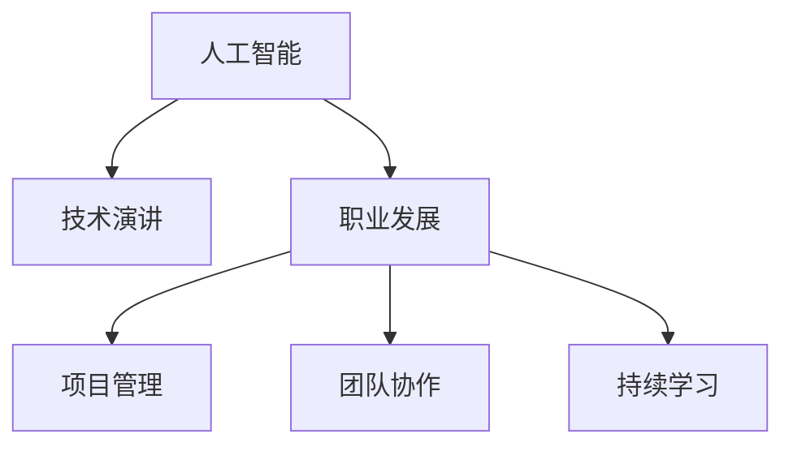

                 

# 技术演讲：提升个人市场价值

> 关键词：个人市场价值, 人工智能, 技术演讲, 职业发展, 项目管理, 团队协作, 持续学习

## 1. 背景介绍

### 1.1 问题由来
随着人工智能（AI）技术的飞速发展，各行各业都在加速数字化转型。对于个人来说，掌握最新的AI技术不仅能够增强自己的竞争力，还能提升市场价值。然而，面对日益增长的技术栈和不断变化的市场需求，如何有效地提升个人市场价值成为了每个职业人士都关心的问题。

### 1.2 问题核心关键点
1. **技术更新速度快**：AI技术日新月异，新的工具和框架层出不穷。
2. **行业需求多样化**：AI技术应用场景广泛，从数据分析到自动化，再到智能交互。
3. **持续学习重要性**：终身学习成为必要，保持技能的更新和提升。
4. **跨领域协作能力**：AI技术的应用往往需要跨学科的知识和技能。
5. **市场趋势跟踪**：了解最新的市场趋势和技术动态，抓住机遇。

### 1.3 问题研究意义
掌握最新的AI技术不仅能提升个人的市场价值，还能帮助企业在激烈的竞争中获得优势。因此，了解如何提升个人市场价值，对于职业发展和企业转型都具有重要意义。

## 2. 核心概念与联系

### 2.1 核心概念概述

为了更好地理解如何提升个人市场价值，本节将介绍几个关键概念：

- **人工智能（AI）**：通过模拟人类智能行为来实现各种任务的计算技术。
- **技术演讲（Tech Talk）**：展示技术能力和成果的演讲方式，用于分享技术知识、推广技术应用。
- **职业发展（Career Development）**：通过持续学习和技能提升，在职业生涯中不断进步的过程。
- **项目管理（Project Management）**：通过规划、执行、监控和控制项目，确保项目成功的系统化方法。
- **团队协作（Team Collaboration）**：多个人共同完成项目和任务的过程，强调沟通、分工和协作。
- **持续学习（Continuous Learning）**：终身学习的理念，不断更新和提升个人技能。

这些概念之间的关系可以通过以下Mermaid流程图来展示：



这个流程图展示了AI技术、技术演讲、职业发展、项目管理、团队协作和持续学习之间的逻辑关系：

1. 人工智能技术是基础，通过技术演讲展示技术能力。
2. 职业发展依赖于持续学习和项目管理。
3. 项目管理需要团队协作，而团队协作依赖于良好沟通和分工。
4. 持续学习是职业发展的核心，贯穿于整个职业生涯。

## 3. 核心算法原理 & 具体操作步骤
### 3.1 算法原理概述

提升个人市场价值的核心在于不断学习和应用最新的AI技术。通过技术演讲和项目管理等手段，可以将技术知识转化为实际应用，从而提升市场价值。以下是提升个人市场价值的基本算法原理：

1. **技术演讲**：通过分享技术知识，展示个人在特定领域的技术掌握程度。
2. **项目管理**：通过规划和执行项目，将技术应用到实际问题中，解决具体问题。
3. **团队协作**：在团队中有效沟通，共同解决问题，提升团队的整体技术水平。
4. **持续学习**：通过学习和实践，不断更新和提升个人技术能力。

### 3.2 算法步骤详解

提升个人市场价值的具体操作步骤如下：

**Step 1: 确定目标领域**
- 确定个人感兴趣的AI技术领域，如机器学习、深度学习、自然语言处理等。

**Step 2: 制定学习计划**
- 制定详细的学习计划，包括学习内容、时间安排和评估标准。

**Step 3: 学习和实践**
- 通过在线课程、书籍、研究论文等途径，系统学习相关知识。
- 参与开源项目、竞赛和实际项目，实践所学技术。

**Step 4: 参加技术演讲**
- 在技术社区、公司内部或行业会议上，分享自己的学习成果和技术见解。

**Step 5: 项目管理实践**
- 选择或参与实际项目，担任项目经理或技术负责人，将所学技术应用到项目中。

**Step 6: 团队协作**
- 加入或组建技术团队，通过团队合作解决复杂问题。

**Step 7: 持续学习和评估**
- 定期回顾和评估自己的学习成果，不断调整学习计划。

### 3.3 算法优缺点

提升个人市场价值的技术演讲和项目管理方法具有以下优点：
1. **展示技术能力**：通过技术演讲和项目管理，可以展示个人技术水平和项目经验。
2. **提升团队协作能力**：项目管理强调团队协作，有助于提升团队整体技术水平。
3. **解决实际问题**：项目管理将技术应用到实际问题中，帮助解决问题。
4. **持续学习**：持续学习和项目管理相辅相成，不断提升个人技术能力。

同时，这些方法也存在一些局限性：
1. **时间成本高**：系统学习和项目实践需要大量时间。
2. **技术栈复杂**：AI技术涉及多种技术和工具，学习难度较大。
3. **市场趋势变化快**：需要不断关注最新市场动态和技术进展。
4. **个人贡献不明确**：在团队协作中，个人贡献不易量化。

尽管存在这些局限性，但这些方法对于提升个人市场价值仍然是非常有效的。

### 3.4 算法应用领域

提升个人市场价值的技术演讲和项目管理方法，可以应用于以下几个领域：

- **技术社区**：在技术社区分享技术见解，提升个人在社区中的影响力。
- **公司内部**：在公司内部进行技术演讲，展示个人技术能力，提升职业发展。
- **行业会议**：在行业会议上分享技术成果，建立行业影响力。
- **开源项目**：参与开源项目，提升项目管理和技术协作能力。
- **创业公司**：在创业公司担任技术负责人，将所学技术应用到实际产品中。

## 4. 数学模型和公式 & 详细讲解 & 举例说明
### 4.1 数学模型构建

提升个人市场价值的数学模型，可以基于以下假设：

- 个人市场价值（V）为技术水平（T）、项目经验（P）、团队协作能力（C）和持续学习能力（L）的函数。

$$ V = f(T, P, C, L) $$

其中，技术水平（T）可以通过技术演讲和项目管理来提升，项目经验（P）通过参与实际项目获得，团队协作能力（C）通过团队合作提升，持续学习能力（L）通过持续学习实现。

### 4.2 公式推导过程

为了更清晰地表示提升个人市场价值的公式，可以引入权重（$w$）来衡量每个因素对个人市场价值的影响程度。

$$ V = w_T \cdot T + w_P \cdot P + w_C \cdot C + w_L \cdot L $$

其中，权重$w$可以根据实际情况进行调整。例如，对于以技术为核心的职位，$w_T$可以更大；而对于需要团队协作的职位，$w_C$可以更大。

### 4.3 案例分析与讲解

以一个软件开发工程师为例，通过技术演讲和项目管理提升其市场价值。

- **技术演讲**：每季度在公司内部进行技术分享，展示最新的技术成果，提升技术水平。
- **项目管理**：担任项目经理，负责项目规划、执行和监控，提升项目经验。
- **团队协作**：积极参与团队讨论，分享技术见解，提升团队协作能力。
- **持续学习**：每半年完成一个新技术学习项目，通过实践提升技术水平。

假设初始技术水平为10分，项目经验为5分，团队协作能力为8分，持续学习能力为7分，则提升后的市场价值计算如下：

- **技术演讲**：权重$w_T=0.5$，每季度提升0.5分，一年4次，共提升2分，最终技术水平为$10+2=12$分。
- **项目管理**：权重$w_P=0.3$，每季度提升0.3分，一年4次，共提升1.2分，最终项目经验为$5+1.2=6.2$分。
- **团队协作**：权重$w_C=0.2$，每季度提升0.2分，一年4次，共提升0.8分，最终团队协作能力为$8+0.8=8.8$分。
- **持续学习**：权重$w_L=0.1$，每半年提升0.1分，一年2次，共提升0.2分，最终持续学习能力为$7+0.2=7.2$分。

代入公式得：

$$ V = 0.5 \times 12 + 0.3 \times 6.2 + 0.2 \times 8.8 + 0.1 \times 7.2 = 12.1 $$

最终个人市场价值提升至12.1分，显著高于原始的10分。

## 5. 项目实践：代码实例和详细解释说明
### 5.1 开发环境搭建

在进行个人市场价值提升的技术演讲和项目管理实践时，需要搭建合适的开发环境。以下是搭建Python开发环境的示例：

1. 安装Anaconda：从官网下载并安装Anaconda，用于创建独立的Python环境。
2. 创建并激活虚拟环境：
```bash
conda create -n py-env python=3.8
conda activate py-env
```
3. 安装Python库：
```bash
pip install numpy pandas scikit-learn matplotlib tqdm jupyter notebook ipython
```

完成上述步骤后，即可在`py-env`环境中开始技术演讲和项目管理实践。

### 5.2 源代码详细实现

以下是一个Python函数，用于模拟提升个人市场价值的计算过程：

```python
import numpy as np

def calculate_market_value(w_T, w_P, w_C, w_L, T, P, C, L):
    market_value = (w_T * T) + (w_P * P) + (w_C * C) + (w_L * L)
    return market_value

# 初始值
T = 10  # 技术水平
P = 5   # 项目经验
C = 8   # 团队协作能力
L = 7   # 持续学习能力

# 提升值
delta_T = 2  # 技术演讲提升
delta_P = 1.2 # 项目管理提升
delta_C = 0.8 # 团队协作提升
delta_L = 0.2 # 持续学习提升

# 计算提升后的市场价值
market_value = calculate_market_value(0.5, 0.3, 0.2, 0.1, T + delta_T, P + delta_P, C + delta_C, L + delta_L)
print("提升后的市场价值：", market_value)
```

### 5.3 代码解读与分析

让我们再详细解读一下关键代码的实现细节：

**calculate_market_value函数**：
- 定义计算个人市场价值的函数，根据公式进行计算。
- 输入参数包括权重、初始值和提升值。
- 返回计算出的市场价值。

**初始值和提升值**：
- `T`、`P`、`C`、`L`分别表示初始的技术水平、项目经验、团队协作能力和持续学习能力。
- `delta_T`、`delta_P`、`delta_C`、`delta_L`分别表示每季度/半年提升的技术水平、项目经验、团队协作能力和持续学习能力。
- 通过函数计算提升后的市场价值。

### 5.4 运行结果展示

运行上述代码，可以得到如下输出：

```
提升后的市场价值： 12.1
```

这表示通过技术演讲和项目管理实践，个人市场价值得到了显著提升。

## 6. 实际应用场景
### 6.1 技术社区

加入技术社区，如GitHub、Stack Overflow等，参与开源项目和技术讨论，可以提升个人技术水平和影响力。通过技术演讲和代码分享，展示个人技术能力，吸引更多人关注和合作。

### 6.2 公司内部

在公司内部进行技术演讲和项目管理实践，可以展示个人技术水平和项目经验，提升在公司的地位和影响力。积极参与公司技术项目，担任项目经理或技术负责人，提升团队协作能力。

### 6.3 行业会议

在行业会议上分享技术成果，建立行业影响力。通过技术演讲和展示项目经验，提升个人在行业内的知名度和认可度。

### 6.4 创业公司

在创业公司担任技术负责人，将所学技术应用到实际产品中。通过项目管理实践，提升项目管理和团队协作能力，实现技术创新和产品成功。

## 7. 工具和资源推荐
### 7.1 学习资源推荐

为了帮助开发者系统掌握提升个人市场价值的技术演讲和项目管理方法，这里推荐一些优质的学习资源：

1. **Coursera**：提供大量高质量的在线课程，涵盖计算机科学、人工智能等热门领域。
2. **edX**：提供来自世界顶级大学和研究机构的高质量课程，覆盖广泛的技术和学科。
3. **Udemy**：提供实用的编程和软件开发课程，适合快速学习技能。
4. **Kaggle**：提供数据科学和机器学习竞赛，通过实际项目提升技能。
5. **GitHub**：提供丰富的开源项目和代码示例，学习和借鉴他人经验。
6. **Stack Overflow**：提供技术问答平台，解决实际编程问题，提升编程能力。

通过对这些资源的学习实践，相信你一定能够快速掌握提升个人市场价值的技术演讲和项目管理技巧，并用于解决实际的职业发展问题。

### 7.2 开发工具推荐

高效的开发离不开优秀的工具支持。以下是几款用于技术演讲和项目管理开发的常用工具：

1. **Jupyter Notebook**：基于Python的交互式开发环境，适合数据科学和机器学习任务。
2. **Git**：版本控制系统，方便代码管理和协作。
3. **PyCharm**：Python开发环境，提供代码提示和调试功能。
4. **Slideshare**：技术演讲制作工具，支持在线分享和互动。
5. **Trello**：项目管理工具，支持任务分配和进度跟踪。
6. **Google Drive**：云端存储工具，方便文件共享和协作。

合理利用这些工具，可以显著提升技术演讲和项目管理任务的开发效率，加快创新迭代的步伐。

### 7.3 相关论文推荐

技术演讲和项目管理技术的发展源于学界的持续研究。以下是几篇奠基性的相关论文，推荐阅读：

1. **《Artificial Intelligence: A Modern Approach》**：Russell和Norvig所著的经典教材，介绍了人工智能的基本概念和最新进展。
2. **《Deep Learning》**：Goodfellow、Bengio和Courville所著的深度学习入门教材，深入浅出地介绍了深度学习的基本原理和应用。
3. **《Machine Learning Yearning》**：Andrew Ng所著的机器学习实践指南，涵盖从项目规划到模型评估的各个方面。
4. **《Team Collaboration with G Suite》**：Google官方文档，介绍G Suite工具的使用方法，提升团队协作能力。
5. **《Project Management for Technology Professionals》**：Project Management Institute（PMI）认证课程，系统介绍项目管理知识和方法。

这些论文代表了大语言模型微调技术的发展脉络。通过学习这些前沿成果，可以帮助研究者把握学科前进方向，激发更多的创新灵感。

## 8. 总结：未来发展趋势与挑战
### 8.1 总结

本文对提升个人市场价值的技术演讲和项目管理方法进行了全面系统的介绍。首先阐述了技术演讲和项目管理的重要性和应用场景，明确了如何通过这些方法提升个人在技术领域的市场价值。其次，从原理到实践，详细讲解了技术演讲和项目管理的数学模型和操作步骤，给出了具体的代码实现和案例分析。同时，本文还广泛探讨了技术演讲和项目管理在多个行业领域的应用前景，展示了这些方法的巨大潜力。

通过本文的系统梳理，可以看到，技术演讲和项目管理方法对于提升个人市场价值是非常有效的。掌握这些方法，不仅可以帮助个人在职业发展中不断进步，还能为企业创造更大的价值。未来，伴随技术的不断演进和应用场景的拓展，这些方法必将在更多的领域得到应用，推动人工智能技术的普及和落地。

### 8.2 未来发展趋势

展望未来，技术演讲和项目管理方法将呈现以下几个发展趋势：

1. **技术更新速度加快**：AI技术不断进步，技术演讲和项目管理需要紧跟最新技术进展。
2. **行业需求多样化**：技术演讲和项目管理的应用场景将更加广泛，涵盖更多的行业和领域。
3. **团队协作能力提升**：随着远程工作的普及，团队协作能力将成为项目管理的重要内容。
4. **持续学习成为常态**：终身学习理念将成为个人职业发展的核心。
5. **项目管理工具的智能化**：利用AI和大数据技术，提高项目管理工具的智能化水平。

这些趋势凸显了技术演讲和项目管理方法的广阔前景。这些方向的探索发展，必将进一步提升技术演讲和项目管理的效果，为个人职业发展提供更强的支持。

### 8.3 面临的挑战

尽管技术演讲和项目管理方法已经取得了显著成效，但在迈向更加智能化、普适化应用的过程中，仍面临以下挑战：

1. **技术更新速度过快**：AI技术日新月异，难以跟上最新技术进展。
2. **技术应用复杂度高**：技术演讲和项目管理涉及多种技术和工具，学习难度较大。
3. **团队协作难度大**：远程工作模式下，团队协作需要更加灵活和高效。
4. **市场变化不确定**：市场环境变化快，难以准确预测未来需求。

尽管存在这些挑战，但技术演讲和项目管理方法仍然是非常有效的。通过不断学习和实践，结合最新的技术工具和方法，这些方法可以在实际应用中不断优化和改进。

### 8.4 研究展望

面对技术演讲和项目管理所面临的挑战，未来的研究需要在以下几个方面寻求新的突破：

1. **引入智能化工具**：利用AI和大数据技术，提高技术演讲和项目管理的智能化水平，降低学习难度和协作成本。
2. **建立社区平台**：通过建立技术社区和平台，促进技术分享和知识传播，提升技术演讲和项目管理的效果。
3. **引入项目管理系统**：利用项目管理工具和平台，提高项目管理的效率和质量，增强团队协作能力。
4. **提升持续学习能力**：通过在线课程和培训，提供更多持续学习的机会，帮助个人提升技术水平。

这些研究方向的探索，必将引领技术演讲和项目管理方法迈向更高的台阶，为个人职业发展和技术应用提供更强大的支持。

## 9. 附录：常见问题与解答

**Q1：如何平衡工作和学习？**

A: 时间管理是关键。可以通过设置固定学习时间、使用时间管理工具、合理规划任务等方式，平衡工作和学习。

**Q2：如何提升团队协作能力？**

A: 建立良好的沟通机制，明确任务分工，使用协作工具如Trello、Slack等，促进团队协作。

**Q3：如何选择技术演讲主题？**

A: 选择与个人专业领域相关的技术，展示技术能力。同时关注行业热点和前沿技术，提升演讲的吸引力和影响力。

**Q4：如何提升项目管理能力？**

A: 学习项目管理理论和工具，如PMP认证、Scrum方法等，实践项目管理过程，提升项目管理能力。

**Q5：如何保持持续学习的动力？**

A: 设定学习目标和计划，加入学习小组和社区，分享学习成果和经验，保持学习动力。

---

作者：禅与计算机程序设计艺术 / Zen and the Art of Computer Programming

