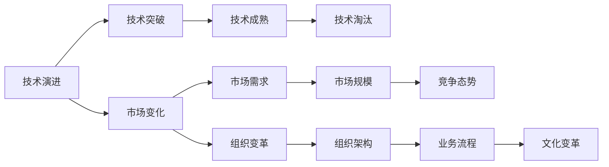

                 

# 拐点决定高度：机遇就在拐点

> 关键词：拐点,机遇,技术演进,创新,突破

## 1. 背景介绍

### 1.1 问题的由来

在快速发展的IT领域，技术变革和创新往往是由一个小小的“拐点”引发的。这个拐点可能是某种技术突破，也可能是新的市场需求出现。它不仅决定了技术发展的方向，更推动了整个行业的颠覆性变革。

例如，互联网的诞生和发展，正是从Web浏览器和万维网的推出开始，这个拐点带来了全球信息共享的新纪元。同样，智能手机和移动互联网的普及，也是由触摸屏技术的发展推动，它让人们随时随地都能接入互联网，开启了移动互联时代。

在当前的IT行业中，云计算、人工智能、大数据、区块链等技术不断涌现，这些技术的拐点不仅推动了各领域的飞速发展，更带来了新的商业模式和市场机遇。但如何捕捉到这些拐点，并充分利用它们，成为技术开发者和企业领导者的重要课题。

### 1.2 拐点的定义

拐点（Inflection Point），指的是一个事物发展的关键转折点，它标志着从量变到质变的过程。在技术领域，拐点通常是指一个新技术或产品从萌芽期、成长期、成熟期到衰退期或重生的全生命周期中的某个转折点。

- **萌芽期**：新技术或产品刚刚出现，市场接受度低，需要不断优化和验证。
- **成长期**：产品逐渐被市场接受，需求快速增长，用户口碑和应用场景不断扩大。
- **成熟期**：技术稳定、市场成熟，竞争加剧，出现了各种变体和扩展。
- **衰退期**：市场需求变化、技术成熟度下降，需要不断创新才能维持生命力。

### 1.3 拐点的识别

识别拐点需要多方面的综合判断，包括技术成熟度、市场需求变化、竞争态势、资本投入等多个维度。以下是一些常见的拐点识别方法：

1. **技术突破**：新技术的出现或现有技术的重大改进。例如，深度学习算法的发展让计算机视觉、自然语言处理等领域有了质的飞跃。
2. **市场需求**：用户需求的变化，如从PC互联网转向移动互联网，推动了整个行业的发展。
3. **竞争格局**：市场份额的重新分配，领先者与挑战者的竞争变化。
4. **资本投入**：风投资金和战略投资的大幅增加，显示出市场对新技术的认可和投资者的信心。

## 2. 核心概念与联系

### 2.1 核心概念概述

拐点概念涉及多个关键领域，包括技术演进、市场变化、组织变革等。

- **技术演进**：技术从萌芽到成熟的过程，包括技术突破、技术成熟、技术淘汰等。
- **市场变化**：市场需求从萌芽到饱和再到新的需求出现的过程，包括用户需求、市场规模、竞争态势等。
- **组织变革**：企业从技术引入、应用到市场领先的过程，包括组织架构、业务流程、文化变革等。

### 2.2 核心概念联系

拐点是一个复杂的多维度现象，涉及技术、市场和组织等多个方面。以下是各核心概念之间的逻辑关系：



### 2.3 拐点的分类

根据不同的维度，拐点可以分为以下几类：

- **技术拐点**：例如GPU计算能力的提升，推动了深度学习的快速发展。
- **市场拐点**：例如电商平台的兴起，推动了物流、支付、搜索等领域的创新。
- **组织拐点**：例如Google从搜索引擎向人工智能转型的过程。

## 3. 核心算法原理 & 具体操作步骤

### 3.1 算法原理概述

识别拐点本质上是一个数据驱动的过程，需要从历史数据中挖掘模式和趋势，并通过算法预测未来的拐点。以下是识别拐点的一般步骤：

1. **数据收集**：收集有关技术、市场和组织的多维度数据。
2. **数据处理**：清洗、转换数据，使其适合分析。
3. **模型训练**：选择或训练合适的机器学习模型，预测未来的拐点。
4. **结果验证**：通过历史数据验证模型的预测结果，调整模型参数。
5. **策略制定**：根据预测结果，制定相应的技术或市场策略。

### 3.2 算法步骤详解

#### 3.2.1 数据收集

数据收集是识别拐点的基础，通常包括以下数据来源：

- **技术数据**：技术专利申请、学术论文、开源项目等。
- **市场数据**：用户反馈、市场规模、竞争态势、收入和利润等。
- **组织数据**：员工人数、研发投入、产品发布时间等。

#### 3.2.2 数据处理

数据处理包括清洗、转换和预处理，以确保数据质量。以下是一些常用的数据处理步骤：

- **清洗数据**：去除噪音和异常值，确保数据的完整性和一致性。
- **数据转换**：将数据转换为模型所需的格式，如日期转换为时间戳。
- **数据预处理**：进行特征选择、归一化、标准化等处理，增强模型的训练效果。

#### 3.2.3 模型训练

模型训练是识别拐点的关键步骤，常用的机器学习模型包括：

- **时间序列模型**：如ARIMA、LSTM等，用于预测趋势和周期性变化。
- **分类模型**：如决策树、随机森林、支持向量机等，用于分类预测。
- **聚类模型**：如K-Means、DBSCAN等，用于数据分组和模式识别。
- **神经网络模型**：如CNN、RNN、Transformer等，用于复杂非线性关系的预测。

#### 3.2.4 结果验证

结果验证是确保模型准确性的重要步骤，通常包括：

- **交叉验证**：使用不同数据集进行交叉验证，确保模型的泛化能力。
- **误差分析**：分析模型预测的误差，调整模型参数。
- **敏感度分析**：评估模型对不同输入的敏感度，提高模型的鲁棒性。

#### 3.2.5 策略制定

策略制定是将模型结果转化为实际行动的阶段，通常包括：

- **技术研发**：根据技术预测，投资研发资源，进行技术突破。
- **市场拓展**：根据市场预测，调整产品策略，开拓新市场。
- **组织调整**：根据组织预测，优化组织架构，提升效率。

### 3.3 算法优缺点

#### 3.3.1 优点

- **数据驱动**：基于数据驱动的模型训练，具有较强的客观性和准确性。
- **可重复性**：模型训练过程可重复，便于调整和优化。
- **灵活性**：可根据不同的业务场景和数据类型，选择适合的算法和模型。

#### 3.3.2 缺点

- **数据依赖**：模型训练依赖于数据的质量和完整性，数据偏差可能导致预测错误。
- **模型复杂度**：复杂的模型需要更多的计算资源和时间，难以快速迭代。
- **解释性**：部分模型（如深度学习）较难解释，难以理解其决策过程。

### 3.4 算法应用领域

拐点识别技术已经广泛应用于多个领域：

- **技术预测**：如人工智能、云计算、区块链等领域的发展趋势预测。
- **市场分析**：如电商平台、智能家居、金融服务等市场的增长和变化。
- **组织变革**：如企业重组、战略转型、人力资源管理等。

## 4. 数学模型和公式 & 详细讲解 & 举例说明

### 4.1 数学模型构建

拐点识别模型通常包括多个步骤，以下是其中的一些关键数学模型：

- **时间序列模型**：ARIMA模型，用于预测趋势和周期性变化。
- **分类模型**：逻辑回归模型，用于分类预测。
- **聚类模型**：K-Means算法，用于数据分组和模式识别。

### 4.2 公式推导过程

#### 4.2.1 ARIMA模型

ARIMA模型（AutoRegressive Integrated Moving Average Model）用于时间序列的预测，其公式为：

$$
y(t) = c + \sum_{i=1}^p\alpha_iy(t-i) + \sum_{j=1}^d(\Delta^jy)(t) + \sum_{k=1}^q\beta_k\varepsilon(t-k)
$$

其中，$y(t)$ 为时间$t$的预测值，$\alpha_i$ 为自回归系数，$\Delta$ 为差分运算，$\beta_k$ 为移动平均系数，$\varepsilon(t)$ 为随机误差。

#### 4.2.2 逻辑回归模型

逻辑回归模型用于二分类问题，其公式为：

$$
P(y=1|x) = \frac{1}{1+e^{-z}}
$$

其中，$z=\beta_0+\sum_{i=1}^n\beta_ix_i$，$\beta_i$ 为模型系数，$x_i$ 为输入特征。

### 4.3 案例分析与讲解

以电商平台的市场增长预测为例：

1. **数据收集**：收集电商平台的销售数据、用户反馈、市场规模等数据。
2. **数据处理**：清洗数据，进行数据转换和预处理。
3. **模型训练**：使用ARIMA模型预测市场增长趋势。
4. **结果验证**：使用历史数据验证模型预测结果，调整模型参数。
5. **策略制定**：根据预测结果，制定市场拓展和产品推广策略。

## 5. 项目实践：代码实例和详细解释说明

### 5.1 开发环境搭建

项目开发通常需要在Python环境下进行，以下是Python开发环境的搭建步骤：

1. **安装Python**：从官网下载并安装Python，选择合适的版本（如Python 3.8或更高版本）。
2. **安装Python开发工具**：如PyCharm、Jupyter Notebook等。
3. **安装第三方库**：安装必要的Python库，如NumPy、Pandas、Matplotlib等。
4. **配置环境变量**：设置环境变量，以便导入第三方库和运行代码。

### 5.2 源代码详细实现

以下是使用Python进行时间序列模型训练和预测的代码实现：

```python
import pandas as pd
from statsmodels.tsa.arima_model import ARIMA

# 加载数据
data = pd.read_csv('sales_data.csv')

# 数据处理
data['date'] = pd.to_datetime(data['date'])
data.set_index('date', inplace=True)
data = data.resample('M').mean()

# 训练模型
model = ARIMA(data, order=(1, 1, 1))
model_fit = model.fit()

# 预测未来值
forecast = model_fit.forecast(steps=12)
print(forecast)
```

### 5.3 代码解读与分析

#### 5.3.1 数据加载和处理

使用Pandas库加载销售数据，并进行时间序列处理。

#### 5.3.2 模型训练

使用statsmodels库中的ARIMA模型进行训练，指定模型阶数。

#### 5.3.3 预测未来值

使用模型进行未来12个月的预测，并输出预测结果。

### 5.4 运行结果展示

输出预测结果，显示未来12个月的销售预测值。

## 6. 实际应用场景

### 6.1 技术拐点

在人工智能领域，深度学习的突破标志着技术拐点。例如，深度卷积神经网络（CNN）的提出，推动了计算机视觉领域的发展；递归神经网络（RNN）和长短时记忆网络（LSTM）的提出，推动了自然语言处理领域的发展。

### 6.2 市场拐点

在互联网领域，社交网络的普及标志着市场拐点。例如，Facebook的崛起，推动了社交媒体市场的发展；阿里巴巴的崛起，推动了电商市场的快速发展。

### 6.3 组织拐点

在企业管理领域，Google从搜索引擎向人工智能转型的过程标志着组织拐点。例如，Google收购DeepMind，推动了AI技术在Google各业务线的应用。

### 6.4 未来应用展望

未来的技术拐点将更多地集中在以下几个领域：

- **量子计算**：量子计算的突破将带来计算能力的大幅提升，推动新一轮技术革命。
- **物联网（IoT）**：物联网的普及将带来大量的传感器数据，推动实时数据处理和分析技术的发展。
- **生物技术**：基因编辑、合成生物学等技术的发展将带来医疗、农业等领域的颠覆性变化。
- **虚拟现实（VR）和增强现实（AR）**：VR和AR技术的发展将推动虚拟交互、远程协作等领域的发展。

## 7. 工具和资源推荐

### 7.1 学习资源推荐

1. **《机器学习实战》**：介绍机器学习的基本概念和算法，适合初学者入门。
2. **《深度学习》**：吴恩达的Coursera课程，系统讲解深度学习的原理和应用。
3. **《Python数据科学手册》**：介绍Python在数据科学中的应用，适合进行数据分析和建模。
4. **Kaggle**：数据科学竞赛平台，提供丰富的数据集和机器学习竞赛，适合实战练习。

### 7.2 开发工具推荐

1. **PyCharm**：Python开发工具，提供丰富的IDE功能和插件支持。
2. **Jupyter Notebook**：交互式Python开发环境，适合进行数据探索和算法实验。
3. **GitHub**：代码托管平台，提供版本控制和协作功能。
4. **Anaconda**：Python环境管理工具，提供虚拟环境管理、包管理等功能。

### 7.3 相关论文推荐

1. **《人工智能的未来》**：Yann LeCun在2021年提出的未来AI发展趋势，值得深入阅读。
2. **《深度学习在金融行业的应用》**：介绍深度学习在金融行业中的多种应用，如风险评估、算法交易等。
3. **《物联网的未来》**：探讨物联网技术在智能城市、智能家居等领域的应用前景。
4. **《量子计算的挑战与机遇》**：介绍量子计算的技术现状和未来发展趋势。

## 8. 总结：未来发展趋势与挑战

### 8.1 研究成果总结

拐点识别技术在技术演进、市场变化、组织变革等领域取得了显著的进展，对多个行业产生了深远影响。

### 8.2 未来发展趋势

未来拐点识别技术将呈现以下几个趋势：

- **数据驱动**：更多依赖大规模数据和高质量数据，提高模型的预测准确性。
- **算法多样化**：引入更多先进的算法和技术，如深度学习、神经网络等，提升模型复杂度。
- **模型解释性**：增强模型的解释性和可理解性，提高决策的透明度和可信度。
- **跨领域融合**：与其他技术（如区块链、物联网）融合，推动更多创新应用。

### 8.3 面临的挑战

尽管拐点识别技术取得了显著进展，但仍面临以下挑战：

- **数据获取**：高质量数据的获取和处理仍是一个难题，影响模型的预测效果。
- **模型复杂度**：复杂的模型需要更多的计算资源和时间，难以快速迭代。
- **解释性**：部分模型（如深度学习）较难解释，难以理解其决策过程。
- **跨领域应用**：如何将拐点识别技术应用到更多领域，仍需要更多的探索和实践。

### 8.4 研究展望

未来的研究需要在以下几个方面进行突破：

- **自动化数据获取**：通过爬虫和API等技术，自动获取高质量数据，减少人工干预。
- **模型简化**：简化模型结构，提高计算效率和可解释性，适应更多应用场景。
- **跨领域应用**：将拐点识别技术应用到更多领域，如生物技术、量子计算等，推动跨领域创新。

## 9. 附录：常见问题与解答

### 9.1 常见问题

**Q1：什么是拐点？**

A: 拐点指的是技术、市场或组织发展的关键转折点，标志着从量变到质变的过程。

**Q2：如何识别拐点？**

A: 识别拐点需要收集和分析多维度数据，选择或训练合适的机器学习模型，进行预测和验证，制定相应的策略。

**Q3：拐点的应用场景有哪些？**

A: 拐点识别技术在技术演进、市场变化、组织变革等领域具有广泛应用，推动了多个行业的快速发展。

**Q4：拐点识别技术的挑战有哪些？**

A: 数据获取、模型复杂度、解释性和跨领域应用是拐点识别技术面临的主要挑战。

**Q5：未来拐点识别技术的发展趋势是什么？**

A: 未来拐点识别技术将更多依赖数据驱动，引入多样化算法，增强模型解释性，推动跨领域创新。

---

作者：禅与计算机程序设计艺术 / Zen and the Art of Computer Programming

