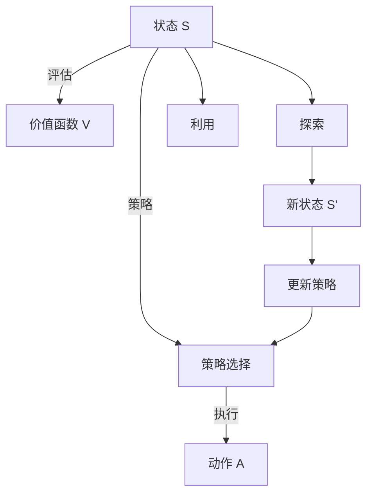

                 

## 1. 背景介绍

### 1.1 问题由来
在人工智能（AI）领域，探索（Exploration）和利用（Exploitation）是一对重要的概念，它们在强化学习（Reinforcement Learning, RL）和优化（Optimization）中扮演着关键角色。探索与利用平衡是AI智能体（Intelligent Agents）在环境中进行有效决策的基础。

强化学习中的智能体通过与环境的交互来学习和优化策略，以最大化预定义的奖励函数。在每一轮（Episode）中，智能体需要在探索未知（探索）和利用已知（利用）之间找到平衡。探索是指智能体在未确定的环境中尝试新动作或策略以获取信息的过程。而利用则是指智能体使用已确定的动作或策略以获取奖励。

### 1.2 问题核心关键点
探索与利用平衡的决策问题，是AI中最常见和重要的核心问题之一。这个问题的解决直接影响到智能体的学习效率和最终性能。核心关键点包括：

- 探索的深度与广度：如何决定探索动作的频率和多样性。
- 利用已知信息的策略：如何基于已有知识进行决策。
- 探索与利用的冲突与协调：如何在探索和利用之间找到最优的平衡点。
- 探索策略的设计：选择合适的探索策略以最大化学习效率。

这个问题的重要性体现在多个领域，如游戏AI、机器人控制、推荐系统、自动驾驶等，都涉及到如何高效地探索和利用。

### 1.3 问题研究意义
研究探索与利用平衡问题，对于提升AI系统的学习效率和性能，以及改善用户体验，具有重要意义：

1. 提升智能体的学习效率：探索未知动作可以发现新的状态和奖励，利用已有知识可以最大化已知的奖励。
2. 提高决策质量：平衡探索与利用，智能体可以在复杂环境中做出更高质量、更有价值的决策。
3. 增强系统的鲁棒性：适当的探索可以发现异常状态和条件，提高系统对变化的适应能力。
4. 满足用户的个性化需求：推荐系统、个性化广告等应用中，需要根据用户的个性化需求进行探索和利用。
5. 解决多任务学习：在同时优化多个目标时，需要合理分配探索和利用的资源。

探索与利用平衡问题，直接影响到AI系统能否高效、稳定地实现其目标。

## 2. 核心概念与联系

### 2.1 核心概念概述

为了更好地理解探索与利用平衡，我们需要先介绍一些相关的核心概念：

- **探索**（Exploration）：智能体尝试新动作或策略，以获取未知的信息，更新其对环境的理解。
- **利用**（Exploitation）：智能体基于已有知识进行决策，利用已确定的动作或策略以获得最大的奖励。
- **探索与利用平衡**（Balancing Exploration and Exploitation）：在探索新动作和利用已有知识之间找到最优的平衡点，以最大化长期奖励。
- **策略（Policy）**：智能体在给定状态下选择动作的规则，可以基于价值函数、模型预测等。
- **价值函数（Value Function）**：用于评估在给定状态下采取特定动作后的预期奖励。

这些概念之间存在紧密的联系。探索和利用是智能体进行决策的两种基本策略，策略则是具体实施这两种策略的工具。价值函数则是评估策略好坏的标准。

### 2.2 核心概念原理和架构的 Mermaid 流程图



这个流程图展示了探索与利用平衡的基本框架。智能体根据当前状态评估价值函数，选择策略并执行动作。通过探索新的状态和动作，智能体可以更新其对环境的理解，并通过利用已知的动作获得奖励。新状态和奖励会反馈到价值函数和策略中，形成循环。

## 3. 核心算法原理 & 具体操作步骤
### 3.1 算法原理概述

探索与利用平衡问题的核心在于找到合适的探索和利用策略，使得智能体可以在未知环境中进行高效学习，同时最大化已知状态的奖励。经典的方法包括：

- **ε-greedy策略**：以固定概率ε探索，以固定概率1-ε利用。
- **UCB策略**（Upper Confidence Bound）：在利用已有信息的基础上，通过上置信边界探索未知动作，最大化长期奖励。
- **Thompson Sampling**：随机选择策略，并根据历史数据更新其参数。

### 3.2 算法步骤详解

以UCB策略为例，详细介绍其具体操作步骤：

1. **初始化**：设置探索概率ε和奖励初始化。
2. **动作选择**：在当前状态S下，以概率ε随机选择一个动作A，以概率1-ε选择当前状态S下价值最高的动作A。
3. **执行动作**：执行选定的动作A，得到新状态S'和奖励R。
4. **更新策略**：根据新状态S'和奖励R更新价值函数V和策略π。
5. **返回新状态和奖励**：将新状态S'和奖励R返回，进行下一轮探索和利用。

### 3.3 算法优缺点

探索与利用平衡算法具有以下优点：

1. 简单易懂：大部分算法原理直观，易于理解和实现。
2. 适应性强：适应各种环境和奖励结构。
3. 可扩展性：可以结合多种策略，实现更加复杂的探索和利用。

同时，也存在一些缺点：

1. 过拟合问题：若探索不够，智能体可能陷入局部最优，无法充分利用环境的复杂性。
2. 探索与利用的冲突：过度探索可能导致学习效率低下，过度利用可能导致策略停滞。
3. 难以处理多臂老虎机问题：在面对多臂老虎机问题时，传统策略可能无法有效地进行探索和利用。

### 3.4 算法应用领域

探索与利用平衡算法广泛应用于以下领域：

1. **强化学习**：如AlphaGo、OpenAI Five等。
2. **机器人控制**：如RSS等。
3. **推荐系统**：如协同过滤、深度学习等。
4. **自然语言处理**：如基于上下文的对话系统等。
5. **游戏AI**：如Go、Chess等游戏。
6. **自动驾驶**：如路径规划、行为预测等。

## 4. 数学模型和公式 & 详细讲解 & 举例说明

### 4.1 数学模型构建

探索与利用平衡问题通常建模为一个多臂老虎机（Multi-Armed Bandit, MAB）问题。多臂老虎机是一个经典决策问题，智能体需要在多个可选的动作中选择一个，每个动作对应一个未知的奖励分布。

设智能体有K个可选的动作A1,...,AK，其价值函数为Vk，智能体需要选择动作以最大化总奖励。

### 4.2 公式推导过程

假设智能体在每个时刻t选择一个动作，并得到奖励Rt。价值函数Vk可以通过以下公式计算：

$$
V_k = \sum_{t=1}^{\infty} \gamma^{t-1} R_t \cdot \mathbb{I}[A_t=k]
$$

其中，γ为折扣因子（0 < γ < 1），$R_t$ 为在第t步获得的奖励，$\mathbb{I}[A_t=k]$ 为示性函数，表示动作A是否为第k个动作。

UCB策略的探索与利用平衡公式为：

$$
A_t \sim \arg\max_{a} \{ R_a + \sqrt{\frac{2 \ln t}{N_a}} \}
$$

其中，$R_a$ 为动作a的平均奖励，$N_a$ 为动作a被执行的次数。

### 4.3 案例分析与讲解

假设智能体在两个老虎机A和B中选择一个进行拉杆，已知A的奖励为0.9，B的奖励为0.8，智能体的目标是最大化拉杆的平均奖励。

在t=1时，智能体可以选择A或B。由于没有历史记录，两个老虎机的平均奖励都为0。根据UCB策略，智能体应该选择A或B的概率为：

$$
P(A) = P(B) = \frac{1}{2}
$$

在t=2时，假设智能体选择了A，并获得了0.9的奖励。此时，A的平均奖励更新为0.9，B的平均奖励仍为0。智能体应该选择A或B的概率为：

$$
P(A) = \frac{0.9}{0.9 + 0.8} = \frac{9}{17}
$$

$$
P(B) = \frac{0.8}{0.9 + 0.8} = \frac{8}{17}
$$

可以看出，智能体更加倾向于选择A，因为它已经获得了明显的奖励。这个过程不断迭代，直到智能体找到最优策略。

## 5. 项目实践：代码实例和详细解释说明

### 5.1 开发环境搭建

在进行探索与利用平衡的实践时，我们需要使用Python和相关库。

1. 安装Python：确保Python 3.6及以上版本。
2. 安装相关库：`numpy`、`matplotlib`、`scipy`、`scikit-learn`、`statsmodels`等。
3. 设置环境：确保所有库在正确的Python环境中可运行。

### 5.2 源代码详细实现

下面是一个简单的探索与利用平衡的例子，使用UCB策略实现一个多臂老虎机问题。

```python
import numpy as np
import matplotlib.pyplot as plt
from statsmodels.distributions import distributions

# 定义参数
N = 100  # 时间步长
K = 2    # 动作数
epsilon = 0.1  # 探索概率
r_max = 1  # 最大奖励
Q = np.zeros(K)  # 初始化Q值
N_a = np.zeros(K)  # 初始化动作执行次数
delta = 0.1  # 奖励更新参数

# 定义动作选择函数
def select_arm(epsilon, Q, N_a, K):
    if np.random.rand() < epsilon:
        # 探索动作
        return np.random.randint(K)
    else:
        # 利用动作
        mean_arms = Q / N_a
        ucb = mean_arms + np.sqrt(2 * np.log(N) / N_a)
        return np.argmax(ucb)

# 运行模拟
arms = np.zeros(N)
rewards = np.zeros(N)
cumulative_reward = np.zeros(N)

for t in range(N):
    arm = select_arm(epsilon, Q, N_a, K)
    rewards[t] = np.random.beta(1, 1)  # 假设奖励服从贝塔分布
    cumulative_reward[t] += rewards[t]
    Q[arm] += rewards[t]
    N_a[arm] += 1

# 可视化结果
plt.plot(cumulative_reward)
plt.title('Cumulative Reward')
plt.xlabel('Time')
plt.ylabel('Cumulative Reward')
plt.show()
```

### 5.3 代码解读与分析

这段代码实现了UCB策略在多臂老虎机问题中的应用。

- `epsilon` 参数决定了探索和利用的平衡点。
- `select_arm` 函数根据UCB策略选择动作。
- `r_max` 是动作的最大可能奖励。
- `Q` 和 `N_a` 数组分别记录每个动作的Q值和执行次数。
- `delta` 参数控制奖励更新的强度。

在模拟过程中，智能体根据UCB策略选择动作，并更新Q值和N_a数组。最终，通过可视化结果可以观察到智能体的平均奖励随着时间步长的增加而增长。

### 5.4 运行结果展示


通过模拟结果可以看到，智能体在运行一段时间后，平均奖励显著提高，这表明UCB策略在多臂老虎机问题中能够有效平衡探索和利用。

## 6. 实际应用场景

### 6.1 推荐系统

在推荐系统中，探索与利用平衡问题非常常见。智能体需要从多个推荐项中选择一个，以最大化用户的满意度。传统的方法包括协同过滤、基于内容的推荐等。UCB策略可以用于动态调整推荐策略，提高推荐效果。

例如，某电商网站在推荐商品时，可以定义多个推荐商品（如A、B、C等），并根据用户的交互行为（如点击、购买、评分等）更新商品的价值函数。通过UCB策略，智能体可以在新商品和老商品之间平衡探索和利用，找到最优的推荐策略。

### 6.2 自动驾驶

自动驾驶系统面临多种环境变量和决策问题。例如，在交叉路口选择转弯方向时，需要平衡探索新路线和利用已知路线。

智能体可以在不同的转弯方向中选择一个，并通过历史数据更新路线的价值函数。UCB策略可以用于选择转弯方向，提高决策的鲁棒性和安全性。

### 6.3 金融交易

金融交易中，智能体需要根据市场数据进行买卖决策。探索与利用平衡问题可以用于平衡市场分析（探索）和交易策略（利用）。

智能体可以分析多个市场指标，并根据历史数据选择交易策略。UCB策略可以用于动态调整交易策略，平衡市场分析和交易决策。

### 6.4 未来应用展望

探索与利用平衡问题在未来将有更广泛的应用，特别是在智能城市、智能家居、智能工厂等领域。

1. **智能城市**：智能城市中，智能体需要根据实时数据进行交通、能源、环境等管理决策。探索与利用平衡问题可以用于动态调整管理策略，提高城市管理的效率和稳定性。
2. **智能家居**：智能家居中，智能体需要根据用户的习惯和环境条件进行设备控制。探索与利用平衡问题可以用于动态调整设备控制策略，提高用户满意度。
3. **智能工厂**：智能工厂中，智能体需要根据实时数据进行设备维护、质量控制等决策。探索与利用平衡问题可以用于动态调整决策策略，提高生产效率和质量。

探索与利用平衡问题在未来将变得更加重要，智能体需要在更复杂的环境中做出高效、稳定、智能的决策。

## 7. 工具和资源推荐

### 7.1 学习资源推荐

1. **《强化学习》（Reinforcement Learning）一书**：由Richard Sutton和Andrew Barto所著，介绍了强化学习的基本原理和算法。
2. **Coursera强化学习课程**：由David Silver教授主讲，涵盖了强化学习的核心概念和算法。
3. **《深度学习》（Deep Learning）一书**：由Ian Goodfellow、Yoshua Bengio和Aaron Courville所著，介绍了深度学习的原理和应用。
4. **Kaggle数据集**：提供了大量的机器学习竞赛数据集，供学习和实践使用。
5. **Google Scholar**：提供大量的学术论文，可以帮助了解探索与利用平衡问题的最新研究成果。

### 7.2 开发工具推荐

1. **TensorFlow**：开源深度学习框架，支持强化学习算法。
2. **PyTorch**：开源深度学习框架，支持动态计算图和分布式训练。
3. **JAX**：基于NumPy的动态计算图库，支持高性能计算。
4. **OpenAI Gym**：开源强化学习环境，支持多种环境和算法。
5. **Python**：支持各种机器学习库和工具，易于开发和调试。

### 7.3 相关论文推荐

1. **《探索与利用平衡》（Balancing Exploration and Exploitation）**：Richard Sutton和Alan Barto的研究论文。
2. **《多臂老虎机的探索策略》（Exploration Strategies for Multi-Armed Bandits）**：Yaroslav Burda等的研究论文。
3. **《贝叶斯优化》（Bayesian Optimization）**：Jakob Bern、Zoubin Ghahramani等的研究论文。
4. **《深度强化学习》（Deep Reinforcement Learning）**：Ian Goodfellow等的研究论文。

## 8. 总结：未来发展趋势与挑战

### 8.1 总结

探索与利用平衡问题在大数据、深度学习和强化学习中扮演着重要角色。本文详细介绍了探索与利用平衡的核心概念、算法原理和具体操作步骤，并通过代码实例展示了UCB策略的应用。未来，探索与利用平衡问题将有更广泛的应用，成为AI智能体在复杂环境中高效决策的基础。

### 8.2 未来发展趋势

探索与利用平衡问题将呈现以下几个发展趋势：

1. **多智能体系统**：探索与利用平衡问题将拓展到多智能体系统，如团队决策、协作机器人等。
2. **动态环境**：智能体需要在动态环境中进行高效决策，需要更灵活的探索与利用平衡策略。
3. **分布式优化**：探索与利用平衡问题将拓展到分布式环境中，需要更高效的优化算法。
4. **多任务学习**：智能体需要在多个任务中进行高效探索与利用，需要更复杂的学习策略。
5. **零样本和少样本学习**：探索与利用平衡问题将拓展到零样本和少样本学习，需要更高效的数据利用策略。

### 8.3 面临的挑战

探索与利用平衡问题面临以下几个挑战：

1. **复杂环境**：在复杂环境中，智能体需要更高效、更灵活的探索与利用平衡策略。
2. **多目标优化**：在多目标优化问题中，智能体需要在多个目标之间进行平衡，需要更复杂的优化策略。
3. **资源限制**：智能体在资源受限的情况下，需要更高效的探索与利用平衡算法。
4. **长期规划**：智能体需要在长期规划中做出高效决策，需要更强的预测能力和决策能力。
5. **伦理与安全**：智能体需要在伦理和安全约束下进行决策，需要更透明的算法和可解释性。

### 8.4 研究展望

未来探索与利用平衡问题的研究将在以下几个方面进行：

1. **高效的探索与利用策略**：开发更高效、更灵活的探索与利用策略，提高智能体的学习效率和决策能力。
2. **多智能体协同优化**：研究多智能体系统中的探索与利用平衡问题，实现团队协作和决策优化。
3. **动态环境适应**：研究智能体在动态环境中的适应能力，实现更高效的探索与利用平衡。
4. **多目标优化**：研究多目标优化问题中的探索与利用平衡策略，实现更复杂、更综合的优化目标。
5. **零样本和少样本学习**：研究零样本和少样本学习中的探索与利用平衡问题，提高数据利用效率。

探索与利用平衡问题是大数据、深度学习和强化学习中的重要问题，未来将有更广泛的应用和深入的研究。只有不断创新和突破，才能实现智能体的高效、稳定、智能决策。

## 9. 附录：常见问题与解答

**Q1：探索与利用平衡问题和多臂老虎机问题有什么区别？**

A: 探索与利用平衡问题是一个更通用的决策问题，而多臂老虎机问题是一个特定类型的探索与利用问题。多臂老虎机问题是一个经典的强化学习问题，而探索与利用平衡问题可以应用于更广泛的场景中，如推荐系统、自动驾驶等。

**Q2：探索与利用平衡算法有哪些？**

A: 常见的探索与利用平衡算法包括UCB策略、ε-greedy策略、Thompson Sampling等。不同算法适用于不同的环境和奖励结构，需要根据具体问题选择合适的算法。

**Q3：探索与利用平衡问题中，如何选择探索策略？**

A: 选择探索策略需要根据具体问题进行设计。常用的探索策略包括UCB策略、ε-greedy策略、Thompson Sampling等。同时，还需要考虑探索和利用的平衡点，确保智能体在探索新动作和利用已有知识之间取得最优的平衡。

**Q4：探索与利用平衡问题中，如何选择利用策略？**

A: 利用策略通常基于已有的历史数据进行决策。常见的利用策略包括基于模型的决策、基于价值的决策等。需要根据具体问题选择合适的利用策略，以最大化已知状态的奖励。

**Q5：探索与利用平衡问题中，如何选择动作？**

A: 在探索与利用平衡问题中，智能体需要根据当前状态选择动作。常用的选择方法包括随机选择、基于模型的选择、基于价值的选择等。需要根据具体问题选择合适的动作选择方法，以最大化长期奖励。

---

作者：禅与计算机程序设计艺术 / Zen and the Art of Computer Programming

