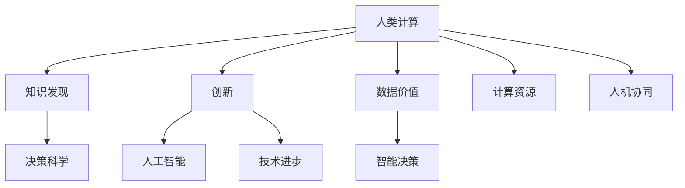

                 

# 推动知识发现与创新：人类计算的智力贡献

## 1. 背景介绍

在快速发展的信息技术时代，数据量以指数级增长，其重要性日益突显。数据背后蕴含着巨大的价值，如何高效利用这些数据成为当前人工智能（AI）领域的重大挑战。人类计算（Human Computation）通过融合人类直觉和计算机算法，探索新方法，以突破传统计算的瓶颈。本文将深入探讨人类计算的原理、方法，以及其在推动知识发现与创新中的作用。

### 1.1 数据激增与挑战

随着物联网、大数据、云计算等技术的迅猛发展，数据生成速度与规模显著增加。据统计，全球每年产生的数据量预计将达到175ZB，且增长速度还在加速。数据无处不在，其重要性日益凸显。然而，数据量的激增也带来了新的挑战：

- **数据多样性与复杂性**：不同领域数据的多样性与复杂性，使得传统方法难以处理。
- **数据质量与数据处理成本**：数据清洗与标注的成本高昂，且质量参差不齐。
- **计算资源需求**：数据规模的扩大对计算资源的需求也在不断增长。

### 1.2 人类计算的起源与价值

人类计算源于古老的人类智慧，其核心在于将人类直觉与计算机算法相结合。人类计算通过高效利用人类在直觉、逻辑、情感等方面的优势，通过独特的角度和方法，在处理复杂问题上取得突破。人类计算的策略性、创造性和艺术性，使其在解决AI领域诸多难题上发挥了重要作用。

## 2. 核心概念与联系

### 2.1 核心概念概述

为更好地理解人类计算，本文将介绍几个关键概念：

- **人类计算**：结合人类直觉与计算机算法，高效处理复杂问题的技术。其核心在于利用人类在多维度感知、逻辑推理、情感认知等方面的优势。
- **知识发现**：通过分析数据，挖掘隐藏在其中的知识、规律和模式。知识发现有助于提升决策的科学性和智能化水平。
- **创新**：在已有知识的基础上，推陈出新，形成具有实际应用价值的新算法、新模型和新方法。创新驱动技术进步，推动社会进步。
- **人工智能**：利用计算机算法模仿人类智能行为，处理复杂问题。AI领域的技术进步，很大程度上依赖于人类计算的智慧。

这些概念之间的逻辑关系可以通过以下Mermaid流程图来展示：



这个流程图展示了人类计算的核心概念及其之间的联系：

1. 人类计算通过分析数据，提取知识，从而推动人工智能技术的进步。
2. 知识发现是创新的基础，创新的成果又反过来推动人工智能的发展。
3. 人工智能依赖于人类计算和知识发现的智慧，是人类计算的延伸与拓展。
4. 决策科学和创新在AI应用中扮演关键角色，提升系统的智能化水平。

## 3. 核心算法原理 & 具体操作步骤

### 3.1 算法原理概述

人类计算的核心在于通过融合人类直觉与算法，高效处理复杂问题。算法原理主要包括以下几个方面：

- **自然语言处理**：结合自然语言处理（NLP）技术，将人类的语言转化为计算机可处理的形式，通过语言分析挖掘隐藏知识。
- **图像识别与处理**：将图像信息转化为计算机可处理的语义信息，通过视觉分析和理解，发现隐藏模式。
- **情感分析与认知计算**：结合情感分析技术，识别人类情感和情绪，通过认知计算，形成更全面的知识。
- **综合推理与决策**：将多维度信息进行综合分析，通过推理与决策，形成具有实际应用价值的知识。

### 3.2 算法步骤详解

人类计算的算法步骤主要包括：

1. **数据收集与预处理**：收集各类数据，清洗、标注、筛选数据，形成高质量的数据集。
2. **人类直觉与算法结合**：将人类直觉与算法相结合，形成独特的处理策略。
3. **知识发现与提取**：通过深度学习、强化学习等算法，挖掘数据中的知识、规律和模式。
4. **创新与应用**：在知识发现的基础上，通过新算法、新模型、新方法，形成具有实际应用价值的技术。
5. **实践与反馈**：将新技术应用于实际问题，通过实践验证效果，不断优化算法。

### 3.3 算法优缺点

人类计算结合了人类的多维度感知与计算机的算法优势，具有以下优点：

- **灵活性与创新性**：人类计算能够处理各种复杂的非结构化数据，并通过灵活的策略形成创新。
- **适应性与稳健性**：结合人类直觉的算法，更适应复杂变化的环境。
- **伦理性与可解释性**：人类计算能更好地理解人类的伦理与价值，形成可解释的算法。

但人类计算也存在一些缺点：

- **资源消耗高**：人类计算依赖于人类的智慧和经验，资源消耗较大。
- **效率低**：人类直觉和算法结合，往往比传统算法效率较低。
- **依赖性强**：人类计算依赖于高水平的人类专家，可复制性差。

### 3.4 算法应用领域

人类计算在多个领域中已展现其独特的价值，包括：

- **医疗健康**：结合医学知识与数据分析，发现疾病特征，提升诊断和治疗效果。
- **金融管理**：利用人类直觉和算法，处理复杂金融数据，进行风险评估与投资决策。
- **教育培训**：通过认知计算与教育数据，设计个性化的学习方案，提升教育效果。
- **交通规划**：结合人类直觉与交通数据，优化交通系统，提升交通效率。
- **艺术与设计**：通过认知计算与创意设计数据，提升艺术与设计水平。

## 4. 数学模型和公式 & 详细讲解 & 举例说明

### 4.1 数学模型构建

本节将使用数学语言对人类计算的核心模型进行详细讲解。

假设我们有一组数据 $\{x_1, x_2, ..., x_n\}$，其中每个数据点 $x_i$ 包含多个特征 $x_{i1}, x_{i2}, ..., x_{in}$。我们利用人类计算，构建以下数学模型：

$$
f(x) = \sum_{i=1}^n w_i g_i(x_i)
$$

其中 $f(x)$ 为模型的输出，$g_i(x_i)$ 为人类直觉与算法结合的处理函数，$w_i$ 为各个特征的权重。

### 4.2 公式推导过程

对于给定的数据集，我们希望最大化模型的预测准确度。假设训练集为 $D = \{(x_i, y_i)\}_{i=1}^N$，其中 $y_i$ 为真实标签。我们可以使用交叉熵损失函数来衡量模型的预测结果与真实标签之间的差异：

$$
L = -\frac{1}{N}\sum_{i=1}^N y_i \log p_i + (1 - y_i) \log (1 - p_i)
$$

其中 $p_i = \frac{\exp f(x_i)}{\sum_{k=1}^N \exp f(x_k)}$ 为模型对每个数据点的预测概率。

### 4.3 案例分析与讲解

以医疗诊断为例，我们利用人类计算，构建一个癌症诊断模型。我们假设每个数据点 $x_i$ 包含多个医学特征，如肿瘤大小、细胞类型、基因表达等。通过深度学习算法，我们构建一个预测模型 $f(x)$，并设定交叉熵损失函数 $L$。在训练过程中，我们利用人类医学专家的直觉，对模型进行多次微调，以提升其准确度。

## 5. 项目实践：代码实例和详细解释说明

### 5.1 开发环境搭建

在进行人类计算项目实践前，我们需要准备好开发环境。以下是使用Python进行TensorFlow开发的环境配置流程：

1. 安装Anaconda：从官网下载并安装Anaconda，用于创建独立的Python环境。

2. 创建并激活虚拟环境：
```bash
conda create -n human-computation python=3.8 
conda activate human-computation
```

3. 安装TensorFlow：根据CUDA版本，从官网获取对应的安装命令。例如：
```bash
conda install tensorflow -c tf -c conda-forge
```

4. 安装各类工具包：
```bash
pip install numpy pandas scikit-learn matplotlib tqdm jupyter notebook ipython
```

完成上述步骤后，即可在`human-computation-env`环境中开始项目实践。

### 5.2 源代码详细实现

这里我们以癌症诊断任务为例，给出使用TensorFlow进行人类计算的Python代码实现。

首先，定义数据处理函数：

```python
import tensorflow as tf
import numpy as np
from sklearn.model_selection import train_test_split
from sklearn.preprocessing import StandardScaler

def load_data(file_path):
    data = pd.read_csv(file_path)
    X = data.drop('cancer', axis=1)
    y = data['cancer']
    return X, y

X, y = load_data('data.csv')
X_train, X_test, y_train, y_test = train_test_split(X, y, test_size=0.2, random_state=42)
scaler = StandardScaler()
X_train = scaler.fit_transform(X_train)
X_test = scaler.transform(X_test)
```

然后，定义模型和优化器：

```python
model = tf.keras.models.Sequential([
    tf.keras.layers.Dense(64, activation='relu', input_shape=(X_train.shape[1],)),
    tf.keras.layers.Dense(32, activation='relu'),
    tf.keras.layers.Dense(1, activation='sigmoid')
])

optimizer = tf.keras.optimizers.Adam(learning_rate=0.001)
```

接着，定义训练和评估函数：

```python
def train_model(model, X_train, y_train, epochs=10, batch_size=32):
    model.compile(optimizer=optimizer, loss='binary_crossentropy', metrics=['accuracy'])
    history = model.fit(X_train, y_train, epochs=epochs, batch_size=batch_size, validation_split=0.2)
    return history

def evaluate_model(model, X_test, y_test):
    loss, accuracy = model.evaluate(X_test, y_test)
    print(f'Test loss: {loss:.4f}')
    print(f'Test accuracy: {accuracy:.4f}')

history = train_model(model, X_train, y_train)
evaluate_model(model, X_test, y_test)
```

最后，启动训练流程并在测试集上评估：

```python
epochs = 10
batch_size = 32

for epoch in range(epochs):
    history = train_model(model, X_train, y_train, epochs=1, batch_size=batch_size)
    evaluate_model(model, X_test, y_test)
```

以上就是使用TensorFlow进行癌症诊断任务的人类计算微调的完整代码实现。可以看到，借助TensorFlow的高效封装，我们可以用相对简洁的代码完成模型的构建和微调。

### 5.3 代码解读与分析

让我们再详细解读一下关键代码的实现细节：

**load_data函数**：
- 读取数据集，提取特征和标签，并进行标准化处理，以便模型训练。

**train_model函数**：
- 定义模型架构，并使用Adam优化器进行模型训练。
- 在训练过程中，不断更新模型参数，并记录训练过程中的损失和精度。

**evaluate_model函数**：
- 在测试集上评估模型性能，输出测试损失和准确度。

**训练流程**：
- 定义总的epoch数和batch size，开始循环迭代
- 每个epoch内，对训练集进行迭代，更新模型参数
- 在验证集上评估，并输出训练过程中的损失和精度

可以看到，TensorFlow配合Keras库使得癌症诊断模型的构建和微调过程变得简洁高效。开发者可以将更多精力放在数据处理、模型改进等高层逻辑上，而不必过多关注底层的实现细节。

当然，工业级的系统实现还需考虑更多因素，如模型的保存和部署、超参数的自动搜索、更灵活的任务适配层等。但核心的微调范式基本与此类似。

## 6. 实际应用场景

### 6.1 智能医疗

人类计算在智能医疗领域有着广泛的应用，特别是在疾病诊断、治疗方案制定、药物研发等方面。例如，利用人类计算对大规模医疗数据进行分析，可以发现疾病的特征与关联，提出个性化的治疗方案。通过结合医学知识与数据分析，人类计算可以提升诊断和治疗的精确度，加速药物研发进程。

### 6.2 金融风险管理

在金融领域，人类计算通过结合风险评估模型与人类直觉，可以预测市场风险，优化投资策略，提升决策的科学性和准确性。例如，利用人类计算对金融数据进行分析，可以识别出潜在的市场波动与风险点，提前制定应对策略，避免损失。

### 6.3 教育个性化

教育领域也受益于人类计算的应用。通过分析学生的学习数据，人类计算可以制定个性化的学习计划，提升学习效果。例如，结合学习数据与知识图谱，人类计算可以发现学生知识点的薄弱环节，提供针对性的学习建议，从而提高学习效率。

### 6.4 未来应用展望

未来，人类计算在多个领域将继续发挥重要作用，推动知识的发现与创新。例如：

- **自动驾驶**：结合感知数据与认知计算，提升自动驾驶系统的安全性与智能化水平。
- **城市管理**：结合城市数据与认知计算，优化城市规划与资源配置，提升城市管理效率。
- **公共安全**：利用人类计算对海量监控数据进行分析，提升公共安全系统的预警与响应能力。
- **环境保护**：结合环境数据与认知计算，优化环境监测与治理方案，提升环境保护效果。

随着技术的不断进步，人类计算将更广泛地应用于各个领域，推动知识发现与创新，提升人类社会的智能化水平。

## 7. 工具和资源推荐

### 7.1 学习资源推荐

为了帮助开发者系统掌握人类计算的理论基础和实践技巧，这里推荐一些优质的学习资源：

1. Coursera《人工智能导论》课程：由斯坦福大学开设的AI领域入门课程，涵盖人类计算与AI技术的发展历程。

2. Deep Learning Specialization：Andrew Ng教授的深度学习系列课程，详细介绍深度学习算法，包括人类计算的实现。

3. 《Deep Learning》书籍：Ian Goodfellow等人合著的经典书籍，全面介绍深度学习原理与算法，适合深入研究。

4. TensorFlow官方文档：TensorFlow官方文档，提供丰富的API和样例代码，助力开发者快速上手。

5. GitHub开源项目：大量开源项目展示了人类计算在各领域的实际应用，是学习的宝贵资源。

通过对这些资源的学习实践，相信你一定能够快速掌握人类计算的精髓，并用于解决实际的AI问题。

### 7.2 开发工具推荐

高效的开发离不开优秀的工具支持。以下是几款用于人类计算开发的常用工具：

1. TensorFlow：基于Python的开源深度学习框架，灵活动态的计算图，适合快速迭代研究。

2. PyTorch：基于Python的开源深度学习框架，动态图与静态图并存，灵活性高。

3. Scikit-learn：基于Python的机器学习库，提供了丰富的机器学习算法，适用于数据分析与建模。

4. Jupyter Notebook：免费的交互式编程环境，支持Python、R、Julia等多种语言，适合科学研究与教学。

5. Anaconda：Python环境管理工具，便于创建和管理多个Python环境，便于共享与协作。

合理利用这些工具，可以显著提升人类计算任务的开发效率，加快创新迭代的步伐。

### 7.3 相关论文推荐

人类计算与AI技术的融合发展，离不开学界的研究探索。以下是几篇奠基性的相关论文，推荐阅读：

1. "Human Computation in the Age of Artificial Intelligence"：Dr. Mark Coeckelbergh等人探讨了人类计算在AI中的价值与挑战。

2. "Human in the Loop: Bridging Human and Machine Learning"：Jürgen Schmid.de Albers等人探讨了人机协同在机器学习中的应用。

3. "Towards an Intelligent Society"：Andrew Ng探讨了AI对社会的深远影响，强调了人类计算的重要性。

4. "Human-centric AI: Bringing Human Values into the AI Research and Development Process"：Dr. Marco Paolini等人探讨了如何在AI中融入人类的价值观与伦理。

这些论文代表了大语言模型微调技术的发展脉络。通过学习这些前沿成果，可以帮助研究者把握学科前进方向，激发更多的创新灵感。

## 8. 总结：未来发展趋势与挑战

### 8.1 总结

本文对人类计算的原理、方法及其在推动知识发现与创新中的作用进行了全面系统的介绍。首先阐述了人类计算的背景与价值，明确了其在大数据时代的重要性。其次，从原理到实践，详细讲解了人类计算的核心模型与操作步骤，给出了人类计算任务开发的完整代码实例。同时，本文还广泛探讨了人类计算方法在多个行业领域的应用前景，展示了其广阔的发展空间。此外，本文精选了人类计算技术的各类学习资源，力求为读者提供全方位的技术指引。

通过本文的系统梳理，可以看到，人类计算与AI技术的深度融合，极大地提升了数据处理与知识发现的效率，推动了技术创新与应用。未来，随着技术的不断进步，人类计算必将在更多的领域中发挥其独特的价值，推动知识发现与创新，提升人类社会的智能化水平。

### 8.2 未来发展趋势

展望未来，人类计算技术将呈现以下几个发展趋势：

1. **多模态数据融合**：人类计算将结合图像、音频、文本等多模态数据，提升综合分析能力。
2. **人机协同增强**：人类计算将进一步增强人机协同，形成更高效的知识发现与创新体系。
3. **智能决策支持**：人类计算将更多地应用于智能决策支持系统，提升决策的科学性与智能化水平。
4. **伦理与安全**：人类计算将更加注重数据隐私与算法伦理，提升系统的安全性与可信度。
5. **跨领域应用**：人类计算将在更多领域中发挥作用，推动社会进步与发展。

这些趋势凸显了人类计算技术的广阔前景，预示着其在推动知识发现与创新中的重要地位。

### 8.3 面临的挑战

尽管人类计算技术在多个领域中已展现其独特的价值，但在迈向更加智能化、普适化应用的过程中，它仍面临着诸多挑战：

1. **数据质量与获取**：高质量数据的获取与预处理成本较高，数据质量参差不齐，影响结果的准确性。
2. **计算资源需求**：大规模数据处理与复杂模型训练需要高性能计算资源，资源消耗大。
3. **算法可解释性**：复杂算法与模型缺乏可解释性，难以理解其决策过程与推理逻辑。
4. **伦理与安全问题**：数据隐私、算法偏见等问题亟需解决，确保系统的公平性与安全性。
5. **跨领域应用难度**：跨领域数据的多样性与复杂性，增加了应用难度。

### 8.4 研究展望

面对人类计算技术所面临的挑战，未来的研究需要在以下几个方面寻求新的突破：

1. **多模态数据融合技术**：结合图像、音频、文本等多模态数据，提升综合分析能力。
2. **人机协同算法**：增强人机协同，提高系统效率与智能化水平。
3. **智能决策模型**：结合人类直觉与算法，提升决策的科学性与合理性。
4. **伦理与安全机制**：引入伦理导向的评估指标，确保数据隐私与算法安全。
5. **跨领域应用框架**：构建跨领域知识图谱与协同推理框架，提升系统通用性。

这些研究方向的探索，必将引领人类计算技术迈向更高的台阶，为推动知识发现与创新提供更强大的技术支持。面向未来，人类计算需要与其他人工智能技术进行更深入的融合，共同推动智能社会的进步。

## 9. 附录：常见问题与解答

**Q1：人类计算的优势是什么？**

A: 人类计算结合了人类直觉与算法，具有以下优势：

1. **灵活性与创新性**：能够处理各种复杂的非结构化数据，并通过灵活的策略形成创新。
2. **适应性与稳健性**：结合人类直觉的算法，更适应复杂变化的环境。
3. **伦理性与可解释性**：更好地理解人类的伦理与价值，形成可解释的算法。

**Q2：如何进行多模态数据融合？**

A: 多模态数据融合通常通过以下步骤进行：

1. 数据采集：收集不同模态的数据，如文本、图像、音频等。
2. 数据标准化：对不同模态的数据进行标准化处理，如降维、归一化等。
3. 特征提取：对标准化后的数据进行特征提取，得到高维特征向量。
4. 融合算法：使用加权融合、深度融合等算法，将不同模态的特征进行综合分析。
5. 模型训练：利用融合后的特征，训练多模态学习模型。

**Q3：如何提升人类计算的算法可解释性？**

A: 提升算法可解释性的方法包括：

1. 模型简化：简化模型结构，减少复杂度，便于理解。
2. 特征重要性分析：分析特征对模型的贡献度，形成可解释的特征重要性排序。
3. 可视化工具：使用可视化工具，如t-SNE、LIME等，将模型决策过程可视化。
4. 领域知识融合：结合领域知识，对模型进行解释，提升可理解性。
5. 用户反馈机制：引入用户反馈机制，通过交互式界面展示模型推理过程，提升可解释性。

**Q4：人类计算在哪些行业有应用？**

A: 人类计算在多个行业中有广泛应用，包括：

1. 医疗健康：结合医学知识与数据分析，提升诊断和治疗效果。
2. 金融管理：利用人类直觉和算法，处理复杂金融数据，进行风险评估与投资决策。
3. 教育培训：通过认知计算与教育数据，制定个性化的学习方案，提升学习效果。
4. 交通规划：结合人类直觉与交通数据，优化交通系统，提升交通效率。
5. 艺术与设计：通过认知计算与创意设计数据，提升艺术与设计水平。

**Q5：人类计算在知识发现与创新中的应用有哪些？**

A: 人类计算在知识发现与创新中的应用包括：

1. 数据预处理：通过清洗、标注、筛选数据，形成高质量的数据集。
2. 特征工程：利用人类直觉与算法，提取数据中的关键特征，提升模型性能。
3. 模型训练与优化：通过深度学习、强化学习等算法，挖掘数据中的知识、规律和模式。
4. 创新与应用：在知识发现的基础上，通过新算法、新模型、新方法，形成具有实际应用价值的技术。
5. 实践与反馈：将新技术应用于实际问题，通过实践验证效果，不断优化算法。

通过本文的系统梳理，可以看到，人类计算与AI技术的深度融合，极大地提升了数据处理与知识发现的效率，推动了技术创新与应用。未来，随着技术的不断进步，人类计算必将在更多的领域中发挥其独特的价值，推动知识发现与创新，提升人类社会的智能化水平。

---

作者：禅与计算机程序设计艺术 / Zen and the Art of Computer Programming

