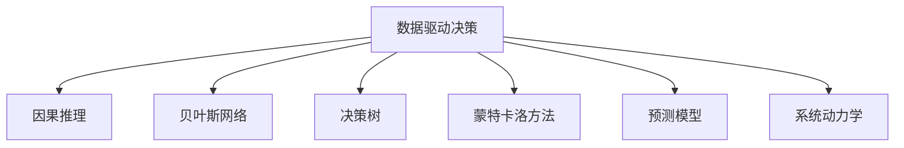
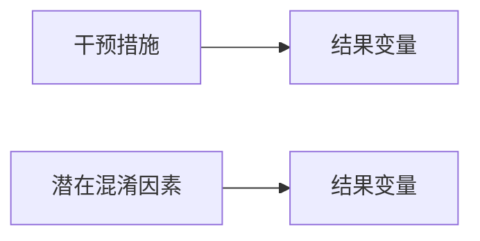

                 

# 提升决策水平的思维工具

## 1. 背景介绍

在复杂多变的世界中，如何做出高质量的决策，是每个领域专业人士的必修课。决策水平的高低，直接关系着个人职业发展、企业竞争力乃至整个社会的进步。为了在决策过程中更加全面、系统、高效，我们不妨借鉴和学习一些科学而实用的思维工具。

### 1.1 问题由来
现代决策过程往往涉及大量数据、多维度考量和复杂的因果关系。传统的经验主义和直觉判断已不足以应对当今日益复杂多变的环境。借助科学方法论和先进技术，我们可以更加客观地分析问题、评估风险、制定策略。本文旨在介绍和分析一些常用的思维工具，帮助读者提升决策能力。

### 1.2 问题核心关键点
本文将聚焦于以下几个核心问题：
1. 哪些工具能够有效提升决策水平？
2. 这些工具的具体原理和方法是什么？
3. 如何应用这些工具解决实际问题？
4. 这些工具在不同领域的应用场景有哪些？

### 1.3 问题研究意义
掌握这些思维工具，对于提升决策能力、优化工作流程、增强团队协作，具有重要意义。它不仅能够帮助我们更好地应对突发事件，还能在企业经营、项目管理、金融投资等领域发挥巨大作用，为组织的持续发展和创新注入新的动力。

## 2. 核心概念与联系

### 2.1 核心概念概述

为更好地理解这些思维工具的工作原理和应用场景，本节将介绍几个密切相关的核心概念：

- 数据驱动决策(Data-Driven Decision Making)：利用数据分析和统计学方法，基于事实和证据进行决策，避免主观偏见。
- 因果推理(Causal Inference)：通过建立因果关系模型，准确判断因素之间的影响方向和程度。
- 贝叶斯网络(Bayesian Network)：一种基于概率图模型的知识表示和推理方法，可用于多因素影响下的决策。
- 决策树(Decision Tree)：通过树状结构描述决策过程，直观展示各种情况下的选择路径和结果。
- 蒙特卡洛方法(Monte Carlo Method)：一种随机模拟方法，用于解决复杂计算和不确定性问题。
- 预测模型(Prediction Model)：如线性回归、逻辑回归、深度学习等，用于预测未来趋势和结果。
- 系统动力学(System Dynamics)：研究系统内部变量相互作用及其随时间变化的动态过程，为决策提供动态视角。

这些核心概念之间的逻辑关系可以通过以下Mermaid流程图来展示：



这个流程图展示了几类思维工具的基本逻辑关系：

1. 数据驱动决策是基础，通过数据分析和统计学方法，建立事实依据。
2. 因果推理和贝叶斯网络，基于概率模型，从数据中挖掘因果关系和概率分布。
3. 决策树和蒙特卡洛方法，通过模型模拟和可视化，展示决策路径和结果。
4. 预测模型，通过建立数学模型，预测未来趋势和结果。
5. 系统动力学，从动态角度分析系统变量相互作用，提供全局视角。

这些概念共同构成了提升决策水平的思维框架，帮助我们在复杂情境下做出更为科学和理性的决策。

## 3. 核心算法原理 & 具体操作步骤

### 3.1 算法原理概述

提升决策水平的思维工具，本质上是基于数学和统计学原理构建的，用以辅助我们进行更加科学合理的决策。

1. **数据驱动决策**：通过收集和分析数据，从中提取有用信息，辅助我们做出决策。主要依赖统计学方法，如描述统计、推断统计等。

2. **因果推理**：利用统计学和机器学习技术，通过控制变量和随机实验，构建因果模型，明确因素之间的影响关系。主要依赖于潜在结果框架(Potential Outcome Framework)和因果图模型(Causal Graph Model)。

3. **贝叶斯网络**：基于概率图模型，通过条件概率和贝叶斯定理，推断变量之间的相互关系。主要依赖于图模型理论。

4. **决策树**：通过树状结构，表示决策过程和结果，直观展示选择路径和结果。主要依赖于信息熵和基尼不纯度等指标。

5. **蒙特卡洛方法**：通过随机模拟，解决复杂计算和不确定性问题，提供多方案的评估和选择。主要依赖于随机数生成和蒙特卡洛积分等技术。

6. **预测模型**：如线性回归、逻辑回归、深度学习等，通过数学模型，预测未来趋势和结果。主要依赖于最小二乘法、梯度下降等优化算法。

7. **系统动力学**：通过模拟和分析系统内部变量随时间的动态变化，揭示系统的动态特性。主要依赖于状态空间、因果反馈环等概念。

### 3.2 算法步骤详解

以**因果推理**为例，介绍其具体操作步骤：

1. **确定研究目标**：明确需要解答的问题，如某项政策的实际效果如何？

2. **构建因果模型**：根据研究目标，选择或设计一个因果图模型，如DAG模型。

3. **收集数据**：根据因果图模型，收集相关数据，如政策实施前后的数据。

4. **估计潜在结果**：利用统计学方法，估计不同政策实施条件下的潜在结果。

5. **进行因果推断**：应用因果推断技术，如匹配、工具变量等，确定因果关系。

6. **解释结果**：结合因果图模型和因果推断结果，解释政策实际效果的来源和影响。

### 3.3 算法优缺点

以**因果推理**为例，分析其优缺点：

**优点**：
1. 提供直接且明确的因果关系，帮助决策者理解政策效果。
2. 可进行跨时间、跨空间的因果推断，提高决策的普适性。
3. 结合多种数据源和分析方法，提升决策的全面性和准确性。

**缺点**：
1. 数据收集和处理复杂，成本较高。
2. 因果推断依赖于模型假设，可能存在偏差。
3. 解释因果关系的复杂度较高，需要专业知识和工具。

### 3.4 算法应用领域

以**因果推理**为例，分析其应用场景：

1. **公共政策评估**：如教育改革政策对学生成绩的影响。

2. **医疗健康**：如某种新药的疗效评估。

3. **金融市场**：如投资策略的效果评估。

4. **社会经济**：如宏观经济政策对就业的影响。

5. **环境科学**：如减排措施对空气质量的影响。

这些领域中的因果推理，能够帮助决策者科学评估政策的实际效果，制定更加精准的行动方案。

## 4. 数学模型和公式 & 详细讲解  
### 4.1 数学模型构建

本节将使用数学语言对因果推理的过程进行更加严格的刻画。

假设因果图模型如下：



定义：
- 干预措施：如某项政策。
- 结果变量：政策实施后的效果。
- 潜在混淆因素：可能影响结果的其他因素。

记：
- $Y$：结果变量。
- $X$：干预措施。
- $Z$：潜在混淆因素。

则因果推理的目标是估计干预措施对结果变量的因果效应：

$$
\mathbb{E}[Y|X=x] - \mathbb{E}[Y|X=0]
$$

其中 $x$ 为干预措施 $X$ 的取值。

### 4.2 公式推导过程

引入潜在结果框架(Potential Outcome Framework)：

$$
Y = Y(0)I_{X=0} + Y(1)I_{X=1}
$$

其中 $I_{X=0}$ 为干预措施取值为0的指示函数。

将上述公式代入因果效应定义，得：

$$
\mathbb{E}[Y|X=x] = \mathbb{E}[Y(0)I_{X=0}|X=x] + \mathbb{E}[Y(1)I_{X=1}|X=x]
$$

$$
\mathbb{E}[Y|X=0] = \mathbb{E}[Y(0)I_{X=0}|X=0]
$$

则因果效应为：

$$
\mathbb{E}[Y|X=x] - \mathbb{E}[Y|X=0] = \mathbb{E}[Y(1)I_{X=1}|X=x] - \mathbb{E}[Y(0)I_{X=0}|X=0]
$$

通过统计学方法，如匹配、工具变量等，可以从数据中估计上述因果效应。

### 4.3 案例分析与讲解

假设某项公共政策旨在提高中小学生的数学成绩，政策实施前后的数据如下：

| 干预措施 $X$ | 结果变量 $Y$ | 潜在混淆因素 $Z$ |
| -------------- | ------------ | ---------------- |
| 0              | 80           | 80               |
| 0              | 85           | 85               |
| 1              | 90           | 90               |
| 1              | 95           | 90               |

进行因果推断的步骤如下：

1. **构建因果图**：如图1所示。


2. **匹配**：通过匹配方法，将控制组和实验组进行配对，得到匹配后样本。

3. **工具变量**：选择某个不受混淆因素影响的变量作为工具变量，如学生的家庭经济状况。

4. **回归**：通过回归模型，估计因果效应。

案例分析结果：该政策提高了学生的数学成绩，因果效应为5分。

## 5. 项目实践：代码实例和详细解释说明
### 5.1 开发环境搭建

为了实现因果推理的代码实践，需要安装Python及其相关库。以下是环境配置步骤：

1. 安装Python：从官网下载并安装最新版本的Python。

2. 安装NumPy、pandas、scikit-learn、statsmodels等库：
```bash
pip install numpy pandas scikit-learn statsmodels
```

3. 安装因果推理库：
```bash
pip install causal-inference
```

### 5.2 源代码详细实现

以下是一个简单的因果推理代码示例，用于估计某项政策的效果。

```python
import pandas as pd
from causal_inference import CausalModel, estimate_causal_effect
import statsmodels.api as sm

# 读入数据
data = pd.read_csv('policy_effect.csv')

# 构建因果图
graph = '''
  A[干预措施] --> B[结果变量]
  C[潜在混淆因素] --> D[结果变量]
'''

# 构建因果模型
causal_model = CausalModel(graph, data)

# 估计因果效应
estimator = estimate_causal_effect(causal_model, 'X', 'Y', 'Z')
estimator.fit()
causal_effect = estimator.causal_effect()

print(f"因果效应为：{causal_effect}")
```

### 5.3 代码解读与分析

**数据读入**：使用pandas库读入数据文件，转换为DataFrame格式。

**因果图定义**：使用CausalModel函数，定义因果图模型。

**因果模型拟合**：使用estimate_causal_effect函数，拟合因果模型，并估计因果效应。

**结果输出**：输出因果效应值。

## 6. 实际应用场景
### 6.1 政策评估

在公共政策领域，因果推理是评估政策效果的必备工具。通过对政策实施前后的数据进行因果推断，决策者可以科学评估政策的效果，避免主观偏见，制定更加精准的后续政策。

### 6.2 医疗健康

在医疗健康领域，因果推理可应用于新药疗效评估、治疗方案选择等。通过建立因果模型，评估不同治疗方案的优劣，提高临床决策的科学性。

### 6.3 金融投资

在金融投资领域，因果推理可用于评估投资策略的效果，通过匹配和回归方法，识别出最优投资组合。

### 6.4 未来应用展望

随着因果推理技术的发展，其在更多领域的应用前景更加广阔。未来，因果推理将与其他数据科学方法进一步融合，提升决策的全面性和准确性。

## 7. 工具和资源推荐
### 7.1 学习资源推荐

为帮助读者系统掌握因果推理的理论基础和实践技巧，这里推荐一些优质的学习资源：

1. 《因果推断基础》一书：由著名统计学家David Spiegelhalter等人所著，全面介绍了因果推断的原理和方法。

2. 《机器学习实战》一书：涵盖多种机器学习技术，包括因果推理，适合实践入门。

3. Coursera《因果推断与统计学习》课程：由剑桥大学开设的高级课程，提供深入的因果推断理论讲解和案例分析。

4. causalinference.org：提供因果推理的教程、资料和软件工具，适合初学者和进阶者使用。

5. arXiv.org：收集和发布因果推断领域的最新研究成果，适合前沿学习。

通过对这些资源的学习实践，相信读者能够系统掌握因果推理的理论基础和实践技巧，进一步提升决策水平。

### 7.2 开发工具推荐

在实现因果推理的代码实践时，需要一些优秀的工具支持。以下是几款常用的工具：

1. Python：开源编程语言，广泛用于数据分析和机器学习。

2. NumPy：Python科学计算库，提供高效的多维数组操作和线性代数运算。

3. pandas：Python数据分析库，支持数据清洗、处理和可视化。

4. statsmodels：Python统计建模库，提供丰富的统计分析和因果推断工具。

5. causal_inference：因果推理库，支持因果图模型和因果效应估计。

6. Jupyter Notebook：交互式编程环境，方便代码调试和可视化展示。

合理利用这些工具，可以显著提升因果推理的开发效率，加快创新迭代的步伐。

### 7.3 相关论文推荐

因果推断技术的发展源于学界的持续研究。以下是几篇奠基性的相关论文，推荐阅读：

1. Pearl, J. (2000). Causality: Models, Reasoning, and Inference. Cambridge University Press.

2. Spiegelhalter, D. J., & Smith, A. F. M. (1994). Bayesian analysis of covariance structure in the analysis of covariance and regression models. Journal of the Royal Statistical Society. Series B (Methodological), 56(2), 299-346.

3. Rubin, D. B. (2005). Causal inference using potential outcomes: Design, modeling, decisions. Journal of the American Statistical Association, 100(469), 322-331.

4. Sjölander, A., & Forssell, H. (2016). Generalized treatment patterns for causal inference: an implementation with the python package dblite. Journal of Statistical Software, 67(1), 1-23.

5. Robins, J. M. (1986). A new approach to causal inference in mortality studies with baseline covariates. Journal of the American Statistical Association, 81(396), 1050-1060.

这些论文代表了大规模因果推断的研究进展，适合深入学习和研究。

## 8. 总结：未来发展趋势与挑战

### 8.1 总结

本文对提升决策水平的思维工具进行了全面系统的介绍。首先阐述了这些工具的理论基础和应用场景，明确了因果推理在现代决策中的重要性。其次，从原理到实践，详细讲解了因果推理的数学模型和操作步骤，给出了代码实现实例。同时，本文还探讨了因果推理在其他领域的应用前景，展示了其广泛的应用价值。

通过本文的系统梳理，可以看到，因果推理是提升决策能力的重要工具，它通过科学方法论和统计学技术，帮助我们更加客观地分析和决策。在未来，因果推理必将成为更多领域的重要决策辅助工具，为社会的进步和发展贡献力量。

### 8.2 未来发展趋势

展望未来，因果推理技术将呈现以下几个发展趋势：

1. 自动化和集成化。随着算法和工具的进步，因果推理将越来越易于实现，自动化和集成化程度将提高。

2. 多模态融合。因果推理将与其他数据科学方法如机器学习、深度学习等进一步融合，提升决策的全面性和准确性。

3. 实时化。因果推理算法将更加高效，实现实时数据的因果推断，满足即时决策的需求。

4. 透明度和可解释性。因果推理算法将提供更透明的决策过程和更易解释的结果，增强决策的可信度和接受度。

5. 跨领域应用。因果推理将进一步扩展到更多领域，如经济学、社会学、心理学等，推动跨学科的创新。

这些趋势凸显了因果推理技术的广阔前景，未来必将在更多领域发挥重要作用。

### 8.3 面临的挑战

尽管因果推理技术已经取得了显著进展，但在向更广泛领域推广的过程中，仍面临诸多挑战：

1. 数据复杂性。因果推理依赖于高质量的数据，如何处理复杂和稀疏的数据，仍然是一个难题。

2. 因果模型构建。建立准确的因果模型需要专业知识，如何设计合适的因果图和模型，需要更多经验积累。

3. 结果解释。因果推断的结果往往包含复杂的因果关系，如何清晰地解释和传达，仍需改进。

4. 模型鲁棒性。因果推断模型面对数据偏差和异常值时，可能产生误导性结果，如何提高模型鲁棒性，仍需进一步研究。

5. 应用场景多样性。因果推理在不同领域的应用复杂度各异，如何针对特定领域设计高效的因果推理方案，仍有挑战。

6. 理论完善。因果推理的统计学基础仍有待完善，如何建立更为坚实的理论基础，仍需更多研究。

正视因果推理面临的这些挑战，积极应对并寻求突破，将是大规模因果推断技术迈向成熟的必由之路。相信随着学界和产业界的共同努力，这些挑战终将一一被克服，因果推理必将在构建科学决策体系中扮演越来越重要的角色。

### 8.4 研究展望

未来，因果推理的研究方向需要重点关注以下几个方面：

1. 因果推断算法的优化。开发更为高效和鲁棒的因果推断算法，如自适应因果推断、半参数因果推断等。

2. 因果推理与其他数据科学方法融合。研究因果推理与机器学习、深度学习、大数据分析等的结合，提升决策的全面性和准确性。

3. 因果推断技术的自动化。通过自动化和集成化，降低因果推断的实施难度，推动因果推断在更多领域的应用。

4. 因果推断的跨学科应用。将因果推断技术应用于经济学、社会学、心理学等领域，推动跨学科的创新研究。

5. 因果推断的透明性和可解释性。提升因果推断结果的透明性和可解释性，增强决策的可靠性和接受度。

6. 因果推断的理论基础。建立更为坚实的因果推断理论基础，推动因果推断方法论的进步。

这些研究方向将为因果推断技术的进一步发展提供新的动力，推动其在更多领域实现应用和突破。面向未来，因果推断技术还需要与其他人工智能技术进行更深入的融合，共同推动自然语言理解和智能交互系统的进步。只有勇于创新、敢于突破，才能不断拓展语言模型的边界，让智能技术更好地造福人类社会。

## 9. 附录：常见问题与解答

**Q1：因果推理是否适用于所有决策场景？**

A: 因果推理主要适用于因果关系明确、数据完备的决策场景，如政策评估、疗效评估等。对于部分非因果场景，如市场预测、情感分析等，因果推理可能不完全适用。

**Q2：因果推理中的潜在混淆因素如何确定？**

A: 潜在混淆因素通常需要领域专家的知识和经验确定。在确定潜在混淆因素时，需要考虑其对结果变量的影响大小，避免遗漏重要因素。

**Q3：如何提高因果推断的鲁棒性？**

A: 提高因果推断的鲁棒性可以从以下几个方面入手：
1. 数据预处理：去除异常值和噪声数据，提高数据质量。
2. 控制变量：尽量控制其他可能影响结果的因素，减少干扰。
3. 多样性验证：通过多样性验证，评估因果推断结果的稳健性。
4. 模型优化：选择鲁棒性更强的因果推断方法，如自适应因果推断、半参数因果推断等。

**Q4：因果推断结果的解释如何更加清晰？**

A: 因果推断结果的解释可以通过以下几种方式进行：
1. 因果图模型：通过可视化因果图，明确变量之间的因果关系。
2. 因果效应估计：通过解释因果效应，说明干预措施对结果变量的具体影响。
3. 数据可视化：通过数据图表，展示因果推断的计算过程和结果。
4. 专家沟通：与领域专家沟通，结合专业知识进行解释。

**Q5：如何应对因果推断的复杂性？**

A: 应对因果推断的复杂性可以从以下几个方面入手：
1. 简化模型：尽量简化因果图模型，减少变量和关系复杂度。
2. 数据简化：通过数据聚合、降维等方法，简化数据处理过程。
3. 技术进步：随着算法和工具的进步，因果推断的复杂性将逐步降低。
4. 跨学科合作：与领域专家合作，结合专业知识进行决策。

通过这些方法的综合应用，可以更好地应对因果推断的复杂性，提升决策的科学性和准确性。

