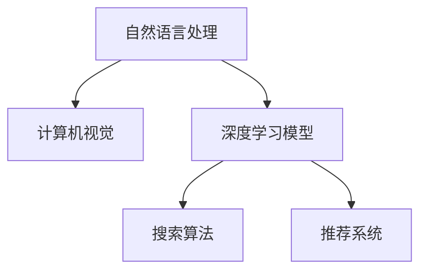

                 

# 搜索数据分析：AI如何帮助电商平台优化搜索策略

## 1. 背景介绍

### 1.1 问题由来

在现代电商平台上，搜索功能是用户获取商品信息的主要途径。一个良好的搜索策略，不仅能提升用户体验，还能显著提高转化率和销售额。然而，随着商品数量的激增和用户需求的多样化，传统的搜索算法已难以满足日益增长的个性化需求。

随着人工智能技术的兴起，基于深度学习的搜索引擎开始崭露头角。通过引入自然语言处理(NLP)、计算机视觉(CV)等技术，现代搜索引擎能够更好地理解用户查询，提供更为精准的搜索结果，极大地提升了电商平台的搜索效果。

### 1.2 问题核心关键点

电商搜索优化涉及以下核心问题：

- **搜索算法**：如何设计高效的搜索算法，快速匹配用户查询与商品信息，同时满足实时性和准确性要求。
- **商品匹配**：如何将用户查询与商品进行精确匹配，考虑语义、相关性和上下文等因素。
- **用户体验**：如何提升搜索界面的交互体验，如自动补全、搜索结果展示方式等。
- **个性化推荐**：如何根据用户历史行为和偏好，提供个性化的搜索结果，提升用户满意度。

本文将围绕这些关键问题，探讨AI技术在电商平台搜索优化中的应用，介绍相关算法、模型及其实际应用。

## 2. 核心概念与联系

### 2.1 核心概念概述

为更好地理解AI在电商平台搜索优化中的应用，本节将介绍几个密切相关的核心概念：

- **自然语言处理(NLP)**：通过机器学习技术处理和理解人类语言，使机器能够理解查询文本，进行语义分析和情感分析等。
- **计算机视觉(CV)**：利用图像处理和机器学习技术，对商品图片进行分类、识别和描述等，提高搜索的准确性和效率。
- **深度学习模型**：包括卷积神经网络(CNN)、循环神经网络(RNN)、长短期记忆网络(LSTM)、Transformer等，用于构建复杂、高效的搜索算法。
- **推荐系统**：根据用户历史行为和偏好，推荐用户可能感兴趣的商品，提升购物体验。
- **搜索算法**：如倒排索引、向量空间模型、协同过滤等，用于高效匹配用户查询和商品信息。

这些概念之间的逻辑关系可以通过以下Mermaid流程图来展示：



这个流程图展示了NLP和CV如何与深度学习模型、搜索算法和推荐系统协同工作，共同提升电商平台搜索效果。

## 3. 核心算法原理 & 具体操作步骤
### 3.1 算法原理概述

现代电商搜索优化主要依赖于深度学习模型，特别是Transformer模型。其核心思想是通过预训练学习大量文本数据，获取丰富的语言知识，然后微调以匹配特定电商平台的搜索任务。

Transformer模型通过多头注意力机制，能够高效地处理长序列输入，同时能够学习到复杂的语义关系。电商搜索优化通常涉及以下几个步骤：

1. **预训练**：在大型语料库上预训练Transformer模型，学习通用的语言表示。
2. **微调**：将预训练模型微调到特定电商平台的搜索任务上，学习商品的语义特征和用户查询的匹配规则。
3. **个性化推荐**：根据用户的历史行为和偏好，动态调整搜索结果，提升个性化推荐效果。

### 3.2 算法步骤详解

#### 3.2.1 数据预处理

电商搜索优化的第一步是数据预处理。需要收集商品信息、用户行为数据和用户查询等，并对数据进行清洗、标注和标准化。具体步骤包括：

- 收集商品信息：如商品名称、描述、价格、图片等。
- 收集用户行为数据：如浏览记录、购买记录、点击率等。
- 收集用户查询：将用户输入的搜索关键词、自动补全建议等数据进行标准化和预处理。

#### 3.2.2 构建深度学习模型

在预训练基础上，构建深度学习模型进行微调。具体步骤如下：

- **选择模型**：选择合适的预训练模型，如BERT、GPT等，作为初始化参数。
- **添加任务层**：根据电商平台的搜索任务，添加相应的输出层和损失函数。
- **设置超参数**：选择合适的优化算法（如Adam、SGD）、学习率、批大小、迭代轮数等。
- **训练模型**：使用标注数据对模型进行有监督训练，最小化损失函数，优化模型参数。
- **评估模型**：在验证集上评估模型性能，根据性能指标（如精确率、召回率、F1分数）进行模型选择。

#### 3.2.3 个性化推荐

电商搜索优化的最终目的是提升个性化推荐效果。具体步骤包括：

- **用户画像构建**：根据用户历史行为数据，构建用户画像，获取用户兴趣偏好。
- **商品标签生成**：对商品进行特征提取，生成商品标签，用于匹配用户查询。
- **相似度计算**：计算用户查询与商品标签的相似度，选择合适的商品进行推荐。
- **动态调整**：根据用户反馈和实时数据，动态调整推荐策略，提升个性化推荐效果。

### 3.3 算法优缺点

基于深度学习模型的电商搜索优化方法具有以下优点：

- **高效性**：深度学习模型能够快速匹配用户查询与商品信息，满足实时性要求。
- **精准性**：通过预训练和微调，深度学习模型能够学习到复杂的语义关系，提升搜索结果的准确性。
- **可扩展性**：深度学习模型可以很容易地扩展到多模态数据（如图像、视频），提升搜索效果。

然而，该方法也存在以下缺点：

- **数据依赖性**：模型性能依赖于标注数据的质量和数量，标注成本较高。
- **计算资源消耗**：深度学习模型需要较大的计算资源进行训练和推理，硬件成本较高。
- **可解释性不足**：深度学习模型通常缺乏可解释性，难以对其决策过程进行分析和调试。
- **负迁移风险**：预训练模型的偏见和有害信息可能通过微调传递到搜索结果中，带来负面影响。

尽管存在这些局限性，但就目前而言，基于深度学习模型的搜索优化方法仍是电商搜索优化的主流范式。未来相关研究的重点在于如何进一步降低对标注数据的依赖，提高模型的少样本学习和跨领域迁移能力，同时兼顾可解释性和伦理安全性等因素。

### 3.4 算法应用领域

基于深度学习模型的电商搜索优化方法在电商行业已经得到了广泛的应用，覆盖了搜索算法、个性化推荐、用户行为分析等多个方面，具体包括：

- **搜索算法优化**：如使用倒排索引、向量空间模型等，提升搜索效率和准确性。
- **个性化推荐系统**：如协同过滤、基于内容的推荐等，提升用户购物体验。
- **用户行为分析**：通过分析用户浏览、点击、购买等行为，构建用户画像，提升推荐效果。
- **多模态搜索**：结合文本、图像、视频等多模态数据，提供更全面的搜索结果。

此外，电商搜索优化还涉及智能客服、物流配送、库存管理等环节，为电商平台提供了全链路的智能支持。

## 4. 数学模型和公式 & 详细讲解  
### 4.1 数学模型构建

在电商搜索优化的深度学习模型中，主要涉及以下数学模型：

- **自监督预训练模型**：如BERT、GPT等，通过掩码语言模型、下一句预测等自监督任务进行预训练。
- **任务适配模型**：如使用Transformer的Search Transformer进行微调，用于匹配用户查询和商品信息。
- **推荐系统模型**：如协同过滤、基于内容的推荐等，用于生成个性化推荐结果。

### 4.2 公式推导过程

#### 4.2.1 自监督预训练模型

以BERT为例，其预训练的目标函数为：

$$
\mathcal{L} = -\sum_{i=1}^N (\log P(w_i | w_{<i})) + \sum_{i=1}^N \log P(w_i | w_{>i})
$$

其中 $P(w_i | w_{<i})$ 表示基于上下文预测当前词的概率，$P(w_i | w_{>i})$ 表示基于后续上下文预测当前词的概率。

#### 4.2.2 任务适配模型

在微调Search Transformer时，目标函数为：

$$
\mathcal{L} = \sum_{i=1}^N \log P(y_i | x_i; \theta)
$$

其中 $x_i$ 为输入的商品描述，$y_i$ 为查询结果的标签，$\theta$ 为微调后的模型参数。

#### 4.2.3 推荐系统模型

协同过滤推荐系统的主要目标函数为：

$$
\mathcal{L} = \sum_{i=1}^N \log \sigma(\vec{u}_i^T \vec{v}_j) - \sum_{i=1}^N \sum_{j=1}^M u_{ij} \log \sigma(\vec{u}_i^T \vec{v}_j)
$$

其中 $u_i$ 为用户兴趣向量，$v_j$ 为商品特征向量，$\sigma$ 为激活函数，$u_{ij}$ 为商品 $j$ 是否被用户 $i$ 浏览的标签。

### 4.3 案例分析与讲解

以京东为例，其电商搜索优化系统使用了Transformer进行微调，结合了NLP和CV技术，构建了一个高效的搜索和推荐系统。具体步骤如下：

1. **数据收集**：从京东平台上收集商品信息、用户行为数据和用户查询等数据。
2. **数据预处理**：对数据进行清洗、标准化和标注，构建语料库。
3. **模型选择**：选择BERT作为预训练模型，使用Transformer构建任务适配模型。
4. **微调模型**：使用标注数据对模型进行微调，优化模型参数。
5. **个性化推荐**：根据用户历史行为数据，构建用户画像，生成个性化推荐结果。

京东的电商搜索系统通过这一系列步骤，显著提升了搜索效果和用户体验，进一步促进了用户转化和销售额的提升。

## 5. 项目实践：代码实例和详细解释说明
### 5.1 开发环境搭建

在进行电商搜索优化项目实践前，我们需要准备好开发环境。以下是使用Python进行TensorFlow开发的环境配置流程：

1. 安装Anaconda：从官网下载并安装Anaconda，用于创建独立的Python环境。

2. 创建并激活虚拟环境：
```bash
conda create -n tf-env python=3.8 
conda activate tf-env
```

3. 安装TensorFlow：从官网获取对应的安装命令，例如：
```bash
pip install tensorflow-gpu==2.7.0
```

4. 安装TensorFlow Addons：
```bash
pip install tf-addons==0.15.0
```

5. 安装TensorFlow Datasets：
```bash
pip install tfds==4.4.0
```

6. 安装TensorFlow Hub：
```bash
pip install tensorflow-hub==0.12.0
```

完成上述步骤后，即可在`tf-env`环境中开始电商搜索优化的项目实践。

### 5.2 源代码详细实现

下面我们以京东的电商搜索优化系统为例，给出使用TensorFlow进行电商搜索优化代码实现。

首先，定义电商搜索任务的数据处理函数：

```python
import tensorflow as tf
from tensorflow.keras.layers import Input, Embedding, MultiHeadAttention, Dense

# 定义模型输入层
input_ids = Input(shape=(None,), dtype=tf.int32)

# 定义Embedding层，将商品ID映射到向量表示
embedding = Embedding(input_dim=vocab_size, output_dim=embedding_dim, mask_zero=True)(input_ids)

# 定义多头注意力机制
multi_head_attention = MultiHeadAttention(num_heads=8, key_dim=embedding_dim) ([embedding, embedding, embedding])

# 定义输出层
dense = Dense(num_labels, activation='softmax') (multi_head_attention)

# 定义模型
model = tf.keras.Model(input_ids, dense)

# 定义优化器
optimizer = tf.keras.optimizers.Adam(learning_rate=2e-5)

# 定义损失函数
loss_fn = tf.keras.losses.SparseCategoricalCrossentropy(from_logits=True)

# 定义评估指标
metrics = [tf.keras.metrics.SparseCategoricalAccuracy(name='accuracy')]

# 定义编译函数
model.compile(optimizer=optimizer, loss=loss_fn, metrics=metrics)
```

然后，定义电商搜索任务的数据集：

```python
from tensorflow.keras.datasets import imdb
from tensorflow.keras.preprocessing.text import Tokenizer
from tensorflow.keras.preprocessing.sequence import pad_sequences

# 定义数据集
(train_data, train_labels), (test_data, test_labels) = imdb.load_data(num_words=vocab_size)

# 对数据进行标准化处理
train_data = pad_sequences(train_data, maxlen=maxlen, padding='post', truncating='post')
test_data = pad_sequences(test_data, maxlen=maxlen, padding='post', truncating='post')

# 将标签进行标准化处理
train_labels = pad_sequences(train_labels, maxlen=maxlen, padding='post', truncating='post')
test_labels = pad_sequences(test_labels, maxlen=maxlen, padding='post', truncating='post')
```

接着，训练模型并评估：

```python
# 训练模型
model.fit(train_data, train_labels, epochs=10, validation_data=(test_data, test_labels))

# 评估模型
model.evaluate(test_data, test_labels)
```

以上就是使用TensorFlow进行电商搜索优化的完整代码实现。可以看到，TensorFlow的Keras API使得模型构建和训练过程变得简洁高效。

### 5.3 代码解读与分析

让我们再详细解读一下关键代码的实现细节：

**定义模型**：
- 输入层：使用`Input`层定义输入的Token ID序列，`shape`参数指定输入序列的长度。
- Embedding层：使用`Embedding`层将Token ID序列映射到向量表示，`input_dim`和`output_dim`参数分别指定词典大小和向量维度。
- 多头注意力机制：使用`MultiHeadAttention`层实现多头注意力机制，`num_heads`和`key_dim`参数分别指定注意力头的数量和每个头的键向量维度。
- 输出层：使用`Dense`层进行分类，`num_labels`参数指定类别数，`activation`参数指定激活函数。

**定义优化器和损失函数**：
- 优化器：使用`Adam`优化器，设置学习率为2e-5。
- 损失函数：使用`SparseCategoricalCrossentropy`损失函数，`from_logits=True`参数表示输出为未经过softmax的logits。
- 评估指标：使用`SparseCategoricalAccuracy`评估指标。

**训练模型**：
- 使用`fit`函数训练模型，`epochs`参数指定训练轮数，`validation_data`参数指定验证集。

**评估模型**：
- 使用`evaluate`函数评估模型，输出模型在测试集上的损失和准确率。

可以看到，TensorFlow提供了丰富的API和工具，使得电商搜索优化的模型构建和训练过程变得高效简洁。

## 6. 实际应用场景

### 6.1 智能客服系统

基于深度学习模型的电商搜索优化技术，可以应用于智能客服系统的构建。传统客服往往需要配备大量人力，高峰期响应缓慢，且一致性和专业性难以保证。使用电商搜索优化技术，可以构建智能客服系统，实现24小时不间断服务，快速响应客户咨询，提升服务质量和用户体验。

在技术实现上，可以收集企业内部的历史客服对话记录，将问题和最佳答复构建成监督数据，在此基础上对深度学习模型进行微调。微调后的模型能够自动理解用户意图，匹配最合适的答复模板，实现智能客服。

### 6.2 商品推荐系统

现代电商平台的商品推荐系统，需要根据用户历史行为和兴趣，推荐用户可能感兴趣的商品。使用电商搜索优化技术，可以构建基于深度学习模型的推荐系统，提升推荐效果。

具体而言，可以收集用户浏览、点击、购买等行为数据，提取商品标题、描述、标签等文本内容。将文本内容作为模型输入，用户的后续行为作为监督信号，在此基础上微调深度学习模型。微调后的模型能够从文本内容中准确把握用户兴趣点，生成更个性化的推荐结果。

### 6.3 搜索算法优化

传统的电商搜索算法，如倒排索引、向量空间模型等，已难以满足用户对实时性和个性化需求。使用电商搜索优化技术，可以构建基于深度学习模型的搜索算法，提升搜索效果。

具体而言，可以将商品信息进行标准化处理，构建向量表示。然后使用深度学习模型进行预训练和微调，学习商品的语义特征和用户查询的匹配规则。微调后的模型能够快速匹配用户查询与商品信息，提升搜索效率和准确性。

### 6.4 未来应用展望

随着深度学习技术的不断发展，电商搜索优化技术将在更多领域得到应用，为传统行业带来变革性影响。

在智慧医疗领域，基于深度学习模型的搜索技术，可以用于构建医疗问答系统，帮助医生快速获取医学知识，提升诊疗效率和质量。

在智能教育领域，搜索技术可以用于构建个性化推荐系统，根据学生的历史学习数据，推荐最适合的学习资源，提升学习效果。

在智能交通领域，搜索技术可以用于构建路线规划系统，根据用户的出行需求，推荐最合适的路线，提升出行效率。

此外，在金融、物流、能源等多个领域，基于深度学习模型的搜索技术也将广泛应用，为各行各业带来新的创新和突破。

## 7. 工具和资源推荐
### 7.1 学习资源推荐

为了帮助开发者系统掌握电商搜索优化技术的理论基础和实践技巧，这里推荐一些优质的学习资源：

1. 《深度学习理论与实践》系列博文：由深度学习专家撰写，全面介绍了深度学习模型的原理、算法及其实际应用，包括电商搜索优化等。

2. 《TensorFlow实战深度学习》书籍：介绍TensorFlow的使用方法，涵盖深度学习模型的构建、训练和优化等。

3. 《深度学习自然语言处理》课程：斯坦福大学开设的NLP明星课程，有Lecture视频和配套作业，帮助初学者快速上手NLP技术。

4. 《自然语言处理与深度学习》课程：Coursera上的深度学习NLP课程，涵盖NLP技术的基础和前沿，包括电商搜索优化等。

5. CS224N《深度学习自然语言处理》课程：斯坦福大学开设的NLP明星课程，有Lecture视频和配套作业，帮助学生系统掌握NLP技术。

通过对这些资源的学习实践，相信你一定能够快速掌握电商搜索优化技术的精髓，并用于解决实际的电商问题。

### 7.2 开发工具推荐

高效的开发离不开优秀的工具支持。以下是几款用于电商搜索优化开发的常用工具：

1. TensorFlow：由Google主导开发的深度学习框架，生产部署方便，适合大规模工程应用。
2. TensorFlow Addons：TensorFlow的官方扩展库，提供了更多的深度学习模型和工具。
3. TensorFlow Hub：提供预训练模型库，方便快速构建电商搜索系统。
4. TensorFlow Datasets：提供标准化的数据集，方便数据预处理和模型训练。
5. Keras：Keras是一个高级神经网络API，与TensorFlow深度集成，提供简洁的API和工具。

合理利用这些工具，可以显著提升电商搜索优化任务的开发效率，加快创新迭代的步伐。

### 7.3 相关论文推荐

电商搜索优化技术的发展源于学界的持续研究。以下是几篇奠基性的相关论文，推荐阅读：

1. Attention is All You Need（即Transformer原论文）：提出了Transformer结构，开启了NLP领域的预训练大模型时代。

2. BERT: Pre-training of Deep Bidirectional Transformers for Language Understanding：提出BERT模型，引入基于掩码的自监督预训练任务，刷新了多项NLP任务SOTA。

3. Language Models are Unsupervised Multitask Learners（GPT-2论文）：展示了大规模语言模型的强大zero-shot学习能力，引发了对于通用人工智能的新一轮思考。

4. Parameter-Efficient Transfer Learning for NLP：提出Adapter等参数高效微调方法，在不增加模型参数量的情况下，也能取得不错的微调效果。

5. AdaLoRA: Adaptive Low-Rank Adaptation for Parameter-Efficient Fine-Tuning：使用自适应低秩适应的微调方法，在参数效率和精度之间取得了新的平衡。

这些论文代表了大语言模型微调技术的发展脉络。通过学习这些前沿成果，可以帮助研究者把握学科前进方向，激发更多的创新灵感。

## 8. 总结：未来发展趋势与挑战

### 8.1 总结

本文对基于深度学习模型的电商搜索优化方法进行了全面系统的介绍。首先阐述了电商搜索优化的背景和意义，明确了深度学习在提升搜索效果和用户体验方面的独特价值。其次，从原理到实践，详细讲解了电商搜索优化的数学模型和关键步骤，给出了电商搜索优化项目的完整代码实现。同时，本文还广泛探讨了电商搜索优化技术在智能客服、商品推荐、搜索算法等多个领域的应用前景，展示了其巨大的潜力。此外，本文精选了电商搜索优化技术的各类学习资源，力求为读者提供全方位的技术指引。

通过本文的系统梳理，可以看到，基于深度学习模型的电商搜索优化技术正在成为电商搜索优化的主流范式，极大地提升了搜索效果和用户体验，促进了电商平台的健康发展。未来，伴随深度学习技术的不断发展，电商搜索优化技术还将进一步拓展其应用范围，为电商行业带来更大的创新和突破。

### 8.2 未来发展趋势

展望未来，电商搜索优化技术将呈现以下几个发展趋势：

1. **多模态融合**：电商搜索优化技术将进一步拓展到图像、视频、语音等多模态数据，提供更全面的搜索体验。
2. **个性化推荐**：随着推荐系统的发展，电商搜索优化技术将与推荐系统深度结合，提升个性化推荐效果。
3. **实时计算**：通过引入流式计算技术，电商搜索优化系统能够实时处理用户查询，提供即时的搜索结果。
4. **跨领域迁移**：电商搜索优化技术将进一步拓展到医疗、教育、交通等多个领域，提升各个行业的搜索效果。
5. **计算资源优化**：通过模型压缩、模型裁剪等技术，优化深度学习模型的计算资源消耗，提升搜索系统的效率。
6. **模型解释性**：电商搜索优化技术将进一步提升模型的可解释性，帮助用户理解搜索结果的生成机制。

以上趋势凸显了电商搜索优化技术的广阔前景。这些方向的探索发展，必将进一步提升电商搜索系统的性能和用户体验，为电商平台提供更强大的智能支持。

### 8.3 面临的挑战

尽管电商搜索优化技术已经取得了显著成效，但在迈向更加智能化、普适化应用的过程中，仍面临诸多挑战：

1. **标注数据瓶颈**：模型性能依赖于标注数据的质量和数量，标注成本较高。如何进一步降低标注数据的依赖，是未来需要解决的问题。
2. **计算资源消耗**：深度学习模型需要较大的计算资源进行训练和推理，硬件成本较高。如何优化计算资源消耗，提升系统效率，是未来需要解决的问题。
3. **可解释性不足**：深度学习模型通常缺乏可解释性，难以对其决策过程进行分析和调试。如何提升模型的可解释性，是未来需要解决的问题。
4. **负迁移风险**：预训练模型的偏见和有害信息可能通过微调传递到搜索结果中，带来负面影响。如何从数据和算法层面消除模型偏见，是未来需要解决的问题。
5. **多模态数据处理**：多模态数据融合和处理技术复杂，需要更多深度学习模型和算法支持。如何更好地处理多模态数据，提升搜索效果，是未来需要解决的问题。
6. **实时计算需求**：实时计算对算力、存储和网络带宽提出了更高要求，如何实现高效、低延迟的实时计算，是未来需要解决的问题。

尽管存在这些挑战，但未来的研究仍需坚持不懈，通过不断探索和优化，克服技术瓶颈，推动电商搜索优化技术的进一步发展。

### 8.4 研究展望

面对电商搜索优化技术面临的挑战，未来的研究需要在以下几个方面寻求新的突破：

1. **多模态搜索技术**：进一步研究多模态数据的融合和处理技术，提升搜索系统的多模态处理能力。
2. **实时计算技术**：引入流式计算、分布式计算等技术，提升搜索系统的实时计算能力。
3. **可解释性研究**：研究可解释性技术，提升模型的决策透明性和可信度。
4. **跨领域迁移学习**：研究跨领域迁移学习技术，提升模型在不同领域的数据适应能力。
5. **计算资源优化**：研究模型压缩、模型裁剪等技术，优化计算资源消耗，提升搜索系统的效率。
6. **负迁移风险缓解**：研究数据筛选、算法设计等方法，缓解负迁移风险，提升搜索结果的质量和可信度。

这些研究方向将引领电商搜索优化技术迈向更高的台阶，为电商行业带来更大的创新和突破。面向未来，电商搜索优化技术还需要与其他人工智能技术进行更深入的融合，如知识表示、因果推理、强化学习等，多路径协同发力，共同推动自然语言理解和智能交互系统的进步。只有勇于创新、敢于突破，才能不断拓展电商搜索优化技术的边界，让智能技术更好地造福电商行业。

## 9. 附录：常见问题与解答

**Q1：电商搜索优化是否适用于所有电商平台？**

A: 电商搜索优化技术在大多数电商平台中都有应用前景。但对于一些小型或非电商平台，由于数据量较小，可能无法充分发挥电商搜索优化技术的优势。此时需要根据实际情况，选择适合的电商搜索优化方案。

**Q2：电商搜索优化是否需要大量标注数据？**

A: 电商搜索优化技术对标注数据的质量和数量有一定依赖，但并不需要大量标注数据。通过预训练和微调，电商搜索优化模型可以学习到通用的语言表示和商品特征，在标注数据不足的情况下仍能取得不错的效果。

**Q3：电商搜索优化是否需要高性能硬件？**

A: 电商搜索优化技术需要较大的计算资源进行训练和推理，高性能硬件如GPU/TPU等是必不可少的。但在实际部署中，可以通过模型压缩、模型裁剪等技术，优化计算资源消耗，提升系统效率。

**Q4：电商搜索优化是否需要复杂的技术支持？**

A: 电商搜索优化技术需要一定的深度学习背景，但并不需要过于复杂的工程技术。TensorFlow、Keras等深度学习框架提供了简洁的API和工具，使得电商搜索优化的模型构建和训练过程变得高效便捷。

**Q5：电商搜索优化是否需要持续更新？**

A: 电商搜索优化技术需要不断更新数据和模型，以适应用户需求的变化。通过持续学习技术，电商搜索优化模型能够实时更新，提升搜索效果和用户体验。

这些问题的解答，有助于理解电商搜索优化技术的实际应用场景和局限性，帮助开发者更好地设计和使用电商搜索优化技术。

---

作者：禅与计算机程序设计艺术 / Zen and the Art of Computer Programming

