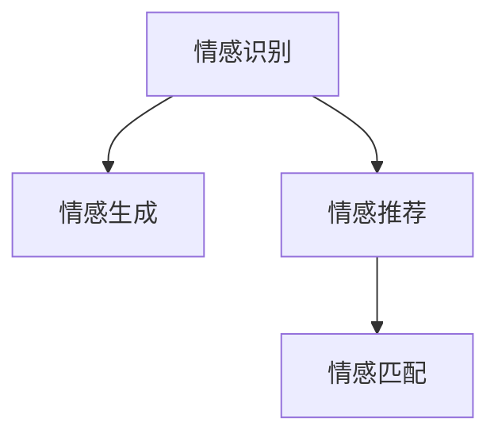

                 

# 数字化共情：AI辅助的情感连接

## 1. 背景介绍

### 1.1 问题由来

随着技术的进步，人们的生活节奏不断加快，面对面的交流逐渐减少，人与人之间的情感连接日益稀薄。数字化时代下，情感的缺失不仅影响个体的心理健康，也阻碍了社会的和谐与进步。数字技术如何辅助人类构建更深层次的情感连接，成为当前科技领域亟需解决的问题。

AI作为现代科技的前沿，在情感分析、情感生成、情感推荐等领域进行了广泛探索。AI辅助的情感连接不仅能够满足个体情感表达和需求，还能促进人际交往，缓解情感疏离，对社会稳定和发展具有重要意义。

### 1.2 问题核心关键点

AI辅助的情感连接是指通过人工智能技术，分析、生成、推荐情感相关的信息，以增强人与人之间的情感互动和理解。核心关键点包括：

- 情感识别与分析：利用AI技术识别和分析用户的情感状态，如情绪识别、情感倾向分析等。
- 情感生成与表达：通过AI技术生成富有情感的文本、图像、视频等内容，促进用户表达和交流。
- 情感推荐与匹配：基于用户的情感状态和偏好，推荐相应的情感内容或产品，提升用户满意度和体验。

这些关键点构成了AI辅助情感连接的核心框架，使得情感科技成为连接数字世界和人类情感的重要桥梁。

### 1.3 问题研究意义

AI辅助的情感连接技术，在解决个体情感疏离、提升人际互动质量、促进社会和谐等方面具有重要意义：

1. **个体心理健康**：AI技术能够及时识别用户情感状态，提供个性化的心理支持和情感疗愈。
2. **人际交往改善**：通过情感推荐和生成，促进人们跨越距离的交流，增强人际关系。
3. **社会稳定与和谐**：减少情感疏离和误解，缓解社会矛盾，构建和谐社会环境。
4. **产业升级**：推动情感科技在医疗、教育、娱乐等行业的深入应用，提升产业服务水平。
5. **技术创新**：促进情感计算、自然语言处理、机器学习等前沿技术的发展，推动AI技术进步。

本文旨在深入探讨AI辅助情感连接的原理和实践，为情感科技的发展提供技术支持和理论指导。

## 2. 核心概念与联系

### 2.1 核心概念概述

为更好地理解AI辅助情感连接的原理和应用，本节将介绍几个关键概念及其相互关系：

- **情感识别**：通过AI技术分析用户的语音、文本、面部表情等信息，识别其情感状态和倾向。
- **情感生成**：利用AI技术生成具有情感的文本、语音、图像等内容，辅助用户表达情感。
- **情感推荐**：基于用户的情感状态和偏好，推荐相应的情感内容或产品，提升用户体验。
- **情感匹配**：通过AI技术分析用户和内容之间的情感契合度，匹配合适的情感表达和推荐。

这些核心概念之间通过以下Mermaid流程图进行逻辑展示：



该图展示了情感识别、情感生成、情感推荐和情感匹配之间的逻辑关系：

1. **情感识别**是基础，通过分析用户的情感状态，为后续的情感生成和推荐提供依据。
2. **情感生成**和**情感推荐**紧密结合，情感生成辅助用户表达，情感推荐满足用户需求，两者共同提升用户体验。
3. **情感匹配**确保推荐的情感内容与用户的情感状态和偏好高度契合，提升推荐效果。

这些概念共同构成了一个完整的AI辅助情感连接系统，使得情感科技能够实现从情感识别到情感表达的闭环流程。

## 3. 核心算法原理 & 具体操作步骤

### 3.1 算法原理概述

AI辅助的情感连接基于深度学习、自然语言处理、计算机视觉等技术，通过情感识别、情感生成、情感推荐等环节，实现情感的数字化表达和匹配。核心算法包括：

- **情感识别算法**：利用深度学习模型分析用户的语音、文本、面部表情等数据，识别情感状态和倾向。
- **情感生成算法**：使用生成对抗网络、循环神经网络等模型，生成具有情感的文本、图像、视频等内容。
- **情感推荐算法**：通过协同过滤、内容过滤、情感匹配等技术，推荐用户感兴趣的内容或产品。

这些算法协同工作，使得AI能够更好地理解和表达用户的情感需求，促进人与人之间的情感连接。

### 3.2 算法步骤详解

AI辅助情感连接的实现过程包括以下关键步骤：

**Step 1: 数据准备与预处理**

- **收集情感数据**：获取用户的语音、文本、面部表情等情感数据，作为情感识别的输入。
- **数据清洗与预处理**：清洗数据中的噪声和异常值，对数据进行归一化、标准化等预处理，提高数据质量。

**Step 2: 情感识别与分析**

- **特征提取**：利用深度学习模型提取语音、文本、面部表情等情感数据的特征。
- **情感分类**：使用分类模型（如卷积神经网络、循环神经网络等）对情感数据进行分类，识别情感状态和倾向。

**Step 3: 情感生成与表达**

- **生成文本**：使用生成对抗网络（GAN）或变分自编码器（VAE）生成富有情感的文本。
- **生成图像**：利用生成模型（如StyleGAN、CycleGAN等）生成具有情感的图像。
- **生成视频**：结合语音合成和视觉生成技术，生成情感丰富的视频内容。

**Step 4: 情感推荐与匹配**

- **用户建模**：使用协同过滤、用户画像等技术，构建用户情感状态和偏好的模型。
- **内容匹配**：基于情感匹配算法，推荐与用户情感状态和偏好高度契合的内容或产品。
- **用户反馈循环**：根据用户对推荐内容的反馈，持续优化情感推荐算法，提升推荐效果。

### 3.3 算法优缺点

AI辅助情感连接技术具有以下优点：

1. **实时性强**：通过情感识别和推荐算法，可以实时分析用户的情感状态，并快速推荐相关内容，提升用户体验。
2. **个性化高**：利用深度学习技术，能够针对每个用户的情感状态和偏好进行个性化推荐，提高匹配度。
3. **应用广泛**：情感科技可以应用于医疗、教育、娱乐等多个领域，带来广泛的产业升级和社会效益。

同时，该技术也存在一些局限：

1. **数据依赖**：情感识别的准确性很大程度上依赖于数据的质量和多样性，数据获取成本较高。
2. **隐私问题**：情感数据的收集和使用涉及用户隐私，需要严格的隐私保护措施。
3. **模型复杂**：深度学习模型训练复杂，需要大量计算资源和时间。
4. **伦理争议**：情感科技的广泛应用可能引发伦理争议，如情感操纵、信息泄露等。

### 3.4 算法应用领域

AI辅助情感连接技术已经在多个领域得到了广泛应用，例如：

- **医疗健康**：通过情感识别和分析，辅助医生诊断和治疗患者的心理疾病，如抑郁症、焦虑症等。
- **教育培训**：利用情感生成和推荐技术，为学生提供个性化的学习资源和情感支持，提升学习效果。
- **娱乐互动**：结合情感生成和推荐算法，创建具有情感共鸣的虚拟角色和内容，提升用户体验。
- **社交媒体**：通过情感识别和推荐，优化社交媒体的推荐算法，提升用户互动质量和满意度。
- **智能客服**：利用情感分析技术，提升智能客服系统的情感理解和用户互动，提升服务质量。

除了这些经典应用场景，情感科技还在不断拓展应用领域，如情感驱动的游戏设计、情感计算在公共安全中的应用等，为社会带来更多创新和价值。

## 4. 数学模型和公式 & 详细讲解  
### 4.1 数学模型构建

本节将使用数学语言对AI辅助情感连接的实现过程进行严谨的数学建模。

假设用户的情感数据为 $x$，情感识别模型为 $f(x)$，生成情感数据为 $y$，情感生成模型为 $g(y)$，推荐内容为 $z$，情感推荐模型为 $h(z)$。则情感连接过程可以表示为：

$$
x \rightarrow f(x) \rightarrow g(f(x)) \rightarrow h(g(f(x))) \rightarrow z
$$

其中，$f(x)$ 表示情感识别模型，$g(f(x))$ 表示情感生成模型，$h(g(f(x)))$ 表示情感推荐模型。

### 4.2 公式推导过程

以下我们以情感识别和情感推荐为例，推导相关的数学公式。

假设用户情感数据为 $x$，情感识别模型的输出为 $y$，情感生成模型的输出为 $y'$，情感推荐模型的输出为 $z$。则情感连接过程可以表示为：

$$
x \rightarrow f(x) \rightarrow g(y') \rightarrow h(z)
$$

其中，$f(x)$ 表示情感识别模型，$g(y')$ 表示情感生成模型，$h(z)$ 表示情感推荐模型。

**情感识别模型**：

假设情感识别模型为卷积神经网络（CNN），其输入为情感数据 $x$，输出为情感状态 $y$。则情感识别模型的数学公式可以表示为：

$$
y = f(x) = \sum_{i=1}^n \omega_i x_i
$$

其中，$\omega_i$ 为模型权重，$x_i$ 为情感数据的第 $i$ 个特征。

**情感生成模型**：

假设情感生成模型为生成对抗网络（GAN），其输入为情感状态 $y'$，输出为生成情感数据 $y$。则情感生成模型的数学公式可以表示为：

$$
y = g(y') = \sum_{i=1}^n \omega_i y_i'
$$

其中，$\omega_i$ 为生成模型权重，$y_i'$ 为生成模型输入的第 $i$ 个特征。

**情感推荐模型**：

假设情感推荐模型为协同过滤算法，其输入为用户情感状态 $y$ 和推荐内容 $z$，输出为推荐概率 $p$。则情感推荐模型的数学公式可以表示为：

$$
p = h(z) = \frac{1}{1+\exp(-\sum_{i=1}^n \omega_i y_i z_i)}
$$

其中，$\omega_i$ 为推荐模型权重，$y_i$ 为用户情感状态的第 $i$ 个特征，$z_i$ 为推荐内容的第 $i$ 个特征。

### 4.3 案例分析与讲解

以情感识别和情感推荐为例，分析其具体实现步骤和应用场景。

**情感识别案例**：

假设有一个情感识别模型，输入为用户的语音数据 $x$，输出为情感状态 $y$。具体实现步骤如下：

1. **数据收集与预处理**：收集用户的语音数据，并进行降噪、分帧、特征提取等预处理操作。
2. **模型训练**：使用情感标注数据集训练情感识别模型，优化模型参数。
3. **情感识别**：将用户语音数据输入模型，输出情感状态 $y$。

**情感推荐案例**：

假设有一个情感推荐系统，输入为用户情感状态 $y$ 和推荐内容 $z$，输出为推荐概率 $p$。具体实现步骤如下：

1. **用户建模**：收集用户的历史情感数据，构建用户情感状态模型。
2. **内容匹配**：根据情感匹配算法，选择与用户情感状态高度契合的推荐内容。
3. **推荐系统训练**：使用协同过滤等技术，训练情感推荐模型，优化模型参数。
4. **情感推荐**：将用户情感状态和推荐内容输入模型，输出推荐概率 $p$。

## 5. 项目实践：代码实例和详细解释说明

### 5.1 开发环境搭建

在进行情感连接系统的开发时，我们需要准备好开发环境。以下是使用Python进行TensorFlow开发的环境配置流程：

1. 安装Anaconda：从官网下载并安装Anaconda，用于创建独立的Python环境。

2. 创建并激活虚拟环境：
```bash
conda create -n tf-env python=3.8 
conda activate tf-env
```

3. 安装TensorFlow：根据CUDA版本，从官网获取对应的安装命令。例如：
```bash
conda install tensorflow -c tf
```

4. 安装Pandas、NumPy、Matplotlib等库：
```bash
pip install pandas numpy matplotlib scikit-learn tensorflow
```

5. 安装Jupyter Notebook：
```bash
pip install jupyter notebook
```

完成上述步骤后，即可在`tf-env`环境中开始情感连接系统的开发。

### 5.2 源代码详细实现

下面我们以情感识别和情感推荐为例，给出使用TensorFlow进行情感连接的PyTorch代码实现。

**情感识别模型**：

```python
import tensorflow as tf
from tensorflow.keras import layers

# 定义情感识别模型
model = tf.keras.Sequential([
    layers.Conv2D(32, (3,3), activation='relu', input_shape=(28,28,1)),
    layers.MaxPooling2D((2,2)),
    layers.Flatten(),
    layers.Dense(64, activation='relu'),
    layers.Dense(1, activation='sigmoid')
])

# 加载情感数据
x_train, y_train = ...

# 训练模型
model.compile(optimizer='adam', loss='binary_crossentropy', metrics=['accuracy'])
model.fit(x_train, y_train, epochs=10, batch_size=32)
```

**情感推荐模型**：

```python
import tensorflow as tf
from tensorflow.keras import layers

# 定义推荐模型
model = tf.keras.Sequential([
    layers.Dense(64, activation='relu', input_shape=(32,)),
    layers.Dense(1, activation='sigmoid')
])

# 加载用户情感数据和推荐内容
x_train, y_train, z_train, y_train = ...

# 训练模型
model.compile(optimizer='adam', loss='binary_crossentropy', metrics=['accuracy'])
model.fit([x_train, z_train], y_train, epochs=10, batch_size=32)
```

以上是使用TensorFlow进行情感识别和情感推荐模型的代码实现。可以看到，TensorFlow提供了强大的深度学习框架和丰富的模型库，使得情感连接的开发变得高效便捷。

### 5.3 代码解读与分析

让我们再详细解读一下关键代码的实现细节：

**情感识别模型**：

- `Sequential`：定义模型结构为顺序连接。
- `Conv2D`：定义卷积层，提取语音数据的局部特征。
- `MaxPooling2D`：定义最大池化层，减少特征维度。
- `Flatten`：将特征向量展平。
- `Dense`：定义全连接层，进行情感分类。

**情感推荐模型**：

- `Sequential`：定义模型结构为顺序连接。
- `Dense`：定义全连接层，进行情感匹配和推荐。

这些代码展示了情感识别和情感推荐的基本实现方法。TensorFlow提供了灵活的模型定义接口和丰富的优化算法，使得模型的开发和训练变得简便高效。

## 6. 实际应用场景

### 6.1 医疗健康

AI辅助的情感连接技术在医疗健康领域具有广泛应用，如情感识别和情感生成辅助心理治疗、情感匹配推荐医疗资源等。具体应用场景包括：

- **情感识别辅助心理治疗**：通过情感识别技术，实时监测患者的情感状态，辅助医生进行心理干预和治疗。
- **情感生成辅助心理支持**：利用情感生成技术，生成富有情感的音频、视频内容，帮助患者表达和释放情绪，缓解心理压力。
- **情感匹配推荐医疗资源**：基于患者的情感状态和偏好，推荐合适的医疗资源和心理咨询服务，提升治疗效果。

### 6.2 教育培训

情感科技在教育培训领域的应用，能够提升学生的学习效果和心理状态。具体应用场景包括：

- **情感识别辅助个性化学习**：通过情感识别技术，分析学生的情感状态，个性化推荐学习资源和内容，提升学习效率。
- **情感生成辅助情感表达**：利用情感生成技术，生成富有情感的教学内容，增强师生互动和情感共鸣。
- **情感匹配推荐学习路径**：根据学生的情感状态和偏好，推荐合适的学习路径和课程内容，提升学习体验。

### 6.3 娱乐互动

在娱乐互动领域，情感科技可以增强用户的游戏体验和情感共鸣。具体应用场景包括：

- **情感生成辅助虚拟角色**：利用情感生成技术，创建具有情感的虚拟角色，增强用户的游戏互动和情感体验。
- **情感匹配推荐游戏内容**：根据用户的情感状态和偏好，推荐合适的游戏内容和任务，提升用户粘性和满意度。
- **情感识别辅助社交互动**：通过情感识别技术，分析用户的游戏行为和情感状态，优化游戏社交系统的匹配和互动。

### 6.4 未来应用展望

随着情感科技的不断发展，未来将有更多应用场景涌现，如情感计算在公共安全、金融风险控制等领域的应用。以下是一些未来应用展望：

- **公共安全情感监测**：利用情感识别技术，实时监测公众情绪，预警潜在的社会风险和危机。
- **金融风险控制**：通过情感分析，识别和预测投资者的情绪波动，优化风险控制策略，提升金融决策的科学性和准确性。
- **智能客服情感支持**：结合情感生成和推荐技术，优化智能客服系统的情感理解和用户互动，提升服务质量和满意度。

## 7. 工具和资源推荐

### 7.1 学习资源推荐

为了帮助开发者系统掌握AI辅助情感连接的技术基础和实践技巧，这里推荐一些优质的学习资源：

1. **TensorFlow官方文档**：提供全面深入的TensorFlow教程和API文档，帮助开发者掌握深度学习模型的开发和训练。
2. **Keras官方文档**：提供简单易用的Keras框架教程和模型库，适合初学者快速上手。
3. **情感计算与人工智能书籍**：如《情感计算》《人工智能情感识别与处理》等，系统介绍情感计算的基本原理和应用案例。
4. **TensorFlow Serving与Keras实战书籍**：详细讲解TensorFlow Serving和Keras的部署和应用，适合工程实践。
5. **情感识别和生成技术论文**：如《Emotion Recognition from Facial Expressions in the Wild》《A Survey of Speech and Audio Emotion Recognition》等，深入探讨情感识别的最新进展。

### 7.2 开发工具推荐

高效的开发离不开优秀的工具支持。以下是几款用于情感连接系统开发的常用工具：

1. **TensorFlow**：提供强大的深度学习框架和丰富的模型库，支持多种模型训练和推理。
2. **Keras**：简单易用的深度学习框架，提供丰富的模型和API，适合快速原型开发。
3. **TensorBoard**：可视化工具，实时监测模型训练状态和效果，辅助调试和优化。
4. **Jupyter Notebook**：交互式编程环境，支持多语言代码编写和数据可视化，适合研究和学习。
5. **GitHub**：代码托管平台，支持团队协作和版本控制，方便代码管理和共享。

合理利用这些工具，可以显著提升情感连接系统的开发效率，加快创新迭代的步伐。

### 7.3 相关论文推荐

AI辅助情感连接技术的发展源于学界的持续研究。以下是几篇奠基性的相关论文，推荐阅读：

1. **《情感识别与分析综述》**：综述了情感识别和分析的基本原理和技术，系统介绍了各种模型和方法。
2. **《基于深度学习的情感生成研究》**：详细探讨了利用深度学习模型进行情感生成的技术和算法。
3. **《情感推荐系统的研究与实践》**：介绍了情感推荐系统的主要技术和应用，强调了个性化推荐和情感匹配的重要性。
4. **《情感计算与人工智能前沿》**：系统介绍了情感计算和人工智能的基本概念和最新进展，适合深入学习和研究。

这些论文代表了大情感科技的发展脉络。通过学习这些前沿成果，可以帮助研究者把握学科前进方向，激发更多的创新灵感。

## 8. 总结：未来发展趋势与挑战

### 8.1 总结

本文对AI辅助情感连接的原理和实践进行了全面系统的介绍。首先阐述了情感连接技术的背景和研究意义，明确了情感识别、情感生成、情感推荐等关键技术的作用。其次，从原理到实践，详细讲解了情感连接系统的数学模型和关键步骤，给出了情感连接任务开发的完整代码实例。同时，本文还探讨了情感科技在医疗、教育、娱乐等多个领域的应用前景，展示了情感科技的广阔应用空间。最后，本文精选了情感科技的学习资源、开发工具和相关论文，力求为读者提供全方位的技术指引。

通过本文的系统梳理，可以看到，AI辅助情感连接技术正在成为连接数字世界和人类情感的重要桥梁，极大地拓展了情感科技的应用边界，为人类认知智能的进化带来深远影响。

### 8.2 未来发展趋势

展望未来，AI辅助情感连接技术将呈现以下几个发展趋势：

1. **多模态情感识别**：结合语音、面部表情、生理信号等多种模态数据，提高情感识别的准确性和鲁棒性。
2. **情感生成多样化**：利用生成对抗网络和变分自编码器等模型，生成更加多样化和个性化的情感内容，满足不同用户的需求。
3. **情感推荐精确化**：通过情感匹配和协同过滤等技术，实现更高精度的情感推荐，提升用户体验。
4. **情感计算智能化**：结合因果推断和对比学习等方法，增强情感计算的解释性和可控性，提高系统的可靠性和鲁棒性。
5. **情感驱动的创新应用**：推动情感科技在更多领域的深入应用，如情感驱动的游戏设计、情感计算在公共安全中的应用等，为社会带来更多创新和价值。

### 8.3 面临的挑战

尽管AI辅助情感连接技术已经取得了瞩目成就，但在迈向更加智能化、普适化应用的过程中，它仍面临诸多挑战：

1. **数据依赖问题**：情感识别的准确性很大程度上依赖于数据的质量和多样性，数据获取成本较高。
2. **隐私保护问题**：情感数据的收集和使用涉及用户隐私，需要严格的隐私保护措施。
3. **模型复杂问题**：深度学习模型训练复杂，需要大量计算资源和时间。
4. **伦理争议问题**：情感科技的广泛应用可能引发伦理争议，如情感操纵、信息泄露等。

### 8.4 研究展望

面对AI辅助情感连接所面临的种种挑战，未来的研究需要在以下几个方面寻求新的突破：

1. **数据增强与多样性**：开发更多数据增强和多样性提升技术，降低对高质量标注数据的依赖，提升情感识别的鲁棒性。
2. **隐私保护与合规性**：加强数据隐私保护和合规性研究，确保用户数据的安全性和匿名性。
3. **模型简化与高效化**：探索模型简化和高效化的技术，提升情感连接的计算效率和资源利用率。
4. **伦理与社会责任**：加强情感科技的伦理和社会责任研究，确保其应用符合社会价值观和道德规范。
5. **跨领域融合**：推动情感科技与其他领域的深度融合，如知识表示、因果推理、强化学习等，实现更多创新应用。

这些研究方向将引领AI辅助情感连接技术迈向更高的台阶，为构建安全、可靠、可解释、可控的智能系统铺平道路。面向未来，情感科技还需要与其他人工智能技术进行更深入的融合，多路径协同发力，共同推动自然语言理解和智能交互系统的进步。

## 9. 附录：常见问题与解答

**Q1：AI辅助情感连接是否适用于所有应用场景？**

A: AI辅助情感连接在大多数应用场景中都能取得良好的效果，特别是对于需要情感理解和表达的场景。但对于一些特殊应用场景，如军事、政治等，情感科技的应用需要考虑其敏感性和安全性。

**Q2：情感识别和情感生成技术有哪些优势和局限？**

A: 情感识别和情感生成技术具有以下优势：

- **实时性强**：通过深度学习模型，情感识别和生成可以实现实时分析与生成，满足用户即时需求。
- **个性化高**：利用深度学习技术，能够针对每个用户的情感状态和偏好进行个性化推荐，提高匹配度。

其局限性包括：

- **数据依赖**：情感识别的准确性很大程度上依赖于数据的质量和多样性，数据获取成本较高。
- **隐私问题**：情感数据的收集和使用涉及用户隐私，需要严格的隐私保护措施。
- **模型复杂**：深度学习模型训练复杂，需要大量计算资源和时间。

**Q3：情感推荐系统如何提高推荐效果？**

A: 情感推荐系统可以通过以下方法提高推荐效果：

- **用户建模**：收集用户的历史情感数据，构建用户情感状态模型，提高用户画像的准确性。
- **内容匹配**：基于情感匹配算法，选择与用户情感状态高度契合的推荐内容，提升推荐效果。
- **协同过滤**：利用协同过滤技术，基于用户和内容的情感相似度进行推荐，减少推荐偏差。
- **深度学习**：结合深度学习技术，提取高层次的情感特征，提高推荐效果。

**Q4：情感科技在医疗健康领域的应用前景如何？**

A: 情感科技在医疗健康领域的应用前景广阔，如情感识别辅助心理治疗、情感生成辅助心理支持、情感匹配推荐医疗资源等。具体应用场景包括：

- **情感识别辅助心理治疗**：通过情感识别技术，实时监测患者的情感状态，辅助医生进行心理干预和治疗。
- **情感生成辅助心理支持**：利用情感生成技术，生成富有情感的音频、视频内容，帮助患者表达和释放情绪，缓解心理压力。
- **情感匹配推荐医疗资源**：基于患者的情感状态和偏好，推荐合适的医疗资源和心理咨询服务，提升治疗效果。

**Q5：情感科技在教育培训领域的应用前景如何？**

A: 情感科技在教育培训领域的应用前景广阔，如情感识别辅助个性化学习、情感生成辅助情感表达、情感匹配推荐学习路径等。具体应用场景包括：

- **情感识别辅助个性化学习**：通过情感识别技术，分析学生的情感状态，个性化推荐学习资源和内容，提升学习效率。
- **情感生成辅助情感表达**：利用情感生成技术，生成富有情感的教学内容，增强师生互动和情感共鸣。
- **情感匹配推荐学习路径**：根据学生的情感状态和偏好，推荐合适的学习路径和课程内容，提升学习体验。

---

作者：禅与计算机程序设计艺术 / Zen and the Art of Computer Programming

