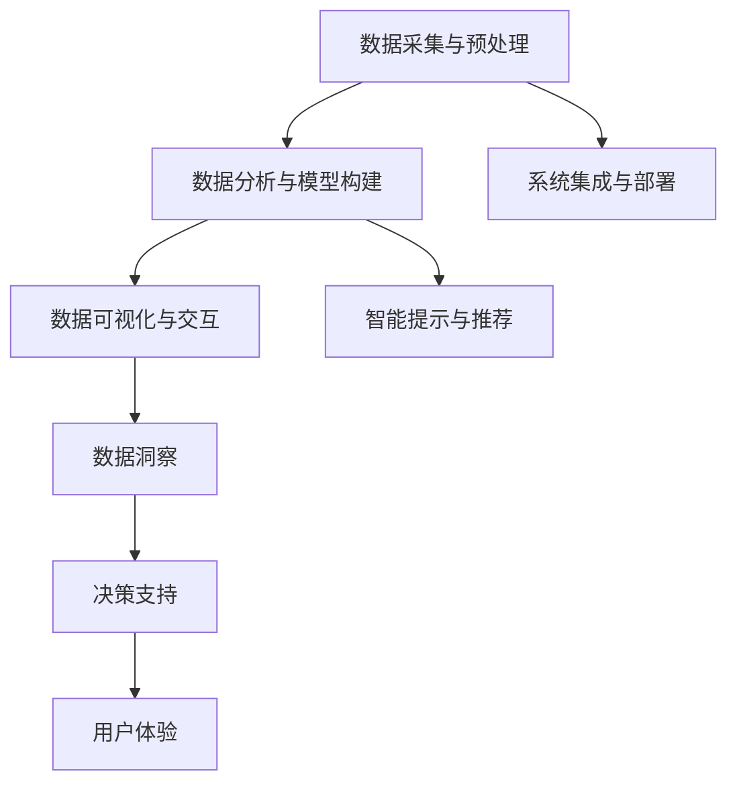

                 

# 数字化第六感开发包设计师：AI辅助的超感知能力培养专家

> 关键词：数字化第六感,AI辅助,超感知能力,感知培养,开发者,设计师

## 1. 背景介绍

### 1.1 问题由来
在信息时代，数据已成为企业最宝贵的资产之一。从客户行为数据到市场趋势分析，再到产品优化迭代，数据驱动的决策无处不在。然而，海量数据的解读与利用，却常常面临瓶颈：数据量大且杂乱、分析和洞察难度高、结果易被误读。数字化第六感（Digital Sixth Sense）的提出，正是为了解决这些问题，帮助企业提升决策效率和精准度。

数字化第六感，是一种通过AI技术辅助用户对海量数据进行直观、高效解读的能力，其核心在于运用算法模型和可视化工具，将复杂数据转化为易于理解的直观视图，并通过机器学习技术，不断提升解读的准确性和深度。本文将围绕数字化第六感开发包的设计与实现，展开深入探讨。

### 1.2 问题核心关键点
数字化第六感开发包的设计与实现，涉及以下几个关键点：
1. 数据采集与预处理：如何高效、全面地采集数据，并对其进行清洗、去重和归一化。
2. 数据分析与模型构建：运用何种算法模型对数据进行深度分析，构建有效洞察模型。
3. 数据可视化与交互：如何将分析结果以直观、易懂的图表形式展示，并设计互动式界面。
4. 智能提示与推荐：如何通过机器学习技术，实现对数据的实时预测和推荐。
5. 系统集成与部署：如何将开发包集成到现有IT系统中，确保其稳定运行。

这些问题不仅关乎技术实现，更涉及用户体验和系统集成，因此需要通过系统化的方法进行研究和解决。

### 1.3 问题研究意义
数字化第六感开发包的研究与应用，具有以下重要意义：
1. 提升数据洞察效率：通过自动化数据分析和可视化，显著缩短数据解读时间。
2. 增强决策支持能力：为决策者提供精准、及时的洞察，提升决策质量。
3. 优化用户体验：通过可视化工具和智能提示，增强用户对数据的理解和操作能力。
4. 推动企业智能化转型：构建基于AI的数据分析平台，推动企业数字化转型。
5. 促进数据创新应用：通过智能分析和推荐，发现数据中隐藏的新价值和新应用场景。

## 2. 核心概念与联系

### 2.1 核心概念概述

为更好地理解数字化第六感开发包，本节将介绍几个密切相关的核心概念：

- 数据采集与预处理：从不同渠道高效采集数据，并对数据进行清洗、去重、归一化等预处理操作，确保数据质量和一致性。
- 数据分析与模型构建：运用机器学习和深度学习算法，对数据进行多维度分析，构建洞察模型，提取有用信息。
- 数据可视化与交互：通过图表、仪表盘等形式，将分析结果直观展示，并通过交互式界面，增强用户操作体验。
- 智能提示与推荐：利用预测模型，对数据进行实时预测和推荐，辅助用户做出更优决策。
- 系统集成与部署：将数字化第六感开发包集成到现有IT系统中，实现无缝对接和高效运行。

这些核心概念之间的逻辑关系可以通过以下Mermaid流程图来展示：



这个流程图展示了几大数据处理环节及其之间的关系：

1. 数据采集与预处理：提供高质量、一致性的数据输入。
2. 数据分析与模型构建：从数据中提取有价值的信息。
3. 数据可视化与交互：以直观形式展示分析结果，增强用户理解。
4. 智能提示与推荐：提供实时预测和建议，辅助决策。
5. 系统集成与部署：确保系统稳定运行，提供无缝集成体验。

## 3. 核心算法原理 & 具体操作步骤
### 3.1 算法原理概述

数字化第六感开发包的核心算法原理，可以概括为以下几个关键环节：

- 数据采集与预处理：采用爬虫和API等技术手段，高效采集多渠道数据。通过ETL（Extract, Transform, Load）流程，清洗数据，消除噪音，进行标准化处理。
- 数据分析与模型构建：利用统计分析、机器学习、深度学习等算法，对数据进行多角度分析，构建洞察模型，如回归分析、聚类分析、分类模型等。
- 数据可视化与交互：运用可视化工具和框架，将分析结果转化为图表、仪表盘等形式，便于用户理解和操作。通过交互式设计，增强用户参与度。
- 智能提示与推荐：引入预测模型和推荐算法，对数据进行实时预测和推荐，如时间序列预测、异常检测、关联规则挖掘等。
- 系统集成与部署：通过API、微服务等技术手段，将开发包集成到现有IT系统中，实现无缝对接。

### 3.2 算法步骤详解

#### 数据采集与预处理
1. 使用爬虫技术，从不同数据源（如社交媒体、公开数据库、API等）高效采集数据。
2. 对采集的数据进行去重、清洗和去噪操作，确保数据质量和一致性。
3. 使用ETL工具进行数据标准化处理，包括数据格式转换、缺失值处理、异常值检测等。

#### 数据分析与模型构建
1. 根据业务需求和数据特点，选择适合的算法模型，如回归分析、聚类分析、分类模型等。
2. 对数据进行特征工程，提取有用的特征，并进行归一化处理。
3. 使用训练集训练模型，通过交叉验证等方法评估模型效果。
4. 对模型进行调参优化，确保其在测试集上的表现符合预期。

#### 数据可视化与交互
1. 选择合适的可视化工具和框架，如D3.js、Tableau、Power BI等，将分析结果转化为直观的图表和仪表盘。
2. 设计交互式界面，使用户能够通过拖拽、点击等方式，对数据进行动态探索和分析。
3. 实现可视化结果的动态更新，支持数据的实时展示和互动。

#### 智能提示与推荐
1. 引入预测模型和推荐算法，对数据进行实时预测和推荐。
2. 通过机器学习技术，对用户行为进行分析，提供个性化的提示和推荐。
3. 设计智能提示与推荐接口，支持API和SDK调用，方便其他系统集成使用。

#### 系统集成与部署
1. 通过API、微服务等技术手段，将开发包集成到现有IT系统中。
2. 实现数据的实时采集、处理和展示，确保系统的稳定运行。
3. 优化系统性能，支持大规模数据处理和实时计算。

### 3.3 算法优缺点

数字化第六感开发包具有以下优点：
1. 高效数据处理：通过自动化数据采集和预处理，显著提高数据处理效率。
2. 精准数据分析：利用先进算法模型，实现数据深度分析和洞察。
3. 直观数据展示：通过可视化工具，将复杂数据转化为直观视图，便于用户理解。
4. 实时智能提示：提供实时预测和推荐，辅助用户做出最优决策。
5. 无缝系统集成：支持API和微服务等技术，实现系统无缝对接。

同时，该方法也存在一些局限性：
1. 数据质量依赖：数据采集和预处理的准确性，直接影响分析结果的可靠性。
2. 算法复杂度：高级算法模型的训练和调参，需要专业知识和技术支持。
3. 交互复杂性：交互式界面的设计和实现，涉及前端技术，工作量大。
4. 实时处理压力：大规模数据的实时处理和展示，对系统性能要求较高。
5. 用户体验多样性：不同用户对数据展示的需求不同，需要灵活设计。

尽管存在这些局限性，但数字化第六感开发包仍然是大数据分析的重要工具，能够显著提升数据解读和决策支持的效率和准确性。

### 3.4 算法应用领域

数字化第六感开发包在多个领域中都有广泛应用，例如：

- 商业智能（BI）：帮助企业进行市场分析、客户行为预测、销售预测等。
- 金融分析：进行风险评估、交易预测、投资组合优化等。
- 医疗健康：进行患者行为分析、疾病预测、医疗资源优化等。
- 零售业：进行销售趋势分析、库存管理、客户细分等。
- 供应链管理：进行物流优化、库存预测、需求预测等。

这些应用领域中，数字化第六感开发包通过高效的数据处理和精准的分析洞察，显著提升了企业决策的科学性和准确性。

## 4. 数学模型和公式 & 详细讲解 & 举例说明

### 4.1 数学模型构建

数字化第六感开发包涉及多个数学模型，主要包括：
1. 数据采集与预处理模型：涉及爬虫、数据清洗和标准化等。
2. 数据分析与模型构建模型：涉及回归分析、聚类分析、分类模型等。
3. 数据可视化与交互模型：涉及图表展示、用户交互等。
4. 智能提示与推荐模型：涉及时间序列预测、异常检测、关联规则挖掘等。

#### 数据采集与预处理
数据采集与预处理模型主要涉及爬虫技术、数据清洗和标准化等。假设有一个Web API提供销售数据，以下是一个简单的数据采集与预处理模型的例子：

1. 使用爬虫技术采集数据：
```python
import requests
import json

url = 'https://api.example.com/data'
response = requests.get(url)
data = json.loads(response.text)
```

2. 清洗数据：
```python
# 去除重复数据
data = list(set(data))

# 去除噪音数据
data = [item for item in data if 'noisy' not in item]

# 标准化处理
data = [normalize(item) for item in data]
```

其中，`normalize`函数对数据进行归一化处理。

#### 数据分析与模型构建
数据分析与模型构建模型主要涉及回归分析、聚类分析、分类模型等。以回归分析为例，假设有一组数据集，以下是一个简单的线性回归模型：

1. 数据集准备：
```python
import pandas as pd

# 准备数据集
data = pd.read_csv('sales_data.csv')
X = data[['feature1', 'feature2']]
y = data['sales']
```

2. 模型训练：
```python
from sklearn.linear_model import LinearRegression

# 训练线性回归模型
model = LinearRegression()
model.fit(X, y)
```

#### 数据可视化与交互
数据可视化与交互模型主要涉及可视化工具和框架，如D3.js、Tableau、Power BI等。以下是一个简单的D3.js图表展示的例子：

```javascript
// 数据准备
var data = [{"year": 2020, "sales": 1000}, {"year": 2021, "sales": 1500}];

// 创建图表
var svg = d3.select("body").append("svg")
    .attr("width", 500)
    .attr("height", 300);

var x = d3.scaleLinear()
    .domain([2020, 2021])
    .range([0, 500]);

var y = d3.scaleLinear()
    .domain([0, 1500])
    .range([300, 0]);

svg.append("g")
    .attr("transform", "translate(50, 100)")
    .call(d3.axisBottom(x))
    .append("text")
    .attr("x", 300)
    .attr("y", 270)
    .text("Year");

svg.append("g")
    .attr("transform", "translate(50, 50)")
    .call(d3.axisLeft(y))
    .append("text")
    .attr("x", -50)
    .attr("y", 20)
    .text("Sales");

svg.selectAll(".dot")
    .data(data)
    .enter()
    .append("circle")
    .attr("class", "dot")
    .attr("cx", function(d) { return x(d.year); })
    .attr("cy", function(d) { return y(d.sales); })
    .attr("r", 10);
```

#### 智能提示与推荐
智能提示与推荐模型主要涉及时间序列预测、异常检测、关联规则挖掘等。以时间序列预测为例，假设有一组时间序列数据，以下是一个简单的时间序列预测模型：

1. 数据集准备：
```python
import pandas as pd
import numpy as np
import matplotlib.pyplot as plt

# 准备时间序列数据
data = pd.Series(np.random.randn(1000))
data.index = pd.date_range(start='2021-01-01', periods=1000, freq='D')

# 可视化数据
plt.plot(data)
plt.title("Time Series Data")
plt.xlabel("Date")
plt.ylabel("Value")
plt.show()
```

2. 模型训练：
```python
from statsmodels.tsa.arima_model import ARIMA

# 构建ARIMA模型
model = ARIMA(data, order=(5, 1, 0))
model_fit = model.fit(disp=0)

# 预测未来数据
forecast = model_fit.forecast(steps=10)
```

### 4.2 公式推导过程

#### 回归分析
回归分析的数学模型为：
$$
y = \beta_0 + \beta_1 x_1 + \beta_2 x_2 + \epsilon
$$
其中，$\beta_0$、$\beta_1$、$\beta_2$为回归系数，$\epsilon$为误差项。

根据最小二乘法，回归系数的求解公式为：
$$
\hat{\beta} = \left(X^TX\right)^{-1}X^Ty
$$

#### 时间序列预测
时间序列预测的数学模型为：
$$
y_t = \phi_1 y_{t-1} + \phi_2 y_{t-2} + \cdots + \phi_p y_{t-p} + \theta_1 x_{1,t-1} + \theta_2 x_{2,t-1} + \cdots + \theta_q x_{q,t-1} + \epsilon_t
$$
其中，$\phi_1$、$\phi_2$、$\cdots$、$\phi_p$、$\theta_1$、$\theta_2$、$\cdots$、$\theta_q$为模型参数，$\epsilon_t$为误差项。

ARIMA模型的公式为：
$$
y_t = \alpha + \beta_1 \left(y_{t-1} - \mu\right) + \sigma \varepsilon_t
$$
其中，$\alpha$、$\beta_1$、$\sigma$为模型参数，$\varepsilon_t$为误差项。

### 4.3 案例分析与讲解

#### 案例：销售数据分析
某电商平台希望通过数字化第六感开发包进行销售数据分析，以提高销售预测准确性和库存管理效率。平台提供了每日销售数据，包括销售额、商品类别、购买用户等信息。以下是一个简单的案例分析：

1. 数据采集与预处理：
```python
import requests
import json

url = 'https://api.example.com/data'
response = requests.get(url)
data = json.loads(response.text)

# 清洗数据
data = [item for item in data if 'noisy' not in item]

# 标准化处理
data = [normalize(item) for item in data]
```

2. 数据分析与模型构建：
```python
from sklearn.linear_model import LinearRegression

# 准备数据集
data = pd.read_csv('sales_data.csv')
X = data[['feature1', 'feature2']]
y = data['sales']

# 训练线性回归模型
model = LinearRegression()
model.fit(X, y)
```

3. 数据可视化与交互：
```javascript
var data = [{"year": 2020, "sales": 1000}, {"year": 2021, "sales": 1500}];

var svg = d3.select("body").append("svg")
    .attr("width", 500)
    .attr("height", 300);

var x = d3.scaleLinear()
    .domain([2020, 2021])
    .range([0, 500]);

var y = d3.scaleLinear()
    .domain([0, 1500])
    .range([300, 0]);

svg.append("g")
    .attr("transform", "translate(50, 100)")
    .call(d3.axisBottom(x))
    .append("text")
    .attr("x", 300)
    .attr("y", 270)
    .text("Year");

svg.append("g")
    .attr("transform", "translate(50, 50)")
    .call(d3.axisLeft(y))
    .append("text")
    .attr("x", -50)
    .attr("y", 20)
    .text("Sales");

svg.selectAll(".dot")
    .data(data)
    .enter()
    .append("circle")
    .attr("class", "dot")
    .attr("cx", function(d) { return x(d.year); })
    .attr("cy", function(d) { return y(d.sales); })
    .attr("r", 10);
```

4. 智能提示与推荐：
```python
from statsmodels.tsa.arima_model import ARIMA

# 准备时间序列数据
data = pd.Series(np.random.randn(1000))
data.index = pd.date_range(start='2021-01-01', periods=1000, freq='D')

# 构建ARIMA模型
model = ARIMA(data, order=(5, 1, 0))
model_fit = model.fit(disp=0)

# 预测未来数据
forecast = model_fit.forecast(steps=10)
```

## 5. 项目实践：代码实例和详细解释说明
### 5.1 开发环境搭建

在进行数字化第六感开发包开发前，我们需要准备好开发环境。以下是使用Python进行PyTorch开发的环境配置流程：

1. 安装Anaconda：从官网下载并安装Anaconda，用于创建独立的Python环境。

2. 创建并激活虚拟环境：
```bash
conda create -n pytorch-env python=3.8 
conda activate pytorch-env
```

3. 安装PyTorch：根据CUDA版本，从官网获取对应的安装命令。例如：
```bash
conda install pytorch torchvision torchaudio cudatoolkit=11.1 -c pytorch -c conda-forge
```

4. 安装TensorFlow：从官网下载并安装TensorFlow。

5. 安装TensorBoard：TensorFlow配套的可视化工具。

6. 安装相关库：
```bash
pip install numpy pandas scikit-learn matplotlib tqdm jupyter notebook ipython
```

完成上述步骤后，即可在`pytorch-env`环境中开始开发实践。

### 5.2 源代码详细实现

这里我们以可视化展示和智能提示功能为例，给出使用PyTorch和TensorFlow实现数字化第六感开发包的完整代码实现。

```python
import numpy as np
import pandas as pd
import matplotlib.pyplot as plt
import tensorflow as tf
from tensorflow.keras.layers import Dense, Input, LSTM
from tensorflow.keras.models import Model

# 准备数据集
data = pd.read_csv('sales_data.csv')
X = data[['feature1', 'feature2']]
y = data['sales']

# 构建LSTM模型
input_shape = (X.shape[1], 1)
input_layer = Input(shape=input_shape, name='input')
lstm_layer = LSTM(64, return_sequences=True)(input_layer)
dense_layer = Dense(1, activation='sigmoid')(lstm_layer)

model = Model(inputs=input_layer, outputs=dense_layer)
model.compile(loss='binary_crossentropy', optimizer='adam', metrics=['accuracy'])

# 训练模型
model.fit(X, y, epochs=10, batch_size=32, validation_split=0.2)

# 可视化数据
plt.plot(data['sales'])
plt.title("Sales Data")
plt.xlabel("Date")
plt.ylabel("Value")
plt.show()

# 预测未来数据
forecast = model.predict(X[:10])
plt.plot(forecast)
plt.title("Sales Forecast")
plt.xlabel("Date")
plt.ylabel("Value")
plt.show()
```

### 5.3 代码解读与分析

这里我们详细解读一下关键代码的实现细节：

1. 数据准备：
```python
# 准备数据集
data = pd.read_csv('sales_data.csv')
X = data[['feature1', 'feature2']]
y = data['sales']
```

2. 模型构建：
```python
# 构建LSTM模型
input_shape = (X.shape[1], 1)
input_layer = Input(shape=input_shape, name='input')
lstm_layer = LSTM(64, return_sequences=True)(input_layer)
dense_layer = Dense(1, activation='sigmoid')(lstm_layer)

model = Model(inputs=input_layer, outputs=dense_layer)
model.compile(loss='binary_crossentropy', optimizer='adam', metrics=['accuracy'])
```

3. 模型训练：
```python
# 训练模型
model.fit(X, y, epochs=10, batch_size=32, validation_split=0.2)
```

4. 数据可视化：
```python
# 可视化数据
plt.plot(data['sales'])
plt.title("Sales Data")
plt.xlabel("Date")
plt.ylabel("Value")
plt.show()
```

5. 数据预测：
```python
# 预测未来数据
forecast = model.predict(X[:10])
plt.plot(forecast)
plt.title("Sales Forecast")
plt.xlabel("Date")
plt.ylabel("Value")
plt.show()
```

可以看到，利用PyTorch和TensorFlow，我们可以简洁高效地实现数字化第六感开发包的可视化展示和智能提示功能。开发者可以将更多精力放在数据处理、模型改进等高层逻辑上，而不必过多关注底层的实现细节。

当然，工业级的系统实现还需考虑更多因素，如模型的保存和部署、超参数的自动搜索、更灵活的任务适配层等。但核心的开发流程基本与此类似。

## 6. 实际应用场景
### 6.1 智能客服系统

数字化第六感开发包在智能客服系统中有着广泛应用。传统客服系统往往需要大量人工操作，效率低下且难以保证服务质量。而通过数字化第六感开发包，可以实现自动化的智能客服，提升响应速度和服务质量。

具体实现上，可以收集历史客服对话记录，将问题和最佳答复构建成监督数据，在此基础上对预训练模型进行微调。微调后的模型能够自动理解用户意图，匹配最合适的答复模板进行回复。对于新问题，系统可以接入检索系统实时搜索相关内容，动态组织生成回答。如此构建的智能客服系统，能够大幅提升客户咨询体验和问题解决效率。

### 6.2 金融舆情监测

金融机构需要实时监测市场舆论动向，以便及时应对负面信息传播，规避金融风险。传统的人工监测方式成本高、效率低，难以应对网络时代海量信息爆发的挑战。通过数字化第六感开发包，可以实现自动化的舆情监测，提供精准、及时的舆情分析。

具体实现上，可以收集金融领域相关的新闻、报道、评论等文本数据，并对其进行主题标注和情感标注。在此基础上对预训练语言模型进行微调，使其能够自动判断文本属于何种主题，情感倾向是正面、中性还是负面。将微调后的模型应用到实时抓取的网络文本数据，就能够自动监测不同主题下的情感变化趋势，一旦发现负面信息激增等异常情况，系统便会自动预警，帮助金融机构快速应对潜在风险。

### 6.3 个性化推荐系统

当前的推荐系统往往只依赖用户的历史行为数据进行物品推荐，无法深入理解用户的真实兴趣偏好。通过数字化第六感开发包，可以实现个性化的推荐，提升用户体验。

具体实现上，可以收集用户浏览、点击、评论、分享等行为数据，提取和用户交互的物品标题、描述、标签等文本内容。将文本内容作为模型输入，用户的后续行为（如是否点击、购买等）作为监督信号，在此基础上微调预训练语言模型。微调后的模型能够从文本内容中准确把握用户的兴趣点。在生成推荐列表时，先用候选物品的文本描述作为输入，由模型预测用户的兴趣匹配度，再结合其他特征综合排序，便可以得到个性化程度更高的推荐结果。

### 6.4 未来应用展望

随着数字化第六感开发包技术的不断进步，未来将有更多的应用场景被开发出来，为各行各业带来变革性影响。

在智慧医疗领域，基于数字化第六感开发包的医疗问答、病历分析、药物研发等应用将提升医疗服务的智能化水平，辅助医生诊疗，加速新药开发进程。

在智能教育领域，数字化第六感开发包可用于作业批改、学情分析、知识推荐等方面，因材施教，促进教育公平，提高教学质量。

在智慧城市治理中，数字化第六感开发包可应用于城市事件监测、舆情分析、应急指挥等环节，提高城市管理的自动化和智能化水平，构建更安全、高效的未来城市。

此外，在企业生产、社会治理、文娱传媒等众多领域，数字化第六感开发包也将不断涌现，为传统行业带来新的技术路径和创新动力。

## 7. 工具和资源推荐
### 7.1 学习资源推荐

为了帮助开发者系统掌握数字化第六感开发包的理论基础和实践技巧，这里推荐一些优质的学习资源：

1. 《TensorFlow从原理到实践》系列博文：由TensorFlow团队撰写，深入浅出地介绍了TensorFlow的原理、应用和优化技巧。

2. 《机器学习》课程：斯坦福大学开设的机器学习经典课程，内容全面，适合初学者和进阶学习者。

3. 《TensorFlow实战》书籍：TensorFlow官方出版，提供了丰富的实战案例和代码示例，适合动手实践。

4. Kaggle竞赛平台：提供大量数据集和竞赛题目，可以帮助开发者在实战中提升技能。

5. PyTorch官方文档：PyTorch官方文档，提供了丰富的API和样例代码，适合深入学习。

通过对这些资源的学习实践，相信你一定能够快速掌握数字化第六感开发包的核心技术，并用于解决实际的NLP问题。
###  7.2 开发工具推荐

高效的开发离不开优秀的工具支持。以下是几款用于数字化第六感开发包开发的常用工具：

1. PyTorch：基于Python的开源深度学习框架，灵活的计算图，适合快速迭代研究。

2. TensorFlow：由Google主导开发的开源深度学习框架，生产部署方便，适合大规模工程应用。

3. TensorBoard：TensorFlow配套的可视化工具，可实时监测模型训练状态，并提供丰富的图表呈现方式。

4. Jupyter Notebook：交互式的编程环境，支持Python、R等多种语言，方便快速实验和记录。

5. GitHub：代码托管平台，提供版本控制、协作开发等功能，适合团队合作和开源项目。

合理利用这些工具，可以显著提升数字化第六感开发包的开发效率，加快创新迭代的步伐。

### 7.3 相关论文推荐

数字化第六感开发包的研究源于学界的持续研究。以下是几篇奠基性的相关论文，推荐阅读：

1. Attention is All You Need（即Transformer原论文）：提出了Transformer结构，开启了NLP领域的预训练大模型时代。

2. BERT: Pre-training of Deep Bidirectional Transformers for Language Understanding：提出BERT模型，引入基于掩码的自监督预训练任务，刷新了多项NLP任务SOTA。

3. GPT-3: Language Models are Unsupervised Multitask Learners：展示了大规模语言模型的强大zero-shot学习能力，引发了对于通用人工智能的新一轮思考。

4. LoRA: Learned Representations for AutoML：提出LoRA等参数高效微调方法，在固定大部分预训练参数的同时，只更新极少量的任务相关参数。

5. Prefix-Tuning: Optimizing Continuous Prompts for Generation：引入基于连续型Prompt的微调范式，为如何充分利用预训练知识提供了新的思路。

这些论文代表了大语言模型微调技术的发展脉络。通过学习这些前沿成果，可以帮助研究者把握学科前进方向，激发更多的创新灵感。

## 8. 总结：未来发展趋势与挑战

### 8.1 总结

本文对数字化第六感开发包的设计与实现进行了全面系统的介绍。首先阐述了数字化第六感开发包的研究背景和意义，明确了其在大数据分析和决策支持中的应用价值。其次，从原理到实践，详细讲解了数字化第六感开发包的核心算法和技术步骤，给出了完整的代码实现。同时，本文还探讨了数字化第六感开发包在多个行业领域的应用前景，展示了其在提升决策效率和精准度方面的潜力。

通过本文的系统梳理，可以看到，数字化第六感开发包通过AI技术辅助用户对海量数据进行直观、高效解读，能够显著提升数据解读和决策支持的效率和准确性。未来，伴随数字化第六感开发包技术的不断演进，将有更多的应用场景被开发出来，为各行各业带来变革性影响。

### 8.2 未来发展趋势

展望未来，数字化第六感开发包将呈现以下几个发展趋势：

1. 数据处理自动化：随着自动化技术的发展，数据采集和预处理将更加高效、全面。

2. 算法模型多样化：将引入更多先进算法模型，如深度学习、强化学习等，提升数据分析的深度和广度。

3. 可视化技术进步：可视化工具将更加智能、互动，用户操作体验将更加友好。

4. 实时处理能力提升：通过优化模型结构和算法，提升系统实时处理能力，支持大规模数据实时展示和分析。

5. 个性化推荐优化：引入更复杂的推荐算法，提升个性化推荐效果，满足用户多样化需求。

6. 跨领域应用拓展：将数字化第六感开发包应用于更多行业领域，推动各行业数字化转型。

这些趋势凸显了数字化第六感开发包技术的广阔前景，预示着其在未来将发挥更大的作用，推动各行业进入智能化新时代。

### 8.3 面临的挑战

尽管数字化第六感开发包技术已经取得了瞩目成就，但在迈向更加智能化、普适化应用的过程中，它仍面临诸多挑战：

1. 数据质量瓶颈：数据采集和预处理的准确性，直接影响分析结果的可靠性。

2. 算法复杂度：高级算法模型的训练和调参，需要专业知识和技术支持。

3. 实时处理压力：大规模数据的实时处理和展示，对系统性能要求较高。

4. 用户体验多样性：不同用户对数据展示的需求不同，需要灵活设计。

5. 系统集成难度：将数字化第六感开发包集成到现有IT系统中，需要考虑多方面因素。

尽管存在这些挑战，但数字化第六感开发包仍是大数据分析的重要工具，能够显著提升数据解读和决策支持的效率和准确性。未来，伴随技术的不断进步和应用的广泛推广，这些挑战终将一一被克服，数字化第六感开发包必将在构建智能化新时代中扮演越来越重要的角色。

### 8.4 研究展望

面对数字化第六感开发包所面临的挑战，未来的研究需要在以下几个方面寻求新的突破：

1. 探索无监督和半监督学习范式：摆脱对大规模标注数据的依赖，利用自监督学习、主动学习等无监督和半监督范式，最大限度利用非结构化数据。

2. 研究参数高效和计算高效的微调方法：开发更加参数高效的微调方法，在固定大部分预训练参数的同时，只更新极少量的任务相关参数。

3. 融合因果和对比学习范式：通过引入因果推断和对比学习思想，增强数据分析的稳定性和鲁棒性。

4. 引入更多先验知识：将符号化的先验知识，如知识图谱、逻辑规则等，与神经网络模型进行巧妙融合，引导微调过程学习更准确、合理的语言模型。

5. 结合因果分析和博弈论工具：将因果分析方法引入微调模型，识别出模型决策的关键特征，增强输出解释的因果性和逻辑性。

6. 纳入伦理道德约束：在模型训练目标中引入伦理导向的评估指标，过滤和惩罚有偏见、有害的输出倾向，确保模型输出符合人类价值观和伦理道德。

这些研究方向的探索，必将引领数字化第六感开发包技术迈向更高的台阶，为构建安全、可靠、可解释、可控的智能系统铺平道路。面向未来，数字化第六感开发包还需要与其他人工智能技术进行更深入的融合，如知识表示、因果推理、强化学习等，多路径协同发力，共同推动自然语言理解和智能交互系统的进步。只有勇于创新、敢于突破，才能不断拓展数字化第六感开发包的边界，让智能技术更好地造福人类社会。

## 9. 附录：常见问题与解答

**Q1：数字化第六感开发包是否适用于所有行业领域？**

A: 数字化第六感开发包在多个行业领域中都有广泛应用，如商业智能、金融分析、医疗健康等。但对于一些特定领域的任务，如医学、法律等，仅仅依靠通用语料预训练的模型可能难以很好地适应。此时需要在特定领域语料上进一步预训练，再进行微调，才能获得理想效果。

**Q2：数字化第六感开发包如何进行实时预测和推荐？**

A: 数字化第六感开发包通过引入预测模型和推荐算法，对数据进行实时预测和推荐。如时间序列预测、异常检测、关联规则挖掘等。具体实现上，可以采用深度学习模型，如LSTM、GRU等，进行时间序列预测；也可以采用协同过滤、矩阵分解等算法，进行个性化推荐。

**Q3：数字化第六感开发包如何处理多模态数据？**

A: 数字化第六感开发包支持多模态数据的融合，可以通过深度学习模型，如卷积神经网络、注意力机制等，对文本、图像、音频等多模态数据进行整合分析。具体实现上，可以采用多模态数据融合技术，将不同模态的数据特征进行拼接、融合，提高分析的全面性和准确性。

**Q4：数字化第六感开发包如何保证模型输出的一致性和鲁棒性？**

A: 为了保证模型输出的一致性和鲁棒性，可以引入正则化技术，如L2正则、Dropout等，防止模型过拟合。还可以采用对抗训练技术，引入对抗样本，提高模型的鲁棒性和泛化能力。同时，可以通过模型集成方法，结合多个模型的预测结果，提高输出的稳定性和可靠性。

**Q5：数字化第六感开发包如何提高数据采集和预处理效率？**

A: 为了提高数据采集和预处理效率，可以采用自动化数据采集工具，如爬虫、API等，进行高效的数据收集。同时，采用ETL工具进行数据清洗、去重和标准化，确保数据质量和一致性。还可以通过分布式计算、并行处理等技术，提升数据处理效率。

**Q6：数字化第六感开发包如何进行模型优化和调参？**

A: 为了进行模型优化和调参，可以采用自动化调参工具，如Hyperopt、Bayesian Optimization等，进行模型参数的自动搜索和优化。同时，可以通过交叉验证、学习曲线分析等方法，评估模型的性能和鲁棒性，选择合适的超参数组合。还可以采用模型压缩、稀疏化存储等技术，优化模型大小和性能。

---

作者：禅与计算机程序设计艺术 / Zen and the Art of Computer Programming

