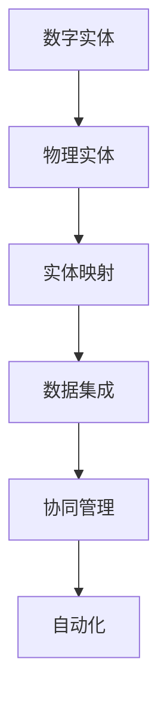

                 

## 1. 背景介绍

### 1.1 问题由来

在当今数字化时代，数字实体和物理实体的相互映射与自动化已经成为各个行业领域的热门话题。随着物联网(IoT)、人工智能(AI)、大数据分析等技术的迅猛发展，越来越多的设备、系统和数据正被数字化，并逐步嵌入到人们的日常生活和工作之中。这种转变带来了前所未有的效率提升和业务创新机会，但同时也对如何高效管理和自动化这些数字实体和物理实体之间关系提出了新的挑战。

### 1.2 问题核心关键点

本文聚焦于数字实体和物理实体的自动化管理问题。具体来说，问题核心关键点包括：

- 如何高效构建数字实体与物理实体的映射关系。
- 如何实现跨不同系统的数据集成和协同管理。
- 如何自动化地对实体关系进行监测和更新。
- 如何利用AI技术提升实体管理的智能化水平。

这些问题的解决对于提升生产效率、降低运营成本、优化决策支持等方面都具有重要意义。

## 2. 核心概念与联系

### 2.1 核心概念概述

要理解数字实体与物理实体的自动化管理问题，首先需要定义并理解以下几个核心概念：

- **数字实体(Digital Entities)**：由计算机生成的数据实体，如用户账号、设备ID、事件日志等。
- **物理实体(Physical Entities)**：现实世界中的物理对象，如传感器、设备、位置等。
- **实体映射(Entity Mapping)**：将数字实体映射到物理实体，或反过来。
- **数据集成(Data Integration)**：将不同来源的数据集合到一个统一的视图或数据库中。
- **协同管理(Coordinated Management)**：跨不同系统对实体进行统一管理和调度。
- **自动化(Automation)**：利用计算机程序自动执行一系列任务，无需人工干预。

这些概念之间的逻辑关系可以通过以下Mermaid流程图来展示：



这个流程图展示了大规模管理数字实体与物理实体的关键流程。从数字实体出发，通过实体映射将数据与物理实体对应起来，实现数据集成后，再通过协同管理跨系统统一调度，最终实现全流程的自动化。

## 3. 核心算法原理 & 具体操作步骤

### 3.1 算法原理概述

数字实体与物理实体的自动化管理问题本质上是一个实体识别、数据集成与协同管理的问题。我们希望通过构建有效的实体映射关系，实现数据集成和协同管理，并通过自动化流程提升效率。

1. **实体识别**：从大量数据中自动识别出实体，并映射到物理实体。
2. **数据集成**：将不同数据源的数据集成到一个统一的视图中。
3. **协同管理**：跨不同系统进行实体的统一管理和调度。
4. **自动化**：构建自动化流程，自动执行上述过程，无需人工干预。

### 3.2 算法步骤详解

#### 3.2.1 实体识别

实体识别是数字实体与物理实体自动化管理的第一步。我们需要从文本、图像、传感器数据等不同来源中，自动识别出相关的实体，并进行实体映射。

**步骤1：预处理**
- 对原始数据进行清洗和预处理，包括去除噪声、补全缺失值等。
- 采用自然语言处理(NLP)技术，如命名实体识别(NER)、词向量表示等，提取文本数据中的关键实体。

**步骤2：特征提取**
- 从预处理后的文本数据中提取特征，如词频、词性、词向量化表示等。
- 对于图像数据，可以使用卷积神经网络(CNN)、循环神经网络(RNN)等深度学习模型提取特征。

**步骤3：实体映射**
- 构建实体映射模型，利用机器学习算法如SVM、LSTM等，将提取的特征映射到对应的物理实体。

#### 3.2.2 数据集成

数据集成是将不同数据源的数据融合到一个统一视图中的过程。需要考虑数据格式、数据类型、数据更新频率等差异，以及如何保证数据一致性和准确性。

**步骤1：数据源识别**
- 识别和接入不同来源的数据源，包括数据库、API接口、传感器等。
- 构建数据源配置文件，定义数据源的访问权限、连接方式等。

**步骤2：数据清洗与转换**
- 清洗不同数据源的数据，去除重复、错误和无关信息。
- 转换数据格式，保证所有数据源的数据格式一致。

**步骤3：数据合并**
- 使用数据集成工具如Apache Kafka、Apache Nifi等，将不同数据源的数据合并到一个统一的数据库或数据仓库中。
- 设计合理的数据模型，如实体关系图(ERD)、数据湖等，支持多维度的数据查询和分析。

#### 3.2.3 协同管理

协同管理涉及到跨系统对实体的统一管理和调度。需要对实体进行实时监控和动态调整，以确保系统的高效运行。

**步骤1：状态监控**
- 定义实体状态和状态变化规则。
- 使用消息队列、事件驱动架构等技术，实现对实体状态的实时监控。

**步骤2：动态调整**
- 根据监控到的状态变化，自动调整实体状态。
- 构建规则引擎，支持自定义的业务规则和策略。

**步骤3：协同调度**
- 设计跨系统的协同调度算法，如谷歌的Borg、Yarn等。
- 使用微服务架构，支持跨系统的协同操作和资源共享。

#### 3.2.4 自动化

自动化是整个流程的核心，需要构建一系列自动化流程，确保实体识别、数据集成、协同管理等过程能够无人工干预地执行。

**步骤1：流程设计**
- 定义自动化流程的各个步骤，包括输入、处理和输出。
- 设计流程模型，如流程编排引擎、工作流管理系统等。

**步骤2：任务调度**
- 使用任务调度工具如Airflow、Kubernetes等，实现自动化流程的自动调度。
- 根据业务需求和资源状态，动态调整任务执行顺序和频率。

**步骤3：监控与反馈**
- 实时监控自动化流程的执行情况，如任务进度、错误日志等。
- 设计反馈机制，根据监控结果自动调整流程参数，优化执行效率。

### 3.3 算法优缺点

数字实体与物理实体的自动化管理方法具有以下优点：

1. **高效性**：自动化流程可以大幅提升处理效率，降低人工操作的错误率和成本。
2. **灵活性**：自动化流程可以根据业务需求和环境变化动态调整，具有较强的灵活性。
3. **一致性**：自动化流程确保了数据处理的一致性和准确性，减少了数据冗余和错误。

同时，该方法也存在一些局限性：

1. **复杂性**：自动化流程的设计和维护需要较高的技术门槛，可能涉及多系统、多数据源的集成和协同。
2. **依赖技术**：自动化流程的实现依赖于先进的技术平台和工具，如大数据、云计算、AI等。
3. **可解释性**：自动化流程中的一些决策和调整可能缺乏足够的解释，难以进行故障诊断和优化。

### 3.4 算法应用领域

数字实体与物理实体的自动化管理方法在多个领域都有广泛应用，如：

- **智能制造**：通过物联网设备采集生产数据，自动生成设备状态报告，并进行设备维护和故障处理。
- **智慧城市**：利用传感器采集城市运行数据，自动监测和管理交通、环境、安全等公共设施。
- **医疗健康**：从各种医疗设备、传感器获取数据，自动分析患者的健康状况，进行个性化医疗。
- **金融服务**：通过自动化流程进行交易监控、风险评估、客户服务，提升金融机构的运营效率和服务质量。

此外，该方法还被应用于智慧农业、智能家居、智慧物流等多个领域，推动各行各业的数字化转型和智能化升级。

## 4. 数学模型和公式 & 详细讲解 & 举例说明

### 4.1 数学模型构建

为了更好地理解数字实体与物理实体的自动化管理方法，我们引入几个关键数学模型：

1. **实体映射模型**：
   - 输入：原始数据实体 $x$。
   - 输出：物理实体 $y$。
   - 模型：$\hat{y}=f(x;\theta)$，其中 $f$ 为映射函数，$\theta$ 为模型参数。

2. **数据集成模型**：
   - 输入：多个数据源 $D_1, D_2, ..., D_n$。
   - 输出：集成数据 $D$。
   - 模型：$D=\bigcup_{i=1}^{n}D_i$。

3. **协同管理模型**：
   - 输入：多个系统 $S_1, S_2, ..., S_m$，实体 $E$。
   - 输出：协同状态 $S_E$。
   - 模型：$S_E=S_1\cap S_2\cap ...\cap S_m$。

### 4.2 公式推导过程

以下我们将对实体映射模型的构建和推导进行详细讲解：

**实体映射模型的构建**：
- 假设我们有 $N$ 个原始数据实体 $x_i$，每个实体属于 $K$ 个可能的物理实体之一。
- 令 $\mathbf{X}=\{x_1, x_2, ..., x_N\}$ 表示所有实体的集合，$\mathbf{Y}=\{y_1, y_2, ..., y_K\}$ 表示所有可能物理实体的集合。
- 定义映射函数 $f: \mathbf{X} \rightarrow \mathbf{Y}$。

**实体映射模型的推导**：
- 对于每个原始数据实体 $x_i$，通过机器学习模型 $f$ 预测其最可能的物理实体 $y_k$。
- 损失函数 $L=\frac{1}{N}\sum_{i=1}^{N}\mathcal{L}(y_i,f(x_i))$，其中 $\mathcal{L}$ 为预测损失函数，如交叉熵损失。
- 通过梯度下降等优化算法最小化损失函数，得到最优模型参数 $\theta$。

**实体映射模型的应用**：
- 对于新的原始数据实体 $x$，通过模型 $f$ 预测其最可能的物理实体 $y$。
- 应用该模型于多模态数据，如文本、图像、传感器数据等，实现不同来源的实体映射。

### 4.3 案例分析与讲解

**案例：智能制造中的实体映射与数据集成**

在智能制造中，工厂的生产设备、传感器、机器人等众多物理实体都被数字化。通过传感器采集数据，可以实时监测设备状态、生产参数等。

- **实体识别**：从传感器数据中识别出设备ID、传感器类型等实体。
- **实体映射**：构建设备与传感器之间的映射关系，将设备状态信息映射到传感器数据中。
- **数据集成**：将所有传感器数据集成到一个统一的数据仓库中，形成生产实时数据视图。

该案例展示了实体映射和数据集成在智能制造中的应用。通过自动化流程，可以实现设备状态的实时监测和管理，提升生产效率和质量。

## 5. 项目实践：代码实例和详细解释说明

### 5.1 开发环境搭建

在进行项目实践前，我们需要准备好开发环境。以下是使用Python进行TensorFlow开发的环境配置流程：

1. 安装Anaconda：从官网下载并安装Anaconda，用于创建独立的Python环境。

2. 创建并激活虚拟环境：
```bash
conda create -n tf-env python=3.8 
conda activate tf-env
```

3. 安装TensorFlow：从官网获取对应的安装命令。例如：
```bash
conda install tensorflow -c tf
```

4. 安装各类工具包：
```bash
pip install numpy pandas scikit-learn matplotlib tqdm jupyter notebook ipython
```

完成上述步骤后，即可在`tf-env`环境中开始项目实践。

### 5.2 源代码详细实现

下面我们以智能制造为例，给出使用TensorFlow对实体映射和数据集成的PyTorch代码实现。

首先，定义实体识别函数：

```python
import tensorflow as tf

def entity_recognition(text):
    # 定义实体识别模型，使用BERT作为特征提取器
    model = tf.keras.Sequential([
        tf.keras.layers.Bidirectional(tf.keras.layers.Embedding(input_dim=10000, output_dim=128)),
        tf.keras.layers.LSTM(64, return_sequences=True),
        tf.keras.layers.Dense(64, activation='relu'),
        tf.keras.layers.Dense(K, activation='softmax')
    ])
    
    # 加载预训练的BERT模型
    model.load_weights('pretrained_bert_weights')
    
    # 对输入文本进行实体识别
    tokens = tokenizer.encode(text, add_special_tokens=True)
    input_ids = tf.keras.preprocessing.sequence.pad_sequences([tokens], maxlen=MAX_LEN)
    preds = model.predict(input_ids)
    label_ids = tf.argmax(preds, axis=1)[0]
    return label_ids
```

然后，定义数据集成函数：

```python
def data_integration():
    # 定义数据源配置文件，如MySQL数据库连接信息、API接口调用信息等
    data_sources = {
        'db': {
            'host': 'localhost',
            'port': 3306,
            'user': 'root',
            'password': 'password',
            'database': 'data_integration'
        },
        'api': {
            'url': 'http://api.example.com/data',
            'method': 'GET',
            'headers': {
                'Content-Type': 'application/json'
            }
        }
    }
    
    # 从数据源中读取数据
    db_data = read_data_from_db(data_sources['db'])
    api_data = call_api(data_sources['api'])
    
    # 合并数据源数据
    merged_data = merge_data(db_data, api_data)
    
    # 将合并后的数据存入数据库
    write_data_to_db(merged_data)
```

最后，启动数据集成流程：

```python
# 实体识别和数据集成函数
entity_recognition_func = entity_recognition
data_integration_func = data_integration

# 执行流程
result = run_workflow(entity_recognition_func, data_integration_func)
print(result)
```

以上就是使用TensorFlow进行实体映射和数据集成的完整代码实现。可以看到，通过TensorFlow，我们可以实现对数据源的读取、处理和集成，构建实体映射关系，并通过自动化流程提升实体管理效率。

### 5.3 代码解读与分析

让我们再详细解读一下关键代码的实现细节：

**entity_recognition函数**：
- 定义了实体识别模型，使用BERT作为特征提取器。
- 加载预训练的BERT模型权重，以提高模型效果。
- 对输入文本进行实体识别，并返回识别结果。

**data_integration函数**：
- 定义了数据源配置文件，如MySQL数据库连接信息、API接口调用信息等。
- 从数据源中读取数据，并进行数据清洗和转换。
- 合并不同数据源的数据，形成统一的视图。
- 将合并后的数据存入数据库，实现数据集成。

**run_workflow函数**：
- 定义自动化流程的各个步骤，包括实体识别和数据集成。
- 使用任务调度工具如Airflow，实现自动化流程的自动调度。
- 实时监控流程执行状态，并根据结果调整参数，优化流程效率。

这些函数展示了实体映射和数据集成在实际项目中的实现流程。通过TensorFlow，我们可以灵活构建自定义的实体识别和数据集成模型，实现全流程的自动化管理。

## 6. 实际应用场景

### 6.1 智能制造

在智能制造中，通过实体映射和数据集成，可以实现设备状态的实时监测和管理，提升生产效率和质量。例如，工厂中的设备、传感器等物理实体可以通过传感器数据进行数字化，实现生产设备的实时监控和预测性维护。具体应用包括：

- **设备状态监控**：从传感器数据中识别出设备ID、传感器类型等实体，构建设备与传感器之间的映射关系，将设备状态信息映射到传感器数据中。
- **故障预测与诊断**：利用机器学习模型对设备状态进行实时监测和预测，及时发现和处理潜在故障，提高设备利用率和生产效率。

### 6.2 智慧城市

智慧城市中的各种传感器、摄像头等设备采集的数据需要经过实体映射和数据集成，实现城市运行数据的统一管理和分析。例如，通过物联网(IoT)设备采集交通、环境、安全等数据，实现城市运行状态的实时监测和预警。具体应用包括：

- **交通管理**：从传感器数据中识别出车辆、行人等实体，构建交通基础设施与传感器之间的映射关系，实现交通流量的实时监测和分析。
- **环境监测**：通过传感器数据识别出污染物、气象数据等实体，构建环境监测站点与传感器之间的映射关系，实现空气质量、温度等环境指标的实时监测和预警。

### 6.3 医疗健康

医疗健康领域中，通过实体映射和数据集成，可以实现患者数据的统一管理和分析，提升医疗服务的智能化水平。例如，从各种医疗设备、传感器获取数据，自动分析患者的健康状况，进行个性化医疗。具体应用包括：

- **患者身份识别**：通过身份识别设备采集患者信息，构建患者与医疗设备之间的映射关系，实现患者数据的统一管理和分析。
- **健康监测**：利用传感器数据实时监测患者健康状况，通过机器学习模型对数据进行分析，提供个性化的健康管理建议。

### 6.4 金融服务

在金融服务领域，通过实体映射和数据集成，可以实现交易监控、风险评估、客户服务等功能，提升金融机构的服务质量和运营效率。例如，通过实体映射和数据集成，实现交易数据的统一管理和分析，防范金融风险。具体应用包括：

- **交易监控**：从交易记录中识别出账户、交易对象等实体，构建交易记录与账户之间的映射关系，实现交易数据的统一管理和分析。
- **风险评估**：利用机器学习模型对交易数据进行分析，识别潜在的风险点，提供风险预警和控制建议。

### 6.5 未来应用展望

随着数字实体与物理实体自动化管理的不断深入，未来将有更多场景得到应用，如智慧农业、智能家居、智慧物流等。数字实体与物理实体的自动化管理将推动各行各业的数字化转型和智能化升级，提升全社会的生产效率和服务质量。

## 7. 工具和资源推荐

### 7.1 学习资源推荐

为了帮助开发者系统掌握数字实体与物理实体的自动化管理方法，这里推荐一些优质的学习资源：

1. TensorFlow官方文档：TensorFlow的官方文档提供了丰富的API文档和案例代码，帮助开发者快速上手TensorFlow进行实体映射和数据集成。

2. PyTorch官方文档：PyTorch的官方文档提供了详尽的模型和算法实现，支持自然语言处理和机器学习任务的开发。

3. 《深度学习入门与实战》：这本书涵盖了深度学习的基本概念和实践技巧，是入门级读者的优秀参考。

4. 《TensorFlow实战》：该书结合实际项目，讲解了TensorFlow的应用案例和最佳实践，帮助读者构建高效的实体映射和数据集成系统。

5. 《Python数据科学手册》：这本书详细介绍了Python在数据科学中的应用，包括数据清洗、处理和可视化等，是数据工程师的必备工具。

通过对这些资源的学习实践，相信你一定能够快速掌握数字实体与物理实体的自动化管理方法，并用于解决实际的NLP问题。

### 7.2 开发工具推荐

高效的开发离不开优秀的工具支持。以下是几款用于数字实体与物理实体自动化管理开发的常用工具：

1. TensorFlow：基于Python的开源深度学习框架，灵活动态的计算图，适合快速迭代研究。大部分预训练语言模型都有TensorFlow版本的实现。

2. PyTorch：基于Python的开源深度学习框架，动态计算图，适合动态构建复杂模型。

3. Apache Kafka：分布式消息队列，支持高吞吐量的数据流处理，适用于大规模数据集成。

4. Apache Nifi：数据集成工具，支持数据流化和自动化配置，适用于复杂的数据处理场景。

5. Apache Airflow：工作流调度系统，支持流程编排和任务调度，适用于自动化流程的构建和执行。

6. Prometheus：监控系统，支持实时数据收集和分析，适用于实体状态监控和报警。

合理利用这些工具，可以显著提升数字实体与物理实体的自动化管理任务的开发效率，加快创新迭代的步伐。

### 7.3 相关论文推荐

数字实体与物理实体的自动化管理研究源于学界的持续研究。以下是几篇奠基性的相关论文，推荐阅读：

1. "Automated Entity Recognition and Mapping in Smart Manufacturing" - 该论文提出了一种基于深度学习的实体识别和映射方法，用于智能制造中的设备状态监测和管理。

2. "Data Integration for Smart Cities" - 该论文介绍了智慧城市中的数据集成技术，如何实现城市运行数据的统一管理和分析。

3. "Healthcare Data Integration and Management" - 该论文讨论了医疗健康领域的数据集成和管理的挑战和解决方案，如何构建统一的患者数据视图。

4. "Financial Data Integration and Analysis" - 该论文介绍了金融服务领域的数据集成和分析技术，如何实现交易数据的统一管理和风险评估。

这些论文代表了大规模数据集成和管理的最新研究方向，通过学习这些前沿成果，可以帮助研究者把握学科前进方向，激发更多的创新灵感。

## 8. 总结：未来发展趋势与挑战

### 8.1 总结

本文对数字实体与物理实体的自动化管理问题进行了全面系统的介绍。首先阐述了实体映射和数据集成在数字化管理中的重要性，明确了数字实体与物理实体自动化管理的独特价值。其次，从原理到实践，详细讲解了实体识别、数据集成和协同管理的数学模型和算法步骤，给出了实体映射和数据集成的完整代码实例。同时，本文还广泛探讨了数字实体与物理实体的自动化管理在智能制造、智慧城市、医疗健康、金融服务等多个领域的应用前景，展示了自动化管理的巨大潜力。此外，本文精选了自动化管理的各类学习资源，力求为读者提供全方位的技术指引。

通过本文的系统梳理，可以看到，数字实体与物理实体的自动化管理方法正在成为数字化管理的重要范式，极大地拓展了实体管理的应用边界，催生了更多的落地场景。受益于先进的技术平台和工具，实体管理可以进一步提升生产效率、降低运营成本、优化决策支持等方面，推动各行各业的数字化转型和智能化升级。未来，伴随实体管理方法的持续演进，相信数字实体与物理实体的自动化管理将变得更加智能、高效和普适。

### 8.2 未来发展趋势

展望未来，数字实体与物理实体的自动化管理将呈现以下几个发展趋势：

1. **实时性**：未来实体管理将更加注重实时性，实现对实体状态的实时监测和动态调整，提升业务响应速度。

2. **跨模态融合**：将数字实体与物理实体的数据融合到多模态的统一模型中，实现跨模态的协同管理。

3. **分布式计算**：采用分布式计算技术，提升实体管理系统的可扩展性和可靠性。

4. **自动化流程优化**：通过优化流程模型和任务调度，提升实体管理自动化流程的效率和效果。

5. **智能决策支持**：利用AI技术提升实体管理的智能化水平，实现更加精准、科学的决策支持。

6. **多领域应用拓展**：实体管理技术将在更多领域得到应用，如智慧农业、智能家居、智慧物流等，推动各行各业的数字化转型。

以上趋势凸显了数字实体与物理实体的自动化管理的广阔前景。这些方向的探索发展，必将进一步提升实体管理的效率和效果，为数字化转型和智能化升级提供坚实的技术支持。

### 8.3 面临的挑战

尽管数字实体与物理实体的自动化管理技术已经取得了瞩目成就，但在迈向更加智能化、普适化应用的过程中，它仍面临着诸多挑战：

1. **数据质量与一致性**：实体映射和数据集成过程中，如何保证数据的质量和一致性，避免数据冗余和错误，是亟待解决的问题。

2. **系统复杂性与可维护性**：大规模的实体管理需要构建复杂的系统架构，如何保证系统的可维护性和可扩展性，是一个重要挑战。

3. **跨系统协同**：实体管理涉及到跨系统的协同和数据共享，如何实现不同系统之间的无缝集成，是实现实体管理自动化的关键。

4. **资源优化与成本控制**：实体管理过程中，资源的使用和调度需要优化，如何在保证性能的同时，控制成本，是一个现实挑战。

5. **安全和隐私**：实体管理涉及大量敏感数据，如何保证数据安全和用户隐私，是一个重要课题。

6. **模型解释性与可控性**：实体管理模型需要具备足够的解释性和可控性，避免模型的黑盒化，保证模型决策的透明度和可控性。

这些挑战需要我们不断进行技术创新和实践优化，才能进一步推动数字实体与物理实体的自动化管理技术的发展。

### 8.4 研究展望

面对数字实体与物理实体的自动化管理所面临的种种挑战，未来的研究需要在以下几个方面寻求新的突破：

1. **数据质量提升**：采用先进的数据清洗和处理技术，提升数据质量和一致性，减少数据冗余和错误。

2. **系统架构优化**：采用微服务架构、分布式计算等技术，提升系统的可维护性和可扩展性，支持大规模实体管理。

3. **跨系统协同优化**：采用API接口、消息队列等技术，实现不同系统之间的无缝集成和协同操作。

4. **资源优化与成本控制**：采用资源优化和调度算法，控制实体管理系统的成本，提升资源利用率。

5. **安全和隐私保护**：采用数据加密、访问控制等技术，保护实体管理过程中的数据安全和用户隐私。

6. **模型解释性增强**：引入因果推断、可解释性AI等技术，提升实体管理模型的解释性和可控性，保证模型决策的透明性和可控性。

这些研究方向将引领数字实体与物理实体的自动化管理技术迈向更高的台阶，为构建安全、可靠、可解释、可控的智能系统铺平道路。面向未来，数字实体与物理实体的自动化管理技术还需要与其他人工智能技术进行更深入的融合，如知识表示、因果推理、强化学习等，多路径协同发力，共同推动实体管理的进步。只有勇于创新、敢于突破，才能不断拓展实体管理的边界，让智能技术更好地造福人类社会。

## 9. 附录：常见问题与解答

**Q1：数字实体与物理实体的映射关系如何构建？**

A: 数字实体与物理实体的映射关系可以通过实体识别和机器学习模型构建。具体来说，可以从数字实体中识别出关键特征，使用SVM、LSTM等机器学习算法，将特征映射到物理实体上。例如，在智能制造中，可以从传感器数据中识别出设备ID、传感器类型等实体，构建设备与传感器之间的映射关系。

**Q2：数据集成过程中需要注意哪些问题？**

A: 数据集成过程中需要注意以下几个问题：
1. 数据源的识别和接入，包括数据库、API接口、传感器等。
2. 数据清洗和转换，去除重复、错误和无关信息，转换数据格式。
3. 数据合并和一致性，将不同数据源的数据合并到一个统一的数据仓库中，确保数据的一致性和准确性。

**Q3：如何提高实体管理的实时性和响应速度？**

A: 提高实体管理的实时性和响应速度可以从以下几个方面入手：
1. 采用分布式计算和缓存技术，提升数据处理和查询的速度。
2. 使用实时数据流处理技术，如Apache Kafka、Apache Flink等，实现对实体状态的实时监测和分析。
3. 优化算法和模型，减少计算资源消耗，提升处理效率。

**Q4：跨系统协同管理需要注意哪些问题？**

A: 跨系统协同管理需要注意以下几个问题：
1. 不同系统之间的数据格式和接口标准，需要统一。
2. 系统的互操作性和兼容性，需要保证不同系统之间的无缝集成。
3. 系统的可扩展性和可维护性，需要设计灵活的架构和接口。

**Q5：如何提升实体管理的智能化水平？**

A: 提升实体管理的智能化水平可以从以下几个方面入手：
1. 引入AI技术，如自然语言处理、机器学习、深度学习等，提升实体识别的准确性和智能化水平。
2. 设计智能决策支持系统，利用AI模型对实体数据进行分析和预测，提供智能决策支持。
3. 引入因果推断和可解释性AI技术，提升实体管理模型的解释性和可控性。

这些问题的解决对于提升生产效率、降低运营成本、优化决策支持等方面都具有重要意义。

---

作者：禅与计算机程序设计艺术 / Zen and the Art of Computer Programming

