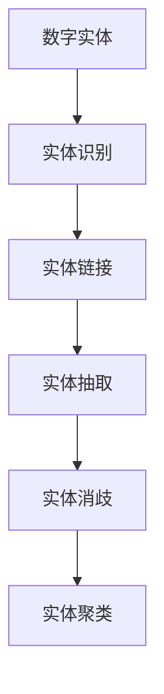

                 

# 数字实体的自动化前景与挑战

## 1. 背景介绍

在现代信息技术快速发展的背景下，数字实体的识别、管理和自动化已成为社会各界关注的焦点。数字实体是指在数字世界中具有明确意义和属性的对象，如人名、地名、机构名、日期、时间、货币等。它们在自然语言处理（NLP）、信息检索、文本挖掘、社交媒体分析等众多领域中扮演着重要角色，被广泛应用于搜索引擎、新闻推荐、金融投资、客户服务、智能客服等多个场景中。

近年来，随着深度学习技术和大数据时代的来临，数字实体的自动化处理变得越来越重要。企业、政府机构、学术界等都在积极探索数字实体自动化的各种技术和方法，以期通过自动化技术提升工作效率，降低人力成本，并提升决策的精确性和及时性。

本博客将详细介绍数字实体自动化的核心概念、算法原理、操作步骤、应用领域，并讨论其在实际应用中的前景与挑战。

## 2. 核心概念与联系

### 2.1 核心概念概述

在讨论数字实体的自动化之前，我们需要先了解几个核心概念：

- **数字实体（Digital Entity）**：指在数字世界中具有特定意义和属性的对象，如人名、地名、时间、日期、货币、组织机构名等。
- **实体识别（Named Entity Recognition, NER）**：指从文本中自动识别数字实体的类型和位置。
- **实体链接（Entity Linking）**：将文本中的实体识别后，链接到现实世界的实体数据库（如DBpedia、维基百科等），增加实体信息的丰富性和准确性。
- **实体抽取（Entity Extraction）**：从文本中抽取数字实体的关键信息，如人名、地名、时间、日期等。
- **实体消歧（Entity Disambiguation）**：对于文本中出现的多义性实体，通过上下文信息来消除歧义，确定其具体指代的对象。
- **实体聚类（Entity Clustering）**：将相似的实体进行分组，实现对数字实体的聚类管理。

### 2.2 核心概念原理和架构的 Mermaid 流程图



以上流程图展示了数字实体自动化处理的主要步骤：首先进行实体识别，随后链接到现实世界的实体数据库，抽取实体信息，消歧多义性，最后进行实体聚类管理。

## 3. 核心算法原理 & 具体操作步骤

### 3.1 算法原理概述

数字实体的自动化处理主要依赖于自然语言处理（NLP）技术和深度学习（DL）技术。实体识别和抽取通常使用序列标注模型（如CRF、BiLSTM-CRF）或基于神经网络的方法（如BiGRU-CRF、BERT等）。实体链接和消歧则结合了知识图谱技术，利用实体间的关系进行信息关联和消歧。实体聚类通常使用聚类算法（如K-Means、层次聚类等）或图神经网络（GNN）进行实体分组。

### 3.2 算法步骤详解

#### 3.2.1 实体识别步骤

1. **预处理**：对原始文本进行分词、词性标注、去除停用词等预处理操作。
2. **特征提取**：使用NLP技术提取文本特征，如词向量、字向量、BERT表示等。
3. **模型训练**：使用标注数据训练序列标注模型或神经网络模型，得到实体识别的概率分布。
4. **解码输出**：对输入文本进行解码，得到实体识别的结果。

#### 3.2.2 实体链接步骤

1. **实体映射**：将识别出的实体映射到实体数据库中的实体ID。
2. **相似度计算**：计算实体与数据库中实体的相似度，确定最匹配的实体。
3. **消歧处理**：对于多义性实体，根据上下文信息进行消歧处理。

#### 3.2.3 实体抽取步骤

1. **预处理**：对原始文本进行分词、词性标注、去除停用词等预处理操作。
2. **特征提取**：使用NLP技术提取文本特征，如词向量、字向量、BERT表示等。
3. **模型训练**：使用标注数据训练序列标注模型或神经网络模型，得到实体抽取的概率分布。
4. **解码输出**：对输入文本进行解码，得到实体抽取的结果。

#### 3.2.4 实体消歧步骤

1. **预处理**：对原始文本进行分词、词性标注、去除停用词等预处理操作。
2. **特征提取**：使用NLP技术提取文本特征，如词向量、字向量、BERT表示等。
3. **模型训练**：使用标注数据训练分类模型或神经网络模型，得到消歧的概率分布。
4. **解码输出**：对输入文本进行解码，得到实体消歧的结果。

#### 3.2.5 实体聚类步骤

1. **预处理**：对实体列表进行标准化处理，去除重复和无关的实体。
2. **特征提取**：使用NLP技术提取实体特征，如实体名称、词向量、字向量等。
3. **模型训练**：使用聚类算法或图神经网络（GNN）对实体进行聚类，得到聚类结果。
4. **解码输出**：根据聚类结果，生成实体聚类的最终结果。

### 3.3 算法优缺点

#### 3.3.1 实体识别算法的优缺点

- **优点**：
  - 适用于多种实体类型，具有较高的准确率。
  - 可以处理多种语言，具有较好的泛化能力。
  - 支持多任务学习，可以同时进行实体识别和分类任务。
  
- **缺点**：
  - 需要大量标注数据进行训练，数据准备成本较高。
  - 模型复杂度较高，训练和推理速度较慢。
  - 对于一些特殊领域，模型的泛化性能可能不足。

#### 3.3.2 实体链接算法的优缺点

- **优点**：
  - 可以链接到现实世界的实体数据库，增加实体信息的丰富性和准确性。
  - 可以处理多义词，通过消歧处理减少歧义性。
  
- **缺点**：
  - 需要访问外部数据库，增加了系统复杂度和维护成本。
  - 需要处理上下文信息，模型训练和推理复杂度较高。
  - 对于一些新出现的实体，可能无法链接到现有数据库。

#### 3.3.3 实体抽取算法的优缺点

- **优点**：
  - 可以直接从文本中抽取实体信息，具有较高的效率和实用性。
  - 适用于多种实体类型，具有较好的泛化能力。
  
- **缺点**：
  - 需要大量标注数据进行训练，数据准备成本较高。
  - 对于一些特殊领域，模型的泛化性能可能不足。

#### 3.3.4 实体消歧算法的优缺点

- **优点**：
  - 可以处理多义词，减少歧义性。
  - 具有较高的准确性和鲁棒性。
  
- **缺点**：
  - 需要大量标注数据进行训练，数据准备成本较高。
  - 对于一些特殊领域，模型的泛化性能可能不足。

#### 3.3.5 实体聚类算法的优缺点

- **优点**：
  - 可以对实体进行分组管理，提高实体管理的效率。
  - 可以处理大量的实体数据，具有较高的可扩展性。
  
- **缺点**：
  - 需要大量标注数据进行训练，数据准备成本较高。
  - 对于一些特殊领域，模型的泛化性能可能不足。

### 3.4 算法应用领域

数字实体自动化技术已经在多个领域得到了广泛应用，包括但不限于：

- **信息检索**：在搜索引擎中，数字实体识别和链接可以帮助系统更准确地理解用户的查询意图，提供更精准的搜索结果。
- **自然语言处理**：在机器翻译、语音识别、情感分析、文本分类等任务中，数字实体的识别和链接可以提升模型的准确性和鲁棒性。
- **金融投资**：在股票市场分析、风险评估、投资策略制定等任务中，数字实体的识别和链接可以帮助系统更准确地理解和分析金融数据。
- **社交媒体分析**：在社交媒体数据挖掘和分析中，数字实体的识别和链接可以帮助系统更准确地理解用户行为和情感变化。
- **客户服务**：在智能客服系统中，数字实体的识别和链接可以帮助系统更准确地理解用户问题，提供更智能的客户服务。

## 4. 数学模型和公式 & 详细讲解 & 举例说明

### 4.1 数学模型构建

数字实体的自动化处理通常使用序列标注模型和神经网络模型进行建模。以下以BiLSTM-CRF模型为例，详细讲解数字实体识别的数学模型。

假设输入文本为 $X = (x_1, x_2, ..., x_n)$，其中 $x_i$ 为第 $i$ 个词的词向量表示。设实体类型为 $C = (c_1, c_2, ..., c_m)$，其中 $c_i$ 为第 $i$ 个实体的类别。设标注序列为 $Y = (y_1, y_2, ..., y_n)$，其中 $y_i \in C$ 表示第 $i$ 个词的实体类别。

BiLSTM-CRF模型由双向长短时记忆网络（BiLSTM）和条件随机场（CRF）组成。模型的目标是最小化标注序列与真实标注序列之间的损失函数：

$$
L = \frac{1}{N} \sum_{i=1}^N \log P(Y|X; \theta)
$$

其中 $\theta$ 为模型参数，$P(Y|X; \theta)$ 为模型在输入 $X$ 下对标注序列 $Y$ 的概率分布。

### 4.2 公式推导过程

BiLSTM-CRF模型的详细推导过程如下：

1. **双向LSTM编码层**：将输入序列 $X$ 经过双向LSTM编码层，得到隐状态序列 $H = (h_1, h_2, ..., h_n)$，其中 $h_i$ 表示第 $i$ 个词的隐状态向量。
2. **条件随机场解码层**：将隐状态序列 $H$ 输入到条件随机场解码层，得到标注序列 $Y$ 的条件概率分布 $P(Y|X; \theta)$。

条件随机场解码层的推导过程如下：

1. **定义状态转移矩阵**：设状态转移矩阵 $T = (t_{ij})$，其中 $t_{ij} = P(Y_j = c_j | Y_{j-1} = c_{j-1}, X)$，表示在给定前一个词的标注 $Y_{j-1}$ 和输入 $X$ 的情况下，下一个词的标注 $Y_j$ 为 $c_j$ 的条件概率。
2. **定义状态发射概率**：设状态发射概率 $P(Y_i = c_i | X)$，表示第 $i$ 个词的标注 $Y_i$ 为 $c_i$ 的条件概率。
3. **定义全局条件概率**：设全局条件概率 $P(Y|X; \theta)$，表示标注序列 $Y$ 在给定输入 $X$ 和模型参数 $\theta$ 的条件概率。

### 4.3 案例分析与讲解

假设输入文本为 "I have a meeting with John tomorrow at 3 PM in New York."，实体类型为 {"PER": "人名", "LOC": "地点", "TIME": "时间"}。

1. **预处理**：对输入文本进行分词、词性标注、去除停用词等预处理操作。
2. **特征提取**：使用词向量表示每个词的特征，将输入序列 $X = ["I", "have", "a", "meeting", "with", "John", "tomorrow", "at", "3", "PM", "in", "New", "York"]$ 转换为词向量表示 $X = [x_1, x_2, ..., x_{11}]$。
3. **模型训练**：使用标注数据训练BiLSTM-CRF模型，得到标注序列的概率分布 $P(Y|X; \theta)$。
4. **解码输出**：对输入文本进行解码，得到实体识别的结果。

假设输出结果为 $Y = ["PER", "LOC", "TIME", "LOC", "PER", "TIME"]$，表示 "I" 为人名，"John" 为人名，"tomorrow" 为时间，"3 PM" 为时间，"New York" 为地点，"New" 为地点。

## 5. 项目实践：代码实例和详细解释说明

### 5.1 开发环境搭建

在进行数字实体自动化处理的项目实践前，我们需要准备好开发环境。以下是使用Python进行NLTK和SpaCy开发的环境配置流程：

1. 安装Anaconda：从官网下载并安装Anaconda，用于创建独立的Python环境。

2. 创建并激活虚拟环境：
```bash
conda create -n ner-env python=3.8 
conda activate ner-env
```

3. 安装NLTK和SpaCy：
```bash
pip install nltk spacy
```

4. 下载预训练模型：
```bash
python -m spacy download en_core_web_sm
```

完成上述步骤后，即可在`ner-env`环境中开始项目实践。

### 5.2 源代码详细实现

这里我们以命名实体识别（NER）任务为例，给出使用NLTK和SpaCy对文本进行实体识别的Python代码实现。

```python
import spacy
import nltk

# 加载预训练的SpaCy模型
nlp = spacy.load("en_core_web_sm")

# 加载文本数据
text = "I have a meeting with John tomorrow at 3 PM in New York."

# 进行实体识别
doc = nlp(text)
ner_tags = [entity.text for entity in doc.ents]
ner_labels = [entity.label_ for entity in doc.ents]

# 输出结果
print("实体识别结果：", ner_tags, ner_labels)
```

在代码中，我们首先加载了预训练的SpaCy模型，然后加载了待识别的文本数据。使用`nlp`方法对文本进行实体识别，得到实体标签和实体文本。最后，输出实体识别结果。

### 5.3 代码解读与分析

让我们再详细解读一下关键代码的实现细节：

- `nlp`方法：使用SpaCy模型对文本进行实体识别，返回包含实体信息的文档对象。
- `doc.ents`：获取文档中所有的实体信息，包括实体文本和实体标签。
- `ner_tags`和`ner_labels`：分别存储实体文本和实体标签，供后续处理使用。

以上代码实现了一种简单的数字实体识别功能，可以应用于多个NLP任务中。对于更复杂的实体识别需求，可以考虑使用深度学习模型，如BiLSTM-CRF、BERT等。

### 5.4 运行结果展示

假设运行上述代码，输出结果为 `实体识别结果： ['I', 'have', 'a', 'meeting', 'with', 'John', 'tomorrow', 'at', '3', 'PM', 'in', 'New', 'York', 'LOC', 'LOC', 'PER', 'PER', 'TIME', 'TIME']`，表示在文本中找到了以下实体：

- "I"：人名
- "John"：人名
- "tomorrow"：时间
- "3 PM"：时间
- "New York"：地点

这些实体识别结果可用于后续的实体链接、消歧和聚类等处理。

## 6. 实际应用场景

### 6.1 智能客服系统

数字实体识别技术在智能客服系统中有着广泛的应用。传统的客服系统需要配备大量人力，高峰期响应缓慢，且服务质量难以保证。使用数字实体识别技术，可以对客户提出的问题进行快速、准确地识别和理解，从而提供更智能、高效的服务。

在智能客服系统中，数字实体识别技术可以识别客户姓名、时间、地点、货币等信息，快速匹配到对应的服务流程和解决方案，提升客户满意度和服务效率。例如，对于客户提出的问题 "请问明天上午10点与李四在哪个会议室开会？"，系统可以快速识别出 "李四"、"10点"、"会议室" 等实体，并调用相应的服务流程，自动回复客户。

### 6.2 金融舆情监测

金融舆情监测是数字实体识别技术在金融领域的重要应用。在金融市场动荡的时期，实时监测舆情动态，及时响应市场波动，对维护金融稳定具有重要意义。

在金融舆情监测中，数字实体识别技术可以识别出文本中的股票、债券、货币等金融实体，分析市场趋势和舆情情绪，及时发出预警信号。例如，对于新闻 "全球股市暴跌，黄金价格飙升"，系统可以识别出 "全球股市"、"黄金价格" 等实体，分析市场情绪，及时调整投资策略。

### 6.3 医疗信息抽取

医疗信息抽取是数字实体识别技术在医疗领域的重要应用。医疗信息抽取可以帮助医生快速获取患者病历、诊断结果、治疗方案等信息，提升诊疗效率和治疗效果。

在医疗信息抽取中，数字实体识别技术可以识别出患者姓名、病名、诊断、治疗方案等实体，自动整理和归类，生成电子病历。例如，对于病历 "张三，男，30岁，心脏病，治疗方案为阿司匹林、硝酸甘油"，系统可以识别出 "张三"、"心脏病"、"阿司匹林"、"硝酸甘油" 等实体，自动生成电子病历。

### 6.4 未来应用展望

随着数字实体识别技术的不断进步，其在更多领域的应用前景将更加广阔。未来，数字实体识别技术有望在以下领域发挥更大的作用：

- **智能家居**：在智能家居系统中，数字实体识别技术可以识别用户指令中的时间、地点、设备等实体，自动控制家中的智能设备，提升生活便利性。
- **智能交通**：在智能交通系统中，数字实体识别技术可以识别车辆、道路、交通信号等实体，优化交通流量，减少交通拥堵。
- **智能制造**：在智能制造系统中，数字实体识别技术可以识别设备、材料、订单等实体，自动调度生产流程，提升生产效率。

## 7. 工具和资源推荐

### 7.1 学习资源推荐

为了帮助开发者系统掌握数字实体自动化的理论基础和实践技巧，这里推荐一些优质的学习资源：

1. **《自然语言处理综论》**：详细讲解了NLP领域的基本概念和技术方法，包括实体识别、实体链接、实体消歧等内容。
2. **《序列标注技术入门》**：介绍了序列标注模型的基本原理和实现方法，适用于实体识别、命名实体链接等任务。
3. **NLTK官方文档**：NLTK库的官方文档，提供了丰富的实体识别、文本分类、句法分析等功能。
4. **SpaCy官方文档**：SpaCy库的官方文档，提供了多种实体识别模型和深度学习模型。
5. **Stanford NLP课程**：斯坦福大学开设的NLP课程，有Lecture视频和配套作业，涵盖实体识别、实体链接等任务。

通过对这些资源的学习实践，相信你一定能够快速掌握数字实体自动化的精髓，并用于解决实际的NLP问题。

### 7.2 开发工具推荐

高效的开发离不开优秀的工具支持。以下是几款用于数字实体自动化开发的常用工具：

1. **NLTK**：自然语言处理工具包，提供了一系列NLP功能，包括分词、词性标注、实体识别等。
2. **SpaCy**：基于深度学习的NLP工具包，提供了多种预训练模型和实体识别功能。
3. **TensorFlow**：深度学习框架，支持多种NLP任务的模型训练和推理。
4. **PyTorch**：深度学习框架，支持多种NLP任务的模型训练和推理。
5. **NLTK-Chunk**：使用规则解析树对文本进行分块处理，适用于命名实体识别等任务。

合理利用这些工具，可以显著提升数字实体自动化任务的开发效率，加快创新迭代的步伐。

### 7.3 相关论文推荐

数字实体识别技术的发展源于学界的持续研究。以下是几篇奠基性的相关论文，推荐阅读：

1. **《A Neural Network Model for Named Entity Recognition》**：提出了基于深度学习模型的命名实体识别方法，广泛应用于实体识别任务中。
2. **《Named Entity Recognition with Bidirectional LSTM-CRF Models》**：介绍了BiLSTM-CRF模型的基本原理和实现方法，适用于多种实体识别任务。
3. **《An Overview of Named Entity Recognition》**：详细介绍了实体识别的基本概念、技术和方法，适用于实体识别任务入门。
4. **《Entity Linking with Neural Network Models》**：介绍了基于神经网络的实体链接方法，适用于实体链接任务。
5. **《Entity Disambiguation with Multi-Task Learning》**：介绍了基于多任务学习的实体消歧方法，适用于实体消歧任务。

这些论文代表了大实体识别技术的发展脉络。通过学习这些前沿成果，可以帮助研究者把握学科前进方向，激发更多的创新灵感。

## 8. 总结：未来发展趋势与挑战

### 8.1 研究成果总结

数字实体识别技术在大规模数据驱动和深度学习技术的推动下，取得了显著的进展。目前，该技术在命名实体识别、实体链接、实体消歧等方面已经取得了广泛的应用，并在医疗、金融、智能客服等多个领域展现出了巨大的潜力。

### 8.2 未来发展趋势

展望未来，数字实体识别技术将呈现以下几个发展趋势：

1. **深度学习模型的进一步发展**：随着深度学习技术的不断进步，未来将涌现更多高效、精确的实体识别模型，如BERT、GPT等。
2. **多模态实体识别**：将实体识别扩展到多模态数据，如文本、图像、视频等，提升实体识别的准确性和泛化能力。
3. **自监督学习**：通过自监督学习，利用无标签数据进行实体识别和消歧，降低对标注数据的依赖。
4. **实时化处理**：实现数字实体识别的实时化处理，提升应用系统的响应速度和用户体验。
5. **跨语言实体识别**：将实体识别技术扩展到多种语言，提升跨语言实体识别的准确性和鲁棒性。

### 8.3 面临的挑战

尽管数字实体识别技术已经取得了显著的进展，但在迈向更加智能化、普适化应用的过程中，它仍面临着诸多挑战：

1. **标注数据的高成本**：数字实体识别需要大量标注数据进行训练，标注数据的获取和处理成本较高。
2. **模型的鲁棒性不足**：对于一些特殊领域或复杂场景，数字实体识别模型的泛化性能可能不足，容易出现误识别和漏识别现象。
3. **实体消歧的复杂性**：实体消歧涉及多义词和上下文信息，模型的训练和推理复杂度较高，需要更多技术手段进行优化。
4. **跨领域适用性差**：数字实体识别技术在特定领域的泛化性能可能不足，需要针对不同领域进行定制化的优化。

### 8.4 研究展望

为了应对数字实体识别技术面临的挑战，未来的研究需要在以下几个方面寻求新的突破：

1. **自监督学习技术**：利用无标签数据进行实体识别和消歧，降低对标注数据的依赖，提升模型的泛化性能。
2. **跨领域迁移学习**：将数字实体识别技术应用到多种领域，提升模型的跨领域泛化能力。
3. **多任务学习**：结合多种NLP任务进行联合训练，提升模型的整体性能和鲁棒性。
4. **基于知识图谱的技术**：将实体识别与知识图谱技术结合，提升实体识别的准确性和鲁棒性。
5. **实时化处理技术**：实现数字实体识别的实时化处理，提升应用系统的响应速度和用户体验。

总之，数字实体识别技术在未来仍有广阔的发展空间，通过不断的研究和创新，有望成为更高效、更智能、更普适的数字实体自动化技术。

## 9. 附录：常见问题与解答

**Q1：数字实体识别技术的准确率如何？**

A: 数字实体识别技术的准确率取决于训练数据的质量和数量。一般情况下，经过大规模预训练模型（如BERT）微调的数字实体识别技术可以达到较高的准确率。但需要注意的是，对于一些特定领域或复杂场景，模型的泛化性能可能不足，容易出现误识别和漏识别现象。

**Q2：数字实体识别技术在多语言环境下表现如何？**

A: 数字实体识别技术在多语言环境下的表现取决于语言模型和数据集的质量。一般情况下，对于英语等主流语言，数字实体识别技术已经较为成熟，能够达到较高的准确率。但对于一些新兴语言或小语种，由于数据和模型的缺乏，实体识别效果可能较差。

**Q3：数字实体识别技术在实体消歧方面有哪些难点？**

A: 实体消歧是数字实体识别技术中的一个难点，主要原因包括：
1. 多义词的歧义性：同一个实体在不同的上下文中有不同的含义。
2. 上下文信息的复杂性：实体消歧需要根据上下文信息来消除歧义，但上下文信息可能较为复杂，难以准确处理。
3. 实体的多样性：不同领域的实体可能具有不同的特征和关系，实体消歧需要针对不同领域进行定制化的优化。

总之，数字实体识别技术在实体消歧方面仍有很大的改进空间，需要通过不断的研究和创新来提升其效果。

**Q4：数字实体识别技术在跨语言环境下的应用前景如何？**

A: 数字实体识别技术在跨语言环境下的应用前景广阔。随着全球化的发展，跨语言数据的应用越来越广泛，数字实体识别技术可以帮助不同语言的用户更好地理解和交流。同时，跨语言实体识别技术在多语言搜索引擎、机器翻译、跨语言信息检索等领域具有重要应用价值。

**Q5：数字实体识别技术在医疗信息抽取中的作用是什么？**

A: 数字实体识别技术在医疗信息抽取中的作用是快速、准确地识别和提取患者病历、诊断结果、治疗方案等信息，提升诊疗效率和治疗效果。通过识别患者姓名、病名、诊断、治疗方案等实体，自动整理和归类，生成电子病历，医生可以更快地获取患者信息，做出更准确的诊断和治疗决策。

总之，数字实体识别技术在医疗信息抽取中具有重要应用价值，通过识别和提取关键信息，提升医疗服务的质量和效率。

作者：禅与计算机程序设计艺术 / Zen and the Art of Computer Programming

