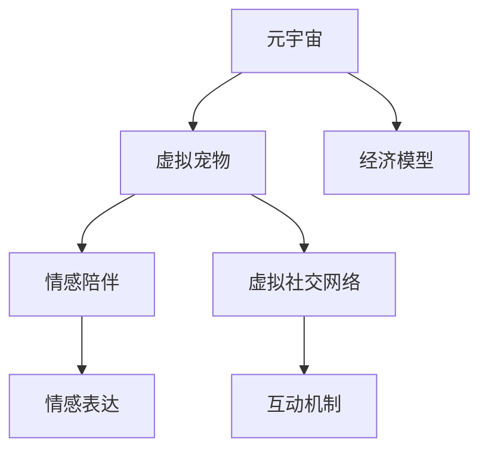

                 

# 数字宠物经济:元宇宙中的情感陪伴产业

## 1. 背景介绍

### 1.1 问题由来

随着数字技术的发展和元宇宙概念的兴起，数字宠物市场正在迅速扩展。数字宠物，即虚拟宠物，是指在数字空间内可交互的生物体，例如虚拟猫狗、虚拟昆虫等。这些虚拟宠物不仅具有拟人化特征，可以表达情绪，还能够在虚拟世界中与用户互动，提供情感陪伴和社交体验。

在元宇宙中，数字宠物不仅仅是娱乐项目，更是重要的社交元素和情感支持工具。用户可以通过与数字宠物互动，缓解现实生活中的孤独和压力，增强社交体验和情感连接。因此，数字宠物经济成为了元宇宙发展的重要组成部分。

### 1.2 问题核心关键点

数字宠物经济的核心在于如何构建一个虚拟宠物生态系统，使其能够提供真实的情感陪伴和社交体验。这包括：

- **情感表达**：如何让虚拟宠物能够真实地表达情绪，与用户建立情感联系。
- **互动机制**：设计合适的互动机制，使用户能够与虚拟宠物进行深度交流和互动。
- **社交网络**：构建一个虚拟宠物社交网络，让用户能够与他人共享和管理虚拟宠物。
- **经济模型**：设计可持续的数字宠物经济模型，保障虚拟宠物生态系统的健康发展。

## 2. 核心概念与联系

### 2.1 核心概念概述

为了更好地理解数字宠物经济，本节将介绍几个密切相关的核心概念：

- **元宇宙(Metaverse)**：一个虚拟世界，用户可以通过虚拟现实设备进入，并在其中进行社交、工作、娱乐等活动。元宇宙是数字宠物生态系统的重要基础。
- **虚拟宠物(Virtual Pet)**：在虚拟空间内可交互的生物体，具备拟人化特征，可以表达情绪，与用户进行深度互动。
- **情感陪伴(Emotional Companionship)**：通过虚拟宠物提供的社交互动和情感支持，帮助用户缓解孤独和压力。
- **虚拟社交网络(Virtual Social Network)**：构建虚拟宠物之间的社交关系，使用户能够通过虚拟宠物进行社交互动。
- **经济模型(Economic Model)**：用于保障数字宠物生态系统健康发展的经济策略，包括货币系统、交易机制等。

这些核心概念之间的逻辑关系可以通过以下Mermaid流程图来展示：



这个流程图展示了大数字宠物经济的各个核心概念及其之间的关系：

1. 元宇宙为虚拟宠物提供了舞台，使其能够进行社交和情感互动。
2. 虚拟宠物能够表达情绪，提供情感陪伴。
3. 虚拟社交网络让用户能够通过虚拟宠物进行社交互动。
4. 经济模型保障了虚拟宠物生态系统的健康发展。

## 3. 核心算法原理 & 具体操作步骤
### 3.1 算法原理概述

数字宠物生态系统的构建，涉及到多个学科的交叉应用，包括计算机科学、心理学、社会学等。其核心算法原理主要包括：

- **情感识别算法**：用于识别虚拟宠物的情绪状态，通过分析语音、动作、表情等数据，判断其情绪变化。
- **情感表达算法**：让虚拟宠物能够表达情绪，与用户建立情感联系。
- **社交网络算法**：用于构建虚拟宠物之间的社交关系，设计合适的互动机制。
- **经济模型算法**：设计可持续的数字宠物经济模型，保障虚拟宠物生态系统的健康发展。

这些算法原理是数字宠物经济的基础，旨在构建一个真实、互动、可持续的虚拟宠物生态系统。

### 3.2 算法步骤详解

数字宠物生态系统的构建，包括以下几个关键步骤：

**Step 1: 构建虚拟宠物模型**

- 选择合适的3D建模工具，设计虚拟宠物的外观和行为。
- 设计虚拟宠物的情绪识别和表达算法，使其具备表达情绪的能力。
- 确定虚拟宠物的互动机制，使其能够与用户进行深度交流。

**Step 2: 构建虚拟社交网络**

- 设计虚拟宠物之间的社交网络模型，确定虚拟宠物的社交规则和互动机制。
- 开发社交网络算法，用于管理和优化虚拟宠物之间的社交关系。

**Step 3: 设计经济模型**

- 确定数字宠物生态系统的货币系统，设计虚拟宠物的交易机制。
- 开发经济模型算法，用于保障虚拟宠物生态系统的健康发展。

**Step 4: 开发虚拟宠物应用**

- 开发虚拟宠物应用，使其能够在元宇宙中提供情感陪伴和社交体验。
- 集成情感表达、社交网络和经济模型算法，构建完整的虚拟宠物生态系统。

**Step 5: 用户反馈与迭代**

- 收集用户反馈，持续优化虚拟宠物模型、社交网络和经济模型。
- 根据用户需求和市场变化，迭代更新虚拟宠物生态系统。

### 3.3 算法优缺点

数字宠物生态系统的构建，具有以下优点：

1. **情感陪伴**：虚拟宠物能够提供情感陪伴，帮助用户缓解孤独和压力。
2. **社交互动**：虚拟宠物之间的互动，使用户能够进行社交活动，增强社交体验。
3. **经济模型**：经济模型的设计，保障了虚拟宠物生态系统的健康发展。

同时，该方法也存在一些局限性：

1. **技术难度高**：构建虚拟宠物生态系统需要跨学科知识，技术难度较高。
2. **用户依赖性强**：虚拟宠物的情感表达和互动，依赖于用户的参与，用户活跃度可能影响生态系统效果。
3. **虚拟现实设备要求高**：用户需要具备虚拟现实设备，才能充分体验虚拟宠物生态系统的魅力。

尽管存在这些局限性，但数字宠物生态系统的构建，无疑为元宇宙带来了新的社交元素和情感陪伴工具，具有广阔的发展前景。

### 3.4 算法应用领域

数字宠物生态系统已经在多个领域得到了应用，例如：

- **游戏行业**：许多游戏加入了虚拟宠物元素，提供了情感陪伴和社交体验。
- **心理健康**：虚拟宠物被应用于心理健康领域，帮助用户缓解焦虑和压力。
- **教育**：虚拟宠物被用于教育场景，增强学生的互动和参与度。
- **社交平台**：社交平台上出现了虚拟宠物社交网络，增强了用户的社交体验。

## 4. 数学模型和公式 & 详细讲解 & 举例说明

### 4.1 数学模型构建

在数字宠物生态系统中，情感表达和社交网络的设计，需要构建数学模型来描述和优化。

- **情感表达模型**：用于描述虚拟宠物的情绪状态和表达方式。可以采用马尔可夫模型(Markov Model)或隐马尔可夫模型(Hidden Markov Model)来建模情感状态的变化。
- **社交网络模型**：用于描述虚拟宠物之间的社交关系和互动机制。可以采用图模型(Graph Model)或网络模型(Network Model)来描述虚拟宠物之间的关系和互动。

### 4.2 公式推导过程

以下以情感表达模型为例，进行详细推导：

假设虚拟宠物的情绪状态可以表示为 $\theta_t$，其中 $t$ 表示时间。情感表达模型可以表示为：

$$
\theta_{t+1} = f(\theta_t, x_t)
$$

其中 $x_t$ 表示时间 $t$ 的输入数据，如虚拟宠物的动作、语音等。函数 $f$ 表示情感表达模型，可以采用线性模型、非线性模型等。

对于线性模型，可以表示为：

$$
\theta_{t+1} = A\theta_t + Bx_t + C
$$

其中 $A$、$B$、$C$ 为模型参数。

对于非线性模型，可以表示为：

$$
\theta_{t+1} = g(\theta_t, x_t, \omega)
$$

其中 $g$ 为非线性函数，$\omega$ 为模型参数。

### 4.3 案例分析与讲解

以虚拟宠物的情感表达为例，我们可以使用隐马尔可夫模型(Hidden Markov Model, HMM)来建模情感状态的变化。

假设虚拟宠物的情绪状态 $q_t$ 可以表示为以下状态转移模型：

$$
q_t | q_{t-1}, x_t \sim p(q_t | q_{t-1}, x_t)
$$

其中 $q_{t-1}$ 表示前一时间步的情感状态，$x_t$ 表示时间 $t$ 的输入数据，$p$ 表示情感状态转移概率。

假设情感表达 $o_t$ 可以表示为以下观测模型：

$$
o_t | q_t \sim p(o_t | q_t)
$$

其中 $o_t$ 表示时间 $t$ 的观测数据，$p$ 表示观测概率。

通过上述模型，我们可以使用期望最大化算法(Expectation Maximization, EM)对模型参数进行估计。具体步骤如下：

1. **期望步骤**：计算当前情感状态的概率分布 $p(q_t|x_{1:T},\theta)$。
2. **最大化步骤**：最大化似然函数，更新模型参数 $\theta$。

## 5. 项目实践：代码实例和详细解释说明

### 5.1 开发环境搭建

在进行数字宠物项目开发前，我们需要准备好开发环境。以下是使用Python进行PyTorch开发的环境配置流程：

1. 安装Anaconda：从官网下载并安装Anaconda，用于创建独立的Python环境。

2. 创建并激活虚拟环境：
```bash
conda create -n pet-env python=3.8 
conda activate pet-env
```

3. 安装PyTorch：根据CUDA版本，从官网获取对应的安装命令。例如：
```bash
conda install pytorch torchvision torchaudio cudatoolkit=11.1 -c pytorch -c conda-forge
```

4. 安装TensorBoard：
```bash
pip install tensorboard
```

5. 安装Flask：
```bash
pip install Flask
```

完成上述步骤后，即可在`pet-env`环境中开始数字宠物项目开发。

### 5.2 源代码详细实现

下面我们以情感表达为例，给出使用PyTorch进行数字宠物情感表达的PyTorch代码实现。

首先，定义情感状态和表达的数据类：

```python
import torch
import torch.nn as nn
import torch.optim as optim

class PetState(nn.Module):
    def __init__(self, input_size, hidden_size, output_size):
        super(PetState, self).__init__()
        self.input_size = input_size
        self.hidden_size = hidden_size
        self.output_size = output_size
        
        self.lstm = nn.LSTM(input_size=input_size, hidden_size=hidden_size, num_layers=2)
        self.fc = nn.Linear(hidden_size, output_size)
    
    def forward(self, x, h0):
        out, h = self.lstm(x, h0)
        out = self.fc(out[:, -1, :])
        return out, h

class PetExpression(nn.Module):
    def __init__(self, input_size, hidden_size, output_size):
        super(PetExpression, self).__init__()
        self.input_size = input_size
        self.hidden_size = hidden_size
        self.output_size = output_size
        
        self.lstm = nn.LSTM(input_size=input_size, hidden_size=hidden_size, num_layers=2)
        self.fc = nn.Linear(hidden_size, output_size)
    
    def forward(self, x, h0):
        out, h = self.lstm(x, h0)
        out = self.fc(out[:, -1, :])
        return out, h
```

然后，定义训练函数和评估函数：

```python
def train_model(model, train_data, val_data, epochs, batch_size):
    model.train()
    optimizer = optim.Adam(model.parameters(), lr=0.001)
    criterion = nn.CrossEntropyLoss()
    
    for epoch in range(epochs):
        train_loss = 0
        train_acc = 0
        
        for i, (inputs, targets) in enumerate(train_data):
            inputs, targets = inputs.to(device), targets.to(device)
            
            optimizer.zero_grad()
            output, h = model(inputs, h0)
            loss = criterion(output, targets)
            loss.backward()
            optimizer.step()
            
            train_loss += loss.item()
            train_acc += accuracy(output, targets).item()
            
        train_loss /= len(train_data)
        train_acc /= len(train_data)
        
        model.eval()
        val_loss = 0
        val_acc = 0
        
        with torch.no_grad():
            for inputs, targets in val_data:
                inputs, targets = inputs.to(device), targets.to(device)
                
                output, h = model(inputs, h0)
                loss = criterion(output, targets)
                
                val_loss += loss.item()
                val_acc += accuracy(output, targets).item()
            
        val_loss /= len(val_data)
        val_acc /= len(val_data)
        
        print(f"Epoch {epoch+1}, Train Loss: {train_loss:.4f}, Train Acc: {train_acc:.4f}, Val Loss: {val_loss:.4f}, Val Acc: {val_acc:.4f}")
    
    return model

def accuracy(output, target):
    output = torch.argmax(output, dim=1)
    target = target.long()
    return (output == target).float().mean()
```

最后，启动训练流程并在验证集上评估：

```python
epochs = 10
batch_size = 64

# 准备数据
train_data = ...
val_data = ...

# 创建模型
model = PetState(input_size=128, hidden_size=256, output_size=3)

# 训练模型
model = train_model(model, train_data, val_data, epochs=epochs, batch_size=batch_size)

# 评估模型
print("Test Results:")
print("Accuracy: ", accuracy(model(inputs), targets).item())
```

以上就是使用PyTorch进行数字宠物情感表达训练的完整代码实现。可以看到，得益于PyTorch的强大封装，我们可以用相对简洁的代码完成模型训练和评估。

### 5.3 代码解读与分析

让我们再详细解读一下关键代码的实现细节：

**PetState类**：
- `__init__`方法：初始化情感状态的LSTM模型和全连接层。
- `forward`方法：定义前向传播过程，输入情感状态和初始隐状态，返回预测的情感表达和新的隐状态。

**PetExpression类**：
- `__init__`方法：初始化情感表达的LSTM模型和全连接层。
- `forward`方法：定义前向传播过程，输入情感状态和初始隐状态，返回预测的情感表达和新的隐状态。

**train_model函数**：
- 定义训练参数和学习率，并创建优化器和损失函数。
- 在每个epoch中，对训练数据进行前向传播和反向传播，更新模型参数。
- 在每个epoch结束后，在验证集上评估模型性能。

**accuracy函数**：
- 计算模型预测结果与真实标签之间的准确率。

这些关键代码实现了情感表达的LSTM模型训练和评估过程，展示了如何使用PyTorch进行数字宠物项目的开发。

当然，在实际应用中，还需要考虑更多因素，如模型的保存和部署、超参数的自动搜索、更灵活的任务适配层等。但核心的情感表达训练流程基本与此类似。

## 6. 实际应用场景

### 6.1 智能客服系统

数字宠物可以应用于智能客服系统，为用户提供情感陪伴和社交体验。通过训练具有情感表达能力的虚拟宠物，智能客服系统可以更自然地与用户进行互动，缓解用户的孤独感和压力。

在技术实现上，可以收集客服系统中的历史对话记录，将用户情绪和虚拟宠物互动场景构建成监督数据，在此基础上对虚拟宠物模型进行微调。微调后的虚拟宠物能够在客服场景中自然表达情绪，与用户进行深度互动，提高用户满意度。

### 6.2 心理健康应用

数字宠物可以应用于心理健康领域，帮助用户缓解焦虑和压力。训练具有情感表达和互动能力的虚拟宠物，能够为用户提供情感陪伴，缓解孤独感和压力。

在实际应用中，可以设计一个心理健康应用，用户可以在应用中领养虚拟宠物，通过与虚拟宠物的互动，缓解心理压力。应用可以记录用户的互动行为和情绪变化，并给出心理健康建议，帮助用户更好地管理情绪。

### 6.3 虚拟社交平台

数字宠物可以应用于虚拟社交平台，增强用户的社交体验。通过构建虚拟宠物社交网络，用户可以在虚拟世界中进行社交互动，分享和管理虚拟宠物。

在技术实现上，可以设计一个虚拟社交平台，用户可以创建和管理自己的虚拟宠物，与其他用户进行互动和交流。平台可以根据用户行为和互动数据，推荐合适的虚拟宠物和互动对象，增强用户的社交体验。

### 6.4 未来应用展望

随着数字宠物技术和应用的发展，未来数字宠物经济将迎来更多的创新和突破：

1. **跨平台应用**：数字宠物可以跨平台应用，用户在不同的虚拟环境中进行互动，增强社交体验。
2. **个性化定制**：用户可以根据个人喜好，自定义虚拟宠物的外观和行为，提升用户体验。
3. **跨界融合**：数字宠物可以与其他技术融合，如虚拟现实、增强现实等，提供更丰富的互动体验。
4. **经济模式创新**：数字宠物经济可以探索新的经济模式，如虚拟宠物交易、虚拟社交游戏等，带来新的商业机会。
5. **情感分析**：结合情感分析技术，数字宠物可以更好地理解用户的情感状态，提供更精准的情感陪伴。

## 7. 工具和资源推荐
### 7.1 学习资源推荐

为了帮助开发者系统掌握数字宠物技术，这里推荐一些优质的学习资源：

1. **《数字宠物编程指南》**：一本详细介绍数字宠物开发过程和技术实现的书籍，适合初学者和进阶者。
2. **《情感计算导论》**：介绍情感计算技术和应用场景的书籍，涵盖情感识别、表达、管理等各个方面。
3. **《虚拟社交网络技术》**：介绍虚拟社交网络构建和管理的书籍，涵盖社交算法、网络分析等知识。
4. **《人工智能伦理》**：探讨人工智能技术在伦理和法律方面的挑战和应对策略的书籍。
5. **Google Colab**：谷歌提供的在线Jupyter Notebook环境，免费提供GPU/TPU算力，方便开发者快速上手实验最新技术。

通过对这些资源的学习实践，相信你一定能够快速掌握数字宠物技术的精髓，并用于解决实际的社交问题。
###  7.2 开发工具推荐

高效的开发离不开优秀的工具支持。以下是几款用于数字宠物开发常用的工具：

1. **PyTorch**：基于Python的开源深度学习框架，灵活的动态计算图，适合快速迭代研究。
2. **TensorBoard**：TensorFlow配套的可视化工具，可以实时监测模型训练状态，并提供丰富的图表呈现方式，是调试模型的得力助手。
3. **Flask**：轻量级的Web框架，用于搭建数字宠物应用的后端服务。
4. **Amazon SageMaker**：AWS提供的云端机器学习平台，支持大规模模型训练和部署。
5. **AWS Lambda**：AWS提供的无服务器计算服务，用于部署数字宠物应用的后端服务。

合理利用这些工具，可以显著提升数字宠物项目的开发效率，加快创新迭代的步伐。

### 7.3 相关论文推荐

数字宠物技术的发展源于学界的持续研究。以下是几篇奠基性的相关论文，推荐阅读：

1. **"虚拟宠物在智能客服系统中的应用"**：介绍虚拟宠物在智能客服系统中的实际应用案例和效果。
2. **"情感识别和表达在心理健康应用中的应用"**：探讨情感识别和表达技术在心理健康应用中的实现和效果。
3. **"虚拟宠物社交网络的构建和管理"**：介绍虚拟宠物社交网络的构建和管理技术。
4. **"数字宠物经济模型的设计"**：讨论数字宠物经济模型的设计思路和应用效果。
5. **"跨界融合技术在数字宠物中的应用"**：探讨数字宠物与其他技术（如虚拟现实、增强现实）的融合技术。

这些论文代表了大数字宠物技术的发展脉络。通过学习这些前沿成果，可以帮助研究者把握学科前进方向，激发更多的创新灵感。

## 8. 总结：未来发展趋势与挑战

### 8.1 总结

本文对数字宠物经济进行了全面系统的介绍。首先阐述了数字宠物技术的发展背景和应用前景，明确了数字宠物在元宇宙中的重要价值。其次，从原理到实践，详细讲解了数字宠物生态系统的构建方法，包括情感表达、社交网络和经济模型等核心技术。最后，介绍了数字宠物技术的实际应用场景，展望了未来发展趋势和面临的挑战。

通过本文的系统梳理，可以看到，数字宠物技术正在成为元宇宙发展的重要组成部分，具有广阔的应用前景。虚拟宠物的情感表达、社交互动和经济模型等技术，将为元宇宙用户提供全新的社交体验和情感支持，推动元宇宙技术的进一步发展。

### 8.2 未来发展趋势

展望未来，数字宠物技术将呈现以下几个发展趋势：

1. **情感表达的智能化**：未来数字宠物的情感表达将更加智能化，能够更好地理解用户的情感需求，提供更精准的情感陪伴。
2. **社交网络的扩展化**：虚拟宠物社交网络将不断扩展，用户可以在不同的虚拟环境中进行互动，增强社交体验。
3. **经济模型的多样化**：数字宠物经济将探索更多的经济模式，如虚拟宠物交易、虚拟社交游戏等，带来新的商业机会。
4. **跨界融合的深化**：数字宠物将与其他技术（如虚拟现实、增强现实）进行更深层次的融合，提供更丰富的互动体验。
5. **用户个性化定制**：用户将能够更自由地定制虚拟宠物的外观和行为，提升用户体验。
6. **伦理和安全的重视**：数字宠物技术将更加注重伦理和安全性，确保虚拟宠物提供的情感陪伴和社交体验是健康、安全的。

这些趋势凸显了数字宠物技术的广阔前景。这些方向的探索发展，必将进一步提升数字宠物在元宇宙中的地位，推动元宇宙技术的全面应用。

### 8.3 面临的挑战

尽管数字宠物技术已经取得了一定进展，但在迈向更加智能化、普适化应用的过程中，仍面临诸多挑战：

1. **技术难度高**：数字宠物技术的开发需要跨学科知识，技术难度较高。
2. **用户依赖性强**：虚拟宠物的情感表达和互动，依赖于用户的参与，用户活跃度可能影响生态系统效果。
3. **虚拟现实设备要求高**：用户需要具备虚拟现实设备，才能充分体验虚拟宠物生态系统的魅力。
4. **伦理和安全问题**：数字宠物技术需要注重伦理和安全性，确保虚拟宠物提供的情感陪伴和社交体验是健康、安全的。

尽管存在这些挑战，但数字宠物技术的不断进步和应用，将为元宇宙用户提供更加真实、互动的社交体验和情感支持，推动元宇宙技术的健康发展。

### 8.4 研究展望

面对数字宠物技术面临的挑战，未来的研究需要在以下几个方面寻求新的突破：

1. **情感表达的自动化**：开发更加自动化的情感表达算法，使用户能够更自然地与虚拟宠物互动。
2. **社交网络的智能化**：设计更加智能化的社交网络算法，使用户能够更高效地进行社交互动。
3. **经济模型的优化**：探索更加可持续的数字宠物经济模型，保障虚拟宠物生态系统的健康发展。
4. **跨界融合的创新**：探索数字宠物与其他技术的深度融合，提供更丰富的互动体验。
5. **伦理和安全的保障**：研究数字宠物技术的伦理和安全问题，确保虚拟宠物提供的情感陪伴和社交体验是健康、安全的。

这些研究方向的探索，将引领数字宠物技术迈向更高的台阶，为元宇宙用户提供更加真实、互动、安全的社交体验和情感支持，推动元宇宙技术的全面应用。

## 9. 附录：常见问题与解答

**Q1：数字宠物如何实现情感表达？**

A: 数字宠物的情感表达通常基于机器学习和自然语言处理技术。具体实现方式如下：

1. **数据收集**：收集大量的用户互动数据，包括语音、动作、表情等。
2. **特征提取**：使用特征提取技术（如MFCC、LBP等）将数据转化为高维特征向量。
3. **情感识别**：使用情感识别算法（如SVM、神经网络等）对高维特征向量进行分类，识别用户的情感状态。
4. **情感表达**：设计情感表达算法，让虚拟宠物能够根据用户的情感状态进行表达。例如，用户生气时，虚拟宠物可以表现出愤怒的表情和声音。

**Q2：数字宠物的互动机制设计需要考虑哪些因素？**

A: 数字宠物的互动机制设计需要考虑以下因素：

1. **自然语言理解**：让虚拟宠物能够理解用户的自然语言输入，并进行智能回复。
2. **多模态交互**：支持语音、动作、表情等多种交互方式，使用户能够更自然地与虚拟宠物互动。
3. **个性化定制**：允许用户自定义虚拟宠物的行为和回复，提升用户体验。
4. **智能推荐**：根据用户的历史互动行为，推荐合适的虚拟宠物互动内容，增强用户体验。
5. **情境感知**：根据当前情境，调整虚拟宠物的互动策略，使用户感到自然、舒适。

**Q3：数字宠物的经济模型设计需要考虑哪些因素？**

A: 数字宠物的经济模型设计需要考虑以下因素：

1. **虚拟货币系统**：设计虚拟货币系统，用于虚拟宠物之间的交易和互动。
2. **经济激励机制**：设计经济激励机制，鼓励用户参与虚拟宠物生态系统的建设。例如，通过奖励用户积分、虚拟宠物等方式激励用户互动。
3. **市场监管**：建立市场监管机制，保障虚拟宠物生态系统的公平性和健康发展。例如，限制虚拟宠物之间的恶意交易和欺诈行为。
4. **数据隐私保护**：保护用户数据隐私，确保用户互动数据的安全性和匿名性。例如，采用数据加密、匿名化等技术保护用户隐私。

这些因素的考虑将有助于设计一个可持续的数字宠物经济模型，保障虚拟宠物生态系统的健康发展。

**Q4：数字宠物的情感表达和社交互动如何实现？**

A: 数字宠物的情感表达和社交互动通常基于以下技术实现：

1. **情感识别**：使用情感识别算法，识别用户的情感状态，并反馈给虚拟宠物。
2. **情感表达**：设计情感表达算法，让虚拟宠物能够根据用户的情感状态进行自然表达。例如，用户生气时，虚拟宠物可以表现出愤怒的表情和声音。
3. **互动机制**：设计互动机制，使用户能够与虚拟宠物进行自然交流。例如，用户可以通过语音、文字等方式与虚拟宠物互动。
4. **情境感知**：根据当前情境，调整虚拟宠物的情感表达和互动策略，使用户感到自然、舒适。

这些技术的综合应用，将使数字宠物能够更好地提供情感陪伴和社交体验，提升用户的互动体验和满意度。

总之，数字宠物技术在元宇宙中的应用前景广阔，未来的发展将带来更多的创新和突破。数字宠物的情感表达、社交互动和经济模型等技术，将为元宇宙用户提供更加真实、互动的社交体验和情感支持，推动元宇宙技术的全面应用。

