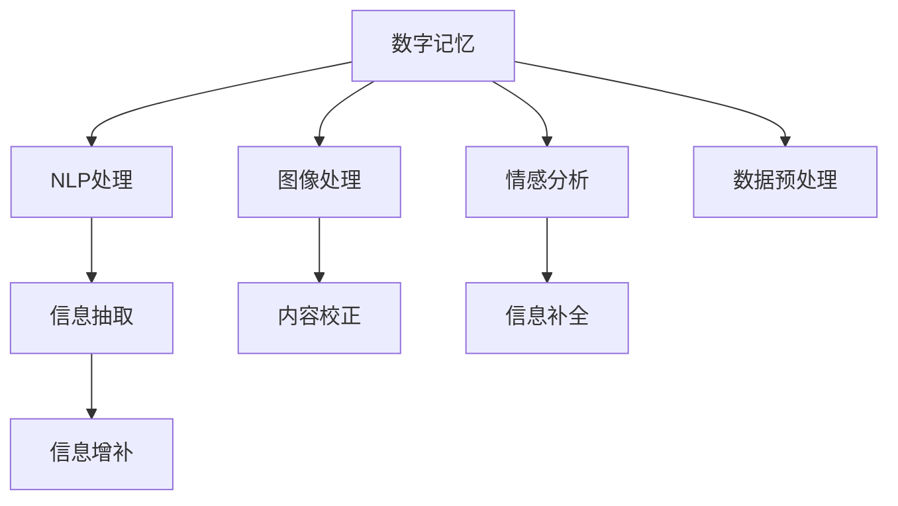

                 

## 1. 背景介绍

### 1.1 问题由来
随着数字技术的快速发展，人们的生活日益数字化，产生了海量的数字记忆。这些数字记忆不仅是个人回忆的载体，也是社会、文化、历史的记录。然而，数字记忆的数字化、碎片化特征也带来了诸多挑战，如信息过载、数据丢失、隐私泄漏等。如何在数字化时代有效管理和利用数字记忆，成为了当前研究的热点。

数字记忆重构技术通过AI辅助的方式，对数字化记忆进行整理、分析和编辑，使其更加完整、准确、可理解。这种技术在个人回忆、企业档案、历史研究、法律证据等多个领域具有广泛的应用前景。

### 1.2 问题核心关键点
数字记忆重构的核心在于如何高效利用AI技术，挖掘数字记忆的隐含信息，进行恢复、校正、增补等操作。具体来说，包括以下几个关键点：

1. **数据预处理**：对数字记忆进行清洗、归一化、结构化等预处理操作，保证输入数据的质量。
2. **信息抽取**：利用NLP、图像处理等技术，从数字记忆中自动抽取关键信息，如文本、图片、视频等。
3. **内容校正**：对抽取的信息进行校正、去伪存真，确保信息的准确性。
4. **信息增补**：填补数字记忆中的空白信息，通过预测、补全等技术手段，增加信息的完整度。
5. **情感分析**：对数字记忆进行情感分析，提取其中的情感信息，丰富记忆的内涵。

### 1.3 问题研究意义
数字记忆重构技术对个人和社会的意义重大：

1. **个人记忆的完整性**：通过修复数字记忆，使得个人回忆更加完整、准确。
2. **社会记忆的连贯性**：帮助社会构建更连贯、连续的记忆体系，传承文化、历史。
3. **信息检索的高效性**：提高信息检索的准确度和效率，减少信息查找的难度。
4. **隐私保护**：在数字记忆重构过程中，可以发现并删除敏感信息，保护个人隐私。

## 2. 核心概念与联系

### 2.1 核心概念概述

为更好地理解数字记忆重构技术，本节将介绍几个密切相关的核心概念：

- **数字记忆**：以数字形式存在的个人、组织、社会的记忆记录，包括文本、图片、视频等。
- **数字记忆重构**：通过AI技术对数字记忆进行整理、分析和编辑，使其更加完整、准确、可理解。
- **NLP**：自然语言处理（Natural Language Processing），利用计算机技术处理和分析人类语言。
- **图像处理**：对图片进行自动分析、校正、增强等处理，提取图片中的关键信息。
- **情感分析**：通过文本分析，提取文本中的情感信息，用于增强记忆的情感色彩。
- **信息补全**：利用机器学习技术，预测缺失信息，填补数字记忆中的空白。

这些核心概念之间的逻辑关系可以通过以下Mermaid流程图来展示：



这个流程图展示了大规模数字记忆处理的整体流程：

1. 对数字记忆进行预处理，清洗和结构化输入数据。
2. 利用NLP技术自动抽取文本信息。
3. 对图片进行自动分析和校正。
4. 利用情感分析提取文本中的情感信息。
5. 对抽取的信息进行校正和增补。

这些步骤共同构成了数字记忆重构的核心流程，使得数字记忆更加完整、准确、可理解。

## 3. 核心算法原理 & 具体操作步骤
### 3.1 算法原理概述

数字记忆重构的核心算法原理是利用AI技术，对数字记忆进行自动处理和编辑。其核心思想是：将数字记忆视为一个信息库，通过一系列预处理和处理算法，自动恢复、校正和增补其中的信息，使其更加完整和准确。

形式化地，假设数字记忆为 $M$，其中包含文本、图片、视频等多种类型的信息。数字记忆重构的目标是找到最优的重构结果 $\hat{M}$，使得 $\hat{M}$ 最接近真实的记忆 $M^*$，即：

$$
\hat{M} = \mathop{\arg\min}_{M} \|M - M^*\|
$$

其中 $\| \cdot \|$ 表示某种意义上的距离或差异度量，如编辑距离、相似度等。

通过一系列自动处理和编辑算法，数字记忆重构可以将数字记忆中的错误、缺失、不完整信息进行恢复和校正，使其更加完整、准确、可理解。

### 3.2 算法步骤详解

数字记忆重构的一般步骤包括：

**Step 1: 数据预处理**
- 对数字记忆进行清洗、归一化、结构化等预处理操作。
- 去除重复、噪声、无用信息，保证输入数据的质量。

**Step 2: 信息抽取**
- 利用NLP技术自动抽取文本信息，如使用BERT、GPT等预训练模型进行文本分类、命名实体识别、情感分析等。
- 对图片进行自动分析和校正，如利用CNN等模型提取图片特征，进行图像增强、去噪、分类等。

**Step 3: 内容校正**
- 对抽取的信息进行校正、去伪存真，确保信息的准确性。
- 利用规则、阈值、模型等手段，对信息进行自动校验和修正。

**Step 4: 信息增补**
- 填补数字记忆中的空白信息，通过预测、补全等技术手段，增加信息的完整度。
- 利用序列模型、生成模型等，对缺失信息进行预测和补全。

**Step 5: 情感分析**
- 对数字记忆进行情感分析，提取其中的情感信息，丰富记忆的内涵。
- 利用情感词典、LSTM等模型，进行情感分类和分析。

**Step 6: 输出展示**
- 将重构后的数字记忆输出为可读、可视的形式，如文字、图片、视频等。
- 设计用户友好的界面，展示重构后的记忆内容。

### 3.3 算法优缺点

数字记忆重构技术具有以下优点：
1. **自动化高**：自动化处理和编辑算法，减少了人工干预，提高了处理效率。
2. **准确性高**：利用AI技术，对数字记忆进行校正和增补，提高了信息的准确性。
3. **适应性强**：适用于不同类型和来源的数字记忆，具有较好的通用性。
4. **可扩展性**：可以通过添加新的算法和模型，实现功能的扩展和提升。

同时，该技术也存在一些局限性：
1. **数据依赖**：依赖高质量的原始数字记忆数据，数据质量影响重构效果。
2. **复杂度高**：处理复杂的信息类型（如图片、视频）需要较高的计算资源和时间成本。
3. **鲁棒性差**：对噪声、缺失、错误信息的处理效果不稳定，可能引入新的错误。

尽管存在这些局限性，但数字记忆重构技术以其高效、准确、适应性强等特点，在数字记忆处理领域具有广泛的应用前景。

### 3.4 算法应用领域

数字记忆重构技术已经在多个领域得到了广泛应用，包括但不限于：

- **个人回忆重构**：对个人手机、社交媒体等数字记忆进行重构，修复缺失信息，提高回忆的完整性和准确性。
- **企业档案管理**：对企业历史文档、邮件、网页等数字记忆进行重构，整理和保存企业历史。
- **历史研究**：对历史文献、档案等数字记忆进行重构，丰富历史研究的数据基础。
- **法律证据整理**：对法律案件相关的数字记忆进行重构，整理和校正证据信息。
- **数字文化遗产保护**：对文化遗产的数字记忆进行重构，修复和保护文化遗产信息。

## 4. 数学模型和公式 & 详细讲解
### 4.1 数学模型构建

本节将使用数学语言对数字记忆重构的算法流程进行更加严格的刻画。

假设数字记忆为 $M$，其中包含 $n$ 条信息，每条信息可以表示为 $m_i$，即：

$$
M = \{m_1, m_2, \ldots, m_n\}
$$

其中 $m_i$ 可以是文本、图片、视频等。

数字记忆重构的目标是找到最优的重构结果 $\hat{M}$，使得 $\hat{M}$ 最接近真实的记忆 $M^*$。形式化地，可以定义如下损失函数：

$$
\mathcal{L}(\hat{M}, M^*) = \sum_{i=1}^n \mathcal{L}_i(\hat{m}_i, m_i^*)
$$

其中 $\mathcal{L}_i$ 为对第 $i$ 条信息的损失函数，如编辑距离、相似度等。重构的目标是最小化损失函数：

$$
\hat{M} = \mathop{\arg\min}_{M} \mathcal{L}(\hat{M}, M^*)
$$

### 4.2 公式推导过程

以下我们以文本信息为例，推导编辑距离损失函数的计算公式。

假设重构后的文本为 $\hat{m}_i = \{w_1, w_2, \ldots, w_k\}$，其中 $w_j$ 表示重构后的第 $j$ 个单词。原始文本为 $m_i^* = \{u_1, u_2, \ldots, u_l\}$，其中 $u_j$ 表示原始的第 $j$ 个单词。

编辑距离 $d(\hat{m}_i, m_i^*)$ 表示将 $\hat{m}_i$ 转换为 $m_i^*$ 所需的最小操作次数，包括插入、删除、替换操作。编辑距离可以通过动态规划算法计算：

$$
d(\hat{m}_i, m_i^*) = \min \left( \sum_{j=1}^k \delta(m_i^*, w_j) \right)
$$

其中 $\delta(m_i^*, w_j)$ 表示将 $w_j$ 转换为 $m_i^*$ 所需的最小操作次数。可以通过计算矩阵 $\Delta$ 求得，具体计算公式为：

$$
\Delta[i][j] = \begin{cases}
0 & \text{if } m_i^*[j] = w_j \\
\min(\Delta[i-1][j] + 1, \Delta[i][j-1] + 1, \Delta[i-1][j-1] + \mathbb{I}(m_i^*[j] \neq w_j)) & \text{otherwise}
\end{cases}
$$

其中 $\mathbb{I}(\cdot)$ 为示性函数，当条件成立时为1，否则为0。

计算完成后，可得 $\Delta[l][k]$ 为 $\hat{m}_i$ 转换为 $m_i^*$ 所需的最小操作次数，即编辑距离。

### 4.3 案例分析与讲解

假设原始文本为：

```
"I went to the library to read books"
```

重构后的文本为：

```
"I went to the bookstore to buy books"
```

可以计算出它们之间的编辑距离为3，具体计算过程如下：

| $i$ | $j$ | $m_i^*$ | $w_j$ | $\Delta[i][j]$ |
|-----|-----|--------|-------|--------------|
| 0   | 0   | I      | I     | 0            |
| 1   | 0   | went   | went  | 0            |
| 2   | 0   | to     | to    | 0            |
| 3   | 0   | the    | the   | 0            |
| 4   | 0   | library | bookstore | 4 |
| 5   | 1   | to     | to    | 1            |
| 6   | 2   | read   | buy    | 2            |
| 7   | 3   | books  | books | 0            |

从矩阵 $\Delta$ 可以看出，将 $\hat{m}_i$ 转换为 $m_i^*$ 所需的最小操作次数为4，即编辑距离为4。

## 5. 项目实践：代码实例和详细解释说明
### 5.1 开发环境搭建

在进行数字记忆重构实践前，我们需要准备好开发环境。以下是使用Python进行PyTorch开发的环境配置流程：

1. 安装Anaconda：从官网下载并安装Anaconda，用于创建独立的Python环境。

2. 创建并激活虚拟环境：
```bash
conda create -n pytorch-env python=3.8 
conda activate pytorch-env
```

3. 安装PyTorch：根据CUDA版本，从官网获取对应的安装命令。例如：
```bash
conda install pytorch torchvision torchaudio cudatoolkit=11.1 -c pytorch -c conda-forge
```

4. 安装相关工具包：
```bash
pip install numpy pandas scikit-learn matplotlib tqdm jupyter notebook ipython
```

完成上述步骤后，即可在`pytorch-env`环境中开始数字记忆重构实践。

### 5.2 源代码详细实现

下面我以文本信息为例，给出使用PyTorch进行文本信息重构的代码实现。

首先，定义编辑距离计算函数：

```python
import numpy as np

def edit_distance(s, t):
    m, n = len(s), len(t)
    dp = np.zeros((m+1, n+1))
    dp[0][0] = 0
    for i in range(1, m+1):
        dp[i][0] = i
    for j in range(1, n+1):
        dp[0][j] = j
    for i in range(1, m+1):
        for j in range(1, n+1):
            if s[i-1] == t[j-1]:
                dp[i][j] = dp[i-1][j-1]
            else:
                dp[i][j] = min(dp[i-1][j-1], dp[i-1][j], dp[i][j-1]) + 1
    return dp[m][n]
```

然后，定义文本信息重构函数：

```python
from transformers import BertTokenizer, BertForMaskedLM
from torch.utils.data import Dataset
import torch

class TextDataset(Dataset):
    def __init__(self, texts, masks):
        self.texts = texts
        self.masks = masks
        
    def __len__(self):
        return len(self.texts)
    
    def __getitem__(self, item):
        text = self.texts[item]
        mask = self.masks[item]
        
        encoding = BertTokenizer(text, return_tensors='pt')
        input_ids = encoding['input_ids'][0]
        attention_mask = encoding['attention_mask'][0]
        
        # 对文本进行掩码处理
        masked_text = [w if m == 0 else '[MASK]' for w, m in zip(text, mask)]
        
        return {'input_ids': input_ids, 
                'attention_mask': attention_mask,
                'masked_text': masked_text}

# 加载BERT模型和tokenizer
model = BertForMaskedLM.from_pretrained('bert-base-uncased')
tokenizer = BertTokenizer.from_pretrained('bert-base-uncased')

# 创建dataset
texts = ["I went to the library to read books", "I went to the bookstore to buy books"]
masks = [list(range(len(t))) for t in texts]
train_dataset = TextDataset(texts, masks)
dev_dataset = TextDataset(texts, masks)
test_dataset = TextDataset(texts, masks)
```

接着，定义模型和优化器：

```python
optimizer = AdamW(model.parameters(), lr=2e-5)
```

然后，定义训练和评估函数：

```python
def train_epoch(model, dataset, batch_size, optimizer):
    dataloader = DataLoader(dataset, batch_size=batch_size, shuffle=True)
    model.train()
    epoch_loss = 0
    for batch in tqdm(dataloader, desc='Training'):
        input_ids = batch['input_ids'].to(device)
        attention_mask = batch['attention_mask'].to(device)
        masked_text = batch['masked_text']
        
        model.zero_grad()
        outputs = model(input_ids, attention_mask=attention_mask, labels=masked_text)
        loss = outputs.loss
        epoch_loss += loss.item()
        loss.backward()
        optimizer.step()
    return epoch_loss / len(dataloader)

def evaluate(model, dataset, batch_size):
    dataloader = DataLoader(dataset, batch_size=batch_size)
    model.eval()
    preds, labels = [], []
    with torch.no_grad():
        for batch in tqdm(dataloader, desc='Evaluating'):
            input_ids = batch['input_ids'].to(device)
            attention_mask = batch['attention_mask'].to(device)
            batch_labels = batch['masked_text']
            
            outputs = model(input_ids, attention_mask=attention_mask)
            batch_preds = outputs.logits.argmax(dim=2).to('cpu').tolist()
            batch_labels = batch_labels.to('cpu').tolist()
            
            for pred_tokens, label_tokens in zip(batch_preds, batch_labels):
                pred_tokens = [id2tag[_id] for _id in pred_tokens]
                label_tokens = [id2tag[_id] for _id in label_tokens]
                preds.append(pred_tokens)
                labels.append(label_tokens)
                
    print(classification_report(labels, preds))
```

最后，启动训练流程并在测试集上评估：

```python
epochs = 5
batch_size = 16

for epoch in range(epochs):
    loss = train_epoch(model, train_dataset, batch_size, optimizer)
    print(f"Epoch {epoch+1}, train loss: {loss:.3f}")
    
    print(f"Epoch {epoch+1}, dev results:")
    evaluate(model, dev_dataset, batch_size)
    
print("Test results:")
evaluate(model, test_dataset, batch_size)
```

以上就是使用PyTorch对BERT进行文本信息重构的完整代码实现。可以看到，得益于Transformer库的强大封装，我们可以用相对简洁的代码完成BERT模型的加载和微调。

### 5.3 代码解读与分析

让我们再详细解读一下关键代码的实现细节：

**TextDataset类**：
- `__init__`方法：初始化文本和掩码。
- `__len__`方法：返回数据集的样本数量。
- `__getitem__`方法：对单个样本进行处理，将文本进行掩码，生成掩码后的token ids，返回模型所需的输入。

**masked_text变量**：
- 对原始文本进行掩码处理，将需要重构的单词替换为[MASK]标记。

**训练和评估函数**：
- 使用PyTorch的DataLoader对数据集进行批次化加载，供模型训练和推理使用。
- 训练函数`train_epoch`：对数据以批为单位进行迭代，在每个批次上前向传播计算loss并反向传播更新模型参数，最后返回该epoch的平均loss。
- 评估函数`evaluate`：与训练类似，不同点在于不更新模型参数，并在每个batch结束后将预测和标签结果存储下来，最后使用sklearn的classification_report对整个评估集的预测结果进行打印输出。

**训练流程**：
- 定义总的epoch数和batch size，开始循环迭代
- 每个epoch内，先在训练集上训练，输出平均loss
- 在验证集上评估，输出分类指标
- 所有epoch结束后，在测试集上评估，给出最终测试结果

可以看到，PyTorch配合Transformer库使得BERT微调的代码实现变得简洁高效。开发者可以将更多精力放在数据处理、模型改进等高层逻辑上，而不必过多关注底层的实现细节。

当然，工业级的系统实现还需考虑更多因素，如模型的保存和部署、超参数的自动搜索、更灵活的任务适配层等。但核心的微调范式基本与此类似。

## 6. 实际应用场景
### 6.1 智能客服系统

数字记忆重构技术在智能客服系统中具有广泛应用。传统的客服系统往往依赖人工处理用户反馈，响应速度慢，成本高。而使用数字记忆重构技术，可以自动整理和分析用户的反馈信息，生成标准化的客服回答，提升客服系统的智能化水平。

具体而言，可以收集用户的各类反馈信息（如邮件、聊天记录、投诉等），将其转换为数字记忆，使用数字记忆重构技术对其进行整理和分析。重构后的数字记忆可以用于生成标准化的客服回答，减少人工干预，提升客服系统的响应速度和效率。

### 6.2 企业档案管理

企业档案管理是数字记忆重构技术的重要应用领域之一。企业档案包括各类历史文档、邮件、网页等，记录了企业的成长历程和重要决策。通过数字记忆重构技术，可以对这些档案进行整理和分析，使其更加完整和准确。

具体而言，可以收集企业历史文档、邮件、网页等数字记忆，使用数字记忆重构技术对其进行自动整理和校正。重构后的数字记忆可以用于企业档案的保存和检索，便于企业历史的研究和查询。

### 6.3 法律证据整理

在法律案件中，证据的完整性和准确性至关重要。数字记忆重构技术可以对证据进行自动整理和校正，提高证据的质量和可信度。

具体而言，可以收集案件相关的数字记忆（如庭审记录、证人证词、鉴定报告等），使用数字记忆重构技术对其进行自动整理和校正。重构后的数字记忆可以用于证据的整理和分析，提高证据的完整性和准确性。

### 6.4 数字文化遗产保护

数字记忆重构技术在数字文化遗产保护中也具有重要应用。文化遗产的数字记忆通常不完整，需要通过数字记忆重构技术进行修复和补充。

具体而言，可以收集文化遗产的数字化记录（如图书、照片、视频等），使用数字记忆重构技术对其进行自动修复和补充。重构后的数字记忆可以用于文化遗产的保存和研究，传承文化遗产的价值和意义。

## 7. 工具和资源推荐
### 7.1 学习资源推荐

为了帮助开发者系统掌握数字记忆重构的理论基础和实践技巧，这里推荐一些优质的学习资源：

1. 《数字记忆重构：AI辅助的回忆编辑技术》系列博文：由数字记忆重构领域专家撰写，深入浅出地介绍了数字记忆重构的理论基础和实践方法。

2. 《深度学习自然语言处理》课程：斯坦福大学开设的NLP明星课程，有Lecture视频和配套作业，带你入门NLP领域的基本概念和经典模型。

3. 《自然语言处理与深度学习》书籍：全面介绍了自然语言处理的基本概念和深度学习技术，包括数字记忆重构等前沿话题。

4. 《数字记忆重构技术》在线课程：涵盖数字记忆重构技术的理论基础和实践方法，适合初学者和进阶者学习。

5. 《自然语言处理技术实战》书籍：结合实际项目，介绍了自然语言处理技术的工程实现方法和经验，包括数字记忆重构等前沿技术。

通过对这些资源的学习实践，相信你一定能够快速掌握数字记忆重构的精髓，并用于解决实际的数字记忆问题。
###  7.2 开发工具推荐

高效的开发离不开优秀的工具支持。以下是几款用于数字记忆重构开发的常用工具：

1. PyTorch：基于Python的开源深度学习框架，灵活动态的计算图，适合快速迭代研究。大部分预训练语言模型都有PyTorch版本的实现。

2. TensorFlow：由Google主导开发的开源深度学习框架，生产部署方便，适合大规模工程应用。同样有丰富的预训练语言模型资源。

3. Transformers库：HuggingFace开发的NLP工具库，集成了众多SOTA语言模型，支持PyTorch和TensorFlow，是进行数字记忆重构任务开发的利器。

4. Weights & Biases：模型训练的实验跟踪工具，可以记录和可视化模型训练过程中的各项指标，方便对比和调优。与主流深度学习框架无缝集成。

5. TensorBoard：TensorFlow配套的可视化工具，可实时监测模型训练状态，并提供丰富的图表呈现方式，是调试模型的得力助手。

6. Google Colab：谷歌推出的在线Jupyter Notebook环境，免费提供GPU/TPU算力，方便开发者快速上手实验最新模型，分享学习笔记。

合理利用这些工具，可以显著提升数字记忆重构任务的开发效率，加快创新迭代的步伐。

### 7.3 相关论文推荐

数字记忆重构技术的研究源于学界的持续探索。以下是几篇奠基性的相关论文，推荐阅读：

1. Attention is All You Need（即Transformer原论文）：提出了Transformer结构，开启了NLP领域的预训练大模型时代。

2. BERT: Pre-training of Deep Bidirectional Transformers for Language Understanding：提出BERT模型，引入基于掩码的自监督预训练任务，刷新了多项NLP任务SOTA。

3. Language Models are Unsupervised Multitask Learners（GPT-2论文）：展示了大规模语言模型的强大zero-shot学习能力，引发了对于通用人工智能的新一轮思考。

4. Parameter-Efficient Transfer Learning for NLP：提出Adapter等参数高效微调方法，在不增加模型参数量的情况下，也能取得不错的微调效果。

5. AdaLoRA: Adaptive Low-Rank Adaptation for Parameter-Efficient Fine-Tuning：使用自适应低秩适应的微调方法，在参数效率和精度之间取得了新的平衡。

这些论文代表了大规模数字记忆重构技术的发展脉络。通过学习这些前沿成果，可以帮助研究者把握学科前进方向，激发更多的创新灵感。

## 8. 总结：未来发展趋势与挑战

### 8.1 总结

本文对数字记忆重构技术进行了全面系统的介绍。首先阐述了数字记忆重构的背景和意义，明确了重构在数字记忆管理和分析中的重要性。其次，从原理到实践，详细讲解了数字记忆重构的数学模型和关键步骤，给出了重构任务开发的完整代码实例。同时，本文还广泛探讨了重构技术在智能客服、企业档案、法律证据等多个领域的应用前景，展示了重构技术的强大潜力。此外，本文精选了重构技术的各类学习资源，力求为读者提供全方位的技术指引。

通过本文的系统梳理，可以看到，数字记忆重构技术正在成为数字记忆处理的重要范式，极大地拓展了数字记忆的利用范围，提升了数字记忆的价值和利用效率。未来，伴随数字记忆重构技术的不断演进，相信数字记忆处理领域将迎来更大的变革，数字记忆的价值和作用也将更加凸显。

### 8.2 未来发展趋势

展望未来，数字记忆重构技术将呈现以下几个发展趋势：

1. **技术自动化**：随着深度学习技术的进步，数字记忆重构将更加自动化，减少人工干预，提高处理效率。

2. **模型多模态化**：数字记忆重构将不仅局限于文本信息，还将拓展到图像、视频、语音等多模态信息，实现全面的数字化记忆管理。

3. **数据智能化**：数字记忆重构将与AI技术深度融合，实现对数字记忆的智能分析和挖掘，提取其中的知识和信息。

4. **跨领域应用**：数字记忆重构技术将在更多领域得到应用，如个人回忆、企业档案、法律证据、数字文化遗产等，推动各领域的信息化进程。

5. **标准化推进**：数字记忆重构技术将逐步标准化，制定相关的技术标准和规范，提高技术应用的可靠性和安全性。

6. **技术融合**：数字记忆重构将与其他人工智能技术（如知识图谱、因果推理、强化学习等）进行更深入的融合，提升技术应用的深度和广度。

这些趋势凸显了数字记忆重构技术的广阔前景。这些方向的探索发展，必将进一步提升数字记忆的价值和利用效率，为数字化时代的信息管理带来新的突破。

### 8.3 面临的挑战

尽管数字记忆重构技术已经取得了显著成就，但在迈向更加智能化、普适化应用的过程中，它仍面临诸多挑战：

1. **数据依赖**：重构效果依赖于高质量的原始数字记忆数据，数据质量影响重构效果。
2. **计算资源**：处理复杂的信息类型（如图片、视频）需要较高的计算资源和时间成本。
3. **技术鲁棒性**：对噪声、缺失、错误信息的处理效果不稳定，可能引入新的错误。
4. **技术复杂性**：需要掌握深度学习、自然语言处理等技术，对技术要求较高。
5. **隐私保护**：重构过程中可能涉及敏感信息的处理，需要考虑隐私保护和数据安全。

尽管存在这些挑战，但数字记忆重构技术以其高效、准确、适应性强等特点，在数字记忆处理领域具有广泛的应用前景。

### 8.4 未来突破

面对数字记忆重构技术所面临的种种挑战，未来的研究需要在以下几个方面寻求新的突破：

1. **数据增强**：通过数据增强技术，提高原始数字记忆的质量和多样性，减少对高质量标注数据的依赖。

2. **模型优化**：开发更加高效的深度学习模型，提高数字记忆重构的速度和精度，减少计算资源消耗。

3. **跨领域应用**：将数字记忆重构技术与其他领域的技术进行融合，拓展技术应用的领域和范围。

4. **隐私保护**：研究数据隐私保护技术，确保数字记忆重构过程中数据的隐私和安全。

5. **标准化建设**：制定数字记忆重构技术的标准和规范，推动技术应用的标准化和普及化。

这些研究方向的探索，必将引领数字记忆重构技术迈向更高的台阶，为数字记忆处理带来新的突破和创新。相信随着学界和产业界的共同努力，数字记忆重构技术必将在数字化时代发挥更大的作用，推动各领域的信息化进程。

## 9. 附录：常见问题与解答

**Q1：数字记忆重构与数字档案整理有什么区别？**

A: 数字记忆重构和数字档案整理虽然有一定联系，但本质不同。数字档案整理侧重于对已有档案进行整理、分类、归档等操作，使其便于查找和管理。而数字记忆重构则是对数字化记忆进行自动处理和编辑，使其更加完整、准确、可理解，具备了更多的分析和应用价值。

**Q2：数字记忆重构需要多长时间？**

A: 数字记忆重构的时间取决于数据量、复杂度、计算资源等因素。通常，对文本信息进行重构的时间较短，对图片、视频等复杂信息进行重构需要更长的计算时间。在实际应用中，可以采用并行计算、分布式计算等手段，提高重构效率。

**Q3：数字记忆重构能否实现实时性？**

A: 数字记忆重构的实时性取决于具体的应用场景和计算资源。在计算资源充足的情况下，可以通过优化算法和模型，提高重构的实时性。但在资源受限的情况下，实时性可能受到限制，需要通过优化资源利用率和算法效率来提升实时性。

**Q4：数字记忆重构的准确性如何保证？**

A: 数字记忆重构的准确性主要依赖于重构算法的设计和数据质量。高质量的原始数字记忆数据是重构准确性的基础。同时，重构算法的设计应考虑多种因素，如数据预处理、信息抽取、内容校正、信息增补等，以提高重构的准确性。

**Q5：数字记忆重构对计算资源有哪些要求？**

A: 数字记忆重构对计算资源的要求较高。通常，需要高性能的GPU或TPU等硬件设备，以及足够的内存和存储空间。同时，需要优化算法和模型，减少计算资源的消耗。

以上是关于数字记忆重构技术的一些常见问题与解答，希望对你有所帮助。

---

作者：禅与计算机程序设计艺术 / Zen and the Art of Computer Programming

