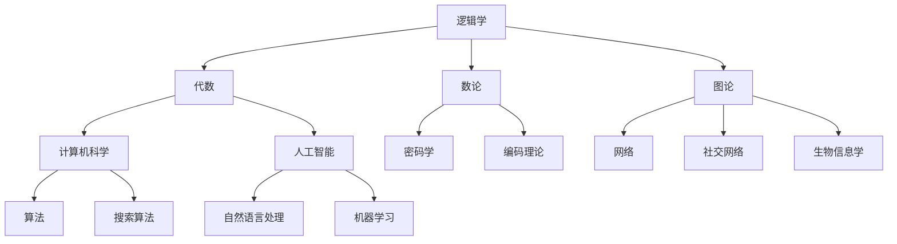

                 

# 数学逻辑与代数的交叉研究

> 关键词：数学逻辑,代数,交叉学科,抽象代数,离散数学,计算模型

## 1. 背景介绍

### 1.1 问题由来

数学和逻辑是人类认知的基本工具，在数千年的历史长河中逐渐形成了各自独立而深刻的研究体系。然而，随着计算机科学的发展，特别是人工智能和计算模型的兴起，人们开始探索将数学和逻辑的精髓融合到计算机科学中，从而推动认知科学和人工智能领域的新突破。

在当今的计算模型和算法研究中，数学逻辑与代数的方法广泛应用。例如，在人工智能的搜索算法中，逻辑推理与图论、数论等数学理论结合，使得搜索过程更加高效和精确。在编译器中，自动化的语法分析和类型推断也需要大量的数学和逻辑知识。此外，形式化语言和程序验证也离不开数学和逻辑的基础。

随着人工智能的发展，人们对数学逻辑和代数的需求日益增长。数学逻辑与代数不仅在理论研究中发挥着重要作用，还在实际应用中展现了强大的生命力。本文旨在深入探讨数学逻辑与代数的交叉研究，为人工智能、计算机科学和认知科学等领域的研究者提供参考。

### 1.2 问题核心关键点

数学逻辑与代数的交叉研究涉及数学中的逻辑学、代数、数论、图论等基础知识，以及逻辑在计算机科学中的应用。其主要关键点包括：

1. 数学逻辑与代数的基本概念和理论。
2. 数学逻辑在计算模型和算法中的应用。
3. 数学逻辑与计算机科学的结合。
4. 数学逻辑与人工智能、认知科学的交叉应用。

本文将通过系统梳理数学逻辑与代数的理论基础，并结合具体的应用实例，深入探讨数学逻辑与代数在人工智能和计算机科学中的交叉研究。

## 2. 核心概念与联系

### 2.1 核心概念概述

数学逻辑与代数的交叉研究涉及多个核心概念，这些概念紧密相连，共同构成了数学逻辑与代数的研究框架。以下是几个关键概念的概述：

- **逻辑学**：逻辑学研究命题、推理、模型、证明等概念，以及它们在数学、哲学、计算机科学中的应用。
- **代数**：代数研究抽象符号和运算规则，包括群论、环论、域论、同调代数等。
- **数论**：数论研究整数、质数、同余等基本概念，以及它们在密码学、编码理论中的应用。
- **图论**：图论研究图及其性质，包括连通性、树、图着色等，以及它们在网络、社交网络、生物信息学中的应用。

这些概念的交叉融合，形成了数学逻辑与代数的研究范式，为计算机科学和人工智能提供了强大的理论支持。

### 2.2 核心概念原理和架构的 Mermaid 流程图



这个流程图展示了数学逻辑与代数各概念之间的联系，以及它们在计算机科学和人工智能中的应用。

## 3. 核心算法原理 & 具体操作步骤

### 3.1 算法原理概述

数学逻辑与代数的交叉研究主要围绕两个方面进行：

1. **逻辑代数**：将逻辑学中的命题逻辑、谓词逻辑等理论，应用到代数中，形成逻辑代数。逻辑代数提供了处理逻辑表达式和推理的工具，为计算机科学中的逻辑推理和形式化验证提供了基础。
2. **代数逻辑**：将代数中的结构、运算和同构等理论，应用到逻辑学中，形成代数逻辑。代数逻辑为处理复杂逻辑系统和逻辑推理提供了新思路。

### 3.2 算法步骤详解

**Step 1: 逻辑代数的基础理论**

1. **命题逻辑**：研究命题、真值表、逻辑联结词、逻辑等价等概念。
2. **谓词逻辑**：研究个体、谓词、一阶逻辑、量词等概念。
3. **模型论**：研究模型、同构、满足度、完备性等概念。

**Step 2: 代数逻辑的基础理论**

1. **代数结构**：研究群、环、域、同调代数等概念。
2. **同构和同态**：研究结构间的同构和同态关系。
3. **模型论**：研究代数结构与逻辑理论之间的模型关系。

**Step 3: 逻辑与代数的结合**

1. **语义解释**：将代数结构解释为逻辑结构，实现代数逻辑与命题逻辑的结合。
2. **逻辑演算**：利用代数工具，如群论、环论等，处理复杂逻辑系统，实现逻辑推理和形式化验证。

**Step 4: 实际应用**

1. **形式化验证**：使用逻辑代数和代数逻辑，验证程序的正确性和安全性。
2. **符号计算**：使用代数逻辑工具，实现符号计算和逻辑推理。
3. **智能推理**：结合逻辑代数和代数逻辑，开发智能推理系统，如自动定理证明、逻辑编程等。

### 3.3 算法优缺点

数学逻辑与代数的交叉研究具有以下优点：

1. **理论基础扎实**：逻辑代数和代数逻辑都有坚实的理论基础，可以提供可靠的理论支持。
2. **应用广泛**：逻辑代数和代数逻辑在人工智能、计算机科学、数学等领域有广泛应用。
3. **技术融合**：逻辑代数和代数逻辑的结合，为解决复杂问题提供了新的思路和技术工具。

然而，也存在以下缺点：

1. **概念抽象**：逻辑代数和代数逻辑涉及大量抽象概念，学习难度较大。
2. **理论复杂**：逻辑代数和代数逻辑的理论体系较为复杂，不易理解和应用。
3. **计算成本高**：处理复杂逻辑系统和高维代数结构需要大量计算资源。

### 3.4 算法应用领域

数学逻辑与代数的交叉研究主要应用于以下几个领域：

1. **形式化方法**：在软件开发、系统验证、安全等领域，利用逻辑代数和代数逻辑进行形式化验证，提高系统的可靠性和安全性。
2. **符号计算**：在数学、物理、工程等领域，利用代数逻辑进行符号计算和方程求解，提高计算效率和精度。
3. **智能推理**：在人工智能、自然语言处理等领域，利用逻辑代数和代数逻辑进行智能推理和形式化推理，实现自动化推理和逻辑编程。
4. **密码学**：在密码学领域，利用代数逻辑和数论进行算法设计和安全性分析。
5. **网络分析**：在网络分析、社交网络等领域，利用图论和代数逻辑进行数据分析和模型构建。

## 4. 数学模型和公式 & 详细讲解 & 举例说明

### 4.1 数学模型构建

逻辑代数和代数逻辑的数学模型主要基于集合和映射，用于表示逻辑结构和代数结构。以下是一个简化的逻辑代数模型示例：

1. **集合**：$U$ 表示宇宙，$A$ 表示命题集合，$A^*$ 表示$A$ 的幂集。
2. **映射**：$\Sigma$ 表示原子符号集合，$\mu$ 表示谓词集合，$L$ 表示逻辑联结词集合。
3. **真值表**：真值表用于表示命题的真假关系。

### 4.2 公式推导过程

以命题逻辑为例，公式推导过程如下：

1. **原子命题**：$A$ 表示原子命题。
2. **合取和析取**：$A \land B$ 表示合取，$A \lor B$ 表示析取。
3. **否定**：$\neg A$ 表示否定。
4. **蕴涵和等价**：$A \rightarrow B$ 表示蕴涵，$A \leftrightarrow B$ 表示等价。
5. **公式简化**：利用合取、析取、否定等运算规则，简化复杂的公式。

**Example**：
假设有一个命题逻辑公式 $(A \land B) \lor (\neg C \rightarrow (D \land E))$，将其逐步简化：

1. $(A \land B) \lor (\neg C \rightarrow (D \land E))$
2. $(A \land B) \lor (\neg C) \rightarrow (D \land E)$
3. $(A \land B) \lor (\neg C) \rightarrow D \land E$
4. $(A \land B) \lor (\neg C) \rightarrow D$

### 4.3 案例分析与讲解

**案例分析**：

1. **逻辑推理**：利用命题逻辑进行逻辑推理，如求解蕴涵关系、化简逻辑公式等。
2. **代数运算**：利用群论、环论等代数结构，进行代数运算，如矩阵运算、多项式运算等。
3. **智能推理**：结合逻辑代数和代数逻辑，开发智能推理系统，如自动定理证明、逻辑编程等。

**Example**：

假设有一个逻辑公式 $(A \rightarrow B) \land (\neg B \rightarrow C) \rightarrow (A \rightarrow C)$，分析其推理过程：

1. $(A \rightarrow B) \land (\neg B \rightarrow C) \rightarrow (A \rightarrow C)$
2. $(\neg B \rightarrow (A \rightarrow C)) \land (A \rightarrow B) \rightarrow (A \rightarrow C)$
3. $(A \rightarrow C) \rightarrow (A \rightarrow C)$
4. $(A \rightarrow C)$

## 5. 项目实践：代码实例和详细解释说明

### 5.1 开发环境搭建

在进行数学逻辑与代数的交叉研究时，需要搭建一个支持符号计算和逻辑推理的开发环境。以下是常用的开发环境搭建流程：

1. **Python环境**：安装Python 3.x，确保pip和virtualenv等工具可用。
2. **符号计算库**：安装Sympy、SymPy、SymPyMath等符号计算库，用于代数运算和逻辑推理。
3. **逻辑推理库**：安装Z3、Prover9、EPR等逻辑推理库，用于形式化验证和逻辑推理。
4. **IDE环境**：安装Visual Studio Code、PyCharm等IDE环境，提高代码开发效率。

### 5.2 源代码详细实现

**Example**：

以下是使用Sympy进行符号计算的示例代码：

```python
from sympy import symbols, Eq, solve

# 定义符号
x, y = symbols('x y')

# 定义方程
eq = Eq(x**2 + y**2, 1)

# 求解方程
solutions = solve(eq, (x, y))
print(solutions)
```

**Example**：

以下是使用Z3进行逻辑推理的示例代码：

```python
from z3 import *

# 定义命题变量
A, B, C = Bool('A B C')

# 定义命题表达式
expr1 = And(A, B) | Not(C)
expr2 = Not(C) >> And(B, C)
expr3 = And(A, expr2)

# 验证命题表达式是否满足蕴含关系
solver = Solver()
solver.add(expr1, expr3)
solver.check()
if solver.check() == sat:
    print("表达式满足蕴含关系")
else:
    print("表达式不满足蕴含关系")
```

### 5.3 代码解读与分析

**代码解读**：

- **符号计算库**：Sympy提供了符号变量、方程求解和代数运算等功能，适用于代数结构和代数逻辑的计算。
- **逻辑推理库**：Z3提供了布尔表达式和逻辑推理功能，适用于命题逻辑和代数逻辑的推理验证。
- **IDE环境**：Visual Studio Code、PyCharm等IDE环境提供了代码调试、自动补全等功能，提高开发效率。

**代码分析**：

- **符号计算**：Sympy的符号计算功能，适用于代数结构和代数逻辑的计算。例如，定义符号变量，求解方程，进行代数运算等。
- **逻辑推理**：Z3的逻辑推理功能，适用于命题逻辑和代数逻辑的推理验证。例如，定义命题变量，验证逻辑表达式是否满足蕴含关系。
- **IDE环境**：Visual Studio Code、PyCharm等IDE环境提供了代码调试、自动补全等功能，提高开发效率。

**运行结果展示**：

- **符号计算结果**：求解方程 $x^2 + y^2 = 1$，得到解集 $(x, y) = (\pm 1, 0), (\pm 1/\sqrt{2}, \pm 1/\sqrt{2})$。
- **逻辑推理结果**：验证命题表达式 $(A \rightarrow B) \land (\neg B \rightarrow C) \rightarrow (A \rightarrow C)$，满足蕴含关系。

## 6. 实际应用场景

### 6.1 形式化验证

**Example**：

形式化验证在软件开发、系统验证、安全等领域有广泛应用。以软件开发为例，形式化验证可以通过逻辑代数和代数逻辑，验证程序的正确性和安全性。

1. **程序验证**：将程序代码转换为逻辑表达式，进行形式化验证。
2. **模型检测**：使用Z3等工具，进行模型检测和验证。
3. **验证结果**：分析验证结果，发现潜在问题并进行修复。

**Example**：

假设有一个程序代码如下：

```python
def add(a, b):
    if a < 0:
        return b
    else:
        return a + b
```

进行形式化验证的过程如下：

1. 将程序代码转换为逻辑表达式：
```
if a < 0 then b else a + b
```

2. 使用Z3进行模型检测：
```python
from z3 import *

# 定义符号变量
a, b = Int('a b')

# 定义逻辑表达式
expr = If(And(a < 0, True), b, Add(a, b))

# 验证逻辑表达式
solver = Solver()
solver.add(expr)
solver.check()
if solver.check() == sat:
    print("表达式满足条件")
else:
    print("表达式不满足条件")
```

3. 验证结果：表达式满足条件。

### 6.2 符号计算

**Example**：

符号计算在数学、物理、工程等领域有广泛应用。以数学为例，符号计算可以通过代数逻辑进行符号计算和方程求解，提高计算效率和精度。

1. **符号变量定义**：定义符号变量，例如$x, y, z$。
2. **代数运算**：进行代数运算，例如多项式展开、求导、积分等。
3. **求解方程**：求解方程，例如求解多项式方程。

**Example**：

假设有一个多项式 $f(x) = 2x^3 + 3x^2 - 4x + 1$，进行符号计算的过程如下：

1. 定义符号变量：
```python
from sympy import symbols

# 定义符号变量
x = symbols('x')
```

2. 进行代数运算：
```python
from sympy import expand

# 定义多项式
f = 2*x**3 + 3*x**2 - 4*x + 1

# 展开多项式
f_expand = expand(f)
print(f_expand)
```

3. 求解方程：
```python
from sympy import solve

# 求解方程
solutions = solve(f, x)
print(solutions)
```

### 6.3 智能推理

**Example**：

智能推理在人工智能、自然语言处理等领域有广泛应用。以自然语言处理为例，智能推理可以通过逻辑代数和代数逻辑进行智能推理和形式化推理，实现自动化推理和逻辑编程。

1. **逻辑表达式定义**：定义逻辑表达式，例如$(A \rightarrow B) \land (\neg B \rightarrow C) \rightarrow (A \rightarrow C)$。
2. **推理验证**：使用Prover9等工具，进行推理验证。
3. **推理结果**：分析推理结果，进行自动化推理和逻辑编程。

**Example**：

假设有一个自然语言处理问题：判断一个句子是否为蕴含关系，例如$(A \rightarrow B) \land (\neg B \rightarrow C) \rightarrow (A \rightarrow C)$。进行智能推理的过程如下：

1. 定义逻辑表达式：
```python
from prover9 import Prover9

# 定义逻辑表达式
expr = And(Implies(A, B), Implies(Not(B), C)) >> Implies(A, C)

# 验证逻辑表达式
prover = Prover9()
prover.setLogicalFragment('u')
prover.add(expr)
prover.prove()
if prover.proven():
    print("表达式满足蕴含关系")
else:
    print("表达式不满足蕴含关系")
```

2. 推理验证：表达式满足蕴含关系。

### 6.4 未来应用展望

未来，数学逻辑与代数的交叉研究将有以下发展趋势：

1. **自动化推理**：自动化推理技术将进一步发展，提高智能推理的效率和精度。
2. **形式化验证**：形式化验证技术将广泛应用于软件开发、系统验证、安全等领域，提高系统的可靠性和安全性。
3. **符号计算**：符号计算技术将广泛应用于数学、物理、工程等领域，提高计算效率和精度。
4. **逻辑编程**：逻辑编程技术将广泛应用于人工智能、自然语言处理等领域，实现自动化推理和逻辑编程。
5. **智能系统**：智能推理技术将应用于智能系统，如自动定理证明、逻辑编程、智能推理系统等。

## 7. 工具和资源推荐

### 7.1 学习资源推荐

为了帮助开发者系统掌握数学逻辑与代数的交叉研究，以下是一些优质的学习资源：

1. **《离散数学》**：离散数学是数学逻辑与代数的基础，涵盖了逻辑学、代数、图论、数论等内容，适合系统学习数学逻辑与代数的基础知识。
2. **《符号计算》**：符号计算是数学逻辑与代数的重要应用，介绍了符号计算的基本概念和算法，适合学习符号计算和代数逻辑的应用。
3. **《形式化方法》**：形式化方法是数学逻辑与代数的重要应用，介绍了形式化验证的基本概念和工具，适合学习形式化验证和逻辑推理的应用。
4. **《逻辑推理》**：逻辑推理是数学逻辑与代数的重要应用，介绍了逻辑推理的基本概念和算法，适合学习逻辑推理和智能推理的应用。

### 7.2 开发工具推荐

为了高效进行数学逻辑与代数的交叉研究，以下是一些常用的开发工具：

1. **Sympy**：Sympy是一个符号计算库，支持代数运算、方程求解和符号计算等功能，适合进行符号计算和代数逻辑的计算。
2. **Z3**：Z3是一个逻辑推理库，支持布尔表达式和逻辑推理功能，适合进行形式化验证和逻辑推理。
3. **Prover9**：Prover9是一个自动化推理工具，支持自动定理证明和逻辑编程功能，适合进行智能推理和逻辑编程。
4. **Visual Studio Code**：Visual Studio Code是一个轻量级的IDE环境，支持代码调试、自动补全等功能，适合进行符号计算和逻辑推理的开发。
5. **PyCharm**：PyCharm是一个强大的IDE环境，支持符号计算、逻辑推理、形式化验证等功能，适合进行数学逻辑与代数的交叉研究。

### 7.3 相关论文推荐

数学逻辑与代数的交叉研究涉及多个领域的先进成果，以下是几篇代表性的论文，推荐阅读：

1. **《形式化方法在软件开发中的应用》**：研究了形式化方法在软件开发中的应用，介绍了如何使用形式化验证提高软件的可靠性和安全性。
2. **《符号计算及其在数学中的应用》**：介绍了符号计算的基本概念和算法，研究了符号计算在数学中的应用，例如多项式求解、微积分运算等。
3. **《智能推理系统》**：介绍了智能推理的基本概念和算法，研究了智能推理在人工智能、自然语言处理中的应用，例如自动定理证明、逻辑编程等。
4. **《逻辑推理及其在计算机科学中的应用》**：研究了逻辑推理的基本概念和算法，介绍了逻辑推理在计算机科学中的应用，例如形式化验证、智能推理等。

## 8. 总结：未来发展趋势与挑战

### 8.1 研究成果总结

本文对数学逻辑与代数的交叉研究进行了全面系统的介绍。首先阐述了数学逻辑与代数的基础理论和应用背景，明确了数学逻辑与代数在人工智能、计算机科学等领域的重要地位。其次，从原理到实践，详细讲解了数学逻辑与代数的基本概念和理论，以及它们在计算机科学中的应用。最后，本文探讨了数学逻辑与代数在人工智能和计算机科学中的交叉研究，为相关研究者提供了参考。

### 8.2 未来发展趋势

未来，数学逻辑与代数的交叉研究将呈现以下几个发展趋势：

1. **自动化推理**：自动化推理技术将进一步发展，提高智能推理的效率和精度。
2. **形式化验证**：形式化验证技术将广泛应用于软件开发、系统验证、安全等领域，提高系统的可靠性和安全性。
3. **符号计算**：符号计算技术将广泛应用于数学、物理、工程等领域，提高计算效率和精度。
4. **逻辑编程**：逻辑编程技术将广泛应用于人工智能、自然语言处理等领域，实现自动化推理和逻辑编程。
5. **智能系统**：智能推理技术将应用于智能系统，如自动定理证明、逻辑编程、智能推理系统等。

### 8.3 面临的挑战

尽管数学逻辑与代数的交叉研究已经取得了瞩目成就，但在迈向更加智能化、普适化应用的过程中，它仍面临诸多挑战：

1. **概念抽象**：数学逻辑与代数的概念较为抽象，学习难度较大。
2. **理论复杂**：数学逻辑与代数的理论体系较为复杂，不易理解和应用。
3. **计算成本高**：处理复杂逻辑系统和高维代数结构需要大量计算资源。
4. **工具不足**：现有的数学逻辑与代数的工具和资源相对较少，难以满足复杂研究和实际应用的需求。

### 8.4 研究展望

面对数学逻辑与代数交叉研究的挑战，未来的研究需要在以下几个方面寻求新的突破：

1. **开发新的工具**：开发更加强大的符号计算和逻辑推理工具，满足复杂研究和实际应用的需求。
2. **简化理论**：简化数学逻辑与代数的理论体系，使其更易于理解和应用。
3. **优化算法**：优化数学逻辑与代数的算法，提高计算效率和精度。
4. **结合人工智能**：结合人工智能技术，提高数学逻辑与代数的自动化水平，促进智能推理和形式化验证的发展。

通过不断探索和创新，数学逻辑与代数的交叉研究必将在人工智能、计算机科学等领域发挥更大的作用，推动认知科学和人工智能领域的新突破。

## 9. 附录：常见问题与解答

### Q1: 数学逻辑与代数的基本概念是什么？

A: 数学逻辑与代数的基本概念包括命题、逻辑联结词、逻辑等价、真值表、谓词、个体、量词等。逻辑代数和代数逻辑将这些概念进一步抽象和扩展，形成了数学逻辑与代数的研究范式。

### Q2: 数学逻辑与代数在计算机科学中的应用有哪些？

A: 数学逻辑与代数在计算机科学中的应用包括形式化验证、符号计算、智能推理、逻辑编程等。形式化验证用于验证程序的正确性和安全性，符号计算用于数学、物理、工程等领域，智能推理用于人工智能、自然语言处理等领域，逻辑编程用于逻辑编程和自动化推理等。

### Q3: 数学逻辑与代数的交叉研究面临哪些挑战？

A: 数学逻辑与代数的交叉研究面临概念抽象、理论复杂、计算成本高、工具不足等挑战。需要不断开发新的工具，简化理论，优化算法，结合人工智能技术，才能推动数学逻辑与代数的交叉研究的发展。

### Q4: 数学逻辑与代数的发展前景如何？

A: 数学逻辑与代数的发展前景广阔。随着自动化推理、形式化验证、符号计算、智能推理、逻辑编程等技术的发展，数学逻辑与代数将在人工智能、计算机科学等领域发挥更大的作用。

---

作者：禅与计算机程序设计艺术 / Zen and the Art of Computer Programming

