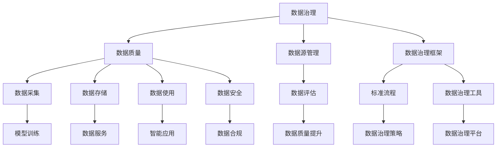

                 

# 数据治理：规范 AI 2.0 数据采集、存储、使用和管理流程

数据治理（Data Governance）在人工智能（AI）领域中扮演着至关重要的角色，特别是在AI 2.0时代，数据的高效治理已经成为支撑AI系统实现高性能、高稳定性和高可解释性的重要基础。本文将深入探讨数据治理的核心概念、基本框架和实际应用，详细分析其原理与操作步骤，旨在为数据治理的实践提供指导，确保数据的高质量和高效管理。

## 1. 背景介绍

### 1.1 数据治理的重要性
在AI 2.0时代，数据驱动成为核心引擎，数据成为智能决策、模型训练和优化不可或缺的资源。然而，面对海量、复杂、多源、异构的数据，如何确保数据的质量、一致性和可用性，构建标准化的数据管理和使用流程，是当前AI系统开发中亟需解决的关键问题。

数据治理不仅关注数据的采集、存储和处理，还涵盖了数据质量管理、数据安全合规、数据隐私保护等多个方面。有效的数据治理能够显著提升数据价值，降低风险，确保AI系统的稳定性和可信性。

### 1.2 数据治理的演进
数据治理经历了从传统的数据管理和数据质量控制，逐步演进到数据治理2.0，再到当前的AI 2.0数据治理。传统数据治理主要关注数据的标准化、规范化和质量控制，而数据治理2.0则加入了更多数据资产管理和数据服务化的理念。在AI 2.0时代，数据治理进一步与AI技术深度融合，变得更加智能化和自动化，形成了覆盖数据全生命周期的治理体系。

AI 2.0数据治理强调通过先进的数据治理技术和方法，实现数据的高效采集、高质量存储、智能管理、高效利用，为AI系统提供可靠的数据支撑，保障AI模型的高效运行和可解释性。

## 2. 核心概念与联系

### 2.1 核心概念概述
为了更好地理解AI 2.0数据治理，本节将介绍几个关键概念：

- **数据治理（Data Governance）**：指通过制定标准、流程和工具，确保数据的质量、安全和合规，提升数据价值的过程。
- **数据质量（Data Quality）**：指数据的准确性、完整性、一致性、及时性和有效性。
- **数据源管理（Data Source Management）**：指对数据来源进行评估、选择和管理，确保数据来源可靠和数据质量可控。
- **数据治理框架（Data Governance Framework）**：指为实现数据治理目标而设计的一系列标准、流程和工具。
- **AI 2.0（Artificial Intelligence 2.0）**：指在AI 1.0的基础上，通过数据治理、模型优化、技术创新等手段，提升AI系统的性能和智能化水平，使其能够更好地适应复杂多变的环境和任务。

这些概念之间的逻辑关系可以通过以下Mermaid流程图来展示：



这个流程图展示了数据治理的各个环节及其相互关系：

1. 数据治理贯穿数据全生命周期，从数据源管理到数据质量提升，再到数据使用和数据治理工具应用，形成闭环。
2. 数据治理关注数据的质量、安全、合规和可解释性，保障数据的高效利用。
3. AI 2.0与数据治理深度融合，通过提升数据治理能力，进一步推动AI系统性能提升和智能化水平。

### 2.2 核心概念原理和架构
数据治理的原理主要基于数据标准、数据质量、数据流程和数据工具的协同工作，确保数据的高效管理和利用。数据治理架构通常包括以下几个主要组成部分：

- **数据标准和规范**：定义数据的一致性、格式和质量标准，包括数据命名规范、数据格式规范、数据元数据规范等。
- **数据质量管理**：通过数据清洗、数据验证、数据监控等手段，确保数据质量满足业务和治理要求。
- **数据流程管理**：制定数据收集、存储、处理、使用和销毁的标准流程，确保数据流动的可控性和安全性。
- **数据工具集**：提供数据采集、数据存储、数据分析、数据可视化等工具，支持数据治理的各个环节。
- **数据治理平台**：通过集成上述组件，提供一站式数据治理解决方案，支持数据的统一管理和应用。

## 3. 核心算法原理 & 具体操作步骤

### 3.1 算法原理概述
AI 2.0数据治理的核心算法原理基于数据质量和数据流程的协同优化，通过制定标准、优化流程和使用工具，确保数据的高质量和高可用性。数据治理的主要算法包括：

- **数据质量算法**：用于评估和提升数据质量，包括缺失值处理、异常值检测、重复数据去除等。
- **数据流程优化算法**：用于优化数据采集、存储和使用的流程，确保数据的正确性和及时性。
- **数据工具集成算法**：用于集成和优化数据治理工具，提升数据管理的效率和效果。

### 3.2 算法步骤详解
以下是AI 2.0数据治理的主要算法步骤：

1. **数据源评估与管理**：
   - 评估数据源的质量、可靠性和可用性。
   - 选择合适的数据源，确保数据来源的多样性和全面性。
   - 管理数据源的接入和更新，确保数据的实时性和一致性。

2. **数据采集与预处理**：
   - 收集数据并清洗数据，去除噪声和冗余。
   - 对数据进行结构化和规范化，确保数据格式一致。
   - 使用数据清洗算法，如缺失值处理、异常值检测等，提升数据质量。

3. **数据存储与管理**：
   - 选择合适的数据存储方案，如数据库、云存储等。
   - 设计数据存储架构，确保数据的安全性和可访问性。
   - 使用数据管理和监控工具，如数据仓库、数据湖等，管理数据存储和数据生命周期。

4. **数据使用与分析**：
   - 设计数据使用和分析的流程，确保数据的合法性和安全性。
   - 使用数据分析工具，如数据挖掘、机器学习等，分析数据，提取有价值的信息。
   - 对分析结果进行可视化展示，提供直观的数据洞察。

5. **数据治理工具集成**：
   - 集成和优化数据治理工具，如数据质量管理工具、数据安全工具、数据治理平台等。
   - 确保各个工具之间的兼容性和互操作性，提升数据治理的整体效果。

6. **数据治理策略制定与执行**：
   - 制定数据治理策略，明确数据管理的规范和标准。
   - 执行数据治理策略，确保数据管理的合规性和有效性。

### 3.3 算法优缺点
AI 2.0数据治理的优点包括：

- **提升数据质量**：通过标准化、规范化和管理，确保数据的高质量，提升模型的训练效果。
- **增强数据安全性**：通过数据访问控制、数据加密等手段，保障数据的安全性和隐私保护。
- **提高数据利用率**：通过优化数据流程和工具集成，提高数据管理的效率和效果。
- **增强数据治理透明度**：通过数据治理策略和工具，提高数据治理的透明度和可追溯性。

然而，数据治理也存在一些缺点：

- **实施复杂**：数据治理涉及多个环节和工具，实施复杂度较高。
- **成本较高**：数据治理需要投入大量人力和资源，包括数据清洗、流程优化等。
- **数据源管理困难**：数据源的多样性和复杂性，增加了数据治理的难度。

### 3.4 算法应用领域

AI 2.0数据治理在多个领域得到了广泛应用，以下是几个典型应用场景：

1. **金融行业**：
   - 数据治理在金融行业的应用非常广泛，包括数据清洗、数据质量管理、数据安全合规等。
   - 数据治理技术能够提升金融系统的稳定性和安全性，保障客户隐私和数据安全。

2. **医疗行业**：
   - 数据治理在医疗行业主要用于医疗数据的采集、存储和管理，提升医疗数据的规范化和标准化。
   - 数据治理能够保障医疗数据的质量和安全，提升医疗系统的效率和效果。

3. **零售行业**：
   - 数据治理在零售行业主要用于客户数据的采集、分析和应用，提升客户画像和市场分析的准确性。
   - 数据治理能够帮助零售企业更好地理解客户需求，提升销售效果和客户满意度。

4. **制造业**：
   - 数据治理在制造业主要用于生产数据的采集、分析和优化，提升生产效率和产品质量。
   - 数据治理能够帮助制造业企业优化生产流程，提升生产管理的效率和效果。

## 4. 数学模型和公式 & 详细讲解 & 举例说明

### 4.1 数学模型构建
AI 2.0数据治理的数学模型主要涉及数据质量和数据流程的优化。以下是几个关键数学模型：

1. **数据质量评估模型**：用于评估数据质量，包括数据完整性、一致性、准确性和及时性。常用的评估指标包括缺失值比例、异常值比例、重复数据比例等。

2. **数据流程优化模型**：用于优化数据流程，确保数据的高效流动和处理。常用的模型包括流程图、工作流、数据流模型等。

3. **数据治理策略模型**：用于制定和执行数据治理策略，包括数据标准、数据流程、数据工具等。常用的模型包括策略图、流程图、决策树等。

### 4.2 公式推导过程
以下是几个关键数学模型的公式推导：

1. **数据质量评估模型**：
   - 缺失值比例：$P_{\text{missing}} = \frac{N_{\text{missing}}}{N_{\text{total}}}$
   - 异常值比例：$P_{\text{outliers}} = \frac{N_{\text{outliers}}}{N_{\text{total}}}$
   - 重复数据比例：$P_{\text{duplicates}} = \frac{N_{\text{duplicates}}}{N_{\text{unique}}}$

2. **数据流程优化模型**：
   - 数据流模型：
     - 输入数据：$D_{\text{input}}$
     - 处理步骤：$S_{\text{processing}}$
     - 输出数据：$D_{\text{output}}$
     - 数据流图：$G(D_{\text{input}}, S_{\text{processing}}, D_{\text{output}})$

3. **数据治理策略模型**：
   - 策略图：
     - 策略节点：$N_{\text{strategy}}$
     - 流程节点：$N_{\text{flow}}$
     - 策略图：$G(N_{\text{strategy}}, N_{\text{flow}})$

### 4.3 案例分析与讲解
假设某零售公司希望通过数据治理提升客户画像的准确性。以下是数据治理的详细流程：

1. **数据源评估与管理**：
   - 评估现有的客户数据源，包括客户注册信息、购物记录、社交媒体数据等。
   - 选择合适的数据源，确保数据的全面性和及时性。
   - 设计数据接入流程，确保数据的实时更新和一致性。

2. **数据采集与预处理**：
   - 从各个数据源收集客户数据，并进行清洗和规范化。
   - 使用数据清洗算法，如缺失值处理、异常值检测等，提升数据质量。
   - 设计数据存储架构，选择合适的数据库存储客户数据。

3. **数据存储与管理**：
   - 设计数据存储架构，确保数据的实时性和一致性。
   - 使用数据管理和监控工具，如数据仓库、数据湖等，管理数据存储和数据生命周期。

4. **数据使用与分析**：
   - 设计数据使用和分析的流程，确保数据的合法性和安全性。
   - 使用数据分析工具，如数据挖掘、机器学习等，分析客户数据，提取有价值的信息。
   - 对分析结果进行可视化展示，提供直观的数据洞察。

5. **数据治理工具集成**：
   - 集成和优化数据治理工具，如数据质量管理工具、数据安全工具、数据治理平台等。
   - 确保各个工具之间的兼容性和互操作性，提升数据治理的整体效果。

6. **数据治理策略制定与执行**：
   - 制定数据治理策略，明确数据管理的规范和标准。
   - 执行数据治理策略，确保数据管理的合规性和有效性。

## 5. 项目实践：代码实例和详细解释说明

### 5.1 开发环境搭建

为了进行数据治理的实践，我们需要准备好开发环境。以下是使用Python进行数据治理实践的环境配置流程：

1. 安装Anaconda：从官网下载并安装Anaconda，用于创建独立的Python环境。

2. 创建并激活虚拟环境：
```bash
conda create -n data-governance python=3.8 
conda activate data-governance
```

3. 安装必要的Python库：
```bash
pip install pandas numpy matplotlib scikit-learn jupyter notebook ipython
```

4. 安装Hadoop和Spark：
```bash
wget http://mirror.baidu.com/apache/hadoop/hadoop-3.1.0/hadoop-3.1.0.tar.gz
tar -xvf hadoop-3.1.0.tar.gz
cd hadoop-3.1.0/sbin
./start-all.sh
```

5. 安装Apache Spark：
```bash
wget https://spark.apache.org/files/spark-2.4.0/spark-2.4.0-bin-hadoop2.7.tgz
tar -xvf spark-2.4.0-bin-hadoop2.7.tgz
cd spark-2.4.0-bin-hadoop2.7/
./sbin/start-master.sh
```

完成上述步骤后，即可在`data-governance`环境中开始数据治理实践。

### 5.2 源代码详细实现

以下是使用Python进行数据治理实践的代码实现：

```python
from pyspark.sql import SparkSession
from pyspark.sql.functions import col, when
from pyspark.sql.types import StructType, StructField, StringType

# 创建SparkSession
spark = SparkSession.builder.appName("DataGovernance").getOrCreate()

# 读取数据
df = spark.read.format("csv").option("header", "true").load("data.csv")

# 数据清洗
df_cleaned = df.dropna().drop_duplicates()

# 数据处理
df_processed = df_cleaned.select(
    col("name").alias("name"),
    col("age").alias("age"),
    col("gender").alias("gender"),
    col("income").alias("income"),
    col("occupation").alias("occupation")
)

# 数据存储
df_processed.write.format("parquet").save("processed_data")

# 数据可视化
from matplotlib import pyplot as plt
from pyspark.sql.functions import col, when

df_processed.createOrReplaceTempView("processed_data")
plt.title("Age Distribution")
plt.xlabel("Age")
plt.ylabel("Count")
df_processed.groupBy("age").count().orderBy("age").show(10)

plt.show()
```

### 5.3 代码解读与分析

让我们再详细解读一下关键代码的实现细节：

1. **SparkSession的创建**：
   - 创建SparkSession对象，用于数据处理和存储。
   - `appName`参数用于设置应用名称，方便跟踪和管理。

2. **数据读取**：
   - 使用`read`方法读取CSV格式的数据文件，`option("header", "true")`参数设置文件的第一行作为列名。
   - `load`方法将数据文件加载到DataFrame对象中，方便后续处理。

3. **数据清洗**：
   - `dropna`方法用于去除缺失值，确保数据完整性。
   - `drop_duplicates`方法用于去除重复数据，确保数据一致性。

4. **数据处理**：
   - `select`方法用于选择需要的列，并重新命名。
   - `alias`方法用于给列起别名，方便后续处理。

5. **数据存储**：
   - `write`方法用于将处理后的数据存储到Parquet格式的文件中，Parquet格式具有高效存储和查询的特点。

6. **数据可视化**：
   - 使用`createOrReplaceTempView`方法将DataFrame对象转换为临时表，方便后续查询。
   - 使用Matplotlib库进行数据可视化，展示年龄分布的统计图。

通过上述代码实现，我们可以看到，Spark平台可以高效地进行数据治理的各个环节，包括数据读取、清洗、处理和存储。开发者可以将更多精力放在数据治理的高层逻辑上，而不必过多关注底层实现细节。

## 6. 实际应用场景

### 6.1 金融行业

在金融行业中，数据治理的重要性不言而喻。数据质量直接影响模型的训练效果和业务决策的准确性。以下是一个典型的金融行业数据治理案例：

1. **数据源评估与管理**：
   - 评估现有的数据源，包括客户交易记录、信用评分数据、市场数据等。
   - 选择合适的数据源，确保数据的全面性和及时性。
   - 设计数据接入流程，确保数据的实时更新和一致性。

2. **数据采集与预处理**：
   - 从各个数据源收集数据，并进行清洗和规范化。
   - 使用数据清洗算法，如缺失值处理、异常值检测等，提升数据质量。
   - 设计数据存储架构，选择合适的数据库存储客户数据。

3. **数据存储与管理**：
   - 设计数据存储架构，确保数据的实时性和一致性。
   - 使用数据管理和监控工具，如数据仓库、数据湖等，管理数据存储和数据生命周期。

4. **数据使用与分析**：
   - 设计数据使用和分析的流程，确保数据的合法性和安全性。
   - 使用数据分析工具，如数据挖掘、机器学习等，分析客户数据，提取有价值的信息。
   - 对分析结果进行可视化展示，提供直观的数据洞察。

5. **数据治理工具集成**：
   - 集成和优化数据治理工具，如数据质量管理工具、数据安全工具、数据治理平台等。
   - 确保各个工具之间的兼容性和互操作性，提升数据治理的整体效果。

6. **数据治理策略制定与执行**：
   - 制定数据治理策略，明确数据管理的规范和标准。
   - 执行数据治理策略，确保数据管理的合规性和有效性。

### 6.2 医疗行业

在医疗行业中，数据治理也扮演着重要角色。医疗数据的质量直接关系到患者治疗的效果和医疗系统的运行效率。以下是一个典型的医疗行业数据治理案例：

1. **数据源评估与管理**：
   - 评估现有的数据源，包括患者病历数据、治疗记录、实验室检查数据等。
   - 选择合适的数据源，确保数据的全面性和及时性。
   - 设计数据接入流程，确保数据的实时更新和一致性。

2. **数据采集与预处理**：
   - 从各个数据源收集数据，并进行清洗和规范化。
   - 使用数据清洗算法，如缺失值处理、异常值检测等，提升数据质量。
   - 设计数据存储架构，选择合适的数据库存储医疗数据。

3. **数据存储与管理**：
   - 设计数据存储架构，确保数据的实时性和一致性。
   - 使用数据管理和监控工具，如数据仓库、数据湖等，管理数据存储和数据生命周期。

4. **数据使用与分析**：
   - 设计数据使用和分析的流程，确保数据的合法性和安全性。
   - 使用数据分析工具，如数据挖掘、机器学习等，分析医疗数据，提取有价值的信息。
   - 对分析结果进行可视化展示，提供直观的数据洞察。

5. **数据治理工具集成**：
   - 集成和优化数据治理工具，如数据质量管理工具、数据安全工具、数据治理平台等。
   - 确保各个工具之间的兼容性和互操作性，提升数据治理的整体效果。

6. **数据治理策略制定与执行**：
   - 制定数据治理策略，明确数据管理的规范和标准。
   - 执行数据治理策略，确保数据管理的合规性和有效性。

### 6.3 零售行业

在零售行业中，数据治理同样重要。客户数据的质量直接影响营销和销售的效果。以下是一个典型的零售行业数据治理案例：

1. **数据源评估与管理**：
   - 评估现有的数据源，包括客户注册信息、购物记录、社交媒体数据等。
   - 选择合适的数据源，确保数据的全面性和及时性。
   - 设计数据接入流程，确保数据的实时更新和一致性。

2. **数据采集与预处理**：
   - 从各个数据源收集数据，并进行清洗和规范化。
   - 使用数据清洗算法，如缺失值处理、异常值检测等，提升数据质量。
   - 设计数据存储架构，选择合适的数据库存储客户数据。

3. **数据存储与管理**：
   - 设计数据存储架构，确保数据的实时性和一致性。
   - 使用数据管理和监控工具，如数据仓库、数据湖等，管理数据存储和数据生命周期。

4. **数据使用与分析**：
   - 设计数据使用和分析的流程，确保数据的合法性和安全性。
   - 使用数据分析工具，如数据挖掘、机器学习等，分析客户数据，提取有价值的信息。
   - 对分析结果进行可视化展示，提供直观的数据洞察。

5. **数据治理工具集成**：
   - 集成和优化数据治理工具，如数据质量管理工具、数据安全工具、数据治理平台等。
   - 确保各个工具之间的兼容性和互操作性，提升数据治理的整体效果。

6. **数据治理策略制定与执行**：
   - 制定数据治理策略，明确数据管理的规范和标准。
   - 执行数据治理策略，确保数据管理的合规性和有效性。

## 7. 工具和资源推荐

### 7.1 学习资源推荐

为了帮助开发者系统掌握数据治理的核心概念和实践技巧，这里推荐一些优质的学习资源：

1. **《数据治理：构建数据驱动的智能系统》**：这本书详细介绍了数据治理的原理、方法、工具和应用，是数据治理领域的经典之作。
2. **《Python数据治理：基于Apache Spark和Spark SQL的数据管理》**：这本书介绍了使用Python和Spark进行数据治理的实践方法，提供了丰富的代码示例。
3. **《数据治理工具与平台》**：这本书介绍了各种数据治理工具和平台的特点、使用方法和最佳实践，是数据治理从业者的必备工具书。
4. **《数据治理框架和策略》**：这篇文章详细介绍了数据治理框架和策略的设计和实施方法，提供了大量的案例分析。
5. **《数据治理标准和规范》**：这篇文章介绍了数据治理标准和规范的制定和执行方法，提供了标准化的数据治理流程。

通过对这些资源的学习实践，相信你一定能够快速掌握数据治理的精髓，并用于解决实际的数据治理问题。

### 7.2 开发工具推荐

高效的开发离不开优秀的工具支持。以下是几款用于数据治理开发的常用工具：

1. **Apache Spark**：一个快速、通用、可扩展的大数据处理引擎，支持大规模数据处理和分析。
2. **Apache Hadoop**：一个用于分布式存储和处理大数据的开源框架，支持高可用性和容错性。
3. **Hive**：一个基于Hadoop的数据仓库工具，支持SQL查询和数据管理。
4. **Presto**：一个开源的分布式SQL查询引擎，支持快速数据查询和实时数据分析。
5. **Kafka**：一个高吞吐量的分布式流处理平台，支持数据采集、流处理和实时分析。

合理利用这些工具，可以显著提升数据治理任务的开发效率，加快创新迭代的步伐。

### 7.3 相关论文推荐

数据治理技术的发展源于学界的持续研究。以下是几篇奠基性的相关论文，推荐阅读：

1. **《数据治理框架的构建和应用》**：这篇文章介绍了数据治理框架的设计和实施方法，提供了标准化的数据治理流程。
2. **《数据质量评估与管理》**：这篇文章详细介绍了数据质量评估和管理的原理与方法，提供了大量案例分析。
3. **《数据治理工具和平台的选择与优化》**：这篇文章介绍了数据治理工具和平台的选择和优化方法，提供了丰富的案例分析。
4. **《数据治理策略的设计与实施》**：这篇文章详细介绍了数据治理策略的设计和实施方法，提供了标准化的数据治理流程。
5. **《数据治理的最新研究进展》**：这篇文章介绍了数据治理技术的最新研究进展，提供了最新的研究方法和应用案例。

这些论文代表了大数据治理领域的最新研究动态，通过学习这些前沿成果，可以帮助研究者把握学科前进方向，激发更多的创新灵感。

## 8. 总结：未来发展趋势与挑战

### 8.1 研究成果总结

数据治理作为AI 2.0的重要组成部分，在数据驱动的智能系统中发挥着越来越重要的作用。通过系统化的数据治理，可以有效提升数据质量，保障数据安全和合规，优化数据流程，提高数据利用率。当前，数据治理技术已经在大规模数据处理和智能分析中得到了广泛应用，并取得了显著的效果。

### 8.2 未来发展趋势

展望未来，数据治理技术将呈现以下几个发展趋势：

1. **数据治理自动化**：未来的数据治理将更加智能化和自动化，借助AI技术实现自动化的数据清洗、数据分析和数据治理，减少人工干预，提升治理效率。
2. **数据治理平台化**：未来的数据治理将更加平台化，集成了数据采集、存储、处理、分析和治理的各个环节，提供一站式的数据治理解决方案。
3. **数据治理标准化**：未来的数据治理将更加标准化，制定统一的数据标准和规范，确保数据的一致性和高质量。
4. **数据治理实时化**：未来的数据治理将更加实时化，实时监控数据流和数据质量，确保数据的时效性和稳定性。
5. **数据治理可解释性**：未来的数据治理将更加注重可解释性，提供透明的数据治理流程和治理结果，提升数据的可信性和可靠性。

### 8.3 面临的挑战

尽管数据治理技术已经取得了显著进展，但在实施过程中仍面临一些挑战：

1. **数据源多样性和复杂性**：数据源的多样性和复杂性，增加了数据治理的难度，需要开发多种数据接入和处理工具。
2. **数据质量不一致性**：不同数据源的数据质量不一致，增加了数据清洗和规范化工作的复杂性。
3. **数据治理成本高**：数据治理需要投入大量人力和资源，包括数据清洗、流程优化等，成本较高。
4. **数据治理工具兼容性**：不同数据治理工具之间的兼容性和互操作性，需要不断优化和集成，确保数据治理的顺畅进行。
5. **数据治理安全性和合规性**：数据治理过程中，需要保障数据的安全性和合规性，防止数据泄露和滥用。

### 8.4 研究展望

面对数据治理面临的挑战，未来的研究需要在以下几个方面寻求新的突破：

1. **数据治理自动化**：通过引入AI和机器学习技术，实现数据的自动清洗、自动分析和自动治理，提升数据治理的效率和效果。
2. **数据治理平台化**：开发统一的数据治理平台，集成数据采集、存储、处理、分析和治理的各个环节，提供一站式的解决方案。
3. **数据治理标准化**：制定统一的数据标准和规范，确保数据的一致性和高质量，提升数据治理的可操作性。
4. **数据治理实时化**：实时监控数据流和数据质量，确保数据的时效性和稳定性，提升数据治理的响应速度和效果。
5. **数据治理可解释性**：提供透明的数据治理流程和治理结果，提升数据的可信性和可靠性，增强数据治理的透明度和可追溯性。

这些研究方向将推动数据治理技术的不断发展和完善，为AI 2.0的应用提供坚实的数据保障，推动AI技术的深度融合和广泛应用。总之，数据治理是AI 2.0的重要组成部分，未来将与AI技术深度融合，共同推动数据驱动的智能系统发展。

## 9. 附录：常见问题与解答

**Q1：数据治理和数据管理有什么区别？**

A: 数据治理是数据管理的一部分，旨在通过制定标准、优化流程和使用工具，确保数据的质量、安全和合规，提升数据的价值。数据管理则涵盖了数据的全生命周期管理，包括数据采集、存储、处理、分析和应用等各个环节。

**Q2：数据治理是否只适用于大数据场景？**

A: 数据治理不仅适用于大数据场景，对于小数据和中等规模数据场景同样适用。通过制定标准、优化流程和使用工具，可以有效提升数据的质量和利用率。

**Q3：数据治理的实施难度大吗？**

A: 数据治理的实施难度较大，涉及到数据源评估、数据采集、数据清洗、数据存储、数据分析和数据治理工具的集成等多个环节。需要结合业务需求和数据特点，制定合理的治理策略，选择合适的工具和平台。

**Q4：数据治理的收益是什么？**

A: 数据治理的收益包括提升数据质量、保障数据安全和合规、优化数据流程、提高数据利用率、增强数据治理透明度等。通过系统化的数据治理，可以显著提升数据驱动的AI系统的性能和智能化水平。

**Q5：数据治理和数据科学有什么区别？**

A: 数据治理和数据科学虽然有交叉，但区别在于数据治理更注重数据的质量、安全、合规和可解释性，关注数据的全生命周期管理；数据科学则更注重数据分析和模型训练，关注数据的利用和转化。

通过本文的系统梳理，可以看到，数据治理是AI 2.0的重要组成部分，通过系统化的数据治理，可以有效提升数据质量，保障数据安全和合规，优化数据流程，提高数据利用率，提升数据驱动的AI系统的性能和智能化水平。未来，随着数据治理技术的不断发展和完善，数据驱动的智能系统将更加智能、高效、可信，为各行各业带来更多的价值和变革。

