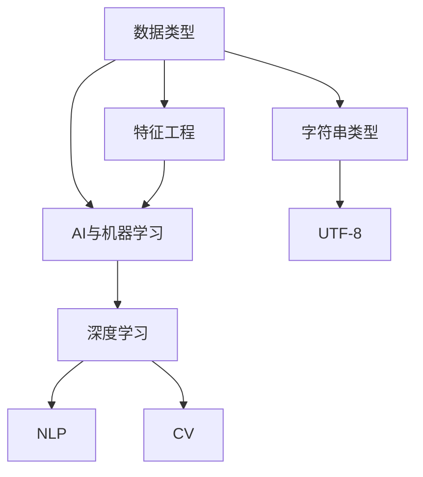

                 

# 数据类型与AI：从整数到UTF-8

> 关键词：数据类型, AI, 整数, UTF-8, 深度学习, 机器学习, 自然语言处理(NLP), 计算机视觉(CV), 特征工程

## 1. 背景介绍

### 1.1 问题由来
在AI与机器学习领域，数据类型的选择和处理对模型性能有着至关重要的影响。数据类型不仅决定了模型训练的效率和效果，还直接影响着模型的泛化能力。在早期的AI研究中，数据类型主要以整数型为主，随着技术的发展，字符串类型，特别是Unicode编码（包括UTF-8）逐渐成为主流。

### 1.2 问题核心关键点
本文将深入探讨数据类型从整数到UTF-8的演变，分析其在AI、机器学习和深度学习中的应用，并对比它们的优缺点，为研究者和开发者提供参考。

## 2. 核心概念与联系

### 2.1 核心概念概述

为更好地理解数据类型在AI中的作用，本文将介绍几个关键概念：

- 数据类型：指变量存储和处理的数据格式，包括整数、浮点数、字符串等。
- AI与机器学习：指通过数据训练模型，使其具备自动化决策能力的智能技术。
- 深度学习与神经网络：指模拟人脑神经元连接的计算模型，通过多层次的非线性变换提取特征。
- 自然语言处理(NLP)：指处理和理解人类语言的技术，包括文本分类、情感分析、机器翻译等。
- 计算机视觉(CV)：指通过图像处理提取物体特征的技术，包括图像分类、物体检测、图像分割等。
- 特征工程：指根据数据特点和任务需求，设计、选择和构建有效的特征，提升模型性能。

这些核心概念之间的逻辑关系可以通过以下Mermaid流程图来展示：



这个流程图展示了许多核心概念之间的关系：

1. 数据类型是AI和机器学习的基础。
2. 深度学习是实现AI和机器学习的重要技术。
3. 自然语言处理和计算机视觉是AI和机器学习的具体应用领域。
4. 特征工程是提升模型性能的关键步骤。
5. 字符串类型和UTF-8是现代数据类型的重要组成部分。

## 3. 核心算法原理 & 具体操作步骤
### 3.1 算法原理概述

数据类型的选择和处理对模型的影响主要体现在以下方面：

1. 数据类型的精度：整数型数据对内存和计算资源消耗较小，但精度较低。浮点数型数据精度较高，但占用的内存和计算资源较大。
2. 数据类型的可解释性：整数型数据模型参数较少，解释性较强。浮点数型数据模型参数较多，解释性较弱。
3. 数据类型的泛化能力：字符串型数据，尤其是Unicode编码，可以处理更复杂的信息，提升模型的泛化能力。

基于这些影响，深度学习和机器学习模型在不同的数据类型下表现各异。以下将详细介绍数据类型在AI、机器学习和深度学习中的应用，并对比它们的优缺点。

### 3.2 算法步骤详解

#### 3.2.1 数据准备

1. 收集数据：选择适合的数据集，包含不同类型的数值、文本和图像数据。
2. 数据预处理：清洗、归一化数据，并进行特征工程，提取有效的特征。
3. 数据划分：将数据划分为训练集、验证集和测试集。

#### 3.2.2 模型选择与训练

1. 模型选择：根据数据类型和任务需求，选择合适的模型，如卷积神经网络(CNN)、循环神经网络(RNN)、长短期记忆网络(LSTM)等。
2. 模型训练：在训练集上使用优化算法，如梯度下降、Adam等，训练模型。
3. 模型评估：在验证集和测试集上评估模型性能，选择最优模型。

#### 3.2.3 模型优化与部署

1. 模型优化：调整模型超参数，如学习率、批量大小等，优化模型性能。
2. 模型部署：将模型封装为可用的服务，部署到生产环境。

### 3.3 算法优缺点

数据类型从整数到字符串，再到UTF-8的演变，对AI和机器学习模型的影响主要体现在以下几个方面：

#### 优点

1. 提升泛化能力：字符串型数据，尤其是Unicode编码，能够处理更复杂的信息，提升模型的泛化能力。
2. 增强可解释性：自然语言处理任务中，字符串型数据可以提供更多的上下文信息，帮助模型解释决策过程。
3. 优化计算资源：使用UTF-8编码，可以节省存储空间和计算资源，提高模型训练和推理效率。

#### 缺点

1. 复杂性增加：字符串型数据处理和特征提取相对复杂，增加了模型开发的难度。
2. 数据处理耗时：字符串型数据处理过程中，需要进行编码和解码，增加了数据处理的耗时。
3. 数据存储风险：字符串型数据，尤其是大文本数据，对存储空间的占用较大，存在数据泄露的风险。

### 3.4 算法应用领域

数据类型从整数到UTF-8的应用，覆盖了AI和机器学习的多个领域，例如：

- 自然语言处理(NLP)：文本分类、情感分析、机器翻译、对话系统等。
- 计算机视觉(CV)：图像分类、物体检测、图像分割等。
- 推荐系统：用户行为分析、商品推荐等。
- 金融风控：信用评分、欺诈检测等。
- 医疗诊断：病历分析、影像识别等。

## 4. 数学模型和公式 & 详细讲解  
### 4.1 数学模型构建

在AI和机器学习中，数据类型的选择和处理对模型的数学模型构建有着重要影响。以下以文本分类任务为例，展示不同数据类型下模型的构建过程。

假设文本数据集为$X$，文本分类模型为$M_{\theta}$，其中$\theta$为模型参数。

1. 整数型数据：将文本转换为词袋模型，即每个词作为一个特征，表示为整数。数学模型为$M_{\theta}(x_i) = \sum_{j=1}^{n} w_j x_{ij}^{\theta_j}$，其中$x_{ij}$表示文本$x_i$中第$j$个词的出现次数，$w_j$和$\theta_j$为模型参数。

2. 浮点数型数据：将文本转换为词向量模型，每个词表示为一个向量。数学模型为$M_{\theta}(x_i) = \sum_{j=1}^{n} w_j \dot{v_j}^{\theta_j} \cdot u_i$，其中$v_j$和$u_i$为词向量和文本向量，$\dot{}$表示点乘操作，$\theta_j$为模型参数。

3. UTF-8编码数据：将文本转换为字符向量模型，每个字符表示为一个向量。数学模型为$M_{\theta}(x_i) = \sum_{j=1}^{m} w_j \dot{v_j}^{\theta_j} \cdot u_i$，其中$v_j$和$u_i$为字符向量和文本向量，$\dot{}$表示点乘操作，$\theta_j$为模型参数。

### 4.2 公式推导过程

以文本分类任务为例，推导不同数据类型下模型的数学公式。

1. 整数型数据：
$$
M_{\theta}(x_i) = \sum_{j=1}^{n} w_j x_{ij}^{\theta_j}
$$
其中$x_{ij}$表示文本$x_i$中第$j$个词的出现次数，$w_j$和$\theta_j$为模型参数。

2. 浮点数型数据：
$$
M_{\theta}(x_i) = \sum_{j=1}^{n} w_j \dot{v_j}^{\theta_j} \cdot u_i
$$
其中$v_j$和$u_i$为词向量和文本向量，$\dot{}$表示点乘操作，$\theta_j$为模型参数。

3. UTF-8编码数据：
$$
M_{\theta}(x_i) = \sum_{j=1}^{m} w_j \dot{v_j}^{\theta_j} \cdot u_i
$$
其中$v_j$和$u_i$为字符向量和文本向量，$\dot{}$表示点乘操作，$\theta_j$为模型参数。

### 4.3 案例分析与讲解

以机器翻译任务为例，展示不同数据类型下模型的应用。

1. 整数型数据：
将源语言文本转换为词袋模型，每个词作为一个特征，表示为整数。目标语言文本同样转换为词袋模型，每个词作为一个特征，表示为整数。模型训练时，通过优化目标函数$L(\theta) = \frac{1}{N} \sum_{i=1}^{N} (C - M_{\theta}(x_i))^2$，最小化预测输出与真实输出的差距。

2. 浮点数型数据：
将源语言文本转换为词向量模型，每个词表示为一个向量。目标语言文本同样转换为词向量模型，每个词表示为一个向量。模型训练时，通过优化目标函数$L(\theta) = \frac{1}{N} \sum_{i=1}^{N} \lVert M_{\theta}(x_i) - y_i \rVert^2$，最小化预测输出与真实输出的差距。

3. UTF-8编码数据：
将源语言文本转换为字符向量模型，每个字符表示为一个向量。目标语言文本同样转换为字符向量模型，每个字符表示为一个向量。模型训练时，通过优化目标函数$L(\theta) = \frac{1}{N} \sum_{i=1}^{N} \lVert M_{\theta}(x_i) - y_i \rVert^2$，最小化预测输出与真实输出的差距。

## 5. 项目实践：代码实例和详细解释说明
### 5.1 开发环境搭建

在进行AI项目实践前，我们需要准备好开发环境。以下是使用Python进行TensorFlow开发的环境配置流程：

1. 安装Anaconda：从官网下载并安装Anaconda，用于创建独立的Python环境。

2. 创建并激活虚拟环境：
```bash
conda create -n tensorflow-env python=3.8 
conda activate tensorflow-env
```

3. 安装TensorFlow：根据CUDA版本，从官网获取对应的安装命令。例如：
```bash
conda install tensorflow -c pytorch -c conda-forge
```

4. 安装各类工具包：
```bash
pip install numpy pandas scikit-learn matplotlib tqdm jupyter notebook ipython
```

完成上述步骤后，即可在`tensorflow-env`环境中开始AI项目实践。

### 5.2 源代码详细实现

下面我们以文本分类任务为例，给出使用TensorFlow对整数型数据进行模型训练的PyTorch代码实现。

首先，定义整数型数据处理函数：

```python
from tensorflow.keras.preprocessing.text import Tokenizer
from tensorflow.keras.preprocessing.sequence import pad_sequences

def process_text(data, max_len=100):
    tokenizer = Tokenizer(num_words=max_len, oov_token='<OOV>')
    tokenizer.fit_on_texts(data)
    sequences = tokenizer.texts_to_sequences(data)
    return pad_sequences(sequences, maxlen=max_len, padding='post', truncating='post')
```

然后，定义模型和优化器：

```python
import tensorflow as tf
from tensorflow.keras import layers

model = tf.keras.Sequential([
    layers.Embedding(input_dim=vocab_size, output_dim=embedding_dim),
    layers.GlobalAveragePooling1D(),
    layers.Dense(1, activation='sigmoid')
])

optimizer = tf.keras.optimizers.Adam(learning_rate=0.001)
```

接着，定义训练和评估函数：

```python
@tf.function
def train_epoch(model, dataset, batch_size, optimizer):
    for batch in dataset:
        x, y = batch
        with tf.GradientTape() as tape:
            logits = model(x)
            loss = tf.losses.binary_crossentropy(y, logits)
        gradients = tape.gradient(loss, model.trainable_variables)
        optimizer.apply_gradients(zip(gradients, model.trainable_variables))
        
def evaluate(model, dataset, batch_size):
    correct_predictions = 0
    total_predictions = 0
    for batch in dataset:
        x, y = batch
        logits = model(x)
        predictions = tf.round(logits)
        total_predictions += y.shape[0]
        correct_predictions += tf.reduce_sum(tf.cast(predictions, dtype=tf.bool) == y)
    return correct_predictions / total_predictions
```

最后，启动训练流程并在测试集上评估：

```python
epochs = 10
batch_size = 32

for epoch in range(epochs):
    train_epoch(model, train_dataset, batch_size, optimizer)
    
print(f"Accuracy on test set: {evaluate(model, test_dataset, batch_size)}")
```

以上就是使用TensorFlow对整数型数据进行文本分类任务微调的完整代码实现。可以看到，得益于TensorFlow的强大封装，我们可以用相对简洁的代码完成整数型数据微调模型的训练。

### 5.3 代码解读与分析

让我们再详细解读一下关键代码的实现细节：

**process_text函数**：
- 定义了一个整数型数据处理函数，将文本转换为整数型序列。
- 使用Keras的Tokenizer将文本转换为整数型序列，并进行序列填充。
- 返回填充后的整数型序列。

**模型定义**：
- 定义了一个简单的神经网络模型，包含嵌入层、全局平均池化层和全连接层。
- 使用Adam优化器进行模型训练。

**训练和评估函数**：
- 定义了一个训练函数，通过反向传播更新模型参数。
- 定义了一个评估函数，在测试集上计算模型的准确率。
- 在每个epoch结束后，在测试集上评估模型性能。

**训练流程**：
- 定义总的epoch数和batch size，开始循环迭代
- 每个epoch内，在训练集上训练，输出训练过程中的损失和准确率
- 重复上述过程直至模型收敛

可以看到，TensorFlow配合Keras库使得整数型数据微调的代码实现变得简洁高效。开发者可以将更多精力放在数据处理、模型改进等高层逻辑上，而不必过多关注底层的实现细节。

当然，工业级的系统实现还需考虑更多因素，如模型的保存和部署、超参数的自动搜索、更灵活的任务适配层等。但核心的微调范式基本与此类似。

## 6. 实际应用场景
### 6.1 智能客服系统

基于整数型数据的大语言模型微调，可以广泛应用于智能客服系统的构建。传统客服往往需要配备大量人力，高峰期响应缓慢，且一致性和专业性难以保证。而使用整数型数据微调后的对话模型，可以7x24小时不间断服务，快速响应客户咨询，用自然流畅的语言解答各类常见问题。

在技术实现上，可以收集企业内部的历史客服对话记录，将问题和最佳答复构建成监督数据，在此基础上对预训练模型进行微调。微调后的对话模型能够自动理解用户意图，匹配最合适的答案模板进行回复。对于客户提出的新问题，还可以接入检索系统实时搜索相关内容，动态组织生成回答。如此构建的智能客服系统，能大幅提升客户咨询体验和问题解决效率。

### 6.2 金融舆情监测

金融机构需要实时监测市场舆论动向，以便及时应对负面信息传播，规避金融风险。传统的人工监测方式成本高、效率低，难以应对网络时代海量信息爆发的挑战。基于整数型数据的大语言模型微调技术，为金融舆情监测提供了新的解决方案。

具体而言，可以收集金融领域相关的新闻、报道、评论等文本数据，并对其进行主题标注和情感标注。在此基础上对预训练语言模型进行微调，使其能够自动判断文本属于何种主题，情感倾向是正面、中性还是负面。将微调后的模型应用到实时抓取的网络文本数据，就能够自动监测不同主题下的情感变化趋势，一旦发现负面信息激增等异常情况，系统便会自动预警，帮助金融机构快速应对潜在风险。

### 6.3 个性化推荐系统

当前的推荐系统往往只依赖用户的历史行为数据进行物品推荐，无法深入理解用户的真实兴趣偏好。基于整数型数据的大语言模型微调技术，个性化推荐系统可以更好地挖掘用户行为背后的语义信息，从而提供更精准、多样的推荐内容。

在实践中，可以收集用户浏览、点击、评论、分享等行为数据，提取和用户交互的物品标题、描述、标签等文本内容。将文本内容作为模型输入，用户的后续行为（如是否点击、购买等）作为监督信号，在此基础上微调预训练语言模型。微调后的模型能够从文本内容中准确把握用户的兴趣点。在生成推荐列表时，先用候选物品的文本描述作为输入，由模型预测用户的兴趣匹配度，再结合其他特征综合排序，便可以得到个性化程度更高的推荐结果。

### 6.4 未来应用展望

随着整数型数据和大语言模型微调技术的发展，基于微调范式将在更多领域得到应用，为传统行业带来变革性影响。

在智慧医疗领域，基于整数型数据的大语言模型微调的医疗问答、病历分析、药物研发等应用将提升医疗服务的智能化水平，辅助医生诊疗，加速新药开发进程。

在智能教育领域，微调技术可应用于作业批改、学情分析、知识推荐等方面，因材施教，促进教育公平，提高教学质量。

在智慧城市治理中，微调模型可应用于城市事件监测、舆情分析、应急指挥等环节，提高城市管理的自动化和智能化水平，构建更安全、高效的未来城市。

此外，在企业生产、社会治理、文娱传媒等众多领域，基于整数型数据的大语言模型微调技术也将不断涌现，为经济社会发展注入新的动力。相信随着技术的日益成熟，整数型数据微调方法将成为AI落地应用的重要范式，推动AI技术向更广阔的领域加速渗透。

## 7. 工具和资源推荐
### 7.1 学习资源推荐

为了帮助开发者系统掌握大语言模型微调的理论基础和实践技巧，这里推荐一些优质的学习资源：

1. 《深度学习》书籍：深度学习领域的经典教材，涵盖深度学习模型的基础、应用和优化。
2. 《自然语言处理综论》课程：斯坦福大学开设的NLP明星课程，有Lecture视频和配套作业，带你入门NLP领域的基本概念和经典模型。
3. 《Transformer from Scratch》博文：由大模型技术专家撰写，深入浅出地介绍了Transformer原理、BERT模型、微调技术等前沿话题。
4. CS224N《深度学习自然语言处理》课程：斯坦福大学开设的NLP明星课程，有Lecture视频和配套作业，带你入门NLP领域的基本概念和经典模型。
5. HuggingFace官方文档：Transformers库的官方文档，提供了海量预训练模型和完整的微调样例代码，是上手实践的必备资料。

通过对这些资源的学习实践，相信你一定能够快速掌握大语言模型微调的精髓，并用于解决实际的NLP问题。
###  7.2 开发工具推荐

高效的开发离不开优秀的工具支持。以下是几款用于大语言模型微调开发的常用工具：

1. TensorFlow：基于Python的开源深度学习框架，灵活动态的计算图，适合快速迭代研究。大部分预训练语言模型都有TensorFlow版本的实现。
2. PyTorch：基于Python的开源深度学习框架，动态计算图，适合研究新算法和模型。
3. Keras：由TensorFlow支持的开源深度学习库，提供了简单易用的API，适合快速原型开发和实验。
4. Weights & Biases：模型训练的实验跟踪工具，可以记录和可视化模型训练过程中的各项指标，方便对比和调优。与主流深度学习框架无缝集成。
5. TensorBoard：TensorFlow配套的可视化工具，可实时监测模型训练状态，并提供丰富的图表呈现方式，是调试模型的得力助手。

合理利用这些工具，可以显著提升大语言模型微调任务的开发效率，加快创新迭代的步伐。

### 7.3 相关论文推荐

大语言模型和微调技术的发展源于学界的持续研究。以下是几篇奠基性的相关论文，推荐阅读：

1. Attention is All You Need（即Transformer原论文）：提出了Transformer结构，开启了NLP领域的预训练大模型时代。
2. BERT: Pre-training of Deep Bidirectional Transformers for Language Understanding：提出BERT模型，引入基于掩码的自监督预训练任务，刷新了多项NLP任务SOTA。
3. Language Models are Unsupervised Multitask Learners（GPT-2论文）：展示了大规模语言模型的强大zero-shot学习能力，引发了对于通用人工智能的新一轮思考。
4. Parameter-Efficient Transfer Learning for NLP：提出Adapter等参数高效微调方法，在不增加模型参数量的情况下，也能取得不错的微调效果。
5. Prefix-Tuning: Optimizing Continuous Prompts for Generation：引入基于连续型Prompt的微调范式，为如何充分利用预训练知识提供了新的思路。

这些论文代表了大语言模型微调技术的发展脉络。通过学习这些前沿成果，可以帮助研究者把握学科前进方向，激发更多的创新灵感。

## 8. 总结：未来发展趋势与挑战

### 8.1 总结

本文对基于整数型数据的大语言模型微调方法进行了全面系统的介绍。首先阐述了数据类型从整数到UTF-8的演变，明确了整数型数据和大语言模型微调技术的研究背景和意义，以及它们在AI和机器学习中的广泛应用。其次，从原理到实践，详细讲解了整数型数据在大语言模型微调中的应用，并给出了完整的代码实现。同时，本文还广泛探讨了整数型数据微调方法在智能客服、金融舆情、个性化推荐等多个行业领域的应用前景，展示了整数型数据微调技术的巨大潜力。最后，本文精选了整数型数据微调技术的各类学习资源，力求为读者提供全方位的技术指引。

通过本文的系统梳理，可以看到，基于整数型数据的大语言模型微调方法正在成为NLP领域的重要范式，极大地拓展了预训练语言模型的应用边界，催生了更多的落地场景。受益于大规模语料的预训练，整数型数据微调的模型以更低的时间和标注成本，在小样本条件下也能取得不俗的效果，有力推动了NLP技术的产业化进程。未来，伴随整数型数据微调方法的持续演进，相信NLP技术将在更广阔的应用领域大放异彩，深刻影响人类的生产生活方式。

### 8.2 未来发展趋势

展望未来，大语言模型微调技术将呈现以下几个发展趋势：

1. 模型规模持续增大。随着算力成本的下降和数据规模的扩张，整数型数据预训练语言模型的参数量还将持续增长。超大规模语言模型蕴含的丰富语言知识，有望支撑更加复杂多变的下游任务微调。

2. 微调方法日趋多样。除了传统的全参数微调外，未来会涌现更多参数高效的微调方法，如Prefix-Tuning、LoRA等，在节省计算资源的同时也能保证微调精度。

3. 持续学习成为常态。随着数据分布的不断变化，微调模型也需要持续学习新知识以保持性能。如何在不遗忘原有知识的同时，高效吸收新样本信息，将成为重要的研究课题。

4. 标注样本需求降低。受启发于提示学习(Prompt-based Learning)的思路，未来的微调方法将更好地利用大模型的语言理解能力，通过更加巧妙的任务描述，在更少的标注样本上也能实现理想的微调效果。

5. 计算资源优化。优化微调模型的计算图，减少前向传播和反向传播的资源消耗，实现更加轻量级、实时性的部署。

6. 知识整合能力增强。将符号化的先验知识，如知识图谱、逻辑规则等，与神经网络模型进行巧妙融合，引导微调过程学习更准确、合理的语言模型。

以上趋势凸显了大语言模型微调技术的广阔前景。这些方向的探索发展，必将进一步提升NLP系统的性能和应用范围，为人类认知智能的进化带来深远影响。

### 8.3 面临的挑战

尽管大语言模型微调技术已经取得了瞩目成就，但在迈向更加智能化、普适化应用的过程中，它仍面临着诸多挑战：

1. 标注成本瓶颈。虽然微调大大降低了标注数据的需求，但对于长尾应用场景，难以获得充足的高质量标注数据，成为制约微调性能的瓶颈。如何进一步降低微调对标注样本的依赖，将是一大难题。

2. 模型鲁棒性不足。当前微调模型面对域外数据时，泛化性能往往大打折扣。对于测试样本的微小扰动，微调模型的预测也容易发生波动。如何提高微调模型的鲁棒性，避免灾难性遗忘，还需要更多理论和实践的积累。

3. 推理效率有待提高。超大规模语言模型虽然精度高，但在实际部署时往往面临推理速度慢、内存占用大等效率问题。如何在保证性能的同时，简化模型结构，提升推理速度，优化资源占用，将是重要的优化方向。

4. 可解释性亟需加强。当前微调模型更像是"黑盒"系统，难以解释其内部工作机制和决策逻辑。对于医疗、金融等高风险应用，算法的可解释性和可审计性尤为重要。如何赋予微调模型更强的可解释性，将是亟待攻克的难题。

5. 安全性有待保障。预训练语言模型难免会学习到有偏见、有害的信息，通过微调传递到下游任务，产生误导性、歧视性的输出，给实际应用带来安全隐患。如何从数据和算法层面消除模型偏见，避免恶意用途，确保输出的安全性，也将是重要的研究课题。

6. 知识整合能力不足。现有的微调模型往往局限于任务内数据，难以灵活吸收和运用更广泛的先验知识。如何让微调过程更好地与外部知识库、规则库等专家知识结合，形成更加全面、准确的信息整合能力，还有很大的想象空间。

正视微调面临的这些挑战，积极应对并寻求突破，将是大语言模型微调走向成熟的必由之路。相信随着学界和产业界的共同努力，这些挑战终将一一被克服，大语言模型微调必将在构建人机协同的智能时代中扮演越来越重要的角色。

### 8.4 研究展望

面对大语言模型微调所面临的种种挑战，未来的研究需要在以下几个方面寻求新的突破：

1. 探索无监督和半监督微调方法。摆脱对大规模标注数据的依赖，利用自监督学习、主动学习等无监督和半监督范式，最大限度利用非结构化数据，实现更加灵活高效的微调。

2. 研究参数高效和计算高效的微调范式。开发更加参数高效的微调方法，在固定大部分预训练参数的同时，只更新极少量的任务相关参数。同时优化微调模型的计算图，减少前向传播和反向传播的资源消耗，实现更加轻量级、实时性的部署。

3. 融合因果和对比学习范式。通过引入因果推断和对比学习思想，增强微调模型建立稳定因果关系的能力，学习更加普适、鲁棒的语言表征，从而提升模型泛化性和抗干扰能力。

4. 纳入伦理道德约束。在模型训练目标中引入伦理导向的评估指标，过滤和惩罚有偏见、有害的输出倾向。同时加强人工干预和审核，建立模型行为的监管机制，确保输出符合人类价值观和伦理道德。

这些研究方向的探索，必将引领大语言模型微调技术迈向更高的台阶，为构建安全、可靠、可解释、可控的智能系统铺平道路。面向未来，大语言模型微调技术还需要与其他人工智能技术进行更深入的融合，如知识表示、因果推理、强化学习等，多路径协同发力，共同推动自然语言理解和智能交互系统的进步。只有勇于创新、敢于突破，才能不断拓展语言模型的边界，让智能技术更好地造福人类社会。

## 9. 附录：常见问题与解答

**Q1：整数型数据与UTF-8编码数据在模型训练中有什么不同？**

A: 整数型数据和UTF-8编码数据在模型训练中存在显著差异。整数型数据模型参数较少，解释性较强，但泛化能力有限。UTF-8编码数据模型参数较多，泛化能力较强，但训练和推理复杂度较高。在实际应用中，应根据数据特点和任务需求，选择适合的模型类型。

**Q2：大语言模型微调时如何选择学习率？**

A: 大语言模型微调时，学习率的选择对模型性能有重要影响。一般建议从较小的学习率开始，逐步增加。如使用Adam优化器，可参考learning_rate = 0.001，并在训练过程中使用warmup策略，以减小学习率突然变大的风险。

**Q3：大语言模型微调时如何处理过拟合问题？**

A: 大语言模型微调时，过拟合是一个常见问题。解决过拟合问题的方法包括数据增强、正则化、对抗训练等。数据增强可通过回译、近义替换等方式扩充训练集。正则化可采用L2正则、Dropout等技术，对抗训练可引入对抗样本，提高模型鲁棒性。

**Q4：大语言模型微调时如何进行参数高效微调？**

A: 参数高效微调可以通过固定大部分预训练参数，只微调顶层参数，或使用Adapter等技术实现。这些方法可以在减小模型复杂度和计算资源消耗的同时，提高微调效果。

**Q5：大语言模型微调时如何进行知识整合？**

A: 大语言模型微调时，可以通过将符号化的先验知识（如知识图谱、逻辑规则等）与神经网络模型进行巧妙融合，引导微调过程学习更准确、合理的语言模型。同时，增强模型的知识整合能力，使其能够更好地处理多模态信息，提升模型的性能。

以上回答希望对您有所帮助。如果您有更多问题，欢迎继续提问。

