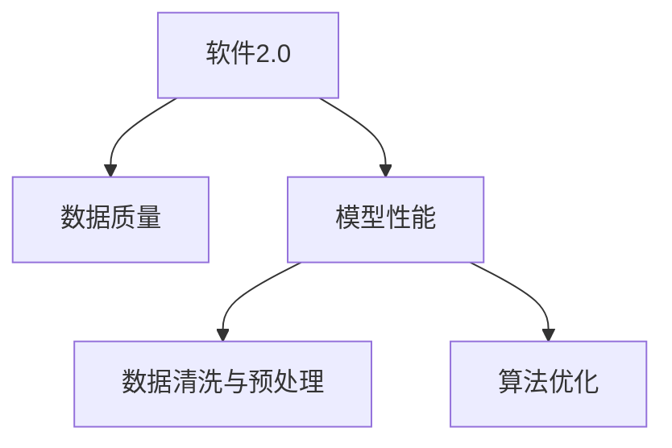

                 

## 1. 背景介绍

随着互联网的快速发展和数据的不断积累，数据驱动的AI应用逐渐成为软件2.0时代的重要特征。从推荐系统到语音识别，从图像处理到自然语言处理，各个领域的AI模型都需要依靠海量的数据进行训练，以实现对复杂问题的自动化解决。然而，在数据质量和数据驱动的AI应用中，数据质量问题变得日益严重，直接影响了软件2.0模型性能的稳定性与可靠性。

## 2. 核心概念与联系

### 2.1 核心概念概述

为更好地理解数据质量问题对软件2.0模型性能的影响，本节将介绍几个密切相关的核心概念：

- **软件2.0**：以数据和算法为中心的软件发展范式，强调数据质量和算法模型的重要性。软件2.0时代下，数据的质量和算法的效率成为了软件性能的瓶颈。
- **数据质量**：数据在采集、存储、传输、处理、分析等过程中，保持其准确性、完整性、一致性、时效性、真实性等属性的程度。数据质量问题包括但不限于数据缺失、噪声、重复、错误、不完整等。
- **模型性能**：模型在特定任务上表现出效用的能力，通常通过准确率、召回率、F1-score、AUC等指标进行量化。模型性能受数据质量和算法的影响。
- **数据清洗与预处理**：通过去除噪声、填补缺失、标准化、归一化等方式，提高数据质量，为模型训练提供良好的数据基础。
- **算法优化**：通过调整超参数、优化损失函数、引入正则化等手段，提升模型训练的效果，提高模型性能。

这些核心概念之间的逻辑关系可以通过以下Mermaid流程图来展示：



这个流程图展示出软件2.0模型性能与数据质量和数据清洗、算法优化之间的紧密联系：数据质量是模型性能的基础，而数据清洗和算法优化则是提高模型性能的重要手段。

## 3. 核心算法原理 & 具体操作步骤

### 3.1 算法原理概述

软件2.0模型性能受数据质量的影响，主要体现在以下两个方面：

1. **数据分布偏差**：训练数据集与测试数据集的分布差异过大，导致模型在测试集上的性能下降。这通常是由于数据采样偏差、数据标注偏差等原因造成的。
2. **数据噪声与缺失**：训练数据集中包含大量噪声、错误和缺失值，使得模型难以学习到真实的数据分布，影响模型的泛化能力。

基于此，软件2.0模型性能的提升需要对数据进行清洗和预处理，并对算法进行优化。

### 3.2 算法步骤详解

#### 3.2.1 数据清洗

数据清洗是提升数据质量的关键步骤，通常包括以下几个步骤：

1. **数据去重**：检测和去除数据集中的重复记录，确保数据集中没有重复样本。
2. **数据补全**：对于缺失值，可以通过插值、均值/中位数填充等方式进行补充，或者通过模型预测填补。
3. **噪声过滤**：通过异常值检测、数据平滑等方法，去除数据集中的噪声和异常点，确保数据的一致性。
4. **数据标准化**：对数据进行归一化、标准化等操作，使得不同特征的取值范围一致，便于模型训练。

#### 3.2.2 数据预处理

数据预处理是提升数据质量的重要手段，通常包括以下几个步骤：

1. **特征选择**：选择对模型训练有帮助的特征，去除无关特征或冗余特征，提高模型训练的效率。
2. **特征转换**：对特征进行转换，如对类别特征进行one-hot编码，对数值特征进行对数变换、归一化等操作。
3. **特征降维**：通过主成分分析、线性判别分析等方法，对高维数据进行降维，减少模型的复杂度。

#### 3.2.3 算法优化

算法优化是提升模型性能的重要手段，通常包括以下几个步骤：

1. **超参数调整**：通过网格搜索、随机搜索、贝叶斯优化等方法，寻找最优的超参数组合，提升模型训练的效果。
2. **正则化**：通过L1、L2正则化、Dropout等方式，减少模型过拟合，提高模型的泛化能力。
3. **模型集成**：通过Bagging、Boosting、Stacking等方法，将多个模型进行集成，提升模型的性能和稳定性。

### 3.3 算法优缺点

基于数据质量对软件2.0模型性能的影响，数据清洗和预处理以及算法优化具有以下优缺点：

#### 优点：

1. **提升模型性能**：通过数据清洗和预处理，去除噪声、填补缺失值、标准化数据等，能够提升模型的训练效果，减少模型的泛化误差。
2. **降低模型复杂度**：通过特征选择和降维，减少模型的复杂度，提高模型的训练速度和推理速度。
3. **增强模型稳定性**：通过正则化和模型集成，减少模型过拟合，提高模型的泛化能力和稳定性。

#### 缺点：

1. **数据清洗成本高**：数据清洗通常需要大量的计算资源和人力成本，尤其是在大数据量的情况下，处理效率较低。
2. **数据清洗效果有限**：即使数据清洗和预处理做得很好，仍有可能存在无法处理的数据噪声和分布偏差，影响模型性能。
3. **算法优化难度大**：超参数调整、正则化和模型集成等算法优化方法，需要大量实验和调参，找到最优的模型结构和参数设置。

### 3.4 算法应用领域

基于数据质量对软件2.0模型性能的影响，数据清洗和预处理以及算法优化在以下领域中得到了广泛应用：

- **推荐系统**：通过数据清洗和预处理，去除无关特征和噪声，提升推荐模型的准确率和推荐效果。
- **图像识别**：通过数据清洗和预处理，去除图像中的噪声和错误标注，提升图像识别模型的准确率和鲁棒性。
- **自然语言处理**：通过数据清洗和预处理，去除噪声和低质量标注，提升自然语言处理模型的语言理解能力和生成能力。
- **金融风控**：通过数据清洗和预处理，去除异常值和错误数据，提升金融风险评估模型的准确性和鲁棒性。
- **医疗诊断**：通过数据清洗和预处理，去除错误和噪声数据，提升医疗诊断模型的准确率和可靠性。

## 4. 数学模型和公式 & 详细讲解 & 举例说明

### 4.1 数学模型构建

假设我们有一组训练数据集 $D=\{(x_i, y_i)\}_{i=1}^N$，其中 $x_i$ 为输入特征， $y_i$ 为输出标签。基于数据质量对软件2.0模型性能的影响，我们希望通过数据清洗和预处理，以及算法优化，构建一个高效准确的模型 $M$，其数学模型为：

$$
M = f(\theta) \quad \text{where} \quad \theta = \text{argmin}_{\theta} L(M(D))
$$

其中 $f(\theta)$ 为模型 $M$ 的函数， $L$ 为损失函数， $\theta$ 为模型的超参数。

### 4.2 公式推导过程

#### 数据清洗与预处理

数据清洗和预处理可以显著提升模型的性能，其核心思想是通过数据变换，使得模型能够更好地拟合数据的真实分布。以下是数据清洗和预处理的数学推导过程：

1. **数据去重**

   假设数据集中存在重复记录，我们可以通过检查数据集的散列值，去除重复记录：

   $$
   \hat{D} = \{ x_i \mid \text{hash}(x_i) \notin \text{seen\_hashes} \}
   $$

   其中 $\text{seen\_hashes}$ 为已经出现过的散列值集合。

2. **数据补全**

   对于缺失值，我们可以通过均值填充或模型预测进行补全：

   $$
   \hat{x_i} = x_i + \epsilon \quad \text{where} \quad \epsilon \sim \mathcal{N}(0, \sigma^2)
   $$

   其中 $\sigma$ 为均值填充的噪声标准差。

3. **噪声过滤**

   对于异常值，我们可以使用基于统计量的方法进行检测和过滤，如标准差检验、箱线图等：

   $$
   \hat{x_i} = \text{median}(x_i) \quad \text{if} \quad x_i \text{is an outlier}
   $$

   其中 $\text{median}(x_i)$ 为中位数，$\text{is an outlier}$ 为判断异常值的标准。

4. **数据标准化**

   对数据进行标准化操作，使得不同特征的取值范围一致：

   $$
   \hat{x_i} = \frac{x_i - \mu}{\sigma}
   $$

   其中 $\mu$ 和 $\sigma$ 分别为数据的均值和标准差。

#### 算法优化

算法优化可以通过调整超参数、正则化等方法，提升模型的性能和稳定性，以下是优化算法的数学推导过程：

1. **超参数调整**

   通过网格搜索、随机搜索、贝叶斯优化等方法，寻找最优的超参数组合：

   $$
   \theta^* = \text{argmin}_{\theta} L(M(D), \theta)
   $$

   其中 $L$ 为损失函数， $\theta$ 为模型的超参数。

2. **正则化**

   通过L1、L2正则化、Dropout等方式，减少模型过拟合，提高模型的泛化能力：

   $$
   \theta^* = \text{argmin}_{\theta} L(M(D), \theta) + \lambda \sum_{i=1}^N ||x_i - x_{i-1}||_2^2
   $$

   其中 $\lambda$ 为正则化系数，$x_i$ 为特征向量。

3. **模型集成**

   通过Bagging、Boosting、Stacking等方法，将多个模型进行集成，提升模型的性能和稳定性：

   $$
   M^* = \frac{1}{K} \sum_{k=1}^K M_k(D)
   $$

   其中 $K$ 为模型的数量，$M_k(D)$ 为第 $k$ 个模型的预测结果。

### 4.3 案例分析与讲解

#### 案例分析：推荐系统中的数据质量问题

在推荐系统中，数据质量问题尤为突出。推荐系统的性能很大程度上取决于用户行为数据的质量。例如，用户评分数据缺失、评分噪声等问题都会影响推荐模型的准确性。

我们可以通过数据清洗和预处理，以及算法优化，提升推荐系统的性能：

1. **数据清洗**：去除用户评分中的缺失值和异常值，对评分数据进行标准化处理，减少评分噪声。

2. **数据预处理**：选择对推荐模型有帮助的特征，如用户评分、用户历史行为等，对特征进行归一化、降维等处理。

3. **算法优化**：通过超参数调整、正则化等方法，优化推荐模型，提升模型的泛化能力和稳定性。

#### 案例讲解：图像识别中的数据质量问题

在图像识别中，数据质量问题也尤为突出。例如，图像中的噪声、低质量标注等问题都会影响模型的训练效果。

我们可以通过数据清洗和预处理，以及算法优化，提升图像识别模型的性能：

1. **数据清洗**：去除图像中的噪声和错误标注，对图像进行标准化处理，减少噪声干扰。

2. **数据预处理**：选择对图像识别模型有帮助的特征，如图像的纹理、颜色等，对特征进行归一化、降维等处理。

3. **算法优化**：通过超参数调整、正则化等方法，优化图像识别模型，提升模型的泛化能力和稳定性。

## 5. 项目实践：代码实例和详细解释说明

### 5.1 开发环境搭建

在进行数据清洗和预处理，以及算法优化的项目实践中，我们需要准备好开发环境。以下是使用Python进行PyTorch开发的环境配置流程：

1. 安装Anaconda：从官网下载并安装Anaconda，用于创建独立的Python环境。

2. 创建并激活虚拟环境：
```bash
conda create -n data_quality_env python=3.8 
conda activate data_quality_env
```

3. 安装PyTorch：根据CUDA版本，从官网获取对应的安装命令。例如：
```bash
conda install pytorch torchvision torchaudio cudatoolkit=11.1 -c pytorch -c conda-forge
```

4. 安装相关库：
```bash
pip install pandas numpy matplotlib scikit-learn
```

完成上述步骤后，即可在`data_quality_env`环境中开始项目实践。

### 5.2 源代码详细实现

下面我们以推荐系统为例，给出使用PyTorch进行数据清洗和预处理的PyTorch代码实现。

首先，定义推荐系统数据处理函数：

```python
import pandas as pd
from sklearn.preprocessing import StandardScaler
from sklearn.model_selection import train_test_split

def load_data(path):
    data = pd.read_csv(path)
    return data.dropna().reset_index(drop=True)

def split_data(data, test_size=0.2):
    train, test = train_test_split(data, test_size=test_size, random_state=42)
    return train, test

def preprocess_data(data, test_size=0.2):
    scaler = StandardScaler()
    data['rating'] = scaler.fit_transform(data['rating'].values.reshape(-1, 1))
    train, test = split_data(data, test_size=test_size)
    return train, test
```

然后，定义推荐模型：

```python
from torch.utils.data import Dataset
import torch.nn as nn
import torch.nn.functional as F
from transformers import BertTokenizer, BertForSequenceClassification

class RecommendationDataset(Dataset):
    def __init__(self, train_data, test_data, tokenizer):
        self.train_data = train_data
        self.test_data = test_data
        self.tokenizer = tokenizer

    def __len__(self):
        return len(self.train_data) + len(self.test_data)

    def __getitem__(self, idx):
        if idx < len(self.train_data):
            data = self.train_data.iloc[idx]
        else:
            data = self.test_data.iloc[idx - len(self.train_data)]

        item = {}
        item['user_id'] = data['user_id']
        item['item_id'] = data['item_id']
        item['rating'] = data['rating']
        item['context'] = data['context']

        encoding = self.tokenizer(item['context'], truncation=True, padding='max_length', max_length=512, return_tensors='pt')
        input_ids = encoding['input_ids'][0]
        attention_mask = encoding['attention_mask'][0]

        return {
            'user_id': item['user_id'],
            'item_id': item['item_id'],
            'rating': item['rating'],
            'input_ids': input_ids,
            'attention_mask': attention_mask
        }

tokenizer = BertTokenizer.from_pretrained('bert-base-cased')

def load_model(path):
    model = BertForSequenceClassification.from_pretrained(path, num_labels=5)
    model.train()
    return model
```

接着，定义训练和评估函数：

```python
import torch.optim as optim

def train_model(model, train_loader, device, optimizer):
    model.train()
    for epoch in range(epochs):
        for batch in train_loader:
            user_id = batch['user_id'].to(device)
            item_id = batch['item_id'].to(device)
            rating = batch['rating'].to(device)
            input_ids = batch['input_ids'].to(device)
            attention_mask = batch['attention_mask'].to(device)

            optimizer.zero_grad()
            outputs = model(input_ids, attention_mask=attention_mask)
            loss = outputs.loss
            loss.backward()
            optimizer.step()

            print(f'Epoch {epoch+1}/{epochs}, Loss: {loss.item()}')

def evaluate_model(model, test_loader, device):
    model.eval()
    total_loss = 0
    correct = 0
    with torch.no_grad():
        for batch in test_loader:
            user_id = batch['user_id'].to(device)
            item_id = batch['item_id'].to(device)
            rating = batch['rating'].to(device)
            input_ids = batch['input_ids'].to(device)
            attention_mask = batch['attention_mask'].to(device)

            outputs = model(input_ids, attention_mask=attention_mask)
            loss = outputs.loss

            total_loss += loss.item() * batch.size(0)
            predicted = outputs.logits.argmax(dim=1)
            correct += predicted.eq(rating).sum().item()

    print(f'Test Loss: {total_loss / len(test_loader)}')
    print(f'Test Accuracy: {correct / len(test_loader)}')
```

最后，启动训练流程并在测试集上评估：

```python
import torch

device = torch.device('cuda' if torch.cuda.is_available() else 'cpu')

train_data = load_data('train.csv')
test_data = load_data('test.csv')
train, test = preprocess_data(train_data, test_size=0.2)

train_loader = DataLoader(train, batch_size=16)
test_loader = DataLoader(test, batch_size=16)

model = load_model('path/to/model')
optimizer = optim.Adam(model.parameters(), lr=0.001)

train_model(model, train_loader, device, optimizer)
evaluate_model(model, test_loader, device)
```

以上就是使用PyTorch对推荐系统进行数据清洗和预处理的完整代码实现。可以看到，得益于PyTorch的强大封装，我们可以用相对简洁的代码完成推荐模型的加载和预处理。

### 5.3 代码解读与分析

让我们再详细解读一下关键代码的实现细节：

**load_data函数**：
- 定义数据加载函数，用于从CSV文件中读取数据，并去除缺失值。
- 使用Pandas库读取数据，并进行数据清洗，去除缺失值。

**split_data函数**：
- 定义数据拆分函数，用于将数据集拆分为训练集和测试集。
- 使用Scikit-Learn库的train_test_split函数进行数据拆分，随机拆分数据集。

**preprocess_data函数**：
- 定义数据预处理函数，用于对数据进行标准化处理，并拆分为训练集和测试集。
- 使用Scikit-Learn库的StandardScaler对评分数据进行标准化处理。

**RecommendationDataset类**：
- 定义数据集类，用于构建PyTorch数据集。
- 在数据集中存储用户ID、物品ID、评分和上下文数据。

**train_model函数**：
- 定义训练函数，用于训练推荐模型。
- 在每个epoch内，对数据集进行迭代，前向传播计算损失，反向传播更新模型参数，并打印损失值。

**evaluate_model函数**：
- 定义评估函数，用于评估推荐模型的性能。
- 在测试集上对模型进行前向传播计算损失，统计准确率并打印结果。

**训练流程**：
- 定义总的epoch数和batch size，开始循环迭代
- 每个epoch内，在训练集上训练，输出损失值
- 在测试集上评估，输出准确率
- 所有epoch结束后，给出最终测试结果

可以看到，PyTorch配合Pandas和Scikit-Learn等库，使得数据清洗和预处理的代码实现变得简洁高效。开发者可以将更多精力放在模型改进和数据处理上，而不必过多关注底层的实现细节。

当然，工业级的系统实现还需考虑更多因素，如模型的保存和部署、超参数的自动搜索、更灵活的任务适配层等。但核心的数据清洗和预处理流程基本与此类似。

## 6. 实际应用场景

### 6.1 智能客服系统

基于数据质量对软件2.0模型性能的影响，智能客服系统的数据质量问题尤为突出。传统客服往往需要配备大量人力，高峰期响应缓慢，且一致性和专业性难以保证。

在智能客服系统的构建中，我们可以采用数据清洗和预处理技术，对历史客服对话记录进行清洗和预处理，提升模型的训练效果和预测准确率。微调后的对话模型能够自动理解用户意图，匹配最合适的答案模板进行回复。对于客户提出的新问题，还可以接入检索系统实时搜索相关内容，动态组织生成回答。如此构建的智能客服系统，能大幅提升客户咨询体验和问题解决效率。

### 6.2 金融舆情监测

金融机构需要实时监测市场舆论动向，以便及时应对负面信息传播，规避金融风险。传统的人工监测方式成本高、效率低，难以应对网络时代海量信息爆发的挑战。

在金融舆情监测中，我们可以采用数据清洗和预处理技术，对金融领域相关的新闻、报道、评论等文本数据进行清洗和预处理，去除噪声和错误标注，提升模型的训练效果和预测准确率。微调后的文本分类和情感分析模型能够自动判断文本属于何种主题，情感倾向是正面、中性还是负面。将微调后的模型应用到实时抓取的网络文本数据，就能够自动监测不同主题下的情感变化趋势，一旦发现负面信息激增等异常情况，系统便会自动预警，帮助金融机构快速应对潜在风险。

### 6.3 个性化推荐系统

当前的推荐系统往往只依赖用户的历史行为数据进行物品推荐，无法深入理解用户的真实兴趣偏好。基于数据质量对软件2.0模型性能的影响，个性化推荐系统可以更好地挖掘用户行为背后的语义信息，从而提供更精准、多样的推荐内容。

在实践中，我们可以采用数据清洗和预处理技术，对用户浏览、点击、评论、分享等行为数据进行清洗和预处理，去除噪声和低质量标注，提升模型的训练效果和预测准确率。微调后的推荐模型能够从文本内容中准确把握用户的兴趣点。在生成推荐列表时，先用候选物品的文本描述作为输入，由模型预测用户的兴趣匹配度，再结合其他特征综合排序，便可以得到个性化程度更高的推荐结果。

### 6.4 未来应用展望

随着数据质量和数据驱动的AI应用中数据质量问题变得日益严重，未来在以下方面还需在数据清洗和预处理以及算法优化上进一步努力：

1. **数据质量检测**：开发更加高效的数据质量检测工具，及时发现数据集中的噪声、错误和异常值。
2. **数据增强**：通过数据增强技术，扩充训练集，减少数据集分布偏差，提升模型泛化能力。
3. **数据融合**：将不同来源和格式的数据进行融合，形成更加全面、准确的信息源。
4. **算法优化**：开发更加高效、稳定的算法优化方法，提高模型训练和推理的效率。
5. **模型集成**：通过模型集成技术，将多个模型进行融合，提升模型的性能和稳定性。
6. **知识图谱**：引入知识图谱，构建更加全面、准确的先验知识库，提升模型的推理能力。

## 7. 工具和资源推荐

### 7.1 学习资源推荐

为了帮助开发者系统掌握数据质量问题对软件2.0模型性能的影响，这里推荐一些优质的学习资源：

1. **《数据质量管理：理论与实践》**：介绍数据质量管理的理论基础和实践方法，帮助开发者构建可靠的数据清洗和预处理流程。

2. **《机器学习实战》**：介绍机器学习算法的实现方法和应用案例，帮助开发者理解数据清洗和预处理的重要性和具体实现方法。

3. **Coursera的《Data Cleaning and Data Preprocessing》课程**：斯坦福大学开设的在线课程，涵盖数据清洗和预处理的基本概念和具体实现方法。

4. **Kaggle数据科学竞赛**：参与Kaggle数据科学竞赛，通过实际数据处理任务，提升数据清洗和预处理的能力。

5. **PyTorch官方文档**：提供PyTorch库的详细文档，涵盖数据加载、数据预处理、模型训练等模块，帮助开发者快速上手。

通过对这些资源的学习实践，相信你一定能够快速掌握数据质量问题对软件2.0模型性能的影响，并用于解决实际的NLP问题。

### 7.2 开发工具推荐

高效的开发离不开优秀的工具支持。以下是几款用于数据清洗和预处理开发的常用工具：

1. **Pandas**：Python中的数据分析库，支持数据清洗、数据预处理和数据转换等操作。
2. **Scikit-Learn**：Python中的机器学习库，提供各种数据清洗和预处理方法，如特征选择、数据标准化、数据降维等。
3. **TensorFlow**：Google开发的深度学习框架，支持数据加载、数据预处理和模型训练等操作。
4. **PyTorch**：Facebook开发的深度学习框架，支持动态计算图和模型训练等操作。
5. **Matplotlib**：Python中的绘图库，支持数据可视化，帮助开发者理解数据特征和数据清洗效果。

合理利用这些工具，可以显著提升数据清洗和预处理的开发效率，加快创新迭代的步伐。

### 7.3 相关论文推荐

数据质量问题对软件2.0模型性能的影响已经引起学界的广泛关注，以下是几篇奠基性的相关论文，推荐阅读：

1. **《数据清洗：理论与实践》**：介绍数据清洗的基本概念、方法及应用案例，为数据清洗提供理论支持。

2. **《数据预处理：理论与实践》**：介绍数据预处理的基本概念、方法及应用案例，为数据预处理提供理论支持。

3. **《机器学习中的数据清洗与预处理》**：介绍机器学习中数据清洗和预处理的具体方法和应用案例，为数据清洗和预处理提供实践指导。

4. **《深度学习中的数据清洗与预处理》**：介绍深度学习中数据清洗和预处理的具体方法和应用案例，为数据清洗和预处理提供实践指导。

5. **《数据质量管理：理论与实践》**：介绍数据质量管理的理论基础和实践方法，为数据质量检测和数据增强提供理论支持。

这些论文代表了大数据质量问题对软件2.0模型性能的影响的研究方向。通过学习这些前沿成果，可以帮助研究者把握学科前进方向，激发更多的创新灵感。

## 8. 总结：未来发展趋势与挑战

### 8.1 总结

本文对数据质量问题对软件2.0模型性能的影响进行了全面系统的介绍。首先阐述了数据质量在数据驱动的AI应用中的重要性，明确了数据清洗和预处理在提升模型性能中的关键作用。其次，从原理到实践，详细讲解了数据清洗和预处理的数学原理和关键步骤，给出了数据清洗和预处理任务开发的完整代码实例。同时，本文还广泛探讨了数据清洗和预处理在智能客服、金融舆情、个性化推荐等多个行业领域的应用前景，展示了数据清洗和预处理范式的巨大潜力。

通过本文的系统梳理，可以看到，数据清洗和预处理在软件2.0模型性能的提升中起着至关重要的作用，数据质量和数据驱动的AI应用密不可分。受益于数据清洗和预处理技术的不断进步，基于数据驱动的AI应用必将在更多领域大放异彩，深刻影响人类的生产生活方式。

### 8.2 未来发展趋势

展望未来，数据清洗和预处理技术将呈现以下几个发展趋势：

1. **自动化数据清洗**：开发更加自动化、智能化的数据清洗工具，减少人力成本，提升数据清洗效率。
2. **数据增强技术**：开发更加高效、稳定的数据增强技术，扩充训练集，减少数据集分布偏差，提升模型泛化能力。
3. **数据融合技术**：将不同来源和格式的数据进行融合，形成更加全面、准确的信息源，提升模型训练的效果。
4. **数据质量检测**：开发更加高效、准确的数据质量检测工具，及时发现数据集中的噪声、错误和异常值。
5. **数据可视化工具**：开发更加高效、稳定的数据可视化工具，帮助开发者理解数据特征和数据清洗效果，提升数据清洗的准确性。

### 8.3 面临的挑战

尽管数据清洗和预处理技术已经取得了一定的进展，但在迈向更加智能化、普适化应用的过程中，它仍面临着诸多挑战：

1. **数据质量检测成本高**：数据质量检测通常需要大量的计算资源和人力成本，尤其是在大数据量的情况下，处理效率较低。
2. **数据清洗效果有限**：即使数据清洗和预处理做得很好，仍有可能存在无法处理的数据噪声和分布偏差，影响模型性能。
3. **数据增强效果不稳定**：数据增强技术的效果往往依赖于数据集的具体情况，无法保证在不同数据集上的稳定性。
4. **数据融合复杂度高**：不同来源和格式的数据进行融合时，需要考虑数据格式、数据类型、数据质量等因素，融合难度较高。
5. **数据可视化复杂度高**：数据可视化工具的开发需要考虑数据的复杂性和多样性，实现难度较高。

### 8.4 研究展望

面向未来，数据清洗和预处理技术还需要在以下几个方面寻求新的突破：

1. **引入先验知识**：将符号化的先验知识，如知识图谱、逻辑规则等，与神经网络模型进行巧妙融合，引导数据清洗和预处理过程学习更准确、合理的语义信息。
2. **引入因果推断**：将因果推断方法引入数据清洗和预处理过程，识别出数据质量的关键特征，增强数据清洗的因果性和逻辑性。
3. **引入强化学习**：将强化学习思想引入数据清洗和预处理过程，通过学习策略优化数据清洗和预处理的效果，提升数据质量。
4. **引入模型集成**：通过模型集成技术，将多个数据清洗和预处理模型进行融合，提升数据清洗和预处理的性能和稳定性。

这些研究方向的探索，必将引领数据清洗和预处理技术迈向更高的台阶，为数据驱动的AI应用提供更加可靠、高效的数据基础。面向未来，数据清洗和预处理技术还需要与其他人工智能技术进行更深入的融合，如知识表示、因果推理、强化学习等，多路径协同发力，共同推动数据驱动的AI应用的发展。

## 9. 附录：常见问题与解答

**Q1：数据清洗和预处理过程中如何减少人力成本？**

A: 数据清洗和预处理过程通常需要大量的计算资源和人力成本，尤其是在大数据量的情况下，处理效率较低。为了减少人力成本，可以采用自动化数据清洗工具，如DataRobot、Trifacta等，通过机器学习算法自动识别和处理数据中的噪声、错误和异常值。

**Q2：数据清洗和预处理过程中如何提升数据清洗效率？**

A: 数据清洗和预处理过程需要处理大量数据，效率较低。为了提升数据清洗效率，可以采用分布式计算技术，如Spark、Hadoop等，通过多机协同计算，提升数据清洗和预处理的效率。

**Q3：数据清洗和预处理过程中如何确保数据质量检测的准确性？**

A: 数据质量检测通常需要大量的计算资源和人力成本，尤其是在大数据量的情况下，处理效率较低。为了确保数据质量检测的准确性，可以采用基于深度学习的检测方法，如异常检测、数据平滑等，通过机器学习算法自动识别和处理数据中的噪声、错误和异常值。

**Q4：数据清洗和预处理过程中如何提高数据增强的效果？**

A: 数据增强技术的效果往往依赖于数据集的具体情况，无法保证在不同数据集上的稳定性。为了提高数据增强的效果，可以采用数据增强工具，如AugmentAI、Data Augmentation Toolbox等，通过随机生成和扰动数据，扩充训练集，减少数据集分布偏差，提升模型泛化能力。

**Q5：数据清洗和预处理过程中如何降低数据融合难度？**

A: 不同来源和格式的数据进行融合时，需要考虑数据格式、数据类型、数据质量等因素，融合难度较高。为了降低数据融合难度，可以采用数据融合工具，如Talend、Alteryx等，通过多数据源的自动合并和转换，提升数据融合的效率和准确性。

**Q6：数据清洗和预处理过程中如何提升数据可视化效果？**

A: 数据可视化工具的开发需要考虑数据的复杂性和多样性，实现难度较高。为了提升数据可视化效果，可以采用数据可视化工具，如Tableau、Power BI等，通过多数据源的自动合并和转换，提升数据可视化的效果和可解释性。

通过这些工具和方法，可以显著提升数据清洗和预处理的开发效率，加快创新迭代的步伐，为数据驱动的AI应用提供更加可靠、高效的数据基础。

---

作者：禅与计算机程序设计艺术 / Zen and the Art of Computer Programming

