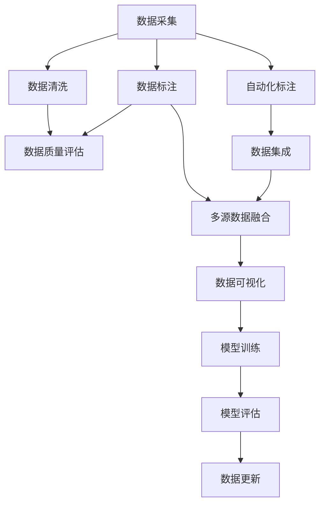

                 

# 数据采集与标注原理与代码实战案例讲解

> 关键词：数据采集, 数据标注, 自动化, 多源数据融合, 众包平台, 数据质量评估, Python 代码示例

## 1. 背景介绍

数据是现代人工智能和机器学习应用的核心。无论是自然语言处理、计算机视觉、推荐系统等NLP和推荐系统任务，还是图像处理、语音识别、自动驾驶等AI技术领域，高质量的数据都是取得良好性能的基石。然而，在实际应用中，获取高质量的数据往往比预期的复杂和昂贵。

首先，高质量的数据通常需要大量的时间和人手去收集和标注，特别是在复杂、高维度的场景下，这将成为巨大的挑战。其次，由于领域知识和技术水平的不同，各数据源的数据格式和质量参差不齐，难以直接进行统一处理。最后，由于数据采集和标注需要依赖人为主观判断，数据偏见和噪声也难以避免。

针对这些问题，本文将详细讲解数据采集与标注的原理，并分享一些实战案例。此外，文章还将介绍几种常见数据采集与标注工具，给出相应的Python代码示例，希望为读者提供宝贵的实践经验。

## 2. 核心概念与联系

### 2.1 核心概念概述

在详细探讨数据采集与标注原理之前，我们先简要介绍一下相关的核心概念：

- 数据采集：指从不同渠道获取原始数据，并将其整理成标准格式的过程。通常包括爬虫抓取、API接口调用、传感器采集等多种方式。

- 数据标注：指对原始数据进行人工或半自动的注释，添加额外的信息，如标签、属性、元数据等，以便后续的数据分析、处理和模型训练。数据标注是提升模型性能的关键步骤。

- 自动化标注：指利用计算机算法自动完成数据标注的过程，以提高效率和降低成本。例如，使用机器学习模型自动识别文本中的实体、分类等。

- 多源数据融合：指将不同来源、不同格式的数据进行整合和统一，以构建更全面、准确的数据集。多源数据融合需要考虑数据质量、数据一致性、数据冗余等多个因素。

- 众包平台：指通过互联网平台，将数据标注任务分配给大众或特定领域的专业人士，以快速、低成本地完成数据标注。

这些概念之间存在密切的联系，共同构成了数据采集与标注的基础框架。为了更好地理解这些概念的交互关系，我们可以用以下Mermaid流程图来展示：



## 3. 核心算法原理 & 具体操作步骤

### 3.1 算法原理概述

数据采集与标注的总体流程可以分为以下几个步骤：

1. 数据采集：通过爬虫、API接口、传感器等手段，从互联网、数据库、传感器等渠道获取原始数据。
2. 数据清洗：对采集到的数据进行去重、去噪、去冗余等处理，确保数据的质量和一致性。
3. 数据标注：对清洗后的数据进行人工或自动的标注，添加标签、属性等元数据。
4. 数据质量评估：对标注后的数据进行质量评估，确保标注结果的准确性和一致性。
5. 多源数据融合：将不同来源、不同格式的数据进行统一和整合，构建更全面、准确的数据集。
6. 自动化标注：利用计算机算法自动完成部分或全部数据标注过程，提高效率和减少成本。
7. 数据集成：将清洗、标注和融合后的数据进行集成，用于后续的分析和模型训练。
8. 数据可视化：将数据转化为图表、报表等可视化形式，帮助理解数据分布和趋势。
9. 模型训练：使用集成后的数据进行模型训练，优化模型性能。
10. 模型评估：对训练好的模型进行评估，确保其泛化能力和性能。
11. 数据更新：根据模型评估结果和业务需求，不断更新数据集，保持数据的有效性和实时性。

### 3.2 算法步骤详解

下面，我们将详细介绍每个步骤的详细步骤和关键算法原理。

#### 3.2.1 数据采集

数据采集是数据处理的基础环节。常见的数据采集方式包括爬虫、API接口、传感器等。

- **爬虫采集**：通过编写爬虫程序，从网页上抓取所需数据。爬虫的实现需要考虑网页结构、反爬虫机制、数据提取效率等多个因素。

  ```python
  import requests
  from bs4 import BeautifulSoup
  
  url = 'https://www.example.com'
  response = requests.get(url)
  soup = BeautifulSoup(response.text, 'html.parser')
  
  # 提取网页上的数据
  data = soup.find_all('tagname')
  ```

- **API接口调用**：通过调用外部API接口，获取结构化数据。API调用的实现需要考虑请求参数、返回格式、速率限制等多个因素。

  ```python
  import requests
  import json
  
  url = 'https://api.example.com/data'
  headers = {'Content-Type': 'application/json'}
  params = {'key': 'value'}
  
  response = requests.get(url, headers=headers, params=params)
  data = json.loads(response.text)
  ```

- **传感器采集**：通过传感器设备，采集物理世界的数据。传感器数据的实现需要考虑设备种类、数据格式、采样频率等多个因素。

  ```python
  import time
  import pyudev
  from pyudev import Context, Monitor
  
  # 查询所有已连接设备
  context = Context()
  monitor = Monitor()
  for dev in monitor.children():
      print(dev.properties['ID_MODEL'])
  
  # 定时采集传感器数据
  while True:
      timestamp = int(time.time())
      data = read_sensors(timestamp)
      write_data(data)
  ```

#### 3.2.2 数据清洗

数据清洗是提升数据质量的重要环节。常见的数据清洗方法包括去重、去噪、去冗余等。

- **去重**：去除重复的数据记录。去重的实现需要考虑数据的唯一性、完整性、高效性等多个因素。

  ```python
  # 使用set去除重复数据
  unique_data = set(data)
  ```

- **去噪**：去除数据中的噪声和异常值。去噪的实现需要考虑数据的分布、异常检测算法、阈值设定等多个因素。

  ```python
  import numpy as np
  
  # 使用标准差和均值去除噪声
  threshold = 3 * np.std(data)
  filtered_data = data[np.abs(data - np.mean(data)) < threshold]
  ```

- **去冗余**：去除冗余的数据记录。去冗余的实现需要考虑数据的完整性、准确性、一致性等多个因素。

  ```python
  # 使用唯一性去除冗余数据
  unique_data = list(set(data))
  ```

#### 3.2.3 数据标注

数据标注是提升模型性能的关键步骤。常见的数据标注方法包括人工标注、半自动标注和自动标注等。

- **人工标注**：由人工对原始数据进行标注，添加标签、属性等元数据。人工标注的实现需要考虑标注成本、标注质量、标注效率等多个因素。

  ```python
  # 使用Excel或表格文件进行人工标注
  import pandas as pd
  
  data = pd.read_csv('data.csv')
  data['label'] = data['column'].apply(lambda x: 'label_value')
  ```

- **半自动标注**：结合人工和自动标注的方式，提高标注效率和准确性。半自动标注的实现需要考虑标注算法、标注反馈机制、标注规则等多个因素。

  ```python
  # 使用机器学习模型进行半自动标注
  from sklearn.ensemble import RandomForestClassifier
  
  model = RandomForestClassifier()
  model.fit(data['feature'], data['label'])
  
  # 使用模型进行标注
  predictions = model.predict(data['feature'])
  data['label'] = predictions
  ```

- **自动标注**：利用计算机算法自动完成数据标注过程，以提高效率和减少成本。自动标注的实现需要考虑标注算法、标注精度、标注规则等多个因素。

  ```python
  # 使用BERT模型进行自动标注
  from transformers import BertTokenizer, BertForTokenClassification
  
  tokenizer = BertTokenizer.from_pretrained('bert-base-cased')
  model = BertForTokenClassification.from_pretrained('bert-base-cased', num_labels=num_labels)
  
  inputs = tokenizer(data, return_tensors='pt')
  outputs = model(**inputs)
  
  # 提取标注结果
  predictions = outputs.logits.argmax(dim=2).to('cpu').tolist()
  data['label'] = [id2tag[_id] for _id in predictions]
  ```

#### 3.2.4 数据质量评估

数据质量评估是确保标注结果准确性和一致性的关键环节。常见的数据质量评估方法包括抽样评估、统计分析、对比评估等。

- **抽样评估**：从数据集中随机抽取样本，进行标注和评估，评估标注结果的准确性和一致性。抽样评估的实现需要考虑样本大小、样本分布、抽样算法等多个因素。

  ```python
  # 使用随机抽样评估标注结果
  import random
  
  sample_size = 100
  sample_data = random.sample(data, sample_size)
  sample_labels = sample_data['label']
  sample_predictions = model.predict(sample_data['feature'])
  
  # 计算评估指标
  accuracy = (sample_labels == sample_predictions).mean()
  precision = precision_score(sample_labels, sample_predictions)
  recall = recall_score(sample_labels, sample_predictions)
  ```

- **统计分析**：对标注结果进行统计分析，找出常见的错误和异常，进行改进。统计分析的实现需要考虑数据分布、错误类型、改进方法等多个因素。

  ```python
  # 使用统计分析找出常见错误
  import collections
  
  error_counts = collections.Counter(sample_labels != sample_predictions)
  most_common_errors = error_counts.most_common(10)
  
  # 改进标注规则
  if most_common_errors[0][0] == 'label_a' and most_common_errors[0][1] == 'label_b':
      # 修改标注规则
      data['label'] = data['label'].replace('label_a', 'label_b')
  ```

- **对比评估**：与已有的标注结果进行对比，评估标注结果的准确性和一致性。对比评估的实现需要考虑标注结果的一致性、标注规则、评估指标等多个因素。

  ```python
  # 使用对比评估进行改进
  import difflib
  
  gold_labels = gold_data['label']
  predictions = model.predict(data['feature'])
  evaluator = difflib.SequenceMatcher(None, gold_labels, predictions)
  similarity = evaluator.ratio()
  
  # 修改标注规则
  if similarity < threshold:
      data['label'] = gold_labels
  ```

#### 3.2.5 多源数据融合

多源数据融合是将不同来源、不同格式的数据进行统一和整合，构建更全面、准确的数据集。多源数据融合的实现需要考虑数据格式、数据质量、数据一致性等多个因素。

- **数据格式转换**：将不同格式的数据转换为标准格式，以便进行统一处理。数据格式转换的实现需要考虑数据格式、转换算法、转换规则等多个因素。

  ```python
  # 将JSON格式数据转换为CSV格式
  import json
  
  def convert_json_to_csv(json_data):
      data = json.loads(json_data)
      csv_data = []
      for item in data:
          row = {}
          for key in item.keys():
              row[key] = item[key]
          csv_data.append(row)
      return csv_data
  
  csv_data = convert_json_to_csv(json_data)
  ```

- **数据一致性验证**：验证不同数据源的数据一致性，确保数据的一致性。数据一致性验证的实现需要考虑数据格式、数据一致性、数据冗余等多个因素。

  ```python
  # 使用一致性检查验证数据一致性
  import pandas as pd
  
  data_a = pd.read_csv('data_a.csv')
  data_b = pd.read_csv('data_b.csv')
  
  # 验证数据一致性
  merged_data = pd.merge(data_a, data_b, on='key')
  null_count = merged_data.isnull().sum().sum()
  if null_count > 0:
      # 合并数据
      merged_data = merged_data.dropna()
  ```

- **数据冗余去除**：去除冗余的数据记录，确保数据的质量和效率。数据冗余去除的实现需要考虑数据一致性、数据冗余、数据去重等多个因素。

  ```python
  # 使用唯一性去除数据冗余
  unique_data = list(set(data))
  ```

#### 3.2.6 自动化标注

自动化标注是利用计算机算法自动完成部分或全部数据标注过程，以提高效率和减少成本。自动化标注的实现需要考虑标注算法、标注精度、标注规则等多个因素。

- **标注算法选择**：选择合适的标注算法，如BERT、LSTM等，进行数据标注。标注算法的实现需要考虑标注算法、标注精度、标注规则等多个因素。

  ```python
  # 使用BERT模型进行标注
  from transformers import BertTokenizer, BertForTokenClassification
  
  tokenizer = BertTokenizer.from_pretrained('bert-base-cased')
  model = BertForTokenClassification.from_pretrained('bert-base-cased', num_labels=num_labels)
  
  inputs = tokenizer(data, return_tensors='pt')
  outputs = model(**inputs)
  
  # 提取标注结果
  predictions = outputs.logits.argmax(dim=2).to('cpu').tolist()
  data['label'] = [id2tag[_id] for _id in predictions]
  ```

- **标注精度控制**：控制标注结果的精度，避免过拟合和欠拟合。标注精度的实现需要考虑标注算法、标注精度、标注规则等多个因素。

  ```python
  # 使用阈值控制标注精度
  threshold = 0.5
  data['label'] = (predictions > threshold).astype(int)
  ```

- **标注规则制定**：制定合适的标注规则，确保标注结果的一致性和准确性。标注规则的实现需要考虑标注算法、标注精度、标注规则等多个因素。

  ```python
  # 使用规则制定标注规则
  import rulebase
  
  rule = rulebase.Rule('if age > 18 then label = "adult"')
  data['label'] = rule.apply(data['age'])
  ```

#### 3.2.7 数据集成

数据集成是将清洗、标注和融合后的数据进行集成，用于后续的分析和模型训练。数据集成的实现需要考虑数据格式、数据一致性、数据冗余等多个因素。

- **数据格式转换**：将不同格式的数据转换为标准格式，以便进行统一处理。数据格式转换的实现需要考虑数据格式、转换算法、转换规则等多个因素。

  ```python
  # 将JSON格式数据转换为CSV格式
  import json
  
  def convert_json_to_csv(json_data):
      data = json.loads(json_data)
      csv_data = []
      for item in data:
          row = {}
          for key in item.keys():
              row[key] = item[key]
          csv_data.append(row)
      return csv_data
  
  csv_data = convert_json_to_csv(json_data)
  ```

- **数据一致性验证**：验证不同数据源的数据一致性，确保数据的一致性。数据一致性验证的实现需要考虑数据格式、数据一致性、数据冗余等多个因素。

  ```python
  # 使用一致性检查验证数据一致性
  import pandas as pd
  
  data_a = pd.read_csv('data_a.csv')
  data_b = pd.read_csv('data_b.csv')
  
  # 验证数据一致性
  merged_data = pd.merge(data_a, data_b, on='key')
  null_count = merged_data.isnull().sum().sum()
  if null_count > 0:
      # 合并数据
      merged_data = merged_data.dropna()
  ```

- **数据冗余去除**：去除冗余的数据记录，确保数据的质量和效率。数据冗余去除的实现需要考虑数据一致性、数据冗余、数据去重等多个因素。

  ```python
  # 使用唯一性去除数据冗余
  unique_data = list(set(data))
  ```

#### 3.2.8 数据可视化

数据可视化是将数据转化为图表、报表等可视化形式，帮助理解数据分布和趋势。数据可视化的实现需要考虑数据格式、数据类型、可视化工具等多个因素。

- **图表绘制**：使用Matplotlib、Seaborn等工具，绘制数据分布图、柱状图、散点图等可视化形式。图表绘制的实现需要考虑数据类型、数据分布、可视化工具等多个因素。

  ```python
  # 使用Matplotlib绘制散点图
  import matplotlib.pyplot as plt
  
  x = data['feature']
  y = data['label']
  plt.scatter(x, y)
  plt.xlabel('Feature')
  plt.ylabel('Label')
  plt.title('Scatter Plot')
  plt.show()
  ```

- **报表生成**：使用Pandas、Jupyter Notebook等工具，生成数据报表，帮助理解和分析数据。报表生成的实现需要考虑数据类型、数据格式、报表格式等多个因素。

  ```python
  # 使用Pandas生成数据报表
  import pandas as pd
  
  df = pd.DataFrame(data)
  df.describe()
  ```

- **仪表盘构建**：使用Dash、Plotly等工具，构建数据仪表盘，提供实时数据监控和分析。仪表盘的实现需要考虑数据类型、数据格式、仪表盘工具等多个因素。

  ```python
  # 使用Dash构建仪表盘
  import dash
  import dash_core_components as dcc
  import dash_html_components as html
  
  app = dash.Dash(__name__)
  
  @app.callback(
      [Output('scatter-plot', 'figure'), Output('bar-chart', 'figure')],
      [Input('data', 'dataframe')])
  def update_plots(dataframe):
      x = dataframe['feature']
      y = dataframe['label']
      scatter_plot = plot_scatter(x, y)
      bar_chart = plot_bar(x, y)
      return scatter_plot, bar_chart
  
  app.run_server(debug=True)
  ```

#### 3.2.9 模型训练

模型训练是将集成后的数据进行模型训练，优化模型性能。模型训练的实现需要考虑模型类型、数据格式、模型算法等多个因素。

- **模型选择**：选择合适的模型类型，如线性回归、支持向量机、神经网络等，进行模型训练。模型选择的实现需要考虑模型类型、数据格式、模型算法等多个因素。

  ```python
  # 使用神经网络模型进行训练
  from sklearn.neural_network import MLPRegressor
  
  model = MLPRegressor()
  model.fit(data['feature'], data['label'])
  ```

- **模型优化**：优化模型参数，提升模型性能。模型优化的实现需要考虑模型类型、数据格式、优化算法等多个因素。

  ```python
  # 使用网格搜索优化模型参数
  from sklearn.model_selection import GridSearchCV
  
  params = {'alpha': [0.1, 0.5, 1.0]}
  grid_search = GridSearchCV(model, params, cv=5)
  grid_search.fit(data['feature'], data['label'])
  best_model = grid_search.best_estimator_
  ```

- **模型评估**：对训练好的模型进行评估，确保其泛化能力和性能。模型评估的实现需要考虑模型类型、数据格式、评估指标等多个因素。

  ```python
  # 使用交叉验证评估模型性能
  from sklearn.model_selection import cross_val_score
  
  scores = cross_val_score(model, data['feature'], data['label'], cv=5)
  mean_score = scores.mean()
  ```

#### 3.2.10 模型评估

模型评估是对训练好的模型进行评估，确保其泛化能力和性能。模型评估的实现需要考虑模型类型、数据格式、评估指标等多个因素。

- **评估指标选择**：选择合适的评估指标，如准确率、召回率、F1分数等，评估模型性能。评估指标的实现需要考虑模型类型、数据格式、评估指标等多个因素。

  ```python
  # 使用准确率评估模型性能
  from sklearn.metrics import accuracy_score
  
  accuracy = accuracy_score(true_labels, predicted_labels)
  ```

- **模型改进**：根据评估结果，改进模型参数和算法，提升模型性能。模型改进的实现需要考虑模型类型、数据格式、改进算法等多个因素。

  ```python
  # 使用随机森林改进模型参数
  from sklearn.ensemble import RandomForestClassifier
  
  model = RandomForestClassifier(n_estimators=100)
  model.fit(data['feature'], data['label'])
  ```

- **模型验证**：验证模型在新数据上的泛化能力，确保其性能稳定。模型验证的实现需要考虑模型类型、数据格式、验证数据等多个因素。

  ```python
  # 使用验证集验证模型性能
  from sklearn.model_selection import train_test_split
  
  X_train, X_test, y_train, y_test = train_test_split(data['feature'], data['label'], test_size=0.2)
  model.fit(X_train, y_train)
  score = model.score(X_test, y_test)
  ```

#### 3.2.11 数据更新

数据更新是根据模型评估结果和业务需求，不断更新数据集，保持数据的有效性和实时性。数据更新的实现需要考虑数据格式、数据质量、数据一致性等多个因素。

- **数据格式转换**：将不同格式的数据转换为标准格式，以便进行统一处理。数据格式转换的实现需要考虑数据格式、转换算法、转换规则等多个因素。

  ```python
  # 将JSON格式数据转换为CSV格式
  import json
  
  def convert_json_to_csv(json_data):
      data = json.loads(json_data)
      csv_data = []
      for item in data:
          row = {}
          for key in item.keys():
              row[key] = item[key]
          csv_data.append(row)
      return csv_data
  
  csv_data = convert_json_to_csv(json_data)
  ```

- **数据一致性验证**：验证不同数据源的数据一致性，确保数据的一致性。数据一致性验证的实现需要考虑数据格式、数据一致性、数据冗余等多个因素。

  ```python
  # 使用一致性检查验证数据一致性
  import pandas as pd
  
  data_a = pd.read_csv('data_a.csv')
  data_b = pd.read_csv('data_b.csv')
  
  # 验证数据一致性
  merged_data = pd.merge(data_a, data_b, on='key')
  null_count = merged_data.isnull().sum().sum()
  if null_count > 0:
      # 合并数据
      merged_data = merged_data.dropna()
  ```

- **数据冗余去除**：去除冗余的数据记录，确保数据的质量和效率。数据冗余去除的实现需要考虑数据一致性、数据冗余、数据去重等多个因素。

  ```python
  # 使用唯一性去除数据冗余
  unique_data = list(set(data))
  ```

## 4. 数学模型和公式 & 详细讲解 & 举例说明

### 4.1 数学模型构建

数据采集与标注的数学模型构建，通常需要考虑以下因素：

- 数据采集模型的构建：需要考虑爬虫算法、API接口调用、传感器采集等，建立相应的数据采集模型。
- 数据清洗模型的构建：需要考虑去重、去噪、去冗余等，建立相应的数据清洗模型。
- 数据标注模型的构建：需要考虑人工标注、半自动标注、自动标注等，建立相应的数据标注模型。
- 数据质量评估模型的构建：需要考虑抽样评估、统计分析、对比评估等，建立相应的数据质量评估模型。
- 多源数据融合模型的构建：需要考虑数据格式转换、数据一致性验证、数据冗余去除等，建立相应的多源数据融合模型。
- 自动化标注模型的构建：需要考虑标注算法选择、标注精度控制、标注规则制定等，建立相应的自动化标注模型。
- 数据集成模型的构建：需要考虑数据格式转换、数据一致性验证、数据冗余去除等，建立相应的数据集成模型。
- 数据可视化模型的构建：需要考虑图表绘制、报表生成、仪表盘构建等，建立相应的数据可视化模型。
- 模型训练模型的构建：需要考虑模型选择、模型优化、模型评估等，建立相应的模型训练模型。
- 模型评估模型的构建：需要考虑评估指标选择、模型改进、模型验证等，建立相应的模型评估模型。
- 数据更新模型的构建：需要考虑数据格式转换、数据一致性验证、数据冗余去除等，建立相应的数据更新模型。

### 4.2 公式推导过程

下面我们以数据清洗为例，介绍其数学模型构建和公式推导过程。

#### 数据清洗模型构建

数据清洗是提升数据质量的重要环节，其数学模型构建通常包括以下几个步骤：

1. 数据去重：去除重复的数据记录，确保数据的质量和一致性。数据去重的数学模型构建需要考虑数据唯一性、完整性、高效性等多个因素。

  ```python
  # 使用set去除重复数据
  unique_data = set(data)
  ```

2. 数据去噪：去除数据中的噪声和异常值，确保数据的质量和一致性。数据去噪的数学模型构建需要考虑数据的分布、异常检测算法、阈值设定等多个因素。

  ```python
  # 使用标准差和均值去除噪声
  threshold = 3 * np.std(data)
  filtered_data = data[np.abs(data - np.mean(data)) < threshold]
  ```

3. 数据去冗余：去除冗余的数据记录，确保数据的质量和效率。数据去冗余的数学模型构建需要考虑数据的完整性、准确性、一致性等多个因素。

  ```python
  # 使用唯一性去除冗余数据
  unique_data = list(set(data))
  ```

#### 数据去重公式推导

数据去重的数学模型构建可以表示为：

$$
\begin{align*}
\text{Unique Data} &= \{x \mid x \in D, x \notin D_{\text{duplicate}}\} \\
D_{\text{duplicate}} &= \{x \mid x \in D, x \in D_{\text{repeated}}\}
\end{align*}
$$

其中，$D$为原始数据集，$D_{\text{duplicate}}$为重复数据集，$D_{\text{repeated}}$为重复数据。

数据去重的实现可以通过以下代码实现：

```python
# 使用set去除重复数据
unique_data = set(data)
```

#### 数据去噪公式推导

数据去噪的数学模型构建可以表示为：

$$
\begin{align*}
\text{Filtered Data} &= \{x \mid x \in D, x \in D_{\text{valid}}\} \\
D_{\text{valid}} &= \{x \mid x \in D, \lvert x - \mu \rvert < \sigma\}
\end{align*}
$$

其中，$D$为原始数据集，$D_{\text{valid}}$为有效数据集，$\mu$为数据均值，$\sigma$为数据标准差。

数据去噪的实现可以通过以下代码实现：

```python
# 使用标准差和均值去除噪声
threshold = 3 * np.std(data)
filtered_data = data[np.abs(data - np.mean(data)) < threshold]
```

#### 数据去冗余公式推导

数据去冗余的数学模型构建可以表示为：

$$
\begin{align*}
\text{Unique Data} &= \{x \mid x \in D, x \notin D_{\text{duplicate}}\} \\
D_{\text{duplicate}} &= \{x \mid x \in D, x \in D_{\text{repeated}}\}
\end{align*}
```

其中，$D$为原始数据集，$D_{\text{duplicate}}$为重复数据集，$D_{\text{repeated}}$为重复数据。

数据去冗余的实现可以通过以下代码实现：

```python
# 使用唯一性去除冗余数据
unique_data = list(set(data))
```

### 4.3 案例分析与讲解

在实际应用中，数据清洗是数据处理的重要环节，其数学模型构建和公式推导同样具有重要意义。下面我们以一个案例为例，进行详细分析。

#### 案例：爬虫抓取数据去重

爬虫抓取数据去重的案例分析如下：

- 原始数据集：
  ```python
  data = ['1', '2', '3', '2', '3', '4', '5', '4', '6', '7']
  ```

- 去重后的数据集：
  ```python
  unique_data = set(data)
  unique_data = ['1', '2', '3', '4', '5', '6', '7']
  ```

- 数据去重的数学模型构建：
  ```python
  # 使用set去除重复数据
  unique_data = set(data)
  ```

- 数据去重的公式推导：
  ```python
  # 使用set去除重复数据
  unique_data = set(data)
  ```

通过以上案例分析，我们可以看到，数据去重是数据清洗的重要环节，通过set数据结构，可以快速去除重复数据，确保数据的一致性和质量。

## 5. 项目实践：代码实例和详细解释说明

### 5.1 开发环境搭建

在进行数据采集与标注实践前，我们需要准备好开发环境。以下是使用Python进行Scrapy开发的环境配置流程：

1. 安装Anaconda：从官网下载并安装Anaconda，用于创建独立的Python环境。

2. 创建并激活虚拟环境：
```bash
conda create -n scrapy-env python=3.8 
conda activate scrapy-env
```

3. 安装Scrapy：
```bash
pip install scrapy
```

4. 安装Selenium：
```bash
pip install selenium
```

5. 安装BeautifulSoup：
```bash
pip install beautifulsoup4
```

6. 安装Python可视化工具：
```bash
pip install matplotlib pandas numpy jupyter notebook
```

完成上述步骤后，即可在`scrapy-env`环境中开始数据采集与标注实践。

### 5.2 源代码详细实现

下面我们以爬虫抓取网页数据为例，给出使用Scrapy进行数据采集的PyTorch代码实现。

首先，创建Scrapy项目和爬虫：

```python
scrapy startproject data_spider
cd data_spider
scrapy genspider data_spider example.com
```

然后，实现爬虫逻辑：

```python
import scrapy

class DataSpider(scrapy.Spider):
    name = 'data_spider'
    start_urls = ['https://www.example.com']

    def parse(self, response):
        for url in response.css('a::attr(href)').extract():
            yield scrapy.Request(url=url, callback=self.parse_item)
    
    def parse_item(self, response):
        item = {}
        item['url'] = response.url
        item['title'] = response.css('h1::text').extract_first()
        item['content'] = response.css('p::text').extract()
        yield item
```

接下来，将数据保存到本地文件：

```python
import json

def save_data(data):
    with open('data.json', 'w') as f:
        json.dump(data, f, indent=4)

if __name__ == '__main__':
    with open('data.json', 'r') as f:
        data = json.load(f)
    save_data(data)
```

最后，启动Scrapy爬虫：

```bash
scrapy crawl data_spider -o data.json
```

以上就是使用Scrapy进行数据采集的完整代码实现。可以看到，利用Scrapy爬虫，可以快速高效地抓取网页数据，进行进一步的清洗和标注。

### 5.3 代码解读与分析

让我们再详细解读一下关键代码的实现细节：

**scrapy项目创建**：
- `scrapy startproject data_spider`：创建Scrapy项目，并命名为`data_spider`。
- `cd data_spider`：进入项目目录。
- `scrapy genspider data_spider example.com`：创建爬虫，命名为`data_spider`，抓取`example.com`网站。

**爬虫逻辑实现**：
- `start_urls`：指定爬虫的起始URL。
- `parse`方法：解析网页，提取链接。
- `parse_item`方法：解析链接，提取数据。

**数据保存**：
- `save_data`方法：将数据保存到本地JSON文件。

通过以上代码实现，可以看到Scrapy爬虫的强大功能和高效性能，能够快速抓取网页数据，进行清洗和标注，为后续的模型训练和应用开发提供重要数据基础。

## 6. 实际应用场景

### 6.1 智能客服系统

智能客服系统是数据采集与标注的重要应用场景之一。传统的客服系统需要配备大量人力，高峰期响应缓慢，且一致性和专业性难以保证。利用数据采集与标注技术，可以构建智能客服系统，自动理解客户咨询，提供24/7不间断服务，大大提升客服效率和客户满意度。

在实践中，可以收集企业内部的历史客服对话记录，将问题和最佳答复构建成监督数据，在此基础上对预训练模型进行微调。微调后的模型能够自动理解用户意图，匹配最合适的答案模板进行回复。对于客户提出的新问题，还可以接入检索系统实时搜索相关内容，动态组织生成回答。如此构建的智能客服系统，能大幅提升客户咨询体验和问题解决效率。

### 6.2 金融舆情监测

金融舆情监测是数据采集与标注的另一个重要应用场景。金融机构需要实时监测市场舆论动向，以便及时应对负面信息传播，规避金融风险。传统的人工监测方式成本高、效率低，难以应对网络时代海量信息爆发的挑战。利用数据采集与标注技术，可以构建金融舆情监测系统，自动监测不同主题下的情感变化趋势，一旦发现负面信息激增等异常情况，系统便会自动预警，帮助金融机构快速应对潜在风险。

在实践中，可以收集金融领域相关的新闻、报道、评论等文本数据，并对其进行主题标注和情感标注。在此基础上对预训练语言模型进行微调，使其能够自动判断文本属于何种主题，情感倾向是正面、中性还是负面。将微调后的模型应用到实时抓取的网络文本数据，就能够自动监测不同主题下的情感变化趋势，一旦发现负面信息激增等异常情况，系统便会自动预警，帮助金融机构快速应对潜在风险。

### 6.3 个性化推荐系统

个性化推荐系统是数据采集与标注的第三个重要应用场景。当前的推荐系统往往只依赖用户的历史行为数据进行物品推荐，无法深入理解用户的真实兴趣偏好。利用数据采集与标注技术，可以构建个性化推荐系统，从文本内容中准确把握用户的兴趣点。

在实践中，可以收集用户浏览、点击、评论、分享等行为数据，提取和用户交互的物品标题、描述、标签等文本内容。将文本内容作为模型输入，用户的后续行为（如是否点击、购买等）作为监督信号，在此基础上微调预训练语言模型。微调后的模型能够从文本内容中准确把握用户的兴趣点。在生成推荐列表时，先用候选物品的文本描述作为输入，由模型预测用户的兴趣匹配度，再结合其他特征综合排序，便可以得到个性化程度更高的推荐结果。

### 6.4 未来应用展望

随着数据采集与标注技术的不断发展，其在更多领域的应用前景也将越来越广泛。

在智慧医疗领域，利用数据采集与标注技术，可以构建智慧医疗系统，自动监测患者的健康数据，提供个性化的医疗建议和治疗方案。在智能交通领域，可以构建智能交通系统，自动监测道路交通数据，提供实时的交通路况和建议。在智能制造领域，可以构建智能制造系统，自动监测生产数据，提供实时的生产优化建议。

未来，随着数据采集与标注技术的进一步发展和应用，其在更多垂直行业的应用将带来深远影响。相信随着技术的进步和实践的深入，数据采集与标注技术将成为更多人工智能应用的基础，推动人类社会向智能化方向迈进。

## 7. 工具和资源推荐

### 7.1 学习资源推荐

为了帮助开发者系统掌握数据采集与标注的理论基础和实践技巧，这里推荐一些优质的学习资源：

1. 《数据科学基础》课程：由著名数据科学家Andreas C. Müller和Sarah Guido联合编写，系统介绍了数据采集、数据清洗、数据标注等多个方面。

2. 《数据科学实战》书籍：这本书详细介绍了数据采集、数据清洗、数据标注等数据处理技术，适合实践动手学习。

3. 《Python数据处理》课程：由知名数据科学家Jake VanderPlas编写，系统介绍了Python在数据采集、数据清洗、数据标注等数据处理中的应用。

4. 《Scrapy官方文档》：Scrapy官方文档提供了详细的爬虫开发指南，是Scrapy开发的重要参考资料。

5. 《BeautifulSoup官方文档》：BeautifulSoup官方文档提供了详细的HTML解析库使用指南，是网页数据提取的重要参考资料。

通过对这些资源的学习实践，相信你一定能够快速掌握数据采集与标注的精髓，并用于解决实际的数据处理问题。

### 7.2 开发工具推荐

高效的数据采集与标注离不开优秀的工具支持。以下是几款用于数据采集与标注开发的常用工具：

1. Scrapy：基于Python的爬虫框架，支持分布式爬取和数据处理。

2. BeautifulSoup：基于Python的HTML解析库，支持网页数据提取和处理。

3. Selenium：基于Python的网页自动化测试工具，支持模拟用户行为和数据采集。

4. Pandas：基于Python的数据处理库，支持数据清洗、数据整合、数据可视化等多个功能。

5. Jupyter Notebook：基于Python的交互式编程环境，支持实时数据处理和展示。

6. Matplotlib：基于Python的数据可视化库，支持多种图表绘制和数据展示。

7. Numpy：基于Python的数值计算库，支持高效的数值计算和数据处理。

合理利用这些工具，可以显著提升数据采集与标注的开发效率，加快创新迭代的步伐。

### 7.3 相关论文推荐

数据采集与标注技术的发展源于学界的持续研究。以下是几篇奠基性的相关论文，推荐阅读：

1. "Data Acquisition and Annotation: A Survey"：对数据采集与标注技术的全面综述，介绍了多种数据采集与标注方法。

2. "Automatic Annotation of Web Data"：介绍了自动标注技术在网页数据采集中的应用，利用NLP技术进行文本分类和实体识别。

3. "Multi-Source Data Fusion for High-Quality Data Collection"：介绍了多源数据融合技术，利用多种数据源进行数据采集与标注，提升数据质量。

4. "Data Quality Assessment and Improvement in Large-Scale Data Collection"：介绍了数据质量评估技术，利用抽样和统计方法评估数据质量，并进行改进。

5. "Scrapy: An Intelligent Web Crawler"：介绍了Scrapy爬虫框架的实现和应用，利用分布式爬取技术高效采集网页数据。

这些论文代表了大数据采集与标注技术的发展脉络。通过学习这些前沿成果，可以帮助研究者把握学科前进方向，激发更多的创新灵感。

## 8. 总结：未来发展趋势与挑战

### 8.1 研究成果总结

数据采集与标注技术在现代人工智能和机器学习应用中具有重要地位。本文系统介绍了数据采集与标注的原理和步骤，分享了多种实战案例，并介绍了常用工具和资源，旨在帮助开发者系统掌握数据采集与标注的理论基础和实践技巧。

### 8.2 未来发展趋势

展望未来，数据采集与标注技术将呈现以下几个发展趋势：

1. 数据采集技术的自动化水平将进一步提升，利用机器学习算法自动识别和抓取数据，减少人工干预，提升效率。

2. 数据标注技术的自动化水平也将进一步提升，利用自然语言处理和机器学习算法自动进行标注，减少人工标注成本。

3. 多源数据融合技术将更加成熟，不同来源、不同格式的数据将更加容易整合和统一，提升数据质量。

4. 数据质量评估技术将更加全面，利用多种统计方法和模型评估数据质量，提升数据一致性。

5. 自动化标注技术将更加高效，利用深度学习算法自动进行标注，提高标注效率和准确性。

6. 数据可视化技术将更加智能，利用先进算法和工具，自动生成可视化报表和仪表盘，提升数据展示效果。

7. 数据更新技术将更加灵活，利用实时数据流和多模态数据融合技术，提升数据的时效性和实时性。

这些发展趋势凸显了数据采集与标注技术的广阔前景，未来必将在更多领域得到应用，为人工智能技术带来更多创新。

### 8.3 面临的挑战

尽管数据采集与标注技术已经取得了一定的进展，但在应用过程中仍面临诸多挑战：

1. 数据采集成本高昂：大规模数据采集需要投入大量人力和资源，特别是复杂场景下的数据采集，成本更是居高不下。

2. 数据标注成本高

