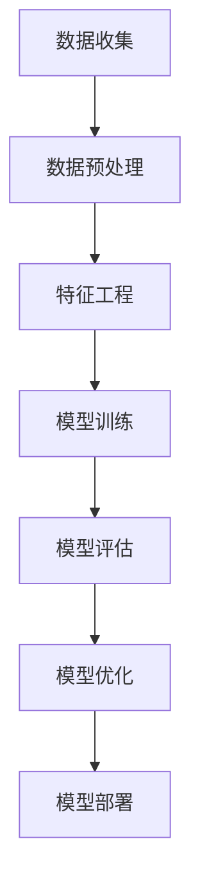

                 

# 数据驱动决策：科学决策，提升电商平台供给能力

## 1. 背景介绍

在当今瞬息万变的电子商务市场，企业面临着严峻的竞争压力，如何准确预测市场需求、优化库存管理、提升供应链效率，成为电商平台运营的关键。在信息爆炸、客户需求多样化的背景下，仅凭经验和传统方法已经难以应对复杂的经营挑战。数据驱动决策(D-driven Decision Making)成为电商平台获取竞争优势的重要手段。

基于此，本文将从数据收集与预处理、分析与建模、优化与部署等多个角度，全面剖析如何通过数据驱动，科学决策，提升电商平台供给能力。文章将详细介绍相关核心概念、算法原理、具体操作步骤，并结合案例进行详细分析与讲解，为电商平台运营提供可操作的技术指导。

## 2. 核心概念与联系

### 2.1 核心概念概述

为更好地理解数据驱动决策在电商平台中的应用，我们首先介绍几个核心概念：

- **电商供给能力**：指电商平台库存水平、物流配送能力、商品种类和数量等方面的综合能力。良好的供给能力有助于提高客户满意度，提升平台的用户粘性。
- **数据驱动决策**：基于数据采集、分析、建模、可视化的过程，科学制定电商平台的运营决策，以数据为导向的决策可以更准确、客观地反映真实情况，减少人为因素干扰。
- **模型优化与部署**：通过构建高效准确的数学模型，并结合机器学习、深度学习等技术手段，不断优化决策模型，并在实际运营环境中部署应用。

### 2.2 核心概念原理和架构的 Mermaid 流程图

以下Mermaid流程图展示了数据驱动决策在电商平台供给能力提升中的核心流程：



- 数据收集：获取电商平台的交易数据、用户行为数据、库存数据、物流数据等。
- 数据预处理：清洗数据、填补缺失、标准化处理、特征选择等。
- 特征工程：提取、构建、筛选与业务相关的特征。
- 模型训练：构建基于机器学习、深度学习的决策模型，如回归模型、分类模型、聚类模型等。
- 模型评估：使用测试集或交叉验证等方法评估模型的性能。
- 模型优化：通过超参数调整、集成学习等方法改进模型。
- 模型部署：将优化后的模型应用到电商平台中，实现决策支持。

这些核心概念共同构成了数据驱动决策的完整流程，确保电商平台的供给能力不断提升。

## 3. 核心算法原理 & 具体操作步骤

### 3.1 算法原理概述

数据驱动决策的核心是利用历史数据训练模型，预测未来情况并据此做出最优决策。算法原理主要涉及以下几个关键步骤：

1. **数据收集与预处理**：收集电商平台的各类数据，并进行清洗、转换和标准化处理，以提升数据质量。
2. **特征工程**：从原始数据中提取、构建、筛选与业务相关的特征，以增强模型的预测能力。
3. **模型选择与训练**：选择合适的模型（如线性回归、决策树、神经网络等），并利用历史数据进行训练。
4. **模型评估与优化**：通过交叉验证等方法评估模型性能，并根据评估结果调整模型参数和结构。
5. **模型部署与应用**：将优化后的模型部署到电商平台的决策系统中，实时预测和调整供给策略。

### 3.2 算法步骤详解

以下是数据驱动决策在电商平台中的应用详细操作步骤：

**Step 1: 数据收集**

- **交易数据**：记录平台内的所有交易信息，包括商品ID、价格、时间戳、订单量等。
- **用户行为数据**：跟踪用户在平台上的点击、浏览、收藏、购买等行为，获取用户兴趣和偏好。
- **库存数据**：实时监控各商品的库存数量、位置、上架时间等信息。
- **物流数据**：收集物流配送信息，包括货物状态、运输方式、到货时间等。

**Step 2: 数据预处理**

- **清洗与补全**：移除异常值和缺失值，补全缺失数据，确保数据完整性。
- **数据标准化**：对数值型数据进行归一化处理，对类别型数据进行独热编码，提高模型输入的一致性。
- **特征选择**：使用统计方法或算法（如Pearson相关系数、LASSO等）选择最相关的特征，减少噪声。

**Step 3: 特征工程**

- **构建特征**：将原始数据转化为对模型有用的特征，如滑动窗口特征、时序特征、交叉特征等。
- **特征选择**：使用相关性分析、主成分分析等方法，进一步筛选和降维，减少特征数量。
- **特征变换**：对某些特征进行对数、平方根等变换，增强模型预测能力。

**Step 4: 模型训练与评估**

- **模型选择**：根据任务性质选择合适的模型，如线性回归、决策树、神经网络等。
- **模型训练**：使用训练集对模型进行训练，调整模型参数，提升预测精度。
- **模型评估**：利用验证集或交叉验证方法评估模型性能，确定最佳模型。

**Step 5: 模型优化**

- **超参数调整**：通过网格搜索、随机搜索等方法优化模型超参数。
- **集成学习**：使用集成学习（如Bagging、Boosting）提升模型鲁棒性和泛化能力。
- **模型融合**：结合多个模型的预测结果，提高决策准确性。

**Step 6: 模型部署与应用**

- **模型部署**：将优化后的模型部署到电商平台的决策系统中，实时更新预测结果。
- **决策制定**：根据模型预测结果，制定库存管理、物流调度等决策。
- **反馈与迭代**：收集实际运营数据，反馈给模型进行迭代优化。

### 3.3 算法优缺点

数据驱动决策在电商平台中的应用具有以下优点：

- **数据驱动**：决策过程基于数据和模型，客观性强，减少人为因素干扰。
- **实时预测**：能够实时处理和分析数据，及时调整决策策略。
- **泛化能力强**：通过大量历史数据训练模型，具有较强的泛化能力，适用于不同场景和数据分布。

同时，该方法也存在一些局限性：

- **依赖数据质量**：数据收集和预处理过程繁琐，数据质量对模型性能有重大影响。
- **模型复杂度**：构建高效准确的数据驱动模型需要丰富的领域知识和算法经验。
- **计算资源需求高**：模型训练和优化需要强大的计算资源，对硬件设备要求较高。

尽管存在这些局限性，数据驱动决策在电商平台中的应用已经得到了广泛验证，成为提高供给能力的重要手段。

### 3.4 算法应用领域

数据驱动决策在电商平台的各类任务中得到了广泛应用，包括：

- **库存管理**：通过预测销售趋势，优化商品库存，降低库存成本，提升库存周转率。
- **需求预测**：利用历史销售数据和用户行为数据，预测未来需求，优化供应链管理。
- **促销策略**：根据用户偏好和消费习惯，制定个性化促销活动，提高用户转化率。
- **物流优化**：结合物流数据和需求预测，优化配送路线和运输方式，降低物流成本。
- **风险控制**：通过分析交易数据和用户行为，识别潜在风险，降低欺诈损失。

## 4. 数学模型和公式 & 详细讲解 & 举例说明

### 4.1 数学模型构建

在电商平台的数据驱动决策中，常用的数学模型包括线性回归、决策树、神经网络等。

**线性回归模型**：
- 假设销售量 $y$ 与时间 $t$ 呈线性关系，模型表达式为：
  $$
  y = \beta_0 + \beta_1 t + \epsilon
  $$
  其中 $\beta_0, \beta_1$ 为模型参数，$\epsilon$ 为误差项。

**决策树模型**：
- 利用历史销售数据构建决策树，模型表达式为：
  $$
  \begin{cases}
  \text{if}\ t \leq T_1 \wedge t \geq T_0 & \text{then}\ f(t) = C_1 \\
  \text{if}\ t > T_1 & \text{then}\ f(t) = C_2
  \end{cases}
  $$
  其中 $T_0, T_1$ 为决策点，$C_1, C_2$ 为叶子节点的预测值。

**神经网络模型**：
- 使用多层感知器(MLP)，模型表达式为：
  $$
  f(x) = \sigma(\mathbf{W}_n \sigma(\mathbf{W}_{n-1} \cdots \sigma(\mathbf{W}_1 x + b_1) + b_2) + \cdots + b_n)
  $$
  其中 $\sigma$ 为激活函数，$\mathbf{W}$ 为权重矩阵，$b$ 为偏置项。

### 4.2 公式推导过程

以线性回归模型为例，推导其最小二乘法求解过程：

设样本数据为 $(x_i, y_i)$，其中 $i = 1, 2, \ldots, n$。假设线性回归模型为：
$$
y = \beta_0 + \beta_1 x + \epsilon
$$
根据最小二乘法的思想，我们希望最小化预测误差 $\epsilon_i = y_i - (\beta_0 + \beta_1 x_i)$ 的平方和：
$$
\sum_{i=1}^n \epsilon_i^2 = \sum_{i=1}^n (y_i - (\beta_0 + \beta_1 x_i))^2
$$
对该式求导，并令导数为零，可得：
$$
\begin{cases}
\frac{\partial}{\partial \beta_0} \sum_{i=1}^n (y_i - (\beta_0 + \beta_1 x_i))^2 = -2\sum_{i=1}^n (y_i - (\beta_0 + \beta_1 x_i)) = 0 \\
\frac{\partial}{\partial \beta_1} \sum_{i=1}^n (y_i - (\beta_0 + \beta_1 x_i))^2 = -2\sum_{i=1}^n x_i(y_i - (\beta_0 + \beta_1 x_i)) = 0
\end{cases}
$$
解上述方程组，即可得模型参数 $\beta_0$ 和 $\beta_1$ 的估计值。

### 4.3 案例分析与讲解

以库存管理为例，通过数据驱动决策优化库存水平：

**数据收集**：收集历史销售数据、库存数据、季节性因素等，作为模型输入。

**数据预处理**：清洗缺失值，进行标准化处理。

**特征工程**：提取滑动窗口特征、季节性特征等，用于预测。

**模型训练**：使用线性回归模型预测未来销售量，优化库存水平。

**模型评估**：在验证集上评估模型性能，调整超参数。

**模型优化**：使用交叉验证方法进一步优化模型。

**模型部署**：将优化后的模型部署到电商平台的库存管理系统中，实时更新库存预测。

**决策制定**：根据模型预测结果，调整采购计划和库存管理策略。

## 5. 项目实践：代码实例和详细解释说明

### 5.1 开发环境搭建

在进行项目实践前，我们需要准备好开发环境。以下是使用Python进行数据驱动决策项目开发的常见步骤：

1. 安装Python环境：建议使用Anaconda或Miniconda，安装最新版本。

2. 安装相关库：使用pip安装numpy、pandas、scikit-learn等常用库。

3. 数据预处理：使用pandas库对数据进行清洗、补全、标准化处理。

4. 特征工程：使用pandas、scikit-learn等库构建、筛选、降维特征。

5. 模型训练与评估：使用scikit-learn库训练模型，使用交叉验证评估模型性能。

6. 模型优化：使用scikit-learn的网格搜索、随机搜索等方法优化模型参数。

7. 模型部署：使用Flask等框架将优化后的模型部署为Web服务，实时接收数据，返回预测结果。

### 5.2 源代码详细实现

下面以库存管理为例，给出使用Python进行数据驱动决策的代码实现。

**数据预处理**：

```python
import pandas as pd

# 读取数据
data = pd.read_csv('sales_data.csv')

# 数据清洗
data = data.dropna()
data['date'] = pd.to_datetime(data['date'])

# 数据转换
data['weekday'] = data['date'].dt.weekday
data['month'] = data['date'].dt.month
data['year'] = data['date'].dt.year

# 数据标准化
data = (data - data.mean()) / data.std()
```

**特征工程**：

```python
from sklearn.preprocessing import MinMaxScaler
from sklearn.model_selection import train_test_split

# 提取特征
X = data[['weekday', 'month', 'year', 'price']]
y = data['sales']

# 数据分割
X_train, X_test, y_train, y_test = train_test_split(X, y, test_size=0.2)

# 标准化处理
scaler = MinMaxScaler()
X_train = scaler.fit_transform(X_train)
X_test = scaler.transform(X_test)
```

**模型训练与评估**：

```python
from sklearn.linear_model import LinearRegression
from sklearn.metrics import mean_squared_error

# 构建模型
model = LinearRegression()

# 训练模型
model.fit(X_train, y_train)

# 评估模型
y_pred = model.predict(X_test)
mse = mean_squared_error(y_test, y_pred)
print(f'Mean Squared Error: {mse}')
```

**模型优化**：

```python
from sklearn.model_selection import GridSearchCV

# 超参数优化
params = {'alpha': [0.1, 0.5, 1.0]}
grid_search = GridSearchCV(model, params, cv=5)
grid_search.fit(X_train, y_train)

# 选择最优模型
best_model = grid_search.best_estimator_
best_mse = grid_search.best_score_
print(f'Best Model: {best_model}, Best MSE: {best_mse}')
```

**模型部署**：

```python
from flask import Flask, request, jsonify

# 加载模型
best_model = LinearRegression()
best_model.fit(X_train, y_train)

# 部署为Web服务
app = Flask(__name__)

@app.route('/predict', methods=['POST'])
def predict():
    data = request.json
    X_test = scaler.transform([data['weekday'], data['month'], data['year'], data['price']])
    y_pred = best_model.predict(X_test)
    return jsonify({'prediction': y_pred[0]})

if __name__ == '__main__':
    app.run(host='0.0.0.0', port=5000)
```

### 5.3 代码解读与分析

这段代码展示了从数据预处理到模型训练与部署的完整流程：

**数据预处理**：使用pandas库进行数据清洗、转换和标准化处理。

**特征工程**：提取、筛选与业务相关的特征，构建滑动窗口特征和时序特征。

**模型训练与评估**：使用线性回归模型对销售数据进行预测，并计算均方误差。

**模型优化**：使用网格搜索方法优化模型超参数，选择最优模型。

**模型部署**：使用Flask框架将优化后的模型部署为Web服务，实时接收数据，返回预测结果。

## 6. 实际应用场景

### 6.1 库存管理

通过数据驱动决策优化库存管理，电商平台可以实现以下几点：

- **库存预警**：根据预测模型，提前调整库存水平，避免缺货或积压。
- **库存优化**：动态调整补货策略，确保库存水平在合理范围内。
- **成本控制**：降低库存持有成本和采购成本，提升运营效率。

### 6.2 需求预测

数据驱动决策在需求预测中具有重要作用，电商平台可以：

- **订单量预测**：预测未来订单量，优化生产计划和物流调度。
- **季节性调整**：根据季节性因素，调整预测模型，应对销售高峰和淡季。
- **活动效果分析**：评估促销活动对需求的影响，制定更有效的促销策略。

### 6.3 物流优化

结合物流数据和需求预测，电商平台可以实现：

- **配送路线优化**：选择最优配送路线，降低物流成本。
- **运输方式选择**：根据订单量、距离等条件，选择最适合的运输方式。
- **到货时间预测**：预测货物到达时间，提高客户满意度。

### 6.4 未来应用展望

未来，数据驱动决策在电商平台中的应用将更加广泛和深入，主要趋势包括：

- **实时预测**：结合实时数据，实时调整决策策略。
- **多模态融合**：结合多种数据源（如用户行为数据、社交媒体数据）进行综合预测。
- **场景感知**：利用场景感知技术，提升预测的准确性和实用性。
- **个性化推荐**：结合用户画像和行为数据，实现个性化推荐。

## 7. 工具和资源推荐

### 7.1 学习资源推荐

为了帮助开发者掌握数据驱动决策在电商平台中的应用，这里推荐一些优质学习资源：

1. 《数据驱动决策：算法、模型与应用》书籍：全面介绍数据驱动决策的理论基础和实践方法，适合各层次读者。

2. Coursera《机器学习基础》课程：斯坦福大学开设的机器学习课程，系统讲解回归、分类、聚类等基本算法，适合初学者入门。

3. Kaggle数据竞赛：参与Kaggle上的数据竞赛，通过实际项目练习数据驱动决策技能。

4. GitHub开源项目：搜索相关项目，学习和借鉴优秀的数据驱动决策实现。

5. Scikit-learn官方文档：详细介绍了Scikit-learn库中的各种模型和算法，适合技术实现。

### 7.2 开发工具推荐

高效的数据驱动决策开发离不开优质工具支持。以下是几款推荐的工具：

1. Python：作为数据科学领域的主流编程语言，简单易学，具备强大的数据处理和建模能力。

2. Scikit-learn：机器学习领域广泛使用的开源库，提供了丰富的回归、分类、聚类等算法实现。

3. TensorFlow：由Google开发的深度学习框架，支持GPU加速，适合处理大规模数据和复杂模型。

4. Jupyter Notebook：交互式编程环境，适合快速迭代数据驱动决策模型。

5. Tableau/Power BI：数据可视化工具，帮助直观展示数据分析结果，支持实时数据探索。

6. Apache Spark：大数据处理框架，支持分布式计算，适合处理大规模数据集。

### 7.3 相关论文推荐

以下是几篇奠基性的数据驱动决策相关论文，推荐阅读：

1. M. Friedman, J. Hastie, R. Tibshirani. "The Elements of Statistical Learning"：统计学习领域的经典著作，详细介绍了回归、分类、聚类等基本方法。

2. I. Goodfellow, Y. Bengio, A. Courville. "Deep Learning"：深度学习领域的权威教材，涵盖深度神经网络的各种理论和实践。

3. Y. Bengio, G. Hinton, S. Kingsbury. "Learning deep architectures for AI"：深入讨论了深度学习模型在自然语言处理中的应用。

4. H. Robbins, S. Monro. "A stochastic approximation method"：介绍了一种经典的随机梯度下降方法，广泛应用于机器学习模型的优化。

5. M. Chen, Y. Duan, S. Zhou, M. Schuster, Y. Cao. "Online Learning for Supply Chain Prediction"：利用在线学习算法优化供应链预测模型。

这些论文代表了大数据驱动决策的发展脉络，通过学习这些前沿成果，可以帮助研究者把握学科前进方向，激发更多的创新灵感。

## 8. 总结：未来发展趋势与挑战

### 8.1 研究成果总结

数据驱动决策在电商平台中的应用已经取得了显著成效，主要包括：

- **库存管理优化**：通过预测销售趋势，动态调整库存水平，降低库存持有成本和采购成本。
- **需求预测准确**：结合历史销售数据和用户行为数据，预测未来订单量和需求趋势，优化生产计划和物流调度。
- **物流优化高效**：利用物流数据和需求预测，优化配送路线和运输方式，降低物流成本，提升客户满意度。

### 8.2 未来发展趋势

展望未来，数据驱动决策在电商平台中的应用将呈现以下几个趋势：

- **实时预测**：结合实时数据，实时调整决策策略，提高响应速度。
- **多模态融合**：结合多种数据源（如用户行为数据、社交媒体数据）进行综合预测，提升预测精度。
- **场景感知**：利用场景感知技术，提升预测的准确性和实用性。
- **个性化推荐**：结合用户画像和行为数据，实现个性化推荐，提升用户体验。

### 8.3 面临的挑战

尽管数据驱动决策在电商平台中的应用已经取得显著成果，但在推广过程中仍面临一些挑战：

- **数据质量问题**：数据收集和预处理过程繁琐，数据质量对模型性能有重大影响。
- **模型复杂度**：构建高效准确的数据驱动模型需要丰富的领域知识和算法经验。
- **计算资源需求高**：模型训练和优化需要强大的计算资源，对硬件设备要求较高。

### 8.4 研究展望

为了克服数据驱动决策在电商平台中的应用挑战，未来的研究需要：

- **数据采集与预处理自动化**：利用自动化工具，提高数据收集和预处理效率，降低人工干预。
- **模型集成与优化**：结合多种模型（如线性回归、神经网络等）进行集成学习，提升模型鲁棒性和泛化能力。
- **实时预测与决策**：结合实时数据，实时调整决策策略，提高响应速度和决策效率。
- **多模态数据融合**：结合用户行为数据、社交媒体数据等多模态数据，进行综合预测，提升预测准确性。
- **场景感知技术**：利用场景感知技术，提升预测的准确性和实用性，增强决策的上下文理解能力。
- **个性化推荐系统**：结合用户画像和行为数据，实现个性化推荐，提升用户体验。

这些研究方向将为数据驱动决策在电商平台中的应用提供新的突破，进一步提升电商平台的供给能力和运营效率。相信随着技术的发展和应用的深入，数据驱动决策必将在电商领域大放异彩，推动电商行业迈向更高的发展阶段。

## 9. 附录：常见问题与解答

**Q1: 数据驱动决策在电商平台中的应用主要有哪些方面？**

A: 数据驱动决策在电商平台中的应用主要包括以下几个方面：

- **库存管理优化**：通过预测销售趋势，动态调整库存水平，降低库存持有成本和采购成本。
- **需求预测准确**：结合历史销售数据和用户行为数据，预测未来订单量和需求趋势，优化生产计划和物流调度。
- **物流优化高效**：利用物流数据和需求预测，优化配送路线和运输方式，降低物流成本，提升客户满意度。
- **个性化推荐**：结合用户画像和行为数据，实现个性化推荐，提升用户体验。

**Q2: 数据驱动决策在电商平台的实现中，有哪些关键步骤？**

A: 数据驱动决策在电商平台的实现主要包括以下几个关键步骤：

1. **数据收集与预处理**：收集电商平台的各类数据，并进行清洗、转换和标准化处理，以提升数据质量。
2. **特征工程**：从原始数据中提取、构建、筛选与业务相关的特征，以增强模型的预测能力。
3. **模型选择与训练**：选择合适的模型（如线性回归、决策树、神经网络等），并利用历史数据进行训练。
4. **模型评估与优化**：通过交叉验证等方法评估模型性能，并根据评估结果调整模型参数和结构。
5. **模型部署与应用**：将优化后的模型部署到电商平台的决策系统中，实时更新预测结果。

**Q3: 数据驱动决策在电商平台的实施过程中，有哪些常见的困难和挑战？**

A: 数据驱动决策在电商平台的实施过程中，常见的困难和挑战包括：

1. **数据质量问题**：数据收集和预处理过程繁琐，数据质量对模型性能有重大影响。
2. **模型复杂度**：构建高效准确的数据驱动模型需要丰富的领域知识和算法经验。
3. **计算资源需求高**：模型训练和优化需要强大的计算资源，对硬件设备要求较高。
4. **实时预测与决策**：实时数据的收集和处理需要高效的系统支持，确保实时预测和决策的准确性。
5. **多模态数据融合**：结合用户行为数据、社交媒体数据等多模态数据，进行综合预测，提升预测准确性。

**Q4: 数据驱动决策在电商平台的实施过程中，如何保证模型的鲁棒性和泛化能力？**

A: 为了保证模型的鲁棒性和泛化能力，可以采取以下措施：

1. **多模型集成**：结合多种模型（如线性回归、神经网络等）进行集成学习，提升模型鲁棒性和泛化能力。
2. **超参数优化**：使用网格搜索、随机搜索等方法优化模型超参数，提高模型性能。
3. **数据增强**：利用数据增强技术，扩充训练集，提高模型的泛化能力。
4. **正则化**：使用L2正则、Dropout等正则化技术，防止模型过拟合，提高模型泛化能力。

**Q5: 数据驱动决策在电商平台的实施过程中，如何保证模型的可解释性？**

A: 为了保证模型的可解释性，可以采取以下措施：

1. **模型简化**：使用简单的线性回归、决策树等模型，便于解释模型的预测过程。
2. **特征可视化**：使用LIME、SHAP等工具可视化模型的特征重要性，帮助理解模型的预测逻辑。
3. **模型解读**：使用特征重要性分析、局部解释方法等技术手段，解读模型的预测结果。
4. **用户反馈**：收集用户反馈，根据用户反馈调整模型，提升模型可解释性。

综上所述，数据驱动决策在电商平台中的应用具有广阔前景，但在实施过程中需要克服各种困难和挑战，不断优化模型和数据处理流程，才能实现高效、准确的决策支持。通过系统化的学习和实践，相信数据驱动决策必将在电商领域发挥更大作用，推动电商行业向智能化、数字化方向发展。

---

作者：禅与计算机程序设计艺术 / Zen and the Art of Computer Programming

