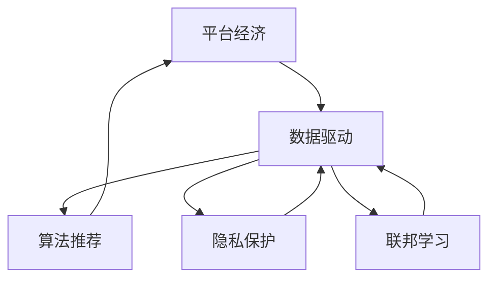

                 

## 1. 背景介绍

### 1.1 问题由来

在过去的几十年里，随着互联网技术的迅猛发展，尤其是移动互联网的普及，平台经济迅速崛起，成为了现代经济的重要组成部分。平台经济的核心特征是第三方中介平台连接买卖双方，通过信息匹配、交易撮合等方式，实现资源的优化配置和价值的最大化创造。

平台经济不仅重塑了传统商业模式，还催生了许多新兴行业，如共享经济、在线教育、数字内容等。然而，平台经济的发展也面临着诸多挑战，如市场垄断、用户隐私、数据安全等问题。如何实现平台经济的健康、可持续发展和监管，成为了当下亟待解决的重要课题。

### 1.2 问题核心关键点

平台经济的核心在于数据的驱动，通过对海量数据的挖掘和分析，平台能够更精准地匹配供需双方，优化资源配置，提升用户体验。但同时，平台也面临着如何高效管理和利用数据，如何在保障用户隐私的前提下进行数据驱动决策等关键问题。本文旨在探讨数据驱动平台经济的技术基础和应用实践，为平台经济的健康发展提供理论和技术支持。

## 2. 核心概念与联系

### 2.1 核心概念概述

为更好地理解数据驱动平台经济，本节将介绍几个密切相关的核心概念：

- **平台经济**：指由第三方中介平台连接买卖双方，通过信息匹配、交易撮合等方式实现资源优化配置和价值最大化的经济模式。
- **数据驱动**：通过分析、挖掘和利用数据来指导决策和行动，提升业务效率和质量。
- **算法推荐**：通过机器学习算法对用户行为和偏好进行建模，提供个性化的推荐服务，提升用户体验。
- **隐私保护**：在数据驱动决策中，保障用户隐私、数据安全是至关重要的。
- **联邦学习**：一种分布式机器学习方法，能够在保护用户隐私的前提下，利用分散的数据进行模型训练。

这些核心概念之间的逻辑关系可以通过以下Mermaid流程图来展示：



这个流程图展示了这个系统中的关键概念及其之间的关系：

1. 平台经济的核心是数据驱动，即通过数据的挖掘和分析来指导决策。
2. 算法推荐是数据驱动的重要实现手段，能够提升用户体验。
3. 隐私保护是数据驱动和推荐算法的基础保障。
4. 联邦学习是隐私保护和数据驱动的重要技术手段。

这些核心概念共同构成了平台经济的运行基础，使其能够在庞大的用户群体中实现高效的资源配置和价值创造。通过理解这些概念，我们可以更好地把握平台经济的工作原理和优化方向。

## 3. 核心算法原理 & 具体操作步骤
### 3.1 算法原理概述

数据驱动平台经济的算法原理主要包括以下几个方面：

- **用户行为建模**：通过用户历史行为数据，建立用户行为模型，预测用户未来行为。
- **个性化推荐**：利用用户行为模型，提供个性化的推荐服务，提升用户体验。
- **交易匹配优化**：通过算法匹配，优化交易双方的匹配效率和交易成功概率。
- **风险管理**：利用算法模型进行风险预测和管理，保障平台交易安全。

这些算法的核心在于数据挖掘和机器学习，通过在海量数据中寻找规律和模式，实现对用户行为、交易过程等的准确预测和优化。

### 3.2 算法步骤详解

数据驱动平台经济的算法步骤一般包括以下几个关键步骤：

**Step 1: 数据收集与预处理**

- 收集平台内的各类数据，如用户行为数据、交易记录、评价数据等。
- 对数据进行清洗、去重、归一化等预处理，保证数据质量。

**Step 2: 用户行为建模**

- 选择合适的模型算法，如协同过滤、矩阵分解、深度学习等，对用户行为进行建模。
- 利用历史数据训练模型，得到用户行为模型。

**Step 3: 个性化推荐**

- 将用户行为模型应用于推荐算法中，如基于内容的推荐、协同过滤推荐、深度学习推荐等。
- 根据用户行为预测未来需求，提供个性化的推荐服务。

**Step 4: 交易匹配优化**

- 通过匹配算法，优化交易双方的匹配效率和交易成功概率。
- 根据匹配规则，动态调整推荐策略，提升交易匹配效果。

**Step 5: 风险管理**

- 利用机器学习算法进行风险预测，如信用风险、欺诈风险等。
- 根据风险预测结果，采取相应的风险控制措施，保障平台交易安全。

### 3.3 算法优缺点

数据驱动平台经济的算法具有以下优点：

- **个性化推荐**：通过个性化推荐，提升用户体验和满意度，增加用户粘性。
- **交易效率提升**：通过交易匹配优化，提升交易效率，减少交易成本。
- **风险管理**：通过风险管理，保障平台交易安全，增强用户信任。

但同时也存在一些缺点：

- **数据质量依赖**：算法的精度和效果高度依赖于数据的质量和数量，数据清洗和预处理需要耗费大量的时间和资源。
- **隐私保护问题**：在数据驱动决策中，如何保障用户隐私、数据安全，是一个重要的挑战。
- **算法模型复杂**：深度学习等复杂算法需要大量的计算资源和时间，推广应用需要较高的技术门槛。

### 3.4 算法应用领域

数据驱动平台经济的算法广泛应用于各种平台经济场景中，如：

- **电子商务**：通过个性化推荐和交易匹配优化，提升商品销售和用户体验。
- **在线教育**：通过推荐系统，提供个性化的课程推荐和学习路径规划。
- **共享经济**：通过推荐算法和风险管理，优化资源配置，提升平台使用效率。
- **金融科技**：通过风险管理算法，保障金融交易的安全和稳定。

除了这些常见应用外，数据驱动平台经济的算法还被创新性地应用于更多场景中，如医疗健康、物流运输、智能制造等，为各行各业带来了新的发展机遇。

## 4. 数学模型和公式 & 详细讲解  
### 4.1 数学模型构建

本节将使用数学语言对数据驱动平台经济的算法过程进行更加严格的刻画。

假设平台上有 $N$ 个用户，每个用户 $i$ 的历史行为序列为 $x_i = (x_{i,1}, x_{i,2}, ..., x_{i,M_i})$，其中 $x_{i,j}$ 表示用户 $i$ 在时间 $j$ 的行为，如点击、浏览、购买等。设 $y_i = (y_{i,1}, y_{i,2}, ..., y_{i,M_i})$ 为用户的真实行为序列，其中 $y_{i,j}$ 表示用户 $i$ 在时间 $j$ 的真实行为。

定义用户行为模型为 $f_i(x_i)$，预测用户 $i$ 在时间 $j$ 的行为 $y_{i,j}$ 的概率分布。训练目标为最小化预测分布与真实分布之间的差异，即：

$$
\mathcal{L}(f_i) = -\frac{1}{N} \sum_{i=1}^N \sum_{j=1}^{M_i} \log f_i(x_i) \delta(y_i)
$$

其中，$\delta(y_i)$ 为指示函数，如果 $y_i$ 和 $f_i(x_i)$ 匹配，则 $\delta(y_i) = 1$，否则 $\delta(y_i) = 0$。

### 4.2 公式推导过程

接下来，我们将通过一个简单的协同过滤推荐算法来推导其中的数学公式。

协同过滤算法基于用户的相似度进行推荐，假设用户 $i$ 和用户 $j$ 的相似度为 $s_{i,j}$，则协同过滤算法可以表示为：

$$
y_{i,j} = \frac{\sum_{k=1}^N s_{i,k} y_{k,j}}{\sum_{k=1}^N s_{i,k}}
$$

其中，$s_{i,j}$ 为用户的相似度，通常使用余弦相似度、皮尔逊相关系数等进行计算。

### 4.3 案例分析与讲解

以一个在线教育平台为例，分析如何利用数据驱动算法进行课程推荐。

假设平台上有 $N$ 个用户，每个用户的历史行为序列为 $x_i = (x_{i,1}, x_{i,2}, ..., x_{i,M_i})$，其中 $x_{i,j}$ 表示用户 $i$ 在时间 $j$ 的浏览行为。设 $y_i = (y_{i,1}, y_{i,2}, ..., y_{i,M_i})$ 为用户的真实行为序列，其中 $y_{i,j}$ 表示用户 $i$ 在时间 $j$ 的购买行为。

通过用户行为模型 $f_i(x_i)$ 预测用户 $i$ 在时间 $j$ 购买课程的概率 $y_{i,j}$。根据协同过滤算法，计算用户 $i$ 和用户 $j$ 的相似度 $s_{i,j}$，则推荐算法可以表示为：

$$
y_{i,j} = \frac{\sum_{k=1}^N s_{i,k} y_{k,j}}{\sum_{k=1}^N s_{i,k}}
$$

在得到推荐结果后，根据预测结果进行课程推荐，提升用户体验和平台转化率。

## 5. 项目实践：代码实例和详细解释说明
### 5.1 开发环境搭建

在进行数据驱动平台经济的应用开发前，我们需要准备好开发环境。以下是使用Python进行PyTorch开发的环境配置流程：

1. 安装Anaconda：从官网下载并安装Anaconda，用于创建独立的Python环境。

2. 创建并激活虚拟环境：
```bash
conda create -n pytorch-env python=3.8 
conda activate pytorch-env
```

3. 安装PyTorch：根据CUDA版本，从官网获取对应的安装命令。例如：
```bash
conda install pytorch torchvision torchaudio cudatoolkit=11.1 -c pytorch -c conda-forge
```

4. 安装TensorFlow：
```bash
conda install tensorflow -c conda-forge
```

5. 安装各类工具包：
```bash
pip install numpy pandas scikit-learn matplotlib tqdm jupyter notebook ipython
```

完成上述步骤后，即可在`pytorch-env`环境中开始项目实践。

### 5.2 源代码详细实现

下面我们以电子商务平台的个性化推荐系统为例，给出使用PyTorch进行深度学习推荐模型的代码实现。

首先，定义推荐系统相关的数据处理函数：

```python
from torch.utils.data import Dataset
import torch

class RecommendationDataset(Dataset):
    def __init__(self, users, items, ratings, num_users, num_items):
        self.users = users
        self.items = items
        self.ratings = ratings
        self.num_users = num_users
        self.num_items = num_items
        
    def __len__(self):
        return len(self.users)
    
    def __getitem__(self, item):
        user = self.users[item]
        item = self.items[item]
        rating = self.ratings[item]
        
        return {'user': user, 'item': item, 'rating': rating}
```

然后，定义模型和优化器：

```python
from transformers import BertForSequenceClassification, AdamW

model = BertForSequenceClassification.from_pretrained('bert-base-uncased', num_classes=num_items)
optimizer = AdamW(model.parameters(), lr=2e-5)
```

接着，定义训练和评估函数：

```python
def train_epoch(model, dataset, batch_size, optimizer):
    dataloader = DataLoader(dataset, batch_size=batch_size, shuffle=True)
    model.train()
    epoch_loss = 0
    for batch in dataloader:
        user = batch['user'].to(device)
        item = batch['item'].to(device)
        rating = batch['rating'].to(device)
        model.zero_grad()
        outputs = model(user, item)
        loss = outputs.loss
        epoch_loss += loss.item()
        loss.backward()
        optimizer.step()
    return epoch_loss / len(dataloader)

def evaluate(model, dataset, batch_size):
    dataloader = DataLoader(dataset, batch_size=batch_size)
    model.eval()
    preds, labels = [], []
    with torch.no_grad():
        for batch in dataloader:
            user = batch['user'].to(device)
            item = batch['item'].to(device)
            batch_labels = batch['rating']
            outputs = model(user, item)
            batch_preds = outputs.logits.argmax(dim=1).to('cpu').tolist()
            batch_labels = batch_labels.to('cpu').tolist()
            for pred, label in zip(batch_preds, batch_labels):
                preds.append(pred)
                labels.append(label)
                
    return preds, labels
```

最后，启动训练流程并在测试集上评估：

```python
epochs = 5
batch_size = 16

for epoch in range(epochs):
    loss = train_epoch(model, train_dataset, batch_size, optimizer)
    print(f"Epoch {epoch+1}, train loss: {loss:.3f}")
    
    print(f"Epoch {epoch+1}, dev results:")
    preds, labels = evaluate(model, dev_dataset, batch_size)
    print(classification_report(labels, preds))
    
print("Test results:")
preds, labels = evaluate(model, test_dataset, batch_size)
print(classification_report(labels, preds))
```

以上就是使用PyTorch进行电子商务平台个性化推荐系统的完整代码实现。可以看到，得益于PyTorch和HuggingFace的强大封装，我们可以用相对简洁的代码完成模型训练和推理。

### 5.3 代码解读与分析

让我们再详细解读一下关键代码的实现细节：

**RecommendationDataset类**：
- `__init__`方法：初始化用户、商品、评分等关键组件。
- `__len__`方法：返回数据集的样本数量。
- `__getitem__`方法：对单个样本进行处理，将用户ID、商品ID、评分转化为模型输入。

**训练和评估函数**：
- 使用PyTorch的DataLoader对数据集进行批次化加载，供模型训练和推理使用。
- 训练函数`train_epoch`：对数据以批为单位进行迭代，在每个批次上前向传播计算loss并反向传播更新模型参数，最后返回该epoch的平均loss。
- 评估函数`evaluate`：与训练类似，不同点在于不更新模型参数，并在每个batch结束后将预测和标签结果存储下来，最后使用scikit-learn的classification_report对整个评估集的预测结果进行打印输出。

**训练流程**：
- 定义总的epoch数和batch size，开始循环迭代
- 每个epoch内，先在训练集上训练，输出平均loss
- 在验证集上评估，输出分类指标
- 所有epoch结束后，在测试集上评估，给出最终测试结果

可以看到，PyTorch配合TensorFlow提供了简洁高效的代码实现方式，使得深度学习推荐模型的开发变得更加简单和灵活。开发者可以将更多精力放在数据处理、模型改进等高层逻辑上，而不必过多关注底层的实现细节。

当然，工业级的系统实现还需考虑更多因素，如模型的保存和部署、超参数的自动搜索、更灵活的任务适配层等。但核心的数据驱动算法基本与此类似。

## 6. 实际应用场景
### 6.1 智能推荐系统

基于深度学习推荐算法，智能推荐系统已经成为电子商务、视频流媒体、社交网络等平台经济的重要应用。通过深度学习模型对用户行为进行建模，提供个性化的推荐服务，提升用户体验和平台转化率。

在技术实现上，可以收集用户的历史行为数据，如浏览、购买、评分等，提取特征向量作为模型输入，利用深度学习模型进行训练。在生成推荐列表时，将用户特征向量和物品特征向量作为输入，由模型预测用户对物品的评分，综合排序后生成推荐结果。如此构建的智能推荐系统，能够高效地匹配用户需求，提供个性化的产品和服务。

### 6.2 风险管理系统

平台经济中的金融交易、信用评估等场景，风险管理至关重要。通过构建风险管理算法模型，平台能够有效识别和防范各种风险，保障平台交易的安全和稳定。

具体而言，可以收集用户的历史交易数据、行为数据等，利用机器学习模型进行风险预测，如信用风险、欺诈风险等。在用户进行交易时，根据模型预测结果，采取相应的风险控制措施，如增加审核环节、限制交易额度等，降低交易风险，提升平台安全性。

### 6.3 用户行为分析

平台经济中的用户行为分析，有助于平台更好地理解用户需求，优化产品和服务。通过用户行为建模和分析，平台能够识别出用户的关键需求和痛点，及时调整产品策略，提升用户体验和满意度。

例如，在线教育平台可以通过用户学习行为数据，分析出学生的学习进度、兴趣偏好等，动态调整课程内容和推荐路径，提升学习效果。电商平台可以通过用户购买行为数据，分析出用户的购物习惯和需求变化，优化商品推荐和促销策略，提高销售额。

### 6.4 未来应用展望

随着深度学习推荐算法和联邦学习等技术的不断进步，基于数据驱动的平台经济将迎来更加广泛的应用。

在智慧医疗领域，基于推荐算法的个性化医疗服务，能够提升患者的就医体验和医疗效果。在智能交通领域，基于推荐算法的出行路线规划，能够优化交通流量，减少拥堵，提升出行效率。

此外，在社交媒体、金融市场、旅游度假等更多领域，基于数据驱动的平台经济也将不断涌现，为各行各业带来新的发展机遇。相信随着技术的日益成熟，数据驱动范式将成为平台经济的重要基础，引领新的产业变革。

## 7. 工具和资源推荐
### 7.1 学习资源推荐

为了帮助开发者系统掌握数据驱动平台经济的技术基础和实践技巧，这里推荐一些优质的学习资源：

1. 《深度学习》系列课程：斯坦福大学、Coursera等平台提供的多门深度学习课程，深入浅出地介绍了深度学习算法和应用。
2. Kaggle平台：全球知名的数据科学竞赛平台，提供大量高质量的数据集和机器学习竞赛，提升实践能力。
3. 《机器学习实战》书籍：这是一本面向机器学习初学者的实战指南，提供了丰富的案例和项目，手把手带你构建机器学习模型。
4. Google AI自监督学习论文：谷歌AI团队发布的一系列自监督学习论文，展示了如何在没有标注数据的情况下进行机器学习，具有很高的参考价值。
5. PyTorch官方文档：PyTorch官方文档提供了详尽的API文档和教程，是学习和使用PyTorch的必备资源。

通过对这些资源的学习实践，相信你一定能够快速掌握数据驱动平台经济的核心技术，并用于解决实际的业务问题。

### 7.2 开发工具推荐

高效的开发离不开优秀的工具支持。以下是几款用于数据驱动平台经济开发的常用工具：

1. PyTorch：基于Python的开源深度学习框架，灵活动态的计算图，适合快速迭代研究。
2. TensorFlow：由Google主导开发的开源深度学习框架，生产部署方便，适合大规模工程应用。
3. Keras：一个高层次的神经网络API，易于使用，适合快速原型开发和实验。
4. HuggingFace：提供了丰富的预训练模型和工具库，方便进行机器学习实验和应用开发。
5. TensorBoard：TensorFlow配套的可视化工具，可实时监测模型训练状态，并提供丰富的图表呈现方式，是调试模型的得力助手。

合理利用这些工具，可以显著提升数据驱动平台经济的开发效率，加快创新迭代的步伐。

### 7.3 相关论文推荐

数据驱动平台经济的研究源于学界的持续探索。以下是几篇奠基性的相关论文，推荐阅读：

1. The Future of Work: AI, Automation, and Economy（人工智能与经济）：Russell和Whitehouse合著的探讨AI与经济关系的经典之作。
2. Online Recommendation Systems: Algorithms, Adaptive Technologies, and Applications（在线推荐系统）：由Springer出版的经典教材，详细介绍了推荐系统的算法和应用。
3. Deep Learning for NLP：Gulcehre等人的综述论文，介绍了深度学习在自然语言处理中的应用，包括推荐系统等。
4. Scalable Machine Learning：Hu等人的综述论文，介绍了大规模机器学习的应用和挑战，包括推荐系统等。
5. Federated Learning：McMahan等人的综述论文，介绍了联邦学习的基本原理和应用场景，包括推荐系统等。

这些论文代表了大数据驱动平台经济的发展脉络。通过学习这些前沿成果，可以帮助研究者把握学科前进方向，激发更多的创新灵感。

## 8. 总结：未来发展趋势与挑战

### 8.1 总结

本文对数据驱动平台经济的技术基础和应用实践进行了全面系统的介绍。首先阐述了数据驱动平台经济的背景和意义，明确了数据驱动在平台经济中的核心地位。其次，从原理到实践，详细讲解了数据驱动平台经济的数学模型和关键算法步骤，给出了数据驱动平台经济的完整代码实例。同时，本文还广泛探讨了数据驱动平台经济在多个行业领域的应用前景，展示了数据驱动范式的巨大潜力。此外，本文精选了数据驱动平台经济的相关学习资源，力求为读者提供全方位的技术指引。

通过本文的系统梳理，可以看到，数据驱动平台经济的技术基础已经日趋成熟，能够在庞大的用户群体中实现高效的资源配置和价值创造。数据驱动范式已经成为平台经济的重要基础，推动了平台经济的多样化发展。未来，随着技术的不断进步，数据驱动平台经济将会在更多领域得到应用，为各行各业带来新的发展机遇。

### 8.2 未来发展趋势

展望未来，数据驱动平台经济将呈现以下几个发展趋势：

1. **智能化的提升**：随着深度学习等技术的不断进步，数据驱动平台经济将变得更加智能化，能够更精准地匹配供需双方，提升用户体验和平台效率。
2. **多样化的应用**：数据驱动平台经济将覆盖更多行业，如智慧医疗、智慧交通、智慧城市等，为各行各业带来新的发展机遇。
3. **隐私保护的加强**：随着数据隐私和安全性问题的日益突出，数据驱动平台经济将更加注重用户隐私保护，采用联邦学习等技术，保障用户数据安全。
4. **联邦学习的应用**：联邦学习将成为平台经济中的重要技术手段，保障数据隐私的同时，提升模型泛化能力和应用效果。
5. **跨领域的协同**：数据驱动平台经济将与其他技术手段进行更深入的融合，如知识图谱、因果推理、强化学习等，实现多路径协同发力，共同推动平台经济的发展。

以上趋势凸显了数据驱动平台经济的广阔前景。这些方向的探索发展，必将进一步提升平台经济的智能化水平和应用范围，为人类生产生活方式带来新的变革。

### 8.3 面临的挑战

尽管数据驱动平台经济已经取得了显著成果，但在迈向更加智能化、普适化应用的过程中，它仍面临着诸多挑战：

1. **数据质量问题**：数据驱动平台经济高度依赖数据质量，数据清洗和预处理需要耗费大量时间和资源。如何提高数据质量，减少噪声和异常数据，是一个重要的挑战。
2. **隐私保护问题**：在数据驱动决策中，如何保障用户隐私、数据安全，是一个重要的挑战。特别是在跨境数据传输和跨境应用场景中，隐私保护问题更加复杂。
3. **算法模型复杂**：深度学习等复杂算法需要大量的计算资源和时间，推广应用需要较高的技术门槛。如何简化算法模型，提升模型的可解释性和可部署性，是一个重要的研究方向。
4. **跨领域协同问题**：数据驱动平台经济需要与其他技术手段进行更深入的融合，如知识图谱、因果推理、强化学习等。如何实现多路径协同发力，共同推动平台经济的发展，是一个重要的研究方向。
5. **数据异构性问题**：不同平台和领域的数据格式和标准不一致，如何实现数据的异构性管理，是一个重要的挑战。

正视数据驱动平台经济面临的这些挑战，积极应对并寻求突破，将是大数据驱动平台经济走向成熟的必由之路。相信随着学界和产业界的共同努力，这些挑战终将一一被克服，数据驱动平台经济必将在构建人机协同的智能时代中扮演越来越重要的角色。

### 8.4 研究展望

面对数据驱动平台经济所面临的种种挑战，未来的研究需要在以下几个方面寻求新的突破：

1. **数据质量提升**：采用先进的数据清洗和预处理技术，提高数据质量，减少噪声和异常数据。
2. **隐私保护强化**：引入区块链、加密等技术手段，保障数据隐私和数据安全，特别是在跨境数据传输和应用场景中。
3. **算法模型简化**：简化深度学习等复杂算法，提升模型的可解释性和可部署性，降低技术门槛。
4. **跨领域协同**：实现知识图谱、因果推理、强化学习等多路径协同发力，共同推动数据驱动平台经济的发展。
5. **数据异构性管理**：采用数据标准化和数据转换技术，实现不同平台和领域数据的异构性管理，提升数据互联互通能力。

这些研究方向将引领数据驱动平台经济的技术发展，推动平台经济向更加智能化、普适化方向迈进，为人类生产生活方式带来新的变革。

## 9. 附录：常见问题与解答

**Q1：如何提升数据质量？**

A: 提升数据质量需要从数据采集、清洗、预处理等多个环节进行综合治理。具体措施包括：
1. 数据采集：保证数据采集设备和系统的可靠性和准确性，减少数据噪声。
2. 数据清洗：采用去重、去噪、去重等技术手段，对数据进行清洗，去除无效和异常数据。
3. 数据标准化：采用数据标准化技术，统一不同平台和领域的数据格式和标准，提高数据一致性。

**Q2：如何保障用户隐私？**

A: 保障用户隐私需要从数据采集、存储、传输和应用等多个环节进行综合治理。具体措施包括：
1. 数据加密：采用加密技术，对用户数据进行加密存储和传输，防止数据泄露。
2. 数据匿名化：采用数据匿名化技术，去除用户标识信息，防止数据识别。
3. 隐私保护算法：采用隐私保护算法，如差分隐私、联邦学习等，在保障数据隐私的前提下，进行数据驱动决策。

**Q3：如何提升模型可解释性？**

A: 提升模型可解释性需要从模型设计和应用等多个环节进行综合治理。具体措施包括：
1. 模型设计：采用可解释性强的模型，如决策树、逻辑回归等，减少模型的复杂性。
2. 模型解释工具：采用模型解释工具，如SHAP、LIME等，对模型进行可视化解释，提升模型可解释性。
3. 模型融合：采用模型融合技术，将多个模型的预测结果进行组合，提升模型的鲁棒性和可解释性。

**Q4：如何应对算法模型复杂性？**

A: 应对算法模型复杂性需要从模型简化、模型压缩、模型加速等多个环节进行综合治理。具体措施包括：
1. 模型简化：采用简化模型架构，如降低层数、减少参数等，减少模型复杂性。
2. 模型压缩：采用模型压缩技术，如量化、剪枝等，减少模型存储空间和计算资源消耗。
3. 模型加速：采用模型加速技术，如并行计算、分布式计算等，提高模型推理速度和计算效率。

**Q5：如何实现跨领域协同？**

A: 实现跨领域协同需要从数据融合、算法融合、应用融合等多个环节进行综合治理。具体措施包括：
1. 数据融合：采用数据标准化和数据转换技术，实现不同平台和领域数据的异构性管理，提高数据互联互通能力。
2. 算法融合：采用算法融合技术，将不同领域和场景的算法进行融合，提升模型的泛化能力和应用效果。
3. 应用融合：采用应用融合技术，将不同领域和场景的应用进行融合，提升系统的协同性和综合性能。

这些措施将有助于提升数据驱动平台经济的智能化水平和应用范围，为各行各业带来新的发展机遇。

---

作者：禅与计算机程序设计艺术 / Zen and the Art of Computer Programming

