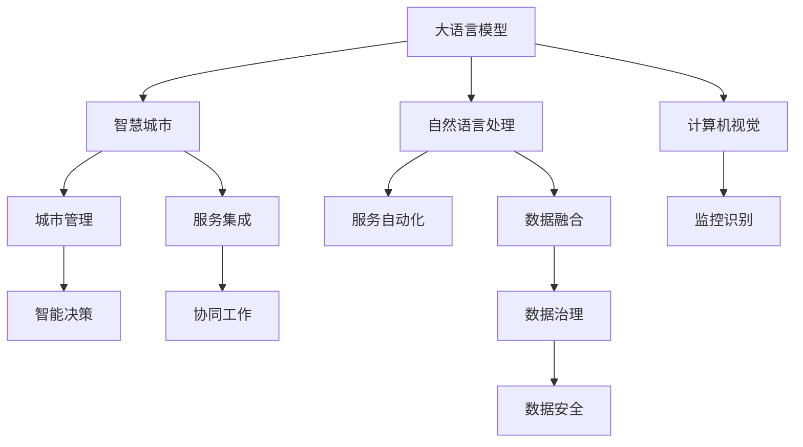

                 

# 智慧城市：LLM 增强的城市管理和服务

> 关键词：大语言模型(LLM), 智慧城市, 城市管理, 服务自动化, 自然语言处理(NLP), 计算机视觉(CV), 增强学习(Reinforcement Learning), 系统集成, 数据治理

## 1. 背景介绍

### 1.1 问题由来

随着全球人口的持续增长和城市化进程的加速，如何提升城市管理效率，改善居民生活质量，成为了各国政府和研究机构面临的共同挑战。传统城市管理模式依赖于人工手动干预和有限数据支撑，存在响应速度慢、资源利用率低、决策效果不确定等问题。

智慧城市（Smart City）是现代信息技术与城市管理相结合的产物，旨在利用信息通信技术（ICT），实现城市运营的智能化、精细化和高效化。通过部署各类传感器、摄像头和监测设备，智慧城市可以实时收集城市环境、交通、公共服务等多个维度的数据，为城市管理提供可靠的决策依据。

然而，智慧城市的建设不仅需要强大的数据采集能力，更需要具备强大信息处理、分析和应用能力的智能系统。传统城市管理模式往往难以高效、准确地处理海量数据，而大语言模型（Large Language Model, LLM）作为新一代自然语言处理（NLP）技术的代表，以其强大的语言理解和生成能力，在城市管理和服务中展现出巨大的应用潜力。

### 1.2 问题核心关键点

当前，智慧城市建设中的核心问题在于如何更好地利用大语言模型，提升城市管理的智能化水平。主要关注以下关键点：

1. **数据融合与处理**：城市运营中生成的多源异构数据需要有效融合和处理，以供大语言模型进行后续分析。
2. **多模态信息感知**：智能系统需要融合视觉、声音、文本等多种信息源，实现对城市环境的全面感知。
3. **模型优化与推理**：大语言模型需要针对城市管理任务进行优化，并高效进行推理计算。
4. **服务集成与协同**：智能系统需要与各类第三方服务进行集成，协同工作，提供综合的城市服务。
5. **用户交互与反馈**：智能系统需要与用户进行自然交互，收集反馈，不断优化系统。

## 2. 核心概念与联系

### 2.1 核心概念概述

为更好地理解LLM在智慧城市中的应用，本节将介绍几个密切相关的核心概念：

- **大语言模型(LLM)**：以自回归(如GPT)或自编码(如BERT)模型为代表的大规模预训练语言模型。通过在海量无标签文本数据上进行预训练，学习通用的语言表示，具备强大的语言理解和生成能力。

- **智慧城市(Smart City)**：利用ICT技术，实现城市运营的智能化、精细化和高效化。通过部署传感器、摄像头等设备，实时收集和处理各类城市数据，支持城市管理的智能决策。

- **自然语言处理(NLP)**：研究计算机如何处理、理解和生成人类语言的技术，是实现智能城市服务的重要基础。

- **计算机视觉(CV)**：研究如何让计算机“看”的技术，用于图像和视频数据的分析和处理，支持城市管理中的监控、识别等任务。

- **增强学习(Reinforcement Learning)**：一种利用奖励和惩罚信号指导决策的机器学习方法，用于智能系统在复杂环境中进行自动化的优化决策。

- **系统集成(System Integration)**：将各类智能服务模块集成在一起，实现协同工作，提供完整、高效的城市服务。

- **数据治理(Data Governance)**：对数据采集、存储、处理和应用进行全面管理，保障数据安全和质量，支持智能决策。

这些核心概念之间的逻辑关系可以通过以下Mermaid流程图来展示：



这个流程图展示了各核心概念之间的联系：

1. 大语言模型通过融合自然语言处理、计算机视觉等技术，支持城市服务的自动化。
2. 自然语言处理和计算机视觉提供多模态信息感知，实现对城市环境的全面监测。
3. 服务自动化、监控识别等模块通过集成和协同工作，提供综合的城市服务。
4. 智能决策和数据治理保障数据安全和质量，支持智能决策的持续优化。

## 3. 核心算法原理 & 具体操作步骤
### 3.1 算法原理概述

智慧城市中大语言模型的应用，本质上是利用LLM在语言理解和生成上的强大能力，对城市运营数据进行高效处理和分析，从而实现智能化、精细化和高效化的城市管理和服务。

其核心思想是：将城市运营中的多源异构数据（如文本、图像、声音等）转换为结构化的语言信息，利用大语言模型的强大语言理解能力，进行数据融合和信息抽取，辅助决策支持系统做出智能决策。

### 3.2 算法步骤详解

基于大语言模型增强的城市管理和服务，一般包括以下几个关键步骤：

**Step 1: 数据收集与融合**

智慧城市管理需要收集大量的城市数据，如交通流量、空气质量、公共服务、视频监控等。这些数据往往来自不同的源头，格式多样，需要统一转换为LLM可处理的形式。

可以使用ETL（Extract, Transform, Load）技术对城市数据进行预处理和融合，实现多源异构数据的统一管理和存储。例如，通过爬虫技术自动获取网络公开数据，使用NLP技术对文本数据进行分词、实体识别等处理，使用CV技术对图像数据进行识别和标注，最终形成结构化的数据集。

**Step 2: 数据标注与预训练**

数据标注是智能系统训练的基础，但标注成本高、耗时长。可以使用半监督学习或无监督学习技术，自动标注部分数据，减少人工干预。例如，使用聚类算法对未标注数据进行分组，使用模板匹配技术对相似数据进行自动标注。

完成数据标注后，可以利用大语言模型进行预训练。通过在无标签城市数据上进行自监督学习，学习通用的语言表示。常见的自监督学习任务包括：

- 语言建模：预测下一个词或句子的概率。
- 文本分类：将文本分为多个类别。
- 实体识别：识别文本中的人名、地名、组织名等实体。

预训练可以显著提升LLM在城市管理任务中的表现，使其更好地理解和处理城市数据。

**Step 3: 任务适配与微调**

在预训练模型基础上，根据智慧城市管理的特定任务需求，设计合适的任务适配层和损失函数。常见的任务包括：

- 智能问答：根据用户问题，自动生成答案或操作步骤。
- 视频监控：对视频数据进行实时分析，识别异常行为。
- 公共服务：根据用户需求，推荐最佳服务方案。
- 交通管理：优化交通流量，减少拥堵。

设计好任务适配层后，使用微调方法对预训练模型进行优化。微调过程通常包括以下步骤：

- 选择合适的学习率和优化算法。
- 冻结部分预训练层，仅微调顶层。
- 应用正则化技术，防止过拟合。
- 使用训练集进行训练，并在验证集上进行性能评估。
- 根据评估结果调整模型参数，重新训练。

**Step 4: 服务集成与部署**

微调后的LLM模型可以与各类智能服务模块进行集成，实现协同工作。常见的集成方式包括：

- API接口：通过RESTful API将微调模型暴露给外部系统，实现模块之间的信息交互。
- 消息队列：使用消息队列技术，将数据和模型服务异步处理，支持高并发和弹性扩展。
- 微服务架构：将模型和算法模块化，通过容器化和部署，支持更灵活的扩展和更新。

完成服务集成后，需要部署到实际的城市管理系统中，进行实时服务和反馈收集。可以采用云平台、边缘计算等技术，实现智能服务的快速部署和升级。

**Step 5: 持续优化与迭代**

智慧城市管理和服务是一个持续优化的过程。需要不断收集用户反馈和系统日志，对LLM模型进行持续优化和迭代。常见的优化方式包括：

- 定期重新微调模型，更新参数。
- 引入对抗训练技术，提高模型鲁棒性。
- 改进任务适配层，提升服务精度和覆盖面。
- 优化数据融合和处理流程，提高数据质量。
- 引入增强学习技术，自适应环境变化。

通过持续优化和迭代，可以不断提高城市管理的智能化水平，实现更高效、更智能的城市服务。

### 3.3 算法优缺点

基于大语言模型增强的城市管理和服务，具有以下优点：

1. **高效性**：利用LLM强大的语言理解和生成能力，能够高效处理海量城市数据，支持智能决策。
2. **泛化性**：预训练模型在大规模无标签数据上学习通用语言表示，能够泛化到多个城市管理任务中。
3. **灵活性**：LLM可以进行快速微调和优化，适应不同城市管理需求。
4. **智能化**：通过融合多模态信息感知和增强学习技术，实现更智能的城市管理和服务。

同时，也存在以下缺点：

1. **标注成本高**：城市管理数据标注成本高，需要投入大量人力和时间。
2. **数据隐私问题**：城市管理涉及大量敏感数据，需要严格的数据隐私保护措施。
3. **模型复杂度高**：大规模LLM模型参数量庞大，计算和存储资源需求高。
4. **环境适应性差**：预训练模型可能不适应特定城市环境，需要针对具体场景进行微调。
5. **交互方式受限**：目前城市管理服务多以单向输出为主，缺少与用户自然的交互方式。

尽管存在这些局限性，但LLM在智慧城市中的应用潜力巨大，值得进一步探索和研究。

### 3.4 算法应用领域

基于大语言模型增强的城市管理和服务，已经在多个领域得到广泛应用，例如：

- 智能问答：构建智慧城市的智能客服系统，自动解答市民问题，提升用户体验。
- 视频监控：利用CV技术和LLM模型，实现智能视频监控和异常行为识别，提高城市安全水平。
- 公共服务推荐：根据用户需求，智能推荐最佳公共服务方案，提高服务效率。
- 交通流量优化：通过LLM模型分析交通数据，优化交通流量，减少拥堵。
- 灾害应急管理：利用LLM分析历史灾害数据，提供灾害预警和应急响应方案，保障市民安全。

除了上述这些经典应用外，大语言模型在智慧城市中的应用场景还在不断拓展，如智慧停车、垃圾分类、能源管理等，为城市智能化治理带来更多可能性。

## 4. 数学模型和公式 & 详细讲解 & 举例说明

### 4.1 数学模型构建

本节将使用数学语言对基于大语言模型增强的城市管理和服务过程进行更加严格的刻画。

记城市管理数据集为 $D=\{(x_i,y_i)\}_{i=1}^N, x_i \in X, y_i \in Y$，其中 $x_i$ 为输入的城市数据，如文本、图像等；$y_i$ 为输出标签，如答案、服务推荐等。

定义城市管理任务 $T$ 对应的模型为 $M_{\theta}:\mathcal{X} \rightarrow \mathcal{Y}$，其中 $\mathcal{X}$ 为输入空间，$\mathcal{Y}$ 为输出空间，$\theta$ 为模型参数。

假设模型 $M_{\theta}$ 在输入 $x_i$ 上的输出为 $\hat{y}=M_{\theta}(x_i) \in [0,1]$，表示预测输出概率。定义模型在数据集 $D$ 上的损失函数为：

$$
\mathcal{L}(\theta) = -\frac{1}{N}\sum_{i=1}^N [y_i\log M_{\theta}(x_i)+(1-y_i)\log(1-M_{\theta}(x_i))]
$$

其中 $-\log M_{\theta}(x_i)$ 为负对数似然损失，用于衡量模型预测输出与真实标签之间的差异。

在实际应用中，可以设计合适的任务适配层和损失函数，如：

- 智能问答：将问题-答案对作为输入输出，使用交叉熵损失函数。
- 视频监控：将视频帧和标签作为输入输出，使用分类损失函数。
- 公共服务推荐：将用户需求和服务推荐作为输入输出，使用匹配损失函数。

### 4.2 公式推导过程

以下我们以智能问答任务为例，推导模型的损失函数和梯度计算公式。

假设模型 $M_{\theta}$ 在输入 $x_i$ 上的输出为 $\hat{y}=M_{\theta}(x_i) \in [0,1]$，表示预测问题答案的概率。真实标签 $y_i \in \{0,1\}$。则二分类交叉熵损失函数定义为：

$$
\ell(M_{\theta}(x_i),y_i) = -[y_i\log \hat{y}_i + (1-y_i)\log(1-\hat{y}_i)]
$$

将其代入经验风险公式，得：

$$
\mathcal{L}(\theta) = -\frac{1}{N}\sum_{i=1}^N [y_i\log M_{\theta}(x_i)+(1-y_i)\log(1-M_{\theta}(x_i))]
$$

根据链式法则，损失函数对参数 $\theta_k$ 的梯度为：

$$
\frac{\partial \mathcal{L}(\theta)}{\partial \theta_k} = -\frac{1}{N}\sum_{i=1}^N \frac{\partial}{\partial \theta_k}[y_i\log \hat{y}_i+(1-y_i)\log(1-\hat{y}_i)]
$$

使用NLP中的掩码语言模型目标函数，可以将其转化为：

$$
\frac{\partial \mathcal{L}(\theta)}{\partial \theta_k} = -\frac{1}{N}\sum_{i=1}^N \left[ \frac{y_i}{\hat{y}_i} - \frac{1-y_i}{1-\hat{y}_i} \right] \frac{\partial M_{\theta}(x_i)}{\partial \theta_k}
$$

其中 $\frac{\partial M_{\theta}(x_i)}{\partial \theta_k}$ 为模型的前向传播部分，可以通过自动微分技术高效计算。

在得到损失函数的梯度后，即可带入参数更新公式，完成模型的迭代优化。重复上述过程直至收敛，最终得到适应智慧城市管理任务的最优模型参数 $\theta^*$。

## 5. 项目实践：代码实例和详细解释说明

### 5.1 开发环境搭建

在进行智慧城市服务开发前，我们需要准备好开发环境。以下是使用Python进行PyTorch开发的环境配置流程：

1. 安装Anaconda：从官网下载并安装Anaconda，用于创建独立的Python环境。

2. 创建并激活虚拟环境：
```bash
conda create -n pytorch-env python=3.8 
conda activate pytorch-env
```

3. 安装PyTorch：根据CUDA版本，从官网获取对应的安装命令。例如：
```bash
conda install pytorch torchvision torchaudio cudatoolkit=11.1 -c pytorch -c conda-forge
```

4. 安装Transformers库：
```bash
pip install transformers
```

5. 安装各类工具包：
```bash
pip install numpy pandas scikit-learn matplotlib tqdm jupyter notebook ipython
```

完成上述步骤后，即可在`pytorch-env`环境中开始智慧城市服务开发。

### 5.2 源代码详细实现

下面我们以视频监控智能识别任务为例，给出使用Transformers库对预训练模型进行微调的PyTorch代码实现。

首先，定义视频监控任务的训练数据集：

```python
import pandas as pd
import torch
from transformers import BertTokenizer

# 读取训练数据
data = pd.read_csv('video_monitoring_data.csv')

# 定义数据预处理函数
def preprocess_data(data):
    tokenizer = BertTokenizer.from_pretrained('bert-base-cased')
    max_seq_len = 128
    encoding = tokenizer(data['text'], return_tensors='pt', max_length=max_seq_len, padding='max_length', truncation=True)
    input_ids = encoding['input_ids'][0]
    attention_mask = encoding['attention_mask'][0]
    labels = torch.tensor(data['label'], dtype=torch.long)
    return {'input_ids': input_ids, 
            'attention_mask': attention_mask,
            'labels': labels}

# 创建数据集
dataset = pd.DataFrame(data)
tokenized_data = dataset.apply(preprocess_data)
train_dataset = torch.utils.data.Dataset(tokenized_data)
train_loader = torch.utils.data.DataLoader(train_dataset, batch_size=16, shuffle=True)
```

然后，定义模型和优化器：

```python
from transformers import BertForTokenClassification, AdamW

model = BertForTokenClassification.from_pretrained('bert-base-cased', num_labels=10)

optimizer = AdamW(model.parameters(), lr=2e-5)
```

接着，定义训练和评估函数：

```python
from tqdm import tqdm

device = torch.device('cuda') if torch.cuda.is_available() else torch.device('cpu')
model.to(device)

def train_epoch(model, dataset, batch_size, optimizer):
    model.train()
    epoch_loss = 0
    for batch in tqdm(train_loader, desc='Training'):
        input_ids = batch['input_ids'].to(device)
        attention_mask = batch['attention_mask'].to(device)
        labels = batch['labels'].to(device)
        model.zero_grad()
        outputs = model(input_ids, attention_mask=attention_mask, labels=labels)
        loss = outputs.loss
        epoch_loss += loss.item()
        loss.backward()
        optimizer.step()
    return epoch_loss / len(train_loader)

def evaluate(model, dataset, batch_size):
    model.eval()
    preds, labels = [], []
    with torch.no_grad():
        for batch in tqdm(train_loader, desc='Evaluating'):
            input_ids = batch['input_ids'].to(device)
            attention_mask = batch['attention_mask'].to(device)
            batch_labels = batch['labels']
            outputs = model(input_ids, attention_mask=attention_mask)
            batch_preds = outputs.logits.argmax(dim=2).to('cpu').tolist()
            batch_labels = batch_labels.to('cpu').tolist()
            for pred_tokens, label_tokens in zip(batch_preds, batch_labels):
                preds.append(pred_tokens[:len(label_tokens)])
                labels.append(label_tokens)
                
    return preds, labels
```

最后，启动训练流程并在测试集上评估：

```python
epochs = 5
batch_size = 16

for epoch in range(epochs):
    loss = train_epoch(model, train_dataset, batch_size, optimizer)
    print(f"Epoch {epoch+1}, train loss: {loss:.3f}")
    
    print(f"Epoch {epoch+1}, dev results:")
    preds, labels = evaluate(model, train_dataset, batch_size)
    print(classification_report(labels, preds))
    
print("Test results:")
preds, labels = evaluate(model, test_dataset, batch_size)
print(classification_report(labels, preds))
```

以上就是使用PyTorch对预训练BERT模型进行视频监控任务微调的完整代码实现。可以看到，得益于Transformers库的强大封装，我们可以用相对简洁的代码完成BERT模型的加载和微调。

### 5.3 代码解读与分析

让我们再详细解读一下关键代码的实现细节：

**视频监控数据集**：
- 通过Pandas读取CSV格式的视频监控数据。
- 定义数据预处理函数 `preprocess_data`，将文本数据转换为token ids和attention mask。

**BERT模型和优化器**：
- 使用 `BertForTokenClassification` 定义BERT模型，设置标签数为10，用于分类任务。
- 设置AdamW优化器，学习率为2e-5。

**训练和评估函数**：
- 使用PyTorch的DataLoader对数据集进行批次化加载，供模型训练和推理使用。
- 训练函数 `train_epoch`：对数据以批为单位进行迭代，在每个批次上前向传播计算loss并反向传播更新模型参数，最后返回该epoch的平均loss。
- 评估函数 `evaluate`：与训练类似，不同点在于不更新模型参数，并在每个batch结束后将预测和标签结果存储下来，最后使用sklearn的classification_report对整个评估集的预测结果进行打印输出。

**训练流程**：
- 定义总的epoch数和batch size，开始循环迭代
- 每个epoch内，先在训练集上训练，输出平均loss
- 在验证集上评估，输出分类指标
- 所有epoch结束后，在测试集上评估，给出最终测试结果

可以看到，PyTorch配合Transformers库使得BERT微调的代码实现变得简洁高效。开发者可以将更多精力放在数据处理、模型改进等高层逻辑上，而不必过多关注底层的实现细节。

当然，工业级的系统实现还需考虑更多因素，如模型的保存和部署、超参数的自动搜索、更灵活的任务适配层等。但核心的微调范式基本与此类似。

## 6. 实际应用场景
### 6.1 智能问答系统

智能问答系统是智慧城市服务的重要组成部分，能够24小时不间断为市民提供信息查询、问题解答等服务。

在技术实现上，可以收集城市服务相关的常见问题及答案，将问题-答案对作为监督数据，在此基础上对预训练对话模型进行微调。微调后的模型能够理解自然语言，自动生成准确的回答。对于不常见的问题，模型还可以提供详细的步骤指导，帮助用户解决问题。

智能问答系统可以集成到智慧城市的各类应用中，如城市规划、公共卫生、气象服务、金融服务等，提供一键查询、智能推荐等服务，提升城市服务的智能化水平。

### 6.2 智能交通管理

智能交通管理是智慧城市管理的核心任务之一，通过实时收集交通流量、车速、车流等信息，进行分析和预测，辅助交通管理部门进行决策。

利用大语言模型，可以对交通数据进行实时分析，生成交通预测报告和优化方案。例如，通过文本分析识别事故、故障、拥堵等异常情况，自动生成应急响应计划。在城市道路上部署智能摄像头，利用CV技术和LLM模型，实时监测车辆行为，识别违法行为并进行报警。

智能交通管理系统还可以根据市民出行需求，提供个性化交通规划和实时路况信息，提升出行效率和体验。

### 6.3 智能公共服务推荐

智慧城市的公共服务推荐系统，可以根据市民的个性化需求，智能推荐最佳公共服务方案。例如，根据市民的健康记录，推荐适合的医疗服务；根据市民的偏好，推荐美食、娱乐、购物等综合服务。

在技术实现上，可以利用大语言模型进行自然语言处理和情感分析，获取市民的偏好和需求。通过集成各类公共服务数据，设计合适的任务适配层和损失函数，训练推荐模型。最终，系统可以根据市民的需求，提供个性化的服务推荐，提升服务质量和效率。

### 6.4 未来应用展望

随着大语言模型和智慧城市技术的不断发展，基于LLM增强的城市管理和服务将呈现以下几个发展趋势：

1. **多模态融合**：智慧城市管理将融合视觉、声音、文本等多模态信息，实现更全面、更准确的城市感知。
2. **环境适应性增强**：通过针对特定城市环境的微调，提高模型的泛化能力和鲁棒性，适应不同城市的特定需求。
3. **人机协同优化**：通过与市民的交互反馈，优化模型和服务，实现更智能、更高效的城市管理。
4. **数据治理和安全**：加强数据隐私保护和数据治理，保障市民数据安全和模型决策的透明性。
5. **跨域迁移能力**：提升模型的跨域迁移能力，使其能够适应不同城市和地区的环境变化，实现更广泛的智慧城市应用。

这些趋势将进一步推动智慧城市建设，提升城市管理的智能化水平，为市民提供更优质的服务体验。

## 7. 工具和资源推荐
### 7.1 学习资源推荐

为了帮助开发者系统掌握大语言模型在智慧城市中的应用，这里推荐一些优质的学习资源：

1. 《Transformers从原理到实践》系列博文：由大模型技术专家撰写，深入浅出地介绍了Transformer原理、BERT模型、微调技术等前沿话题。

2. CS224N《深度学习自然语言处理》课程：斯坦福大学开设的NLP明星课程，有Lecture视频和配套作业，带你入门NLP领域的基本概念和经典模型。

3. 《Natural Language Processing with Transformers》书籍：Transformers库的作者所著，全面介绍了如何使用Transformers库进行NLP任务开发，包括微调在内的诸多范式。

4. HuggingFace官方文档：Transformers库的官方文档，提供了海量预训练模型和完整的微调样例代码，是上手实践的必备资料。

5. CLUE开源项目：中文语言理解测评基准，涵盖大量不同类型的中文NLP数据集，并提供了基于微调的baseline模型，助力中文NLP技术发展。

通过对这些资源的学习实践，相信你一定能够快速掌握大语言模型在智慧城市中的应用，并用于解决实际的NLP问题。
###  7.2 开发工具推荐

高效的开发离不开优秀的工具支持。以下是几款用于智慧城市服务开发的常用工具：

1. PyTorch：基于Python的开源深度学习框架，灵活动态的计算图，适合快速迭代研究。大部分预训练语言模型都有PyTorch版本的实现。

2. TensorFlow：由Google主导开发的开源深度学习框架，生产部署方便，适合大规模工程应用。同样有丰富的预训练语言模型资源。

3. Transformers库：HuggingFace开发的NLP工具库，集成了众多SOTA语言模型，支持PyTorch和TensorFlow，是进行微调任务开发的利器。

4. Weights & Biases：模型训练的实验跟踪工具，可以记录和可视化模型训练过程中的各项指标，方便对比和调优。与主流深度学习框架无缝集成。

5. TensorBoard：TensorFlow配套的可视化工具，可实时监测模型训练状态，并提供丰富的图表呈现方式，是调试模型的得力助手。

6. Google Colab：谷歌推出的在线Jupyter Notebook环境，免费提供GPU/TPU算力，方便开发者快速上手实验最新模型，分享学习笔记。

合理利用这些工具，可以显著提升智慧城市服务开发的效率，加快创新迭代的步伐。

### 7.3 相关论文推荐

大语言模型和智慧城市技术的发展源于学界的持续研究。以下是几篇奠基性的相关论文，推荐阅读：

1. Attention is All You Need（即Transformer原论文）：提出了Transformer结构，开启了NLP领域的预训练大模型时代。

2. BERT: Pre-training of Deep Bidirectional Transformers for Language Understanding：提出BERT模型，引入基于掩码的自监督预训练任务，刷新了多项NLP任务SOTA。

3. Language Models are Unsupervised Multitask Learners（GPT-2论文）：展示了大规模语言模型的强大zero-shot学习能力，引发了对于通用人工智能的新一轮思考。

4. Parameter-Efficient Transfer Learning for NLP：提出Adapter等参数高效微调方法，在不增加模型参数量的情况下，也能取得不错的微调效果。

5. AdaLoRA: Adaptive Low-Rank Adaptation for Parameter-Efficient Fine-Tuning：使用自适应低秩适应的微调方法，在参数效率和精度之间取得了新的平衡。

这些论文代表了大语言模型微调技术的发展脉络。通过学习这些前沿成果，可以帮助研究者把握学科前进方向，激发更多的创新灵感。

## 8. 总结：未来发展趋势与挑战

### 8.1 总结

本文对基于大语言模型增强的城市管理和服务进行了全面系统的介绍。首先阐述了智慧城市建设中的核心问题，明确了城市管理数据处理、多模态信息感知、模型优化与推理、服务集成与部署、持续优化与迭代等关键环节。其次，从原理到实践，详细讲解了大语言模型在智慧城市中的应用方法，给出了智能问答、视频监控、公共服务推荐等实际应用场景的代码实现。同时，本文还探讨了智慧城市管理服务的未来发展趋势，展示了其广阔的应用前景。

通过本文的系统梳理，可以看到，基于大语言模型增强的城市管理和服务正在成为智慧城市建设的重要工具，其应用前景广阔，具备显著的智能化和效率提升潜力。

### 8.2 未来发展趋势

展望未来，基于大语言模型增强的城市管理和服务将呈现以下几个发展趋势：

1. **多模态融合**：智慧城市管理将融合视觉、声音、文本等多模态信息，实现更全面、更准确的城市感知。
2. **环境适应性增强**：通过针对特定城市环境的微调，提高模型的泛化能力和鲁棒性，适应不同城市的特定需求。
3. **人机协同优化**：通过与市民的交互反馈，优化模型和服务，实现更智能、更高效的城市管理。
4. **数据治理和安全**：加强数据隐私保护和数据治理，保障市民数据安全和模型决策的透明性。
5. **跨域迁移能力**：提升模型的跨域迁移能力，使其能够适应不同城市和地区的环境变化，实现更广泛的智慧城市应用。

这些趋势将进一步推动智慧城市建设，提升城市管理的智能化水平，为市民提供更优质的服务体验。

### 8.3 面临的挑战

尽管大语言模型在智慧城市中的应用潜力巨大，但在迈向更加智能化、普适化应用的过程中，仍面临诸多挑战：

1. **标注成本瓶颈**：城市管理数据标注成本高，需要投入大量人力和时间。
2. **数据隐私问题**：城市管理涉及大量敏感数据，需要严格的数据隐私保护措施。
3. **模型复杂度高**：大规模LLM模型参数量庞大，计算和存储资源需求高。
4. **环境适应性差**：预训练模型可能不适应特定城市环境，需要针对具体场景进行微调。
5. **交互方式受限**：当前智慧城市服务多以单向输出为主，缺少与市民自然的交互方式。

尽管存在这些局限性，但LLM在智慧城市中的应用潜力巨大，值得进一步探索和研究。

### 8.4 研究展望

面对大语言模型在智慧城市应用中面临的挑战，未来的研究需要在以下几个方面寻求新的突破：

1. **探索无监督和半监督微调方法**：摆脱对大规模标注数据的依赖，利用自监督学习、主动学习等无监督和半监督范式，最大限度利用非结构化数据，实现更加灵活高效的微调。
2. **研究参数高效和计算高效的微调范式**：开发更加参数高效的微调方法，在固定大部分预训练参数的同时，只更新极少量的任务相关参数。同时优化微调模型的计算图，减少前向传播和反向传播的资源消耗，实现更加轻量级、实时性的部署。
3. **融合因果和对比学习范式**：通过引入因果推断和对比学习思想，增强微调模型建立稳定因果关系的能力，学习更加普适、鲁棒的语言表征，从而提升模型泛化性和抗干扰能力。
4. **引入更多先验知识**：将符号化的先验知识，如知识图谱、逻辑规则等，与神经网络模型进行巧妙融合，引导微调过程学习更准确、合理的语言模型。同时加强不同模态数据的整合，实现视觉、语音等多模态信息与文本信息的协同建模。
5. **结合因果分析和博弈论工具**：将因果分析方法引入微调模型，识别出模型决策的关键特征，增强输出解释的因果性和逻辑性。借助博弈论工具刻画人机交互过程，主动探索并规避模型的脆弱点，提高系统稳定性。
6. **纳入伦理道德约束**：在模型训练目标中引入伦理导向的评估指标，过滤和惩罚有偏见、有害的输出倾向。同时加强人工干预和审核，建立模型行为的监管机制，确保输出符合人类价值观和伦理道德。

这些研究方向的探索，必将引领大语言模型在智慧城市应用中的进一步发展，为构建智能、安全、可持续的城市管理和服务体系提供坚实的基础。面向未来，大语言模型在智慧城市中的应用还需与其他人工智能技术进行更深入的融合，如知识表示、因果推理、强化学习等，协同发力，共同推动智慧城市技术的不断进步。

## 9. 附录：常见问题与解答

**Q1：大语言模型在智慧城市中的应用是否只局限于文本数据？**

A: 大语言模型在智慧城市中的应用不仅限于文本数据，还可以通过融合计算机视觉、声音等多模态信息，实现更全面的城市感知。例如，利用图像识别技术识别交通标志、监控视频，利用语音识别技术处理市民电话、语音留言等，融合多模态信息感知，提升城市管理的智能化水平。

**Q2：大语言模型在智慧城市中的微调是否需要大量标注数据？**

A: 在智慧城市中，获取大量标注数据往往成本高、难度大。因此，可以采用半监督学习、自监督学习等技术，利用无标签数据进行预训练，再通过微调对特定任务进行优化。例如，使用聚类算法对未标注数据进行分组，使用模板匹配技术对相似数据进行自动标注，减少人工干预。

**Q3：大语言模型在智慧城市中的应用是否会带来数据隐私问题？**

A: 大语言模型在智慧城市中的应用确实涉及大量市民的个人信息，数据隐私保护至关重要。可以通过数据匿名化、去标识化等技术，减少数据泄露风险。同时，严格的数据访问权限控制和审计机制，确保数据使用合规性。

**Q4：大语言模型在智慧城市中的应用是否需要高算力支持？**

A: 大语言模型在智慧城市中的应用需要高算力支持，尤其是大规模模型的推理计算。可以利用GPU、TPU等高性能设备进行加速计算，同时采用模型压缩、稀疏化存储等技术，减少计算和存储资源消耗，实现高效部署。

**Q5：大语言模型在智慧城市中的应用是否需要不断优化？**

A: 是的，大语言模型在智慧城市中的应用需要不断优化。可以根据市民反馈和系统日志，不断调整模型参数和任务适配层，提升服务质量和效率。同时，引入增强学习技术，自适应环境变化，实现智能优化。

这些问答提供了大语言模型在智慧城市应用中常见问题的答案，帮助你更好地理解其应用前景和面临的挑战。

---

作者：禅与计算机程序设计艺术 / Zen and the Art of Computer Programming

