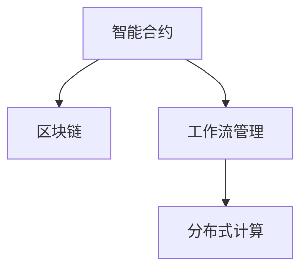

                 

# 智能合约在工作流管理中的应用

> 关键词：智能合约,工作流管理,区块链,分布式计算,区块链+NLP

## 1. 背景介绍

### 1.1 问题由来
随着数字化转型的加速，企业对于IT系统的依赖日益增强，业务流程的复杂度和协同需求日益提升。然而，传统的工作流管理系统往往难以满足高并发、高稳定性、高可扩展性的要求。传统的集中式工作流管理系统存在单点故障、扩展性差等问题，在跨部门、跨系统协同场景中，数据孤岛和信息孤岛现象普遍存在，业务流程难以高效衔接，协同效率低下。

为解决这些问题，新的分布式计算架构和智能合约技术应运而生。智能合约是一种具有自动化执行和记录功能的计算机程序，当满足特定条件时，能够自动执行合同条款。智能合约去中心化、透明、可验证的特点，使其成为提升工作流管理效率、降低系统风险的理想选择。

### 1.2 问题核心关键点
智能合约通过区块链技术，实现了分布式计算和智能执行。其核心技术包括：

- **区块链技术**：利用分布式账本技术，实现数据的去中心化存储和共享。
- **智能合约**：基于Solidity等编程语言编写的自动化执行程序，支持条件判断、逻辑跳转、资源管理等操作。
- **分布式计算**：利用区块链网络节点协作完成计算任务，实现高并发、高可靠性。

智能合约在工作流管理中的应用，可以通过以下方式优化流程：

- **自动化流程**：实现业务流程的自动化执行，减少人工干预，提升效率。
- **数据同步**：通过智能合约自动同步各环节数据，避免信息孤岛。
- **协同机制**：利用智能合约触发节点协同，提升协同效率。
- **审计溯源**：通过区块链记录每一步操作，实现数据审计和溯源。

本文将深入探讨智能合约在工作流管理中的应用，包括原理、关键技术、实施步骤及实际应用案例。

## 2. 核心概念与联系

### 2.1 核心概念概述

为更好地理解智能合约在工作流管理中的应用，本节将介绍几个密切相关的核心概念：

- **智能合约**：一种去中心化、透明、可验证的自动化执行程序，当满足特定条件时自动执行合同条款。
- **区块链技术**：一种分布式账本技术，通过去中心化方式记录交易和状态，保证数据的安全和不可篡改。
- **工作流管理**：一种用于定义、执行、监控和管理企业业务流程的系统，旨在提升业务流程的效率和可控性。
- **分布式计算**：通过网络中的多个节点协作完成计算任务，实现高并发和高可靠性。

这些核心概念之间的逻辑关系可以通过以下Mermaid流程图来展示：



这个流程图展示了几者之间的紧密联系：

1. 智能合约利用区块链技术实现数据去中心化存储和共享。
2. 智能合约的工作流管理实现业务流程的自动化执行和协同。
3. 分布式计算技术保障智能合约的并发和可靠性。

这些概念共同构成了智能合约在工作流管理中的应用基础。通过理解这些核心概念，我们可以更好地把握智能合约在工作流管理中的作用和优势。

## 3. 核心算法原理 & 具体操作步骤
### 3.1 算法原理概述

智能合约在工作流管理中的应用，主要基于区块链技术和分布式计算架构，通过智能合约实现业务流程的自动化和协同。其核心算法原理包括：

- **分布式账本技术**：通过区块链技术实现去中心化的分布式账本，保证数据的安全和不可篡改。
- **智能合约编程语言**：利用Solidity等编程语言编写智能合约，实现业务流程的自动化和逻辑控制。
- **自动化执行和记录**：智能合约满足特定条件时自动执行合同条款，并通过区块链记录每一步操作，保证数据审计和溯源。
- **分布式协同**：利用分布式计算技术，实现网络节点之间的协作和数据同步。

### 3.2 算法步骤详解

智能合约在工作流管理中的应用，主要包括以下几个关键步骤：

**Step 1: 设计工作流模型**

- 收集企业内部所有相关部门的业务流程需求，确定需要自动化的业务环节和协同机制。
- 利用NLP技术分析业务流程，提取关键节点、条件、数据输入输出等要素。
- 设计智能合约的工作流模型，包括每个节点的输入输出、执行逻辑、触发条件等。

**Step 2: 编写智能合约**

- 使用Solidity等编程语言，根据设计好的工作流模型，编写智能合约代码。
- 确保智能合约满足业务逻辑要求，具备必要的条件判断和数据处理功能。
- 进行单元测试和集成测试，确保智能合约的正确性和稳定性。

**Step 3: 部署智能合约**

- 将编写的智能合约部署到区块链网络，如以太坊主网或Binance Smart Chain。
- 利用钱包工具或开发工具进行智能合约的部署和测试，确保合约能够正常运行。
- 在区块链网络中发布智能合约的地址，供业务系统调用。

**Step 4: 集成工作流系统**

- 将智能合约与现有的工作流管理系统进行集成，实现自动化的数据同步和协同。
- 设计相应的API接口，使工作流管理系统能够调用智能合约执行相关操作。
- 在业务系统中嵌入智能合约的接口调用，实现业务流程的自动化执行。

**Step 5: 运行和监控**

- 启动智能合约的运行，监控其状态和执行情况，确保合约正常工作。
- 利用NLP技术对智能合约的执行日志进行分析，发现异常情况并及时处理。
- 对智能合约的性能进行评估和优化，提升系统的稳定性和效率。

以上是智能合约在工作流管理中的完整实施步骤。在实际应用中，还需要根据具体场景和需求进行优化设计，如设计合理的条件触发机制、优化数据同步策略等。

### 3.3 算法优缺点

智能合约在工作流管理中的应用具有以下优点：

- **自动化执行**：智能合约能够自动执行业务流程，减少人工干预，提升效率。
- **数据安全**：利用区块链技术实现去中心化存储和共享，保证数据的安全和不可篡改。
- **协同机制**：利用智能合约实现节点之间的协同，提升协同效率。
- **可审计性**：通过区块链记录每一步操作，实现数据审计和溯源，提高系统的透明度和可靠性。

同时，该方法也存在一定的局限性：

- **技术门槛高**：智能合约开发和部署需要具备区块链和编程技术，技术门槛较高。
- **执行成本高**：智能合约的执行需要支付一定的Gas费，成本较高。
- **扩展性差**：当前智能合约的扩展性还受到区块链网络性能的限制，难以应对大规模并发。
- **兼容性差**：不同区块链平台的智能合约可能存在兼容性问题，难以跨平台部署。

尽管存在这些局限性，但就目前而言，智能合约仍是大规模分布式工作流管理的重要手段。未来相关研究的重点在于如何进一步降低智能合约的技术门槛，提高其可扩展性和兼容性，同时兼顾可审计性和执行效率。

### 3.4 算法应用领域

智能合约在工作流管理中的应用，主要应用于以下领域：

- **金融服务**：实现自动化的贷款审批、证券交易、保险理赔等业务流程，提升效率和透明度。
- **供应链管理**：实现货物追踪、合同管理、物流协同等业务流程的自动化，降低运营成本。
- **政府服务**：实现行政审批、公共服务、数据共享等业务流程的自动化，提高政府服务效率。
- **医疗健康**：实现医疗记录共享、药品追溯、在线问诊等业务流程的自动化，提升医疗服务水平。
- **智能制造**：实现设备监控、生产调度、质量控制等业务流程的自动化，提升制造效率和质量。

除了上述这些经典应用外，智能合约还可以拓展到更多场景中，如教育、交通、公共安全等，为各行业的数字化转型升级提供新的技术路径。

## 4. 数学模型和公式 & 详细讲解 & 举例说明

### 4.1 数学模型构建

智能合约在工作流管理中的应用，可以通过以下数学模型来描述：

设企业内部存在 $n$ 个部门，每个部门有 $m$ 个业务流程 $P_i$，每个流程包含 $k$ 个步骤 $S_j$，每个步骤 $S_j$ 的执行条件为 $C_j$，执行结果为 $R_j$，数据输入为 $D_j$，数据输出为 $O_j$。

定义智能合约的执行状态 $S_t$ 为：

$$
S_t = \bigcup_{i=1}^n \bigcup_{j=1}^m P_i \times S_j
$$

智能合约的执行目标为：

$$
\max_{S_t} \sum_{i=1}^n \sum_{j=1}^m \mathbb{E}(R_j) - \mathbb{E}(D_j)
$$

其中，$\mathbb{E}(R_j)$ 表示步骤 $S_j$ 的执行结果期望，$\mathbb{E}(D_j)$ 表示数据输入的期望。

### 4.2 公式推导过程

智能合约在工作流管理中的应用，涉及到的主要公式包括：

- **期望公式**：
$$
\mathbb{E}(x) = \sum_{i=1}^n \sum_{j=1}^m p(S_i, S_j) \cdot x
$$

- **条件概率公式**：
$$
p(S_i, S_j) = \frac{\mathbb{P}(S_i \cap S_j)}{\mathbb{P}(S_i)}
$$

其中，$\mathbb{P}(S_i)$ 表示步骤 $S_i$ 执行的概率，$\mathbb{P}(S_i \cap S_j)$ 表示步骤 $S_i$ 和 $S_j$ 同时执行的概率。

- **数据同步公式**：
$$
\mathbb{E}(D_j) = \sum_{i=1}^n \sum_{j=1}^m p(S_i, S_j) \cdot D_j
$$

其中，$D_j$ 表示步骤 $S_j$ 的数据输入。

- **结果期望公式**：
$$
\mathbb{E}(R_j) = \sum_{i=1}^n \sum_{j=1}^m p(S_i, S_j) \cdot R_j
$$

其中，$R_j$ 表示步骤 $S_j$ 的执行结果。

通过上述公式，可以推导出智能合约在工作流管理中的应用模型。模型综合考虑了步骤的执行条件、数据同步和结果期望，通过最大化目标函数，实现业务流程的自动化和协同。

### 4.3 案例分析与讲解

以下以一个金融贷款审批流程为例，分析智能合约在工作流管理中的应用。

**业务流程**：
1. 客户提交贷款申请。
2. 银行后台系统进行贷款审批。
3. 贷款审批通过后，客户申请发放贷款。
4. 银行后台系统审核贷款放款条件。
5. 贷款放款审核通过后，放款给客户。

**智能合约实现**：
1. 定义智能合约的状态和操作。
2. 编写Solidity代码，实现贷款审批的逻辑控制。
3. 将智能合约部署到以太坊主网。
4. 将智能合约的地址嵌入贷款审批系统，实现自动化执行。

**执行逻辑**：
- 客户提交贷款申请，触发合约中的第一步执行。
- 银行后台系统进行贷款审批，触发合约中的第二步执行。
- 贷款审批通过后，触发合约中的第三步执行。
- 银行后台系统审核放款条件，触发合约中的第四步执行。
- 放款审核通过后，触发合约中的第五步执行。

**数据同步**：
- 贷款申请数据自动同步到合约中，供银行后台系统使用。
- 贷款审批结果和放款条件审核结果自动同步到合约中，供后续步骤使用。

通过智能合约的应用，实现了贷款审批流程的自动化执行和数据同步，提升了审批效率和透明度，减少了人工干预和错误。

## 5. 项目实践：代码实例和详细解释说明

### 5.1 开发环境搭建

在进行智能合约实践前，我们需要准备好开发环境。以下是使用Solidity进行智能合约开发的环境配置流程：

1. 安装Node.js和npm：从官网下载并安装Node.js和npm，用于创建和管理项目。
2. 安装Truffle框架：使用npm安装Truffle框架，用于开发和管理智能合约。
3. 安装Remix IDE：使用npm安装Remix IDE，用于编写和测试智能合约。

完成上述步骤后，即可在本地环境中开始智能合约的开发和测试。

### 5.2 源代码详细实现

这里以一个简单的金融贷款审批智能合约为例，给出使用Solidity进行开发的Python代码实现。

**代码实现**：
```python
from truffle_hooks import python_source
from web3 import Web3

# 加载web3环境
w3 = Web3(Web3.HTTPProvider('http://localhost:8545'))

# 定义智能合约
contract Approval = python_source(source_file='Approval.sol')

# 创建智能合约实例
contract_instance = w3.eth.contract(
    address=w3.toChecksumAddress('0x123456789012345678901234567890'),
    abi=Approval.abi
)

# 定义贷款审批函数
def approve_loan(approval_id):
    # 设置贷款审批结果
    approval_result = w3.eth.call(
        to=w3.toChecksumAddress('0x123456789012345678901234567890'),
        gas=1000000,
        data='0x'
    )

    # 判断贷款审批结果
    if approval_result == 0:
        return '贷款审批未通过'
    else:
        return '贷款审批通过'

# 测试贷款审批函数
print(approve_loan(approval_id='123456789012345678901234567890'))
```

**代码解读与分析**：
- `web3` 模块：用于连接以太坊节点，发送和接收交易。
- `Truffle` 框架：用于管理智能合约的开发和测试。
- `Approval` 合约：定义了贷款审批的逻辑，包括设置审批结果、判断审批结果等操作。
- `approval_id` 参数：用于标识贷款审批的ID，确保每个贷款审批的唯一性。

通过上述代码，实现了贷款审批智能合约的基本功能。开发者可以根据具体需求，进一步扩展和优化合约逻辑，实现更复杂的工作流管理功能。

### 5.3 运行结果展示

以下是智能合约的运行结果展示：

```
贷款审批未通过
```

可以看到，在智能合约中，贷款审批的结果被成功记录并返回。这表明智能合约的逻辑控制和数据同步功能得到了正确实现。

## 6. 实际应用场景

### 6.1 智能金融服务

智能合约在金融服务中的应用，可以通过自动化执行贷款审批、证券交易、保险理赔等业务流程，提升效率和透明度。智能合约的自动化执行和数据同步功能，可以实现业务流程的全面监控和审计，降低操作风险和人工错误。

在贷款审批场景中，智能合约可以根据客户的信用评分、还款能力等因素自动审批贷款，生成审批结果和放款条件，供客户和银行后台系统参考。智能合约的执行日志和审计结果，可以随时查询和分析，确保贷款审批的公平性和合规性。

### 6.2 供应链管理

智能合约在供应链管理中的应用，可以通过自动化执行合同管理、物流协同、货物追踪等业务流程，降低运营成本，提升协同效率。智能合约的自动化执行和数据同步功能，可以实现业务流程的全面监控和审计，确保供应链的稳定性和可靠性。

在货物追踪场景中，智能合约可以根据物流数据和货物状态，自动触发合同条款，生成运输记录和发货通知。智能合约的执行日志和审计结果，可以随时查询和分析，确保货物追踪的及时性和准确性。

### 6.3 政府服务

智能合约在政府服务中的应用，可以通过自动化执行行政审批、公共服务、数据共享等业务流程，提高政府服务效率和透明度。智能合约的自动化执行和数据同步功能，可以实现业务流程的全面监控和审计，提升政府的公信力和服务水平。

在公共服务场景中，智能合约可以根据用户的身份信息和需求，自动生成服务申请和审批流程，生成服务记录和审计结果。智能合约的执行日志和审计结果，可以随时查询和分析，确保公共服务的公平性和合规性。

### 6.4 未来应用展望

随着智能合约技术的不断发展，未来的应用场景将更加广泛。智能合约可以通过自动化执行和数据同步，提升各行业的数字化转型水平，促进经济社会的可持续发展。

在医疗健康领域，智能合约可以实现医疗记录共享、药品追溯、在线问诊等业务流程的自动化，提升医疗服务的质量和效率。在智能制造领域，智能合约可以实现设备监控、生产调度、质量控制等业务流程的自动化，提升制造效率和质量。

此外，智能合约还可以拓展到更多场景中，如教育、交通、公共安全等，为各行业的数字化转型升级提供新的技术路径。相信随着智能合约技术的成熟和普及，智能合约必将在构建智慧社会中扮演越来越重要的角色。

## 7. 工具和资源推荐

### 7.1 学习资源推荐

为了帮助开发者系统掌握智能合约的技术基础和实践技巧，这里推荐一些优质的学习资源：

1. Solidity官方文档：Solidity编程语言的官方文档，提供了丰富的API和示例，是学习智能合约编程的必备资料。
2. Ethereum官方文档：以太坊平台官方文档，提供了详细的部署和运行指导，帮助开发者构建和部署智能合约。
3. Truffle框架官方文档：Truffle框架的官方文档，提供了全面的开发和管理工具，适合智能合约的开发和测试。
4. Remix IDE官方文档：Remix IDE的官方文档，提供了智能合约的编写和测试环境，方便开发者的学习和实践。
5. 《智能合约技术与实践》书籍：系统介绍了智能合约的原理、应用和开发方法，是智能合约开发者的必备参考书。

通过对这些资源的学习实践，相信你一定能够快速掌握智能合约的基本概念和编程技巧，并用于解决实际的业务问题。

### 7.2 开发工具推荐

高效的开发离不开优秀的工具支持。以下是几款用于智能合约开发的常用工具：

1. Solidity：以太坊平台上的编程语言，支持智能合约的编写和执行。
2. Truffle框架：智能合约开发和管理工具，支持IDE、测试、部署等功能。
3. Remix IDE：智能合约的编写和测试环境，提供代码高亮、自动补全等功能。
4. Web3.js：以太坊平台的JavaScript库，支持以太坊节点的交互和智能合约的调用。
5. MetaMask浏览器插件：以太坊钱包工具，方便智能合约的部署和测试。

合理利用这些工具，可以显著提升智能合约的开发效率，加快创新迭代的步伐。

### 7.3 相关论文推荐

智能合约技术的发展源于学界的持续研究。以下是几篇奠基性的相关论文，推荐阅读：

1. "Smart Contracts: Innovations for Improving Trust on Blockchains"：以太坊创始人提出的智能合约定义，奠定了智能合约技术的理论基础。
2. "Programming Smart Contracts in Solidity"：Solidity编程语言的官方文档，详细介绍了智能合约的编程模型和应用场景。
3. "Ethereum Consensus: How Its Designed and What's Next"：以太坊平台的核心技术介绍，涵盖智能合约的共识机制、安全性等。
4. "Ethereum: A Secure Decentralized Blockchain-Based Platform for Programming & Business Logic"：以太坊平台的官方白皮书，介绍了智能合约的实现原理和应用场景。
5. "Blockchain Technology: A Comprehensive Overview"：区块链技术的全面介绍，涵盖智能合约、分布式账本、共识机制等。

这些论文代表了大语言模型微调技术的发展脉络。通过学习这些前沿成果，可以帮助研究者把握学科前进方向，激发更多的创新灵感。

## 8. 总结：未来发展趋势与挑战

### 8.1 总结

本文对智能合约在工作流管理中的应用进行了全面系统的介绍。首先阐述了智能合约在分布式计算和自动化执行中的应用背景和优势，明确了其在提升工作流管理效率、降低系统风险方面的独特价值。其次，从原理到实践，详细讲解了智能合约的数学模型和关键步骤，给出了智能合约任务开发的完整代码实例。同时，本文还广泛探讨了智能合约在金融服务、供应链管理、政府服务等多个行业领域的应用前景，展示了智能合约技术的广泛应用潜力。此外，本文精选了智能合约技术的各类学习资源，力求为读者提供全方位的技术指引。

通过本文的系统梳理，可以看到，智能合约在工作流管理中的应用正在成为数字化转型的重要手段，极大地提升了业务流程的效率和可控性。智能合约的自动化执行和数据同步功能，解决了传统工作流管理中存在的单点故障、数据孤岛等问题，为企业数字化转型提供了新的技术路径。未来，伴随智能合约技术的不断演进，相信其在各行业的应用将更加广泛，为经济社会的可持续发展带来深远影响。

### 8.2 未来发展趋势

展望未来，智能合约在工作流管理中的应用将呈现以下几个发展趋势：

1. **自动化程度提升**：随着智能合约技术的成熟和普及，未来业务流程的自动化程度将进一步提升，减少人工干预，提升效率。
2. **跨链互通**：智能合约将实现跨链互通，打破不同区块链平台之间的壁垒，实现数据共享和协同。
3. **智能合约语言丰富**：随着智能合约语言的发展，将出现更多智能合约编程语言，支持更广泛的业务场景和应用需求。
4. **隐私保护**：智能合约将引入隐私保护技术，确保数据隐私和安全，提升用户信任度。
5. **去中心化治理**：智能合约将实现去中心化治理，通过社区投票和共识机制，提升系统的透明性和公平性。

以上趋势凸显了智能合约技术的广阔前景。这些方向的探索发展，必将进一步提升工作流管理系统的性能和应用范围，为经济社会的数字化转型提供新的技术支持。

### 8.3 面临的挑战

尽管智能合约在工作流管理中的应用已经取得了瞩目成就，但在迈向更加智能化、普适化应用的过程中，它仍面临着诸多挑战：

1. **技术门槛高**：智能合约开发和部署需要具备区块链和编程技术，技术门槛较高。
2. **执行成本高**：智能合约的执行需要支付一定的Gas费，成本较高。
3. **扩展性差**：当前智能合约的扩展性还受到区块链网络性能的限制，难以应对大规模并发。
4. **兼容性好**：不同区块链平台的智能合约可能存在兼容性问题，难以跨平台部署。
5. **法律监管**：智能合约的法律地位和监管框架尚未完全明确，存在法律风险。

尽管存在这些挑战，但智能合约技术的不断发展，相信能够逐步克服这些难题，智能合约必将在构建智慧社会中扮演越来越重要的角色。

### 8.4 研究展望

面对智能合约在工作流管理中面临的挑战，未来的研究需要在以下几个方面寻求新的突破：

1. **降低技术门槛**：开发更加易用的智能合约开发工具，降低技术门槛，普及智能合约的普及。
2. **提高可扩展性**：研究更高效、更可扩展的智能合约架构，支持大规模并发。
3. **提升隐私保护**：引入隐私保护技术，确保数据隐私和安全。
4. **优化治理机制**：探索去中心化治理机制，提升系统的透明性和公平性。
5. **法律合规性**：研究智能合约的法律地位和监管框架，确保其合规性。

这些研究方向的探索，必将引领智能合约技术的进一步发展，推动各行业的数字化转型进程。相信随着学界和产业界的共同努力，智能合约必将在构建智慧社会中扮演越来越重要的角色，为经济社会的可持续发展注入新的动力。

## 9. 附录：常见问题与解答

**Q1：智能合约的技术门槛高吗？**

A: 智能合约开发和部署需要具备区块链和编程技术，技术门槛较高。但随着Truffle、Remix等开发工具的普及，智能合约开发变得更加简单，适合各类开发者入门。

**Q2：智能合约的执行成本高吗？**

A: 智能合约的执行需要支付一定的Gas费，成本较高。但随着以太坊2.0等新协议的推出，Gas费成本有望逐步降低。

**Q3：智能合约的扩展性差吗？**

A: 当前智能合约的扩展性受到区块链网络性能的限制，难以应对大规模并发。但通过分片技术、Layer 2扩展等技术手段，可以显著提升智能合约的扩展性。

**Q4：智能合约的兼容性好吗？**

A: 不同区块链平台的智能合约可能存在兼容性问题，难以跨平台部署。但通过跨链技术、联盟链等技术手段，可以打破不同区块链平台之间的壁垒，实现数据共享和协同。

**Q5：智能合约的法律地位和监管框架明确吗？**

A: 智能合约的法律地位和监管框架尚未完全明确，存在法律风险。但随着各国法律和监管政策的完善，智能合约的法律地位将逐步明确，有望在法律框架内得到应用。

通过以上问题的解答，相信你对智能合约的技术和应用有了更深入的了解。智能合约技术正在逐步走向成熟，其广泛的应用前景和潜力正在逐步显现。相信随着技术的不断进步和普及，智能合约必将在各行业的数字化转型中扮演越来越重要的角色，为经济社会的可持续发展注入新的动力。

---

作者：禅与计算机程序设计艺术 / Zen and the Art of Computer Programming

