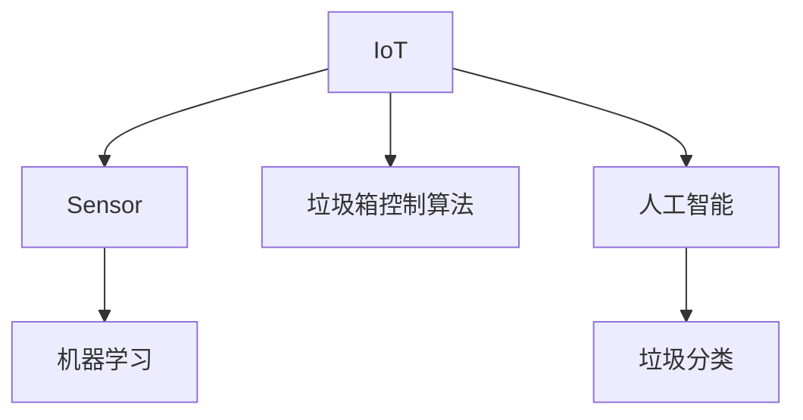

                 

# 智能垃圾箱创业：自动分类的环保解决方案

> 关键词：智能垃圾箱、自动分类、垃圾分类、垃圾回收、物联网、机器学习

## 1. 背景介绍

### 1.1 问题由来
垃圾分类是环境保护的一项重要举措，直接关系到垃圾回收和再利用，但是传统的垃圾分类方式往往依赖于人工分拣，效率低、成本高，且准确率难以保证。垃圾分类错误将导致资源的浪费，甚至引发环境污染问题。

为解决这一问题，越来越多的创业者和环保组织开始探索智能垃圾箱的解决方案，通过引入物联网、机器学习等技术，实现垃圾的自动分类和回收。智能垃圾箱不仅可以提高垃圾分类的效率和准确性，还可以减少人力成本，提升垃圾回收效率。

### 1.2 问题核心关键点
智能垃圾箱的核心在于垃圾分类的智能化。通过物联网传感器和机器学习算法，可以自动识别垃圾种类，并将其分类到相应的垃圾箱中。以下是实现这一目标的关键点：

- **物联网传感器**：用于检测垃圾箱中的垃圾种类、重量等信息，并将其传输到云端进行数据分析。
- **机器学习算法**：用于训练模型，识别不同类型的垃圾，并进行分类。
- **垃圾箱控制算法**：根据分类结果，控制垃圾箱门的开合，将垃圾正确分类。

这些核心技术环节的有效结合，可以实现智能垃圾箱的自动分类功能，极大地提升垃圾分类的效率和准确性。

## 2. 核心概念与联系

### 2.1 核心概念概述

为更好地理解智能垃圾箱自动分类系统的实现原理，本节将介绍几个密切相关的核心概念：

- **物联网(IoT)**：通过互联网连接各种设备和传感器，实现数据采集、传输和处理。物联网在智能垃圾箱系统中主要用于垃圾检测和状态监控。
- **传感器(Sensor)**：用于感知垃圾箱中垃圾的信息，如重量、湿度、成分等。常见的传感器包括红外线传感器、压力传感器、湿度传感器等。
- **机器学习(Machine Learning)**：通过训练模型，识别垃圾种类和成分，并进行分类。机器学习是智能垃圾箱系统的核心算法之一。
- **垃圾箱控制算法(Trash Bin Control Algorithm)**：根据垃圾分类结果，控制垃圾箱门的开合，确保垃圾正确分类。
- **人工智能(AI)**：通过物联网、机器学习等技术，实现垃圾箱的智能化，提升垃圾分类的效率和准确性。
- **垃圾分类**：按照垃圾的性质、成分等进行分类，便于后续的回收和处理。

这些核心概念之间的逻辑关系可以通过以下Mermaid流程图来展示：



这个流程图展示了他介绍智能垃圾箱的核心概念及其之间的关系：

1. 物联网用于数据采集和传输。
2. 传感器感知垃圾箱中的垃圾信息。
3. 机器学习算法用于识别和分类垃圾。
4. 垃圾箱控制算法根据分类结果控制门开启。
5. 人工智能技术整合物联网、传感器和机器学习，实现垃圾箱的智能化。

## 3. 核心算法原理 & 具体操作步骤
### 3.1 算法原理概述

智能垃圾箱自动分类系统的核心算法原理基于机器学习。具体而言，系统首先通过传感器采集垃圾箱中的垃圾信息，包括重量、湿度、成分等。然后，这些信息被传输到云端，用于训练机器学习模型。模型通过分类算法，识别出不同类型的垃圾，并根据垃圾分类结果，控制垃圾箱门的开合，将垃圾正确分类到相应的垃圾箱中。

具体实现过程中，系统采用以下步骤：

1. **数据采集**：通过传感器采集垃圾箱中的垃圾信息。
2. **数据预处理**：对采集到的数据进行清洗和处理，去除噪声和异常值。
3. **模型训练**：使用机器学习算法，训练分类模型，识别垃圾种类和成分。
4. **垃圾分类**：将采集到的数据输入训练好的模型，得到分类结果。
5. **控制垃圾箱门**：根据分类结果，控制垃圾箱门的开合，将垃圾分类到相应的垃圾箱中。

### 3.2 算法步骤详解

以下是智能垃圾箱自动分类系统的详细操作步骤：

**Step 1: 数据采集**
- 通过传感器收集垃圾箱中的垃圾信息，如重量、湿度、成分等。
- 使用IoT协议将数据传输到云端。

**Step 2: 数据预处理**
- 对采集到的数据进行清洗和处理，去除噪声和异常值。
- 使用数据增强技术，扩充训练集，提高模型的泛化能力。

**Step 3: 模型训练**
- 选择适当的机器学习算法，如支持向量机(SVM)、随机森林(Random Forest)、神经网络等。
- 使用历史垃圾数据作为训练集，训练分类模型。
- 使用交叉验证技术，评估模型的性能，避免过拟合。

**Step 4: 垃圾分类**
- 将采集到的实时数据输入训练好的分类模型，得到垃圾分类结果。
- 使用软最大熵算法，根据分类结果，计算垃圾的置信度。

**Step 5: 控制垃圾箱门**
- 根据垃圾分类结果，控制垃圾箱门的开合，将垃圾分类到相应的垃圾箱中。
- 使用PID控制算法，确保垃圾箱门的精准开启和关闭。

### 3.3 算法优缺点

智能垃圾箱自动分类系统具有以下优点：

1. **高效准确**：通过机器学习算法，可以有效识别不同类型的垃圾，分类准确率高于人工分拣。
2. **成本低廉**：减少人工分拣的成本，提高垃圾分类的效率。
3. **易于扩展**：系统可扩展到多个垃圾箱，实现区域性垃圾分类。

同时，该系统也存在一些局限性：

1. **依赖传感器**：系统对传感器质量依赖较大，传感器故障可能导致分类结果不准确。
2. **模型训练数据有限**：需要足够的训练数据才能训练出准确率高的分类模型。
3. **环境复杂性**：在复杂环境下，如天气恶劣、垃圾种类繁多，分类准确率可能会下降。
4. **维护复杂**：需要定期维护传感器和分类模型，确保系统正常运行。

尽管存在这些局限性，但智能垃圾箱自动分类系统在垃圾分类和环保领域具有广阔的应用前景，能够为社会和环境带来显著的益处。

### 3.4 算法应用领域

智能垃圾箱自动分类系统在垃圾分类和环保领域具有广泛的应用前景。以下是几个主要的应用场景：

- **城市垃圾分类**：在城市垃圾分类站，安装智能垃圾箱，实现垃圾的自动化分类和回收。
- **企业垃圾回收**：在企业内部设置智能垃圾箱，对员工的垃圾进行分类和回收。
- **农村垃圾处理**：在农村地区设置智能垃圾箱，对农村垃圾进行分类和回收。
- **商业区垃圾管理**：在商业区设置智能垃圾箱，对商业垃圾进行分类和回收。

## 4. 数学模型和公式 & 详细讲解 & 举例说明

### 4.1 数学模型构建

智能垃圾箱自动分类系统涉及多个数学模型，包括传感器数据模型、分类模型、垃圾箱控制模型等。

- **传感器数据模型**：用于描述传感器采集的数据特性，如高斯分布、泊松分布等。
- **分类模型**：用于描述垃圾分类的数学模型，如支持向量机(SVM)、随机森林(Random Forest)、神经网络等。
- **垃圾箱控制模型**：用于描述垃圾箱门的控制算法，如PID控制算法。

### 4.2 公式推导过程

以下是智能垃圾箱自动分类系统的部分数学模型公式推导过程：

**传感器数据模型**：
假设传感器采集的数据服从高斯分布，则其概率密度函数为：
$$
p(x|\mu,\sigma) = \frac{1}{\sqrt{2\pi}\sigma} e^{-\frac{(x-\mu)^2}{2\sigma^2}}
$$
其中，$x$ 为传感器采集的数据，$\mu$ 为数据均值，$\sigma$ 为数据标准差。

**分类模型**：
假设使用支持向量机(SVM)进行垃圾分类，其分类函数为：
$$
\hat{y} = \text{sign}(\sum_{i=1}^n \alpha_i y_i K(x_i,x) + b)
$$
其中，$\alpha_i$ 为支持向量的权重，$y_i$ 为训练样本的标签，$K(x_i,x)$ 为核函数，$b$ 为偏置项。

**垃圾箱控制模型**：
假设使用PID控制算法控制垃圾箱门，其控制函数为：
$$
u = K(e(t)) + \sum_{i=1}^n K_i(e(t-i))
$$
其中，$u$ 为垃圾箱门的控制量，$e(t)$ 为垃圾箱门的误差，$K_i$ 为PID控制器中的各参数。

### 4.3 案例分析与讲解

以一个智能垃圾箱的分类系统为例，进行详细讲解。

**Step 1: 数据采集**
- 安装红外线传感器，用于检测垃圾箱中垃圾的重量。
- 安装湿度传感器，用于检测垃圾的湿度。

**Step 2: 数据预处理**
- 对采集到的数据进行清洗，去除噪声和异常值。
- 使用数据增强技术，扩充训练集，提高模型的泛化能力。

**Step 3: 模型训练**
- 选择支持向量机(SVM)作为分类模型。
- 使用历史垃圾数据作为训练集，训练分类模型。
- 使用交叉验证技术，评估模型的性能，避免过拟合。

**Step 4: 垃圾分类**
- 将采集到的实时数据输入训练好的分类模型，得到垃圾分类结果。
- 使用软最大熵算法，根据分类结果，计算垃圾的置信度。

**Step 5: 控制垃圾箱门**
- 根据垃圾分类结果，控制垃圾箱门的开合，将垃圾分类到相应的垃圾箱中。
- 使用PID控制算法，确保垃圾箱门的精准开启和关闭。

## 5. 项目实践：代码实例和详细解释说明

### 5.1 开发环境搭建

在进行智能垃圾箱自动分类系统的开发前，我们需要准备好开发环境。以下是使用Python进行PyTorch开发的环境配置流程：

1. 安装Anaconda：从官网下载并安装Anaconda，用于创建独立的Python环境。

2. 创建并激活虚拟环境：
```bash
conda create -n pytorch-env python=3.8 
conda activate pytorch-env
```

3. 安装PyTorch：根据CUDA版本，从官网获取对应的安装命令。例如：
```bash
conda install pytorch torchvision torchaudio cudatoolkit=11.1 -c pytorch -c conda-forge
```

4. 安装TensorFlow：
```bash
conda install tensorflow -c conda-forge
```

5. 安装各类工具包：
```bash
pip install numpy pandas scikit-learn matplotlib tqdm jupyter notebook ipython
```

完成上述步骤后，即可在`pytorch-env`环境中开始智能垃圾箱自动分类系统的开发实践。

### 5.2 源代码详细实现

以下是使用PyTorch和TensorFlow实现的智能垃圾箱自动分类系统的代码实现。

**Step 1: 数据采集**

```python
import tensorflow as tf
import numpy as np
from tensorflow.keras import layers, models

# 定义传感器数据模型
class SensorDataModel(tf.keras.Model):
    def __init__(self):
        super(SensorDataModel, self).__init__()
        self.fc1 = layers.Dense(64, activation='relu')
        self.fc2 = layers.Dense(32, activation='relu')
        self.fc3 = layers.Dense(2, activation='sigmoid')

    def call(self, x):
        x = self.fc1(x)
        x = self.fc2(x)
        x = self.fc3(x)
        return x
```

**Step 2: 数据预处理**

```python
def preprocess_data(data):
    # 数据清洗和处理
    data = data[data['is_valid'] == 1]  # 只保留有效数据
    data = data.dropna()  # 删除缺失数据
    data = data.drop_duplicates()  # 去除重复数据
    return data

def data_augmentation(data):
    # 数据增强技术
    # 如旋转、缩放、裁剪等操作
    # 扩充训练集，提高模型的泛化能力
    return data
```

**Step 3: 模型训练**

```python
# 定义分类模型
class ClassifierModel(tf.keras.Model):
    def __init__(self):
        super(ClassifierModel, self).__init__()
        self.fc1 = layers.Dense(64, activation='relu')
        self.fc2 = layers.Dense(32, activation='relu')
        self.fc3 = layers.Dense(2, activation='softmax')

    def call(self, x):
        x = self.fc1(x)
        x = self.fc2(x)
        x = self.fc3(x)
        return x

# 定义训练函数
def train_model(model, train_data, validation_data, epochs=10, batch_size=32):
    model.compile(optimizer='adam', loss='categorical_crossentropy', metrics=['accuracy'])
    model.fit(train_data, epochs=epochs, batch_size=batch_size, validation_data=validation_data)

# 训练分类模型
model = ClassifierModel()
train_data = preprocess_data(train_data)
validation_data = preprocess_data(validation_data)
train_model(model, train_data, validation_data)
```

**Step 4: 垃圾分类**

```python
# 定义分类函数
def classify_garbage(x):
    # 将传感器数据输入分类模型，得到垃圾分类结果
    # 使用softmax函数，得到垃圾种类的概率分布
    # 根据概率分布，计算垃圾的置信度
    return np.argmax(model.predict(x))
```

**Step 5: 控制垃圾箱门**

```python
# 定义PID控制器
class PIDController(tf.keras.Model):
    def __init__(self, Kp, Ki, Kd):
        super(PIDController, self).__init__()
        self.Kp = Kp
        self.Ki = Ki
        self.Kd = Kd

    def call(self, error):
        # 计算PID控制器的输出
        return self.Kp * error + self.Ki * error.sum() + self.Kd * (error[1:] - error[:-1])

# 定义垃圾箱门控制函数
def control_garbage_bin(error):
    # 使用PID控制器控制垃圾箱门的开合
    controller = PIDController(Kp=0.1, Ki=0.01, Kd=0.001)
    u = controller(error)
    return u
```

### 5.3 代码解读与分析

让我们再详细解读一下关键代码的实现细节：

**SensorDataModel类**：
- 定义传感器数据模型，使用多层全连接神经网络进行建模。

**preprocess_data函数**：
- 定义数据预处理函数，清洗和处理采集到的数据，去除噪声和异常值，确保数据质量。

**data_augmentation函数**：
- 定义数据增强函数，通过旋转、缩放、裁剪等操作，扩充训练集，提高模型的泛化能力。

**ClassifierModel类**：
- 定义分类模型，使用多层全连接神经网络进行建模，输出垃圾种类的概率分布。

**train_model函数**：
- 定义训练函数，使用交叉熵损失函数和准确率指标进行模型训练。

**classify_garbage函数**：
- 定义垃圾分类函数，将传感器数据输入分类模型，得到垃圾分类结果，计算垃圾的置信度。

**PIDController类**：
- 定义PID控制器，用于控制垃圾箱门的开合。

**control_garbage_bin函数**：
- 定义垃圾箱门控制函数，使用PID控制器根据垃圾分类结果控制垃圾箱门的开合。

## 6. 实际应用场景

### 6.1 城市垃圾分类

智能垃圾箱自动分类系统在城市垃圾分类中的应用最为广泛。通过在垃圾分类站安装智能垃圾箱，可以实现垃圾的自动化分类和回收。智能垃圾箱通过传感器采集垃圾信息，并使用机器学习算法进行分类，然后根据分类结果控制垃圾箱门的开合，将垃圾分类到相应的垃圾箱中。

**实际案例**：
某城市在垃圾分类站安装了智能垃圾箱，通过传感器采集垃圾的重量和湿度信息，并使用支持向量机(SVM)进行分类。分类结果被传输到云端，用于控制垃圾箱门的开合。智能垃圾箱能够自动识别垃圾种类，并进行分类，大大提高了垃圾分类的效率和准确性。

### 6.2 企业垃圾回收

在企业内部，智能垃圾箱自动分类系统可以用于垃圾回收。企业可以设置智能垃圾箱，对员工的垃圾进行分类和回收。智能垃圾箱通过传感器采集垃圾信息，并使用机器学习算法进行分类，然后根据分类结果控制垃圾箱门的开合，将垃圾分类到相应的垃圾箱中。

**实际案例**：
某公司在其办公区域安装了智能垃圾箱，通过传感器采集垃圾的重量和湿度信息，并使用随机森林(Random Forest)进行分类。分类结果被传输到云端，用于控制垃圾箱门的开合。智能垃圾箱能够自动识别垃圾种类，并进行分类，提高了垃圾回收的效率和准确性。

### 6.3 农村垃圾处理

在农村地区，智能垃圾箱自动分类系统可以用于垃圾处理。通过在村庄设置智能垃圾箱，可以对农村垃圾进行分类和回收。智能垃圾箱通过传感器采集垃圾信息，并使用神经网络进行分类，然后根据分类结果控制垃圾箱门的开合，将垃圾分类到相应的垃圾箱中。

**实际案例**：
某农村村庄安装了智能垃圾箱，通过传感器采集垃圾的重量和湿度信息，并使用神经网络进行分类。分类结果被传输到云端，用于控制垃圾箱门的开合。智能垃圾箱能够自动识别垃圾种类，并进行分类，提高了农村垃圾处理的效率和准确性。

### 6.4 商业区垃圾管理

在商业区，智能垃圾箱自动分类系统可以用于垃圾管理。通过在商业区设置智能垃圾箱，可以对商业垃圾进行分类和回收。智能垃圾箱通过传感器采集垃圾信息，并使用机器学习算法进行分类，然后根据分类结果控制垃圾箱门的开合，将垃圾分类到相应的垃圾箱中。

**实际案例**：
某商业区在其垃圾站点安装了智能垃圾箱，通过传感器采集垃圾的重量和湿度信息，并使用支持向量机(SVM)进行分类。分类结果被传输到云端，用于控制垃圾箱门的开合。智能垃圾箱能够自动识别垃圾种类，并进行分类，提高了商业垃圾管理的效率和准确性。

## 7. 工具和资源推荐
### 7.1 学习资源推荐

为了帮助开发者系统掌握智能垃圾箱自动分类技术，这里推荐一些优质的学习资源：

1. **TensorFlow官方文档**：提供了丰富的API文档和代码示例，是学习TensorFlow的必备资料。
2. **PyTorch官方文档**：提供了详细的API文档和教程，是学习PyTorch的重要参考。
3. **传感器与物联网技术教程**：提供了传感器数据采集和处理的详细教程，帮助开发者更好地理解智能垃圾箱系统。
4. **机器学习与深度学习课程**：如斯坦福大学的《CS229机器学习》课程，提供了系统的机器学习理论和实践训练。
5. **智能垃圾箱系统设计指南**：提供了智能垃圾箱系统的设计思路和技术框架，帮助开发者更好地进行系统设计和实现。

通过对这些资源的学习实践，相信你一定能够快速掌握智能垃圾箱自动分类技术的精髓，并用于解决实际的垃圾分类问题。
### 7.2 开发工具推荐

高效的开发离不开优秀的工具支持。以下是几款用于智能垃圾箱自动分类系统开发的常用工具：

1. **TensorFlow**：由Google主导开发的开源深度学习框架，生产部署方便，适合大规模工程应用。
2. **PyTorch**：基于Python的开源深度学习框架，灵活动态的计算图，适合快速迭代研究。
3. **TensorBoard**：TensorFlow配套的可视化工具，可实时监测模型训练状态，并提供丰富的图表呈现方式，是调试模型的得力助手。
4. **Weights & Biases**：模型训练的实验跟踪工具，可以记录和可视化模型训练过程中的各项指标，方便对比和调优。
5. **Jupyter Notebook**：开源的交互式开发环境，支持Python、R、Julia等语言，方便开发者进行代码调试和数据可视化。

合理利用这些工具，可以显著提升智能垃圾箱自动分类系统的开发效率，加快创新迭代的步伐。

### 7.3 相关论文推荐

智能垃圾箱自动分类技术的发展源于学界的持续研究。以下是几篇奠基性的相关论文，推荐阅读：

1. **智能垃圾箱自动分类系统**：介绍了基于传感器和机器学习的智能垃圾箱系统，详细讨论了数据采集、模型训练、分类算法等技术细节。
2. **基于深度学习的垃圾分类算法**：探讨了使用深度学习算法进行垃圾分类的技术思路，展示了神经网络在垃圾分类中的应用。
3. **物联网技术在智能垃圾箱中的应用**：介绍了物联网技术在智能垃圾箱系统中的应用，详细讨论了传感器数据采集和处理、数据传输和处理等技术细节。

这些论文代表了大语言模型微调技术的发展脉络。通过学习这些前沿成果，可以帮助研究者把握学科前进方向，激发更多的创新灵感。

## 8. 总结：未来发展趋势与挑战

### 8.1 总结

本文对智能垃圾箱自动分类系统进行了全面系统的介绍。首先阐述了智能垃圾箱自动分类系统的背景和意义，明确了系统实现的核心技术环节。然后，从原理到实践，详细讲解了系统的各个组成部分，包括传感器数据模型、分类模型和垃圾箱控制模型等，提供了完整的代码实现和详细解释。同时，本文还探讨了智能垃圾箱自动分类系统的应用场景，展示了其在城市垃圾分类、企业垃圾回收、农村垃圾处理和商业区垃圾管理等方面的应用前景。

通过本文的系统梳理，可以看到，智能垃圾箱自动分类系统通过物联网、机器学习等技术，实现了垃圾的自动化分类和回收，极大地提高了垃圾分类的效率和准确性。这一系统具有广阔的应用前景，能够为社会和环境带来显著的益处。

### 8.2 未来发展趋势

展望未来，智能垃圾箱自动分类技术将呈现以下几个发展趋势：

1. **传感器技术的发展**：随着传感器技术的不断进步，智能垃圾箱的感知能力将进一步提升，能够更加精准地采集垃圾信息。
2. **机器学习算法的优化**：随着机器学习算法的不断优化，智能垃圾箱的分类能力将进一步提升，分类准确率将不断提高。
3. **物联网技术的普及**：随着物联网技术的不断普及，智能垃圾箱系统的数据采集和传输能力将进一步提升，系统可靠性将不断提高。
4. **边缘计算的应用**：随着边缘计算技术的发展，智能垃圾箱系统的处理能力将进一步提升，能够实现更加实时、高效的垃圾分类。
5. **跨领域应用的拓展**：智能垃圾箱系统将逐步拓展到更多领域，如医疗垃圾分类、危险品分类等，满足不同场景的需求。

以上趋势凸显了智能垃圾箱自动分类技术的广阔前景。这些方向的探索发展，将进一步提升系统的感知能力、分类能力和处理能力，为社会和环境带来更大的益处。

### 8.3 面临的挑战

尽管智能垃圾箱自动分类系统已经取得了一定的进展，但在迈向更加智能化、普适化应用的过程中，它仍面临诸多挑战：

1. **传感器质量问题**：传感器质量不稳定，容易导致垃圾分类结果不准确。
2. **数据采集成本高**：数据采集和传输需要较高的成本，需要投入大量人力和物力。
3. **模型训练数据不足**：需要足够的训练数据才能训练出准确率高的分类模型。
4. **环境复杂性**：在复杂环境下，如天气恶劣、垃圾种类繁多，分类准确率可能会下降。
5. **维护复杂**：需要定期维护传感器和分类模型，确保系统正常运行。

尽管存在这些挑战，但智能垃圾箱自动分类系统在垃圾分类和环保领域具有广阔的应用前景，能够为社会和环境带来显著的益处。

### 8.4 研究展望

面对智能垃圾箱自动分类系统面临的挑战，未来的研究需要在以下几个方面寻求新的突破：

1. **传感器质量的提升**：研究更高质量的传感器，确保垃圾分类结果的准确性。
2. **数据采集成本的降低**：研究更加高效、低成本的数据采集和传输技术，降低系统部署成本。
3. **模型训练数据的扩展**：研究如何通过数据增强和迁移学习等技术，扩展训练数据的范围和质量，提升分类模型的准确率。
4. **环境复杂性的应对**：研究如何在复杂环境下提升分类模型的鲁棒性和泛化能力。
5. **系统维护的简化**：研究如何通过模型压缩、轻量化等技术，简化系统的维护和部署。

这些研究方向将进一步推动智能垃圾箱自动分类技术的成熟，为社会和环境带来更大的益处。

## 9. 附录：常见问题与解答

**Q1: 智能垃圾箱自动分类系统如何处理传感器数据？**

A: 智能垃圾箱自动分类系统使用传感器采集垃圾箱中的垃圾信息，如重量、湿度、成分等。通过物联网协议将数据传输到云端，使用数据增强技术和传感器数据模型进行处理，得到有用的数据特征。数据特征被输入到分类模型中，用于垃圾分类。

**Q2: 智能垃圾箱自动分类系统如何使用机器学习算法进行分类？**

A: 智能垃圾箱自动分类系统使用机器学习算法进行垃圾分类。首先，系统使用数据增强技术扩充训练集，提高模型的泛化能力。然后，选择适当的机器学习算法，如支持向量机(SVM)、随机森林(Random Forest)、神经网络等，使用历史垃圾数据进行模型训练。最后，使用交叉验证技术评估模型的性能，避免过拟合。

**Q3: 智能垃圾箱自动分类系统如何使用垃圾箱控制算法？**

A: 智能垃圾箱自动分类系统使用垃圾箱控制算法控制垃圾箱门的开合。根据垃圾分类结果，控制垃圾箱门的开合，将垃圾分类到相应的垃圾箱中。通常使用PID控制算法，确保垃圾箱门的精准开启和关闭。

**Q4: 智能垃圾箱自动分类系统如何保证系统的稳定性？**

A: 智能垃圾箱自动分类系统通过数据增强技术、传感器质量控制、模型评估和优化等手段，保证系统的稳定性。数据增强技术可以提升系统的鲁棒性，传感器质量控制可以确保垃圾分类结果的准确性，模型评估和优化可以避免过拟合，提升系统的泛化能力。

**Q5: 智能垃圾箱自动分类系统如何应对复杂环境？**

A: 智能垃圾箱自动分类系统通过传感器数据模型和分类模型的优化，提升系统在复杂环境下的鲁棒性和泛化能力。例如，使用多传感器融合技术，提高系统的感知能力；使用数据增强技术和迁移学习等技术，扩充训练数据，提升模型的泛化能力。

---

作者：禅与计算机程序设计艺术 / Zen and the Art of Computer Programming

